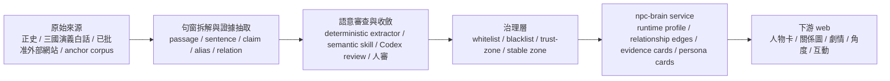

<!-- doc_id: doc_ai_npc_brain_handoff_2026_05_29 -->
# `npc-brain` 資料演進與交接摘要

## 摘要
- 這份文件是給下一位 AI 的交接摘要，目標是讓它快速理解 `npc-brain` 的資料是怎麼從原始來源一路演進到服務端，再被下游 web 消費。
- 目前整體原則不是「用更多硬規則去猜資料」，而是「用可定位證據、版本化快取、白黑名單與信任區」逐步收斂成最真實、最穩定的人物資料卡。
- 任何新的關係、角度、事件或人物別名，都應優先回到上游證據鏈增厚，再經由 review / trust-zone / service 串起來，不要在下游直接寫死。

## 資料演進主線

## 這條線實際在做什麼
- 上游先把可信來源切成可定位的句窗與段落，保存原文、章回、來源、定位、信心與版本。
- 接著做人物中心抽取，而不是只做 pair 猜測。也就是先以「某個人物」為中心，從句窗裡找出這個人與其他人的硬關係、事件、情緒、陣營與階段性關聯。
- 關係抽取完成後，不直接當作正式真理，而是送進 semantic review / Codex skill / 人工審核，形成 supported / rejected / proposal-only 的治理結果。
- 通過的高信任資料會進 trust-zone，成為穩定白名單或穩定基線；被證實錯誤的資料則進黑名單，避免反覆污染後續推理。
- `npc-brain service` 只讀這些已收斂的 runtime 資料，組成 persona、relationship edges、evidence cards、activity seeds、interaction targets 等 payload，供下游 web 呈現。

## `npc-brain service` 的角色
- 服務端不是證據來源本身，而是「把已收斂資料組裝成可讀、可互動、可回放的人物資料卡」。
- 服務端會優先讀取：
  - `runtime-general-profiles`
  - `relationship edges`
  - `evidence cards`
  - `persona cards`
  - `source event packets`
  - `runtime profile` 與相關治理檔
- 下游 web 看到的不是單一 SQL 結果，而是由上游證據鏈、白黑名單、信任區、版本 metadata 一起組合出的最終人物視圖。

## 版本與刷新原則
- 這條線現在有一個很重要的保障：`dataVersion` 與 `artifactVersion` 都要是可比對、可刷新、可重現的。
- `dataVersion` 視為固定 semver，用來描述資料語意版本。
- `artifactVersion` 視為資料身份版本，用來判斷這次讀到的是不是同一批 artifact basis。
- `artifactVersionKind` 必須明確標示，且跨 kind 一律視為需要刷新。
- 目前最重要的修正是讓 refresh 使用一致的 artifact basis，避免同樣內容因掃描順序不同而產生不同 hash。
- 這代表後續只要資料沒變、身份沒變，就應該穩定回傳 `fresh`；資料變了或 identity 變了，就回傳 `stale-cache` 並刷新。

## 白黑名單與信任區
- 白名單是「已被證實正確」的穩定知識，例如人物別名、硬關係、穩定君臣、穩定配偶、穩定親子、穩定結義等。
- 黑名單是「已被證實錯誤」或明確不成立的關係，之後遇到時要直接扣分或排除。
- 信任區是介於兩者之間的高信心資料區，用來節省算力，避免重複審查已經穩定的材料。
- 下一位 AI 不要把白黑名單當成裝飾，這些是推理與排序的硬約束，會直接影響後續 queue、review 與 web 顯示。

## 目前已經收斂出的工作模式
- 先以 top50 為核心，做人物中心抽取。
- 先補硬關係，再補次級關係與事件角度。
- 先讓 sentence-level / skill-level 的候選變乾淨，再進人工審核。
- 先用上游證據把關係拆正確，再回灌 trust-zone，最後才讓 service 與 web 消費。
- 任何「看起來很像」但不能被證據支持的項目，都應先停留在 proposal-only，不要直接升白名單。

## 給下一位 AI 的工作指引
1. 優先看上游證據，再看 service，再看 web，不要倒過來。
2. 任何新關係都要有來源句、章回定位與信心，不能只靠印象補。
3. 別名、君主、親屬、配偶、結義、陣營這些都應先用資料驅動收斂，避免硬寫死人物特例。
4. 如果發現 `fresh` 判斷不穩定，先檢查版本 metadata 與 artifact basis，不要先怪下游 UI。
5. 如果看到錯關係出現在畫面上，先往上游追證據鏈與 trust-zone，而不是在 web 端加補丁。

## 目前最重要的落地目標
- 讓原始來源持續增厚 anchor corpus。
- 讓 top50 的硬關係、別名、事件與角度都可被回放與審核。
- 讓 `npc-brain service` 只讀已收斂資料，不再從不穩定來源直接猜。
- 讓下游 web 看到的是「版本正確、證據可追、關係可信」的人物資料卡。

## 交接備註
- 這份摘要的目的，是讓下一位 AI 能快速知道：這不是單純的內容生成專案，而是一條從來源、證據、治理、版本到 service 的資料演進管線。
- 若之後要改流程，請先確認 keep / 治理 / 版本語意是否一致，再動手改上游或 service。
