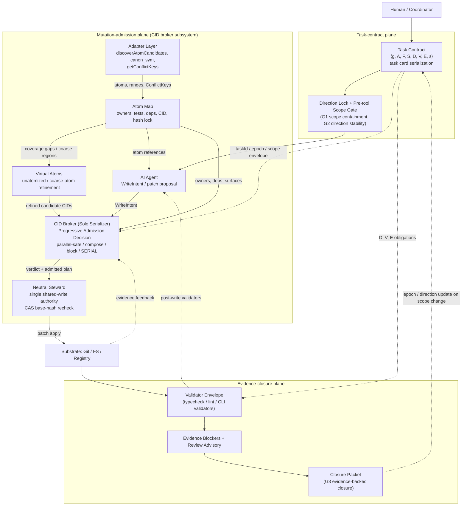
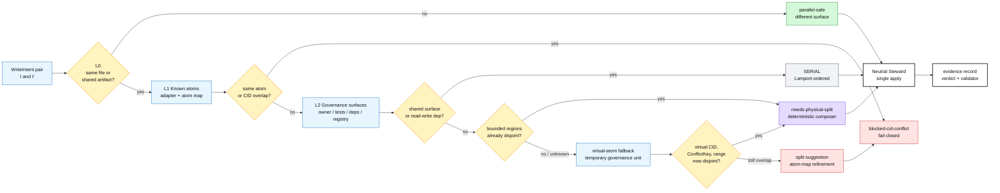
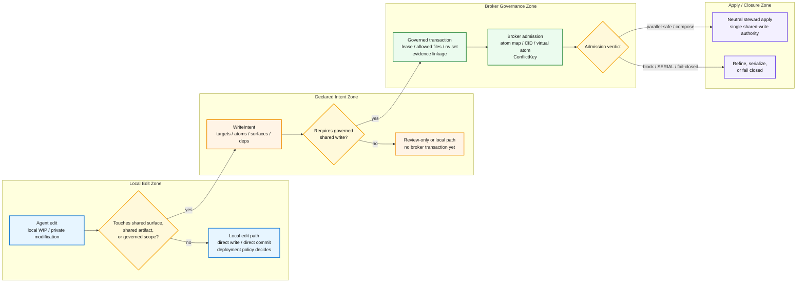
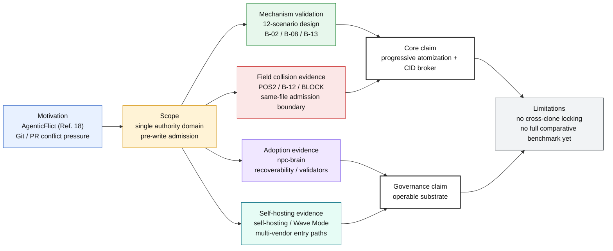

# ATM: Adapter-Guided Atomization and CID-Brokered Admission for Single-Domain Multi-Vendor LLM Code Co-Synthesis
### A Specification-Grounded Governance Substrate for Software Agents

Eaglhuang  
eaglhuang@gmail.com  
2026-06-23

## Abstract

Multi-agent LLM systems can decompose software-engineering tasks into planning, generation, validation, and repair. A narrower systems gap remains: after several agents have formed write intents within the same controlled filesystem, worktree, or service domain, but before any governed shared mutation is applied, the system must determine which intents may proceed in parallel, which require deterministic composition or serialization, and which must fail closed. To address this gap, we present the AI-Atomic-Framework (ATM), a specification-to-evidence governance substrate for software agents operating within a single governance domain.

ATM binds task intent, repository scope, write admission, validation, and evidence obligations into a single governance chain. Within this chain, the CID broker serves as the shared-mutation admission subsystem. Adapter-guided atomization maps write intents to semantic atoms and bounded regions; the broker then routes them to parallel admission, deterministic composition, serialization, or fail-closed refinement. When the persistent atom map is incomplete, virtual atoms provide temporary, auditable governance units that preserve bounded-region comparability. Governed shared writes are ultimately applied by a neutral steward rather than directly by the proposing agents.

Evaluation combines controlled, field, adoption, and extension evidence. Controlled evidence includes a 12-scenario deterministic design matrix, three archived runner cases, and ATM-AdmissionBench, in which v0.1 freezes the benchmark substrate and v0.2 provides the paper-facing profile over 20 unique scenarios and 42 mode-level comparisons. The policy, ablation, adversarial, and enforcement rows are derived views of those scenarios rather than independent population samples. Field evidence comprises three archived same-file boundary cases--POS2, B-12, and BLOCK--while a three-week external-adopter study, observations of batch scheduling and CID stability, and an operational recovery-routing benchmark provide complementary evidence of operability, recoverability, and runtime transparency. Taken together, these results support feasibility within the observed single-domain settings, but not broad comparative superiority over alternative concurrency-control systems. ATM neither replaces Git merge nor addresses cross-clone or cross-PR governance; its claim is limited to an implementable, auditable, and incrementally extensible pre-write admission layer for governed shared mutations.

## Introduction

### Motivation

The central question of this paper is not whether individual agents can produce usable code. It is whether, once multiple agents have formed write intents within the same controlled filesystem, worktree, or service domain, the system can determine, before any governed shared mutation is applied, which intents may proceed in parallel, which require deterministic composition or serialization, and which must be blocked. ATM frames this as a pre-write admission problem within a single governance domain. Same-file edits, shared registries, generated artifacts, and task-state machines are treated as different manifestations of the same governance boundary rather than as separate claim scopes. This paper does not address cross-machine clones, remote branches, or PR-level distributed coordination; it focuses on auditable admission decisions made before governed shared-state mutation. This setting lies within the broader LLM-for-SE landscape. The systematic review by Hou et al. (2024, Ref. 42) divides LLM applications in software engineering into code generation, testing, maintenance, and coordination, and identifies multi-agent coordination as an emerging and not-yet-mature area. The pre-write admission layer studied here occupies a specific gap within that coordination subarea.

Recent repository-level code-generation benchmarks show that modern AI coding is no longer limited to a single file or function. RepoBench and CrossCodeEval evaluate repository-level completion and cross-file context use, while FEA-Bench examines feature implementation that requires coordinated modifications across an existing repository (Refs. 33-35). CodeS and NL2Repo-Bench extend the setting to from-scratch repository generation: starting from natural-language requirements and an empty workspace, a system must construct a complete repository, preserve cross-file APIs and package structure, manage dependencies, and pass execution-based tests (Refs. 36, 37). More recent benchmarks, including Commit0, PaperBench, FeatureBench, RACE-bench, SWE-PolyBench, and GitTaskBench, further emphasize long-horizon planning, localized changes, cross-file dependencies, and global consistency (Refs. 43-48). The common implication is not merely that models can modify more files. Repository-level tasks naturally bring multiple shared surfaces into the same delivery path; once several agents participate in one workflow, pre-write governance can no longer be treated as an optional implementation detail.

Multi-agent and concurrency-control research has begun to address shared state directly. CodeTeam reduces cross-file drift during repository construction through machine-checkable contracts, file ownership, and dependency-aware scheduling (Wang et al., 2026, Ref. 25). CoAgent addresses tool- and action-level concurrency over shared agent state through MTPO, filtered reads, notification-guided repair, and saga-style compensation for long-running tasks (Lyu et al., 2026, Ref. 14). S-Bus reconstructs read sets at commit time through HTTP middleware and a DeliveryLog, providing Observable-Read Isolation for shared-shard structural races under an HTTP-observable read projection (Khan, 2026, Ref. 26). In parallel, AgenticFlict documents substantial merge-conflict pressure in large-scale pull requests produced by AI coding agents, indicating that AI-generated changes already impose non-trivial downstream integration costs on Git and PR workflows (Ogenrwot and Businge, 2026, Ref. 18).

Together, these studies delineate the gap targeted by this paper. Repository-level benchmarks establish the multi-file and long-horizon nature of contemporary coding tasks (Refs. 33-37). CodeTeam-style planners move ownership and dependency constraints into the planning stage (Ref. 25). CoAgent- and S-Bus-style systems demonstrate the need for specialized mechanisms over agent-accessible shared state (Refs. 14, 26). AgenticFlict quantifies the downstream pressure that remains when conflicts reach Git and PR integration (Ref. 18). These systems, however, do not directly target a code-region admission layer that operates within a single governance domain before shared-worktree mutation and determines whether bounded regions of the same file may be admitted concurrently under the declared model. ATM therefore asks a narrower and more specific research question: when several LLM agents have already formed write intents within the same controlled filesystem, worktree, or service domain, how can the system make an auditable admission decision before any governed mutation is applied, using atoms, atom maps, virtual atoms, CIDs, and ConflictKeys?

The role of AgenticFlict in this paper must be scoped carefully. Its dataset of more than 142,000 AI-agent pull requests, more than 107,000 deterministic merge simulations, a reported merge-conflict rate of 27.67%, and more than 336,000 fine-grained conflict regions provides quantitative motivation for downstream Git and PR conflict pressure (Ref. 18). These results are not direct evidence that ATM resolves cross-clone or cross-PR conflicts. ATM does not replace Git merge. Instead, it moves the governance point earlier by handling parallel write intents within the same controlled worktree, filesystem, or service domain before the resulting changes enter downstream Git or PR integration.

Existing approaches address different facets of this problem, but they intervene at different coordination layers. Character-level systems such as CodeCRDT provide a low-level convergence substrate for concurrent text editing, while leaving residual semantic conflicts to downstream validation (Ref. 1). Workspace-isolation approaches such as CAID use isolated Git worktrees and structured integration to support asynchronous development, but their principal conflict boundary remains downstream integration (Ref. 15). STORM instead represents a preventive file-level neighbor: it mediates agent interaction with a shared workspace and detects stale or conflicting edits at write time, but it does not target same-file bounded-region admission below the file level (Ref. 3). At a higher protocol layer, MPAC provides multi-principal coordination semantics across session, intent, operation, conflict, and governance layers (Ref. 4), while SCF addresses semantic-intent divergence through process-aware governance and semantic-intent representations (Ref. 2). These systems are therefore adjacent design points rather than direct baselines. What remains largely missing is a single-domain, repository-scoped pre-write admission gate that can determine, before governed mutation is applied, whether same-file bounded regions may be composed, whether shared-surface or read/write dependencies require serialization, or whether insufficiently evidenced cases must fail closed. ATM is proposed to address that narrower admission boundary.

### A False Dichotomy

A common but unnecessary dichotomy presents multi-agent code co-writing as a choice between two extremes. At one end are character-level CRDTs and their text-convergence logic (Ref. 12). At the other is an architecture in which every language and artifact format must first be lifted into a complete AST or global semantic graph before shared-write governance can begin. In practice, existing approaches span a broader coordination stack, including text convergence, region-level comparison, file-level ownership, workflow-level authority, and validation envelopes. Each operates at a different enforcement boundary. For multi-agent writes to a shared codebase, the minimum viable governance unit is therefore neither necessarily a character nor a complete AST. It can instead be an atom, bounded region, CID, or shared surface declared by a domain adapter.

ATM occupies an intermediate design point by combining adapter-guided atomization with brokered admission. An adapter is not required to model the complete semantics of a language or artifact format. Instead, it conservatively declares candidate atoms, source paths, bounded ranges, read/write dependencies, ConflictKeys, and shared surfaces. The broker does not rely on free-form LLM judgment; it produces deterministic admission decisions from these structured declarations. ATM therefore neither delegates all coordination reasoning to an LLM nor forces every language and format into a universal AST. It builds pre-write governance on an engineering-feasible adapter contract and a governance substrate.

More precisely, ATM narrows conflict granularity through a sequence of representation and refinement stages. It first determines whether two intents affect different files or artifacts. It then uses the relevant adapters to identify existing semantic atoms. The atom map connects those atoms to owners, tests, validators, dependencies, and shared surfaces. When the existing atomization is incomplete or too coarse for a reliable comparison, ATM introduces virtual atoms so that previously unatomized regions can still be located, compared, assigned provisional ConflictKeys, and re-hashed into candidate CIDs. If these stages cannot establish an admissible disjoint or composable route under the declared model, the unresolved overlap remains subject to serialization, refinement, or fail-closed containment. ATM is therefore not merely a finer-grained diff mechanism. Its core contribution is a process that converts underspecified write intents into structured and auditable admission evidence. The contributions and empirical evaluation below follow this thread.

### Contributions

This paper does not propose another general-purpose multi-agent orchestrator. It reframes governed shared writes within a single authority domain as a formalizable, computable, and auditable pre-write admission problem. We make three contributions. The evaluation artifacts, adopter study, self-hosting forensics, and limitations are presented in Sections 4-6 as supporting evidence rather than as additional contributions.

1. **Seven-layer pre-write admission with virtual-atom fallback.**
   We propose a seven-layer hard admission gate that evaluates multi-agent write intents through CID identity, shared-surface overlap, read/write dependencies, file-range and virtual-atom refinement, `ConflictKey + canMerge`, CAS base-hash validation, and a fallback file lock. Its purpose is not to repair merge conflicts after changes have already been produced. Instead, before any governed shared mutation is applied, the gate determines whether an intent may proceed in parallel, should be routed to deterministic composition, must be serialized, or must fail closed.

   ATM does not assume that the persistent atom map is complete from the outset. When atomization coverage is partial, when an adapter cannot yet associate every affected region with a stable semantic atom, or when same-file regions cannot be compared reliably at the current granularity, the system introduces virtual atoms as transitional governance units. Virtual atoms allow previously unatomized regions to be located, assigned provisional ConflictKeys, re-hashed into candidate CIDs, and evaluated for bounded-region disjointness. If an admissible route cannot be established under the declared model, the corresponding intent is conservatively serialized, refined, or failed closed to direct apply while its intent evidence is preserved when available. The contribution is therefore not simply to permit more parallelism, but to provide a deterministic gate that progressively transforms coarse file-level contention into auditable admission decisions.

2. **A specification-to-evidence governance substrate.**
   ATM binds shared-write governance to a structured execution contract so that task intent, scope boundaries, validation requirements, and evidence obligations are not dispersed across prompts, human conventions, and ad hoc closure procedures. A task-direction lock, pre-tool scope gate, validator envelope, evidence blocker, review advisory, and closure packet jointly form this substrate. Within it, the CID broker serves as the shared-mutation admission subsystem.

   This substrate does not synchronize agents' latent beliefs, nor does it guarantee end-to-end semantic correctness. Its role is to constrain how specification drift, scope drift, unsupported reasoning, and state drift can become an ungoverned repository mutation or an unauditable task closure. The formal Task Contract, the three governance planes, Governance Invariants G1-G3, and the boundaries between the broker, steward, validators, and closure mechanisms are defined in Section 3.1.

3. **An extensible atomization abstraction with explicit adapter contracts.**
   Our third contribution is not a claim that all languages and artifact formats receive equivalent implementation support. Rather, it elevates atomization from a language-specific technique into an extensible, contract-bound repository-governance interface. An atom is the smallest governable unit that must be distinguished for pre-write arbitration. The atom map aligns bounded surfaces, owners, validators, dependencies, CIDs, hash locks, and shared surfaces in a queryable governance index.

   Through the `AtomizationPlanningAdapter` and `FileMutationAdapter` interfaces, each language or format may independently expose candidate atoms, bounded ranges, read/write dependencies, ConflictKeys, virtual-atom boundaries, merge capabilities, and validation hooks without first being translated into a universal AST. Within the current implementation coverage, TypeScript and Python serve as the reference language paths. Cross-language atom identity and stronger semantic alignment remain open problems.

### Organization

Section 2 positions ATM relative to prior work and identifies the single-domain pre-write admission gap addressed in this paper. Section 3 presents the specification-grounded governance substrate, defines the Task Contract, atoms, atom maps, virtual atoms, and Candidate and Capsule CIDs, and then describes the brokered admission flow, the seven-layer gate, the neutral steward, cross-format generalization, and the explicit scope boundary. Section 4 reports the validation and evidence stack, including deterministic fixtures, self-hosting forensics, the external-adopter study, archived same-file boundary cases, and their alignment with the benchmark claims. Section 5 presents the ATM-AdmissionBench baseline and paper profile, the OperationalBench runtime-overhead supplement, the role-separated audit, the policy and ablation results, and the remaining evaluation limitations. Section 6 discusses the trade-offs and failure modes of adapter-guided governance, open research questions, and deployment topologies. Section 7 concludes.

**Reproducibility.** Every capability described in this paper as implemented and reproducible is backed by an existing source path and an executable verification command in the open-source AI-Atomic-Framework repository (`https://github.com/eaglhuang/AI-Atomic-Framework`). Framework-level implementation claims are anchored to release tag `v0.9.0-alpha.1` (commit `0b31aa8683b44b3a78206132a0bf90a0fde73d1c`). Benchmark-specific claims use the separately frozen generator and publication commits, generated summaries, and artifact-hash manifests listed in Appendices A.1 and A.4. Readers should use these frozen anchors rather than the evolving `main` branch when reproducing results or citing implementation locations. Appendix A.4 maps each capability claim to its implementation path and verification command. Field-evidence packets are indexed under `docs/ai_atomic_framework/broker-collision-evidence/` in the 3KLife planning repository, with public, de-identified, and access-restricted artifacts distinguished in Appendix A.1.

## Related Work

We organize related work along two axes: coordination granularity and the intervention point at which conflicting actions are governed, with particular attention to preventive pre-write admission. This organization is not intended to rank systems along a single quality dimension, but to locate ATM within a broader coordination stack. ATM does not replace CRDTs (Ref. 12), Git, workflow orchestration (Refs. 2, 4, 9), or post-generation validation. Instead, it introduces a governable admission boundary before any governed shared mutation is applied within the same controlled worktree or service domain. Accordingly, Section 2 addresses three narrower questions rather than asking which system is stronger: which studies establish the repository-level task pressure, which systems provide precedents for action-boundary enforcement, and which merge or concurrency-control foundations inform ATM's design.

The discussion is structured as a citation-to-claim map rather than as an inventory of related systems. SWE-bench and related repository-level studies establish that realistic software-engineering tasks require reasoning across functions, files, and repository state (Ref. 29). Multi-agent frameworks such as AutoGen demonstrate that agent orchestration is well established, but they do not generally define ownership or admission semantics for shared repository mutations (Ref. 30). The Adya, OCC, COPS, and CRDT literature provides the systems foundations for isolation, read/write dependencies, causal relationships, and convergent merging (Refs. 12, 13, 31, 32). Among the closest adjacent systems, CoAgent, S-Bus, and ATCC represent agentic concurrency-control substrates; Cordon and Atomix represent transactional tool-effect runtimes; and CodeTeam, SEMAP, MPAC, CodeCRDT, AgentGit, and EvoGit represent repository-level workflow, protocol, or convergence substrates. These works are adjacent design points rather than direct baselines for the present paper. ATM's claim is narrower: it targets repository-scoped pre-write admission for governed shared mutation inside a single governance domain, rather than general serializability recovery, HTTP-observable read isolation, transactional tool-effect settlement, database transaction scheduling, or end-to-end repository generation.

Repository-level benchmarks further show that the multi-file regime does not correspond to a single task family. RepoBench and CrossCodeEval study repository-level completion and cross-file context use within existing codebases (Refs. 33, 34). FEA-Bench shifts the focus to incremental feature implementation, where models must introduce new functionality while coordinating edits across related files in an existing repository (Ref. 35). CodeS and NL2Repo-Bench extend the setting to from-scratch repository generation: starting from natural-language requirements and an empty workspace, a system must construct a complete repository, preserve cross-file APIs and package structure, manage dependencies, and pass execution-based tests (Refs. 36, 37). These benchmarks show that repository-level difficulty changes with the amount and type of existing structure available to the model. ATM studies an orthogonal systems question: regardless of whether the task is completion, feature implementation, or repository generation, when multiple agents form shared write intents within one governance domain, is there an auditable, region-level admission gate before any governed shared mutation is applied?

The table below makes explicit the citation-to-claim map used throughout the remainder of this section. Its purpose is methodological rather than bibliographic: each cited work must support a specific background claim, mechanism comparison, design precedent, or limitation. References are therefore grouped by the role they play in positioning ATM, rather than by topical similarity alone.

**Table 1 — Related-Work Citation-to-Claim Map.**

| Citation cluster | What it establishes | Role in positioning ATM |
|---|---|---|
| RepoBench / CrossCodeEval (Refs. 33, 34) | Existing-repository completion requires cross-file context and repository-state awareness | Establishes multi-file heterogeneity, but not multi-agent mutation admission |
| FEA-Bench (Ref. 35) | Incremental feature implementation requires coordinated additions and edits across an existing repository | Shows how maintenance-style tasks create pressure for coordinated mutation |
| CodeS / NL2Repo-Bench (Refs. 36, 37) | From-scratch repository generation requires architecture, package structure, cross-file APIs, dependency management, and executable validation | Establishes the long-horizon repository-construction setting in which multiple agents may produce shared write intents |
| SWE-bench and recent repository-level benchmarks (Refs. 29, 43-48) | Realistic software-engineering tasks span repository navigation, issue resolution, feature implementation, reconstruction, and multilingual workflows | Provides broader workload and evaluation context; these benchmarks are not themselves concurrency-control mechanisms |
| CodeCRDT / CRDT / OT (Refs. 1, 11, 12, 38, 39) | Concurrent text edits can be transformed or converged through collaborative-editing substrates | Shows that textual convergence alone does not establish region-level admission or end-to-end semantic correctness |
| STORM (Ref. 3) | File versions and observed dependencies can support write-time state mediation and stale-view detection | Represents a preventive file-level neighbor; ATM moves the conflict unit below the file |
| CAID / Git-worktree isolation (Ref. 15) | Agents can be isolated in separate workspaces and integrated afterward | Contrasts post-generation workspace reconciliation with admission before shared-worktree mutation |
| SCF (Ref. 2) | Process context and semantic-intent representations can detect workflow-level disagreement | Represents a higher semantic-governance layer; ATM does not claim equivalent business-level intent reasoning |
| Agentic concurrency-control substrates: CoAgent / S-Bus / ATCC (Refs. 14, 26, 6) | Multi-agent systems require explicit mechanisms for shared state, read-set visibility, long-running agentic transactions, and recovery from contention | Closest concurrency-control neighbors; ATM is narrower because it governs repository-scoped pre-write mutation admission rather than general serializability recovery, HTTP-observable read isolation, or database transaction scheduling |
| Transactional tool-effect runtimes: Cordon / Atomix (Refs. 59, 58) | Tool effects can be staged, validated, settled, compensated, and audited inside task-scoped transactional boundaries | Closest transactional-runtime neighbors; ATM specializes the admission boundary to repository mutation and neutral-steward apply rather than general tool-effect settlement |
| Repository-level workflows, protocols, and convergence substrates: CodeTeam / SEMAP / MPAC / CodeCRDT / AgentGit / EvoGit (Refs. 25, 61, 4, 1, 28, 27) | Repository-level multi-agent work benefits from design sketches, contracts, structured messages, Git-like coordination, and convergence substrates | Important workflow or protocol neighbors; they organize generation or coordination, while ATM adjudicates governed shared mutation before write application |
| AgentSpawn / Rover (Refs. 5, 16) | Post-generation conflicts can be addressed through dynamic agent coordination or LLM-based merge-hunk reasoning | Establishes a later intervention point; ATM acts before governed shared mutation rather than repairing already-materialized changes |
| Sartori / specification-gap analysis (Ref. 10) | Coordination can fail when agents hold incompatible or incomplete assumptions about shared state | Motivates ATM's explicit scope and adapter-trust boundaries, but does not establish admission correctness |
| ColaUntangle (Ref. 62) | Explicit and implicit dependencies can be inferred to partition already-tangled commits | Motivates a possible future semantic-dependency provider; ATM does not currently treat LLM-inferred dependencies as authoritative admission evidence |
| SafeMerge / semistructured merge (Refs. 56, 57) | Semantic conflict-freedom can be checked after versions exist, and partial syntax can improve upon line-based merging without requiring a universal semantic representation | Clarifies the adjacent structured-merge design space; ATM intervenes earlier and does not inherit post-hoc semantic-conflict-freedom guarantees |
| MACOG / ProjectGen / DebateCoder / multi-agent verification and optimization work (Refs. 20-24) | Multi-agent systems can decompose tasks, allocate roles, verify outputs, and optimize generation cost | Represents orchestration, planning, verification, and efficiency work adjacent to, but distinct from, shared-mutation admission |
| Cluster A -- Content grounding and verification: RAG / RARR / CoVe (Refs. 49-51) | Retrieval, attribution, revision, and explicit self-verification can improve the factuality or traceability of generated content | Content-level precedents for evidence grounding only; they do not enforce agent scope, tool use, repository mutation, or task closure |
| Cluster B -- Agent interfaces and runtime policy enforcement: SWE-agent / AgentSpec / ClawGuard (Refs. 52-54) | Agent-computer interfaces and rule-based checks at action boundaries can materially constrain tool-using agent behavior | Closest action-boundary precedent for ATM's task contract and pre-tool scope gate; ATM adds repository-specific mutation admission and evidence-backed closure |
| SyncMind / SyncBench (Ref. 60) | Agents can be evaluated on recovery after their internal state becomes inconsistent with an evolving workspace | Provides an external recoverability workload and motivation; it is not a directly comparable pre-write admission benchmark |
| AgenticFlict (Ref. 18) | AI-generated pull requests create substantial downstream Git / PR merge-conflict pressure | Quantitative motivation only; not direct evidence that ATM resolves cross-clone or cross-PR conflicts |

### Tier 1: Character-Level Concurrency Control

CodeCRDT, EvoGit, and AgentGit can be viewed as low-level merge substrates (Refs. 1, 27, 28). CodeCRDT focuses on how concurrent multi-agent text edits converge and how prior states can be recovered. EvoGit and AgentGit use version-control mechanisms as a synchronization medium across agents. The shared advantage of this tier is generality: the underlying techniques are largely language-neutral and can be integrated with existing editor or version-control workflows. Their shared limitation is that they do not directly provide atom-level or bounded-region pre-write admission. CodeCRDT, for example, reports a preliminary estimate of roughly 5-10% semantic conflicts in an inspected subset, despite character-level convergence; such conflicts may surface only during type checking, linting, or testing (Ref. 1).

The comparison between ATM and CodeCRDT must be scoped carefully, because ATM does not claim to eliminate semantic conflicts. As discussed in Section 4.6 and Section 6.2, ATM's `parallel-safe` verdict establishes only static admission closure under the declared adapter, atom map, and dependency model; it does not guarantee the semantic correctness of the resulting program. The key difference is temporal. CodeCRDT converges concurrent text edits and leaves residual semantic conflicts to downstream type checking, linting, and tests. ATM, by contrast, blocks direct apply or serializes intents that cannot be shown admissible under its declared model, while admitted writes remain subject to validators, CAS base-hash checks, and fail-closed fallbacks. The two systems therefore should not be read as a 0% versus 5-10% comparison. ATM instead shifts a subset of statically observable conflicts earlier in the execution timeline, while residual conflicts remain subject to downstream validation and runtime checks. A quantitative comparison of admission-time false negatives remains part of the deferred comparative evaluation in Section 5.

Tier 1 systems are therefore not direct substitutes for ATM. ATM can be layered over Git, a CRDT substrate (Ref. 12), or a filesystem, but it addresses a narrower, higher-level question: within a single governance domain and before any governed shared mutation is applied, which write intents must be treated as shared-resource conflicts, and which same-file edits may be admitted concurrently under the declared model? Final convergence across clones or remote branches remains the responsibility of the underlying Git, CRDT, or merge substrate.

### Tier 3: File-Level Coordination

STORM performs write-time optimistic concurrency control using file versions and observed dependencies, thereby blocking writes that are based on stale file state (Ref. 3). CAID takes a different route: it assigns agents to isolated Git worktrees and delegates subsequent integration to a central coordinator (Ref. 15). Both approaches strengthen multi-agent workspace safety, but they intervene through different mechanisms: STORM mediates state at write time, whereas CAID isolates execution and reconciles changes afterward.

The file, however, remains a coarse coordination unit. When two agents modify distinct functions in the same file, file-level OCC may conservatively reject one write even when the affected regions are independent. A Git-based isolation workflow, by contrast, determines whether the independently produced changes can be integrated only after both changes already exist. ATM targets this narrower gap through bounded-region admission: it decomposes the notion of "same file" into adapter-declared regions, CIDs, and ConflictKeys that the broker can evaluate before any governed mutation is applied.

### Tier 4: Workflow Governance

SCF and MPAC operate above the code-region layer, but they do so through different governance mechanisms. SCF uses a Semantic Intent Graph to detect process-level conflicts (Ref. 2). MPAC defines a multi-principal coordination protocol with explicit session, intent, operation, conflict, and governance semantics (Ref. 4). Together with adjacent workflow-governance systems, these approaches show that multi-agent coordination is a problem of authority, intent, and governance rather than merely one of merge resolution.

For shared-codebase writes within a single governance domain, however, these higher-level mechanisms do not directly target region-level admission. They may assign responsibility, exchange intent, or organize review, but they do not necessarily determine whether two bounded regions of the same file can be admitted to the same controlled worktree. ATM carries the notion of authority into this lower enforcement boundary by issuing a broker verdict before any governed mutation is applied.

CodeTeam represents a planning-oriented design point for repository-level generation. In its NL2Repo workflow, multiple Architect agents first produce competing software-design sketches. A CTO agent then selects a sketch and normalizes it into a machine-checkable contract. Developer agents subsequently implement against that contract under a dependency-aware scheduler, with responsibilities divided across files and interfaces. A QA agent finally triggers repair after completion or upon test failure (Ref. 25). This design shifts coordination toward planning and static allocation, and is intended to reduce same-file contention before implementation begins.

CodeTeam and ATM therefore address different sharing strategies. CodeTeam primarily avoids same-file contention through design contracts and static ownership. ATM addresses the residual case in which a file must be shared and asks whether bounded regions within it can be admitted concurrently under the declared model. CodeTeam is thus a planning-side repository-construction comparator, whereas ATM is a pre-write mutation-admission layer.

### Tier 2: Adjacent Systems and 2025–2026 Neighboring Work

Comparisons around Tier 2 often conflate three distinct problem classes. The first concerns runtime conflict control over shared state. The second concerns post-hoc merge and repair after candidate changes have already been produced. The third concerns upstream collaboration orchestration. ATM targets a narrow subset of the first class: pre-write admission for governed repository mutations within a single governance domain. It does not target general task orchestration, post-hoc merge repair, or cross-machine and PR-level integration.

CoAgent is one of ATM's closest Tier 2 neighbors (Ref. 14). It begins from the observation that classical two-phase locking and optimistic concurrency control encounter two agent-specific difficulties when multiple sub-agents act on shared state: external side effects may be difficult to stage or reverse, and aborting a long-running task may discard substantial inference and execution effort. Its MTPO mechanism therefore follows an advisory-reactive model at the tool/action level. Fixed ordering and filtered reads expose each agent to a monotone execution view; conflicts trigger notification and local re-evaluation; and saga-style inverse actions compensate for effects that have already been externalized.

ATM intervenes at a different boundary. It performs preventive admission at the code- and artifact-region level: before any governed shared mutation is applied, adapters declare candidate atoms, bounded ranges, shared surfaces, and static dependencies, and the broker evaluates those structured declarations. The two systems are consequently suited to different operating conditions. CoAgent addresses middleware settings in which read sets are difficult to declare in advance and residual tool effects require reactive repair or compensation. ATM addresses settings in which adapters can recover structured mutation scopes over code and other structured artifacts. The approaches are potentially complementary: ATM can arbitrate statically observable conflicts before mutation, while a CoAgent-style layer can manage residual effects that emerge along serialized or post-admission execution paths.

A second cluster comprises post-generation conflict-repair systems whose members intervene through distinct mechanisms. AgentSpawn introduces dynamically spawned sub-agents, memory slicing, and multi-stage conflict merging to support coordination in long-horizon code-generation workflows (Ref. 5). Rover takes a different route: it extracts context from merge-conflict hunks and applies LLM reasoning to propose context-aware resolutions (Ref. 16). Their common characteristic is that the principal conflict-resolution effort occurs after candidate changes have already been produced, rather than at a pre-write admission boundary.

ATM addresses an earlier and narrower question: before a governed shared mutation is applied, which intents may be admitted, which require deterministic composition or serialization, and which must fail closed? Sartori's analysis of the specification gap is relevant to both intervention points (Ref. 10). When agents hold incompatible assumptions about a shared surface, both pre-write admission and post-hoc repair may be affected; the principal distinction is when the inconsistency becomes observable and which recovery mechanisms remain available at that stage.

ColaUntangle represents an adjacent but distinct design point (Ref. 62). It uses LLM-assisted reasoning over explicit and implicit dependencies to partition already-tangled commits after the changes have been produced. ATM does not address commit untangling, nor does it treat LLM-inferred dependencies as authoritative inputs to admission. Its current broker path derives deterministic decisions from adapter-declared atoms, static read/write sets, shared surfaces, and ConflictKeys, while CAS revalidation and validators provide downstream runtime closure. ColaUntangle therefore motivates a possible future semantic-dependency provider rather than serving as a direct comparator for the current ATM system.

Structured and semistructured merge systems provide another important adjacent design point. SafeMerge provides a verification approach for semantic conflict-freedom after divergent program versions have already been produced (Ref. 56). Semistructured merge approaches use partial or configurable program structure to reduce the limitations of line-based merging without requiring a complete semantic model (Ref. 57). Their common characteristic is that their analyses operate over already materialized candidate versions rather than at a pre-write admission boundary. ATM intervenes earlier: before any governed shared mutation is applied to the worktree, it derives conservative atom-, region-, and shared-surface conflict abstractions under the declared admission model. ATM therefore does not inherit the semantic conflict-freedom guarantees of these systems. Instead, this body of work helps explain why ATM rejects both purely textual merging and a mandatory universal-AST-first design.

Recent transactional-agent runtimes examine a related but distinct question: when tool effects may safely become durable. Atomix separates execution from settlement through epochs, resource scopes, frontiers, and compensation (Ref. 58). Cordon introduces task-scoped transactions that stage effects, validate them, and associate them with audit metadata before making them durable (Ref. 59). Both systems separate effect production from effect settlement and make recovery semantics explicit. ATM occupies a repository-specific point in this design space: adapter-guided atoms and ConflictKeys determine which governed shared mutations may be admitted under the declared model, and the neutral steward executes the admitted plan. These systems are complementary rather than interchangeable.

SEMAP and ATM both adopt contract-based governance, but they bind their contracts to different enforcement objects (Ref. 61). SEMAP centers on the agent role, using required input artifacts, expected output artifacts, structured messaging, and lifecycle verification to reduce under-specification, coordination misalignment, and verification failure. ATM binds a task-scoped execution contract to allowed resources, forbidden predicates, repository scope, validators, evidence obligations, and a direction epoch, and connects this contract to atoms, CIDs, ConflictKeys, the active registry, CAS revalidation, and the neutral steward. ATM therefore does not claim novelty for behavioral contracting itself; its novelty lies in repository-specific pre-write admission and evidence-backed closure within a single authority domain.

A third cluster comprises upstream collaboration-orchestration and performance-optimization work, including MACOG, ProjectGen + SSAT, DebateCoder, Multi-Agent Code Verification, and Singh's intent-driven optimization (Refs. 20–24). These works answer questions that sit above the admission boundary: how to decompose a task into subtasks, how to assign roles among agents, how to verify generated artifacts, and how to reduce token and latency cost. Their common characteristic is that they do not directly target the moment at which a specific governed shared mutation must be admitted, routed to composition, serialized, or blocked. ATM addresses that narrower question: when multiple agents have already formed write intents, which intents may be admitted, how the admission is performed, and how the resulting write becomes a neutral and auditable event.

The following tables summarize selected neighboring systems at the boundary most relevant to ATM. They neither rank overall system quality nor assume that the systems share identical research objectives. Table 2 identifies each system's primary coordination layer, intervention point, and downstream integration or apply path. Table 3 narrows the comparison to selected capabilities central to ATM's single-domain pre-write admission claim. In Table 3, `partial` indicates that an analogous constraint exists at a coarser granularity or at a different execution phase; it does not indicate implementation of ATM-style region-level admission.

**Table 2 — Selected System Boundary Matrix.**

| System | Primary coordination layer | Primary intervention mode | Gate relative to repository mutation | Same-file bounded-region admission | Integration or apply path |
|---|---|---|---|---|---|
| CodeCRDT (Ref. 1) | character-level convergence | convergent coordination during concurrent editing | no repository-level pre-write gate | no | CRDT-based convergence |
| STORM (Ref. 3) | file-level state mediation | preventive conflict control at write time | file-level / write-time gate | no | state-manager-mediated write |
| CAID (Ref. 15) | workspace isolation | isolate first, integrate afterward | no gate before isolated changes are integrated | no | central delegation and Git-based integration |
| CodeTeam (Ref. 25) | planning, contracts, and file ownership | preventive through static allocation | planning-time allocation rather than mutation-time admission | no | dependency scheduler and Git-based coordination |
| SCF (Ref. 2) | semantic workflow governance | preventive or advisory reasoning at the process-intent layer | workflow-level gate only | no | workflow-dependent |
| MPAC (Ref. 4) | cross-principal coordination protocol | intent-, operation-, conflict-, and governance-level coordination | protocol-level gate only | no | protocol- and governance-dependent |
| SEMAP (Ref. 61) | behavioral-contract protocol | lifecycle and structured-message enforcement | contract-level gate only | no | protocol-dependent |
| CoAgent (Ref. 14) | tool/action shared-state concurrency | advisory-reactive control during execution | no hard repository-region gate | no | tool-mediated repair and compensation |
| S-Bus (Ref. 26) | HTTP-observable shared-state coordination | dynamic read-set reconstruction at commit time | read-isolation gate over observable HTTP reads | no | DeliveryLog-backed conflict response |
| ATCC (Ref. 6) | database-oriented agentic transaction scheduling | adaptive concurrency control during transaction execution | transaction-scheduler gate rather than repository-region gate | no | database transaction execution path |
| Cordon / Atomix (Refs. 59, 58) | transactional tool-effect runtime | staged effects, validation, settlement, compensation, and audit | tool-effect settlement gate rather than repository-region admission | no | transaction commit, rollback, or compensation |
| ATM | repository-region admission | preventive admission before governed mutation | region-level pre-write gate | yes | neutral-steward apply |

**Table 3 — Selected Capabilities at the Pre-Write Admission Boundary.**

| Capability | CodeCRDT (Ref. 1) | STORM (Ref. 3) | CAID (Ref. 15) | CoAgent (Ref. 14) | CodeTeam (Ref. 25) | ATM |
|---|---|---|---|---|---|---|
| Explicit gate before a governed shared mutation is applied | no | partial: file-level and write-time | no | no hard repository gate | partial: planning-time allocation | yes |
| Same-file bounded-region admission | no | no | no | no | no | yes |
| Static dependency checks used in admission | no | partial: observed file dependencies | no | runtime/advisory rather than admission-time | partial: planning dependencies | yes |
| Conservative refinement under incomplete structural coverage | no | no | no | no | no | yes |
| Dedicated apply authority for governed shared writes | no | no | partial: central integration | no | no | yes: neutral steward |

**Boundary note.** Table 3 selects representative systems at the pre-write repository-admission boundary. S-Bus, ATCC, Cordon, and Atomix are treated in the surrounding prose and Table 2 because their closest comparison point is read-set reconstruction, transaction scheduling, or tool-effect settlement, rather than same-file bounded-region repository admission.

Table 2 shows where and when each selected system intervenes, whereas Table 3 isolates the capabilities directly relevant to ATM's stated admission claim. The tables are therefore descriptive rather than comprehensive: they do not imply that ATM replaces these systems, nor do they evaluate capabilities outside the pre-write admission boundary. Read together, they locate ATM's narrow but distinct contribution between planning-level allocation, file- or workspace-level mediation, tool-level reactive control, and downstream merge integration.

### Adjacent Foundations

OT, CRDTs, two-phase locking, and optimistic concurrency control provide the conceptual foundations on which ATM builds (Refs. 11-13). Three foundations carry forward into ATM in particularly direct ways. First, the Operational Transformation lineage uses transformation functions to preserve convergence, causality, and intention in collaborative editing (Sun et al., 1998, Ref. 38; Sun and Ellis, 1998, Ref. 39). Its division of labor with ATM is therefore straightforward: OT addresses character-level convergence after edit operations have been produced, whereas ATM intervenes at the admission boundary before a governed shared mutation is applied. Second, the classical OCC framework provides the database-level analogy for the CAS base-hash guarded apply defined in Definition 7 (§3.5) (Bernstein, Hadzilacos, and Goodman, 1987, Ref. 41). The broker's admission verdict corresponds to OCC validation, while the steward's base-hash recheck corresponds to the write phase. Third, ATCC highlights why classical concurrency-control assumptions become strained under agentic workloads (Ref. 6). Although ATCC is a database transaction engine for adaptive concurrency control over unforeseen agentic transactions rather than a software-engineering workflow system, it shows how long-running inference, dynamic read/write patterns, and high abort cost can break classical OCC/PCC cost models. ATM carries this observation into the repository-admission setting rather than competing with ATCC at the database layer.

S-Bus represents an alternative route for dependency capture (Ref. 26). It uses HTTP middleware and a server-side DeliveryLog to automatically record each agent's GET operations, reconstructs the read set at commit time, and enforces Observable-Read Isolation on that basis. Its published treatment converges on a dedicated-shard topology, in which each agent owns a distinct write key while reading shared reference shards; within that scope, S-Bus reports extensive HTTP-409 contention sweeps, TLAPS / TLC / Dafny proofs, and empirical parity comparisons against PostgreSQL SERIALIZABLE and Redis WATCH/MULTI, arguing for protection against structural conflicts on the HTTP-observable read projection. ATM, by contrast, currently follows an explicit-declaration route through adapters, the atom map, and `readAtoms`, and does not claim full dynamic read tracing; its shared surface is not an HTTP shard but a source-code region, a format-adapter record, an atom-map member, a validator, or an artifact. This contrast helps locate ATM's novelty: it does not propose a new method for every possible dependency-capture path, but combines explicit declaration, progressive atomization, and broker admission into a governable single-domain pre-write gate.

The distinction between these routes is best read as a design trade-off rather than a capability ranking. S-Bus adopts dynamic read tracing. Its advantage is the automatic discovery of read dependencies that an agent did not declare. Its limitation is the assumption that read behavior is fully observable through HTTP middleware, together with a shared-shard model restricted to a dedicated-write topology. ATM adopts explicit `readAtoms` declarations. Its advantage is that admission verdicts can be decided directly over a static graph on the broker-local active registry (Definition 6), replayed, audited, and generalized to non-HTTP governance surfaces such as code regions, JSON records, numeric scalars, and atom-map shards. Its limitation is that, when an adapter or agent under-declares `readAtoms`, the broker cannot fall back on dynamic observation and must rely on validators, CAS base-hash checks, or fail-closed fallback instead. This paper does not claim absolute false-negative-coverage superiority for either route; that quantitative comparison belongs to the §5 deferred comparative benchmark. The claim is that the two routes constitute distinct design points under different admission philosophies, and that S-Bus's DeliveryLog idea could plausibly serve as a future dynamic read-dependency augmentation layered on top of ATM's atom map and active registry rather than as a replacement.

Finally, this paper notes a direction that has not been formally compared in this work: reinterpreting part of multi-agent failure as inter-agent context drift, and using lightweight synchronization protocols to align state before joint reasoning begins. Such methods do not conflict with ATM but sit at an earlier layer, because they ask whether agents already hold mutually divergent knowledge states before any write intent is formed. ATM does not claim an independent context-drift benchmark, and the literature surveyed below does not form a single parallel cluster under one taxonomy. It instead spans two distinct observation surfaces: content-layer evidence-closure motivation and action-boundary runtime-enforcement precedent.

Cluster A, content grounding and verification, contains three content-layer precedents. Retrieval-augmented generation conditions outputs on retrievable external evidence to improve factuality in knowledge-intensive tasks (Lewis et al., 2020, Ref. 49). RARR repairs unsupported claims in existing generated content through evidence attribution and post-hoc revision (Gao et al., 2022, Ref. 50). Chain-of-Verification reduces hallucination through explicit verification planning and self-verification (Dhuliawala et al., 2023, Ref. 51). This cluster establishes a content-level precedent only: retrieval, attribution, revision, and self-verification can improve the factuality or traceability of generated content. These methods do not provide runtime enforcement of software-agent scope, tool use, repository mutation, or task closure. This paper therefore does not treat them as equivalents of ATM's scope gate, validator envelope, or closure packet; they serve only as background motivation for ATM's evidence-closure design.

Cluster B, runtime policy enforcement at agent action boundaries, contains the closest adjacent precedents for ATM's task contract, pre-tool scope gate, and deterministic enforcement. SWE-agent shows that the design of the agent-computer interface and its tool feedback materially affects how a coding agent navigates a repository, edits files, and runs tests (Yang et al., 2024, Ref. 52). AgentSpec provides a DSL that allows triggers, predicates, and enforcement mechanisms to be declared, constraining LLM-agent tool calls, including code execution, at runtime (Ref. 53). ClawGuard executes a user-confirmed rule set at every tool-call boundary, providing task-specific deterministic access enforcement under an indirect-prompt-injection threat model (Ref. 54). This cluster demonstrates that constraining tool calls at the agent action boundary through structured rules is a feasible research direction. ATM differs from this cluster in problem scope and threat model: AgentSpec offers a general runtime-policy language but is not specific to the software-engineering lifecycle, and ClawGuard's threat model centers on adversarial prompt injection rather than multi-agent repository governance. ATM does not inherit ClawGuard's security guarantees; instead, it adapts these enforcement ideas to repository governance by binding task intent, repository scope, write admission, validators, and evidence obligations into a single governance path, with the CID broker handling shared-mutation admission as one subsystem within that path.

Taken together, ATM does not claim cross-agent belief synchronization and does not provide a dedicated context-drift benchmark. Its claim surface is narrower. RAG, RARR, and CoVe (Refs. 49-51) should be read as content-layer motivation for ATM's evidence-closure plane, because they show that retrieval, attribution, revision, and explicit verification can reduce unsupported generated content; they do not enforce repository scope, tool-use policy, shared-mutation admission, or task closure. SWE-agent, AgentSpec, and ClawGuard (Refs. 52-54) are the closest precedents for the task-contract and boundary-enforcement design, since they show that agent-computer interfaces and structured runtime rules can materially constrain tool calls; ATM adapts this idea to a single governance domain by binding repository scope, shared-mutation admission, and evidence-backed closure together, without inheriting any task-specific security guarantee. ATM should therefore be read as a governance substrate that constrains how specification drift, scope drift, state drift, and evidence drift propagate into governed shared mutation or unsupported closure, rather than as a general hallucination remedy or an inter-agent belief-synchronization protocol.

Several adjacent bodies of work and possible extensions remain outside the current system's evaluated scope. Pan et al. (Ref. 7) and Nechepurenko and Shuvalov (Ref. 9) provide broader analyses of multi-agent failure and coordination. Workspace protocols, TraceFix, and latent-space parallel-branch synthesis (Refs. 8, 17, 19) operate at boundaries orthogonal to ATM's pre-write admission layer and could be combined with it in future systems. A fuller comparison with explicit drift-synchronization mechanisms also remains future work. Another possible extension would formalize a subset of ATM's forbidden-rule channel as solver-checkable preconditions, following solver-aided policy checking (Ref. 55); this capability is not part of the current system.

## Framework

This chapter separates three layers that are easy to conflate. The **specification-grounded governance substrate** defines what an agent is authorized to do and what counts as valid closure of that work. The **formal admission model** defines atoms, shared surfaces, and the active state on which admission decisions are made. The **brokered implementation path** turns structured write intents into concrete admission verdicts. Within this structure, the CID broker is not the entire system; it is the shared-mutation admission subsystem inside a broader specification-grounded governance path. ATM does not generate code, replace tests, or replace code review. Instead, every governed shared mutation must first be expressed as a structured write intent, after which the broker decides, within the boundary set by the governance substrate, whether that intent may enter the write path.

The chapter is organized into two conceptual groupings. Part A (§3.1–§3.3) presents the model and its assumptions: §3.1 introduces the three planes of the governance substrate and the three governance invariants; §3.2 describes the broker, agent, and neutral-steward architecture under the single-governance-domain assumption; and §3.3 defines atoms, atom maps, virtual atoms, the two-tier CID structure, and the auxiliary broker-facing state. Part B (§3.4–§3.7) presents the framework and its implementation path: §3.4 gives the admission pipeline and Propositions 1 and 2; §3.5 defines the seven hard pre-write gates and the CAS-based runtime closure of Definition 7; §3.6 generalizes the framework across artifact formats; and §3.7 states the known scope limitations.

Both groupings share the same governance-domain assumption. The substrate model in §3.1 provides the common backbone for the plane-specific mechanisms developed in §3.2–§3.7, while the CID broker described in §3.4–§3.5 implements the mutation-admission plane defined in §3.1. Readers interested primarily in the governance model may focus on §3.1. Readers interested in the formal definitions and broker-facing structures should continue through §3.2 and §3.3. Readers interested in how an admission verdict is produced should read §3.4 through §3.7.

#### Part A - Model and Assumptions

### Specification-Grounded Governance Substrate

ATM is positioned as a **specification-grounded execution-governance substrate**. It binds an agent's task, behavioral boundary, and closure claim to a structured execution contract, the **Task Contract**, and governs three related concerns: the agent's authorized scope, the admission of governed shared mutations, and the evidentiary closure of the task. The CID broker is therefore not synonymous with the substrate as a whole; it is the subsystem that implements the substrate's mutation-admission plane.

**Definition 1 (Task Contract).** For any authorized agent task $\mathcal{T}$, the Task Contract is the eight-tuple

$$
\mathcal{T} = \langle g, A, F, S, D, V, E, \epsilon \rangle
$$

where

- $g$ is the approved task intent;
- $A$ is the set of allowed resources and files;
- $F$ is the set of forbidden predicates and rules;
- $S$ is the set of governed scope paths;
- $D$ is the set of required deliverables;
- $V$ is the set of validation commands;
- $E$ is the set of evidence obligations;
- $\epsilon$ is the task-direction epoch.

In implementation, the **task card** is the concrete serialization of this contract. The scope lock, direction lock, validator envelope, evidence blocker, and closure packet all reference the same $\mathcal{T}$.

**Three-plane architecture.** The substrate is composed of three planes with distinct responsibilities. Each plane answers a different layer of the agent-governance question.

| Plane | ATM mechanisms | Question answered |
|---|---|---|
| **Task-contract plane** | task intent, allowed files, forbidden rules, scope paths, deliverables, validation requirements, evidence obligations, direction lock, task epoch / scope envelope | What is the agent authorized to do, and to which governance constraints is its completion criterion bound? |
| **Mutation-admission plane** | atoms, CID, ConflictKey, read/write set, active registry, broker, neutral steward | May this governed shared mutation happen at this moment? |
| **Evidence-closure plane** | validation commands, validator envelope, evidence blockers, review advisory, closure packet | Can the task reasonably be claimed complete? |

The three planes do not jointly answer whether an agent might hallucinate or misread requirements. Instead, they specify **which checkable governance boundaries an erroneous thought must pass through before it can become a governed shared mutation or a task closure**.

**Three governance invariants.** ATM's governance commitments are expressed as three invariants, denoted G1, G2, and G3. They are stated as the substrate's design contract rather than as mechanically proven theorems.

**G1 (Scope containment).** For any governed write intent $I$ and its associated task contract $\mathcal{T}$, both
$$
Res(W(I)) \subseteq A(\mathcal{T})
\quad\text{and}\quad
Path(W(I)) \subseteq S(\mathcal{T})
$$
must hold. A write is therefore in-bounds only when it targets both an authorized resource and an authorized scope path.

**G2 (Direction stability).** If the task goal $g$ or either scope set $A$ or $S$ changes, a new direction epoch $\epsilon' \neq \epsilon$ must be issued. An agent may not silently change the task's direction without updating the epoch.

**G3 (Evidence-backed closure).** Task closure is permitted if and only if
$$
\text{ClosePermitted}(\mathcal{T}) \iff
\text{V}(\mathcal{T}) = \text{pass}
\;\land\;
D(\mathcal{T}) = \text{satisfied}
\;\land\;
E(\mathcal{T}) = \text{satisfied}
\;\land\;
\text{Writes}(\mathcal{T}) = \text{governed}.
$$
That is, all validators pass, all deliverables are completed, all evidence obligations are satisfied, and every governed shared write has traversed the broker-and-steward governance path.

**Drift taxonomy.** To prevent the broad term "context drift" from blurring the substrate boundary, the paper distinguishes five observable forms of drift and states explicitly which ones ATM addresses. ATM governs externally observable consequences; it does not synchronize internal agent beliefs.

| Drift type | Definition | ATM mechanism |
|---|---|---|
| **Epistemic drift** | An agent's internal knowledge or belief diverges from the actual state | **Not directly handled**; this belongs to the agent's internal reasoning |
| **Specification drift** | Agent behavior diverges from the approved task intent | direction lock, task contract, epoch versioning |
| **Scope drift** | An agent modifies an unauthorized file, surface, or tool | allowed files, scope paths, pre-tool scope gate |
| **Evidence drift** | A completion claim is inconsistent with validators or evidence | validator envelope, evidence blocker, review advisory, closure packet |
| **State drift** | An intent is built on a base state or read dependency that has changed | active registry, `readAtoms`, CAS base-hash |

In other words, ATM does not claim to eliminate hallucinations or synchronize latent beliefs. It constrains how far the four observable drift forms that lie within its governance boundary--specification, scope, evidence, and state drift--can propagate into ungoverned repository mutations or unauditable task closures.

**Subsystem-role clarification.** The broker, atom map, ConflictKey, neutral steward, and validator mechanisms described in §3.2–§3.3, and the admission pipeline, seven-layer gate, cross-format generalization, and scope limitations described in §3.4–§3.7, are concrete realizations of the three planes introduced here. Among them, **the CID broker is the core subsystem of the mutation-admission plane**. It does not by itself constitute the governance substrate; it implements the substrate's admission function. The principal enforcement components of the Task-contract plane and the Evidence-closure plane--direction lock, pre-tool scope gate, validator envelope, evidence blocker, and closure packet--are implemented by the framework's outer governance layer and share broker-visible task state and active-intent visibility with the admission subsystem.

**Assumptions.** All claims in this paper rest on four assumptions. First, there is a **single authority governance domain** in which the broker has timely visibility into governed shared writes, active intents, and mutable shared surfaces. Second, adapter declarations of write surfaces, ConflictKeys, and declared read sets are **conservative approximations**, over-approximating rather than understating potential conflicts. Third, governed shared writes are applied through the **neutral steward** rather than bypassing the brokered path. Fourth, validators are available and semantically meaningful for the relevant domain.

Under these assumptions, ATM claims static admission closure (Proposition 2) and auditable runtime enforcement. It does not claim distributed consensus, complete dynamic dependency capture, or end-to-end semantic correctness. The boundaries that arise when adapters are adversarial or incomplete, when coordination spans multiple governance domains, or when validators are absent are discussed in §5–§6 and in §6.2, "When Adapter-Guided Fails."

### Architecture Overview

ATM is organized around five responsibility boundaries that share a single, progressively refined semantic index. These boundaries are assumed to operate within one governance domain: the same machine, the same controlled server, the same worktree service, or another environment that can provide a single broker-and-steward authority. The **Adapter** extracts candidate atoms, bounded ranges, read/write dependencies, and ConflictKeys from a language or artifact format. The **Atom Map** organizes that information into a testable, validatable, and auditable logical map; when the map does not yet cover a region of change, the broker materializes **virtual atoms** as transitional governance units. The **Agent** proposes patches or structured write intents. The **Broker** issues admission verdicts, producing outcomes such as parallel admission, deterministic composition, blocking, or re-arbitration. The **Neutral Steward** applies an admitted plan to the same controlled worktree; it is neither a content proposer nor an arbiter, but the executor of broker verdicts, the sole formal apply authority for governed shared writes within the governance domain, and the landing node for evidence records, validator triggers, and downstream commit and pre-push governance. The **Substrate** comprises Git, the filesystem, registries, validators, and evidence artifacts; among these, Git is the version-control and cross-clone merge substrate, not a distributed lock that ATM replaces in this paper.

**Figure 1 — ATM as a Specification-Grounded, Three-Plane Governance Substrate.** The Task-contract plane constrains what the agent is authorized to do. The CID broker and neutral steward, located inside the mutation-admission plane, constrain when a governed shared mutation may occur and how it is applied. The Evidence-closure plane constrains when a task may be claimed complete. The three subgraphs in the figure correspond to the three planes of §3.1; the CID broker implements admission, while the neutral steward enforces the governed apply path.



**Figure 1 Three-Plane Reading.** The three subgraphs map to the §3.1 planes as follows:

- **Task-contract plane.** Starting from the human or coordinator, a structured Task Contract $\mathcal{T} = \langle g, A, F, S, D, V, E, \epsilon \rangle$ is produced and concretely serialized as the task card. The direction lock and pre-tool scope gate enforce G1 (scope containment) and G2 (direction stability).

- **Mutation-admission plane (CID broker subsystem).** An agent's WriteIntent is structured through the adapter, atom map, and virtual atoms before reaching the broker. The broker acts as the sole serialization node and emits a verdict. Once admission passes, the neutral steward executes the governed write and performs the CAS base-hash recheck. This plane corresponds to the admission pipeline and the seven-layer gate of §3.4–§3.5.

- **Evidence-closure plane.** After the steward writes, the validator envelope is triggered through typecheck, lint, CLI validators, or other project-defined checks. Evidence blockers and review advisory then check whether deliverables carry traceable evidence. The closure packet is the evidentiary closure object of a legitimate task close, corresponding to G3 (evidence-backed closure).

Solid arrows in the figure denote the main governance path. The three dashed arrows mark non-blocking feedback channels and **are not part of the admission decision path**: (a) the `evidence feedback` arrow returns from the substrate to the broker, carrying verdict logs, CAS base-hash outcomes, and closure packets so that the next admission cycle reads the latest state of the active registry (Definition 6); (b) the `post-write validators` arrow returns from the validator envelope to the agent, carrying typecheck and lint results so the agent can observe validator catches before its next intent, as in the three validator catches reported in §4.3; and (c) the `epoch / direction update` arrow returns from the closure packet to the Task Contract, triggering an epoch transition $\epsilon \to \epsilon'$ when scope or goal changes (G2). None of these three dashed feedback paths alters the broker's single apply decision for the currently admitted plan; they only feed the next governance cycle.

The key property of this architecture is that an agent does not directly hold final write authority over the shared filesystem. The agent may produce a proposal, but the proposal must pass through the broker; even when the broker rules that two proposals can be composed, the neutral steward performs the governed write. This separates "who proposes a change" from "who executes the write", and reduces the risk of multiple agents overwriting each other, racing for shared resources, or bypassing the governance flow.

Figure 1 describes ATM's governance path; it does not claim that every local file write within the governance domain must traverse the steward. For a single agent's private work-in-progress, or for local edits that have not yet entered a shared surface, deployments may retain direct-write or direct-commit workflows. ATM intervenes primarily on shared files, shared artifacts, or other write intents that have been declared as requiring governance. Once a write enters the broker-governed path, the neutral steward becomes the sole formal apply authority for governed shared writes.

### Atom, Atom Map, Virtual Atom, and CID

§3.3 organizes the formal vocabulary into three semantic layers, separating concepts that are often conflated:

- **Governance object** (atom and virtual atom): the extractable, comparable unit of a write boundary;
- **Governance identity** (Candidate CID and ConflictKey): the identity used to compare conflicts before admission;
- **Encapsulated evidence** (Capsule CID): the versioned evidence used after the fact for replay, rollback, and rescue.

The atom, including its temporary substitute, the virtual atom, is the smallest governable logical unit in ATM. In implementation, an atom may represent a function, a class method, a registry entry, a JSON record, a numeric scalar, a text range, or another structured fragment defined by an adapter. ATM therefore does not first adjudicate admission through whole-file heuristics. It first maps a write intent to a governance object, and then decides over shared surfaces, dependencies, and bounded regions whether the intent should be composed, split, serialized, or fail closed. To support broker decisions, this paper represents an atom through auditable fields: atom identity, logical name, version, source path and range, input/output schema, status, atom grade, and hash lock.

**Definition 2 (Atom).** An atom $a$ is an eight-tuple

$$
a = \langle id, name, ver, P, \sigma, \psi, \gamma, H \rangle
$$

where

- $id$ is the atom identity;
- $name$ is the logical name;
- $ver$ is the version;
- $P$ is the set of source paths and line ranges to which the atom corresponds;
- $\sigma$ is the input/output schema;
- $\psi$ is the atom's status;
- $\gamma$ is the atom grade, which marks the governance-lifecycle maturity of the atom, such as candidate, virtual, or formal;
- $H$ is the hash lock over specification, code, and tests.

**Notation clarification.** §2 uses `Tier 1–4` to describe coordination-granularity layers across systems: character, region, file, and workflow. The atom-level $\gamma$ used here in §3 describes the governance-lifecycle maturity grade of a single atom. The two do not share a semantic space. This paper distinguishes them by always capitalizing and numbering `Tier`, and by using the atom grade $\gamma$ only inside an atom context.

The CID has two distinct purposes in this paper:

- **Candidate CID** (admission identity): used during admission to compare governance-object identity and overlap before any governed shared mutation is applied;
- **Capsule CID** (post-validation identity): used after validation by encapsulation and versioning flows such as export, import, rollback, rescue, and drift detection.

The CID is therefore not a third kind of governance object. It is always attached to a governance object, either an atom or a virtual atom, and the two CID forms serve different phases: Candidate CIDs support pre-write admission, while Capsule CIDs support evidence closure. They are not interchangeable.

The atom map is the semantic index formed from these atoms and a central governance index in ATM. It aligns source ranges, owners, test entry points, validators, read and write dependencies, shared surfaces, and coverage gaps into one auditable graph-shaped structure. In the simplest layering terms, atoms together with their CIDs provide conflict identity, while the atom map provides governance context. The former answers which governance unit is touched by a write. The latter answers which owners, validators, dependencies, and shared surfaces that governance unit connects to.

The atom map is therefore neither a file directory nor an alternative identity table. It is the semantic sensor that supports the pre-write admission layer. When only atoms and their `atomId` and `atomCid` are available, the broker can still reach a first-layer CID-conflict verdict. Without the atom map, however, the system has more difficulty bringing owners, validators, dependencies, shared surfaces, and coverage gaps into one auditable index. Contention inside the same file then tends to remain at the coarser atom-set or file-overlap level. The atom map's central value is therefore not that it makes CID verdicts possible for the first time, but that it reduces same-file writes to a finer and more traceable question: which known governance units, shared surfaces, and validation responsibilities are actually touched?

Adapter-guided atomization answers the complementary question of how atomization should be performed. ATM does not require all languages to first share a universal AST, nor does it require the atom map to be complete on day one. Candidate discovery is instead delegated to the adapter, allowing TypeScript, Python, JSON, and other formats to report the cheapest stable atom candidates, canonical symbols, bounded regions, and shared surfaces appropriate to that language or format. Adapters may use regular expressions, scanners, compiler APIs, ASTs, LSPs, or format-specific locators.

ATM's atomization is therefore not a one-shot static preprocessing step, but a progressively extensible governance capability. The system may begin with candidate atoms, project them into an atom map, and then incrementally complete coverage, validators, and dependencies. Equally important, ATM is not merely an abstract interface that outsources the entire implementation cost to adopters. The framework itself ships a default governance skeleton, including candidate-atom bridging, CID computation, atom-map projection, virtual-atom fallback, task-card and skill routing, an editor-integration adapter, a validator and evidence substrate, and the neutral steward. In practice, adopters typically do not rebuild the broker and governance flow from scratch; they extend the existing skeleton with adapters for their target language or artifact format.

Within the current implementation, formal atomization and atom-map generation have landed for at least TypeScript and Python. TypeScript is currently the most mature reference language path. Python is not merely represented by an abstract interface; it has a dedicated `@ai-atomic-framework/language-python` package, together with candidate discovery, atomization dry runs, verification scripts, and fixture tests. Other languages and formats are onboarded incrementally through the `AtomizationPlanningAdapter`, `FileMutationAdapter`, and locator contracts. This is ecosystem expansion on top of the existing framework core, not evidence that ATM's core governance capability is missing.

**Definition 3 (Virtual Atom).** A virtual atom is a transitional governance unit used when the atom map is incomplete or too coarse to support an admission decision under the declared model. When an adapter has not yet formally atomized a region of code, or when the formal atom map does not cover the affected region with sufficient precision, the broker may construct a virtual atom from a syntactic enclosure, line range, signature boundary, or format-specific locator. A virtual atom carries a temporary identity, a bounded region, a candidate CID, and ConflictKeys. It does not claim to be a permanent API unit, nor is it a formal subclass of atom; it is a temporary broker-facing substitute used when atomization is incomplete. Its purpose is to let the broker convert a suspected same-file conflict into an admission unit that can be compared, validated, audited, and conservatively contained when direct apply is unsafe. ATM's core design therefore does not assume that a repository has already been fully atomized. Instead, it peels back conflicts layer by layer along the atom-map-to-virtual-atom path, even when atom-map coverage is limited.

**Atom Capsule.** An atom capsule is the versioned evidence container for an atom. It bundles canonical source code, input and output schemas, policy metadata, and validation evidence, and it anchors the corresponding Capsule CID used for export, import, rollback, rescue, and drift detection. It is not a broker-facing admission identity and does not replace atoms, virtual atoms, or ConflictKeys in the admission path.

To connect atom-level identity to the downstream admission gate, this section closes with three broker-facing auxiliary definitions. Definitions 4, 5, and 6 do not introduce new governance objects. Instead, they define the comparison and state structures that let ConflictKeys, shared surfaces, and active transactions be referenced directly by the broker decisions in §3.4–§3.5.

**Definition 4 (ConflictKey).** For any atom or virtual atom $a$, the ConflictKey is the pair $(S_a, L_a)$, where $S_a$ is the governance-scope category declared by the adapter, such as a function, class method, JSON record or key path, numeric scalar, text range, or atom-map shard. $L_a$ is the locator expression used by that adapter within the scope category, such as a canonical symbol, JSON pointer, line span, registry id, shard key, or other format-specific expression.

Because not all locator domains have equality as their natural conflict relation, each adapter also supplies a conservative overlap predicate:

$$
\operatorname{overlap}_{S}(L_i, L_j).
$$

Two governance units conflict at the ConflictKey layer when they are in the same governance domain, share the same scope category, and their locators overlap under the adapter-defined predicate:

$$
S_{a_i} = S_{a_j}
\;\land\;
\operatorname{overlap}_{S_{a_i}}(L_{a_i}, L_{a_j})
\Rightarrow
\operatorname{Conflict}(a_i, a_j).
$$

For discrete locators such as canonical symbols, JSON pointers, scalar fields, or registry ids, $\operatorname{overlap}_{S}$ may reduce to equality. For range-like locators such as text spans or atom-map shard ranges, it must conservatively report overlap when the represented intervals intersect. Under this abstraction, the broker can compare across formats without assuming that every domain has equality-based conflict semantics.

**Definition 5 (Shared Surface Set).** For any governed intent $I$, let $\Sigma(I)$ denote the set of governed non-file surfaces referenced by $I$, including registry entries, generated artifacts, validator surfaces, atom-map members, and other shared resources declared by the adapter. Admission must not classify two intents $I$ and $I'$ as `parallel-safe` if

$$
\Sigma(I) \cap \Sigma(I') \neq \emptyset,
$$

even when their physical write regions, represented by the $P_a$ projection, are disjoint. This definition turns the shared-surface gate of the seven-layer gate in §3.5 from an operational check into a formalized precondition. When shared surfaces overlap, the broker must not admit the intents as parallel-safe solely because their file regions do not intersect; the admission must instead route to deterministic composition, SERIAL, or a fail-closed path according to the shared-surface policy.

**Definition 6 (Active Registry).** The Active Registry is a broker-local finite mapping

$$
\mathcal{R} : \text{TxnId} \to (\text{Intent}, \mathcal{A}_R, R_D, W, F),
$$

where $\mathcal{A}_R$ is the atom set declared by this transaction, including virtual atoms; this registry-scoped atom set is distinct from the allowed-resource set $A(\mathcal{T})$ in Definition 1. $R_D$ and $W$ are the declared read and write sets, and $F$ is the hash snapshot of the target files. The registry is updated by admission outcomes: `parallel-safe` and `needs-physical-split` transactions are added as apply-eligible active records; transactions are removed once the steward completes the apply; and `blocked-*` verdicts may be retained as blocked intent records for evidence and rearbitration, but they do not become apply-eligible active writers. Every new intent is compared against $\mathcal{R}$ as the currently active working set, together with the static admission closure condition supplied by Proposition 2.

To prevent conceptual overlap, this paper does not treat the CID as a third independent governance object. The CID is an identity signal attached to a governance object: the Candidate CID carries pre-write admission identity, while the Capsule CID carries post-validation evidence-closure identity.

To give the subsequent bounded-region comparison an explicit mathematical anchor, the paper treats the physical footprint of an atom or virtual atom as its source-path-and-range projection $P_a$. Given two governance units $a_1$ and $a_2$ touched by two concurrently considered intents, physical disjointness is not a vague judgment that "the line numbers look unrelated." It is the condition that their governance footprints satisfy

$$
P_{a_1} \cap P_{a_2} = \emptyset.
$$

The disjointness test used in bounded-region admission is therefore grounded in the structured ranges $P$ declared by the adapter and recorded by the atom map or virtual atom, rather than in arbitrary string-level diff heuristics.

The following table summarizes the four governance objects most often conflated.

**Table 5 — Governance Object Comparison.**

| Object | Role | Persistent | First-line broker input | Primary use |
|---|---|---|---|---|
| atom | Formal governance unit | Yes | Yes | Semantic unit that can be declared, indexed, and adjudicated |
| atom map | Governance-context index | Yes | No; used as a supporting index | Connects owners, validators, dependencies, shared surfaces, and coverage |
| virtual atom | Transitional verdict unit | No | Yes | Fills coverage gaps and supports bounded comparison and fail-closed admission |
| atom capsule | Encapsulation and version-evidence unit | Yes | No; not a first-line admission identity | Export, import, rollback, rescue, drift detection, and version anchoring |

Adapter-guided discovery is necessary because atom identity cannot be derived reliably from string-level diffs or file paths alone. A TypeScript function, Python decorator, JSON record, and atom-map shard each have different structures. Without adapter declarations of canonical symbols and bounded regions, the broker would have to fall back to file-level or character-level judgment. ATM therefore treats the adapter contract as a precondition for admission, while virtual atoms provide a temporary bridge when the adapter map is incomplete. This prevents the system from being forced into a binary choice between locking the whole file and admitting all writes blindly.

Semantic validation is not invented by ATM on behalf of the project. The framework provides validator hooks and integration-test anchors that let adopters connect type checking, unit tests, integration tests, or domain-specific CLI validators to the atom map and the steward path.

#### Part B — Framework and Implementation

### Admission Flow

ATM's admission flow begins with a write intent, but its core is not a one-shot comparison of file diffs; it is progressive atomization. From a governance perspective, an AI agent does not directly acquire authority to mutate shared files. It submits a structured write intent that carries target files, atom references, candidate CIDs, bounded regions, shared surfaces, and any required read dependencies.

When the broker receives a write intent, it does not first ask whether two patches collide at the line-number level. It first asks which atoms the intents map to, which atom-map surfaces they touch, and whether any region of the change still lies outside atom-map coverage. When a write intent touches a region not yet covered by the atom map, the broker materializes virtual atoms, converting what would otherwise be vague same-file overlap into comparable logical regions. The broker then compares the two intents in the following gate order before emitting an admission verdict:

1. CID;
2. shared surface;
3. read and write dependency;
4. physical overlap;
5. known atom coverage;
6. virtual-atom coverage;
7. bounded region.

The principal verdicts are summarized below.

**Table 6 — Broker Verdicts and Follow-Up Paths.**

| Verdict | Meaning | Follow-up path |
|---|---|---|
| `parallel-safe` | No blocking CID, shared-surface, read/write, or range conflict under the declared model | May enter the steward path |
| `needs-physical-split` | Same file but bounded-disjoint under the declared model; requires deterministic composition | Deterministic composer, then neutral steward apply |
| `SERIAL` | The intents are not safe to admit concurrently, but the work can be preserved in order | Queue or serialize the preserved intent; replay after the active holder completes |
| `blocked-cid-conflict` | Same CID, same atom, or unresolved overlap on the same governed unit | Fail closed to direct apply; preserve the intent record and route to refinement, steward review, rebase, or a queue/serialization path when evidence supports replay |
| `blocked-shared-surface` | Shared-surface exclusion or insufficient evidence for concurrent admission | Fail closed to direct apply; queue, serialize, or route to steward review according to policy and available evidence |

In this paper, **fail-closed** means fail-closed to unsupervised parallel or direct apply, not fail-closed to intent preservation. When an intent cannot be admitted as `parallel-safe` or routed immediately to deterministic composition, the broker preserves the declared intent, admission evidence, blocking reason, and any available patch or proposal envelope. The successor path depends on the cause of the block: the work may be queued, serialized behind an active holder, routed to steward review, replayed after rebase, or converted into a split-suggestion / atom-map refinement task. This behavior is analogous to Git's conservative boundary for non-fast-forward pushes and merge conflicts: the unsafe write is not applied silently, but the proposed work is not erased merely because direct application is unsafe.

Each broker verdict carries a structured follow-up payload rather than a bare rejection signal. The payload records the verdict label, the blocking layer, the conflicting Candidate CID or ConflictKey when available, the shared-surface or read/write dependency involved, the CAS base-hash mismatch if present, the preserved intent or patch envelope, and any refinement hint or recovery route selected by policy. This structure lets the proposing agent receive actionable repair context while keeping the broker and neutral steward as the only authorities for governed shared-write admission and apply.

**Figure 2 — Progressive Atomization Admission Flow.** The figure shows how ATM exposes the relevant conflict boundary by progressing from coarse to fine granularity:



This process can be condensed into a six-stage governance chain:

```text
agent proposal
   -> adapter-guided atomization
       -> atom map lookup
           -> virtual-atom refinement
               -> broker verdict
                   -> neutral steward apply
```

What ATM governs is therefore not abstract "multi-agent collaboration", but how an AI write intent inside a single governance domain is atomized, compared, adjudicated, and applied through a governed write path.

**Algorithm 1 — Progressive Admission with Atom Map and Virtual Atoms.**

```text
Input: write intents I, I' over the same governance domain
Notation: P(·) = physical write surface, Surface(·) = declared shared
          surface set (registry / generator / artifact / active intent
          surface), R(·) = declared read atom set, W(·) = declared write
          atom set, SameFile(·, ·) = same physical file or same structured
          artifact under the governed substrate.

1: map I, I' to known atoms via adapter + atom map; resolve candidate CIDs
2: if same atom or same candidate CID, return blocked-cid-conflict
3: if Surface(I) ∩ Surface(I') ≠ ∅,
       return blocked-shared-surface or SERIAL (per shared-surface policy)
4: if (R(I) ∩ W(I') ≠ ∅) or (W(I) ∩ R(I') ≠ ∅), return SERIAL
5: if P(I) ∩ P(I') = ∅
       and Surface(I) ∩ Surface(I') = ∅
       and R(I) ∩ W(I') = ∅ and W(I) ∩ R(I') = ∅
       and not SameFile(I, I'),
       return parallel-safe
6: if P(I) ∩ P(I') = ∅
       and Surface(I) ∩ Surface(I') = ∅
       and R(I) ∩ W(I') = ∅ and W(I) ∩ R(I') = ∅
       and SameFile(I, I'),
       return needs-physical-split
7: if same file and same atom map but different atom ids, proceed
       to the bounded-region and virtual-atom checks in the following steps
8: if known bounded regions are disjoint, route to needs-physical-split
9: otherwise create virtual atoms for uncovered or coarse spans
10: if virtual atom CID or ConflictKey overlaps under the adapter-defined
        overlap predicate, test decomposition policy
11: if decomposition is admissible, recompute virtual atoms and bounded
         regions
12: if refined regions become disjoint, route to needs-physical-split
13: else emit split suggestion, record refinement evidence, preserve the
         intent or patch envelope when available, and fail closed to direct
         apply; the intent may then enter queue, SERIAL, steward review,
         or a rebase/replay path if the preserved evidence supports recovery
Output: verdict in {parallel-safe, needs-physical-split,
        blocked-cid-conflict, blocked-shared-surface, SERIAL}
```

**Algorithm 1 safety note.** Physical disjointness remains necessary but not sufficient. It may confirm `parallel-safe` only when the intents are also outside the same physical file or structured artifact, and after shared-surface and read/write-dependency checks have cleared. Same-file bounded-disjoint edits are not treated as direct `parallel-safe` writes; they are routed to `needs-physical-split`, where the deterministic composer and the neutral steward produce a single governed apply path. A blocked or fail-closed branch is therefore a containment verdict over the direct-apply channel, not a default deletion of the proposing agent's work. This aligns Algorithm 1 with Figure 2, Table 6, the seven-layer gate, and the POS2 field case.

Virtual-atom refinement is not a post-processing step outside admission. It is the refinement mechanism that the broker activates when the known atoms and atom map cannot establish an admissible route under the declared model. It proceeds in two steps. **Syntactic-enclosure atomization** wraps patch spans that the existing atom map does not cover, or covers too coarsely, into the smallest function, method, statement block, or other adapter-recognizable enclosure, thereby forming virtual atoms. **Signature-preserving decomposition** then decomposes an overly coarse virtual atom or coarse atom into smaller comparable bounded regions without changing the union of patch coverage, so that the broker can recompute the candidate CID, ConflictKey, and shared-surface adjacency.

This decomposition does not invent new semantic units. The union of refined sub-fragments must remain coverage-equivalent to the original range; what changes is only the granularity at which the broker compares candidate CIDs, bounded regions, ConflictKeys, and shared surfaces. If neither refinement step establishes disjointness or a composable route, the broker does not continue guessing. It falls back to a split suggestion, SERIAL, or a fail-closed path. If overlap persists after refinement, the outcome returns to `blocked-cid-conflict` or to the refinement loop rather than treating decomposition itself as a safety guarantee. The POS2 and BLOCK field cases mark the positive and negative boundaries of this path: POS2 shows a case in which refinement enables admission under the declared model, while BLOCK shows that the broker fails closed when refinement remains insufficient.

The core of this pipeline is not to permit parallelism whenever possible, but to convert the parallelism decision from free-form LLM judgment into a replayable admission vocabulary. When two intents write to the same file, the broker does not immediately classify the same-file condition as a conflict, nor does it trust line-number separation alone. It first consults the atom map. If both intents fall within the same atom map but map to different atom ids, that condition is not itself a conflict; it is the entry point for region-level comparison, where bounded region, shared surface, read/write dependency, and ConflictKey are inspected in turn. Spans not yet covered by the atom map are wrapped in virtual atoms, while spans already covered but too coarse for a reliable verdict enter the virtual-atom decomposition and split-suggestion path. Only after these checks does the broker decide whether the bounded regions, CIDs, ConflictKeys, and dependencies overlap. If the layered refinement establishes an admissible disjoint or composable route, the broker routes the intents to the composer and the steward applies the composed result. Otherwise, the broker fails closed or enters the refinement loop. The two propositions below describe the conservative boundary of this pipeline.

**Proposition 1 (Cross-Regime Disjointness).** If the source roots governed by two adapters are guaranteed disjoint by repository convention, and each adapter correctly declares its source paths, then the two candidates' physical write surfaces do not intersect. The broker may classify them as `parallel-safe` at the file-overlap layer unless a shared surface or dependency rule independently blocks admission. This proposition guarantees only physical-write-surface disjointness. It does not guarantee semantic safety under cross-language logical coupling, API contracts, or generated client/server pairs. Those concerns remain part of the cross-language identity open problem in §3.7.

**Proposition 2 (Static Admission Closure).** Under the assumption that adapter declarations of static read and write sets are conservative approximations, and that dynamic effects are covered downstream by validators or a fallback lock, a `parallel-safe` verdict excludes statically determinable write-write conflicts and already-declared read/write hazards. The proposition does not assert dynamic semantic correctness.

**Proof sketch.** The broker first uses atom, Candidate CID, and shared-surface checks to rule out explicit write-write overlap over the declared governance units. It then applies the augmented dependency rule to rule out statically observable read-after-write and write-after-read hazards among declared `readAtoms` and `writeAtoms`. Any remaining risk must arise from dependencies or dynamic effects that were not declared by the task contract, exposed by the adapter, represented in the atom map, or captured by virtual atoms. Those residual risks are outside the positive admission guarantee and must be contained by validator handoff, CAS base-hash checks, steward review, recovery routing, or the fallback lock. Proposition 2 therefore asserts static admission closure under the declared model, not end-to-end semantic soundness.

The augmented dependency rule fills the gap left by pure write-set disjointness. Because Layers 1 and 2 have already handled explicit write–write overlap, this rule is responsible specifically for declared read/write hazards. Let $R(I)$ denote the declared read atom set of intent $I$, and let $W(I)$ denote its declared write atom set. These symbols are intent-local dependency sets and are distinct from the deliverable set $D(\mathcal{T})$ in the Task Contract. If intent $I$ reads an atom that another intent $I'$ writes, or if $I$ writes an atom that $I'$ has declared as a read, the two intents must take the `SERIAL` or review path even when their textual ranges do not overlap:

$$
(R(I) \cap W(I') \neq \emptyset)
\lor
(W(I) \cap R(I') \neq \emptyset)
\Rightarrow
\mathrm{SERIAL}(I, I').
$$

Here $R(\cdot)$ is the static read set declared by the intent through `readAtoms` or through the adapter and atom map; ATM does not claim full dynamic read tracing. In implementation, the Active Registry stores the declared read atom IDs and CIDs of active intents, so a later writer can be caught by the same rule. A newly arriving intent that declares its own `readAtoms` is likewise compared against existing active writes. Hidden effects that are not declared remain outside the admission model and must be covered downstream by validators, CAS base-hash checks, or fail-closed fallback.

The augmented admission rule should therefore be read as a repository-scoped admission rule over the declared, adapter-observed, or conservatively virtualized read and write surface. A positive admission verdict does not imply global semantic independence between the admitted intents. It states only that, under the task contract, the available atom map, adapter-derived ConflictKeys, active-registry state, and any virtual-atom fallback, the broker found sufficient evidence to admit the candidate before governed shared mutation is applied. Dependencies that are neither declared by the contract nor exposed by an adapter fall outside this positive scope and are handled through conservative fail-closed routing, steward review, validators, CAS revalidation, or the future read-set reconstruction providers discussed in §6.3.

Virtual-atom refinement addresses two cases in which formal atomization is insufficient: the coverage of formal atoms is incomplete, or an existing atom is too coarse to support a direct verdict. These cases must be handled separately rather than collapsed into one mechanism.

**The map-gap case.** The broker may temporarily construct a governable virtual atom for a patch span that is not yet covered by a formal atom, and then re-examine the relevant conflict boundary. The first step is syntactic enclosure: uncovered patch lines are wrapped into virtual atoms and the candidate CID is recomputed, so that two intents that previously appeared only as same-file edits at the file level are restated as two comparable sets of governance regions. If the virtual atoms' CIDs, shared surfaces, and bounded regions are all disjoint, the broker may route the case from coarse same-file contention to the composable `needs-physical-split` path.

**The coarse-known-atom case.** The patch span already lies inside the atom map, but the atom granularity itself is too coarse to establish disjointness between the two intents. This case should not be described as one in which "creating a virtual atom resolves the conflict." It requires signature-preserving decomposition, a split suggestion, and a human-reviewable refinement path. Until an admissible disjoint or composable route is established under the declared model, the intents remain in a conflict state.

When conflict density is high—specifically, when the conflict-hunk count exceeds the threshold $\theta_{count}$ or the conflict-line density exceeds the threshold $\theta_{density}$—decomposition proposes a signature-preserving split

$$
f \mapsto f_{\mathrm{pre}} \cdot f_{\mathrm{extracted}} \cdot f_{\mathrm{post}}
$$

and recomputes the virtual-atom CID for each decomposed fragment. The current implementation treats both thresholds as explicit gates. The defaults in the planning and implementation documents are $\theta_{count} = 1$ and $\theta_{density} = 0.5$, and decomposition is not recursively expanded, so refinement remains bounded. Virtual atoms are therefore not an ancillary optimization; they are the core mechanism by which ATM extends admission coverage when the formal atom map is limited. By contrast, the coarse-known-atom case is closer to a controlled split suggestion than to automatic conflict resolution. The refinement output is not a free-form LLM rewrite but a reviewable refinement suggestion, so blocked overlap becomes a signal for improving the atom map. When both refinement steps fail to establish an admissible disjoint or composable route, the broker falls back to `blocked-cid-conflict` and the §4.4 refinement loop takes over.

Before entering the finer-grained admission pipeline, the paper also distinguishes which modifications remain ordinary local edits and which have been escalated to shared writes that must be adjudicated by the broker. To avoid conflating an ordinary edit, a declared write intent, and a fully governed transaction, the paper uses three layered terms. An `edit` is an ungoverned modification an agent makes in its local workspace; it covers private drafts, local exploratory work, and undeclared work-in-progress. A `write intent` is a candidate write that has already been described in structured form, declaring at least the target files, the atoms or surfaces it may touch, and the necessary admission metadata. A `governed transaction` is a shared-write unit that has entered the broker-governed path and can be adjudicated by the broker and applied by the steward.

Not every edit is a transaction. Only edits that cross into a shared surface or shared artifact are escalated into declared write intents, and only admitted write intents become transactions handled by the broker. This distinction keeps private local work outside the governed path while ensuring that shared mutations become visible to the broker before they affect the shared worktree.

**Figure 3 — Write Intent Escalation and Broker Activation Policy.** The figure separates the four stages of a write—local edit, declared write intent, broker-governed transaction, and steward apply—and clarifies when a modification may remain a local edit and when it must be escalated into a governed shared write.



What Figure 3 expresses is not that all agents lose the ability to write locally. Instead, ATM moves the starting point of shared-write governance earlier. While a modification remains in the private edit phase, deployments may retain a lightweight local workflow. Only when the modification is declared to touch a shared surface, a shared artifact, or a governed scope does the system require it to enter the broker as a write intent and, once admitted, to be promoted into a governed transaction.

**Figure 3 Escalation Examples.** To prevent the three escalation triggers—shared surface, shared artifact, and governed scope—from remaining abstract, the paper gives three typical escalation scenarios and one non-escalation contrast:

- **Scenario 1 (shared surface).** An agent wants to modify `classifyExplicitMutationRequest` inside `packages/cli/src/commands/broker.ts`, a file that the atom map already declares as a shared surface on the broker serialization path. Even if the modification touches only a few lines inside a single function, it must be escalated into a write intent, because `broker.ts` is part of the admission basis for other active intents. This is the trigger point of the POS2 case.
- **Scenario 2 (shared artifact).** An agent wants to update an atom-map shard inside `docs/ai_atomic_framework/atom-maps/*.json`. This artifact is a first-line input to broker decisions. Any modification to it must therefore be escalated into a write intent and enter admission through the ConflictKey of the `atom-map` adapter.
- **Scenario 3 (governed scope).** An agent wants to add a fixture under `tools/multi-vendor-broker-bench/`. Even if the file is not touched by any current active intent, it falls within a declared governed scope and must be escalated so that the change is captured by the evidence chain.
- **Non-escalation contrast.** An agent writes exploratory notes in a private `scratch/` directory or in a local WIP draft, touching no shared surface, shared artifact, or governed scope. The modification may remain inside the Local Edit Zone under direct-write or direct-commit workflows, without entering the broker.

In other words, escalation is decided not by whether a file is written, but by whether the write is observable to other active intents or to the governance ledger. The former is partly a deployment-policy decision; the latter is statically decidable from the atom map and the governed-scope declaration.

The governed transaction is not an extra wrapper noun. It is the in-flight state that the broker needs in order to continuously govern shared writes. With only a write intent, the broker would know what a writer once declared as the target, but it would not retain a persistent handle after that writer enters a hot file or a bounded region. Without elevating the first writer, $I_A$, into a governed transaction with a transaction identity, lease epoch, allowed files, read and write sets, file hashes, and admission state, the broker cannot continue to manage what $I_A$ is currently doing once a later writer, $I_B$, enters the same shared surface. The broker would be forced back into one-shot static conflict checks.

The transaction layer therefore exists to answer how the earlier writer is currently being governed. It gives the broker a durable handle that can be parked, re-arbitrated, serialized, routed to the composer, or sent through a bounded re-plan against the existing writer. Without that layer, the system would react only after both sides had already written, returning the problem to Git merge or manual repair.

### Seven Hard Gates and the Broker's Sole-Serialization Role

The ATM broker does not adjudicate by CID alone; it uses seven hard gates to progressively narrow the conflict surface of a suspect write. CID identity is the first fast semantic index. When the CID does not conflict, the broker still checks shared surfaces, declared read and write sets, file range and virtual-atom refinement, ConflictKey and `canMerge`, the CAS base-hash, and finally the fallback file lock. This design lets ATM admit parallelism when disjointness can be shown under the declared model, and conservatively fail closed when the evidence is insufficient.

**Table 7 — Seven-Layer Admission Gate (with maturity markers).** The maturity column uses three labels:

- **Proven.** The layer is supported by archived deterministic-runner evidence or archived field-collision evidence.
- **Partial.** The core mechanism has been implemented and landed, but boundary cases have not yet been covered by a full regression sweep.
- **Speculative.** The framework reserves a slot for the mechanism and has a minimal landing in place, but the autonomous path—such as virtual-atom refinement or bounded re-planning—is still under construction and is not claimed as part of the admission-core deliverable.

| Layer | Gate | Question | On pass | On fail or unknown | Maturity |
| ----- | -------------------------- | ------------------------------------------------------------------------------------------------------------------------------------------------------------------------------------------------------------------------------------------------------------------------ | -------------------------- | -------------------------------- | -------------------------------------------------------------------------------------------------------------------------------------------------------------------------------------- |
| 1 | CID Identity | Are the two intents identified as the same governance unit by the current adapter or atomization regime—that is, the same atom or the same candidate CID? For a candidate, identity already includes the symbol, source path, and `lineStart`/`lineEnd` range signature. | Proceed to the next layer | `blocked-cid-conflict` | **Proven** |
| 2 | Shared Surface | Do the intents touch the same registry, generator, artifact, or active-intent surface? | Proceed to the next layer | Block or route to `SERIAL` | **Proven** |
| 3 | Read/Write Set | Does $R(I) \cap W(I') \neq \emptyset$ or $W(I) \cap R(I') \neq \emptyset$ hold? | Proceed to the next layer | Route to `SERIAL` or review | **Proven** for the core path; admission-time active-intent forwarding is **Partial** (see the §3.7 open problem) |
| 4 | File Range or Virtual Atom | Can the same-file change be separated by a known atom or by a virtual atom? | Route to the composer path | Virtual-atom refinement or block | **Partial**: the known-atom path is **Proven**; autonomous virtual-atom refinement is **Speculative** |
| 5 | ConflictKey + `canMerge` | Does the structured artifact have a disjoint key and a deterministic-merge capability? | Format-level admission | Block or route to serialization | **Partial**: the JSON, numeric, and atom-map shard paths are **Proven**; general code-merge capability still relies on the deterministic composer rather than on format-native merging |
| 6 | CAS Base-Hash | Does the base hash at apply time still match the state observed during admission? | One-shot apply | Bounded re-plan | **Proven** for one-shot apply and fail-closed paths; autonomous bounded re-planning is **Speculative**; the currently validated scope is the split-suggestion/decomposition fallback |
| 7 | Fallback File Lock | When neither the adapter nor a validator can supply sufficient evidence, is a conservative whole-file lock required? | Guarded write | Fail closed | **Proven** for the conservative-lock path |

The point of these seven layers is not to add mechanisms for their own sake, but to make explicit that ATM's target admission model does not rest on CID adjudication alone. Appendix A.4 further maps each principal capability to its implementation location, primary validation evidence, and current status. The method chapter retains this structured model so that CID is not mistakenly read as the sole admission criterion.

By the same reasoning, ATM does not treat "same file but non-overlapping line numbers" as a sufficient condition for admission. Line numbers or bounded text ranges can at most provide necessary physical evidence; they are not sufficient on their own. Real multi-agent conflicts may also arise from shared-surface contention, declared read/write dependencies, governance-coverage gaps under a coarse owner map, and apply-time drift. Admitting purely on same-file line disjointness would fall back to a text-level merge policy without the governance evidence required by ATM. The point of the layered gate is precisely to separate which writes can be considered concurrent under the semantic and governance model from which conditions must route to `SERIAL`, fail closed, or enter a controlled refinement fallback.

Among the seven layers, the current evidence base distinguishes between paths already supported by implementation plus validation, fixture, or validator evidence, and paths whose autonomous form remains under construction. Late-joiner park and re-arbitration, same-file CID-disjoint composer routing, and the `SERIAL` path required for shared-surface and read/write-dependency hazards belong to the first group. By contrast, bounded re-planning is more accurately described at present as a controlled split-suggestion and decomposition fallback, rather than as a validated autonomous multi-round re-planner. The paper states the two groups separately so that already-validated admission capabilities are not conflated with refinement workflows that are still evolving.

**Definition 7 (CAS base-hash guarded apply).** For any admitted plan $p$, the broker records its admission-time base hash $h_0$. Before applying $p$, the neutral steward re-reads the base hash $h_1$ of the target surface. If $h_1 = h_0$, the steward proceeds with one-shot apply. If $h_1 \neq h_0$, the plan may not be applied directly and must fall back to a controlled successor path. In cases that already carry sufficient evidence, the broker may route the plan to `SERIAL` or to a fail-closed outcome. In cases where finer-grained information is insufficient but refinement room remains, only a bounded split-suggestion or decomposition fallback is permitted. This definition aligns runtime closure with the compare-and-swap spirit of optimistic concurrency control (Bernstein, Hadzilacos, and Goodman, 1987, Ref. 41; Kung and Robinson, 1981, Ref. 13), while preserving ATM's atom and ConflictKey admission semantics.

A CAS mismatch is therefore not treated as an automatic loss of the proposing agent's work. It prevents direct apply against a stale base. If the preserved intent, patch envelope, or proposal evidence is sufficient, the work can still be queued, serialized behind the active holder, replayed after rebase, or routed to steward review. Only when the preserved evidence is insufficient for replay, composition, or review does the path become terminally fail-closed. This distinction matters for LLM-agent workloads, where a generated patch may represent substantial inference cost: ATM blocks unsafe application, but it does not require full regeneration when the existing intent can be safely replayed, rebased, composed, or reviewed.

A clear distinction must also be drawn between admission-time region judgment and apply-time line displacement. Bounded-region disjointness establishes that the declared semantic and edit-intent footprints do not overlap under the admission model. It does not claim that two patches will never cause line shifts when they are actually applied. If an earlier patch inserts new lines and a later patch modifies an existing block, the two may still satisfy $P_{a_1} \cap P_{a_2} = \emptyset$ at admission time. The line offsets that arise at apply time must then be absorbed jointly by the deterministic composer, the neutral steward, and the CAS base-hash recheck, rather than by allowing each agent to perform direct writes. POS2 therefore supports not a bare line-disjoint merge, but a controlled same-file write chain composed of admission, composition, steward apply, and CAS revalidation.

The broker is ATM's sole serialization node within a single governance domain. Agents may submit only intents or proposals; the broker reaches a single ordered decision based on the current active intents, the atom map, the shared surface, and the evidence substrate. This claim does not extend to settings where multiple machines hold separate clones. In those settings, the Git, PR, and merge substrate remains the final coordination layer. If agents inside the same controlled worktree are allowed to write directly to shared files, and post-hoc merge or human repair is expected to absorb the consequences, the system reverts to the classical race-condition regime: each agent decides admissibility from its local view, while no participant holds the global admission state.

The neutral steward applies an already-admitted plan to the same controlled worktree. Its role is not to invent new design, but to execute a patch application that has already been constrained by the broker's admission decision and to leave behind evidence. This clarifies the boundary between attribution and authority: the intent of a change is attributable to its proposer, while the write event is performed by a neutral steward.

More concretely, the neutral steward's life cycle can be written as a controlled five-stage chain:

```text
re-read base hash
   -> apply admitted plan
       -> emit evidence
           -> trigger validators
               -> route to SERIAL, fail closed, or enter controlled refinement fallback on drift
```

The steward first uses the base-hash recheck to confirm that the admission-time precondition still holds. It then performs a single apply, records the evidence, and triggers typecheck, CLI validation, and domain validators. If drift, a validator failure, or a change to the shared-surface state appears during apply, the steward must not invent new content. It must instead fall back to `SERIAL`, fail closed, or enter a controlled split-suggestion and decomposition fallback path. The steward is therefore not another free-form writer, but the runtime-enforcement node of the broker's verdict.

A distinction between governance mode and ordinary local-development mode is also necessary. Definition 7 constrains governed shared writes that have already entered the broker-governed path. It does not prohibit a single agent from directly writing or committing private local modifications. Whether a deployment requires all writes to pass through the steward path is a deployment-policy choice. The claim of this paper is narrower: once a write has been declared as a governed write on a shared surface, agents should not bypass the steward and apply changes themselves.

Batch attribution and Wave Mode extend this path. When multiple tasks are submitted as a single wave, the broker still evaluates each intent in turn and maintains per-task traceability through checkpoints and per-task evidence slicing. Wave Mode does not change the core admission claim; it extends the same broker-and-steward logic to batched execution.

### Cross-Format Generalization

ATM governs not only code atoms but also structured artifacts. Through `FileMutationAdapter` and `ConflictKey`, the same admission concepts apply across JSON records, text ranges, numeric scalars, and atom-map shards. The conflict unit therefore varies across formats. For code, it may be a function or a method. For JSON, it may be a record key. For a numeric configuration, it may be a scalar field. For an atom map, it may be an edge or a member record.

**Table 8 — ConflictKey Generalization Matrix.** Scope × Locator mapping across formats.

| Domain | Adapter | Scope | Locator | Merge capability |
| ----------------- | ------------------------- | ------------------------ | --------------------------- | --------------------------------------------- |
| Code (TypeScript) | TS adapter | function or method | `(canonical symbol, path)` | none → route to deterministic composer |
| Code (Python) | Python adapter | function or class method | `canon_sym(path, qualname)` | none → route to deterministic composer |
| JSON | `json-record` adapter | record | key path (JSON pointer) | deterministic merge when keys are disjoint |
| Text | `text-range` adapter | range | `(file, lineRange)` | none → route to composer |
| Numeric | `numeric-scalar` adapter | scalar | `(file, field name)` | commutative (`inc`, `dec`, or `set-if-equal`) |
| Atom map | `atom-map` domain adapter | edge or member record | `shard + line range` | line-disjoint merge + CAS base-hash |

The point of this generalization is that the broker does not need to understand the full semantics of each format. It must, however, be able to obtain a conservative conflict key, an adapter-defined overlap predicate, and a declared merge capability. If the adapter can declare that two mutations do not overlap under that predicate, and if the format adapter can provide either a deterministic merge or a CAS base-hash check, the broker may admit them as format-level parallel writes. Otherwise, admission must fall back to blocking, serialization, or a steward-required path.

**Proposition 3 (ConflictKey Disjointness).** For any format adapter, if two mutations share a governance scope category but their locators do not overlap under the adapter-defined predicate $\operatorname{overlap}_{S}$, and if the adapter declares its merge capability as either deterministic or CAS-guarded, then the broker may treat the mutations as format-level disjoint writes. If the scopes are the same and the locators overlap under $\operatorname{overlap}_{S}$, or if the adapter cannot declare a merge capability, the broker must block, serialize, or require the steward path. Proposition 3 is the cross-format generalization of Proposition 1: Proposition 1 addresses disjointness at the repository-root or adapter-regime level, while Proposition 3 addresses disjointness inside any structured artifact.

### Scope and Open Problems

The preceding admission rules should be read as positive only within the declared, adapter-observed, or conservatively virtualized read/write surface. A positive admission verdict does not imply global semantic independence between the admitted intents. It states only that, under the Task Contract, the available atom map, adapter-derived ConflictKeys, active-registry state, CAS preconditions, and any virtual-atom fallback, the broker found sufficient evidence to admit the candidate before governed shared mutation is applied. Dependencies that are neither declared by the contract nor exposed by an adapter fall outside this positive scope and remain subject to fail-closed routing, steward review, validators, CAS revalidation, or the future read-set reconstruction providers discussed in §6.3.

The current version of ATM does not guarantee the following five properties:

1. **No cross-machine distributed-coordination guarantee.** When several agents write from different machines, different clones, or different PR branches, this version of ATM does not provide distributed locking, remote consensus, or cross-PR merge resolution. Those responsibilities remain with Git, the broader VCS layer, and the review workflow.
2. **Cross-language atom identity remains unresolved.** The semantic coupling between a TypeScript client and a Python backend handler cannot be settled by each adapter's CID alone.
3. **Admission-time active-intent forwarding is incomplete.** Active-intent forwarding has not been fully internalized across every owner-map path. Some B-12-class incidents still depend on apply-phase fail-closed handling to catch residual cases.
4. **Liveness and starvation require formal proof.** The broker's ability to refuse conservatively does not guarantee that every intent will eventually be admitted.
5. **CID schema migration and the adapter trust boundary require stronger mechanisms.** More complete version-migration mechanisms and manifest verification remain to be developed.

The broker described in this paper should therefore be read as a single-domain arbiter. It requires visibility into the same filesystem, worktree, or registry in order to reach consistent decisions over active intents.

## Validation, Evidence, and Benchmark Alignment

The evaluation in this paper proceeds in the following order: deterministic fixtures → internal field evidence → external adoption → site-specific field results → benchmark convergence → orchestration extension. This ordering is deliberate. It prevents evidence materials with different evidentiary strengths from being collapsed into a single empirical claim. Fixtures validate the decision surface; the adoption study observes recoverability; field evidence shows representative end-to-end paths; and AdmissionBench consolidates the admission-related evidence into a replayable, auditable, and item-level checkable benchmark chain. Throughout §4, self-hosting forensics is reported as operational dogfooding evidence under a single governance domain, not as independent external validation; adopter-side evidence is reported separately through the npc-brain cohort in §4.3.

Mapped onto §1.3 Contributions, §4.1 and §4.4 primarily support the admission claim at the method layer, while §4.2 and §4.3 primarily support the governance-substrate and adoption claims at the systems layer. §4.5 contributes batch and stability evidence. §5 then organizes the validation evidence that is directly benchmark-relevant into the v0.1 baseline and the v0.2 paper-facing result.

AdmissionBench is therefore not a separate material introduced alongside validation; it is the benchmark-facing consolidation of the validation evidence stack. Together, these materials support the central claims of the paper, but they do not yet constitute a complete head-to-head benchmark experiment against adjacent systems such as STORM (Ref. 3), CodeCRDT (Ref. 1), SCF (Ref. 2), CoAgent (Ref. 14), S-Bus (Ref. 26), CodeTeam (Ref. 25), ATCC (Ref. 6), Cordon (Ref. 59), or Atomix (Ref. 58).

**Figure 4 — Evidence Taxonomy and Claim Alignment.** The figure aligns the evidence buckets used in this paper with the claim boundaries each bucket can support. It distinguishes deterministic fixtures, field-collision evidence, adopter-side governance evidence, and self-hosting extension evidence, so that materials with different evidentiary strengths are not conflated into a single experimental conclusion:



The evidence base of this section draws from multiple sources, including deterministic fixtures, self-hosting forensics, the external adoption study, and field-collision records. To prevent these sources from being read as a single experimental conclusion of uniform strength, the body of the section retains only two navigation tables. Table 9 aligns each evidence bucket with its observed measure and the claim it can support. Table 10 maps each verdict, lane, or state to its admission-time, apply-phase, or post-apply position. Finer metadata—which experiments are archived, replayable, summary-only, or explicitly out of scope—is carried by the section paragraphs and by the appendix artifact map, avoiding overlapping metadata-style tables in the body.

**Table 9 — Evidence Boundary Overview.** This table consolidates the principal evidence sources, observed measures, and supported claims used in §4.1–§4.5. The last two columns make each row's evidence boundary and artifact source explicit, so that adoption, self-hosting, or extension evidence is not extrapolated into direct evidence for same-file admission.

| Evidence bucket                                       | Observed measure                                                                                                                                                              | Value or record                                                                                                                                                                                                                                                                                 | Supported claim                                                                                                                                                                                                       | Boundary or non-claim                                                                                                                                                                                                                                                                                             | Evidence source                                                                                                                                                       |
| ----------------------------------------------------- | ----------------------------------------------------------------------------------------------------------------------------------------------------------------------------- | ----------------------------------------------------------------------------------------------------------------------------------------------------------------------------------------------------------------------------------------------------------------------------------------------- | --------------------------------------------------------------------------------------------------------------------------------------------------------------------------------------------------------------------- | ----------------------------------------------------------------------------------------------------------------------------------------------------------------------------------------------------------------------------------------------------------------------------------------------------------------- | --------------------------------------------------------------------------------------------------------------------------------------------------------------------- |
| Deterministic fixture design                          | Number of scenario categories covered by the design matrix                                                                                                                    | 12 categories, including cross-regime disjointness, same-file different atom, same shared surface, read–write dependency, virtual-atom refinement, validator fallback, and static admission closure                                                                                             | Decision-surface coverage blueprint for the §3.5 seven-layer gate and the §3.4 admission flow                                                                                                                         | Not all 12 scenarios have been replayed by deterministic runners; archived runner evidence concentrates on B-02, B-08, and B-13                                                                                                                                                                                   | §4.1, `arxiv-paper-v1/bench-design.md`                                                                                                                                |
| ATM-AdmissionBench v0.1 baseline + v0.2 paper profile | Scenarios, comparisons, expectation failures, false-safe regressions, routing, ablation, and enforcement                                                                      | v0.1: 20 scenarios, 42 comparisons, 0 expectation failures, 0 false-safe regressions, unsafe-caught rate = 92.31%. v0.2: 20 scenarios, 42 comparisons, 0 expectation failures, route-label F1 = 1.000, intent preservation = 97.62%, 252 policy rows, 294 ablation rows, and 4 enforcement rows | v0.1 supplies the frozen benchmark substrate; v0.2 supplies the paper-facing result on which the manuscript relies, advancing the admission evaluation from a smoke baseline to a formal results and ablation surface | Single-governance-domain benchmark; derived policy, ablation, adversarial, and enforcement rows are expansions of the 20 unique scenarios and are not independent population samples; the v0.1 blind package remains a label-retained audit intake, and v0.2 is not extrapolated to cross-clone or cross-PR merge | §5.1–§5.3, `artifacts/generated/atm-admission-bench/20260625/`, `artifacts/generated/atm-admission-bench/20260625-paper/`, `docs/reviews/ATM-AdmissionBench-audit.md` |
| MAO parallel routing benchmark                        | Scenario count, catch rate, false-safe count                                                                                                                                  | 12 scenarios, 100% catch rate, 0 false-safe                                                                                                                                                                                                                                                     | Simulator-level reproducibility of broker admission, aligned with the vocabulary of the §3.5 admission algorithm                                                                                                      | Offline deterministic simulation; not a live-broker or live-distributed load test                                                                                                                                                                                                                                 | TASK-MAO-0010, `docs/reports/mao-parallel-routing-benchmark.md`                                                                                                       |
| POS2 same-file admission                              | Successful admit-and-apply case for a same-file disjoint bounded region                                                                                                       | 1 case: POS2-A and POS2-B from two vendors, bounded to `broker.ts:841–878` versus `989–1142`                                                                                                                                                                                                    | The §3.4 progressive atomization path and the §3.5 Layer 4 `needs-physical-split` route can drive a deterministic composer and a neutral steward to apply and pass validators                                         | Single controlled field sample; supports same-owner-map, same-governance-domain bounded admission; does not claim distributed cross-PR or cross-clone merge                                                                                                                                                       | §4.4, `broker-collision-evidence/runs/POS2-same-owner-bounded-2026-06-22/`                                                                                            |
| B-12 apply-phase arbitration                          | Both vendors admitted as `parallel-safe`; the actual fail-closed outcome occurs at apply-phase active intent                                                                  | 2 intents, 1 active holder (`TASK-TEAM-0043`)                                                                                                                                                                                                                                                   | Active-intent conflicts that admission did not catch are still failed closed at apply phase, matching the §3.7 admission-time forwarding open problem                                                                 | Does not claim that admission-time forwarding has been completed; this is late enforcement                                                                                                                                                                                                                        | §4.4, `broker-collision-evidence/runs/B-12-field-2026-06-20/`                                                                                                         |
| BLOCK same-owner overlap                              | Admission-time block and split suggestion on a same-owner atom over the same bounded region                                                                                   | Second-writer verdict `blocked-active-lease`, then `blocked-before-write`; re-arbitrated first-writer effective decision `blocked-cid-conflict`; emitted child atom `atm.broker.classify-explicit-mutation-request.focus.841-878`                                                               | The §3.5 admission fail-closed path and the `decompositionRequest` can serve as input to the owner-map refinement loop                                                                                                | The split suggestion is a focused-child prototype, not a fully automatic before-focus-after tri-split                                                                                                                                                                                                             | §4.4, `broker-collision-evidence/runs/BLOCK-same-owner-overlap-2026-06-22/`                                                                                           |
| npc-brain adoption (2026-05-19 to 2026-06-07)         | Task cards, scope-lock interactions, correct out-of-scope refusals, scope-lock contention-burst recovery, idempotency breaks, validator catches, unrecovered admission errors | 37, 44, 2, 1 covering 10 cards on 2026-05-25, 1, 3, 0                                                                                                                                                                                                                                           | The ATM governance skeleton, scope gate, and validator path maintain recoverability under the real engineering flow of an external project                                                                            | Adoption evidence supports recoverability and governance durability only; it does not provide independent positive evidence for same-file parallel admission                                                                                                                                                      | §4.3, `paper.md:24`                                                                                                                                                   |
| Self-hosting atomization governance                   | Overall self-hosting score, public command coverage, production-source-ownership coverage, atom-evidence completeness                                                         | 95 / 100 (Grade A); 100% (55 / 55); 84% (514 / 609, with 95 production paths still outside ownership coverage); 100% (7 / 7, each with test, rollback, provenance, and report evidence)                                                                                                         | ATM has reached a quantifiable, traceable, and feedback-supported maturity baseline in governing itself                                                                                                               | Does not claim that every governance surface has been finely atomized; source-ownership coverage still has a clearly counted residual gap                                                                                                                                                                         | §4.2                                                                                                                                                                  |
| Wave Mode replay (5 scenarios)                        | Pass rate                                                                                                                                                                     | 5 / 5: `safe-wave`, `unsafe-wave-same-deliverable`, `mixed-wave-dependency`, `per-task slicing`, `needs-review gating`                                                                                                                                                                          | Broker admission can extend to batch orchestration while preserving evidence attribution and fail-closed behavior                                                                                                     | Orchestration-extension evidence; does not replace the §4.1 admission-core evidence and does not cover cross-machine clones                                                                                                                                                                                       | §4.5, MAO-0030 to MAO-0034                                                                                                                                            |
| CID identity stability                                | Candidate CID versus Capsule CID split validation; atom-to-CID check                                                                                                          | `scripts/validate-atom-id-to-cid.ts` and the backfill path landed                                                                                                                                                                                                                               | The separation between pre-write arbitration identity (Candidate CID) and post-validation capsule identity (Capsule CID) is supported, providing a foundation for later schema migration                              | Does not provide a separate positive evidence point for same-file admission; this is identity-substrate stability                                                                                                                                                                                                 | §4.5, `agr-virtual-atomization-implementation-plan.md`                                                                                                                |
| Self-hosting incident forensics                       | Representative incident types                                                                                                                                                 | 3 incident classes: `cid-shared collision`, `out-of-scope delivery`, and `plan-mirror sync failure`, including the first real end-to-end activation of the freeze protocol                                                                                                                      | The governance layer exposes its own gaps during self-evolution and feeds them back into the mechanism                                                                                                                | Self-hosting field evidence; its evidential strength is lower than that of a controlled comparative experiment                                                                                                                                                                                                    | §4.2, `atm-abnormal-release-forensics-report.md`                                                                                                                      |

**Table 10 — Verdict Phase Map.** This table maps the verdicts, lanes, states, and snapshot protocols that appear in the evidence material to the phases in which they occur. Its purpose is to distinguish admission-time decisions, apply-phase arbitration, and post-apply validation, rather than treating every term as an admission verdict of the same level.

| Term                                                       | Phase                      | Representative evidence                                                        | Interpretation                                                                                                                     |
| ---------------------------------------------------------- | -------------------------- | ------------------------------------------------------------------------------ | ---------------------------------------------------------------------------------------------------------------------------------- |
| `parallel-safe` (admission verdict)                        | Admission-time             | B-12 two intents (`TASK-TEAM-0042`, `TASK-TEAM-0043`)                          | Admitted as parallel; the fail-closed outcome occurs only later at apply phase                                                     |
| `needs-physical-split` (admission verdict)                 | Admission-time             | POS2-B, same file, different bounded regions                                   | Routed to `deterministic-composer`; the neutral steward performs the single neutral write                                          |
| `direct-brokered` (lane)                                   | Admission-time             | POS2-A and BLOCK-A first writer                                                | Acquires a `provisional-write-lease`                                                                                               |
| `deterministic-composer` (lane)                            | Admission-time             | POS2-B second writer                                                           | Enters the composer; the subsequent apply succeeds                                                                                 |
| `blocked-active-lease` (registry verdict)                  | Admission-time             | BLOCK-B second writer                                                          | Blocked because the first writer already holds an active lease                                                                     |
| `blocked-before-write` (admission state)                   | Admission-time             | BLOCK-B                                                                        | Failed closed before any change to the worktree                                                                                    |
| `blocked-cid-conflict` (effective decision)                | Admission re-arbitration   | BLOCK-A, re-arbitrated under pressure from B                                   | The first writer's effective decision becomes a conflict after re-arbitration                                                      |
| `decompositionRequest` or split suggestion (broker output) | Admission-time             | BLOCK case `atm.broker.classify-explicit-mutation-request.focus.841-878`       | The broker emits a sub-atom split suggestion as input to the owner-map refinement loop                                             |
| `applied` (apply-phase outcome)                            | Apply-phase                | POS2 two writers; CID-Conflict-Run-Log run `748512aa`, `agent-a` and `agent-b` | Apply succeeds; acceptance validators pass                                                                                         |
| `mergeable` or `conflict` (multi-actor verdict)            | Apply-phase                | `parallel-0041-0042` (`67b193f9`, `c393df1d`)                                  | A cross-vendor real-task collision produces `applied + blocked + queued`; the broker reports a mixed `mergeable + conflict` result |
| `queued` (lane state)                                      | Apply-phase                | `parallel-0041-0042` (`67b193f9`)                                              | The wave planner serializes the intent to the next wave                                                                            |
| Validator catch or `validator-reject`                      | Post-apply                 | Bench-design B-13 plus three validator catches in npc-brain                    | After admission, the §3.7 validator path catches a semantic incompatibility                                                        |
| `unrecovered admission error`                              | Observation-period summary | 0 during the npc-brain observation period                                      | All observed errors were channeled into recoverable paths                                                                          |
| `freeze` or `patch-envelope` (snapshot protocol)           | Admission re-arbitration   | TASK-CID-0040 to TASK-CID-0045 incident, first real end-to-end activation      | The losing-side patch envelope is persisted; arbitration resumes cleanly                                                           |

### Deterministic Fixture Design (12 Scenarios) and Archived MVP Evidence (3 Archived Runs)

The evidence in this section is deliberately layered into two tiers. The phrase "12 scenarios" refers to the design matrix. The phrase "3 archived" refers to the core scenarios—B-02, B-08, and B-13—for which a deterministic runner has been completed and the evidence archived. The remaining nine scenarios belong to the coverage blueprint that has not yet been swept by a runner in this version. They are therefore recorded in §5 as limitations and future work rather than as validated deliverables.

What this section provides is mechanism-validation evidence. The 12-scenario deterministic fixture design matrix describes the intended coverage of the broker decision surface, while the archived deterministic-runner MVPs—B-02, B-08, and B-13—check that the core admission mechanism aligns with the verdict vocabulary defined in this paper. The coverage categories of the design matrix are summarized in Table 12. What the paper delivers at this stage is therefore a hybrid evidence stack—a 12-scenario design matrix, a 3-scenario deterministic MVP, governance-landing and recoverability evidence, and field-collision evidence—rather than a final empirical version in which all 12 deterministic scenarios have already been swept.

**Table 12 — Deterministic Fixture Coverage Categories.**

| Category | Mechanism covered | Evaluation focus |
| ------------------------- | -------------------------------------- | --------------------------------------------------------------------------------------------------------- |
| Disjoint paths | Proposition 1 | Different adapter roots may proceed in parallel |
| Same file, different atom | Atom map and bounded-region comparison | Same-file writes do not necessarily require serialization |
| Same atom write–write | CID conflict | The admission path is expected to fail closed |
| Read–write dependency | Augmented dependency rule | Disjoint writes do not imply parallel admissibility |
| Virtual-atom refinement | Virtual atom and decomposition | Uncovered spans may first be wrapped to gain coverage; a coarse atom enters a controlled split suggestion |
| Validator fallback | Static-model boundary | Dynamic errors outside the static admission model are caught by validators |

The value of this suite is regression-oriented, not statistical. It checks and supports the alignment between the implementation and the verdict vocabulary defined in this paper. It does not claim any particular throughput, latency, or token-cost advantage under adversarial load.

### Self-Hosting Forensics

This section provides self-hosting governance evidence. It does not claim external validity; instead, it documents whether ATM, when governing its own framework and paper artifacts, has reached a traceable governance baseline and an ability to expose its own gaps. To avoid placing two adjacent metadata tables in the body—one for coverage and one for incident types—the most important coverage metrics are folded into the section opening:

* **Overall self-hosting atomization score:** 95 / 100 (Grade A).
* **Production-source-ownership coverage:** 84% (514 / 609).
* **Public-command coverage:** 100% (55 / 55).
* **Atom-evidence completeness** for atoms currently included in the core self-hosting evidence: 100% (7 / 7, each with test, rollback, provenance, and report evidence).

These numbers indicate that ATM has reached a quantitative baseline in governing itself, while also exposing a clearly counted, high-priority gap: 95 production paths are not yet inside the ownership coverage.

The development process of ATM itself supplies a body of internal field evidence. The events documented below are not curated demonstration cases prepared after the fact; they are collisions, freezes, scope incidents, and synchronization failures that the framework actually encountered while governing itself. In particular, the reporting window for ATM includes LLM agents from multiple vendor and editor channels jointly modifying ATM framework code and paper artifacts inside the same controlled worktree or service domain. This paper treats that material as self-referential self-hosting evidence, not as a controlled benchmark experiment. The significance is that ATM was not only designed as a multi-agent governance framework, but also underwent real multi-agent, multi-vendor, same-governance-domain write pressure during its own evolution. Three classes of representative events are retained.

The body retains three representative classes of self-hosting incidents. A `cid-shared collision` occurs when two intents simultaneously claim the same atom CID and trigger the freeze, patch-envelope, and conflict-matrix path. An `out-of-scope delivery` occurs when a delivery touches code outside the declared scope, motivating a closure-packet waiver and a stronger scope gate. A `plan-mirror sync failure` occurs when the planning side and the target ledger close-out diverge, motivating mechanized open and close together with a ledger-consistency check. The detailed outcome and interpretation of these three classes are carried by the condensed incident table in Appendix A.5; the body retains them only for the governance-evidence role they play.

To prevent the reader from treating these three classes as the totality of self-hosting collisions observed by ATM, this paper also records the workload baseline of the self-hosting window. Within the observation window beginning on 2026-05-01, the ATM framework itself accumulated approximately 1,372 governed commits. During the three-week npc-brain alignment window from 2026-05-19 to 2026-06-07, the 3KLife project accumulated 320 governed commits, jointly written by 15 LLM agents from different vendor and editor channels, including variants such as `claude-code-*`, `codex-gpt-5.*`, `antigravity-gemini-3.5-flash`, `vs-code-copilot-agent`, and `vs-insiders-gpt-5.4`. These incidents are therefore not anecdotes detached from a real workload; they are operational evidence that the governance layer repeatedly absorbed and fed back under a multi-vendor, same-domain workload on the order of about 1,700 commits. Their evidential strength is higher than that of a demonstration case, but still not equivalent to a controlled comparative benchmark experiment.

The role of these forensics is to show that the ATM governance layer is not a post-hoc polished specification. It is a layer that repeatedly exposed its own gaps and fed those gaps back into the mechanism during its own development. The forensics are not a controlled comparative experiment, nor a product showcase; they are a traceable body of self-hosting field evidence whose evidential strength is lower than a controlled comparative benchmark but higher than a pure design narrative.

### npc-brain Adoption Study

This section provides adoption evidence. The question it answers is not whether same-file parallel admission is established, but whether ATM's governance skeleton, scope gate, and validator path can sustain recoverability under the real engineering flow of an external project. npc-brain is an external adoption case observed over a three-week window, from 2026-05-19 to 2026-06-07. The project used ATM for atomization, scope control, validator integration, and governance-flow management under a real multi-agent engineering workflow. The aggregate outcomes are summarized in Table 15; the load-bearing result is that ATM did not eliminate all process errors, but channeled the observed errors into recoverable paths, with zero unrecovered admission errors across the cohort.

The traceable evidence comes not only from summary narration but also from adoption notes, the task ledger, validator records, and the corresponding evidence archive. The summary statistics cited in this paper can be traced back to the existing adoption-study writeup and incident table, including the entry for this study's observation window, the 37-card cohort, and the validator-catch classification recorded in `paper.md`. It should also be noted that, within this paper, the 3KLife repository functions primarily as the host of ATM's self-hosting development and evidence archive. It is not counted as a second independent external adoption sample.

This study is not a product showcase, nor a large-scale comparative experiment. Its value is in supplying a traceable body of adopter-side governance evidence that shows ATM's atomization governance, admission governance, and validator-and-evidence substrate operating inside a non-synthetic repository. In particular, the figure of 0 unrecovered admission errors indicates that when an agent encountered contention, an out-of-scope action, or a validator failure, the system retained enough evidence to support repair rather than letting state diverge in an untraceable way. The boundary must be stated explicitly: npc-brain primarily supports the operability and recoverability of governance, not same-file parallel collision itself. The latter is supported principally by the POS2, B-12, BLOCK, and close-orchestration field-collision evidence.

**Table 15 — npc-brain Three-Week Adoption Summary.**

| Metric | Value |
|---|---|
| Observation window | 2026-05-19 to 2026-06-07 (three weeks) |
| Atomized task-card attempts (adoption cohort) | 37 |
| Same-window 3KLife alignment sample (governed commits) | 320 (across 15 vendor and editor channels) |
| Scope-lock interactions | 44 |
| Out-of-scope proposals correctly refused | 2 |
| Scope-lock contention bursts requiring ledger-replay recovery | 1 (2026-05-25, covering 10 cards) |
| Idempotency breaks observed in the CLI runner loop | at least 1 |
| Post-write validator catches | 3 |
| Unrecovered admission errors | 0 |

The denominator must be stated explicitly. The $N = 37$ here is not the total PR volume of npc-brain over the observation window; it is the size of the ATM-governed task-card cohort within that window. The relevant denominator is not "all npc-brain development activity", but "the set of task cards that entered the atomization-governance flow". The claim of this study is therefore that the ATM-governed 37-card cohort completed the three-week window with 0 unrecovered admission errors, not that every npc-brain development action over those three weeks was governed by ATM with zero errors. The 320 governed-commits figure for the same window comes from the 3KLife alignment sample. It is included to show that, although the cohort is small, the surrounding multi-vendor workload was not low intensity. That sample is not counted as a second independent adopter; it serves only as side evidence for workload intensity.

### Public-Source, Structured-Artifact, and Live-Conflict Evidence Lines

To avoid over-compressing heterogeneous evidence into a single claim, this paper separates the newer engineering evidence into three phase-specific lines plus one framework-mainline support line. These lines are related, but they do not support the same conclusion.

The framework-mainline support line shows that broker evidence capture and repo-local evidence-path parameterization have landed in the ATM framework itself. The main feature commit is `014ab0fb39a2d025de84f37b64c09aae41c063b2`, and the current `origin/main` / git-head evidence commit is `70993ceaa00bf77dea1ab7fb168451b70228248a`. This line supports the narrower claim that ATM's broker evidence path has repo-local governance capability. It is not, by itself, evidence that an external public-source snapshot has been governed, nor that a dual-live editor conflict has been demonstrated.

Phase A is the FastAPI public-source snapshot governance case. It exercises a provenance-pinned public-source snapshot inside the live host repository and preserves baseline, readiness, touched-path, command-log, and replay evidence. The upstream FastAPI snapshot head is `82064857539e6286522c347b4b11331b48dd2378`, the host-repository head is `738b9883880742cd36b64f1f81ce6a638f073135`, and the touched host-visible paths include `local/public-source-snapshots/fastapi-0.136.3/fastapi/__init__.py` and `app/main.py`. The appropriate claim is therefore limited to provenance-pinned baseline capture, host-visible replay, and governance-boundary framing for a public-source snapshot. The Phase A summary also records that the post-change module path resolves to the host virtual environment, with `postChangeHelper = null` and `postChangeSnapshotHead = null`; Phase A should therefore not be read as evidence that post-change execution was cleanly isolated to a snapshot helper, nor as evidence that ATM governed the upstream FastAPI maintainer workflow.

Phase B is the Structured Artifact Admission Track. It independently evaluates ATM's admission and routing behavior over structured non-code artifacts rather than over source-code atoms alone. The track contains 15 deterministic cases across five artifact families: JSON manifest, YAML workflow, TOML configuration, OpenAPI schema path, and atom-map shard. Each family covers `parallel-safe`, `serial`, and `blocked` behavior. The run reports `matchedCount = 15`, `shipSafe = true`, and a balanced decision distribution: 5 `parallel-safe`, 5 `blocked-cid-conflict`, and 5 `serial` outcomes. This supports the claim that ATM has independent deterministic evidence for cross-format structured-artifact admission and routing. It does not claim external public-source snapshot governance, nor does it claim a dual-editor live-conflict demonstration.

Phase C is the dual-live public-source conflict demonstration. In Team Broker mode, two live actors touched the same FastAPI public-source snapshot path, and the CID broker produced an auditable run artifact that has now been re-verified against the host-side broker-run envelope. The run id is `6ea4e411-fa2b-426b-9c71-55bbdbeaa888`, with plan id `batch-5c1fd53c988116ce`. Actor A was `cursor-composer-2.5`; Actor B was `antigravity-gemini-3.5-flash`. The target file was `local/public-source-snapshots/fastapi-0.136.3/fastapi/__init__.py`. Actor A reached an `applied / mergeable` outcome, while Actor B was routed to `queued / conflict`. This supports the claim that, under Team Broker mode, ATM's CID broker activates on an external public-source snapshot touched path and leaves an auditable applied / queued / conflict run artifact. It does not claim to solve all multi-agent runtime race conditions, and it is not evidence that ATM governs the upstream FastAPI project.

**Table 11 — Separated Evidence Lines for Public-Source and Structured-Artifact Governance.**

| Evidence line | What it supports | Key artifacts or commits | Boundary |
| --- | --- | --- | --- |
| Framework mainline support | Repo-local broker evidence capture and parameterized evidence-path capability have landed in ATM mainline | Main feature commit `014ab0fb39a2d025de84f37b64c09aae41c063b2`; evidence commit `70993ceaa00bf77dea1ab7fb168451b70228248a` | Supports framework capability only; not an external public-source snapshot or live-conflict result |
| Phase A: FastAPI public-source snapshot governance | ATM can exercise a provenance-pinned FastAPI public-source snapshot inside a live host repo and preserve baseline, readiness, touched-path, command-log, and replay evidence | `artifacts/external-public-repo/fastapi/2026-06-27/summary.json`, `paper-safe-summary.md`, `commands.log`; upstream snapshot head `82064857539e6286522c347b4b11331b48dd2378`; host head `738b9883880742cd36b64f1f81ce6a638f073135` | Does not claim upstream FastAPI maintainer workflow governance; does not claim clean post-change snapshot-helper execution |
| Phase B: Structured Artifact Admission Track | ATM has deterministic cross-format admission and routing evidence for structured non-code artifacts | `artifacts/generated/structured-artifact-admission/20260627-phase-b/summary.json`, `paper-safe-summary.md`, `results.jsonl`, and `docs/reports/structured-artifact-admission-track-2026-06-27.md`; 15 / 15 matched cases across JSON, YAML, TOML, OpenAPI, and atom-map shard families | Does not claim external public-source snapshot governance; does not claim dual-editor live conflict |
| Phase C: Dual-live public-source conflict demonstration | ATM broker activates under Team Broker mode when two live actors touch the same FastAPI public-source snapshot path and records an auditable applied / queued / conflict run | `C:/Users/User/3klife-npc-brain/.atm/history/evidence/broker-runs/6ea4e411-fa2b-426b-9c71-55bbdbeaa888.json`; plan id `batch-5c1fd53c988116ce`; target `local/public-source-snapshots/fastapi-0.136.3/fastapi/__init__.py` | Re-verified host evidence for one live conflict route; does not claim all runtime races are solved and does not claim upstream repo governance |

### Real Same-File Admission Outcomes

This section provides field-collision evidence. It asks whether, under real same-file shared-write conditions, ATM can admit cases with bounded-region disjointness and fail closed on cases for which sufficient evidence cannot be shown. POS2 is the most important positive same-file field result in this paper. The case simultaneously satisfies the following conditions: same owner-map context, same controlled worktree, same file, disjoint bounded regions, composer-routed admission, neutral-steward apply, and validator pass. Its evidence chain comprises five stages: write intents from two different vendor models, admission inside the same broker domain, deterministic composition, neutral-steward apply, and validators including `git diff --check`, typecheck, and CLI validation.

What POS2 supports is therefore not a bare line-disjoint merge, but a multi-layer admission outcome that emerges after semantic and governance checks. The broker first recognizes that two intents touch `broker.ts` concurrently. It then uses the adapter and atom map to map each side's change onto comparable atom and virtual-atom regions. It checks CID identity, shared surfaces, and read/write dependencies, and only then issues the bounded-region-disjoint admission verdict. The significance is that ATM does not only block writes for which evidence is insufficient; it can also convert what a file-level system would treat as a high-risk same-file parallel write, inside the same governance domain, into a governable, composable, and validatable shared-write path.

**Figure 5 — POS2 Progressive Atomization Case.** Inside the same controlled worktree, two intents from two different vendor models touch `broker.ts` concurrently. Admission does not follow from "same file, different range" alone. The broker first uses the adapter-declared atom map and virtual atoms to convert the suspected same-file conflict into governable regions layer by layer. It then confirms that the CIDs of those regions do not overlap, that the shared surfaces do not collide, and that no declared read/write dependency holds. Only then is the case routed as `needs-physical-split` and handed to the composer and the neutral steward for a single neutral write. This figure illustrates admission under the declared adapter, atom-map, active-registry, and virtual-atom model; it does not claim dynamic reconstruction of every hidden semantic read:

```
              packages/cli/src/commands/broker.ts
            ┌───────────────────────────────────────────────┐
            │  ... (other code) ...                          │
 POS2-A ───►│  lines 841-878                                 │◄─── Codex / OpenAI
            │  classifyExplicitMutationRequest fallback      │     (TASK-POS2-A)
            │  ... (gap, lines 879-988) ...                  │
 POS2-B ───►│  lines 989-1142                                │◄─── Claude / Anthropic
            │  parseBrokerArgs guard                         │     (TASK-POS2-B)
            │  ... (other code) ...                          │
            └───────────────────────────────────────────────┘
                            │              │
                            └──────┬───────┘
                                   ▼
                      Progressive atomization compare
                      │  Layer 0: same file?              yes
                      │  Layer 1: known atom overlap?     no
                      │  Layer 2: shared surface overlap? no
                      │  Layer 3: declared read/write dep? no
                      │  Layer 4: virtual atom overlap?   no
                      │  Result: bounded disjoint         yes
                      ▼
                    verdict: needs-physical-split
                    merge plan: merge-255c73707a528edc
                                   ▼
                         Deterministic composer
                                   ▼
                         Neutral Steward apply
                         (single neutral write)
                         verdict: applied
                                   ▼
                    Validators:  git diff --check    ✓
                                 npm run typecheck   ✓
                                 npm run validate:cli ✓
```

B-12 and BLOCK provide negative evidence and are placed deliberately alongside POS2 to reduce the risk of cherry-picking.

**B-12 — apply-phase late enforcement.** B-12 shows that both sides can still be classified as `parallel-safe` at admission time while apply-phase runtime arbitration nonetheless fails closed. B-12 should therefore be read as late enforcement rather than admission-time success. This case exposes that ATM's enforcement boundary has not yet been moved entirely forward into the admission layer, and it is a concrete instance of the admission-time active-intent forwarding open problem stated in §3.7.

**BLOCK — admission-time block with split suggestion.** BLOCK shows the broker blocking an overlapping intent before any write and emitting a split suggestion, so that the conflict becomes input to owner-map refinement rather than a single bare failure.

On the evidence scope of POS2, the boundary of the claim must be stated explicitly. POS2 is one field case that has been fully walked through the five-stage evidence chain—two-vendor write intents → broker admission → deterministic composer → neutral-steward apply → validators pass—and archived. It is not a representative case estimated with a confidence interval over a sample of same-file candidate pairs. This version of the paper cannot claim a field-level false-positive or false-negative rate for same-file bounded-region admission; that quantitative baseline falls within the comparative-benchmark deferred scope listed under §5 future work.

The evidential role of POS2 in this study is therefore an **existence proof**. It shows that under real same-owner, same-worktree, same-file, cross-vendor conditions, the bounded-region-disjoint admission verdict can be produced end-to-end by the mechanism and pass validators. It is not a statistical claim that "the great majority of cases are classified correctly". The corresponding quantitative classification accuracy is deferred to a subsequent controlled benchmark, as noted in the §5 deferred comparative-evaluation scope and the future-work discussion in §6.3.

The negative corroboration is supplied by B-12 and BLOCK in the same section. B-12 shows an admission-time miss with apply-phase fail-closed handling, while BLOCK shows admission-time fail-closed handling with a split suggestion. Taken together, the three cases describe an "existence + two failure modes" evidence triangle, not an ROC curve.

Close-orchestration and the refinement loop fall at the prototype edge. They support the conservative conclusion that ATM has a mechanism prototype for channeling blocked overlap inside a single governance domain into a reviewable refinement chain. That conclusion is not yet strong enough to claim that every cross-vendor, same-owner refinement workflow has been field-validated, and certainly not strong enough to claim that distributed refinement across machine clones is handled. This paper places these mechanisms on the evidence map without promoting them into decisive evidence for the principal contribution.

### Wave Mode and CID Stability

This section provides **extension evidence**. It is not the principal support for the admission-core claim; instead, it documents whether the broker-and-steward path can be extended to batch orchestration and CID identity stability. Wave Mode is the batch extension of the admission layer. The Team Agents Wave Mode replay suite verifies that batch admission, evidence slicing, and checkpointing preserve fail-closed behavior across safe waves, unsafe same-deliverable cases, mixed dependencies, per-task slicing, and needs-review gating. Its role is to show that the broker-and-steward path can be extended to multi-task waves, not to replace the admission-core evidence of §4.1.

CID stability, in turn, validates the separation of responsibilities between the Candidate CID and the Capsule CID. The former serves pre-write arbitration, while the latter serves post-validation artifact identity. This distinction reduces the risk of conflating a transient proposal with an already validated capsule, and supplies a versioned foundation for subsequent schema migration.

More concretely, the five scenarios in the Wave Mode replay suite each cover a different extension question:

* **`safe-wave`.** Multiple non-conflicting task cards can pass admission inside the same wave without losing evidence attribution.
* **`unsafe-wave-same-deliverable`.** When several cards share the same deliverable or write surface, the planner splits them rather than over-admitting them in a single batch.
* **`mixed-wave-dependency`.** Read–write dependencies are preserved at the wave layer rather than masked by batch scheduling.
* **`per-task slicing`.** Artifacts, validators, and close-outs in the same batch remain traceable back to their individual tasks.
* **`needs-review gating`.** When certain waves require human or coordinator review, the system stops at the gate rather than allowing the batch flow to bypass the fail-closed criterion.

What these results support is orchestration extensibility, not the claim that "the wave planner itself proves same-file bounded-region admission".

The evidential role of the multi-vendor self-hosting evidence also needs to be drawn cleanly. Inside the same reporting window, agents from the Anthropic, Cursor, Google, and OpenAI ecosystems jointly wrote the framework and its evidence artifacts under ATM admission control. The cross-vendor collisions and wave-serialization examples observed in that period indicate that ATM's governance vocabulary is not bound to a single model vendor. What this material supports is provider-neutral operability and governance durability: agents from multiple vendors can be governed, serialized, and archived under the same broker, steward, and validator substrate. This evidence should not, however, be over-elevated into a same-file admission-core proof; the principal evidence for same-file admission remains POS2 and its negative counterparts, B-12 and BLOCK, in §4.4.

The extension value of CID stability lies in cleanly separating the candidate governance unit from the post-validation capsule version. The Candidate CID serves pre-write comparison and may therefore be recomputed alongside the atom map, virtual atoms, and bounded regions. The Capsule CID serves the post-validation capsule lifecycle and therefore requires content reproducibility, version verifiability, and backfill traceability. At the implementation layer, the current validation flow already includes atom-to-CID checks and a backfill path, exemplified by `scripts/validate-atom-id-to-cid.ts` and the corresponding backfill script. Their role is not to supply another positive proof for same-file admission, but to ensure that capsule export, rescue, rollback, drift detection, and subsequent schema migration have a stable identity substrate.

Wave Mode answers whether admission can extend to batch scheduling. CID stability answers whether governance identity can remain stable after admission. Both are extension evidence, and neither is positioned to carry the core admission claim on its own.

### Threats to Validity

This section consolidates the validity limitations of the §4.1–§4.5 evidence, so that the reader can clearly map what this study can and cannot support before entering the §5 results and the §6 discussion. The paper relies on a hybrid evidence stack: deterministic fixtures, archived runner cases, same-file field-collision evidence, self-hosting incidents, an adopter cohort, and the AdmissionBench v0.1 baseline together with the v0.2 paper profile. Taken together, these materials form the evidence chain. This design supports feasibility, clarifies the governance boundary, and supplies the paper-facing result, but it is not equivalent to having completed all external comparative statistics.

**Internal validity.** POS2, B-12, BLOCK, and the archived validator traces support key observed phenomena such as bounded-region admission, late enforcement, and the fail-closed boundary. The v0.1 baseline further demonstrates the replayability of the frozen contract, the blind audit, and the machine-generated artifacts. The v0.2 paper profile then consolidates these phenomena into a citable results, ablation, and enforcement summary over the same benchmark family. These results, however, hold under a fixed contract and a fixed scenario family; they do not imply that an unknown workload would preserve the same error distribution.

**External validity.** The core evidence of this paper remains concentrated in a single governance domain: ATM self-hosting, the npc-brain adopter cohort, the 3KLife alignment sample, the controlled collision evidence, and AdmissionBench v0.1 and v0.2. This evidence supports the feasibility of single-domain pre-write admission, but it is not yet sufficient to extrapolate to large enterprise monorepos, long-running high-concurrency SaaS teams, polyglot generated-artifact pipelines, or cross-clone, cross-branch, or pull-request-based distributed collaboration. For those settings, this paper claims a transferable governance direction, not a completed body of broad empirical evidence.

**Construct validity.** The paper uses the atom, the Candidate CID, the ConflictKey, the shared surface, and declared `readAtoms` as proxy variables for conflict. These structures are proxies for semantic interference, not equivalence proofs. ATM verdicts such as `parallel-safe`, `compose`, `serial`, and `block` mean that particular governance signals were observed under the existing adapter, atom map, and declared-dependency model. They are not direct guarantees that the resulting program behavior is semantically correct. This is precisely why the paper retains validator handoff, the CAS base-hash recheck, active-intent enforcement, and the fail-closed fallback as runtime safety nets.

**Hidden semantic read gap.** A remaining construct-validity boundary is the hidden semantic read gap. ATM can reason about dependencies that are declared in the task contract, exposed by format adapters, represented through `readAtoms` and `writeAtoms`, captured in the active registry, or conservatively virtualized through virtual atoms. It does not claim to infer every latent semantic dependency from natural-language context, unstated agent memory, or unobserved tool interactions. Such cases are not admitted as positive evidence unless they become visible through the contract, the adapter layer, the active registry, the benchmark fixture, or a future read-set reconstruction provider; until then, fail-closed routing, steward review, validators, and CAS revalidation provide containment rather than a positive independence guarantee.

**Conclusion validity.** The paper supplies a benchmark chain with result-layer separation rather than a complete large-scale comparative benchmark. The v0.1 layer carries the baseline and audit anchor, while the v0.2 layer carries the paper-facing result. Together, they support the manuscript's claims around route-label F1, layer ablation, and enforcement timing, but the paper does not yet report a controlled comparative benchmark, confidence intervals, or power analyses. This paper therefore supports the narrower conclusion that ATM has feasibility, auditability, and methodological novelty within its stated boundary. It is not sufficient to make statistical statements about throughput, false-positive rate, token efficiency, or cross-system superiority; those claims belong to the comparative evaluation deferred to §5.3 and §6.3.

### Governance-Containment Mapping across the Three Planes

This section aligns the evidence already gathered in §4.1–§4.5 with the three governance planes of §3.1, rather than introducing a new benchmark. Its purpose is to let the reader see, before entering the §5 AdmissionBench results, which plane has been supported and with what strength of evidence. The baseline quantitative support for the Mutation-admission plane is carried by the v0.1 baseline in §5.1, while the paper-facing quantitative result on which the manuscript relies is further reinforced by the v0.2 paper profile, including route-label F1, intent preservation, ablation rows, and enforcement rows. The evidential strength of the Task-contract plane and the Evidence-closure plane currently comes primarily from field-level evidence and self-hosting forensics.

**Table 16 — Governance-Containment Mapping: Existing Evidence across the Three Planes.**

| Plane (§3.1)                                        | Primary mechanisms                                                                         | Existing evidence in this paper                                                                                                                                                                                                                                                                                                                                                                                                                                                                                                                                                                                                                                               | Evidence type                                                                                                                                                                                                       | Source section(s)                   |
| --------------------------------------------------- | ------------------------------------------------------------------------------------------ | ----------------------------------------------------------------------------------------------------------------------------------------------------------------------------------------------------------------------------------------------------------------------------------------------------------------------------------------------------------------------------------------------------------------------------------------------------------------------------------------------------------------------------------------------------------------------------------------------------------------------------------------------------------------------------- | ------------------------------------------------------------------------------------------------------------------------------------------------------------------------------------------------------------------- | ----------------------------------- |
| **Task-contract plane**                             | Task intent, allowed files, forbidden rules, scope paths, direction lock                   | **44 scope-lock interactions** and **2 correctly refused out-of-scope proposals** during the three-week npc-brain adoption window; and the 3KLife self-hosting `out-of-scope delivery requiring waiver` incident (`TASK-CID-0041`), which shows scope drift being caught at close-out and logged with a waiver                                                                                                                                                                                                                                                                                                                                                                | Adopter-side field evidence and self-hosting forensics: descriptive cohort and operational evidence; does not include a publicly, independently reproduced statistic or a population-level error rate               | §4.3 Table 15; §4.2 incidents; §A.5 |
| **Mutation-admission plane** (CID broker subsystem) | Atoms, CID, ConflictKey, read/write set, active registry, broker, neutral steward          | **AdmissionBench v0.1 and v0.2**: v0.1 supplies a frozen baseline of 20 scenarios, 42 mode comparisons, 42 matched expectations, **0 expectation failures**, **0 false-safe regressions**, and a 92.31% unsafe-caught rate. On the same benchmark family, v0.2 adds route-label F1 = 1.000 across 42 mode-level comparisons, intent preservation = 97.62%, 252 policy rows, 294 ablation rows, and 4 enforcement rows. In addition, POS2 provides the same-file bounded-region admission existence proof; B-12 provides the late-enforcement case; BLOCK provides the split-suggestion case; and `B-02`, `B-08`, and `B-13` provide three archived deterministic-runner cases | Baseline benchmark substrate, paper-facing benchmark result, field existence proof, and dual failure-mode field cases                                                                                               | §5.1 Tables 18–19; §4.4; §4.1       |
| **Evidence-closure plane**                          | Validation commands, validator envelope, evidence blocker, review advisory, closure packet | **3 post-write validator catches** during the npc-brain cohort, **1 scope-lock contention burst** recovered through ledger replay, and **0 unrecovered admission errors** during the same window; and the 3KLife plan-mirror sync failures (`TASK-CID-0043`, `TASK-CID-0044`, `TASK-CID-0045`), in which closure packets are restored through repair commits, showing that close-out drift can be caught by a ledger-consistency check                                                                                                                                                                                                                                        | Descriptive cohort, operational evidence, and self-hosting forensics: includes positive catches and drift recovery, but does not include a publicly, independently reproduced statistic or a catch-rate denominator | §4.3 Table 15; §A.5                 |

This mapping is an evidence-coverage alignment view, not a benchmark.

The Task-contract plane and the Evidence-closure plane currently rely mostly on adopter-side evidence and self-hosting forensics. Their evidential strength is sufficient to support the conclusion that the mechanisms operate and that drift can be channeled into recovery, but it does not support a population-level catch rate or a quantitative false-positive figure. The quantitative claim of the Mutation-admission plane is no longer carried by v0.1 alone; it is jointly supported by v0.1 as the baseline and v0.2 as the principal paper-facing result.

The per-layer necessity exposed by this separation maps to **RQ4 (layer necessity)** in §5.3 Table 20, where v0.2 has begun to answer layer necessity through ablation rows. Broader cross-policy and cross-repo comparisons remain part of subsequent extension work.

## Benchmark Results and Limitations

This section is not a supplement detached from §4, *Validation, Evidence, and Benchmark Alignment*. It is a formal reorganization of the benchmark evidence most directly tied to the paper's citable result chain. §4 establishes the evidence surface, the evidence boundary, and the benchmark-alignment position, while §5 organizes the AdmissionBench evidence chain into a paper-facing admission result and adds OperationalBench as a narrower runtime-transparency supplement. This division of labor separates "whether the evidence holds" from "how the result is read," so that the baseline, the main result, and the unfinished extensions are not compressed into one undifferentiated layer of argument.

This paper has not completed a full cross-system comparative evaluation. A head-to-head benchmark comparison against STORM (Ref. 3), CodeCRDT (Ref. 1), SCF (Ref. 2), CoAgent (Ref. 14), S-Bus (Ref. 26), CodeTeam (Ref. 25), ATCC (Ref. 6), and transactional tool-effect runtimes such as Cordon and Atomix (Refs. 59, 58) on a shared workload—measuring conflict catch rate, false-positive rate, wall-clock time, token cost, and repair cost—remains future work. If a future evaluation draws on a large-scale conflict corpus such as AgenticFlict (Ref. 18), its cross-PR and Git-merge samples must first be converted into a single-governance-domain pre-write intent replay workload. Otherwise, this paper cannot claim that ATM resolves the distributed PR conflicts present in that corpus.

### ATM-AdmissionBench: From the v0.1 Baseline to the v0.2 Paper-Facing Result

This version of the paper no longer treats AdmissionBench as a single-version, one-shot result. It instead separates two roles. The v0.1 smoke baseline is the frozen baseline substrate: it demonstrates that the benchmark contract, fixtures, runner, blind-audit procedure, and machine-generated artifacts have been established, and can therefore serve as the audit starting point for later comparisons. The v0.2 paper profile is the formally adopted result layer cited in the body of this paper: it reuses the same benchmark family while supplying a paper-facing summary, ablation rows, adversarial rows, enforcement rows, and provenance alignment. The result therefore advances from a re-runnable smoke baseline into a layer that can be cited as the paper's main result.

The frozen generator commit for v0.1 is `3eec69a73a04112e2af8d3630c32138c37143eab`, corresponding to `artifacts/generated/atm-admission-bench/20260625/` and `artifacts/blind-bench/20260625/`. The v0.2 paper profile is regenerated with `--profile paper --seed 20260625` into a paper-facing artifact bundle whose `generator-manifest.json` records the same `baseCommit` and `generatorCommit`, `3eec69a73a04112e2af8d3630c32138c37143eab`. The public anchor cited in this manuscript is the later evidence-landing commit `ab8753b7daf0a3c4cd8b4483fe24d519ff2590bd` on the ATM public repository `main`, which incorporated the v0.1 and v0.2 AdmissionBench evidence bundles after the `v0.9.0-alpha.1` source tag. The corresponding artifact path is `artifacts/generated/atm-admission-bench/20260625-paper/`.

The benchmark contract fixes the row universes as follows. The 20-scenario family referenced throughout this paper denotes the 20 single-governance-domain admission scenarios frozen in `scripts/fixtures/atm-admission-bench/manifest.json`. The 42 comparisons denote the mode-level expected-versus-actual comparisons executed against those scenarios under the fixed seed `20260625`. Policy rows, ablation rows, adversarial rows, and enforcement rows are condition-level observations derived from these 20 unique scenarios, not fresh independent samples. A policy row is a per-scenario × policy-mode × route-expectation report row. An ablation row is the same kind of row recomputed after one ATM layer or feature has been removed. An adversarial row is a report row produced on the same fixture family with an added perturbation or stress condition. An enforcement row counts only admission, apply, validator, and human-escalation timing rows within an enforcement projection.

What these four row universes share is a common lineage from the same 20 scenarios and the same fixed seed `20260625`; what they do not share is a common denominator, so they must not be added together or substituted for one another in later prose. The route labels are fixed as `parallel-safe`, `compose`, `serial`, `block`, and `fail-closed/refine`, and no cross-clone or PR-merge workload is mixed in.

The ground-truth and metric definitions follow the same independence discipline. The oracle side is produced from the frozen benchmark contract without reading ATM output, and is finalized before the formal audit comparison. Whenever ATM output disagrees with the oracle, the divergence is recorded as a benchmark failure rather than back-filled into the expected answer. The metric `route-label F1` evaluates route-label classification across the 42 mode-level comparisons, taking a macro average over the observed route classes, whereas `false-safe rows` belong to the policy comparison surface and therefore sit outside the route-label F1 denominator. The metric `intent preservation = 97.62%` reports the share of the v0.2 paper-profile policy view in which `ATM-full` preserves the original task intent and avoids a false-safe or unresolved outcome. These metrics measure admission behavior inside a single governance domain, not downstream Git-merge quality or end-to-end semantic correctness.

**Table 18a — Baseline Policy Definitions.**

| Baseline or policy     | Operational definition                                                                                                                                                                                   |
| ---------------------- | -------------------------------------------------------------------------------------------------------------------------------------------------------------------------------------------------------- |
| `ATM-full`             | Uses the complete atom, virtual atom, CID, shared surface, ConflictKey, CAS, and fallback-lock pipeline, and emits the `parallel-safe`, `compose`, `serial`, `block`, and `fail-closed/refine` routes. |
| `file-serial`          | Serializes any same-file or same-shared-artifact overlap, without attempting bounded-region disjointness.                                                                                                |
| `text-range`           | Decides conflicts purely from textual range overlap, without consulting the atom map, CID, or semantic ConflictKey.                                                                                      |
| `file-OCC` / OCC-style | Decides stale writes through base-hash or file-level optimistic validation, without offering atom-level route selection.                                                                                 |
| `no-governance`        | Performs no broker admission; conflicts can only surface later through apply, validator, or human review.                                                                                                |

To make the role separation between the baseline and the main result legible at a glance, Table 18 first aligns v0.1 and v0.2 on the same benchmark family by their respective reporting functions. The denominator of this table is **42 mode comparisons**. The table answers how each version presents an overview of the same benchmark family, rather than the finer policy-row, ablation-row, or enforcement-projection statistics.

**Table 18 — ATM-AdmissionBench v0.1 Baseline versus v0.2 Paper Profile.**

| Item                                      |                           v0.1 baseline |                                                                                 v0.2 paper profile |
| ----------------------------------------- | --------------------------------------: | -------------------------------------------------------------------------------------------------: |
| Seed                                      |                              `20260625` |                                                                                         `20260625` |
| Scenario count                            |                                      20 |                                                                                                 20 |
| Mode comparisons                          |                                      42 |                                                                                                 42 |
| Matched expectations                      |                                 42 / 42 |                                                                                            42 / 42 |
| Expectation failures                      |                                       0 |                                                                                                  0 |
| False-safe regressions                    |                                       0 | 2 false-safe rows in the policy comparison surface, not in the 42-comparison route-F1 denominator |
| Unsafe-caught or intent-preservation view |                    92.31% unsafe-caught |                                                                         97.62% intent preservation |
| Over-serialization view                   | Not separately reported by the baseline |                                            4 over-serialization rows in the `ATM-full` policy view |
| Unresolved benchmark rows                 |                                       0 |                                                                                                  0 |

Building on this baseline, Table 19 condenses the v0.2 results cited in the body of the paper into a single summary table aligned with the Results, Ablation, and enforcement-timing narrative. The table intentionally juxtaposes several row universes, but it does not merge their denominators. It includes the `252 policy rows`, the `294 ablation rows`, and the `210 adversarial rows` derived from the 20 unique scenarios, together with the 51-row enforcement-timing projection. The forwarding rows use the 51-row enforcement-timing projection as their denominator, because that projection is aggregated from v0.2 policy-view route outcomes. Consequently, the identity $9 + 6 + 3 + 0 + 33 = 51$ must not be added to, or substituted for, the 42 mode comparisons, the 252 policy rows, or the 4 enforcement rows.

For the same reason, this paper does not treat the 20 scenarios, the 42 mode comparisons, or the policy and ablation row universes of AdmissionBench as the same sample-count claim as the 24,332 out-of-sync instances reported by SyncMind and SyncBench (Ref. 60). SyncBench measures recovery after an agent's belief state has fallen out of sync with the evolving repository state. AdmissionBench instead measures admission verdicts, layer ablation, and enforcement timing inside a single governance domain before a shared write occurs. The two benchmarks are complementary rather than interchangeable, and their raw instance counts should not be used to compare benchmark scale or evidence strength directly.

**Table 19 — ATM-AdmissionBench v0.2 Paper-Facing Summary.**

| Category                                            | Result |
| --------------------------------------------------- | -----: |
| Derived policy rows (from 20 unique scenarios)      |    252 |
| Derived ablation rows (from 20 unique scenarios)    |    294 |
| Derived adversarial rows (from 20 unique scenarios) |    210 |
| Enforcement rows                                    |      4 |
| `ATM-full` route-label F1 (42 mode comparisons)     |  1.000 |
| Admission-forwarded rows                            |      9 |
| Apply-phase forwarded rows                          |      6 |
| Validator-forwarded rows                            |      3 |
| Human-forwarded rows                                |      0 |
| Not-forwarded rows                                  |     33 |

**Scope note.** AdmissionBench evaluates repository-scoped admission decisions over declared, adapter-observed, or conservatively virtualized mutation surfaces. It is not a direct replacement for benchmarks or systems that evaluate serializability recovery, HTTP-observable read isolation, transactional tool-effect staging, database transaction scheduling, or end-to-end repository generation. The benchmark therefore supports ATM's admission-boundary claim, rather than a general superiority claim over adjacent agentic concurrency or repository-workflow substrates.

### OperationalBench: Recovery Routing and Runtime Overhead

AdmissionBench evaluates admission correctness, route selection, ablation behavior, and enforcement timing. To make the runtime behavior of the admission layer more transparent, this paper also reports an **OperationalBench** track. OperationalBench is not a cross-system performance benchmark and does not claim latency, throughput, token-efficiency, or memory-footprint superiority. Its purpose is narrower: to expose the cost and stability of ATM's own recovery-routing paths under the same single-governance-domain assumption as the rest of the paper.

OperationalBench separates three evidence layers. The official paper run from 2026-06-27 (artifact label `20260627`) records the paper-facing operational profile. The extended 2026-06-27 `N=50` contention run (artifact label `20260627-extended`) probes the higher-contention tail. The multi-seed stability note (artifact label `multi-seed-stability-20260627-20260629`) repeats the paper profile under additional seeds and checks whether the structural results change. Across the tested seeds, `scenarioCount`, `resultRows`, `trackCounts`, `blockedCaseCounts`, `routeCounts`, and the recovery metrics remain identical, supporting the conclusion that the benchmark's structural findings are not seed artifacts.

The extended `N=50` run should be read as an operational stress probe rather than as a liveness proof. Under higher contention, the latency tail remains concentrated in steward-mediated recovery paths and total scenario time, which is expected for a design that preserves intents and routes unsafe direct apply into governed successor paths. The run does not show a new route-distribution or recovery-structure change under the tested contention setting. Validator timing in OperationalBench reflects a lightweight validator path and should not be extrapolated to projects with expensive build, integration-test, or end-to-end validation pipelines.

**Table 19b — OperationalBench Latency Summary.**

| Run | Setting | Admission decision P50 / P95 / P99 | Steward apply P50 / P95 / P99 | Total scenario P50 / P95 / P99 | Interpretation |
| --- | --- | --- | --- | --- | --- |
| official 2026-06-27 run (`20260627`) | official paper run | `0.004 / 0.024 / 0.050 ms` | `33.181 / 302.424 / 541.920 ms` | `0.012 / 310.159 / 1088.094 ms` (`0.310 / 1.088 s` at P95 / P99) | Baseline operational profile |
| extended 2026-06-27 `N=50` run (`20260627-extended`) | `N=50` contention | `0.003 / 0.025 / 0.031 ms` | `33.072 / 304.193 / 349.348 ms` | `0.010 / 305.309 / 865.522 ms` (`0.305 / 0.866 s` at P95 / P99) | Higher-contention stress remains concentrated in steward-mediated paths; no route-structure change is observed |
| multi-seed stability note (`multi-seed-stability-20260627-20260629`) | 3 paper-profile seeds | `0.004-0.005 / 0.024-0.025 / 0.048-0.068 ms` | `33.181-37.998 / 302.274-317.522 / 323.190-541.920 ms` | `0.012-0.014 / 310.159-563.520 / 776.279-1088.094 ms` (`0.310-0.564 / 0.776-1.088 s` at P95 / P99) | Scenario and route distributions remain identical; tail latency varies without changing route or recovery structure |

The latency columns use different denominators. `Admission decision` is the in-process broker decision span. `Steward apply` is computed only over rows that enter the steward-mediated path. `Total scenario` is computed over all scenario rows, including rows that do not invoke the steward. This is why the total-scenario median can be much smaller than the steward-apply median, while the P95 and P99 totals still reflect the steward-mediated tail.

These figures are percentile summaries rather than simple averages. In the official paper run, `Total scenario` is computed over `5600` scenario rows, `Admission decision` over `3600` measured admission spans, and `Steward apply` over `400` steward-routed rows; the extended `N=50` run scales these counts to `21000`, `13500`, and `1500`, respectively.

The key reading is therefore straightforward. Broker-decision overhead itself remains negligible at the paper scale, with P95 around `0.024-0.025 ms`. The visible tail sits in the steward-apply and recovery path, where P95 is about `0.30 s`, and in the end-to-end scenario totals, where P95 is also about `0.31 s` and P99 reaches about `0.87-1.09 s`. The `N=50` run makes this tail behavior more explicit, but it does not introduce a new route-distribution change or show a new recovery structure. It should be read as evidence that contention stress remains concentrated in governed recovery routing, not as a liveness or starvation-freedom proof.

For completeness, the `N=50` queue-wait path remains near the timing floor in the current harness (`queueWaitMs = 0.001 / 0.002 / 0.004 ms` at P50 / P95 / P99). Validator timing is also near the floor in the official paper run (`validatorMs = 0.001 / 0.001 / 0.002 ms`). These figures should be read as properties of the present benchmark harness, not as repository-scale validation costs. In particular, the current validator path is deliberately lightweight and should not be interpreted as the cost of full repository build, integration-test, or end-to-end validation.

OperationalBench therefore strengthens the paper's operational claim without widening its external-validity claim. It shows that ATM's fail-closed and blocked outcomes are observable recovery-routing events rather than a black-box rejection path: unsafe direct or parallel apply is closed, while intent, evidence, patch envelope, blocking reason, and recovery route remain available when a governed successor path exists.

v0.1 therefore supports the baseline claim that the benchmark substrate has been frozen and is auditable, whereas v0.2 supports the paper-facing result claimed in the body of this paper. On the 20-scenario, 42-comparison benchmark family in this round, `ATM-full` preserves 0 expectation failures and 0 unresolved rows, achieves route-label F1 = 1.000, and compresses the main failure modes within the policy comparison surface into a small number of false-safe and over-serialization rows rather than relapsing into widespread silent mismatch. In other words, v0.1 answers whether this benchmark exists and can be frozen, while v0.2 answers what result the paper stands behind on that frozen benchmark. For the same reason, Table 19 should be read as a paper-profile summary table rather than a single surface that replaces every detailed appendix table.

A reader who wishes to move from this benchmark summary toward finer mechanism necessity should next read Table 20, rather than directly compare numbers across the distinct row universes inside Table 19. In short, Table 18 establishes the version-level division of roles, Table 19 reports the paper-facing summary, and Table 20 explains layer necessity and the degradation modes associated with each removed mechanism.

v0.2 also lets us, for the first time within a single paper-artifact bundle, place Results, Ablation, and enforcement timing on the same traceable narrative chain. Taking `ATM-full` as the anchor, the six-component ablation produces a layered degradation profile. Removing the virtual atom adds 8 false-safe rows and loses 9 end-to-end success rows. Removing the conflict key adds 4 false-safe rows and loses 5 success rows. Removing CID, shared surface, or CAS each costs three to five additional success rows. Removing the fallback lock adds no false-safe rows but still loses 2 success rows. What these six removals share is a common pattern: every removed layer contributes either a distinct false-safe-suppression role, a distinct success-preservation role, or both. ATM's effect is therefore not produced by a single heuristic, but is built up jointly by the virtual atom, conflict identity, shared-surface judgment, and fail-closed recovery path.

Even so, v0.2 is not the final benchmark in which every external-validity question has been resolved. It remains a paper profile under a single governance domain, a fixed seed, and a fixed scenario family. It is not directly equivalent to a large monorepo, a polyglot microservice estate, or a remote multi-clone PR-merge workflow, and it does not claim to cover the full noise of real-world tool latency, model drift, or organizational process. For this reason, the paper deliberately retains v0.1 as the historical and audit starting point while using v0.2 as the main result. This separates "frozen and auditable" from "sufficient to enter the paper's main result" into two distinct layers, rather than replacing the whole evidence-evolution chain through a single version swap.

### Role-Separated Audit Evidence

This study also completed a role-separated, concurrently authored, blind-audited benchmark protocol. The four participating roles each operated from a disjoint information base. The Human first froze the contract. The Generator Agent then produced the cases, runner, and artifacts strictly from that frozen contract. The oracle side was completed independently without depending on ATM output, and it was finalized before the formal audit comparison. The Codex Auditor then conducted its review using the frozen commit `3eec69a73a04112e2af8d3630c32138c37143eab`, a blind export, and read-only replay as inputs. What these four roles share is a single anti-leakage discipline: no role may use a downstream artifact to back-fill an upstream input. The audit result under this protocol was **pass with caveats**: critical findings = 0, high findings = 0, determinism failure = false, and unexpected official artifact mutation during the audit = false.

This procedure preserves the most important anti-leakage property: ATM output may not be used to back-fill or modify the oracle. Whenever ATM output disagrees with the oracle, the divergence is recorded as a benchmark failure rather than rewritten into the expected answer. The audit retains two visible boundaries. First, the v0.1 blind export removed the per-mode `expected`, `matchedExpectation`, and `falseSafeRegression` fields, but retained `groundTruth.safeToParallelize` and `groundTruth.validatorShouldCatch`; this paper therefore describes the procedure as a **label-retained blind audit**, rather than making an unqualified strict double-blind claim. Second, the conflict-arbitration validator regenerates `docs/reports/agr-conflict-arbitration-benchmark.md`, a legacy path name, and this side-effect report is correctly excluded from the AdmissionBench freeze. If that report is later published, it should be handled by a separate conflict-arbitration-scoped task.

This audit pipeline also contributes one methodology evidence replay. The wrong-scope commit `2088a791c45da8fda37d4258adfe393a21e689e9` shows that the payload was stripped by the scope lock, whereas the correct-scope commit `3eec69a73a04112e2af8d3630c32138c37143eab` successfully landed the full five-file, 577-insertion payload. This evidence chain supports the governance-blocker classification and the role-separation methodology. It is not counted toward the main benchmark statistics.

### Results, Ablation, and Remaining Research Questions

The role of AdmissionBench in this manuscript is no longer a mere roadmap. It has been split into two layers. The first is the v0.1 baseline, which freezes the benchmark substrate and the blind-audit boundary. The second is the v0.2 paper profile, which supplies the Results, Ablation, and enforcement-timing summary cited in the body of this paper. OperationalBench then adds a narrower runtime-transparency layer over recovery routing and operational overhead. Table 20 is therefore no longer only a future-work list; it is a joint account of which research questions have been answered concretely by v0.2 and OperationalBench, which have been answered only at the baseline or field-evidence layer, and which still require a future benchmark release.

Table 20 re-projects the benchmark results above back onto the research-question layer. It separates questions answered at the paper-facing level from questions for which this paper has reached only the baseline or field-evidence layer.

**Table 20 — Benchmark Research Questions and Current Evidence.**

| RQ                            | Question                                                                                                 | Current paper answer                                                                                                                                                                                                                                                                                                                                    | Remaining extension                                                                                                             |
| ----------------------------- | -------------------------------------------------------------------------------------------------------- | ------------------------------------------------------------------------------------------------------------------------------------------------------------------------------------------------------------------------------------------------------------------------------------------------------------------------------------------------------- | ------------------------------------------------------------------------------------------------------------------------------- |
| RQ1: Admission safety         | Does ATM admit conflicting or unsupported writes?                                                        | The v0.1 baseline reports 0 false-safe regressions and 0 expectation failures across the 42 comparisons. v0.2 lifts the safety result into the policy surface, showing that `ATM-full` leaves only a small number of false-safe rows and no unresolved rows, while POS2, B-12, and BLOCK supply the matching positive and negative boundary cases.      | A larger comparison against `no-governance`, `text-range`, file-level, and OCC-style policies.                                  |
| RQ2: Concurrency preservation | Does ATM preserve admissible parallel opportunities rather than unconditionally serializing whole files? | POS2 shows that same-file bounded-region cases can be routed to the composer or steward rather than to whole-file serialization, and v0.2 quantifies this through over-serialization rows in the paper-facing result.                                                                                                                                   | A broader cross-policy comparison of admissible-parallel recall and over-serialization rate.                                    |
| RQ3: Routing correctness      | Can ATM select among `parallel-safe`, `compose`, `serial`, `block`, and `fail-closed/refine` routes?   | The v0.1 baseline matched all 42 of 42 expected verdict comparisons; v0.2 further reports `ATM-full` route-label F1 = 1.000 over the 42 mode-level comparisons.                                                                                                                                                                                       | Extension to a larger scenario family and more adapter combinations.                                                            |
| RQ4: Layer necessity          | Which failure modes does each of the seven gates avoid?                                                  | The v0.1 baseline exercises virtual atom, read/write dependency, shared surface, conflict arbitration, and validator catch; v0.2 has begun to answer layer-by-layer necessity through ablation rows, showing that removing the virtual atom, the conflict key, CID, the shared surface, CAS, or the fallback lock each produces measurable degradation. | Broader cross-repo ablations and longer-horizon observation.                                                                    |
| RQ5: Enforcement timing       | At which layer—admission, apply, or validator—are unsupported intents caught?                            | BLOCK, B-12, and the v0.2 enforcement rows characterize the phase division between admission-time block, apply-phase fail-closed, and validator catch, while the npc-brain adoption further supplies 0 unrecovered admission errors.                                                                                                                    | Establishing a full denominator for admission, apply, validator, and silent miss on a larger benchmark.                         |
| RQ6: Adapter trust boundary   | When the adapter under-reports or declares maliciously, how much can the other layers recover?           | Current field evidence and v0.2 adversarial rows show that the validator, CAS, active-intent, and fail-closed paths can recover some ground, but a complete adversarial trust-boundary quantification remains incomplete.                                                                                                                               | Expanding the adversarial injection family to measure silent corruption, validator salvage, CAS salvage, and denial of service. |
| RQ7: Hidden semantic reads    | What happens when a dependency is not declared, adapter-observable, or active-registry-visible?           | The current paper treats such dependencies as outside the positive admission guarantee. Validators, CAS revalidation, fail-closed routing, and steward review provide downstream containment, but AdmissionBench does not yet quantify dynamic read reconstruction.                                                                                       | A DeliveryLog-style read-set provider and benchmark track for hidden-read recovery.                                             |
| RQ8: Operational overhead and recovery routing | What runtime cost does ATM introduce, and what happens after blocked or fail-closed admission? | OperationalBench reports the paper-facing operational profile, an `N=50` extended contention run, and multi-seed stability runs. These runs distinguish unsafe direct-apply prevention from loss of agent work by recording recovery-routing behavior, including steward-mediated paths and total scenario time. Multi-seed stability further shows that `scenarioCount`, `resultRows`, `trackCounts`, `blockedCaseCounts`, `routeCounts`, and the recovery metrics remain stable across the tested seeds. | Heavier validator-pressure variants, public-repository operational smoke tests, and larger high-contention runs with queue-wait, token-rework, and bounded-waiting metrics. |

The main result of this manuscript should therefore be read as a three-table sequence. Table 18 sets out the role division between the v0.1 baseline and the v0.2 paper profile. Table 19 condenses v0.2's Results, Ablation, and enforcement summary. Table 20 then explains which research questions this manuscript has answered at the paper-facing level and which remain reserved for a subsequent benchmark extension. This arrangement prevents the baseline, the main result, and the unfinished extensions from being compressed into a single layer of evidence.

The remaining gap is external validity, not the traceability of the paper-facing result. Four evidence sources stand behind the current claim, each covering a different evidentiary surface. npc-brain supplies external adoption and governance-recoverability evidence. ATM self-hosting supplies collision and forensic evidence. AdmissionBench v0.1 supplies the frozen baseline. AdmissionBench v0.2 supplies the paper-facing result. What these four sources share is a single-governance-domain setting; what they do not yet cover is a large enterprise monorepo, a polyglot microservice estate, a high-frequency generated-artifact workflow, or remote multi-clone collaboration across machines. The next phase should therefore expand to more repositories, more adapters, and longer observation windows, while continuing to distinguish single-domain admission correctness, governance-landing recoverability, and distributed VCS merge responsibility as three separate problems.

Adapter trust is the main formalization gap. ATM's admission soundness depends on conservative adapter declarations of source paths, canonical symbols, `ConflictKeys`, and merge capability. If an adapter under-reports a write surface or adversarially declares disjoint keys, the broker may issue an over-optimistic verdict. Subsequent work should add signed manifests, adapter sandboxing, capability audits, and schema validation.

CID schema migration also requires a formal mechanism. The canonical form of a candidate CID may evolve with `schema_version`. When different agents run different versions, the broker must determine whether the two forms are equivalent, whether conversion is needed, or whether the correct response is to fail closed. This paper identifies the problem but does not yet provide a full migration proof.

Liveness and starvation remain to be proved. ATM's primary design orientation is conservative admission: when uncertain, block or serialize. This strategy is appropriate for the paper's safety-first boundary, but it may reduce throughput. Future work should therefore formalize priority, retry, fairness, and bounded-waiting models.

Operational overhead is now quantified at the ATM-local harness level through OperationalBench, but only within a deliberately narrow scope. ATM's deterministic gates do not themselves necessarily incur LLM token cost, while recovery routing after conservative admission can add measurable cost through queue wait time, serialization, rebase/replay, steward review, virtual-atom refinement, the composer path, neutral-steward apply, CAS recheck, and downstream validators. This paper therefore does not claim latency, throughput, token-efficiency, memory-footprint, or starvation-freedom superiority. The current benchmark instead exposes the operational profile, the `N=50` contention tail, and seed-stability of the route structure. Future releases should still report heavier validator-pressure variants, larger queue-wait studies, token rework cost when regeneration is actually required, and throughput under increasing numbers of concurrent agents.

These metrics should distinguish three cases that are easy to conflate: blocked intents that are later replayed or rebased, blocked intents that are serialized or routed to steward review, and terminal fail-closed cases where the preserved evidence is insufficient for any governed successor path. The open question is therefore not whether fail-closed discards agent work by default; §3.5 defines fail-closed as closing unsafe direct or parallel apply while preserving intent evidence when available. The open question is how often the preserved work can be salvaged through queue, replay, rebase, steward, or refinement paths, and where liveness, starvation, or bounded-waiting problems still remain under high contention.

**Governance-Containment Track (subsequent benchmark extension).** AdmissionBench v0.2 already covers admission decisions, ablation, and adversarial scenarios on the Mutation-admission plane, but deterministic quantitative coverage of the Task-contract plane and the Evidence-closure plane remains absent. To close this gap, the next AdmissionBench release will add an independent **Governance-Containment Track** covering at least the following twelve deterministic case classes:

* out-of-scope file write
* forbidden-rule violation
* direction-epoch mismatch
* unsupported closure attempt
* validator-fail close attempt
* missing-evidence close attempt
* missing-deliverable close attempt
* closure-packet mismatch
* stale-base or base-hash drift
* active-intent forwarding miss
* shared-artifact mutation without declaration
* validator-salvage path

The corresponding principal metrics include `scope_violation_catch_rate`, `forbidden_rule_block_rate`, `unsupported_closure_catch_rate`, `phase_attribution` (`pre_tool`, `admission`, `apply`, `validator`, `closure`), `false_block_rate`, and `recovery_success_rate`. This track does **not** replace the existing mutation-admission benchmark. Instead, it provides the first benchmark surface with a denominator for the Task-contract plane and the Evidence-closure plane, so that the non-broker planes of the §3.1 three-plane architecture also acquire reproducible quantitative evidence. This paper does not deliver the track in the present version, nor does it claim its results; the delivery specification, fixture manifest, and runner paths will be published in a subsequent AdmissionBench release on the same reproducibility substrate.

**Machine-checkable formalization of forbidden rules and the task contract.** This version of ATM represents forbidden rules, allowed scope, and task intent as framework-level governance metadata. A future direction is to compile a subset of these rules into solver-checkable constraints, with the broker or pre-tool gate calling a solver to verify policy compliance. A related direction is solver-aided tool-policy enforcement (Winston et al., Ref. 55), which compiles natural-language policy into SMT constraints and uses Z3 to block non-compliant tool calls before execution. ATM may adopt this direction in future work as an extension to the §3.5 seven-layer gate, rather than as a replacement for the existing deterministic gates. Its role would be to provide machine-verifiable compliance proofs for a subset of forbidden rules and scope predicates, strengthening the deterministic argument of the seven-layer gate and aligning with the `forbidden_rule_block_rate` metric in the Governance-Containment Track.

## Discussion

### Why Adapter-Guided, Not AST-First

ATM is adapter-guided for reasons of engineering pragmatism. A universal AST is theoretically attractive, because it appears to provide a unified semantic layer across languages. In practice, however, a multi-agent repository contains not only program code, but also JSON, Markdown, generated artifacts, registries, task ledgers, asset manifests, and domain-specific configuration. Requiring every governance action to first be converted into a single AST would undermine feasibility, both at adoption time and during long-term maintenance.

The adapter-guided approach instead lets each domain supply just enough conflict abstraction for the broker to act: a TypeScript adapter can expose function enclosures, a JSON adapter can expose record keys, a numeric adapter can expose scalar fields, and an atom-map adapter can expose edge or member keys. The broker does not need to understand the full semantics of every domain; it needs to know which mutations share a conflict surface and whether a deterministic merge path exists between them. This design trades global completeness for adoptability and auditability.

### When Adapter-Guided Fails

Adapter-guided coordination can fail or degrade under seven conditions, each of which delimits the admission layer rather than refuting it.

1. **Adapter-capability gap.** When an adapter cannot identify the actual write surface, the broker can only fall back to a whole-file lock or a validator-level fallback.

2. **Enclosure gap.** When a patch region cannot be wrapped inside a stable syntactic unit, the broker cannot form a reliable virtual atom.

3. **Incomplete claim forwarding.** When an active intent is not correctly forwarded at admission time, late enforcement of the B-12 kind can still surface downstream.

4. **Irreducible human review.** Split suggestions can lower the review burden for a domain owner, but they cannot replace that owner's judgment about semantic partitioning.

5. **Adversarial or misdeclaring agent.** ATM's admission soundness relies on agents and adapters declaring `readAtoms`, `writeAtoms`, ConflictKeys, and shared surfaces conservatively. If an agent or its controlled adapter deliberately conceals a read dependency, under-reports a write surface, or declares an incorrect ConflictKey, the broker may issue an over-optimistic `parallel-safe` verdict, and the admission layer itself cannot detect that behavioral deviation at the pre-write stage. This creates two extended risks: (a) a denial-of-service vector, where a misdeclaring adapter declares every surface to be in conflict so that the broker fails closed on any write; and (b) a silent-corruption vector, where a misdeclaring agent declares disjoint keys but then writes into overlapping regions. Mitigation directions include signed intent manifests, adapter-capability sandboxing, post-execution audit hooks, and agent-behavior instrumentation. This paper does not claim that any of these mitigations have been implemented in the current version, and lists them as future work for §5 and §6.3.

6. **Very-large-scale repositories and the single-broker bottleneck.** Topology A assumes that a single broker process serializes every admission decision within one governance domain. In scenarios involving more than 100k files, more than 500 concurrent agents, or extremely high-frequency batch waves, this broker can become a throughput bottleneck. Shard-based or federated broker designs therefore remain future work, as discussed under Topology D in §6.4.

7. **Non-textual or nondeterministic artifacts.** For binary assets, build outputs, dependency lockfiles with nondeterministic ordering, and generative outputs, the current adapter set does not provide full coverage. ATM's strategy for such artifacts is to fall back to a whole-file lock or to exclude them from the governance scope.

What these seven failure modes share is a common shape: each names a condition under which the admission layer would otherwise have to over-parallelize on incomplete information. ATM's conservative admission posture is therefore to grant fine-grained admission only when the required evidence is available, and to fail closed when it is not. With respect to adversarial agents and scale pressure, this paper reserves auditable hooks and an evidence chain at the admission layer, rather than claiming that complete adversarial robustness is already in place.

### Open Questions and Future Work

Subsequent research can be organized around four main axes.

First, cross-language atom identity still requires a semantic bridge across adapters, for example a shared CID between an API route, a schema contract, and a generated client/server pair.

Second, active-intent forwarding currently remains partly an apply-phase fallback. Future work should push it toward an admission-time default path where owner-map coverage and active-registry visibility allow, so that late enforcement is progressively reduced.

Third, a liveness proof needs to be developed together with a scheduling policy, so that conservative recovery routing after fail-closed containment does not cause starvation inside a high-contention repository.

Fourth, CID migration still requires a machine-verifiable version-negotiation and backfill path.

Five provider-shaped extensions follow naturally from the adjacent systems reviewed above and would compose with the current admission layer without altering its deterministic core. First, a **Tree-sitter-style incremental parsing provider** could supply language-specific structural anchors, query-based node boundaries, and error-tolerant local syntax trees as inputs to the `AtomizationPlanningAdapter` and `FileMutationAdapter`. Such a provider would reduce dependence on hand-written locator logic for common languages, while preserving ATM's adapter contract rather than replacing it with a universal AST requirement. Second, a **DeliveryLog-style read-set reconstruction provider** could reconstruct `readAtoms` from CLI traces, file-open events, LSP cross-references, test traces, tool-call logs, or agent context citations, extending the visible read surface beyond what the contract and adapters currently expose and narrowing the hidden semantic read gap (§4.6). Third, a **CodeTeam-style design-sketch provider** could compile file ownership, public interfaces, dependency edges, and scheduling constraints into ATM task contracts, ConflictKeys, or virtual-atom refinement hints, feeding structured repository-generation knowledge into the admission layer without requiring ATM to absorb a full repository-generation workflow.

A fourth extension is a structured **`AdmissionFailureReason` protocol**. Instead of returning only a blocked or fail-closed verdict, the broker and steward could report the gate at which the intent failed, the conflicting CID or ConflictKey, the shared surface or read/write dependency involved, the CAS base-hash mismatch if present, the preserved patch envelope, the recovery route selected, and any validator transcript produced after steward apply. This protocol would improve agent-side repair while keeping the neutral steward as the sole apply authority for governed shared writes. It would also make explicit that `fail-closed` closes unsafe direct or parallel apply, while preserving the intent and evidence whenever a governed successor path remains available.

Fifth, **notification-guided post-admission repair** could consume broker `block`, `serial`, and fail-closed verdicts as repair triggers, drawing on CoAgent-style notification and repair while keeping ATM's core centered on pre-write admission, fail-closed unresolved cases, steward-mediated apply, and evidence closure. These providers are future work, not delivered mechanisms in the present version; each turns a strength of an adjacent system into an extension point rather than a competitive overlap.

A federated broker spanning clones, hosts, or PR branches is deliberately deferred to Topology D in §6.4. This keeps the single-domain core claim separate from its distributed extensions.

Methodologically, this paper does not promote every engineering accompaniment into a main contribution, but three directions remain important to ATM's completeness. One is an `atom-police`-style governance aide, which flags insufficient atom coverage, owner-map drift, or validator gaps. Another is the use of Team Agents and role-shedding, which delegates local edits and checks to cheaper models in order to reduce token cost and the hallucination risk of a single agent. A third is the gradual institutionalization of provider-specific Agent SDKs and their skill and CLI wrappers, which absorb multi-vendor agent onboarding, knowledge accumulation, and tool-calling error suppression. What these three directions share is an engineering-completeness role rather than a primary novelty claim; they are therefore better positioned as future work and implementation implications than as core contributions of the present paper.

Should Team Agents be lifted into a method-level contribution in a later paper, the more defensible framing is not additional performance evidence but a role-separated evaluation protocol. The Human freezes the contract. The Generator produces cases and the runner. The oracle side is completed independently without depending on ATM output. The Auditor then conducts the review using a blind package and the frozen artifacts, with implementation bugs, audit bugs, and oracle disputes routed through governance rules. For now, this paper treats that route only as supporting material for the methodology appendix, and does not combine it with the ATM benchmark main result. This separation lets the protocol's contribution to result credibility—through scope-lock failure replay, evidence replay, and role independence—be reported without contaminating the official benchmark statistics.

ATM and CoAgent (Ref. 14) can also form a complementary pipeline. ATM can perform preventive admission at the code-region or artifact-region layer. When an intent is serialized but the downstream tool chain still produces side effects that could not be declared in advance, a CoAgent-style MTPO repair path can take over the reactive recovery. Similarly, when a future system needs to suppress contextual drift between agents earlier than admission, a context-drift synchronization layer can be stacked in front of the broker. This direction is not yet fully documented in the literature; for related failure-mode analyses, see Pan et al. (Ref. 7). Future systems therefore need not choose between preventive, advisory, and synchronization layers; they can divide labor across layers.

SyncMind / SyncBench can serve as a future external replay source for this direction (Ref. 60), but only after out-of-sync recovery instances have been converted into a pre-write intent workload inside a single governance domain. In other words, SyncBench is suitable for evaluating a state-synchronization or recovery layer that sits before or beside ATM, and can strengthen external validity in that role. It is not a direct comparator for the present AdmissionBench, nor a source of denominators for this paper's current main result.

### Deployment Topologies and Future Work

The admission mechanism described in this paper applies inside a single workspace or filesystem domain, under the single-governance-domain boundary stated in §3.7 and §4.6. This restriction is not an architectural bottleneck; it is the visibility boundary of the broker process. We therefore sketch three concrete deployment topologies, ordered from those already supported by field evidence to natural extensions:

* **Topology A** — a single workstation hosting multi-vendor co-writing; all field evidence in §4 belongs to this configuration.
* **Topology B** — a shared on-prem server hosting multi-vendor AI co-writing with remote human prompt input; this is a deployment-only extension that requires no change to ATM software itself.
* **Topology C** — a local pre-push admission bridge, validated internally.

What these three topologies share is a common core assumption: a single broker process and a single registry own visibility over every concurrent intent within one filesystem domain. Their coverage of development-collaboration scenarios extends from small to large, but the admission algorithm itself remains invariant across them. A more distant distributed extension—Topology D—is treated separately as a distributed extension rather than as part of the current single-domain claim.

#### Topology A: Multi-Vendor Co-Writing on a Single Workstation

All field evidence in §4 belongs to this topology. On a single developer workstation, multiple vendors' LLM agents write concurrently into the same worktree, the broker acts as a single in-process arbiter, and the registry is a single `.atm/runtime/write-broker.registry.json` file. POS2, the close-orchestration evidence, and the B-12 cross-vendor end-to-end evidence were all completed under this topology.

#### Topology B: Multi-Vendor AI Co-Writing on a Shared On-Prem Server with Remote Human Prompt Input

The natural extension of Topology A places multiple vendor LLM agents on a shared on-prem enterprise server. All AI inference and writing occur on a single filesystem on that server, while human users submit prompts, task orders, or edit suggestions remotely to the agents running there. The relative position of the broker and the agents is **identical to Topology A**: the broker is a local in-process arbiter, and every agent is a local process. The only difference is that the physical location of this "local" environment has moved from a developer workstation to a shared server.

ATM's admission software requires **no architectural change** in this topology, but three engineering elements outside the ATM scope must be provisioned alongside it. On-prem LLM inference must be available, for example through Anthropic Enterprise, vLLM, or self-hosted Ollama. A remote prompt-submission interface must be wired through SSH, a web UI, an IDE remote, or a chat API. Multi-tenant isolation must be enforced at the server boundary. What these three elements share is that they belong to the surrounding infrastructure of the on-prem AI center rather than to ATM itself. ATM's role is to serve as the admission-governance layer for concurrent writes by multi-vendor agents inside that center.

#### Topology C: A Local Pre-Push Admission Bridge

The third topology extends broker admission from the moment of in-workspace write to the moment just before `git push`. Exploiting the decoupling between the broker's `MutationRequest` and the proposal source, the pre-push stage constructs the remote delta obtained through `git fetch` as a virtual `MutationRequest`, with actor `virtual:git-remote@<sha>`, and submits it together with the local branch delta from `merge-base` into the existing admission pipeline. The common ancestor, the format adapter, the composer, the steward apply, and the refinement loop are all identical to those in Topology A. The admission algorithm, the formal model, and the §3.6 format-adapter design require no modification; the new work is purely a Git-to-broker integration bridge.

The trigger point is placed at `git push` rather than at `git commit`. The former is the natural governance boundary at which local work is about to become shared work. The latter is a private local operation, and a per-commit trigger would slow the edit-and-test loop while adding noise on WIP commits. The independent contribution of this topology is therefore restricted to two areas: format-adapter merging of structured data, and the automation gap for AI agents in conflict-marker scenarios. For pure code merges, standard `git pull --rebase` already suffices, and this topology does not claim to replace it.

The corresponding bridge has completed internal validation, with artifacts archived. The validated deliverables are:

* the `atm git admit` CLI;
* a pre-push hook;
* steward dry-run and apply paths;
* a push-fail fallback;
* fixture coverage.

The MVP mechanics, phased implementation summary, Non-Goals boundary, and acceptance criteria are detailed in Appendix A.4 and in the plan document `docs/ai_atomic_framework/git-boundary-admission/git-boundary-admission-plan.md`.

#### Shared Assumptions and Division of Labor across the Three Topologies

The three topologies share one core assumption: a single broker process and a single registry hold authoritative visibility into every concurrent intent within one filesystem domain. They differ only in the physical location of that domain—a personal workstation, a shared server, or the developer's local Git hook—and in the admission trigger point: live write for Topologies A and B, pre-push for Topology C. They are not mutually exclusive. A developer may co-write locally under Topology A, run the Topology C pre-push admission bridge before pushing, and then land the push on the primary environment of a Topology B shared on-prem server.

With respect to current evidence, the three topologies stand at different maturity layers:

* **Topology A** — field evidence from §4 under same-worktree, same-governance-domain use.
* **Topology C** — internal validation, including a completed bridge and archived artifacts.
* **Topology B** — deployment-only extension, requiring no architectural change to ATM itself.

#### A More Distant Extension: Topology D Cross-Machine Patch Synchronization

If, beyond the Git PR mechanism, patches from multiple remote developers are synchronized directly to a central broker, the design enters the territory of a distributed broker. The basis for marking this case as "out of scope" deserves a specific account rather than a one-line invocation of CAP.

**Why not simply extend the broker with Raft or Paxos.** Classical leader-based consensus algorithms—Raft, Paxos variants, and Multi-Paxos—can in principle solve the problem of multiple broker replicas agreeing on admission order. That direction is technically feasible. For ATM, however, introducing distributed consensus is not merely a matter of swapping the broker's backing store; it requires taking on seven new engineering burdens at once:

1. **Federated active-registry replication.** The Active Registry of Definition 6 is currently a broker-local in-memory structure. A distributed version requires a replication protocol, a stale-read tolerance strategy, and read-your-writes semantics.

2. **Cross-machine ConflictKey equivalence.** If two machines hold adapters at different `schema_version` values, admission comparisons must first resolve schema reconciliation. §5 already marks CID schema migration as an open problem.

3. **Lease and fencing-token mechanism.** A distributed broker requires leases and fencing tokens to prevent split-brain scenarios in which two leaders simultaneously admit overlapping intents.

4. **Distributed apply ordering on the steward side.** The neutral steward can no longer apply only to a single worktree. It must handle partial apply, cross-node rollback, and bounded staleness.

5. **Liveness and starvation under network partition.** §5 already marks liveness for conservative admission as open under a single broker, and network partitions make the question harder still.

6. **Distributed audit of the evidence chain.** A cross-node verdict log requires causal ordering and replayability, rather than a purely local evidence trail.

7. **Operational complexity.** Quorum loss, network partitions, and stale replica recovery each require their own runbook and fail-closed behavior specification.

**The compromise adopted in this paper.** Each of the seven items above is an independent research subtopic, and the single-domain core claim of this paper deliberately does not assert that they have been resolved. In practical deployment, **Topology C, the pre-push admission bridge, already covers the bulk of cross-machine collaboration needs**: remote developers perform Topology A co-writing inside their own worktrees, complete admission with Topology C before pushing, and then rely on the Git, PR, and merge substrate (Refs. 12, 32, 40) for cross-clone convergence.

Topology D is therefore positioned as a future direction for cases in which the combination of Topology A, Topology C, and the Git PR workflow remains insufficient for high-frequency cross-machine patch synchronization. It is not a deferred deliverable of this paper. The direction is technically feasible, but its engineering scale is significantly larger than that of Topologies A, B, or C. Within the scope of this paper, it is treated only as a research extension direction, to be unfolded separately in future work on federated brokers, bounded staleness, and admission-time consensus protocols.

## Conclusion

This paper argues that what multi-agent software engineering still lacks is not a stronger generator or a later repairer, but an admission layer situated before any governed shared write: a layer that binds task intent, repository scope, admission verdicts, validators, and evidence obligations into a single governance path. AI-Atomic-Framework (ATM) answers this need by translating the otherwise opaque risk of shared writes into locatable, adjudicable, and replayable governance units through adapter-guided semantic atoms, the atom map, virtual atoms, and the CID broker. When the evidence is sufficient, bounded-region admission can proceed. When the evidence is insufficient, or when a conflict cannot be conservatively adjudicated, the broker fails closed. When composition or refinement is required, the write path is rerouted through a composer-routed merge or a refinement loop.

The purpose of the evidence chain in this paper is not to claim that ATM has achieved large-scale comparative superiority, but to show that this governance path is deployable and auditable inside a single controlled filesystem, worktree, or service domain. Deterministic fixtures, self-hosting records, adopter-side observations, same-file boundary cases, and the AdmissionBench paper profile frozen at 20 scenarios and 42 comparisons together support the feasibility, auditability, and bounded recoverability of single-domain pre-write admission. They do not establish a comprehensive cross-organizational or cross-topology advantage claim. The remaining boundary is explicit: distributed governance across clones or PR branches remains future work; end-to-end semantic guarantees under a misdeclaring adapter remain future work; and larger-scale comparative evaluation remains future work.

If shared repository mutation is revealed only after the write—through a Git merge, a failing test, or human code review—the signal that returns to the system is typically late, coarse, and difficult to replay. The conclusion of this paper is therefore direct. For multi-agent co-writing, pre-write admission should be treated as an independent first-class governance problem, not as a byproduct of a downstream version-control flow. ATM's contribution is to condense this problem into a specification-to-evidence governance substrate that is implementable, traceable, and explicit about its own boundary.

## Acknowledgements

The author used large language model assistants during both framework development and manuscript preparation, including for language editing, structural feedback, literature discovery, code-generation assistance, implementation review, and multi-agent assistant orchestration during development. This use was intentionally human-in-the-loop: assistants proposed, drafted, checked, or compared alternatives, but did not hold final authority over design, evidence, benchmark acceptance, or claims.

The author made and reviewed the conceptual and architectural decisions of ATM, determined which evidence to include or exclude, calibrated the claim boundaries, and interpreted the benchmark and field evidence. The author assumes full responsibility for the manuscript. A detailed transparency statement—including vendor channels, role separation, human decision points, audit boundaries, and explicit non-claims regarding evidence—is provided in Appendix B.

# Appendix

## Appendix A. Evidence Artifact Map

### A.1 Evidence Artifact Index and Release Alignment

This appendix lists the recommended entry points for paper-citable evidence. The specific artifact names and commits should always defer to the actual files in the repository. To avoid duplicating the indices already present in earlier sections, Appendix A retains only three functions:

* **A.1** provides an evidence-artifact entry index.
* **A.3** maps paper claims to source paths and verification commands.
* **A.4** supplements Topology C with bridge details and the scope of its internal validation.

The implementation-status summary that was previously rendered as a separate compact table is now folded into this introductory text, so that the appendix does not present yet another overlapping index.

**Evidence availability and release alignment (reproducibility statement).**

> **Canonical anchor rule.** The canonical public anchor for the AdmissionBench paper-facing numbers is `artifacts/generated/atm-admission-bench/20260625-paper/` under ATM public repository `main@ab8753b7daf0a3c4cd8b4483fe24d519ff2590bd`. The canonical public anchor for the OperationalBench paper-facing numbers and supplementary stability evidence is `main@c0250009a53b28e887344e71ea675637c97290b0`, covering the official 2026-06-27 run (`artifacts/generated/atm-operational-bench/20260627/`), the extended 2026-06-27 `N=50` run (`artifacts/generated/atm-operational-bench/20260627-extended/`), and the multi-seed stability note (`artifacts/generated/atm-operational-bench/multi-seed-stability-20260627-20260629.{md,json}`). The `v0.9.0-alpha.1` source snapshot and the generator or evidence commits recorded in the benchmark artifacts remain important, but they serve different roles from the public artifact anchors and should not be conflated with them.

* **Public.** The source of the ATM framework itself, the deterministic-runner MVP, the 12-scenario fixture design, the ATM-AdmissionBench v0.1 baseline artifacts, the ATM-AdmissionBench v0.2 paper-profile artifacts, the OperationalBench official and supplementary artifacts, the broker decision implementation, the CID validation scripts, the Topology C bridge, and most self-hosting governance reports are stored in the public GitHub repository `eaglhuang/AI-Atomic-Framework`. The source-reference snapshot of this manuscript is release tag `v0.9.0-alpha.1`, corresponding to commit `0b31aa8683b44b3a78206132a0bf90a0fde73d1c`. The machine-generated source anchor for both the AdmissionBench v0.1 baseline and the v0.2 paper profile is the generator commit `3eec69a73a04112e2af8d3630c32138c37143eab`, as recorded in their `generator-manifest.json` files. Reviewers who wish to verify the AdmissionBench numbers in this paper item by item should first open `artifacts/generated/atm-admission-bench/20260625-paper/` under `main@ab8753b7daf0a3c4cd8b4483fe24d519ff2590bd` in the ATM public repository, and then cross-check using its `generator-manifest.json`, `summary.json`, `paper-tables.md`, `artifact-hash-manifest.sha256`, and the matching `20260625/` baseline directory. Reviewers who wish to verify the OperationalBench numbers should instead open the official 2026-06-27 run (`20260627`), the extended 2026-06-27 `N=50` run (`20260627-extended`), and the multi-seed stability artifacts under `main@c0250009a53b28e887344e71ea675637c97290b0`.
* **Private (access on request).** Parts of the same-file collision evidence, including the full patch envelopes and governance ledgers for POS2, B-12, BLOCK, and close-orchestration, the 3KLife self-hosting incident packets, and the npc-brain adopter-side records are stored in the private repository `eaglhuang/3KLife` under `docs/ai_atomic_framework/broker-collision-evidence/`, because they contain internal artifacts of adopter projects. This paper commits to releasing de-identified versions of the evidence chain, verdict log, and validator trace through the supplementary data release, with a DOI placeholder. Review access may also be requested directly from the author. The internal task ledger, personal names, and project-level commercial information are not included in the supplementary data.
* **Evidentiary strength of private artifacts.** The main conclusions in §4.4 do not depend on artifacts that have not yet been made public. The POS2 evidence chain's broker verdict, composer plan id, for example `merge-255c73707a528edc`, validator commands (`git diff --check`, `npm run typecheck`, `npm run validate:cli`), and commit hashes are all publicly verifiable in the body of this paper and in §A.4. The private envelopes primarily support closure-packet replay and step-by-step audit, rather than serving as the sole source of evidence for any claim.

**Table A.1 — Evidence Artifact Index.**

| Evidence family | Role in paper | Primary entry | Access channel |
| ------------------------------------------------------------------------------- | -------------------------------------------------------------------------------------------------------------------------------------- | ------------------------------------------------------------------------------------------------------------------------------------------------------------------------------------------------------------------------------------------------------------------------------------------- | --------------------------------------------------------------------------------------------------------------------------------------------- |
| 12-scenario suite design                                                        | Controlled decision-surface coverage blueprint                                                                                         | `docs/ai_atomic_framework/arxiv-paper-v1/bench-design.md`                                                                                                                                                                                                                                   | Public (ATM repository)                                                                                                                       |
| Deterministic-runner MVP                                                        | Archived synthetic mechanism evidence                                                                                                  | `tools/multi-vendor-broker-bench/README.md`                                                                                                                                                                                                                                                 | Public (ATM repository)                                                                                                                       |
| ATM-AdmissionBench v0.1 baseline + v0.2 paper profile                           | Machine-generated baseline summary, label-retained blind package, paper-facing summary tables, provenance manifest, and audit findings | Canonical public anchor: `main@ab8753b7daf0a3c4cd8b4483fe24d519ff2590bd` → `artifacts/generated/atm-admission-bench/20260625-paper/`; secondary anchors: `artifacts/generated/atm-admission-bench/20260625/`, `artifacts/blind-bench/20260625/`, `docs/reviews/ATM-AdmissionBench-audit.md` | Public (ATM repository and supplementary release); v0.1 serves as the baseline anchor, while v0.2 serves as the paper-facing reporting anchor |
| ATM-OperationalBench v0.1 official run + supplementary evidence                 | Machine-generated operational-overhead, recovery-routing, higher-contention, and seed-stability evidence                              | Canonical public anchor: `main@c0250009a53b28e887344e71ea675637c97290b0` → `artifacts/generated/atm-operational-bench/20260627/`; secondary anchors: `artifacts/generated/atm-operational-bench/20260627-extended/`, `artifacts/generated/atm-operational-bench/multi-seed-stability-20260627-20260629.md`, `artifacts/generated/atm-operational-bench/multi-seed-stability-20260627-20260629.json` | Public (ATM repository and supplementary release); operational evidence only, not a cross-system performance benchmark                         |
| Framework mainline broker-evidence support                                       | Shows that broker evidence capture and repo-local evidence-path parameterization have landed in the ATM framework mainline             | Main feature commit `014ab0fb39a2d025de84f37b64c09aae41c063b2`; git-head evidence commit `70993ceaa00bf77dea1ab7fb168451b70228248a`                                                                                                                                                | Public ATM repository                                                                                                                        |
| FastAPI public-source snapshot governance case                                   | Public-source snapshot provenance, baseline, readiness, touched-path, command-log, and replay evidence inside the host repository     | `artifacts/external-public-repo/fastapi/2026-06-27/summary.json`, `paper-safe-summary.md`, `commands.log`; upstream snapshot head `82064857539e6286522c347b4b11331b48dd2378`; host head `738b9883880742cd36b64f1f81ce6a638f073135`                                                | Host-repository evidence bundle; released as paper-safe summary and supplementary artifact                                                   |
| Structured Artifact Admission Track                                              | Deterministic cross-format admission evidence for structured non-code artifacts                                                         | `artifacts/generated/structured-artifact-admission/20260627-phase-b/summary.json`, `paper-safe-summary.md`, `results.jsonl`, `docs/reports/structured-artifact-admission-track-2026-06-27.md`                                                                                     | Public ATM repository and supplementary release                                                                                              |
| Dual-live external public-source conflict demonstration                          | Team Broker mode evidence for two live actors touching the same FastAPI public-source snapshot path                                    | `C:/Users/User/3klife-npc-brain/.atm/history/evidence/broker-runs/6ea4e411-fa2b-426b-9c71-55bbdbeaa888.json`; plan id `batch-5c1fd53c988116ce`                                                                                                                         | Re-verified host-repository evidence bundle; paper-safe summary or de-identified supplementary artifact                                     |
| Same-file collision evidence (`POS2`, `B-12`, `BLOCK`, and close-orchestration) | Positive and negative field evidence for the same-file admission boundary                                                              | `docs/ai_atomic_framework/broker-collision-evidence/`                                                                                                                                                                                                                                       | Private (`3KLife`); de-identified version released through supplementary data                                                                 |
| Role-separated methodology replay                                               | Governance and audit methodology evidence for scope-lock failure classification and independent-role replay                            | Methodology replay manifest, coordinator classification memo, and wrong-scope versus correct-scope replay packet                                                                                                                                                                            | Mixed: canonical SHA anchors public (ATM repository); replay bundle released de-identified through supplementary data                         |
| npc-brain adoption                                                              | External governance adoption and recoverability evidence                                                                               | `paper.md` §4.3 adoption-study writeup and adoption notes                                                                                                                                                                                                                                   | Private (adopter project); summary statistics appear in Table 15 of this paper                                                                |
| Self-hosting forensics                                                          | Internal field evidence and incident archive                                                                                           | ATM incident reports and closure packets                                                                                                                                                                                                                                                    | Mixed: framework-side incident reports public (ATM repository); 3KLife-side ledger private                                                    |
| Wave Mode and CID stability                                                     | Orchestration extension and identity-substrate evidence                                                                                | `docs/reports/team-wave-mode-validation.md` and related CID validation scripts                                                                                                                                                                                                              | Public (ATM repository)                                                                                                                       |

### A.2 Implementation and Commit Provenance

The primary implementation families of ATM include broker decision, virtual-atom refinement (legacy implementation name: AGR), neutral steward, freeze, patch-envelope, conflict-matrix, format adapters, Wave Mode, and CID verification. The body of the paper deliberately avoids listing large numbers of task IDs. Instead, the appendix consolidates the more verifiable claim-to-source-path-to-verification-route map directly into §A.4.1, rather than routing it first through a separate summary implementation-status table. This avoids stacking three overlapping indices: the artifact index in A.1, an implementation-status table, and the verification map in A.4.1.

### A.3 CID Schema Migration Candidate Paths

CID schema migration can be approached along three paths.

1. **Flag-day migration.** A migration window is locked at the repository level, all active intents are cleared, and CIDs are recomputed afterward. Trade-off: simple but disruptive.
2. **Dual-read with single-write.** The broker recognizes both v1 and v2 CIDs simultaneously, but new intents are written only in v2. Trade-off: smooth but implementation-heavy.
3. **Compatibility map.** A signed migration table declares the equivalence between old and new CIDs. Trade-off: traceable but dependent on trusting the migration table.

This paper does not yet select a final option.

### A.4 Implementation Verification Map and Topology C Bridge Detail

This appendix maps every capability that the paper claims to be implemented and reproducible to its source code in the open-source repository (`https://github.com/eaglhuang/AI-Atomic-Framework`), together with a reproducible verification command for each row.

> **Release-tag pinning rule.** The framework snapshot used for source-code cross-checking in this paper is release tag `v0.9.0-alpha.1` (commit `0b31aa8683b44b3a78206132a0bf90a0fde73d1c`). Readers should treat this tag as the primary source-code citation point in order to avoid line-number drift introduced by the evolution of the `main` branch.

#### A.4.1 Verification Map

**Table A.3 — Verification Map.**

| Paper claim                                             | Source location (ATM repository)                                                                                                                                                                                                         | Verification                                                                                                                                                                                                                                                           |
| ------------------------------------------------------- | ---------------------------------------------------------------------------------------------------------------------------------------------------------------------------------------------------------------------------------------- | ---------------------------------------------------------------------------------------------------------------------------------------------------------------------------------------------------------------------------------------------------------------------- |
| §3.3 atoms and the two-tier CID                         | `packages/core/src/registry/atom-runtime.ts`, `registry.ts`, `status-machine.ts`, `atom-capsule.ts`, `packages/core/src/broker/candidate-bridge.ts`                                                                                      | `node --strip-types scripts/validate-atom-id-to-cid.ts`                                                                                                                                                                                                                |
| §3.4 admission pipeline / §3.5 seven-layer hard gate    | `packages/core/src/broker/decision.ts`, `conflict-matrix.ts`, `policy.ts`, `steward.ts`                                                                                                                                                  | `npm test -- broker/decision`                                                                                                                                                                                                                                          |
| §3.5 virtual-atom refinement                            | `packages/core/src/broker/agr.ts` (legacy implementation file name), `packages/plugin-sdk/src/atomization-planning.ts`                                                                                                                  | `node --strip-types scripts/validate-agr-benchmark.ts` (legacy script name for the virtual-atom admission pack; 12-scenario suite)                                                                                                                                     |
| §3.5 Augmented Decision Rule (read / write set)         | `packages/core/src/broker/decision.ts` (`calculateBrokerDecision`)                                                                                                                                                                       | benchmark scenario `07-registry-read-write-dependency`                                                                                                                                                                                                                 |
| §3.5 Definition of CAS base-hash guarded apply          | `packages/core/src/broker/cas.ts`                                                                                                                                                                                                       | `npm test -- broker/cas`                                                                                                                                                                                                                                               |
| §3.6 format adapters and Proposition 3                  | `packages/core/src/broker/adapters/` (`json-record.ts`, `text-range.ts`, `numeric-scalar.ts`, `atom-map.ts`, `fallback-file-lock.ts`, `registry.ts`, `batch-planner.ts`)                                                                | `npm test -- broker/adapters/__tests__/self-hosting-adapter-benchmark`                                                                                                                                                                                                 |
| Steward arbitration and fail-closed apply routing       | `packages/core/src/broker/steward.ts`                                                                                                                                                                                                   | `npm test -- broker/steward`                                                                                                                                                                                                                                           |
| §4.1 12-scenario fixture suite                          | `scripts/fixtures/agr-benchmark/`, `scripts/validate-agr-benchmark.ts`, `scripts/lib/agr-benchmark-runner.ts` (legacy `agr-*` names)                                                                                                   | `node --strip-types scripts/validate-agr-benchmark.ts`                                                                                                                                                                                                                 |
| §5.1 ATM-AdmissionBench v0.1 baseline and v0.2 profile  | `docs/bench/ATM-AdmissionBench-CONTRACT.md`, `scripts/run-atm-admission-bench.ts`, `scripts/render-atm-admission-report.ts`, `scripts/lib/admission-bench/runner.ts`, `scripts/fixtures/atm-admission-bench/manifest.json`             | `npm run bench:admission:smoke -- --seed 20260625`; `npm run bench:admission:export-blind -- --seed 20260625`; `npm run bench:admission:paper -- --seed 20260625`; `npm run bench:admission:report -- --seed 20260625`                                               |
| §5.2 AdmissionBench audit                               | `docs/reviews/ATM-AdmissionBench-audit.md`, `artifacts/audit/audit-findings.json`, `artifacts/blind-bench/20260625/`                                                                                                                   | read-only replay hash match; audit status `pass-with-caveats`                                                                                                                                                                                                         |
| §5 OperationalBench runtime overhead and recovery routing | `docs/bench/ATM-OperationalBench-CONTRACT.md`, `scripts/run-atm-operational-bench.ts`, `scripts/validate-operational-bench.ts`, `scripts/lib/operational-bench/runner.ts`, `scripts/lib/operational-bench/scenarios.ts` | `npm run bench:operational:paper -- --seed 20260627`; `npm run bench:operational:extended -- --seed 20260627 --out artifacts/generated/atm-operational-bench/20260627-extended`; `npm run bench:operational:paper -- --seed 20260628 --out artifacts/generated/atm-operational-bench/20260628`; `npm run bench:operational:paper -- --seed 20260629 --out artifacts/generated/atm-operational-bench/20260629`; `npm run validate:operational-bench` |
| Framework mainline broker evidence capture and repo-local evidence-path parameterization | Main feature commit `014ab0fb39a2d025de84f37b64c09aae41c063b2`; git-head evidence commit `70993ceaa00bf77dea1ab7fb168451b70228248a` | Inspect the framework commits and replay broker evidence capture using the repo-local evidence path configured for the current repository |
| Phase A FastAPI public-source snapshot governance case | `artifacts/external-public-repo/fastapi/2026-06-27/summary.json`, `paper-safe-summary.md`, `commands.log`; touched paths `local/public-source-snapshots/fastapi-0.136.3/fastapi/__init__.py` and `app/main.py` | Read `summary.json` and `commands.log`; verify upstream snapshot head `82064857539e6286522c347b4b11331b48dd2378`, host head `738b9883880742cd36b64f1f81ce6a638f073135`, and replay evidence. Boundary: do not treat this as upstream maintainer workflow governance or clean post-change snapshot-helper execution evidence |
| Phase B Structured Artifact Admission Track | `artifacts/generated/structured-artifact-admission/20260627-phase-b/summary.json`, `paper-safe-summary.md`, `results.jsonl`, `docs/reports/structured-artifact-admission-track-2026-06-27.md` | Verify `matchedCount = 15`, `shipSafe = true`, and decision distribution of 5 `parallel-safe`, 5 `blocked-cid-conflict`, and 5 `serial` outcomes across JSON, YAML, TOML, OpenAPI, and atom-map shard families |
| Phase C dual-live external public-source conflict demonstration | `C:/Users/User/3klife-npc-brain/.atm/history/evidence/broker-runs/6ea4e411-fa2b-426b-9c71-55bbdbeaa888.json` | Verify run id `6ea4e411-fa2b-426b-9c71-55bbdbeaa888`, plan id `batch-5c1fd53c988116ce`, actors `cursor-composer-2.5` and `antigravity-gemini-3.5-flash`, target `local/public-source-snapshots/fastapi-0.136.3/fastapi/__init__.py`, and outcomes `applied / mergeable` versus `queued / conflict` |
| §4.4 POS2 keystone case                                 | `docs/ai_atomic_framework/broker-collision-evidence/runs/POS2-same-owner-bounded-2026-06-22/` (3KLife repo)                                                                                                                            | read `README.md` and the eight artifacts; baseCommit `51dd72a70c835cad57786607fe7ad733655286d0`, merge plan `merge-255c73707a528edc`                                                                    |
| §4.4 close-orchestration field case                     | `docs/ai_atomic_framework/broker-collision-evidence/close-orchestration-layered-merge-evidence.md` (3KLife repo)                                                                                                                       | corresponding lane records                                                                                                                                                                                                                                             |
| §4.4 B-12 apply-phase enforcement                       | active-intent registry snapshot plus team-run records                                                                                                                                                                                   | active-intent registry trace                                                                                                                                                                                                                                           |
| §4.5 Wave Mode replay 5 of 5                            | `scripts/validate-team-wave-mode.ts`, `docs/reports/team-wave-mode-validation.md`                                                                                                                                                       | `node --strip-types scripts/validate-team-wave-mode.ts`                                                                                                                                                                                                                |
| §6.4.3 Topology C pre-push admission bridge             | `packages/cli/src/commands/git/` (including `atm git admit`), pre-push hook installer                                                                                                                                                   | `atm git admit --dry-run` (any branch against `origin/main`)                                                                                                                                                                                                           |

#### A.4.2 Topology C MVP Mechanics and Implementation Stages

`atm git admit` executes the following sequence before `git push`. All steps correspond to existing components of the §3.4–§3.6 admission pipeline; no new algorithm is introduced.

1. Run `git fetch` to acquire remote metadata and compute `git merge-base HEAD origin/<branch>`.
2. Construct the local and remote `MutationRequest` sides from the local and remote diffs.
3. For structured files, parse ConflictKeys with the existing format adapters (§3.6).
4. For files without a structured adapter, fall back to text-range ConflictKeys.
5. Submit both sides to broker admission (§3.4–§3.5).
6. If admission passes, allow the push; if admission is blocked, report the conflict and suggest a rebase, merge, or steward path.
7. If the verdict is composer-routed, produce a deterministic merge plan and optionally apply it via the steward to the working tree, with no auto-commit by default.

The Topology C bridge narrows the gap between ATM admission and ordinary Git collaboration. Before push admission, `atm git admit` fetches the remote branch by default, computes `git merge-base HEAD origin/<branch>`, constructs the local-versus-remote delta as local and remote `MutationRequest` sides, and submits the synthesized intents to the existing broker pipeline. If the remote has advanced, the bridge does not assume that the local intent is invalid. It reports whether the local change can still be admitted, should be routed to deterministic composer / steward handling, or should first be rebased, split, or rearbitrated against the refreshed remote base.

This behavior mirrors Git's conservative non-fast-forward boundary while adding ATM's adapter-guided admission layer before the push. The companion push-failure recovery path reruns admission after fetch and classifies the recovery mode as steward apply, rebase, retry-after-no-op, or inspect. Rebase is therefore a supported recovery path, not a universal requirement: some cases can be replayed or queued without semantic rebase, while overlapping or insufficiently evidenced cases remain fail-closed to direct apply.

#### A.4.3 Topology C Implementation Stages (Completed on 2026-06-26)

**Table A.4 — Topology C Implementation Stages.**

| Stage | Internal work package        | Purpose                                                             |
| ----- | ---------------------------- | ------------------------------------------------------------------- |
| `S0`  | Architecture lock-in         | Lock down the contract and the architecture.                        |
| `S1`  | Ingestion + adapter bridge   | Git-diff ingestion, adapter bridge, and CLI admission.              |
| `S2`  | Hook + steward path          | Hook installation, evidence capture, and steward dry-run and apply. |
| `S3`  | Coverage + fallback          | Fixture coverage, push-fail fallback, and policy and audit.         |
| `S4`  | Docs + self-hosting evidence | Documentation, self-hosting evidence, and paper-ready evidence.     |

#### A.4.4 Artifact Manifest Snapshot

**Table A.4a — Public Artifact Manifest Snapshot.**

| Artifact                                                                             | Commit or hash anchor                                                | Role                                               | Access status                                                           |
| ------------------------------------------------------------------------------------ | -------------------------------------------------------------------- | -------------------------------------------------- | ----------------------------------------------------------------------- |
| `artifacts/generated/atm-admission-bench/20260625/`                                  | Generator commit `3eec69a73a04112e2af8d3630c32138c37143eab`          | v0.1 baseline smoke artifacts                      | Public release bundle                                                   |
| `artifacts/blind-bench/20260625/`                                                    | Generator commit `3eec69a73a04112e2af8d3630c32138c37143eab`          | Label-retained blind-audit intake                  | Public release bundle                                                   |
| `artifacts/generated/atm-admission-bench/20260625-paper/`                            | ATM evidence commit `ab8753b7daf0a3c4cd8b4483fe24d519ff2590bd`       | v0.2 paper-profile result bundle                   | Public release bundle                                                   |
| `artifacts/generated/atm-operational-bench/20260627/`, `artifacts/generated/atm-operational-bench/20260627-extended/`, and `artifacts/generated/atm-operational-bench/multi-seed-stability-20260627-20260629.{md,json}` | ATM evidence commit `c0250009a53b28e887344e71ea675637c97290b0` | OperationalBench official run, higher-contention supplement, and multi-seed stability evidence | Public release bundle |
| `docs/reviews/ATM-AdmissionBench-audit.md` and `artifacts/audit/audit-findings.json` | Frozen audit-input commit `3eec69a73a04112e2af8d3630c32138c37143eab` | Role-separated audit evidence                      | Public release bundle                                                   |
| `docs/ai_atomic_framework/broker-collision-evidence/`                                | 3KLife planning-repository evidence paths                            | POS2, B-12, and BLOCK field evidence               | De-identified or path-level summary in supplementary release            |
| npc-brain adoption notes and ledgers                                                 | Retained by adopter-side planning records                            | Cohort recovery and validator-catch reconstruction | Summary-only in paper; raw event ledger is not redistributed by default |

#### A.4.5 Topology C Non-Goals (MVP)

* No per-commit mandatory gate: per-commit overhead is unnecessary because `git push` is the governance boundary.
* No background daemon or cache: the first version is built around a synchronous hook; caching is listed as a later optimization.
* No cross-machine broker RPC: this belongs to Topology D in §6.4, requires distributed consensus, and is out of scope for this paper.
* No fully automated rebase engine: composer-routed merge runs only on bounded-disjoint structured files.
* The steward apply path does not auto-commit by default: the final commit decision remains with the human or an upper-layer agent.
* The bridge does not claim to solve every semantic-layer Git conflict; for pure code merges, standard `git pull --rebase` already suffices.
* The bridge does not resolve the race between two remote developers submitting PRs simultaneously; that case continues to be governed by Git's non-fast-forward rule.

#### A.4.6 Topology C Acceptance Conditions

The bridge is considered acceptance-ready when each of the following conditions holds:

* The `atm git admit` CLI can evaluate the local-versus-remote delta before push.
* The pre-push hook invokes that command and produces clear operator output.
* Same-file, bounded-disjoint structured edits are routed through the existing broker and composer semantics.
* Overlapping or insufficiently evidenced cases fail closed before push and emit auditable evidence.
* The post-push-fail fallback can explain and replay the same admission path.
* The evidence can be archived to support the paper's claims without requiring a new envelope schema.

The complete contract and design record are kept in `docs/ai_atomic_framework/git-boundary-admission/git-boundary-admission-plan.md`.

### A.5 Condensed Incident Table

The table below condenses the incident evidence of `TASK-CID-0040` through `TASK-CID-0045` into three governance-failure categories. The detailed closure packets, repair commits, and forensic-report paths remain authoritative in Appendix A.1 and in the original incident archive.

**Table A.5 — Condensed Incident Evidence.**

| Incident cluster | Mechanism exercised | Outcome and interpretation |
|---|---|---|
| `TASK-CID-0040` claim-displaced-by-import | Claim-ledger consistency and in-progress claim collision detection. | The import flow once overwrote an in-progress claim; the divergence was subsequently detected via an event-ledger mismatch and repaired. The case illustrates that governance state must carry a replayable claim-and-repair trace. |
| `TASK-CID-0041` out-of-scope delivery requiring waiver | Scope gate, closure-packet waiver, and late-enforcement traceability. | Admission did not fully intercept the scope drift at write time; instead the drift was later registered by a closure packet with an explicit waiver. The case supports the paper's honest disclosure of the enforcement boundary, rather than packaging every incident as a clean positive outcome. |
| `TASK-CID-0043` / `0044` / `0045` plan-mirror sync failures | Sole-serialization invariant and planning-mirror to target-ledger closeout consistency. | Closeout drift appeared between the planning side and the target ledger, requiring repair commits to backfill the closure packets. The case illustrates that the broker and steward together must be the sole formal closeout authority. |

## Appendix B. Authoring Transparency Statement

### B.1 Use of AI-Assisted Writing Tools

This manuscript was prepared as an instance of the multi-vendor LLM co-synthesis workflow described in this paper. Manuscript-side commits (draft sections, table edits, reference reconciliation, structural revisions, evidence cross-checking) were produced by AI agents across multiple vendor channels (including `claude-code-*`, `codex-gpt-5.*`, `antigravity-gemini-3.5-flash`, `vs-code-copilot-*`, `vs-insiders-gpt-5.4`, and additional editor and channel variants) and admitted through the ATM broker and steward path described in Section 3. Evidence of these manuscript-side admissions is captured within the self-hosting forensics window reported in Section 4.2 and the multi-vendor self-hosting window discussed in Section 4.5; the manuscript-preparation workload is not separated into a distinct experimental cohort.

### B.2 Division of Responsibility

- **AI assistants (multiple vendors).** Drafting, prose refinement, reorganization, citation formatting, candidate literature discovery, structural critique, table layout, and consistency checks across sections.
- **Human author.** Research direction, framework design, atom / atom map / CID / virtual atom model, broker and steward architecture, implementation decisions, evidence interpretation, all technical claims, and final acceptance of every section and table.

Every paragraph, table, definition, and conclusion in this manuscript was reviewed and accepted by the human author. AI-assistant outputs that conflicted with the author's technical judgment were revised or discarded prior to inclusion.

### B.3 Non-Claims

The use of AI assistants in manuscript preparation is disclosed for transparency and is **not counted as additional experimental evidence for the framework's effectiveness**. ATM's evaluation (Section 4) stands on its archived fixture runs, field collision artifacts, external adopter records, and self-hosting governance metrics, independent of the authoring process. In particular: (i) the 12-scenario fixture design and the 3 archived deterministic MVP runs (B-02, B-08, B-13) are not influenced by manuscript-side admissions; (ii) the POS2, B-12, and BLOCK same-file collision evidence in Section 4.4 originates from framework-side and adopter-side workloads, not from manuscript drafting; (iii) the npc-brain adoption cohort (N = 37) reported in Section 4.3 is an external adopter sample and is not co-mingled with manuscript-preparation activity.

### B.4 Reproducibility Note

Readers wishing to inspect the manuscript-side admission evidence should use three public ATM repository anchors. Source-mechanism paths are pinned to commit `0b31aa8683b44b3a78206132a0bf90a0fde73d1c` (release tag `v0.9.0-alpha.1`). The AdmissionBench v0.1 baseline and v0.2 paper-profile artifacts are pinned to the later evidence-landing commit `ab8753b7daf0a3c4cd8b4483fe24d519ff2590bd`, while the OperationalBench official and supplementary artifacts are pinned to `main@c0250009a53b28e887344e71ea675637c97290b0`, under the paths listed in Appendix A.1 and Appendix C. Internal task ledgers, vendor account identifiers, and adopter-side records are not redistributed verbatim; de-identified evidence chains, verdict logs, and validator traces are made available on request, subject to the access conditions stated in Appendix A.1.

## Appendix C. Supplementary Data Release and DOI Reservation

> **⚠ Pre-submission notice on placeholder identifiers.** This appendix contains explicitly marked placeholder identifiers for the Zenodo DOI (`10.5281/zenodo.XXXXXXX`) and arXiv id. These placeholders are not yet citable and will be replaced with the issued identifiers before submission. Readers downloading this manuscript before placeholder reconciliation should rely only on the frozen Git anchors below: `v0.9.0-alpha.1` / `0b31aa8683b44b3a78206132a0bf90a0fde73d1c` for source-mechanism citation, `main@ab8753b7daf0a3c4cd8b4483fe24d519ff2590bd` for the AdmissionBench v0.1 baseline and v0.2 paper-profile evidence bundles, and `main@c0250009a53b28e887344e71ea675637c97290b0` for the OperationalBench official and supplementary evidence bundles.

### C.1 Purpose

This appendix is separate from Appendix A (the evidence artifact map) and Appendix B (authoring transparency), and consolidates the supplementary data release plan, DOI reservation status, version correspondence, and citation convention of this manuscript. Its purpose is to give reviewers and downstream citers a single anchor for understanding which items among the paper artifact, the source repository, the release tag, the supplementary archive, and the DOI are already frozen, which become effective only after release, and which remain pending future backfill.

### C.2 Release Anchor Summary

This manuscript separates reproducibility citation points into source, benchmark-evidence, and provenance anchors. The source release tag is the stable source-code citation point; the benchmark evidence was intentionally landed later on `main` so that reviewers can inspect the generated v0.1 and v0.2 artifact bundles directly.

**Table C.1 — Release Anchor Summary.**

| Anchor category | Identifier | Status | Use |
|---|---|---|---|
| Source release tag (ATM repository) | `v0.9.0-alpha.1` | **published** | Frozen reference for the source paths and line numbers cited by this manuscript; points to commit `0b31aa8683b44b3a78206132a0bf90a0fde73d1c`. |
| Source release commit hash | `0b31aa8683b44b3a78206132a0bf90a0fde73d1c` | **published** | The immutable commit that the tag points to, serving as the basis for archive integrity. |
| AdmissionBench evidence landing commit | `main@ab8753b7daf0a3c4cd8b4483fe24d519ff2590bd` | **published** | Later public commit that first lands the v0.1 baseline and v0.2 paper-profile artifact bundles under `artifacts/generated/atm-admission-bench/20260625/`, `artifacts/blind-bench/20260625/`, and `artifacts/generated/atm-admission-bench/20260625-paper/`; use this anchor for benchmark-number verification. |
| AdmissionBench generator provenance commit | `3eec69a73a04112e2af8d3630c32138c37143eab` | **published; manifest-recorded** | `baseCommit` and `generatorCommit` recorded in the AdmissionBench manifests; use as generator provenance, not as the public artifact-landing citation point. |
| OperationalBench evidence landing commit | `main@c0250009a53b28e887344e71ea675637c97290b0` | **published** | Later public commit that lands the OperationalBench official 2026-06-27 paper run (`20260627`), the extended 2026-06-27 higher-contention supplement (`20260627-extended`), and the multi-seed stability artifacts under `artifacts/generated/atm-operational-bench/`; use this anchor for operational-overhead and recovery-routing verification. |
| Supplementary data archive | Zenodo deposit (preparing) | **pending DOI**; released in sync with arXiv submission | De-identified evidence chains, verdict logs, validator traces, AdmissionBench baseline artifacts, AdmissionBench paper-profile artifacts, and the 12-scenario fixture replay bundle. |
| Supplementary data DOI | reserved (pending Zenodo issuance) | **placeholder**: `10.5281/zenodo.XXXXXXX` | Replace with the actual DOI when citing; this appendix will be updated when arXiv v1 is released. |
| Manuscript itself | arXiv submission (pending) | **pending arXiv id** | Cite using the arXiv DOI; this manuscript will be updated after release. |

**Version-correspondence convention.** This manuscript v3.1 corresponds to source release `v0.9.0-alpha.1`. If the source repository later issues a new release because of `main`-branch evolution (for example `v0.9.0-alpha.2`), this manuscript does not follow automatically: any update must be released through a paper revision (v3.2, v4, and so on), with a new row added in this section; old rows are not deleted, so that the citation chain remains complete.

### C.3 Supplementary Data Release Contents

The supplementary data archive is source-aligned with `v0.9.0-alpha.1` but uses the later AdmissionBench and OperationalBench evidence-landing commits for benchmark artifacts. It contains eight categories of material. Categories 1–4 are publicly reproducible mechanism and benchmark evidence; categories 5–8 are field and methodology evidence released in de-identified form.

1. **12-scenario fixture design matrix.** Complete expected verdicts, exercised mechanisms, and input intent shapes for all 12 scenarios, together with the archived deterministic-runner output of B-02, B-08, and B-13.
2. **Deterministic runner replay bundle.** Replayable on the `v0.9.0-alpha.1` snapshot through `npm run bench:multi-vendor-broker` or an equivalent command for B-02, B-08, and B-13; includes the expected-versus-actual verdict diff.
3. **ATM-AdmissionBench baseline and paper-profile artifacts.** Two traceable layers are released together. The first is the **v0.1 baseline smoke artifacts**: the frozen generator commit `3eec69a73a04112e2af8d3630c32138c37143eab`, `artifacts/generated/atm-admission-bench/20260625/`, `artifacts/blind-bench/20260625/`, `docs/reviews/ATM-AdmissionBench-audit.md`, and `artifacts/audit/audit-findings.json`; covering 20 scenarios, 42 comparisons, 0 expectation failures, 0 false-safe regressions, a 92.31% unsafe-caught rate, and the pass-with-caveats audit conclusion. The second is the **v0.2 paper-profile artifacts**: `artifacts/generated/atm-admission-bench/20260625-paper/` under ATM public repository `main` commit `ab8753b7daf0a3c4cd8b4483fe24d519ff2590bd`, containing `summary.json`, `paper-tables.md`, `main-results.md`, `results.jsonl`, `generator-manifest.json`, and `artifact-hash-manifest.sha256`; both `baseCommit` and `generatorCommit` recorded in the manifest are `3eec69a73a04112e2af8d3630c32138c37143eab`, so that reviewers can verify item by item the scenario count, mode comparisons, policy, ablation, and enforcement row counts, route-label F1, intent preservation, and the aggregated numbers cited in the paper tables.
4. **ATM-OperationalBench official and supplementary artifacts.** The paper-facing operational profile is the official 2026-06-27 run (`artifacts/generated/atm-operational-bench/20260627/`), and the supplementary evidence consists of the extended 2026-06-27 `N=50` run (`artifacts/generated/atm-operational-bench/20260627-extended/`) plus `artifacts/generated/atm-operational-bench/multi-seed-stability-20260627-20260629.md` and `.json`, all under ATM public repository `main` commit `c0250009a53b28e887344e71ea675637c97290b0`. Together these artifacts expose ATM-local operational overhead, the `N=50` higher-contention tail, and the multi-seed stability of the route and recovery structure. They are cited only as operational transparency and recovery-routing evidence, not as an external comparative benchmark.
5. **POS2 evidence chain replay.** Public versions of `bench-paper-hotfile-pos2-{a,b}-intent.json`, together with the admission verdict log corresponding to composer plan id `merge-255c73707a528edc`, and the validator command transcript (`git diff --check`, `npm run typecheck`, `npm run validate:cli`).
6. **Self-hosting incident summary (de-identified).** The incident envelopes for the three event categories summarized in §4.2 and Appendix A.5 (`cid-shared`, `out-of-scope`, `plan-mirror-sync`), with internal task IDs and personal names removed; verdict, mechanism, and closure path are retained.
7. **Multi-vendor self-hosting window summary and adopter cohort summary.** Commit-author histogram and time-series summary for the same window of cross-vendor agent writes referenced in §4.5 (ATM 1,372 commits; 3KLife 320 commits across 15 channels), together with aggregated counts for the 37-card npc-brain cohort of §4.3 Table 15. Commit-message content, task-card content, and adopter-internal project information are not included.
8. **Role-separated methodology replay package.** With the wrong-scope stripped commit `2088a791c45da8fda37d4258adfe393a21e689e9` and the correct-scope payload-bearing commit `3eec69a73a04112e2af8d3630c32138c37143eab` as canonical anchors, together with the replay manifest, the coordinator classification memo, and a wrong-scope versus correct-scope comparison summary. The package supports the methodology-level governance classification and the two-role independence narrative, rather than forming part of the ATM benchmark main result.

### C.4 Access Conditions

- **Fully public.** Categories 1–4 are released through both the Zenodo deposit and the ATM release tag; any reader may download and replay them.
- **De-identified public.** Categories 5–8 are released through the same Zenodo deposit; this paper commits not to include personal names, commit-message content, adopter-internal project paths, or vendor account identifiers in the supplementary archive.
- **Private, access on request.** The original task ledger and closure packets are retained in the private repository `eaglhuang/3KLife`; review access is granted on a named-individual basis through an issue or email to the author, with a stated purpose. The paper does not commit to automatic authorization, nor to indefinite retention.

### C.5 Citation Convention

When citing the evidence of this manuscript, only the already-frozen anchors should be used:

- For source mechanisms: `AI-Atomic-Framework, release v0.9.0-alpha.1, commit 0b31aa8683b44b3a78206132a0bf90a0fde73d1c. https://github.com/eaglhuang/AI-Atomic-Framework`
- For AdmissionBench v0.1/v0.2 benchmark evidence: `AI-Atomic-Framework, main commit ab8753b7daf0a3c4cd8b4483fe24d519ff2590bd, artifacts/generated/atm-admission-bench/20260625-paper/ and matching 20260625 baseline artifacts. https://github.com/eaglhuang/AI-Atomic-Framework`
- For OperationalBench benchmark evidence: `AI-Atomic-Framework, main commit c0250009a53b28e887344e71ea675637c97290b0, artifacts/generated/atm-operational-bench/20260627/, 20260627-extended/, and multi-seed-stability-20260627-20260629.{md,json}. https://github.com/eaglhuang/AI-Atomic-Framework`

The DOI of the supplementary data and the arXiv id of the manuscript remain placeholders; readers should refer only to the pre-submission notice above and should not include them in formal citation examples.

### C.6 DOI Placeholder Reconciliation

The `10.5281/zenodo.XXXXXXX` value and the arXiv id appearing in this appendix are **reserved placeholders**. When the arXiv v1 submission is released in sync with the Zenodo deposit, this appendix will be updated in the same commit to reflect the issued DOI and arXiv id; that update is not regarded as a revision to the paper's content but only as the landing of the citation anchors. Readers who download this manuscript before reconciliation should rely on the source release tag for source-mechanism claims, on `main@ab8753b7daf0a3c4cd8b4483fe24d519ff2590bd` for AdmissionBench benchmark-evidence verification, and on `main@c0250009a53b28e887344e71ea675637c97290b0` for OperationalBench benchmark-evidence verification.

## References

1. Pugachev, Sergey. 2025. "CodeCRDT: Observation-Driven Coordination for Multi-Agent LLM Code Generation." arXiv:2510.18893 [cs.DC]. https://doi.org/10.48550/arXiv.2510.18893.
2. Acharya, Vivek. 2026. "Semantic Consensus: Process-Aware Conflict Detection and Resolution for Enterprise Multi-Agent LLM Systems." arXiv:2604.16339 [cs.AI]. https://doi.org/10.48550/arXiv.2604.16339.
3. Liu, Mengyang, Taozhi Chen, Zhenhua Xu, Xue Jiang, and Yihong Dong. 2026. "Multi-agent Collaboration with State Management." arXiv:2605.20563 [cs.MA]. https://doi.org/10.48550/arXiv.2605.20563.
4. Qian, Kaiyang, Xinmin Fang, and Zhengxiong Li. 2026. "MPAC: A Multi-Principal Agent Coordination Protocol for Interoperable Multi-Agent Collaboration." arXiv:2604.09744 [cs.MA]. https://doi.org/10.48550/arXiv.2604.09744.
5. Costa, Igor. 2026. "AgentSpawn: Adaptive Multi-Agent Collaboration Through Dynamic Spawning for Long-Horizon Code Generation." arXiv:2602.07072 [cs.SE]. https://doi.org/10.48550/arXiv.2602.07072.
6. Zhou, Weixing, Zhiyou Wang, Zeshun Peng, Hetian Chen, Yanfeng Zhang, and Ge Yu. 2026. "ATCC: Adaptive Concurrency Control for Unforeseen Agentic Transactions." arXiv:2603.13906 [cs.DB]. https://doi.org/10.48550/arXiv.2603.13906.
7. Pan, Melissa Z., Mert Cemri, Lakshya A. Agrawal, Shuyi Yang, Bhavya Chopra, Rishabh Tiwari, Kurt Keutzer, Aditya Parameswaran, Kannan Ramchandran, Dan Klein, Joseph E. Gonzalez, Matei Zaharia, and Ion Stoica. 2025. "Why Do Multiagent Systems Fail?" In *ICLR 2025 Workshop on Building Trust in Language Models and Applications*. OpenReview wM521FqPvI. https://openreview.net/forum?id=wM521FqPvI.
8. Nie, Xiaohang, Zihan Guo, Youliang Chen, Yuanjian Zhou, and Weinan Zhang. 2026. "AWCP: A Workspace Delegation Protocol for Deep-Engagement Collaboration across Remote Agents." arXiv:2602.20493 [cs.NI]. https://doi.org/10.48550/arXiv.2602.20493.
9. Nechepurenko, Maksym, and Pavel Shuvalov. 2026. "Coordination as an Architectural Layer for LLM-Based Multi-Agent Systems." arXiv:2605.03310 [cs.MA]. https://doi.org/10.48550/arXiv.2605.03310.
10. Sartori, Camilo Chacon. 2026. "The Specification Gap: Coordination Failure Under Partial Knowledge in Code Agents." arXiv:2603.24284 [cs.SE]. https://doi.org/10.48550/arXiv.2603.24284.
11. Ellis, Clarence A., and Simon J. Gibbs. 1989. "Concurrency Control in Groupware Systems." In *Proceedings of the 1989 ACM SIGMOD International Conference on Management of Data*, 399-407. New York: ACM Press. https://doi.org/10.1145/67544.66963.
12. Shapiro, Marc, Nuno Preguica, Carlos Baquero, and Marek Zawirski. 2011. "Conflict-Free Replicated Data Types." In *Stabilization, Safety, and Security of Distributed Systems: 13th International Symposium, SSS 2011*, Lecture Notes in Computer Science 6976, 386-400. Berlin: Springer. https://doi.org/10.1007/978-3-642-24550-3_29.
13. Kung, H. T., and John T. Robinson. 1981. "On Optimistic Methods for Concurrency Control." *ACM Transactions on Database Systems* 6 (2): 213-226. https://doi.org/10.1145/319566.319567.
14. Lyu, Hongtao, Dingyan Zhang, Mingyu Wu, Xingda Wei, and Haibo Chen. 2026. "CoAgent: Concurrency Control for Multi-Agent Systems." arXiv:2606.15376 [cs.DC]. https://doi.org/10.48550/arXiv.2606.15376.
15. Geng, Jiayi, and Graham Neubig. 2026. "Effective Strategies for Asynchronous Software Engineering Agents." arXiv:2603.21489 [cs.CL]. https://doi.org/10.48550/arXiv.2603.21489.
16. Zhang, Qingyu, Junzhe Li, Jiayi Lin, Changhua Luo, and Chenxiong Qian. 2026. "Rover: Context-aware Conflict Resolution with LLM." arXiv:2605.17279 [cs.SE]. https://doi.org/10.48550/arXiv.2605.17279.
17. Xia, Shuren, Qiwei Li, Taqiya Ehsan, and Jorge Ortiz. 2026. "TraceFix: Repairing Agent Coordination Protocols with TLA+ Counterexamples." arXiv:2605.07935 [cs.SE]. https://doi.org/10.48550/arXiv.2605.07935.
18. Ogenrwot, Daniel, and John Businge. 2026. "AgenticFlict: A Large-Scale Dataset of Merge Conflicts in AI Coding Agent Pull Requests on GitHub." arXiv:2604.03551 [cs.SE]. https://doi.org/10.48550/arXiv.2604.03551.
19. Liu, Shikun, Mufei Li, Dongqi Fu, Haoyu Wang, Yinglong Xia, Hong Li, Hong Yan, and Pan Li. 2026. "Towards Direct Latent-Space Synthesis for Parallel Branches in LLM-Agent Workflows." arXiv:2606.14672 [cs.AI]. https://doi.org/10.48550/arXiv.2606.14672.
20. Khan, Rana Nameer Hussain, Dawood Wasif, Jin-Hee Cho, and Ali Butt. 2025. "Multi-Agent Code-Orchestrated Generation for Reliable Infrastructure-as-Code." arXiv:2510.03902 [cs.SE]. https://doi.org/10.48550/arXiv.2510.03902.
21. Zhao, Qianhui, Li Zhang, Fang Liu, Junhang Cheng, Chengru Wu, Junchen Ai, Qiaoyuanhe Meng, Lichen Zhang, Xiaoli Lian, Shubin Song, and Yuanping Guo. 2025. "Towards Realistic Project-Level Code Generation via Multi-Agent Collaboration and Semantic Architecture Modeling." arXiv:2511.03404 [cs.SE]. https://doi.org/10.48550/arXiv.2511.03404.
22. Zhang, Haoji, Yuzhe Li, Zhenqiang Liu, Chenyang Liu, Shenyang Zhang, and Yi Zhou. 2026. "Adaptive Confidence Gating in Multi-Agent Collaboration for Efficient and Optimized Code Generation." arXiv:2601.21469 [cs.SE]. https://doi.org/10.48550/arXiv.2601.21469.
23. Rajan, Shreshth. 2025. "Multi-Agent Code Verification via Information Theory." arXiv:2511.16708 [cs.SE]. https://doi.org/10.48550/arXiv.2511.16708.
24. Singh, Harmohit. 2026. "Semantic Caching and Intent-Driven Context Optimization for Multi-Agent Natural Language to Code Systems." arXiv:2601.11687 [cs.SE]. https://doi.org/10.48550/arXiv.2601.11687.
25. Wang, Yifei, Ruiyin Li, Peng Liang, Qiong Feng, Zengyang Li, Mojtaba Shahin, and Arif Ali Khan. 2026. "CodeTeam: An LLM-Powered Multi-Agent Framework for Repository-Level Code Generation." arXiv:2606.22082 [cs.SE]. https://doi.org/10.48550/arXiv.2606.22082.
26. Khan, Sajjad. 2026. "S-Bus: Automatic Read-Set Reconstruction for Multi-Agent LLM State Coordination." arXiv:2605.17076 [cs.LG]. https://doi.org/10.48550/arXiv.2605.17076.
27. Huang, Beichen, Ran Cheng, and Kay Chen Tan. 2025. "EvoGit: Decentralized Code Evolution via Git-Based Multi-Agent Collaboration." arXiv:2506.02049 [cs.SE]. https://doi.org/10.48550/arXiv.2506.02049.
28. Li, Yang, Siqi Ping, Xiyu Chen, Xiaojian Qi, Zigan Wang, Ye Luo, and Xiaowei Zhang. 2025. "AgentGit: A Version Control Framework for Reliable and Scalable LLM-Powered Multi-Agent Systems." arXiv:2511.00628 [cs.SE]. https://doi.org/10.48550/arXiv.2511.00628.
29. Jimenez, Carlos E., John Yang, Alexander Wettig, Shunyu Yao, Kexin Pei, Ofir Press, and Karthik Narasimhan. 2023. "SWE-bench: Can Language Models Resolve Real-World GitHub Issues?" arXiv:2310.06770 [cs.CL]. https://doi.org/10.48550/arXiv.2310.06770.
30. Wu, Qingyun, Gagan Bansal, Jieyu Zhang, Yiran Wu, Beibin Li, Erkang Zhu, Li Jiang, Xiaoyun Zhang, Shaokun Zhang, Jiale Liu, Ahmed Hassan Awadallah, Ryen W. White, Doug Burger, and Chi Wang. 2023. "AutoGen: Enabling Next-Gen LLM Applications via Multi-Agent Conversation." arXiv:2308.08155 [cs.AI]. https://doi.org/10.48550/arXiv.2308.08155.
31. Adya, Atul. 1999. "Weak Consistency: A Generalized Theory and Optimistic Implementations for Distributed Transactions." PhD thesis, Massachusetts Institute of Technology. https://hdl.handle.net/1721.1/149899.
32. Lloyd, Wyatt, Michael J. Freedman, Michael Kaminsky, and David G. Andersen. 2011. "Don't Settle for Eventual: Scalable Causal Consistency for Wide-Area Storage with COPS." In *Proceedings of the 23rd ACM Symposium on Operating Systems Principles*, 401-416. https://doi.org/10.1145/2043556.2043593.
33. Liu, Tianyang, Canwen Xu, and Julian McAuley. 2024. "RepoBench: Benchmarking Repository-Level Code Auto-Completion Systems." In *Proceedings of the 12th International Conference on Learning Representations (ICLR)*. https://doi.org/10.48550/arXiv.2306.03091.
34. Ding, Yangruibo, Zijian Wang, Wasi Uddin Ahmad, Hantian Ding, Ming Tan, Nihal Jain, Murali Krishna Ramanathan, Ramesh Nallapati, Parminder Bhatia, Dan Roth, and Bing Xiang. 2023. "CrossCodeEval: A Diverse and Multilingual Benchmark for Cross-File Code Completion." In *Advances in Neural Information Processing Systems 36*. arXiv:2310.11248. https://doi.org/10.48550/arXiv.2310.11248.
35. Li, Wei, Xin Zhang, Zhongxin Guo, Shaoguang Mao, Wen Luo, Guangyue Peng, Yangyu Huang, Houfeng Wang, and Scarlett Li. 2025. "FEA-Bench: A Benchmark for Evaluating Repository-Level Code Generation for Feature Implementation." In *Proceedings of the 63rd Annual Meeting of the Association for Computational Linguistics*, 17160-17176. https://doi.org/10.48550/arXiv.2503.06680.
36. Zan, Daoguang, Ailun Yu, Wei Liu, Dong Chen, Bo Shen, Wei Li, Yafen Yao, Yongshun Gong, Xiaolin Chen, Bei Guan, Zhiguang Yang, Yongji Wang, Qianxiang Wang, and Lizhen Cui. 2025. "CodeS: Natural Language to Code Repository via Multi-Layer Sketch." *ACM Transactions on Software Engineering and Methodology*. https://doi.org/10.1145/3768577.
37. Ding, Jingzhe, Shengda Long, Changxin Pu, Huan Zhou, Hongwan Gao, Xiang Gao, Chao He, Yue Hou, Fei Hu, Zhaojian Li, Weiran Shi, Zaiyuan Wang, Daoguang Zan, Chenchen Zhang, Xiaoxu Zhang, Qizhi Chen, Xianfu Cheng, Bo Deng, Qingshui Gu, Kai Hua, Juntao Lin, Pai Liu, Mingchen Li, Xuanguang Pan, Zifan Peng, Yujia Qin, Yong Shan, Zhewen Tan, Weihao Xie, Zihan Wang, Yishuo Yuan, Jiayu Zhang, Enduo Zhao, Yunfei Zhao, He Zhu, Liya Zhu, Chenyang Zou, Ming Ding, Jianpeng Jiao, Jiaheng Liu, Minghao Liu, Qian Liu, Chongyang Tao, Jian Yang, Tong Yang, Zhaoxiang Zhang, Xinjie Chen, Wenhao Huang, and Ge Zhang. 2025. "NL2Repo-Bench: Towards Long-Horizon Repository Generation Evaluation of Coding Agents." arXiv:2512.12730 [cs.SE]. https://doi.org/10.48550/arXiv.2512.12730.
38. Sun, Chengzheng, Xiaohua Jia, Yanchun Zhang, Yun Yang, and David Chen. 1998. "Achieving Convergence, Causality Preservation, and Intention Preservation in Real-Time Cooperative Editing Systems." *ACM Transactions on Computer-Human Interaction* 5 (1): 63-108. https://doi.org/10.1145/274444.274447.
39. Sun, Chengzheng, and Clarence A. Ellis. 1998. "Operational Transformation in Real-Time Group Editors: Issues, Algorithms, and Achievements." In *Proceedings of the 1998 ACM Conference on Computer Supported Cooperative Work*, 59-68. https://doi.org/10.1145/289444.289469.
40. Chacon, Scott, and Ben Straub. 2014. *Pro Git*, 2nd ed. Apress / Open Source. https://git-scm.com/book.
41. Bernstein, Philip A., Vassos Hadzilacos, and Nathan Goodman. 1987. *Concurrency Control and Recovery in Database Systems*. Reading, MA: Addison-Wesley. https://www.microsoft.com/en-us/research/people/philbe/book/.
42. Hou, Xinyi, Yanjie Zhao, Yue Liu, Zhou Yang, Kailong Wang, Li Li, Xiapu Luo, David Lo, John Grundy, and Haoyu Wang. 2024. "Large Language Models for Software Engineering: A Systematic Literature Review." *ACM Transactions on Software Engineering and Methodology* 33 (8): 1-79. https://doi.org/10.1145/3695988.
43. Zhao, Wenting, Nan Jiang, Celine Lee, Justin T. Chiu, Claire Cardie, Matthias Gallé, and Alexander M. Rush. 2025. "Commit0: Library Generation from Scratch." In *Proceedings of the 13th International Conference on Learning Representations (ICLR)*. arXiv:2412.01769 [cs.SE]. https://doi.org/10.48550/arXiv.2412.01769.
44. Starace, Giulio, Oliver Jaffe, Dane Sherburn, James Aung, Jun Shern Chan, Leon Maksin, Rachel Dias, Evan Mays, Benjamin Kinsella, Wyatt Thompson, Johannes Heidecke, Amelia Glaese, and Tejal Patwardhan. 2025. "PaperBench: Evaluating AI's Ability to Replicate AI Research." arXiv:2504.01848 [cs.AI]. https://doi.org/10.48550/arXiv.2504.01848.
45. Zhou, Qixing, Jiacheng Zhang, Haiyang Wang, Rui Hao, Jiahe Wang, Minghao Han, Yuxue Yang, Shuzhe Wu, Feiyang Pan, Lue Fan, Dandan Tu, and Zhaoxiang Zhang. 2026. "FeatureBench: Benchmarking Agentic Coding for Complex Feature Development." arXiv:2602.10975 [cs.SE]. https://doi.org/10.48550/arXiv.2602.10975.
46. Liu, Shuhan, Zhiyi Zhao, Xing Hu, Kui Liu, Xiaohu Yang, and Xin Xia. 2026. "A Benchmark for Evaluating Repository-Level Code Agents with Intermediate Reasoning on Feature Addition Task." arXiv:2603.26337 [cs.SE]. https://doi.org/10.48550/arXiv.2603.26337.
47. Rashid, Muhammad Shihab, Christian Bock, Yuan Zhuang, Alexander Buccholz, Tim Esler, Simon Valentin, Luca Franceschi, Martin Wistuba, Prabhu Teja Sivaprasad, Woo Jung Kim, Anoop Deoras, Giovanni Zappella, and Laurent Callot. 2025. "SWE-PolyBench: A multi-language benchmark for repository level evaluation of coding agents." arXiv:2504.08703 [cs.SE]. https://doi.org/10.48550/arXiv.2504.08703.
48. Ni, Ziyi, Huacan Wang, Shuo Zhang, Shuo Lu, Ziyang He, Wang You, Zhenheng Tang, Yuntao Du, Bill Sun, Hongzhang Liu, Sen Hu, Ronghao Chen, Bo Li, Xin Li, Chen Hu, Binxing Jiao, Daxin Jiang, and Pin Lyu. 2025. "GitTaskBench: A Benchmark for Code Agents Solving Real-World Tasks Through Code Repository Leveraging." arXiv:2508.18993 [cs.SE]. https://doi.org/10.48550/arXiv.2508.18993.
49. Lewis, Patrick, Ethan Perez, Aleksandra Piktus, Fabio Petroni, Vladimir Karpukhin, Naman Goyal, Heinrich Küttler, Mike Lewis, Wen-tau Yih, Tim Rocktäschel, Sebastian Riedel, and Douwe Kiela. 2020. "Retrieval-Augmented Generation for Knowledge-Intensive NLP Tasks." In *Advances in Neural Information Processing Systems 33*. arXiv:2005.11401. https://doi.org/10.48550/arXiv.2005.11401.
50. Gao, Luyu, Zhuyun Dai, Panupong Pasupat, Anthony Chen, Arun Tejasvi Chaganty, Yicheng Fan, Vincent Y. Zhao, Ni Lao, Hongrae Lee, Da-Cheng Juan, and Kelvin Guu. 2022. "RARR: Researching and Revising What Language Models Say, Using Language Models." arXiv:2210.08726 [cs.CL]. https://doi.org/10.48550/arXiv.2210.08726.
51. Dhuliawala, Shehzaad, Mojtaba Komeili, Jing Xu, Roberta Raileanu, Xian Li, Asli Celikyilmaz, and Jason Weston. 2023. "Chain-of-Verification Reduces Hallucination in Large Language Models." arXiv:2309.11495 [cs.CL]. https://doi.org/10.48550/arXiv.2309.11495.
52. Yang, John, Carlos E. Jimenez, Alexander Wettig, Kilian Lieret, Shunyu Yao, Karthik Narasimhan, and Ofir Press. 2024. "SWE-agent: Agent-Computer Interfaces Enable Automated Software Engineering." In *Advances in Neural Information Processing Systems 37*. arXiv:2405.15793. https://doi.org/10.48550/arXiv.2405.15793.
53. Wang, Haoyu, Christopher M. Poskitt, and Jun Sun. 2026. "AgentSpec: Customizable Runtime Enforcement for Safe and Reliable LLM Agents." In *Proceedings of the 48th IEEE/ACM International Conference on Software Engineering (ICSE 2026)*. https://doi.org/10.1145/3744916.3764546.
54. Zhao, Wei, Zhe Li, Peixin Zhang, and Jun Sun. 2026. "ClawGuard: A Runtime Security Framework for Tool-Augmented LLM Agents Against Indirect Prompt Injection." arXiv:2604.11790 [cs.CR]. https://doi.org/10.48550/arXiv.2604.11790.
55. Winston, Cailin, Claris Winston, and René Just. 2026. "Solver-Aided Verification of Policy Compliance in Tool-Augmented LLM Agents." arXiv:2603.20449 [cs.SE]. https://doi.org/10.48550/arXiv.2603.20449.
56. Sousa, Marcelo, Isil Dillig, and Shuvendu K. Lahiri. 2018. "Verifying Semantic Conflict-Freedom in Three-Way Program Merges." arXiv:1802.06551 [cs.PL]. https://doi.org/10.48550/arXiv.1802.06551.
57. Cavalcanti, Guilherme, Paulo Borba, Leonardo dos Anjos, and Jonatas Clementino. 2024. "Semistructured Merge with Language-Specific Syntactic Separators." arXiv:2407.18888 [cs.SE]. https://doi.org/10.48550/arXiv.2407.18888.
58. Mohammadi, Bardia, Nearchos Potamitis, Lars Klein, Akhil Arora, and Laurent Bindschaedler. 2026. "Atomix: Timely, Transactional Tool Use for Reliable Agentic Workflows." arXiv:2602.14849 [cs.LG]. https://doi.org/10.48550/arXiv.2602.14849.
59. Chen, Zheng, Hanqing Liu, Duling Xu, Dong Dong, Jialin Li, Bangzheng Pu, and Jidong Zhai. 2026. "Cordon: Semantic Transactions for Tool-Using LLM Agents." arXiv:2606.17573 [cs.OS]. https://doi.org/10.48550/arXiv.2606.17573.
60. Guo, Xuehang, Xingyao Wang, Yangyi Chen, Sha Li, Chi Han, Manling Li, and Heng Ji. 2025. "SyncMind: Measuring Agent Out-of-Sync Recovery in Collaborative Software Engineering." arXiv:2502.06994 [cs.SE]. https://doi.org/10.48550/arXiv.2502.06994.
61. Mao, Zhenyu, Jacky Keung, Fengji Zhang, Shuo Liu, Yifei Wang, and Jialong Li. 2025. "Towards Engineering Multi-Agent LLMs: A Protocol-Driven Approach." arXiv:2510.12120 [cs.SE]. https://doi.org/10.48550/arXiv.2510.12120.
62. Hou, Bo, Xin Tan, Kai Zheng, Fang Liu, Yinghao Zhu, and Li Zhang. 2025. "LLM-Driven Collaborative Model for Untangling Commits via Explicit and Implicit Dependency Reasoning." arXiv:2507.16395 [cs.AI]. https://doi.org/10.48550/arXiv.2507.16395.
