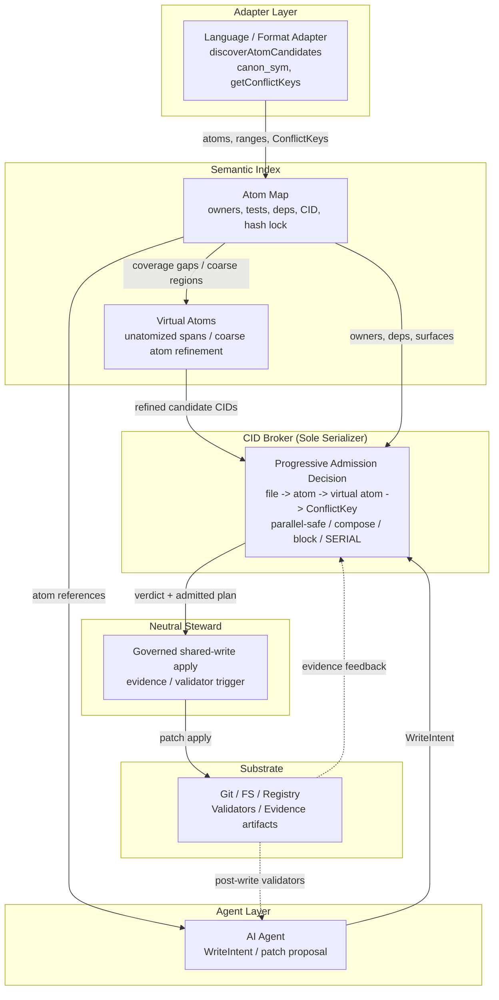
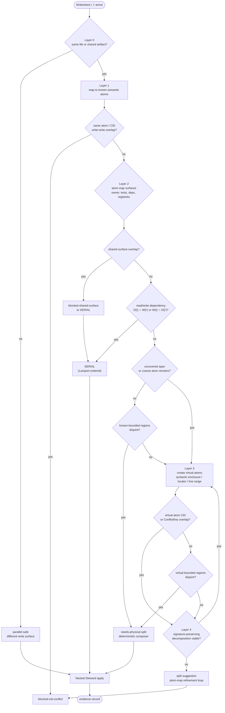
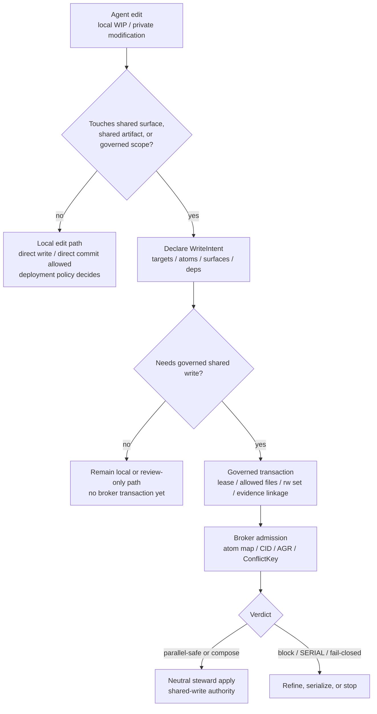

# ATM：同域多供應商 LLM 程式碼共同合成的採用器導向原子化與 CID Broker

## ATM: Adapter-Guided Atomization with CID Broker for Single-Domain Multi-Vendor LLM Code Co-Synthesis

作者: Eaglhuang  
隸屬: Independent Research  
日期: 2026-06-23  
狀態: Draft v3.1（arXiv positioning pass；single-domain boundary / progressive atomization / POS2 / B-12 evidence）  
Repository: https://github.com/eaglhuang/AI-Atomic-Framework

---

## Abstract（摘要）

現有多代理 LLM 系統已能分工、規劃、驗證與協作，但在多個 agent 即將同時寫入共享程式庫的那一刻，仍普遍缺乏共享程式庫層級、位於寫入前的准入機制。AgenticFlict 對 142K+ AI coding agent pull requests 的研究指出，在 107K+ deterministic merge simulations 中有 27.67% 產生 merge conflict，並萃取出 336K+ fine-grained conflict regions；這些數字描述的是下游 Git / PR 合併階段已累積的衝突壓力。本文不主張取代 Git，也不主張治理跨電腦、跨 clone、跨 PR 的分散式寫入，而是把問題收斂到較窄但更前置的單一治理域範疇：在同一受控檔案系統、worktree 或服務域內，當多個 LLM agent 尚未實際寫入共享檔案前，系統如何判斷「此刻是否可以寫、應以何種粒度寫、以及應由誰完成實際寫入」。

本文提出 AI-Atomic-Framework（以下簡稱 ATM），一個以 adapter-guided atomization、atom map、virtual atom 與 CID broker 為核心的單一治理域多廠商 LLM 程式碼共合成框架。其核心思路是先把模糊的檔案寫入意圖還原為可治理的 semantic atoms，並將其組織為 atom map，讓 owner、dependency、validator、CID 與 hash lock 對齊到可追蹤的邏輯位置；當正式 atom map 的覆蓋仍不足以支撐衝突判斷時，系統再以 virtual atom 暫時治理未原子化區段，補足准入演算法對這些區段的判別覆蓋率，使 broker 能沿著檔案層競爭、原子層衝突到 bounded-region compare 逐層細化判斷。其 seven-layer pre-write admission gate 可導向 `parallel-safe`、`composer-routed bounded-region admission`、`blocked conflict`、`SERIAL`，或 `fail-closed refinement path`；實際寫入則由同一治理域內的 neutral steward 進行單次中立套用。更重要的是，ATM 並非只提供抽象 broker 規格，而是已內建一套可直接運作的預設治理骨架，包括 candidate atom bridging、CID 計算、atom-map 投影、virtual atom fallback、task-card / skill routing、editor integration adapter、validator/evidence substrate 與 neutral steward；採用者主要需依目標語言或格式補充對應 adapter，而非重新發明治理核心。

本文以混合證據堆疊支持此框架。第一，本文提出一組 12-scenario deterministic fixture suite 作為完整覆蓋藍圖，並在 scenario coverage design 中擴展為更完整的矩陣；本版已完成並歸檔的 deterministic runner evidence 主要集中於 B-02、B-08、B-13 三個核心機制情境。第二，npc-brain 專案三週採用研究回報 0 unrecovered admission error、1 次 idempotency break 與 3 次 validator catches，構成 adopter-side field evidence，顯示此機制在真實工程流程中具可恢復性。第三，ATM 自身開發歷程提供自託管鑑識證據與同檔案現場證據，包括 POS2 cross-vendor same-file keystone、B-12 late enforcement、BLOCK blocked-before-write、close-orchestration prototype edge，以及 Wave Mode 與 CID stability 的延伸證據，構成 self-hosting field evidence。本文主張，ATM 補上的不是另一個程式碼生成器，也不是單純更細的 merge heuristic，而是一個能將模糊寫入意圖逐層剝離為可驗證衝突單位的寫入前准入層；其混合證據堆疊使設計覆蓋藍圖、deterministic MVP、self-hosting field evidence 與 adopter-side field evidence 得以被同時審查。

關鍵詞: 多代理大型語言模型、單一治理域協調、多廠商程式碼共合成、軟體工程、並行控制、寫入前准入、漸進式原子化、原子地圖、虛擬原子、CID broker、中立 steward

---

## 1. Introduction（緒論）

### 1.1 Motivation

現有多代理程式碼系統已能分工、規劃、驗證與協作，但在多個代理即將同時寫入共享程式庫的那一刻，仍普遍缺乏一個可審計、可重放、且位於寫入前的准入層。這個缺口並不在於代理能否各自生成可用程式碼，而在於當它們同時碰觸同一檔案、同一登錄表、同一設定表、同一生成產物或同一任務狀態機時，系統如何在寫入前判斷哪些意圖可並行、哪些必須序列化、哪些應立即阻擋。本文所稱 AI-Atomic-Framework（ATM），即針對此缺口提出的寫入前治理框架；其處理範圍不涵蓋跨機器 clone、remote branch 或 PR merge 的分散式協調，而是專注於同一治理權域內，在實際寫入發生前做出准入決策。

AgenticFlict 對 142K+ AI agent pull requests 與 59K+ repositories 的分析，提供了此問題的量化壓力：在 107K+ deterministic merge simulations 中，約 29K+ 產生 merge conflict，整體 conflict rate 達 27.67%，並形成 336K+ fine-grained conflict regions。這些數字不能直接視為 ATM 可解決的 workload，因為 AgenticFlict 的觀測單位是跨 PR / Git merge 的下游衝突；本文引用它，是為了說明 AI-generated code 在共享程式庫生態中確實累積了顯著的衝突壓力。ATM 的切入點不是接手 Git merge，而是把治理時點前移：在變更進入 Git merge 或 PR 之前，先處理同一 worktree、檔案系統或服務域內的並行寫入意圖。

既有方法各自處理了問題的一部分。字元級方法如 CodeCRDT 提供底層合併基底；檔案級方法如 STORM 或 CAID 處理檔案或工作區隔離與寫入時仲裁；工作流級方法如 SCF、MPAC 或 orchestration framework 管理角色、流程與審查。然而，這些方法多半未提供單一治理域共享寫入情境下的寫入前准入閘門：在同一檔案系統或服務域內，系統於實際寫入前，應能判斷同檔案但不同 bounded region 的兩個意圖是否可合併，或同一 shared surface 的兩個意圖是否必須 fail closed。本文即針對此缺口提出 ATM。

### 1.2 錯誤的二分法

本文拒絕一個常見但不必要的二分法：要嘛採用字元級 CRDT，接受其語義盲點；要嘛採用完整 AST 或全域語意圖，承擔高昂的工程成本與 false-positive 風險。對多代理共享程式庫寫入而言，最小可行的治理單位通常不是字元，也不必然是完整 AST，而是由 domain adapter 提供的 atom、bounded region、CID 與 shared surface。

ATM 因此採取第三條路：adapter-guided atomization 加上 broker 准入。Adapter 不被要求理解所有語言語意，而是負責以足夠保守的方式宣告 candidate atom、source path、range、read/write dependency、ConflictKey 或 shared surface；broker 則不相信 LLM 的自由判斷，而是根據上述結構化資料做 deterministic admission decision。換言之，ATM 的設計不是將所有推理交給 LLM，也不是將所有語言強制塞進單一 AST，而是在工程上可落地的 adapter contract 與內建治理骨架上建立寫入前治理。

更精確地說，ATM 的發明直覺是逐層剝離衝突粒度。第一層先確認是否只是不同檔案或不同 artifact；第二層以 adapter 找出既有 semantic atoms；第三層以 atom map 連接測試、驗證、owner、dependency 與 shared surface；第四層在既有 atom 不足時建立 virtual atoms，讓未原子化段落也能被定位、比較與重算 CID。只有當這些層次都無法證明 disjoint 時，ATM 才將 intent 視為真正衝突並 fail closed。這使 ATM 的核心不只是「更細的 diff」，而是將模糊寫入意圖轉換為可審計准入證據的過程；後文的貢獻與實證，也都圍繞這條主線展開。

### 1.3 Contributions

本文的貢獻如下。

1. Progressive atomization for admission. 我們將 ATM 定位為多代理軟體工程流程中缺失的單一治理域寫入前准入層；其核心不是單次 merge，而是由檔案層競爭逐層細化到 semantic atom、atom map、virtual atom 與 ConflictKey 的衝突揭露流程。
2. Atoms and atom maps as governance substrate. 我們提出跨語言中立的原子化抽象：在 ATM 中，atom 不是語法上最小的片段，而是寫入前仲裁所需的最小可治理語意單位；atom map 則將 atom 的 bounded surface、owner、validator、dependency、CID 與 hash lock 對齊為可測試、可驗證、可審計的治理索引。
3. Built-in governance substrate and extensible adapters. 我們主張 ATM 的核心治理能力是內建而非外掛：框架本身已提供 candidate atom bridging、CID 計算、atom-map projection、virtual atom fallback、task-card / skill routing、editor integration adapter、validator/evidence substrate 與 neutral steward。這表示採用者通常不需先重做 broker 與治理流程，而是沿用既有骨架，依目標語言或格式補上 adapter。就目前狀態而言，TypeScript 是最成熟的 reference language path，Python 亦已有獨立 adapter、candidate discovery、dry-run 與 tests；其他語言與格式則屬於框架核心之上的漸進式 ecosystem expansion。
4. Adapter-guided atomization and virtual atoms. 我們透過 optional `AtomizationPlanningAdapter` SDK，讓各語言或格式以最低可行成本回報 atom 候選、bounded region、Candidate CID / Capsule CID、shared surface 與 dependency，而不強制依賴單一 universal AST；當正式 atom map 尚未完整，或原子化覆蓋率仍不足時，我們再以 virtual atom 作為暫時治理單位，使 broker 仍能定位衝突落點、重算候選 CID、判斷 bounded-region disjointness，並在不可證明安全時 fail closed。
5. Seven-layer deterministic broker admission. 我們提出以 CID identity、shared surface、read/write set、file range / AGR、ConflictKey + canMerge、CAS base-hash 與 fallback file lock 構成的七層寫入前硬性准入閘門，將同檔案但 CID 不重疊的寫入路由至 deterministic composer 與 neutral steward，並在證據不足時 fail closed。
6. Agent-operating integration surface. ATM 不只治理檔案寫入，也提供任務卡、skill 與 editor integration adapter 的預設接入面，使 Codex、Claude Code、Copilot、Cursor、Gemini 等宿主編輯器可透過 repo-local entry skills / commands 共享同一套 task routing、playbook 與 governance entry path。這使「多廠商代理如何進入同一治理域」成為框架內建能力，而非每個 adopter 需重新設計的外部流程。
7. Format-agnostic generalization and evidence taxonomy. 我們透過 `FileMutationAdapter` 與 `ConflictKey` 將准入核心推廣至 JSON 記錄、文字範圍、數值欄位與 atom-map shards，使 broker 不只治理程式碼 atom，也能治理結構化 artifact；同時以 12-scenario suite design、已歸檔的 deterministic runner MVP（B-02、B-08、B-13）、self-hosting field evidence、adopter-side field evidence、POS2 cross-vendor same-file keystone、B-12 late-enforcement negative case、BLOCK blocked-before-write 與 Wave Mode dogfood，驗證此准入層的可行性、邊界與可審計性。

### 1.4 Organization

第 2 節定位相關研究與 ATM 所補上的准入層；第 3 節先定義 atom、atom map 與 adapter-guided atomization，再說明 CID、broker 准入流程、seven-layer gate 與 neutral steward；第 4 節報告 fixture、採用研究與現場證據；第 5 節列出限制與後續路線圖；第 6 節討論單一治理域邊界、adapter-guided 設計之取捨、open problems 與部署拓樸；第 7 節總結本文主張。

**Reproducibility**：本論文所有 ✅ 標記之 capability 對應 AI-Atomic-Framework 開源 repository（`https://github.com/eaglhuang/AI-Atomic-Framework`）之 paper-aligned tagged release `v0.9.0`。Appendix A.4 提供逐條 capability claim → source path → 可重現驗證命令之對應表，supplementary evidence artifact 集中於 3KLife planning repository 之 `docs/ai_atomic_framework/broker-collision-evidence/`。

---

## 2. Related Work（相關研究）

本文以「協調粒度」與「是否具備寫入前的預防式准入閘門」來比較相關研究。這種分層並非要將所有系統放入單一優劣序，而是說明 ATM 的貢獻位置：它不是取代 CRDT、Git、工作流編排或生成後驗證，而是在同一受控 worktree 或服務域的寫入前增加一層可治理的准入仲裁。

### 2.1 Tier 1：字元層並行控制

CodeCRDT、EvoGit 與 AgentGit 可視為低層次的合併基底。此類方法關心多代理文字變更如何收斂、如何回復，以及如何以版本控制作為同步媒介。其優點是普遍、語言無關、且易於嵌入既有編輯流程；其限制則是無法提供 atom、bounded region 或語意層級的寫入前准入。CodeCRDT 即使達到字元級收斂，仍需承認 5-10% 的語義衝突，而這類衝突通常要等到 typecheck、lint 或 test 才會浮現。

因此，Tier 1 與 ATM 並非直接競品。ATM 可以建立在 Git、CRDT 或檔案系統之上，但它回答的是更上層且更受限的問題：在同一治理權域的寫入發生前，哪些寫入意圖應被視為共享資源衝突，哪些同檔案變更其實可安全並行。跨 clone 或跨遠端分支的最終收斂，仍交由 Git / CRDT / merge substrate。

### 2.2 Tier 3：檔案層協調

STORM 以檔案版本與 observed dependency 進行 write-time OCC，能阻擋代理基於陳舊檔案狀態寫入。CAID 則以 git worktree 建立隔離工作空間，再由中央 delegator 進行合併。二者皆強化了多代理工作空間的安全性，並使 agent 在局部空間內能較自由地工作。

然而，檔案仍是過粗的協調單位。若兩個代理同時修改同一檔案中互不重疊的兩個函式，檔案級 OCC 可能仍拒絕其中一方；git merge 則要等到事後才知道是否衝突。ATM 的 bounded-region admission 正是針對此缺口：它將「同檔案」進一步拆為可由 adapter 宣告與 broker 檢查的 region、CID 與 ConflictKey。

### 2.3 Tier 4：工作流治理

SCF、MPAC、ATCC 與相關工作流治理系統處理的是角色、意圖、流程與審查層次的協作。SCF 以 Semantic Intent Graph 檢測工作流衝突，MPAC 以多層協定降低多代理協作開銷，ATCC 與 OptiMA 則從資料庫或 transaction control 角度提供樂觀/悲觀執行策略。這些方法的重要性在於，它們指出多代理協調不是單純的 merge 問題，而是 authority、intent 與 governance 問題。

但對單一治理域中的共享程式庫寫入而言，工作流層級的治理通常缺乏區域層級的准入閘門。它能決定誰負責某個任務、誰審查某個結果，卻不必然能判定同一檔案中兩個 bounded regions 是否可以在同一受控 worktree 中被 neutral steward 套用。ATM 將工作流治理中的 authority 概念，進一步下沉到寫入前的 broker verdict。

### 2.4 Tier 2：相近系統與 2025-2026 鄰近工作

CoAgent 是 ATM 最接近的 Tier 2 系統之一。CoAgent 的 MTPO 偏向 tool/action 級的 reactive concurrency control：它讓代理在看到順序化結果後重新判斷、修復或撤銷。ATM 則偏向 code-region 級的 preventive concurrency control：它在寫入前要求 adapter 宣告 atom、range 與 shared surface，由 broker 先行裁決。兩者並非同質替代品；CoAgent 較適合 read set 難以事前宣告的 side-effectful tool chain，ATM 則較適合可由 adapter 還原結構化寫入範圍的程式碼與格式化產物。更重要的是，兩者可形成層次化互補：ATM 在 admission 階段先做 deterministic arbitration，將大多數可預測衝突在寫入前收斂；CoAgent 類 MTPO 則於 SERIAL 路由後承接不可事前宣告 side effect 的 reactive repair。換言之，二者並非替代關係，而是寫入前准入層與後續修復層的接續。

MACOG、ProjectGen + SSAT、DebateCoder、Multi-Agent Code Verification 與 Singh intent-driven optimization 則分別落在協作編排、架構分解、結果驗證與生產效能最佳化層。它們回答的是「如何分解任務」、「如何安排角色」、「如何驗證產物」或「如何降低 token 與延遲成本」。ATM 回答的則是較窄但關鍵的寫入前准入問題：當多個 agent 已經形成寫入意圖時，是否准入、如何准入，以及如何讓寫入成為中立且可審計的事件。

| System | Layer | Preventive or Advisory | Admission-time Gate | Shared-file bounded region | Neutral serialization |
|---|---|---|---|---|---|
| CodeCRDT | character merge substrate | preventive at text convergence | no | no | no |
| STORM | file-level write mediation | preventive at file write | partial | no | no |
| CAID | workspace isolation | reactive merge | no | no | central merge |
| SCF / MPAC | workflow governance | advisory / preventive by intent | partial | no | workflow-level |
| CoAgent | tool/action concurrency | advisory / reactive | no hard code-region gate | no | depends on tool chain |
| ATM | repository admission layer | preventive | yes | yes | neutral steward |

### 2.5 鄰近基礎

OT、CRDT、two-phase locking 與 optimistic concurrency control 提供了 ATM 的基礎思想：共享狀態需要明確的衝突單位、序列化點與重試語意。Workspace protocol 與 TraceFix 類工作則提醒我們，多代理系統本身也需要被視為 protocol，而不只是 prompting pattern。Latent-space parallel-branch synthesis [Liu et al. 2026] 於 KV-cache 層處理 parallel branch merging，與本文的寫入前准入層次正交，可疊加於 ATM 的 deterministic-composer 路由之上。ATM 將這些基礎概念收斂到共享程式庫寫入：以 atom、CID 與 ConflictKey 定義衝突單位，以 broker 作為唯一序列化節點，並以 evidence substrate 使每次准入與阻擋可被審計。

Figure 4 — Tier Granularity Ladder. 本文於協調粒度階梯中的位置：

| Tier | 粒度 | 代表系統 | 典型 domain | ATM 與之關係 |
|---|---|---|---|---|
| 1 | character | CodeCRDT, EvoGit, AgentGit | editing session / merge substrate | substrate（正交，可建立其上） |
| 2 (this paper) | atom / bounded region | ATM | single workspace / filesystem domain | admission layer ← 補上的缺口 |
| 3 | file / workspace | STORM, CAID | workspace / worktree mediation | 對 same-file parallel 過粗 |
| 4 | workflow / intent | SCF, MPAC, ATCC, OptiMA | process / workflow governance | 缺 region-level admission gate |
| out of scope | branch / PR | Git three-way merge, PR review | cross-machine clone / remote branch | ATM 不取代此層 |

ATM 並非取代 Tier 1/3/4，也不取代跨機器 Git PR 合併；它是在 single workspace / filesystem domain 的 Tier 2 補上一層可治理的 admission gate。

---

## 3. Framework（方法）

ATM 的設計目標，是在 agent generation 與 filesystem mutation 之間建立一個治理層。它不生成程式碼，也不替代測試或 code review；它要求所有寫入先被表述為結構化寫入意圖，再由 broker 決定該意圖是否能進入寫入路徑。

### 3.1 架構總覽

ATM 可分為五個責任邊界，並共享一個逐步細化的語意索引。本文假設這些邊界位於同一個治理域：同一台電腦、同一個受控 server、同一個 worktree service，或其他能提供單一 broker / steward authority 的環境。Adapter 負責從語言或格式中擷取 candidate atoms、bounded ranges、read/write dependencies 與 conflict keys；Atom Map 將這些資訊整理為可測試、可驗證、可審計的邏輯地圖。若 map 尚未覆蓋某段變更，AGR 會建立 virtual atoms 作為暫時治理單位。Agent 負責提出 patch 或寫入意圖；Broker 負責做出准入決策，輸出 allow、compose、block 或 re-arbitrate 類 verdict；Neutral Steward 則負責將 broker 已准入的 plan 實際套用至同一受控 worktree。它不是內容提案者，也不是裁決者，而是 broker 裁決的執行器、同一治理域內的唯一寫入權威，以及 evidence record、validator trigger、後續 commit / pre-push 治理鏈的落地節點。Substrate 包含 Git、檔案系統、registry、validator 與 evidence artifacts；其中 Git 是版本控制與跨 clone 合併 substrate，而非 ATM 在本文中要取代的分散式鎖。

Figure 1 — ATM Admission Architecture. 五個責任邊界與資料流：



此架構的關鍵在於，agent 不直接取得對共享檔案系統的最終寫入權。Agent 可以產生 proposal，但 proposal 必須經過 broker；若 broker 判定可合併，仍由 neutral steward 完成實際寫入。這使「誰提出變更」與「誰執行寫入」分離，降低多代理互相覆寫、競逐或跳過治理流程的風險。

需要特別說明的是，圖 1 描述的是 ATM 的治理路徑，而不是聲稱同一治理域中的每一次本地寫檔都必須經過 steward。對單一 agent、私有 work-in-progress、尚未進入共享 surface 的局部修改，部署者仍可保留 direct write / direct commit 工作流；ATM 主要介入的是共享檔案、共享 artifact、或其他已被宣告為需治理的 write intents。一旦寫入進入 broker-governed path，neutral steward 才成為唯一正式 apply authority。

### 3.2 Atom、Atom Map、Virtual Atom 與 CID

ATM 中的 atom 是可治理的最小邏輯單位。實作上，atom 可表示 function、class method、registry entry、JSON record、numeric scalar、text range，或其他由 adapter 定義的結構化片段。這意味著 ATM 治理 AI 寫碼的方式，不是直接對整個檔案下命令，而是先把寫入意圖對映到 atom，再依 atom 之間的 shared surface、dependency 與 bounded region 判斷此刻是否可以寫、要不要分流，以及最後由誰實際寫入。Atom 的用途不只是命名程式碼區段，而是讓 broker、validator 與 reviewer 能把一次寫入對齊到可追蹤的語意位置。為了支援 broker decision，本文保留下列必要欄位：atom identity、logical name、version、source path/range、input/output schema、status、tier 與 hash lock。完整 8-tuple 可寫為：

$$a = \langle id, name, ver, P, \sigma, \psi, \tau, H \rangle$$

其中 $P$ 是 atom 對應之 file path 與 line range 集合；$\sigma$ 是 schema；$\psi$ 是狀態；$H$ 是規格、程式與測試的 hash lock。對 broker 而言，最重要的是讀者能在此節後理解三件事：何謂 same owner、same CID、以及 disjoint bounded region。

Atom map 是由這些 atoms 形成的語意索引，也是 ATM 真正的治理基底。它將 source range、owner、測試入口、validator、read/write dependency、shared surface、Candidate CID、Capsule CID 與 hash lock 對齊到同一個可審計的圖狀結構。若借用最精簡的層次語言來說，atoms 提供的是 conflict identity，atom map 提供的則是 governance context：前者回答「這次寫入碰到哪個治理單位」，後者回答「這個治理單位連到哪些 owner、validator、dependency 與 shared surface」。換言之，atom map 不是文件目錄，而是寫入前准入層的語意感測器：broker 透過它知道某個寫入意圖觸碰的是哪個邏輯單位、應由哪些 validator 驗證、是否與其他 active intent 共享 surface，以及是否需要被序列化。需要更精確地說，僅有 atoms 與其 `atomId / atomCid` 時，broker 仍可先做第一層 CID 衝突判決；但若缺少 atom map，系統較難把 owner、validator、dependency、shared surface 與 coverage gap 一起納入同一個可審計索引，於是同檔案爭用往往只能停留在較粗的 atom-set 或 file-overlap 判斷。正因如此，atom map 的關鍵價值不在於「讓 CID 判決首次成為可能」，而在於把同檔案寫入還原成「哪些已知治理單位、哪些共享 surface、哪些驗證責任實際被觸碰」這個更細且可追溯的問題。

Adapter-guided atomization 則回答「應該如何原子化」。ATM 不要求所有語言先具備同一套 universal AST，也不要求 atom map 在第一天就完整；相反地，我們把 candidate discovery 下放給 adapter，允許 TypeScript、Python、JSON 或其他格式各自以 regex、scanner、compiler API、AST、LSP 或 format-specific locator，回報對本語言最便宜且穩定的 atom 候選、canonical symbol、bounded region 與 shared surface。這使 ATM 的原子化不是一次完成的靜態前處理，而是可漸進擴充的治理能力：先有 candidate atoms，再形成 atom map，再逐步補齊 coverage、validator 與 dependency。更重要的是，ATM 並不是只提出一個抽象介面，再把實作成本全部外包給 adopter；框架本身已內建 candidate atom bridging、CID 計算、atom-map projection、virtual atom fallback、task-card / skill routing、editor integration adapter、validator / evidence substrate 與 neutral steward 等預設治理骨架。換言之，採用者通常不需要先重做整套 broker 與治理流程，而是可在既有骨架上，依目標語言或格式補上對應 adapter。就目前實作而言，正式原子化與 atom map 生成已至少在 TypeScript 與 Python 兩種語言上落地；其中 TypeScript 可視為目前最成熟的 reference language path，而 Python 並非僅有抽象介面，而是已有獨立 `@ai-atomic-framework/language-python` package、candidate discovery、atomization dry-run、驗證腳本與 fixture tests；其他語言與格式則依 `AtomizationPlanningAdapter`、`FileMutationAdapter` 與 locator contract 逐步接入，這一部分屬於框架既有核心之上的 ecosystem expansion，而非 ATM 核心治理能力尚未存在。

Virtual atom 則是 atom map 不完整時的暫時治理單位。當 adapter 尚未把某段程式正式原子化，或正式 atom map 對該區段的覆蓋仍不足以支撐可靠判斷時，AGR 可依 syntactic enclosure、line range、signature boundary 或 format-specific locator 建立 virtual atom。Virtual atom 具有臨時 identity、bounded region、candidate CID 與 conflict keys，但不宣稱已是永久 API 單位；它的目的，是讓 broker 在未完成正式原子化之前，仍可把「同檔案疑似衝突」轉換為可比較、可驗證、可 fail-closed 的 admission 單位。也因此，ATM 的核心不是先假設 repository 已被完全原子化，而是在 atom map 覆蓋有限時仍能沿著 atom map -> virtual atom 的路徑把衝突逐層剝開。

相對地，atom capsule 並不是比 atom 更細的 runtime 判斷單位，也不是 virtual atom 的另一種名稱。依目前實作，capsule 是 atom 的內容封裝與版本錨點：它以 `canonicalSourceCode`、`inputSchema`、`outputSchema` 與 `policeConfig` 組成 atom bundle，並計算出 content-addressed 的 `Capsule CID`，主要用於 export/import、rollback、rescue 與 drift detection 等治理證據流程，而不是直接取代 broker admission 的第一線判斷。若用最不容易混淆的層次語言來說：atom 是治理單位，virtual atom 是暫時判斷單位，atom capsule 則是封裝與版本證據單位。

這也說明了本文為何需要區分 two-tier CID。`Candidate CID` 服務的是 pre-write admission：broker 以它辨識候選治理單位是否與其他 active intent 衝突；`Capsule CID` 服務的則是 post-validation 與 capsule lifecycle：它錨定某個 atom bundle 的內容版本，並可進一步成為 map capsule 的 member 依據。換言之，candidate 與 capsule 不是兩種 competing atoms，而是同一 atom 在不同治理階段中的兩種識別面向。

ATM 使用兩種 CID。Candidate CID 用於 pre-write admission，由 adapter 對 kind、canonical symbol、source path、lineStart / lineEnd 所形成的 range signature，以及 detection method 進行 canonicalization 後雜湊而得。換言之，在目前 broker candidate bridge 的實作中，Candidate CID 並非只看 symbol 或 filePath，而是明確把候選區段的 line signature 納入 identity。Capsule CID 用於 post-validation artifact，以完整 source bundle、schema 與 policy 計算 content address。前者服務於寫入前仲裁，後者服務於封裝後版本錨定。此二層 CID 避免將「尚未寫入的候選區域」與「已驗證的封裝產物」混為一談。更重要的是，CID 並不是脫離 atom 而獨立存在的 fingerprint；它總是附著在 atom 或 virtual atom 這類治理單位之上，供 broker 判斷 identity、overlap 與 route。

表 3.2A 以最精簡方式整理四個容易混淆的治理物件：

| 對象 | 角色 | 是否持久 | 是否進 broker 第一線 | 主要用途 |
|---|---|---|---|---|
| atom | 正式治理單位 | 是 | 是 | 表示可被宣告、索引、裁決的語意單位 |
| atom map | 治理脈絡索引 | 是 | 否（作為輔助索引） | 連接 owner、validator、dependency、shared surface、coverage |
| virtual atom | 暫時判斷單位 | 否 | 是 | 在 coverage 不足時補位，支撐 bounded comparison 與 fail-closed admission |
| atom capsule | 封裝與版本證據單位 | 是 | 否（不作第一線 admission identity） | export / import / rollback / rescue / drift detection / version anchor |

Adapter-guided discovery 的必要性在於，atom identity 無法完全由字串 diff 或檔案路徑推導。TypeScript function、Python decorator、JSON record 與 atom-map shard 各自具有不同結構；若沒有 adapter 宣告其 canonical symbol 與 bounded region，broker 只能退回檔案級或字元級判斷。ATM 因此將 adapter contract 視為 admission 的前置條件；而 virtual atom 則補上 adapter map 尚未完成時的中間層，使系統不必在「整檔鎖」與「盲目放行」之間二選一。對應的語意驗證則不由 ATM 代替專案自行發明；framework 只提供 validator 與整合測試掛點，讓採用者把 typecheck、unit test、integration test 或 domain-specific CLI validate 接到 atom map 與 steward path 上。

### 3.3 准入流程

ATM 的准入流程從 write intent 開始，但其核心不是一次性比較檔案 diff，而是 progressive atomization。從治理角度看，AI agent 並不是「自由修改檔案」；它只能提出一個帶有 target files、atom references、candidate CIDs、bounded regions、shared surfaces 與必要 read dependency 的寫入意圖。Broker 收到寫入意圖後，不先問「這兩份 patch 行號有沒有撞到」，而是先問「它們分別落在哪些 atom 上、落在 atom map 的哪些 surface 上、是否還有未被 atom map 覆蓋的空白區」。若寫入意圖觸碰尚未被 atom map 覆蓋的段落，broker 會要求 AGR 產生 virtual atoms，將原本模糊的同檔案重疊轉換成可比較的邏輯區塊。之後，broker 再依序比較 CID、shared surface、read/write dependency、physical overlap、known atom coverage、virtual atom coverage 與 bounded region，最後輸出 verdict。

主要 verdict 可概括如下：

| Verdict | 意義 | 後續路徑 |
|---|---|---|
| `parallel-safe` | 無 CID / surface / range 衝突 | 可進入 steward path |
| `needs-physical-split` | 同檔案但 CID disjoint，需合成 | deterministic composer |
| `blocked-cid-conflict` | 同 CID 或同 atom 寫入衝突 | fail closed / refinement |
| `blocked-shared-surface` | shared surface 互斥 | fail closed / serialize |

Figure 2 — Progressive Atomization Admission Flow. ATM 如何由粗到細揭露真正衝突點：



這個流程可濃縮為一條治理鏈：`agent proposal -> adapter-guided atomization -> atom map lookup -> virtual-atom refinement -> broker verdict -> neutral steward apply`。因此，ATM 所治理的不是抽象的「多人協作」，而是同一治理 domain 內 AI write intent 如何被 atom 化、比對、裁決與單次套用。

Algorithm 1 — Progressive admission with atom map and virtual atoms.

```text
Input: write intents I, I'
1: if physical write surfaces are disjoint, return parallel-safe
2: map I, I' to known atoms via adapter + atom map
3: if same atom or same candidate CID, return blocked-cid-conflict
4: if same file and same atom map but different atom ids, continue region-level checks
5: if shared surface overlaps, return blocked-shared-surface or SERIAL
6: if D(I) intersects W(I') or W(I) intersects D(I'), return SERIAL
7: if known bounded regions are disjoint, route to needs-physical-split
8: otherwise invoke AGR Layer 1 on uncovered or coarse spans
9: if virtual atom CID or ConflictKey still overlaps, test Layer 2 policy
10: if Layer 2 is admissible, recompute virtual atoms and bounded regions
11: if refined regions become disjoint, route to needs-physical-split
12: else emit split suggestion, record refinement evidence, and fail closed
Output: verdict in {parallel-safe, needs-physical-split, blocked-cid-conflict,
        blocked-shared-surface, SERIAL}
```

此 pipeline 的核心不是「永遠允許更多並行」，而是將並行決策從 LLM 自由判斷轉化為可重放的 admission vocabulary。當兩個 intent 寫入同一檔案時，broker 不立刻把同檔案視為衝突，也不直接相信行號未重疊；它先查 atom map：若兩者落在同一份 atom map、但對應到不同 atom id，這本身並不構成衝突，而是進入 region-level compare，繼續檢查 bounded region、shared surface、read/write dependency 與 ConflictKey 是否真正重疊。對尚未被 atom map 覆蓋的區段，可先建立 virtual atoms；對已被 atom map 覆蓋、但既有 atom 粒度仍過粗而無法直接證明安全的區段，則進入 AGR / decomposition / split-suggestion 路徑。之後才判斷 bounded region、CID、ConflictKey 與 dependency 是否真的重疊。若逐層細化後仍能證明 disjoint，broker 將其路由到 composer，再由 steward 套用合成結果；若無法證明 disjoint，則 fail closed 或進入 refinement loop。

本文使用兩個簡化定理描述此 pipeline 的保守邊界。

Theorem 1（Cross-Regime Disjointness）. 若兩個 adapter 所治理的 source root 由 repository convention 保證 disjoint，且 adapter 正確宣告其 source paths，則兩個 candidate 的 physical write surface 不相交；broker 在 file-overlap 層可視為 parallel-safe，除非 shared surface 或 dependency rule 另有阻擋。此定理只保證 physical write-surface disjoint，不保證跨語言邏輯耦合、API contract 或 generated client/server pair 的 semantic safety；後者仍屬 §3.6 所述之 cross-language identity open problem。

Theorem 2（Static Admission Closure）. 在 adapter 對 static read/write set 的宣告為保守近似，且動態 effect 皆由 validator 或 fallback lock 補位的假設下，`parallel-safe` verdict 排除 statically determinable write-write conflict；此定理不保證動態語意正確性。其證明直覺是：broker 先以 atom / CID / shared surface 排除顯式 write-write overlap，再以 augmented dependency rule 排除可靜態觀測之 read-after-write hazard；剩餘風險僅能來自 adapter 未揭露的動態 effect 或 runtime drift，故必須由 validator handoff、CAS base-hash 或 fallback lock 補位。換言之，Theorem 2 主張的是 static admission closure，而不是 end-to-end semantic soundness。

Augmented dependency rule 補足了純 write-set disjoint 的不足。由於 Layer 1 與 Layer 2 已先處理明確的 write-write overlap，本規則專門補足宣告式 read/write hazard。若 intent $I$ 的 read dependency 與另一 intent $I'$ 的 write set 相交，或反向地 $I$ 的 write set 觸碰 $I'$ 已宣告讀取的 atom，則即使二者文字範圍不重疊，也應進入 SERIAL 或 review path：

$$(D(I) \cap W(I') \neq \emptyset) \lor (W(I) \cap D(I') \neq \emptyset) \Rightarrow SERIAL(I, I')$$

此處的 $D(\cdot)$ 指 intent 透過 `readAtoms` 或 adapter / atom map 所宣告的 static read set；ATM 不主張進行完整的動態讀取追蹤。工程實作上，active registry 會保存 active intent 的 declared read atom IDs / CIDs，使後進 writer 也能被同一條規則攔截；未被宣告的 hidden effect 仍屬 validator、CAS base-hash 或 fail-closed 的責任範圍。

AGR（Adaptive Granularity Refinement）則處理「正式原子化覆蓋不足，或既有 atom 粒度不足以直接裁決」的情況。這裡的關鍵不是單純把 patch 切細，而是把兩種不同情境分開處理。第一種是 map gap：broker 在既有實體 atom 尚未覆蓋某段變更時，可暫時建立可治理的 virtual atom，重新觀察真正的衝突邊界。Layer 1 以 syntactic enclosure 將未覆蓋 patch lines 包成 virtual atoms 並重算 CID；因此，原本在 file-level 看起來只是「同檔案」的兩個 intent，會被重新表述為「兩組可比較的治理區塊」。若這些 virtual atoms 的 CID、shared surface 與 bounded region 皆相互分離，broker 才能把 verdict 從粗粒度的 same-file contention，下修為可合成的 `needs-physical-split`。第二種是 coarse known atom：某段變更雖已落在既有 atom map 內，但 atom 本身過粗，無法直接證明兩個 intent 真正 disjoint。這種情況不應被表述為「直接建立 virtual atom 即可消解衝突」，而是要經由 Layer 2 的 signature-preserving decomposition、split suggestion 與人工可審查的 refinement path 繼續處理；在證明安全之前，它仍屬衝突態。Layer 2 會在衝突密度過高時——即衝突 hunk 數超過閾值 $\theta_{count}$ 或衝突行密度超過 $\theta_{density}$——提出 signature-preserving decomposition $f \mapsto f_{pre} \cdot f_{extracted} \cdot f_{post}$，並對每個分解片段重算 virtual atom CID。目前 implementation policy 將這兩個閾值視為顯式門檻；現行規劃與實作文件中的預設值為 $\theta_{count}=1$、$\theta_{density}=0.5$，且 Layer 2 不遞迴展開，以維持 bounded refinement。換言之，虛擬原子不是附屬優化，而是 ATM 在正式 atom map 覆蓋有限時，用來擴張 admission 判別覆蓋率的核心機制；而 coarse known atom 的處理則更接近「受控拆分建議」，而不是自動解除衝突。AGR 不是任意讓 LLM 重構，而是產生可審查的 refinement suggestion，使 blocked overlap 成為 atom-map 改進訊號；當兩層 refinement 皆無法消解時，broker 退回 `blocked-cid-conflict` 並導入 §4.4 refinement loop。

在進入更細的 admission pipeline 之前，還需要先區分哪些修改仍屬一般本地編修，哪些修改已升格為必須交由 broker 裁決的共享寫入。為避免將普通 edit、宣告式 write intent 與真正受治理的 transaction 混為一談，本文採用以下三層詞彙：`edit` 指 agent 在本地工作區中的未治理修改，可用於私有草稿、局部試作與未宣告共享的 work-in-progress；`write intent` 指一個已被結構化描述的候選寫入，至少宣告 target files、可能觸及的 atoms 或 surfaces，以及必要的 admission metadata；`governed transaction` 則指已進入 broker-governed path、並可被 broker 裁決與 steward 套用的共享寫入單位。不是所有 edit 都是 transaction；而是某些 edit 在跨入共享 surface 或共享 artifact 時，才被提升為需治理的 write intent，並進一步成為 broker 所處理的 transaction。

Figure 2A — Write Intent Escalation and Broker Activation Policy. 何時可維持直寫、何時必須升格為 broker-governed transaction：



這張圖要表達的不是「所有 agent 都失去本地寫檔能力」，而是 ATM 將共享寫入的治理起點前移：當修改仍停留在私有 edit 階段時，部署者可保留輕量工作流；只有當該修改被宣告為會碰觸共享 surface、共享 artifact 或受治理範圍時，系統才要求它以 write intent 的形式進入 broker，並在被接受後升格為 governed transaction。

此處的 governed transaction 並不是多包一層名詞，而是 broker 持續治理共享寫入所必需的執行中狀態。單有 write intent，broker 只能知道某個 writer 曾宣告「想寫什麼」；一旦 A 已先進入 hot file 或 bounded region，若系統沒有把 A 升格為帶有 transaction identity、lease epoch、allowed files、read/write set、file hashes 與 admission state 的 governed transaction，後續 B 再進入同一共享 surface 時，broker 其實無法持續管理 A 已在進行中的動作，只能退回一次性的靜態衝突判斷。正因如此，ATM 需要 transaction 這一層來固定「先進場 writer 現在正被如何治理」：如此 broker 才能對既有 writer 執行 park、rearbitration、serialize、composer routing 或 bounded re-plan，而不是等到兩邊都已寫下去後，才被動地把問題丟回 Git merge 或人工修補。

### 3.4 七層硬性閘門與 Broker 的唯一序列化角色

ATM 的 broker 不是只靠 CID 做單點判斷，而是以七層 hard gate 逐步縮小可疑寫入的衝突面。CID identity 是第一層快速語意索引；若 CID 無衝突，broker 仍必須檢查 shared surface、read/write set、file range / AGR、ConflictKey + canMerge、CAS base-hash，以及最後的 fallback file lock。這種設計使 ATM 能在可證明 disjoint 時允許並行，在證據不足時則保守地 fail closed。

| Layer | Gate | 判斷問題 | 通過時 | 失敗或不明時 |
|---|---|---|---|---|
| 1 | CID Identity | 是否被目前 adapter / atomization regime 識別為同一治理單位（同一 atom，或同一 candidate CID）；對 candidate 而言，identity 已包含 symbol、source path 與 lineStart / lineEnd range signature | 進入下一層 | `blocked-cid-conflict` |
| 2 | Shared Surface | 是否觸碰同一 registry / generator / artifact / active intent surface | 進入下一層 | block 或 SERIAL |
| 3 | Read/Write Set | 是否存在 $D(I) \cap W(I')$ 或 $W(I) \cap D(I')$ | 進入下一層 | SERIAL / review |
| 4 | File Range / AGR | 同檔案變更是否可由 known atom 或 virtual atom 分離 | composer path | AGR refinement 或 block |
| 5 | ConflictKey + canMerge | 結構化產物是否有 disjoint key 與 deterministic merge capability | format-level admission | block / serialize |
| 6 | CAS Base-Hash | apply 前 base hash 是否仍符合 admission 所見狀態 | one-shot apply | bounded re-plan |
| 7 | Fallback File Lock | adapter 或 validator 無法提供足夠證據時是否需整檔保守鎖 | guarded write | fail closed |

這七層 gate 的意義，不在於增加機制數量，而在於明確說明 ATM 並非只靠 CID 單點裁決。正式投稿版本可在附錄進一步將各層 gate 對應至 implementation location、primary validation 與 commit/task family；本文在方法章先保留其結構化設計，以避免將 CID 誤讀為唯一判據。

同理，ATM 也不是把「同一檔案但行號不重疊」直接視為充分放行條件。行號或 bounded text range 最多只能提供必要但非充分的物理證據；真實的多代理衝突還可能來自 shared surface、read/write dependency、同一 coarse owner map 下的治理覆蓋不足，以及 apply-time drift 等因素。若系統僅以 same-file line disjointness 放行，實際上只是退回缺乏語意保證的 text-level merge policy。ATM 之所以採多層 gate，正是要把「哪些寫入在語意與治理上可並行」和「哪些情況必須 SERIAL、fail-closed，或退回受控 refinement fallback」區分開來。

就目前實證成熟度而言，late joiner 的 park / rearbitration、same-file CID-disjoint 的 composer routing，以及 shared-surface 與 read/write dependency 所需的 SERIAL path，已具備對應的實作與 dogfood、fixture 或 validator 證據；相較之下，bounded re-plan 目前較準確的定位仍是受控的 split-suggestion / decomposition fallback，而非已完整驗證的自治式多輪重規劃器。本文因此刻意將兩者分開陳述，以避免將已驗證的 admission capability 與仍在演進中的 refinement workflow 混為一談。

Definition 6（CAS base-hash guarded apply）. 對任一 admitted plan $p$，broker 記錄其 admission-time base hash $h_0$。Neutral steward 在 apply 前重新讀取目標 surface 的 base hash $h_1$；若 $h_1 = h_0$，則允許 one-shot apply；若 $h_1 \neq h_0$，則該 plan 不可直接套用，必須退回受控的後續路徑：對已具備證據的情形可改走 SERIAL 或 fail-closed，而在較細粒度資訊不足但仍有 refinement 空間時，則僅允許進入 bounded split-suggestion / decomposition fallback。此定義將 runtime closure 對齊到 optimistic concurrency control 的 compare-and-swap 精神，但保留 ATM 的 atom / ConflictKey admission 語意。

Broker 是 ATM 在同一治理域中唯一的序列化節點。所有 agent 只能提交 intent 或 proposal；broker 根據目前 active intents、atom map、shared surface 與 evidence substrate 做單一順序決策。此主張不延伸到多台電腦各自持有不同 clone 的情境；在那些情境中，Git / PR / merge substrate 仍是最終協調層。若在同一受控 worktree 中允許 agent 直接寫入共享檔案，再由事後 merge 或人類修復處理，系統將回到傳統 race condition：每個代理都以自己的局部視角判定安全，卻無人持有全域 admission state。

Neutral steward 負責將 broker 已准入的 plan 實際套用至同一受控 worktree。Steward 的角色不是創造新設計，而是執行已被 admission decision 約束的 patch application，並留下 evidence。這使 attribution 與 authority 邊界清楚化：變更意圖可歸屬於提出者，寫入事件則由中立 steward 完成。

更具體地說，neutral steward 的生命週期可寫成一條受控鏈：`re-read base hash -> apply admitted plan -> emit evidence -> trigger validators -> serialize / fail closed / controlled refinement fallback on drift`。它先以 base-hash recheck 確認 admission-time 前提仍成立，再執行單次套用、記錄 evidence、觸發 typecheck / CLI validate / domain validators；若 apply 過程中出現 drift、validator failure 或共享 surface 狀態改變，則不得自行發明新內容，而必須退回 SERIAL、fail-closed，或受控的 split-suggestion / decomposition fallback path。換言之，steward 不是另一個自由寫作者，而是 broker verdict 的 runtime enforcement 節點。

這裡也需區分治理模式與一般本地開發模式：Definition 6 約束的是已進入 broker-governed path 的共享寫入，而不是禁止單一 agent 在私有局部修改中直接寫檔或自行 commit。是否要求所有寫入都進入 steward path，屬於部署政策選擇；本文主張的是，一旦某次寫入被宣告為共享 surface 上的 governed write，就不應再讓各 agent 繞過 steward 自行套用。

Batch attribution 與 Wave Mode 是此路徑的延伸。當多個任務以 wave 形式同時提交時，broker 仍逐 intent 評估，並透過 checkpoint 與 per-task evidence slicing 維持每個任務的可追溯性。Wave Mode 不改變 admission 的核心 claim，只是把同一套 broker/steward 邏輯擴展到批次執行。

### 3.5 跨格式推廣

ATM 不只治理 code atoms，也治理 structured artifacts。透過 `FileMutationAdapter` 與 `ConflictKey`，同一套准入概念可應用於 JSON record、text range、numeric scalar 與 atom-map shard。對程式碼而言，conflict unit 可能是 function 或 method；對 JSON 而言，可能是 record key；對 numeric config 而言，可能是 scalar field；對 atom map 而言，可能是 edge 或 member record。

Figure 5 — ConflictKey Generalization Matrix. Scope × Locator 跨格式映射：

| Domain | Adapter | Scope | Locator | Merge capability |
|---|---|---|---|---|
| Code (TypeScript) | TS adapter | function / method | (canonical symbol, path) | none → deterministic composer |
| Code (Python) | Python adapter | function / class method | canon_sym(path, qualname) | none → deterministic composer |
| JSON | `json-record` adapter | record | key path (JSON pointer) | deterministic merge if keys disjoint |
| Text | `text-range` adapter | range | (file, lineRange) | none → composer |
| Numeric | `numeric-scalar` adapter | scalar | (file, field name) | commutative (inc / dec / set-if-equal) |
| Atom map | `atom-map` domain adapter | edge / member record | shard + line range | line-disjoint merge + CAS base-hash |

這項推廣的關鍵在於：broker 不需要理解每種格式的完整語意，但必須能取得保守的 conflict key 與 merge capability。若 adapter 能宣告兩個 mutation 的 ConflictKey disjoint，且格式 adapter 能提供 deterministic merge 或 CAS base-hash 檢查，則 broker 可將其視為 format-level parallel admission；若不能，則退回 block、serialize 或 steward-required path。

Theorem 3（ConflictKey Disjointness）. 對任一格式 adapter，若兩個 mutation 的 ConflictKey 在相同 scope 下 locator disjoint，且 adapter 宣告其 merge capability 為 deterministic 或 CAS-guarded，則 broker 可將二者視為 format-level disjoint writes；若 scope 相同且 locator overlap，或 adapter 無法宣告 merge capability，broker 必須 block、serialize 或要求 steward-required path。Theorem 3 是 Theorem 1 的跨格式推廣：前者處理 repository root / adapter regime 的 disjointness，後者處理任意結構化產物內部的 disjointness。

### 3.6 範圍與未解問題

ATM 目前不保證五件事。第一，ATM 不是跨機器分散式協調協定；若多個代理在不同電腦、不同 clone 或不同 PR branch 中各自寫入，ATM 本文版本不負責提供 distributed locking、remote consensus 或跨 PR merge resolution，這些仍由 Git / VCS / review workflow 承擔。第二，cross-language atom identity 尚未完整解決；TypeScript client 與 Python backend handler 之間的語意耦合，不能只靠各自 adapter 的 CID 判定。第三，admission-time active-intent forwarding 尚未完全內化至所有 owner-map 路徑；部分 B-12 類事件仍仰賴 apply-phase fail-closed 補位。第四，liveness 與 starvation 需要形式化證明；broker 能保證安全拒絕，不等於保證每個 intent 最終可被接受。第五，CID schema migration 與 adapter trust boundary 仍需更完整的版本遷移與 manifest 驗證機制。本文之 broker 可視為 single-domain arbiter：它需要看到同一 filesystem / worktree / registry visibility，才能對 active intents 做一致裁決。

---

## 4. Evaluation（評估）

本文的評估採取「deterministic fixture -> 內部真實證據 -> 外部採用 -> 定點現場結果 -> 編排延伸」的順序。此設計的目的，是避免將不同性質的證據混寫為單一強度的實證主張：fixture 用於驗證 decision surface，採用研究用於觀察可恢復性，現場證據則用於展示具代表性的端到端路徑。它們共同支持本文的核心主張，但尚不等同於與 STORM、CodeCRDT、SCF 或 CoAgent 的完整對照式基準實驗。

### 4.1 12-Scenario Fixture Design and Deterministic MVP

本文提出一組 12-scenario deterministic fixture suite，作為 broker decision surface 的完整覆蓋藍圖；其設計帳本並進一步擴展為更完整的 scenario coverage matrix。這一組設計涵蓋 cross-regime disjointness、same-file different atom、same shared surface、read/write dependency、AGR Layer 1/2、validator fallback 與 static admission closure。然而，本版已完成並歸檔的 deterministic runner evidence 並非 12 個情境全數跑完，而是集中於 B-02、B-08、B-13 三個核心機制案例。換言之，本研究目前提供的是「完整設計矩陣 + deterministic MVP + 現場／分層碰撞證據」的 hybrid evidence stack，而非 12 個 deterministic scenarios 全數完成的最終實證版本。

| 類別 | 覆蓋機制 | 評估重點 |
|---|---|---|
| disjoint paths | Theorem 1 | 不同 adapter root 可平行 |
| same file / different atom | atom map + bounded-region compare | 同檔案不必然序列化 |
| same atom write-write | CID conflict | 應 fail closed |
| read/write dependency | augmented rule | disjoint write 不等於可平行 |
| AGR Layer 1/2 | virtual atom / decomposition | 未原子化區段可先補 coverage；過粗 atom 則進入受控拆分建議 |
| validator fallback | A2 boundary | 靜態模型外動態錯誤由 validator 補位 |

此 suite 的價值是 regression-oriented，而非統計性 benchmark。它證明實作與本文定義之 verdict vocabulary 對齊，但不聲稱在 adversarial load 下具有特定 throughput、latency 或 token-cost 優勢。

### 4.2 Self-Hosting Forensics

表 4.2A 先給出最小但可追溯的 self-hosting 覆蓋概況，避免將 ATM dogfood 誤解為少數示範案例。這些指標不等同於宣稱所有治理 surface 均已完成細粒度原子化；它們要表達的是，ATM 對自身的 atomization governance 已具備可量化的系統性基礎。

| 指標 | 數值 | 解讀 |
|---|---|---|
| overall dogfood atomization score | 95 / 100（Grade A） | 顯示 ATM 對自身治理已達高成熟度，但仍非全域完備 |
| production source ownership coverage | 84%（514 / 609） | 多數 production source 已被 atom / atom map 治理，仍有 95 個 path 尚待補強 |
| public command coverage | 100%（55 / 55） | 對公開 CLI command surface 已建立完整治理規格對應 |
| atom evidence completeness | 100%（7 / 7 with test, rollback, provenance, report） | 目前納入 dogfood 核心 evidence 的 atom 皆具備完整佐證鏈 |
| next high-ROI gap | source ownership coverage：84% -> 95% | 主要缺口不是 command surface，而是 production source ownership 的持續補齊 |

ATM 自身開發過程提供了一組內部真實證據。這些事件不是事後整理的展示案例，而是 framework 在治理自身時實際遇到的 collision、freeze、scope 與 sync 問題。特別地，ATM 的 reporting window 包含多個不同 vendor / editor channel 的 LLM 代理，在同一受控 worktree 或同一服務域中共同修改 ATM framework 與 paper artifacts；本文將此視為自指式 dogfood 證據，而非受控基準實驗。其意義在於，ATM 並非僅被設計為多代理治理框架，而是在自身演進中直接承受多代理、多供應商與同一治理域的寫入壓力。本文保留三類代表性事件。

| 事件類型 | 觀察到的問題 | 對 ATM 的意義 |
|---|---|---|
| cid-shared collision | 兩個 intent 同時 claim 相同 atom CID | 觸發 freeze / patch-envelope / conflict-matrix path |
| out-of-scope delivery | delivery touch 超出宣告 scope | 促成 closure packet waiver 與 scope gate 強化 |
| plan-mirror sync failure | planning side 與 target ledger closeout 不一致 | 促成 mechanized open/close 與 ledger consistency check |

這些 forensics 的角色，是說明 ATM 的 governance layer 不是事後美化的規格，而是在自身開發中反覆暴露缺口並回饋機制。它不是受控對照實驗，也不是產品展示，而是一組可追溯的 self-hosting field evidence；其證據強度低於受控基準實驗，但高於單純設計論述。

### 4.3 npc-brain Adoption Study

npc-brain 是一個外部採用案例，觀察期間為三週，具體期間為 2026-05-19 至 2026-06-07。該專案在真實 multi-agent engineering workflow 下使用 ATM 進行 scope、validator 與治理流程管理。本文誠實回報其結果：0 unrecovered admission error、1 次 idempotency break、3 次 validator catches。這表示 ATM 並未消除所有流程錯誤，但能將錯誤導向可恢復路徑。

其可追溯證據不只來自摘要式敘述，而是來自 adoption notes、task ledger、validator records 與對應的 evidence archive；目前本文所引之摘要統計可回溯至既有採用研究整理與事件表，例如 `paper.md` 中對該研究之期間、37 任務卡規模與 validator catches 分類。另需說明的是，3KLife repository 在本文中扮演的角色主要是 ATM 自託管開發與證據歸檔的宿主，而非被計為另一個獨立外部採用樣本。

此研究不是產品 showcase，也不是大規模對照實驗；它的價值在於提供一組可追溯的 adopter-side field evidence，展示 admission governance 與 validator/evidence substrate 能在非 synthetic repo 中運作。特別是 0 unrecovered admission error 顯示，當代理遇到 contention、out-of-scope 或 validator failure 時，系統能保留足夠 evidence 以支援修復，而不是讓狀態不可追溯地發散。

表 4. npc-brain 三週採用摘要（節錄自既有採用研究整理）。

| 指標 | 數值 |
|---|---|
| 原子化任務卡嘗試數 | 37 |
| scope-lock 互動次數 | 44 |
| 正確拒絕之 out-of-scope proposals | 2 |
| 需 ledger-replay recovery 的 scope-lock contention burst | 1 次（2026-05-25，涵蓋 10 張卡） |
| CLI runner loop 中觀察到的 idempotency break | 至少 1 次 |
| post-write validator catches | 3 |
| unrecovered admission error | 0 |

### 4.4 Real Same-File Admission Outcomes

POS2 是本文最重要的正向同檔案現場證據。此案例同時滿足同一 owner map、同一受控 worktree、同一檔案、bounded regions disjoint、composer-routed、steward-applied 與 validators pass。其 evidence chain 包含五個階段：兩個不同 vendor 模型來源的 write intents、同一 broker domain 內的 admission、deterministic composer、neutral steward apply，以及 `git diff --check` / typecheck / CLI validation。更重要的是，它證明的不是單純的 line-disjoint merge，而是經過 semantic 與 governance checks 之後，仍可被證明為安全的 multi-layer admission：broker 先承認兩個 intent 同時碰到 `broker.ts`，再由 adapter 與 atom map 將兩側變更對映到可比較的 atom／virtual atom 區塊，接著檢查 CID、shared surface 與 read/write dependency，最後才得到 bounded-region disjoint 的 admission verdict。其意義在於，ATM 不只是阻擋危險寫入，也能將原本在檔案級系統中會被視為高風險的同檔案並行，於同一治理域中轉換為可治理、可合併、可驗證的共享寫入路徑。

Figure 3 — POS2 Progressive Atomization Case. 同一受控 worktree 中，兩個不同 vendor 模型來源的 intent 同時觸碰 `broker.ts`，並不是因為「同檔不同段」就直接放行；而是 broker 先依 adapter 宣告的 atom map 與 AGR 補出的 virtual atoms，將同檔案疑似衝突逐層轉換為可治理區塊，再確認這些區塊之間 CID 不重疊、shared surface 不衝突、且無 read/write dependency，最後才路由為 `needs-physical-split`，交由 composer 與 neutral steward 完成單次中立寫入：

```
              packages/cli/src/commands/broker.ts
            ┌───────────────────────────────────────────────┐
            │  ... (other code) ...                          │
 POS2-A ───►│  lines 841-878                                 │◄─── Codex / OpenAI
            │  classifyExplicitMutationRequest fallback      │     (TASK-POS2-A)
            │  ... (gap, lines 879-988) ...                  │
 POS2-B ───►│  lines 989-1142                                │◄─── Claude / Anthropic
            │  parseBrokerArgs guard                         │     (TASK-POS2-B)
            │  ... (other code) ...                          │
            └───────────────────────────────────────────────┘
                            │              │
                            └──────┬───────┘
                                   ▼
                      Progressive atomization compare
                      │  Layer 0: same file?              yes
                      │  Layer 1: known atom overlap?     no
                      │  Layer 2: shared surface overlap? no
                      │  Layer 3: read/write dep?         no
                      │  Layer 4: virtual atom overlap?   no
                      │  Result: bounded disjoint         yes
                      ▼
                    verdict: needs-physical-split
                    merge plan: merge-255c73707a528edc
                                   ▼
                         Deterministic composer
                                   ▼
                         Neutral Steward apply
                         (single neutral write)
                         verdict: applied
                                   ▼
                    Validators:  git diff --check    ✓
                                 npm run typecheck   ✓
                                 npm run validate:cli ✓
```

B-12 與 BLOCK 提供負向證據，並刻意放在 POS2 旁邊以降低 cherry-picking 風險。B-12 顯示 admission 階段可能未能完全捕捉 active-intent 衝突；兩側 intent 在 admission-time 仍可能被判為 `parallel-safe`，但 apply-phase runtime arbitration 仍可 fail closed。因此它應被描述為 late enforcement，而非 admission-time success。這個案例揭露 ATM 目前的 enforcement boundary 尚未全部前移到 admission layer，也是 §3.6 所述 admission-time active-intent forwarding open problem 的具體實例。BLOCK 則展示 broker 在寫入前阻擋重疊 intent，並輸出 split suggestion，使 conflict 成為 owner-map refinement 的輸入，而不只是一次單純失敗。

close-orchestration 與 refinement-loop 屬 prototype edge。它們支持一個較保守的結論：ATM 已具備將同一治理 domain 內的 blocked overlap 導入 reviewable refinement chain 的機制雛形，但尚未足以宣稱所有跨 vendor same-owner refinement workflow 都已 field-validated，更不宣稱能處理跨機器 clone 的分散式 refinement。本文將其置於 evidence map，而不將其升格為主貢獻的決定性證據。

### 4.5 Wave Mode and CID Stability

Wave Mode 是 admission layer 的批次化延伸。Team Agents Wave Mode dogfood suite 以 safe wave、unsafe same-deliverable、mixed dependency、per-task slicing 與 needs-review gating 等 scenario 驗證 batch admission、evidence slicing 與 checkpoint 能維持 fail-closed 行為。其角色是說明 broker/steward path 可擴展到多任務 wave，而不是取代 §4.1 的 admission core evidence。

CID stability 則驗證 Candidate CID 與 Capsule CID 的不同職責：前者用於 pre-write arbitration，後者用於 post-validation artifact identity。此區分降低了把臨時 proposal 與已驗證封裝混淆的風險，也為後續 schema migration 提供版本化基礎。

---

## 5. Limitations and Roadmap（限制與後續工作）

本文尚未完成完整比較性評估。ATM 與 STORM、CodeCRDT、SCF、CoAgent 的對照式基準實驗，需要在相同 workload 上量測 conflict catch rate、false positive、wall-clock、token cost 與 repair cost。後續若使用 AgenticFlict 類大規模 conflict corpus，必須先將其跨 PR / Git merge samples 轉換為單一治理域的寫入前意圖重放工作負載；否則不可直接宣稱 ATM 能解決該 corpus 中的分散式 PR 衝突。

多採用者與多語言統計仍不足。npc-brain 提供外部採用證據，ATM 自託管歷程提供內部鑑識證據，但仍不能代表大型企業 monorepo、polyglot microservice、高頻 generated artifact workflow，或跨電腦多 clone 的 remote collaboration。後續需要更多 repo、更多 adapter、更長 observation window，以及明確區分單一治理域准入與分散式 VCS 合併的評估設計。

Adapter trust 是主要形式化缺口。ATM 的 admission soundness 依賴 adapter 對 source path、canonical symbol、ConflictKey 與 merge capability 的保守宣告。若 adapter 漏報或惡意宣告 disjoint key，broker 可能做出過度樂觀的 verdict。後續應補上 signed manifest、adapter sandboxing、capability audit 與 schema validator。

CID schema migration 需要正式機制。Candidate CID 的 canonical form 可能隨 schema_version 演進；若不同 agent 使用不同版本，broker 必須能判斷其是否等價、需轉換或應 fail closed。本文僅指出此問題，尚未提供完整 migration proof。

Liveness 與 starvation 尚待證明。ATM 的主要設計取向是 safety-first：不確定時阻擋或序列化。此策略合理但可能降低吞吐量；後續需建立 priority、retry、fairness 與 bounded waiting 的形式化模型。

---

## 6. Discussion（討論）

### 6.1 Why Adapter-Guided, Not AST-First

Adapter-guided 的理由是工程務實性。Universal AST 在理論上誘人，因為它似乎能為所有語言提供統一語意層；但在實務上，multi-agent repository 不只包含程式碼，還包含 JSON、Markdown、generated artifact、registry、task ledger、asset manifest 與 domain-specific config。若要求所有治理都先轉換成單一 AST，系統會在導入成本與維護成本上失去可行性。

Adapter-guided approach 允許每個 domain 提供剛好足夠的 conflict abstraction。TypeScript adapter 可提供 function enclosure；JSON adapter 可提供 record key；numeric adapter 可提供 scalar field；atom-map adapter 可提供 edge/member key。Broker 不必知道每個 domain 的完整語意，只需知道哪些 mutation 共享同一 conflict surface，以及是否存在 deterministic merge path。這種設計犧牲了全域完備性，但換得可導入性與可審計性。

### 6.2 When Adapter-Guided Fails

Adapter-guided 會在四種情境失效或降級。第一，adapter capability incomplete：若 adapter 無法辨識真實 write surface，broker 只能退回整檔鎖或 validator fallback。第二，enclosure missing：若 patch region 無法被包進穩定 syntactic unit，AGR Layer 1 無法形成可靠 virtual atom。第三，claim forwarding incomplete：若 active intent 未能在 admission-time 被正確轉送，可能出現 B-12 類 late enforcement。第四，人類審查仍不可省略：split suggestion 能降低 reviewer 成本，但無法替代 domain owner 對語意切分的判斷。

這些 failure modes 並不否定 admission layer，而是界定其邊界。ATM 的安全策略應是「能判斷時細粒度准入，不能判斷時 fail closed」，而不是用不完整 adapter 做過度樂觀的並行化。

### 6.3 Open Questions and Future Work

後續研究應從五個方向推進。第一，cross-language atom identity 需要跨 adapter 的 semantic bridge，例如 API route、schema contract 或 generated client/server pair 的共同 CID。第二，active-intent forwarding 應從 apply-phase 補位推進到 admission-time default path，使 late enforcement 逐步變少。第三，liveness proof 需要與 scheduling policy 結合，避免 fail-closed 策略在高 contention repository 中造成 starvation。第四，CID migration 需要可機械驗證的 version negotiation 與 backfill path。第五，federated / cross-machine broker 是目前尚未處理的延伸方向：若多個 agent 位於不同 clone、不同主機或不同 PR branch，ATM 需要 federated registry、distributed active-intent visibility 與 consensus / lease protocol，才可能把 single-domain admission 推廣到 Git PR-based collaboration；在本文範圍內，這一層仍由 Git merge 與 human review 承擔。

就產品路線而言，本文刻意不把所有工程配套都上升為主貢獻，但它們確實構成 ATM 完整度的一部分。其一是 atom police 一類的治理輔助機制，用於提醒原子覆蓋不足、owner map 漂移或 validator 缺口；其二是 Team Agents 與角色分流，用較便宜模型承擔局部編修與檢查，以降低 token 成本與單一代理幻覺風險；其三是 provider-specific Agent SDK 與 skill / CLI 包裝，將多廠商代理接入、知識累積與 tool-calling 錯誤抑制逐步制度化。這些方向較適合作為 roadmap 與 deployment engineering，而非本論文當前的核心新穎性主張。

此外，ATM 與 CoAgent 可形成互補 pipeline。ATM 可先在 code-region / artifact-region 層做 preventive admission；若 intent 被序列化但後續 tool chain 仍有不可事前宣告的 side effects，CoAgent 類 MTPO repair path 可承接 reactive recovery。這表示 future system 不必在 preventive 與 advisory 之間二選一，而可依 layer 分工。

---

### 6.4 Deployment Topologies and Vision

本論文之 admission 機制適用範疇為單一 workspace / filesystem domain（§5）。此限制並非架構性瓶頸，而是 broker 進程之 visibility 邊界決定。我們在此勾勒三種具體部署拓樸，由現行已實證者至自然延伸者排列；三者共享同一核心假設——存在一個 broker 進程與一份 registry，於某一 filesystem domain 上 own 全部並行 intent 之 visibility——但所覆蓋之開發協作場景由小至大。第四種更遙遠之分散式延伸則簡要提及而不於此展開。

#### 6.4.1 Topology A — 單一 workstation 多 vendor 共寫（✅ current, field-validated）

§4 所有 field evidence 皆屬此拓樸：單一開發者 workstation 上，多個 vendor 之 LLM brain 對同一 worktree 並行寫入，broker 為單一 in-process arbiter，registry 為單一 `.atm/runtime/write-broker.registry.json`。POS2、close-orchestration、B-12 等 cross-vendor end-to-end 證據皆於此拓樸完成。

#### 6.4.2 Topology B — 共享地端伺服器多 vendor AI 共寫，遠端 human prompt 輸入（deployment-only 延伸，ATM 軟體零變更）

延伸 A 之自然方式：多個 vendor LLM agent 共同跑於企業地端共享伺服器，所有 AI 推論與寫入皆於該伺服器之單一 filesystem 進行；人類由遠端送 prompt、任務單或修改建議至伺服器之 AI agent。**broker 與 agent 之相對位置與 Topology A 完全相同**——broker 為本地 in-process arbiter，所有 agent 為本地進程；唯一差別為此「本地」之物理位置由開發者 workstation 遷移至共享伺服器。

ATM 之 admission 軟體於此拓樸**無需任何架構變更**；所需新工程皆不在 ATM 範疇——on-prem LLM inference（如 Anthropic enterprise、vLLM 或 Ollama 自架）、遠端 prompt 提交介面（SSH / web UI / IDE remote / chat API）、多 tenant 隔離等。此拓樸對應「強大算力地端 AI 中心」之企業部署趨勢；ATM 在此扮演多 vendor agent 並行寫入之 admission 治理層。

#### 6.4.3 Topology C — 本地 pre-push admission bridge（✅ shipped, 2026-06-23）

第三種拓樸將 broker admission 從 in-workspace 寫入時點延伸至 `git push` 之前。利用 broker `MutationRequest` 與 proposal 來源解耦此一性質，pre-push 階段以 `git fetch` 取得之 remote 增量構造為虛擬 MutationRequest（actor `virtual:git-remote@<sha>`），與本地 branch 自 `merge-base` 起之增量一同送入既有 admission pipeline。Common ancestor、format adapter、composer、steward apply 與 refinement-loop 皆與 Topology A 完全相同——admission 算法、形式模型、§3.5 format adapter 設計均無變更，新工作為純粹 git ↔ broker 整合 bridge。

觸發時點選擇於 `git push` 而非 `git commit`：前者為「local work 即將成為 shared work」之自然治理邊界；後者為私有本地操作，per-commit 觸發將拖慢 edit/test loop 並對 WIP commit 產生雜訊。本拓樸之獨立貢獻範疇限於 (a) 結構化資料之 format-adapter 合併與 (b) AI agent 在 conflict-marker 場景之自動化分流缺口；對純程式碼合併，標準 git `pull --rebase` 已足夠，本拓樸不主張取代。bridge 已於 2026-06-23 完整交付（TASK-GIT-0001 ~ TASK-GIT-0012），含 `atm git admit` CLI、pre-push hook、steward dry-run / apply、push-fail fallback 與 fixture coverage；MVP mechanics、任務序列分階段、Non-Goals 邊界與 final acceptance criteria 詳見 Appendix A.4 與計畫書 `docs/ai_atomic_framework/git-boundary-admission/git-boundary-admission-plan.md`。

#### 6.4.4 三 topology 之共同假設與分工

三種拓樸共享同一核心假設：**存在一個 broker 進程與一份 registry，於某一 filesystem domain 上 own 全部並行 intent 之 visibility**。差異僅在此 domain 之物理位置（個人 workstation / 共享伺服器 / 開發者本機 git hook）與 admission 觸發時點（live write / live write / pre-push）。三者不互斥，可組合使用：開發者於 Topology A 本機共寫 → Topology C pre-push admission bridge 檢查 → push 至 Topology B 共享地端伺服器之主環境。Topology A 與 C 已 field-validated；Topology B 為 deployment-only 延伸（ATM 軟體零變更）。

#### 6.4.5 更遙遠之延伸：Topology D 跨機器 patch 同步（out of scope）

若進一步繞過 git PR 機制，由多個遠端開發者之 patch 直接同步至中央 broker，則進入分散式 broker 設計範疇，需處理跨機器一致性、CAP 取捨與 distributed consensus 等議題；屬本論文 single-domain core 之根本性擴展。此延伸方向技術上可行但工程規模顯著大於 A / B / C，**超出本論文範疇**，僅於此提及作為更遙遠之願景錨點。

---

## 7. Conclusion（結論）

本文提出 AI-Atomic-Framework（ATM）作為多代理軟體工程流程中、同一治理域內的寫入前准入層。它以 progressive atomization 將程式庫寫入意圖由粗到細轉換為可治理單位：先以 adapter 產生 semantic atoms，再以 atom map 連接 owner、tests、dependencies、shared surfaces 與 CID；當既有原子化不足時，ATM 以 virtual atoms 暫時治理未原子化段落，使 broker 能在寫入前定位真正的衝突點。當寫入意圖可安全並行時，ATM 允許 bounded-region admission；當寫入意圖觸碰相同 CID、shared surface 或 read/write dependency 時，ATM fail closed 或序列化；當同檔案變更可合成時，ATM 在同一受控 worktree 中交由 deterministic composer 與 neutral steward 完成單次中立寫入；當粒度不足時，ATM 則將 blocked overlap 導向 split-suggestion refinement loop。換言之，ATM 的核心不是單純讓更多寫入並行，而是把模糊的共享寫入風險轉換為可定位、可裁決、可驗證的治理單位。

本文的證據來自 deterministic fixture、npc-brain 三週採用、ATM 自託管鑑識證據與同檔案現場結果。這些證據尚未構成完整 comparative benchmark，也不涵蓋跨電腦 Git PR merge resolution；但足以支持本文的主要結論：現有多代理軟體工程流程缺少一個能在同一受控檔案系統、worktree 或服務域中，將模糊寫入意圖逐層剝離為可驗證衝突單位的寫入前准入層，而 ATM 提供了一條可實作、可審計、可逐步形式化的路徑。

---

# Appendix（附錄）

## A.1 Evidence Artifact Map

本附錄列出 paper-citable evidence 的建議入口。具體 artifact 名稱與 commit 應以 repository 內實際檔案為準。

| Evidence | Role in paper | Suggested artifact entry |
|---|---|---|
| 12-scenario suite design | controlled decision-surface coverage blueprint | `docs/ai_atomic_framework/arxiv-paper-v1/bench-design.md` |
| deterministic runner MVP | archived synthetic mechanism evidence | `tools/multi-vendor-broker-bench/README.md`; implemented scenarios B-02, B-08, B-13 |
| npc-brain adoption | external repo adoption | `paper.md` §4.3 採用研究整理、adoption notes、task ledger、validator records |
| self-hosting forensics | 內部真實證據 | ATM incident reports and closure packets |
| POS2 | positive same-file keystone | `docs/ai_atomic_framework/broker-collision-evidence/runs/POS2-same-owner-bounded-2026-06-22/`; baseCommit `51dd72a70c835cad57786607fe7ad733655286d0`; regions `broker.ts:841-878` and `broker.ts:989-1142`; key evidence files include `write-broker.registry.json`, `team-68e022e8dc82.json`, `team-179057e64770.json`, `bench-paper-hotfile-pos2-a-intent.json`, `bench-paper-hotfile-pos2-b-intent.json`, `bench-paper-hotfile-pos2-a-proposal.json`, `bench-paper-hotfile-pos2-b-proposal.json`, `bench-paper-hotfile-pos2-merge-plan.json`, and `bench-paper-hotfile-pos2-steward-evidence.json` |
| B-12 | late enforcement negative evidence | active-intent / apply-phase arbitration records |
| BLOCK | blocked-before-write evidence | blocked verdict + split suggestion artifact |
| close-orchestration | prototype edge evidence | replay / steward apply evidence |
| refinement loop | prototype split-suggestion path | approval queue / curator patch draft |
| Wave Mode | orchestration extension | `docs/reports/team-wave-mode-dogfood.md` |

## A.2 Implementation / Commit Provenance

ATM 的主要實作家族包含 broker decision、AGR、neutral steward、freeze / patch-envelope / conflict-matrix、format adapter、Wave Mode 與 CID verification。正文刻意避免列出大量 task IDs；正式投稿前，建議將 commit provenance 收斂為一張表，欄位包含 mechanism、implementation location、primary validation、commit/task family 與 current status。

| Mechanism | Implementation status | Evidence role |
|---|---|---|
| CID broker | implemented | admission core |
| AGR Layer 1/2 | implemented / partially policy-bound | refinement path |
| Neutral steward | implemented | sole write path |
| Format adapters | implemented for selected formats | format-agnostic generalization |
| Wave Mode | dogfood validated | batch orchestration extension |
| CID migration | open | future engineering note |

## A.3 CID Schema Migration Candidate Paths

CID schema migration 可採三條路徑。第一，flag-day migration：在 repository 層鎖定 migration window，將所有 active intents 清空後重算 CID。第二，dual-read / single-write：broker 同時辨識 v1 與 v2 CID，但新 intent 僅寫入 v2。第三，compatibility map：以 signed migration table 宣告舊 CID 與新 CID 的等價關係。三者取捨分別是簡單但中斷、平滑但實作複雜、可追溯但需信任 migration table。本文尚未選定最終方案。

## A.4 Implementation Verification Map and Topology C Bridge Detail

本附錄供 reviewer 將論文之 ✅ 主張逐條對應至 open-source repository（`https://github.com/eaglhuang/AI-Atomic-Framework`）之 source code 與可重現驗證命令。所有 capability 對應 paper-aligned tagged release `v0.9.0`。

### A.4.1 Reviewer Verification Map

| Paper claim | Source location (AAF repo) | Verification |
|---|---|---|
| §3.2 Atoms / CID two-tier | `packages/core/src/registry/atom-runtime.ts`、`registry.ts`、`status-machine.ts`、`atom-capsule.ts`、`packages/core/src/broker/candidate-bridge.ts` | `node --strip-types scripts/validate-atom-id-to-cid.ts` |
| §3.3 Admission pipeline / §3.4 七層 hard gate | `packages/core/src/broker/decision.ts`、`conflict-matrix.ts`、`policy.ts`、`steward.ts` | `npm test -- broker/decision` |
| §3.4 AGR Layer 1 / Layer 2 | `packages/core/src/broker/agr.ts`、`packages/plugin-sdk/src/atomization-planning.ts` | `node --strip-types scripts/validate-agr-benchmark.ts`（12-scenario） |
| §3.4 Augmented Decision Rule (read/write set) | `packages/core/src/broker/decision.ts`（`calculateBrokerDecision`） | benchmark scenario `07-registry-read-write-dependency` |
| §3.4 Def 6 CAS base-hash guarded apply | `packages/core/src/broker/cas.ts` | `npm test -- broker/cas` |
| §3.5 Format adapters + Theorem 3 | `packages/core/src/broker/adapters/`（`json-record.ts`、`text-range.ts`、`numeric-scalar.ts`、`atom-map.ts`、`fallback-file-lock.ts`、`registry.ts`、`batch-planner.ts`） | `npm test -- broker/adapters/__tests__/dogfood-adapter-benchmark` |
| §3.6 Steward arbitration（4-verdict, fail-closed） | `packages/core/src/broker/steward.ts` | `npm test -- broker/steward` |
| §4.1 12-scenario fixture suite | `scripts/fixtures/agr-benchmark/`、`scripts/validate-agr-benchmark.ts`、`scripts/lib/agr-benchmark-runner.ts` | `node --strip-types scripts/validate-agr-benchmark.ts` |
| §4.4 POS2 keystone case | `docs/ai_atomic_framework/broker-collision-evidence/runs/POS2-same-owner-bounded-2026-06-22/`（3KLife repo） | 讀取 `README.md` 與 8 條 artifact；baseCommit `51dd72a70c835cad57786607fe7ad733655286d0`、merge plan `merge-255c73707a528edc` |
| §4.4 close-orchestration field case | `docs/ai_atomic_framework/broker-collision-evidence/close-orchestration-layered-merge-evidence.md`（3KLife repo） | 對應 lane records |
| §4.4 B-12 apply-phase enforcement | 對應 active-intent registry snapshot + team-run records | active-intent registry trace |
| §4.5 Wave Mode dogfood 5/5 | `scripts/validate-team-wave-mode.ts`、`docs/reports/team-wave-mode-dogfood.md` | `node --strip-types scripts/validate-team-wave-mode.ts` |
| §6.4.3 Topology C pre-push admission bridge | `packages/cli/src/commands/git/`（含 `atm git admit`）、pre-push hook installer | `atm git admit --dry-run`（任意 branch 對 origin/main） |

### A.4.2 Topology C MVP Mechanics（已交付）

`atm git admit` 於 `git push` 之前執行以下序列，所有步驟對應 §3.3-§3.5 既有 admission pipeline 元件，無新算法：

1. `git fetch` 取得 remote metadata 並計算 `git merge-base HEAD origin/<branch>`
2. 由本地與 remote 之 diff 構造 local / remote MutationRequest 雙側
3. 對結構化檔案使用既有 format adapter（§3.5）解析 conflict keys
4. 對缺乏結構化 adapter 之檔案 fallback 至 text-range conflict keys
5. 送雙側入 broker admission（§3.3-§3.4）
6. 若 safe，放行 push；若 blocked，回報衝突並建議 rebase / merge / steward 路徑
7. 若 composer-routed，產出 deterministic merge plan 並可選擇 steward-apply 至 working tree（預設不 auto-commit）

### A.4.3 Topology C Task Series（TASK-GIT-0001 ~ TASK-GIT-0012，2026-06-23 完成）

| Stage | Tasks | Purpose |
|---|---|---|
| G0 | `TASK-GIT-0001` | Contract 與架構鎖定 |
| G1 | `TASK-GIT-0002` ~ `TASK-GIT-0004` | Git diff ingestion、adapter bridge、CLI admission |
| G2 | `TASK-GIT-0005` ~ `TASK-GIT-0007` | Hook install、evidence、steward dry-run / apply |
| G3 | `TASK-GIT-0008` ~ `TASK-GIT-0010` | Fixture coverage、push-fail fallback、policy / audit |
| G4 | `TASK-GIT-0011` ~ `TASK-GIT-0012` | Docs、dogfood、paper-ready evidence |

### A.4.4 Topology C Non-Goals (MVP)

- 無 per-commit 強制 gate（per-commit overhead 不必要；`git push` 為治理邊界）
- 無背景 daemon / cache（首版以同步 hook 為主，cache 列為後續最佳化）
- 無跨機器 broker RPC（屬 §6.4.5 Topology D，需 distributed consensus，超出本論文範疇）
- 無完整自動 rebase engine（僅在 disjoint 結構化檔上執行 composer-routed merge）
- steward apply 預設不 auto-commit（保留人類 / 上層 agent 之最終 commit 決定權）
- 不主張解決所有 git 衝突之語意層問題：對純程式碼合併，標準 git `pull --rebase` 已足夠
- 不解決兩位遠端開發者同時送 PR 之 race：此仍由 git non-fast-forward 治理

### A.4.5 Topology C Final Acceptance

`atm git admit` CLI 可於 push 前評估 local-vs-remote delta；pre-push hook 可呼叫該命令並產出明確 operator output；同檔 disjoint 結構化編輯可路由至既有 broker / composer 語意；真實重疊於 push 前 fail-closed 並產出可審查 evidence；post-push-fail fallback 可解釋並重跑相同 admission path；evidence 可歸檔以支撐論文主張，無需新 envelope schema。完整契約與設計記錄見 `docs/ai_atomic_framework/git-boundary-admission/git-boundary-admission-plan.md`。

---

## References（參考文獻）

1. Pugachev, Sergey. 2025. "CodeCRDT: Observation-Driven Coordination for Multi-Agent LLM Code Generation." arXiv:2510.18893 [cs.SE]. https://doi.org/10.48550/arXiv.2510.18893.
2. Acharya, Vivek. 2026. "Semantic Consensus: Process-Aware Conflict Detection and Resolution for Enterprise Multi-Agent LLM Systems." arXiv:2604.16339 [cs.MA]. https://doi.org/10.48550/arXiv.2604.16339.
3. Liu, Mengyang, Taozhi Chen, Zhenhua Xu, Xue Jiang, and Yihong Dong. 2026. "Multi-agent Collaboration with State Management." arXiv:2605.20563 [cs.SE]. https://doi.org/10.48550/arXiv.2605.20563.
4. Qian, Kaiyang, Xinmin Fang, and Zhengxiong Li. 2026. "MPAC: A Multi-Principal Agent Coordination Protocol for Interoperable Multi-Agent Collaboration." arXiv:2604.09744 [cs.MA]. https://doi.org/10.48550/arXiv.2604.09744.
5. Costa, Igor. 2026. "AgentSpawn: Adaptive Multi-Agent Collaboration Through Dynamic Spawning for Long-Horizon Code Generation." arXiv:2602.07072 [cs.SE]. https://doi.org/10.48550/arXiv.2602.07072.
6. Zhou, Weixing, Zhiyou Wang, Zeshun Peng, Hetian Chen, Yanfeng Zhang, and Ge Yu. 2026. "ATCC: Adaptive Concurrency Control for Unforeseen Agentic Transactions." arXiv:2603.13906 [cs.DB]. https://doi.org/10.48550/arXiv.2603.13906.
7. Pan, Mandi, Mert Cemri, L. A. Agrawal, Shuyan Yang, Bhavya Chopra, Rishabh Tiwari, Kurt Keutzer, Aditya Parameswaran, Kannan Ramchandran, Dan Klein, Joseph E. Gonzalez, Matei Zaharia, and Ion Stoica. 2025. "Why Do Multi-Agent LLM Systems Fail?" In *ICLR 2025 Workshop on Building Trust in Language Models and Applications*. OpenReview wM521FqPvI. https://openreview.net/forum?id=wM521FqPvI.
8. Nie, Xiaohang, Zihan Guo, Youliang Chen, Yuanjian Zhou, and Weinan Zhang. 2026. "AWCP: A Workspace Delegation Protocol for Deep-Engagement Collaboration across Remote Agents." arXiv:2602.20493 [cs.MA]. https://doi.org/10.48550/arXiv.2602.20493.
9. Nechepurenko, Maksym, and Pavel Shuvalov. 2026. "Coordination as an Architectural Layer for LLM-Based Multi-Agent Systems." arXiv:2605.03310 [cs.MA]. https://doi.org/10.48550/arXiv.2605.03310.
10. Sartori, Camilo Chacon. 2026. "The Specification Gap: Coordination Failure Under Partial Knowledge in Code Agents." arXiv:2603.24284 [cs.SE]. https://doi.org/10.48550/arXiv.2603.24284.
11. Ellis, Clarence A., and Simon J. Gibbs. 1989. "Concurrency Control in Groupware Systems." In *Proceedings of the 1989 ACM SIGMOD International Conference on Management of Data*, 399-407. New York: ACM Press. https://doi.org/10.1145/67544.66963.
12. Shapiro, Marc, Nuno Preguica, Carlos Baquero, and Marek Zawirski. 2011. "Conflict-Free Replicated Data Types." In *Stabilization, Safety, and Security of Distributed Systems: 13th International Symposium, SSS 2011*, Lecture Notes in Computer Science 6976, 386-400. Berlin: Springer. https://doi.org/10.1007/978-3-642-24550-3_29.
13. Kung, H. T., and John T. Robinson. 1981. "On Optimistic Methods for Concurrency Control." *ACM Transactions on Database Systems* 6 (2): 213-226. https://doi.org/10.1145/319566.319567.
14. Lyu, Haoxiang, Dazhao Zhang, Mengwei Wu, Xinyi Wei, and Haibo Chen. 2026. "CoAgent: Concurrency Control for Multi-Agent Systems." arXiv:2606.15376 [cs.DC]. https://doi.org/10.48550/arXiv.2606.15376.
15. Geng, Jiayi, and Graham Neubig. 2026. "Effective Strategies for Asynchronous Software Engineering Agents." arXiv:2603.21489 [cs.SE]. https://doi.org/10.48550/arXiv.2603.21489.
16. Zhang, Qingyu, Junzhe Li, Jiayi Lin, Changhua Luo, and Chenxiong Qian. 2026. "Rover: Context-aware Conflict Resolution with LLM." arXiv:2605.17279 [cs.SE]. https://doi.org/10.48550/arXiv.2605.17279.
17. Xia, Shuren, Qiwei Li, Taqiya Ehsan, and Jorge Ortiz. 2026. "TraceFix: Repairing Agent Coordination Protocols with TLA+ Counterexamples." arXiv:2605.07935 [cs.SE]. https://doi.org/10.48550/arXiv.2605.07935.
18. Ogenrwot, Daniel, and John Businge. 2026. "AgenticFlict: A Large-Scale Dataset of Merge Conflicts in AI Coding Agent Pull Requests on GitHub." arXiv:2604.03551 [cs.SE]. https://doi.org/10.48550/arXiv.2604.03551.
19. Liu, Shikun, Mufei Li, Dongqi Fu, Haoyu Wang, Yinglong Xia, Hong Li, Hong Yan, and Pan Li. 2026. "Towards Direct Latent-Space Synthesis for Parallel Branches in LLM-Agent Workflows." arXiv:2606.14672 [cs.CL]. https://doi.org/10.48550/arXiv.2606.14672.
20. Khan, Rana Nameer Hussain, Dawood Wasif, Jin-Hee Cho, and Ali Butt. 2025. "Multi-Agent Code-Orchestrated Generation for Reliable Infrastructure-as-Code." arXiv:2510.03902 [cs.SE]. https://doi.org/10.48550/arXiv.2510.03902.
21. Zhao, Qianhui, Li Zhang, Fang Liu, Junhang Cheng, Chengru Wu, Junchen Ai, Qiaoyuanhe Meng, Lichen Zhang, Xiaoli Lian, Shubin Song, and Yuanping Guo. 2025. "Towards Realistic Project-Level Code Generation via Multi-Agent Collaboration and Semantic Architecture Modeling." arXiv:2511.03404 [cs.SE]. https://doi.org/10.48550/arXiv.2511.03404.
22. Zhang, Haoji, Yuzhe Li, Zhenqiang Liu, Chenyang Liu, Shenyang Zhang, and Yi Zhou. 2026. "Adaptive Confidence Gating in Multi-Agent Collaboration for Efficient and Optimized Code Generation." arXiv:2601.21469 [cs.SE]. https://doi.org/10.48550/arXiv.2601.21469.
23. Rajan, Shreshth. 2025. "Multi-Agent Code Verification via Information Theory." arXiv:2511.16708 [cs.SE]. https://doi.org/10.48550/arXiv.2511.16708.
24. Singh, Harmohit. 2026. "Semantic Caching and Intent-Driven Context Optimization for Multi-Agent Natural Language to Code Systems." arXiv:2601.11687 [cs.CL]. https://doi.org/10.48550/arXiv.2601.11687.

---

## A.2 Condensed Incident Table

表 A.2 將 TASK-CID-0040~0045 的 incident evidence 濃縮為 reviewer 較容易掃讀的三類治理失敗模式；詳細 closure packet、repair commit 與 forensic report 路徑仍以 A.1 與原始 incident archive 為準。

| Incident cluster | Mechanism exercised | Outcome / reviewer takeaway |
|---|---|---|
| `TASK-CID-0040` claim-displaced-by-import | claim ledger consistency、in-progress claim collision detection | 匯入流程一度覆寫進行中的 claim，後續由 event-ledger mismatch 偵測並修復；此案說明 governance state 必須有可重放的 claim/repair 軌跡。 |
| `TASK-CID-0041` out-of-scope delivery requiring waiver | scope gate、closure packet waiver、late enforcement traceability | admission 未在寫入當下完整攔住 scope drift，而是由後續 closure packet 以明示 waiver 補登；此案支撐本文對 enforcement boundary 的誠實揭露，而非將所有案例包裝成正向成功。 |
| `TASK-CID-0043` / `0044` / `0045` plan-mirror sync failures | sole-serialization invariant、planning mirror / target ledger closeout consistency | planning 端與 target ledger 曾出現 closeout 漂移，需以 repair commits 回補 closure packets；此案說明 broker / steward 必須成為唯一正式 closeout authority。 |

---

## Revision Notes for v3.1

本版本（v3.1）在 v3 基礎上加入 5 張圖表，並於本輪完成 arXiv positioning pass：title 改為 ATM + 技術副標題，abstract 第一段加入 AgenticFlict 27.67% empirical motivator，並將全文主軸收斂為 single-domain progressive atomization for admission。此處 AgenticFlict 僅作為下游 Git / PR conflict pressure 的量化動機，不作為 ATM 已能處理跨 clone / 跨電腦 PR merge conflict 的證據。

Figure 1 置於 §3.1，呈現 ATM 的責任邊界、semantic index、atom map 與 virtual atoms 的資料流。

Figure 2 置於 §3.3，改為 Progressive Atomization Admission Flow，呈現 file-level contention 如何逐層細化為 known atom、atom map surface、virtual atom、ConflictKey 與 final verdict。

Figure 3 置於 §4.4，改為 POS2 Progressive Atomization Case，說明同一受控 worktree 中、不同 vendor 模型來源的同檔案寫入，如何經由 atom / virtual-atom slicing 露出真正 disjoint 的 bounded regions。

Figure 4 置於 §2.5，以表格呈現 Tier 1 到 Tier 4 的粒度階梯與 ATM 所處位置。

Figure 5 置於 §3.5，以對照方式呈現不同格式下的 Scope、Locator 與 Merge capability。

同時，§1.1、§1.2、§3.1、§3.4、§3.6、§4.2、§4.4、§5 與 §7 已加入 single-domain boundary：ATM 治理同一受控 filesystem / worktree / service domain 內的 pre-write admission，不取代 Git / VCS 的跨機器、跨 clone、跨 PR merge resolution。§3.4 新增 seven-layer hard gate 與 Definition 6 CAS base-hash guarded apply；§3.5 新增 Theorem 3 ConflictKey Disjointness；§4.4 補強 POS2 五階段 evidence chain 與 B-12 late-enforcement negative case。

正式 arXiv 投稿前，建議將 Mermaid 圖轉為 TikZ、SVG 或 PDF 的獨立 figure file；ASCII art 圖則可視需要保留或重繪為 vector figure。

**v3.1 patch (本次更新)**：新增 §6.4 Deployment Topologies and Vision，含 5 個小節（6.4.1 Topology A workstation ✅ field-validated；6.4.2 Topology B 共享地端伺服器 deployment-only 延伸；6.4.3 Topology C 本地 pre-push admission bridge ✅ shipped 2026-06-23；6.4.4 三 topology 共同假設；6.4.5 Topology D 跨機器分散式 out of scope）。Topology C narrative 採精簡散文 register（兩段落、無內嵌任務表 / 編號 mechanics / Non-Goals 條列），詳細實作細節移至新增之 **Appendix A.4 Implementation Verification Map and Topology C Bridge Detail**，含：(i) reviewer verification map（capability claim → source path → 可重現驗證命令對應表），(ii) MVP mechanics 七步，(iii) G0~G4 任務序列，(iv) Non-Goals 清單，(v) Final acceptance criteria。§1.4 末段加入 Reproducibility 指針，明示 `https://github.com/eaglhuang/AI-Atomic-Framework` 與 paper-aligned tagged release `v0.9.0`，並將 reviewer 引導至 Appendix A.4。Topology C 對應之 TASK-GIT-0001 ~ TASK-GIT-0012 已於 2026-06-23 全數完成，含 `atm git admit` CLI、pre-push hook、steward dry-run / apply、push-fail fallback 與 fixture coverage。
