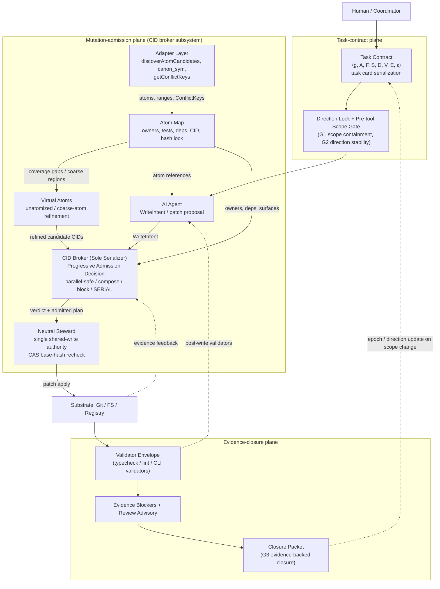
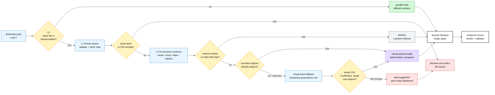
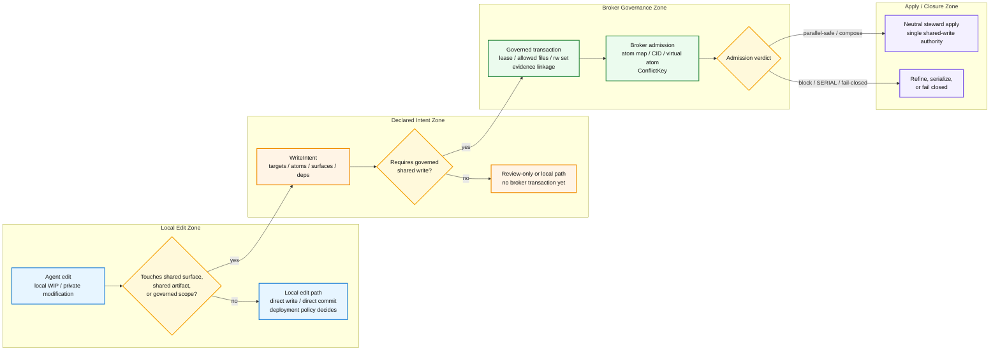
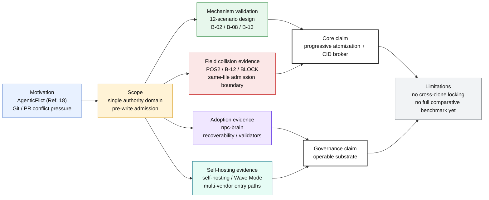

# ATM：同域多供應商 LLM 程式碼共同合成的採用器導向原子化與 CID Broker
### 軟體代理之規格錨定執行治理基底

## ATM: Adapter-Guided Atomization and CID-Brokered Admission for Single-Domain Multi-Vendor LLM Code Co-Synthesis
### A Specification-Grounded Governance Substrate for Software Agents

作者: Eaglhuang
Email: eaglhuang@gmail.com
日期: 2026-06-23
狀態: Draft v3.1 expanded baseline（arXiv full-paper track；single-domain boundary / progressive atomization / POS2 / B-12 evidence / expanded related work）
Repository: https://github.com/eaglhuang/AI-Atomic-Framework

---

## Abstract（摘要）

多代理 LLM 系統已能將軟體工程任務分解為規劃、生成、驗證與修復等協作流程，但在多個代理即將寫入同一共享程式庫之前，現有系統仍缺少一個位於寫入前、可審計且可重放的准入層。本文聚焦於一個刻意收斂的單一治理域問題：在同一受控檔案系統、worktree 或服務域內，當多個 agent 已形成寫入意圖但尚未實際落筆時，系統如何判斷哪些意圖可並行、哪些需要合成或序列化，以及哪些必須保守阻擋。

**ATM 並非僅是一個 concurrency broker。** 它是一個更廣的 **specification-to-evidence governance substrate**，將 task intent、repository scope、write admission、validators 與 evidence obligations 綁定於同一條治理路徑；其中 CID-brokered pre-write admission 作為 **共享變更准入子系統（shared-mutation admission subsystem）** 治理共享 repository mutations。

本文提出 AI-Atomic-Framework（ATM），一個以 specification-grounded governance substrate 為框架、以 adapter-guided atomization、atom map、virtual atom 與 CID broker 為共享變更准入子系統的多廠商 LLM 程式碼共合成框架。ATM 將模糊的寫入意圖轉換為可治理的 semantic atoms，並以 atom map 對齊 owner、dependency、validator、CID、hash lock 與 shared surface；當正式 atom map 覆蓋不足時，系統以 virtual atom 暫時治理未原子化區段，使 broker 仍能進行 bounded-region comparison。基於上述結構，ATM 以 seven-layer pre-write admission gate 檢查 CID identity、shared surface、read/write dependency、file range、ConflictKey、CAS base-hash 與 fallback file lock，並將結果導向 parallel-safe、composer-routed admission、SERIAL 或 fail-closed refinement path。實際寫入則由同一治理域內的 neutral steward 執行，以避免多個 agent 各自直接修改共享檔案。

本文以分層且可追溯的證據鏈支持此設計：（i）一個 12-scenario deterministic fixture 設計矩陣與其中三個已歸檔的 deterministic runner 案例，用於驗證 broker 之 decision surface；（ii）一份歷時三週的外部採用者治理觀察，提供 adopter-side recoverability evidence；（iii）一個完整歸檔的同檔案 bounded-region admission 正向案例，連同 admission-time 漏抓但 apply-time fail-closed 的負向案例，以及 admission-time 直接阻擋的負向案例，共同構成「正向 existence proof + 雙向 failure mode」之證據三角；（iv）批次排程與 CID identity 穩定性之延伸觀察，作為治理延伸能力之佐證；（v）一條由 **v0.1 baseline** 與 **v0.2 paper profile** 組成的 AdmissionBench 證據鏈，其中 v0.1 凍結 benchmark substrate 與 blind-audit 邊界，v0.2 則提供 paper-facing result：在同一 20-scenario / 42-comparison benchmark family 上維持 0 expectation failures、0 unresolved rows、ATM-full route F1 = 1.000，並以 252 policy rows、294 ablation rows、210 adversarial rows 與 4 enforcement rows 支撐正文中的 Results 與 Ablation 敘事。本文不主張取代 Git merge，也不宣稱解決跨 clone 或跨 PR 的分散式衝突；本文的核心主張是，在單一受控治理域內，ATM 提供了一個可實作、可審計、可由 `generator-manifest.json`、`summary.json` 與 `paper-tables.md` 交叉查核、且可逐步擴充的寫入前准入層。

## 1. Introduction（緒論）

### 1.1 Motivation

本文的核心問題不是代理能否各自生成可用程式碼，而是當多個代理同時碰觸同一檔案、同一登錄表、同一設定表、同一生成產物或同一任務狀態機時，系統能否在寫入前判斷哪些意圖可並行、哪些必須序列化、哪些應立即阻擋。ATM 將此問題界定為同一治理域內的 pre-write admission problem；其處理範圍不涵蓋跨機器 clone、remote branch 或 PR merge 的分散式協調，而是專注於實際寫入發生前的可審計准入決策。此問題位於更廣的 LLM-for-SE landscape 中：近期 systematic literature review（Hou et al., 2024, Ref. 42）已將 LLM 在軟體工程之應用劃分為 code generation、testing、maintenance 與 coordination 等多個 sub-area，並指出 multi-agent coordination 是 emerging 而尚未成熟之主題；本文之 pre-write admission layer 即落在此 coordination 子主題之新缺口上。

近年的 repository-level code generation benchmarks 已清楚顯示，現代 AI coding 不再只是單檔或單函式生成。RepoBench（Liu et al., 2024）與 CrossCodeEval（Ding et al., 2023）將評估推向既有 codebase 中的 repository-level completion 與 cross-file context retrieval（Refs. 33, 34）；FEA-Bench（Li et al., 2025）進一步要求模型在既有 repository 中實作新功能，並同時新增與修改多個相關檔案（Ref. 35）；CodeS（Zan et al., 2025）與 NL2Repo-Bench（Ding et al., 2025）則把問題推到 from-scratch repository generation，使模型必須從自然語言需求生成完整 repository、維持 API 與 package layout 一致，並通過 execution-based tests（Refs. 36, 37）。2024–2026 進一步出現多條補強路線：Commit0（Ref. 43）以 library-from-scratch 生成評估長程規劃；PaperBench（Ref. 44）評估從研究論文重建可執行 codebase 的能力；FeatureBench（Ref. 45）將測試聚焦於 end-to-end agentic feature development；RACE-bench（Ref. 46）加入中間推理品質評估而不僅看終測 pass；SWE-PolyBench（Ref. 47）擴展為跨語言 repository-level benchmark；GitTaskBench（Ref. 48）則覆蓋更廣的 realistic repository-leveraging workflows。這些 benchmark 共同說明：repository-level 任務的困難，來自跨檔案依賴、長程規劃、局部修改與全域一致性之間的張力。

同時，多代理與並行控制研究也開始直接面對「共享狀態」問題。CodeTeam（Wang et al., 2026）透過 machine-checkable contract、file ownership 與 dependency-aware scheduling 來降低 repository construction 中的跨檔案漂移（Ref. 25）；CoAgent（Lyu et al., 2026）則從 tool/action 級別處理多代理共享狀態的 concurrency control，主張以 MTPO、filtered reads 與 saga-style compensation 支援長時間 agent 任務（Ref. 14）；S-Bus（Khan, 2026）以 HTTP middleware 與 DeliveryLog 在 commit time 重建 read set，提供 Observable-Read Isolation 以避免 shared-shard structural races（Ref. 26）。另一方面，AgenticFlict（Ogenrwot and Businge, 2026）在大規模 AI coding agent pull requests 中觀察到 substantial merge-conflict pressure，說明 AI-generated changes 在下游 Git / PR 階段已經累積可觀衝突負擔（Ref. 18）。

上述研究共同界定了本文的研究缺口。既有 repository-level benchmarks（Refs. 33-37）說明任務已具有多檔案與長程依賴特性；CodeTeam 類規劃系統（Ref. 25）展示了規劃階段的 ownership 切分；CoAgent 與 S-Bus 類系統（Refs. 14, 26）指出 agent shared-state concurrency 需要專門機制；AgenticFlict（Ref. 18）則量化了下游衝突壓力。然而，這些工作仍未直接提供一個單一治理域內、位於檔案寫入前、能判斷 same-file bounded regions 是否可安全共享的 code-region admission layer。ATM 的研究問題因此更窄也更具體：當多個 LLM agents 已經形成寫入意圖，且這些意圖位於同一受控 filesystem / worktree / service domain 時，系統如何在真正寫入前，以 atom、atom map、virtual atom、CID 與 ConflictKey 做出可審計的准入決策？

本文使用 AgenticFlict（Ref. 18）的方式也需先界定清楚：其 142K+ AI agent PRs、107K+ deterministic merge simulations、27.67% merge-conflict rate 與 336K+ fine-grained conflict regions，提供的是 downstream Git / PR conflict pressure 的量化動機，而不是 ATM 已經解決跨 clone / 跨 PR conflict 的直接證據。ATM 的切入點不是接手 Git merge，而是把治理時點前移：在變更進入 Git merge 或 PR 之前，先處理同一受控 worktree、檔案系統或服務域內的並行寫入意圖。

既有方法各自處理了問題的一部分。字元級方法如 CodeCRDT 提供底層合併基底（Ref. 1）；檔案級方法如 STORM 或 CAID 處理檔案或工作區隔離與寫入時仲裁（Refs. 3, 15）；工作流級方法如 SCF、MPAC 或相關 orchestration framework 管理角色、流程與審查（Refs. 2, 4, 9）。然而，這些方法多半未提供單一治理域共享寫入情境下的寫入前准入閘門：在同一檔案系統或服務域內，系統於實際寫入前，應能判斷同檔案但不同 bounded region 的兩個意圖是否可合併，或同一 shared surface 的兩個意圖是否必須 fail closed。本文即針對此缺口提出 ATM，並將其定位為 single-domain repository admission layer。

### 1.2 錯誤的二分法

本文拒絕一個常見但不必要的二分法：要嘛採用字元級 CRDT（Ref. 12），接受其語義盲點；要嘛採用完整 AST 或全域語意圖，承擔高昂的工程成本與 false-positive 風險。對多代理共享程式庫寫入而言，最小可行的治理單位通常不是字元，也不必然是完整 AST，而是由 domain adapter 提供的 atom、bounded region、CID 與 shared surface。

ATM 因此採取第三條路：adapter-guided atomization 加上 broker 准入。Adapter 不被要求理解所有語言語意，而是負責以足夠保守的方式宣告 candidate atom、source path、range、read/write dependency、ConflictKey 或 shared surface；broker 則不相信 LLM 的自由判斷，而是根據上述結構化資料做 deterministic admission decision。換言之，ATM 的設計不是將所有推理交給 LLM，也不是將所有語言強制塞進單一 AST，而是在工程上可落地的 adapter contract 與內建治理骨架上建立寫入前治理。

更精確地說，ATM 的發明直覺是逐層剝離衝突粒度。第一層先確認是否只是不同檔案或不同 artifact；第二層以 adapter 找出既有 semantic atoms；第三層以 atom map 連接測試、驗證、owner、dependency 與 shared surface；第四層在既有 atom 不足時建立 virtual atoms，讓未原子化段落也能被定位、比較與重算 CID。只有當這些層次都無法證明 disjoint 時，ATM 才將 intent 視為真正衝突並 fail closed。這使 ATM 的核心不只是「更細的 diff」，而是將模糊寫入意圖轉換為可審計准入證據的過程；後文的貢獻與實證，也都圍繞這條主線展開。

### 1.3 Contributions

本文的貢獻不在於再提出一個新的多代理編排器，而在於把單一治理域中的共享寫入，重述為一個可形式化、可計算、可審計的寫入前准入問題。本文將核心貢獻歸納為三點；證據、adopter study、self-hosting evidence 與 limitations 則放入 §4-§6 支撐，而不在本段混成額外貢獻。

1. Seven-layer pre-write admission with virtual-atom fallback. 我們提出一個七層寫入前硬性准入閘門，將多代理寫入意圖依序通過 CID identity、shared surface、read/write dependency、file range / virtual-atom refinement、ConflictKey + canMerge、CAS base-hash 與 fallback file lock 等檢查。此閘門的目的不是在事後修補 merge conflict，而是在寫入發生前判斷 intent 是否可並行、是否需 deterministic composer / neutral steward 代為合成、是否必須序列化，或是否應 fail closed。更重要的是，ATM 不假設 atom map 一開始就完整：當既有原子化覆蓋率仍不足、adapter 尚無法把所有區段歸入穩定 semantic atoms，或同檔案區域仍無法被可靠比較時，系統以 virtual atom 作為暫時治理單位。Virtual atom 讓未原子化段落仍可被定位、建立 provisional ConflictKey、重算候選 CID、進行 bounded-region disjointness 檢查，並在無法證明安全時保守拒絕。這使 ATM 的核心貢獻不是「允許更多並行」，而是提供一個從粗粒度檔案競爭逐層收斂到可審計准入判斷的 deterministic gate。
2. **A specification-to-evidence governance substrate.** ATM 將 agent 任務表述為一個結構化執行契約（structured execution contract），內含 approved task intent、allowed / forbidden scope、deliverables、validation commands 與 evidence obligations。**Task-direction lock** 與 **pre-tool scope gate** 約束未授權之行動於變更發生前；**validator envelope**、**evidence blocker**、**review advisory** 與 **closure packet** 約束無證據支撐之完成宣稱於執行之後。此 substrate **不**同步代理之 latent belief，也**不**保證 semantic correctness；它限制的是「specification drift / scope drift / unsupported reasoning」轉化為「未經治理之 repository mutation」或「不可審計之 task closure」的程度。框架由三個 plane 構成：**Task-contract plane**（任務契約：agent 被授權做什麼）、**Mutation-admission plane**（共享變更准入：此刻的共享寫入能否發生）、**Evidence-closure plane**（證據封閉：能否合理宣稱任務完成）。**CID broker 於此 substrate 中作為 Mutation-admission plane 之子系統運作**；本貢獻中所提之 candidate atom bridging、atom-map projection、CID / hash-lock 計算、virtual atom fallback、ConflictKey 比對、adapter-declared read/write dependency、deterministic composer 與 neutral steward apply path 等內建能力，共同實作該子系統並計算 Contribution 1 所需之准入決策資料。
3. Format-extensible atomization abstraction with explicit adapter contracts. 我們提出在明確 adapter 契約下的原子化抽象：atom 不是語法上最小的 token 或 AST node，而是寫入前仲裁所需的最小可治理語意單位；atom map 則將 bounded surface、owner、validator、dependency、CID、hash lock 與 shared surface 對齊成可查詢的治理索引。ATM 因此不強制所有語言服從單一 universal AST，也不把語意判斷完全交給 LLM，而是透過 `AtomizationPlanningAdapter` / `FileMutationAdapter` 介面，讓不同語言與格式以自己的方式回報 candidate atoms、ranges、read/write dependencies、ConflictKeys、virtual atom boundaries 與 validation hooks。這個設計讓 TypeScript、Python、JSON、Markdown 或其他結構化 artifact 都能在同一 broker model 下被治理，同時保留各語言 adapter 對語法、格式與專案慣例的局部知識。本文的第三項貢獻因此是把「原子化」從單一語言技巧提升為可擴充、但仍受 adapter contract 約束的 repository governance interface；跨語言 identity 與更強的語義對齊仍屬後續工作。

### 1.4 Organization

第 2 節定位相關研究與 ATM 所補上的准入層；第 3 節先定義 atom、atom map 與 adapter-guided atomization，再說明 CID、broker 准入流程、seven-layer gate 與 neutral steward；第 4 節報告 fixture、採用研究與現場證據；第 5 節列出限制與後續路線圖；第 6 節討論單一治理域邊界、adapter-guided 設計之取捨、open problems 與部署拓樸；第 7 節總結本文主張。

**Reproducibility**：本論文所有主張為「已實作且可重現」之 capability，均對應 AI-Atomic-Framework 開源 repository（`https://github.com/eaglhuang/AI-Atomic-Framework`）中的既有 source path 與可重現驗證命令。本文交叉檢查所對應的 framework snapshot 為 release tag `v0.9.0-alpha.1`（commit `0b31aa8683b44b3a78206132a0bf90a0fde73d1c`），讀者應以此 tag 作為主要引用點，避免 main 分支演進造成行號漂移。Appendix A.4 提供逐條 capability claim → source path → 可重現驗證命令之對應表，supplementary evidence artifact 集中於 3KLife planning repository 之 `docs/ai_atomic_framework/broker-collision-evidence/`。

---

## 2. Related Work（相關研究）

本文以「協調粒度」與「是否具備寫入前的預防式准入閘門」來比較相關研究。這種分層並非要將所有系統放入單一優劣序，而是說明 ATM 的貢獻位置：它不是取代 CRDT（Ref. 12）、Git、工作流編排（Refs. 2, 4, 9）或生成後驗證，而是在同一受控 worktree 或服務域的寫入前增加一層可治理的准入仲裁。換言之，本文第 2 節要回答的不是「誰比較強」，而是「哪些系統處理哪一層協調問題，而 ATM 補上的究竟是哪一層缺口」。

本文的 related work 採 citation-to-claim map，而非僅列舉相近系統：SWE-bench（Ref. 29）類研究支撐「真實 repository issue 需要跨函式、跨檔案推理」的背景；AutoGen 等多代理框架（Ref. 30）支撐「多代理編排已成熟但通常不提供程式庫寫入所有權語意」的缺口；Adya、OCC、COPS 與 CRDT 文獻（Refs. 12, 13, 31, 32）支撐「read/write dependency、isolation、causal dependency 與合併收斂」的系統基礎；CoAgent、S-Bus、CodeTeam、ATCC、STORM、CodeCRDT 與 AgenticFlict（Refs. 14, 26, 25, 6, 3, 1, 18）則構成 2025-2026 最直接的鄰近比較。這種安排使每一篇文獻都能對應到本文的 scope、mechanism 或 limitation，並降低將不同層級工作混為同一比較基準的風險。

近期 repository-level benchmark 已顯示，多檔案任務本身並非單一問題。RepoBench（Liu et al., 2024）與 CrossCodeEval（Ding et al., 2023）聚焦於既有 codebase 中的 repository-level completion 與 cross-file context retrieval（Refs. 33, 34）；FEA-Bench（Li et al., 2025）則轉向 incremental feature implementation，要求模型在既有 repository 中新增功能並同時修改相關檔案（Ref. 35）。再往前一步，CodeS（Zan et al., 2025）與 NL2Repo-Bench（Ding et al., 2025）將問題推到 from-scratch repository generation：模型從自然語言需求與空白 workspace 出發，必須生成完整 repository、維持跨檔案 API 一致性、處理 dependency layout，並通過 execution-based tests（Refs. 36, 37）。這條光譜說明，repository-level code generation 的挑戰會隨「既有結構可用程度」不同而改變；ATM 關心的則是另一個正交軸：無論任務是 completion、feature implementation 或 NL2Repo，當多個 agent 在同一治理域內形成共享寫入意圖時，是否存在一個寫入前、區域層級、可審計的 admission gate。

下表先給出本文後續擴張 related work 時的 citation-to-claim map。其用途是約束寫作：每新增一篇文獻，都要落在某個 claim row，而不是只為了增加參考文獻數量。

Table 1 — Related-Work Citation-to-Claim Map.

| Citation cluster | What it establishes | ATM comparison role |
|---|---|---|
| RepoBench / CrossCodeEval (Refs. 33, 34) | Existing-repository completion requires cross-file context | Establishes multi-file heterogeneity but not multi-agent admission |
| FEA-Bench (Ref. 35) | Incremental features require adding and editing code across an existing repository | Shows maintenance-style tasks create coordinated edit pressure |
| CodeS / NL2Repo-Bench (Refs. 36, 37) | From-scratch repository generation requires architecture, package layout, APIs, and executable tests | Establishes long-horizon repository construction difficulty |
| CodeCRDT / CRDT / OT (Refs. 1, 11, 12) | Text convergence and collaborative editing substrate | Shows why convergence alone does not equal semantic admission |
| STORM / CAID / Git worktree systems (Refs. 3, 15) | File-level or workspace-level mediation | Shows why same-file bounded-region admission remains missing |
| SCF / MPAC / coordination-layer papers (Refs. 2, 4, 9) | Workflow, intent, and authority are first-class | ATM pushes authority down to region-level write admission |
| CoAgent (Ref. 14) | Tool/action-level advisory concurrency with LLM repair and saga-style compensation | Closest Tier 2 neighbor; complementary reactive layer after ATM SERIAL |
| CodeTeam (Ref. 25) | Contract-normalized repository generation with file allocation and dependency-aware scheduling | Strong planning-side baseline; avoids same-file contention rather than admitting it |
| S-Bus (Ref. 26) | DeliveryLog-based automatic read-set reconstruction and Observable-Read Isolation | Alternative dependency-capture path; ATM currently uses explicit adapter/readAtoms |
| Cluster A — Content grounding: RAG / RARR / CoVe (Refs. 49-51) | External retrieval, evidence attribution, revision, and explicit self-verification can improve factuality of generated content | Content-level precedents only; **NOT** enforcement of agent scope, tool use, repository mutation, or task closure |
| Cluster B — Runtime policy enforcement: SWE-agent / AgentSpec / ClawGuard (Refs. 52-54) | Agent-computer interfaces and rule-based enforcement at tool-call boundaries can materially constrain LLM-agent behavior | **Closest adjacent work** to ATM's task contract, pre-tool scope gate, and deterministic enforcement; ATM specializes these ideas to repository governance and evidence-backed closure |
| AgenticFlict (Ref. 18) | Large-scale downstream AI PR conflict pressure | Motivation only; not direct evidence for ATM claims |
| SWE-bench / repository-level benchmarks (Refs. 29, 33-37) | Real tasks involve cross-file and repository context | Evaluation substrate candidate, not itself a concurrency-control method |

### 2.1 Tier 1：字元層並行控制

CodeCRDT、EvoGit 與 AgentGit 可視為低層次的合併基底（Refs. 1, 28, 29）。此類方法關心多代理文字變更如何收斂、如何回復，以及如何以版本控制作為同步媒介。其優點是普遍、語言無關、且易於嵌入既有編輯流程；其限制則是無法提供 atom、bounded region 或語意層級的寫入前准入。CodeCRDT 即使達到字元級收斂，仍需承認 5-10% 的語義衝突，而這類衝突通常要等到 typecheck、lint 或 test 才會浮現（Ref. 1）。

需要明確切開的是 ATM 與 CodeCRDT 在 semantic soundness 上的對應關係：ATM 並非宣稱能將語義衝突率壓至 0。如 §4.6 與 §6.2 所述，ATM 的 `parallel-safe` verdict 只保證 static admission closure（Proposition 2）—— 即「在既有 adapter、atom map 與宣告式依賴模型下，未觀測到足以阻擋的衝突訊號」——而不主張最終程式行為必然語義正確。其差異在於 **時機**：CodeCRDT 於字元收斂後讓 typecheck / lint / test 作為下游語義 catch；ATM 則於寫入前 fail closed 那些「無法靜態證明安全」的意圖，但對已 admitted 的寫入仍仰賴 validator、CAS base-hash 與 fail-closed fallback 作為後續語義 catch。因此 ATM 與 CodeCRDT 在 5-10% 語義衝突這條 baseline 上不是 0% vs. 10% 的直接競爭，而是「將部分衝突前移至 admission 時被攔截或序列化，將其餘衝突繼續交由 validator / runtime check 處理」的時序重分配。對應的 admission-time false-negative 量化比較仍屬 §5 deferred comparative benchmark。

因此，Tier 1 與 ATM 並非直接競品。ATM 可以建立在 Git、CRDT（Ref. 12）或檔案系統之上，但它回答的是更上層且更受限的問題：在同一治理權域的寫入發生前，哪些寫入意圖應被視為共享資源衝突，哪些同檔案變更其實可安全並行。跨 clone 或跨遠端分支的最終收斂，仍交由 Git / CRDT / merge substrate。

### 2.2 Tier 3：檔案層協調

STORM 以檔案版本與 observed dependency 進行 write-time OCC，能阻擋代理基於陳舊檔案狀態寫入（Ref. 3）。CAID 則以 git worktree 建立隔離工作空間，再由中央 delegator 進行合併（Ref. 15）。二者皆強化了多代理工作空間的安全性，並使 agent 在局部空間內能較自由地工作。

然而，檔案仍是過粗的協調單位。若兩個代理同時修改同一檔案中互不重疊的兩個函式，檔案級 OCC 可能仍拒絕其中一方；git merge 則要等到事後才知道是否衝突。ATM 的 bounded-region admission 正是針對此缺口：它將「同檔案」進一步拆為可由 adapter 宣告與 broker 檢查的 region、CID 與 ConflictKey。

### 2.3 Tier 4：工作流治理

SCF、MPAC 與相關工作流治理系統處理的是角色、意圖、流程與審查層次的協作。SCF 以 Semantic Intent Graph 檢測工作流衝突（Ref. 2），MPAC 以多層協定降低多代理協作開銷（Ref. 4）。這些方法的重要性在於，它們指出多代理協調不是單純的 merge 問題，而是 authority、intent 與 governance 問題。

但對單一治理域中的共享程式庫寫入而言，工作流層級的治理通常缺乏區域層級的准入閘門。它能決定誰負責某個任務、誰審查某個結果，卻不必然能判定同一檔案中兩個 bounded regions 是否可以在同一受控 worktree 中被 neutral steward 套用。ATM 將工作流治理中的 authority 概念，進一步下沉到寫入前的 broker verdict。

若從 2026 年的 repository-level code generation 角度觀察，CodeTeam 代表另一個幾乎位於光譜對側的設計點：它針對 NL2Repo 場景，先由多個 Architect agents 產生競爭式 software design sketches，再由 CTO agent 選擇並正規化為 machine-checkable contract，接著讓 Developer agents 在 dependency-aware scheduler 下依檔案與介面責任實作，並由 QA agent 在完成或測試失敗時觸發修復（Ref. 25）。這類方法對降低跨檔案介面漂移很有效，也能以較低的 runtime 治理成本換取穩定性；然而，它的主要策略是把責任切到檔案與合約層，盡量避免同檔案並行寫入。ATM 與其並非互斥，而是處理不同的共享策略：CodeTeam 偏向以設計合約與靜態 ownership 避開 same-file contention，ATM 則處理「即使同一檔案必須共享，是否仍能在 bounded region 層安全准入」。換言之，CodeTeam 是 planning-time repository construction baseline；ATM 是 write-time-before-write admission layer。

### 2.4 Tier 2：相近系統與 2025-2026 鄰近工作

CoAgent 是 ATM 最接近的 Tier 2 系統之一（Ref. 14）。CoAgent 的出發點是多個 sub-agents 並行操作共享狀態時，傳統 2PL / OCC 會遇到兩個 agent-specific gap：一是外部世界副作用不容易被 staging 或 rollback，二是長時間任務一旦 abort 會浪費大量推理與執行成本。其 MTPO 因此偏向 tool/action 級的 advisory-reactive concurrency control：系統透過固定序與 filtered read 讓 agent 看到某個單調軌跡，對衝突採通知與局部重判斷，必要時再依 saga-style inverse action 補償已執行副作用。ATM 則偏向 code-region 級的 preventive concurrency control：它在寫入前要求 adapter 宣告 atom、range、shared surface 與靜態 dependency，由 broker 先行裁決。兩者並非同質替代品；CoAgent 較適合 read set 難以事前宣告、且 tool side effect 必須由代理自行消化的 middleware 情境，ATM 則較適合可由 adapter 還原結構化寫入範圍的程式碼與格式化產物。更重要的是，兩者可形成層次化互補：ATM 在 admission 階段先做 deterministic arbitration，將大多數可預測衝突在寫入前收斂；CoAgent 類 MTPO 則於 SERIAL 路由後承接不可事前宣告 side effect 的 reactive repair。換言之，二者並非替代關係，而是寫入前准入層與後續修復層的接續。另需指出的安全角度差異：CoAgent 的 notification → LLM self-repair 路徑本質上仰賴 LLM 對受污染區段重新推理，當該推理過程本身產生 hallucination 時，conflict 可能由 broker 層下移到 validator 或 runtime 層才被察覺；ATM 之 fail-closed 路徑則在 admission 階段以結構化判據直接拒絕，不引入第二次 LLM 推理。這不是普遍意義上的優劣，而是在 mission-critical module 中「不希望以 LLM 推理作為衝突修復主迴路」的部署偏好下，兩者出現可衡量的安全側差異。

AgentSpawn 則代表另一種相鄰但干預時機不同的路線（Ref. 5）。它以動態生成子代理、記憶切片與多階段衝突合併，強化長週期程式碼生成中的後段協作彈性；其衝突處理重心仍偏向 post-hoc merge，包括行級自動合併、語意合併與升級處理。相較之下，ATM 的關心點更早，也更窄：在多個代理尚未真正落筆前，哪些寫入應被允許、序列化、導向 composer，或直接 fail closed。這使兩者最核心的差異不在於是否使用多代理，而在於將計算與治理成本放在「生成前的准入」或「生成後的合併」。同屬 post-hoc 路線的另一條代表性工作是 Rover（Zhang et al., 2026, Ref. 16）：它以 LLM 進行 context-aware conflict resolution，從合併衝突 hunk 中提取上下文並以模型推理建議解法。Rover 與 AgentSpawn 共同強化「合併後處理」流派的能力；ATM 則互補地將治理時點推到合併之前，使部分原本要在 Rover-style post-hoc layer 重新推理的衝突，於 admission 階段就被結構化地拒絕或序列化，降低 LLM-based 修復回合的觸發頻率。此外，Sartori（Ref. 10）將代理協作失敗中的一部分歸因於「規格落差（specification gap）」與部分知識下的協調失誤，呼應本文 §6.2 所述 adversarial / dishonest agent 與 adapter trust 風險之根源：當代理對共享 surface 的認知不一致時，無論 admission 路徑或 post-hoc 路徑都會受影響，差別僅在於失敗的偵測時點。

MACOG、ProjectGen + SSAT、DebateCoder、Multi-Agent Code Verification 與 Singh intent-driven optimization 則分別落在協作編排、架構分解、結果驗證與生產效能最佳化層（Refs. 20-24）。它們回答的是「如何分解任務」、「如何安排角色」、「如何驗證產物」或「如何降低 token 與延遲成本」。ATM 回答的則是較窄但關鍵的寫入前准入問題：當多個 agent 已經形成寫入意圖時，是否准入、如何准入，以及如何讓寫入成為中立且可審計的事件。

下表進一步將上述差異整理為能力邊界矩陣。需要強調的是，本表比較的是各方法在共享 repository 單一治理域內，對寫入前准入與同檔案共享寫入的治理能力；並非主張所有系統的研究目標完全相同。

Table 2 — System Boundary Matrix.

| System | Layer | Preventive or Advisory | Admission-time Gate | Shared-file bounded region | Neutral serialization |
|---|---|---|---|---|---|
| CodeCRDT (Ref. 1) | character merge substrate | preventive at text convergence | no | no | no |
| STORM (Ref. 3) | file-level write mediation | preventive at file write | partial | no | no |
| CAID (Ref. 15) | workspace isolation | reactive merge | no | no | central merge |
| CodeTeam (Ref. 25) | file ownership + dependency scheduler | preventive by static allocation | partial | no | git-based coordination |
| SCF / MPAC (Refs. 2, 4) | workflow governance | advisory / preventive by intent | partial | no | workflow-level |
| CoAgent (Ref. 14) | tool/action concurrency | advisory / reactive | no hard code-region gate | no | depends on tool chain |
| ATM | repository admission layer | preventive | yes | yes | neutral steward |

Table 3 — Capability Matrix for Pre-Write Admission.

| Capability | CodeCRDT (Ref. 1) | STORM (Ref. 3) | CAID (Ref. 15) | CoAgent (Ref. 14) | CodeTeam (Ref. 25) | ATM |
|---|---|---|---|---|---|---|
| 寫入前准入（pre-write admission） | no | partial | no | no | partial | yes |
| 同檔案 bounded-region 安全共享寫入 | no | no | no | no | no | yes |
| 單一治理域內仲裁（single-domain arbitration） | no | yes | yes | yes | yes | yes |
| coverage 不足時的虛擬原子細化 | no | no | no | no | no | yes |
| 中立寫入者／唯一正式 apply authority | no | no | partial | no | no | yes |

上表顯示，ATM 的差異不在於「再次提出一個多代理框架」，而在於它同時結合了寫入前准入、same-file bounded-region admission、virtual atom refinement 與 neutral steward apply，因而補上既有方法之間長期缺少的 Tier 2 admission layer。

### 2.5 鄰近基礎

OT、CRDT、two-phase locking 與 optimistic concurrency control 提供了 ATM 的基礎思想（Refs. 11-13）。Operational Transformation 譜系（Sun et al., 1998, Ref. 38；Sun and Ellis, 1998, Ref. 39）以 transform 函數於 post-hoc 階段保證 convergence、causality 與 intention preservation；其與 ATM 之分工為：OT 解決事後文字級收斂，ATM 處理事前 admission，二者層次互補而非競爭。並行控制之經典 OCC 框架（Bernstein, Hadzilacos, and Goodman, 1987, Ref. 41）則為 §3.5 Definition 7 之 CAS base-hash guarded apply 提供教科書級之 OCC 對應 — broker 之 admission verdict 對齊 OCC 之 validate 階段，steward 之 base-hash recheck 對齊 OCC 之 write 階段。ATCC 雖不是軟體工程工作流治理系統，而是資料庫 transaction engine 對 unforeseen agentic transactions 的自適應並行控制（Ref. 6），但它提醒了另一件重要的事：一旦 transaction 由長時推理、動態讀寫與高 abort cost 所主導，傳統 OCC / PCC 的成本模型便會失真。ATM 與其之關係不是同層競品，而是跨領域借鏡：它將這種「經典並行控制假設失效」的問題，帶到共享程式庫寫入之前的 admission 階段。

S-Bus 則代表依賴捕捉的另一條路線（Ref. 26）。它以 HTTP middleware 與 server-side DeliveryLog 自動記錄每個 agent 的 GET 操作，並在 commit time 重建 read set，形成 Observable-Read Isolation。其論文將目標收斂到 dedicated-shard topology：每個 agent 擁有不同 write key，並讀取共享 reference shards；在此範圍內，S-Bus 以大量 HTTP-409 contention sweeps、TLAPS / TLC / Dafny 證據與 empirical parity 對照 PostgreSQL SERIALIZABLE / Redis WATCH/MULTI，主張能防止 HTTP-observable read projection 上的 structural conflicts。相較之下，ATM 目前採取的是 adapter / atom map / `readAtoms` 的顯式宣告路線，而不主張完整的動態 read tracing；ATM 的 shared surface 也不是 HTTP shard，而是 source code region、format adapter record、atom-map member、validator 或 artifact。這個對比有助於說明：ATM 的 novelty 不在於提出所有可能的 dependency capture 方法，而在於把顯式宣告、progressive atomization 與 broker admission 組合成可治理的 single-domain pre-write gate。

需要清楚標示的是兩者之間的設計取捨而非能力高低。S-Bus 採動態 read tracing，優點是自動發現代理未明示之 read dependency，缺點是須假設讀取行為可被 HTTP middleware 完整觀測，且其 shared shard 模型限定於 dedicated-write topology；ATM 採顯式 `readAtoms` 宣告，優點是 admission verdict 可在 broker-local active registry 上以靜態圖直接判定（Definition 6）、可重放、可審計，並可推廣到 code region、JSON record、numeric scalar 與 atom-map shard 等非 HTTP 治理面，缺點則是若 adapter 或 agent 漏報 `readAtoms`，broker 無法以動態觀察補位，需仰賴 validator、CAS base-hash 或 fail-closed 收口。本文不主張任一路線在 false-negative coverage 上絕對占優——該量化對比屬 §5 deferred comparative benchmark 範圍；本文主張的是兩者構成不同 admission philosophy 下的 design point，未來可由 S-Bus 之 DeliveryLog 思路作為動態 read-dependency 補強，疊加於 ATM 之 atom map 與 active registry 之上，而非彼此替代。

最後，本文亦留意到一條尚未在本研究中正式比較的方向：將多代理失誤的一部分重新詮釋為**代理間語境漂移（context drift）**，並以輕量同步協定在共同推理前提早對齊狀態。這類方法與 ATM 並不衝突，但層次更前：它關心的是代理在形成寫入意圖之前，是否已處於互相發散的知識狀態。ATM 不主張已完成獨立的 context-drift benchmark；本文亦不將下列鄰近文獻視為單一同質類別，而是依研究問題拆為兩個 cluster，並明示各 cluster 與 ATM 之關係邊界。

**Cluster A — Content grounding and verification.** Retrieval-augmented generation 將輸出條件化於可檢索之外部證據以提升知識密集任務之 factuality（Lewis et al., 2020, Ref. 49）；RARR 以 evidence attribution 與 post-hoc revision 修正既有生成內容之 unsupported claims（Gao et al., 2022, Ref. 50）；Chain-of-Verification 透過顯式 verification planning 與 self-verification 降低 hallucination（Dhuliawala et al., 2023, Ref. 51）。此 cluster 提供的是 **content-level precedents only**：證明在 generation 過程中加入 retrieval、attribution、revision 或 self-verification 可改善生成內容之真實性。**它們並不提供 software-agent scope、tool use、repository mutation 或 task closure 之 runtime enforcement**，因此本文不主張其等同於 ATM 之 scope gate、validator envelope 或 closure packet；它們僅為 ATM 之 evidence-closure 設計提供文獻方向之背景動機。

**Cluster B — Runtime policy enforcement at agent action boundaries.** SWE-agent 顯示 agent-computer interface 與工具回饋設計會顯著影響 coding agent 在 repository 中導覽、修改檔案與執行測試之表現（Yang et al., 2024, Ref. 52）；AgentSpec 提供一套 DSL，允許 trigger、predicate 與 enforcement mechanism 之宣告，於 runtime 約束 LLM agent 之 tool calls（含 code execution）（Ref. 53）；ClawGuard 在每一個 tool-call boundary 執行 user-confirmed rule set，於 indirect prompt-injection 威脅模型下提供 task-specific 之 deterministic access enforcement（Ref. 54）。此 cluster 是 ATM 之 task contract、pre-tool scope gate 與 deterministic enforcement 設計的 **closest adjacent work**：它證明在 agent 行為邊界以結構化規則約束 tool calls 是可行且有效的研究方向。ATM 與此 cluster 之差異在於問題範圍與威脅模型：AgentSpec 提供一般化 runtime-policy 語言但不專屬軟體工程生命週期；ClawGuard 之 threat model 主要為 adversarial prompt injection，而非 multi-agent repository governance。**ATM 並未繼承 ClawGuard 之安全保證**；ATM 將相關 enforcement 思路專門化到 repository 治理：將 task intent、repository scope、write admission、validators 與 evidence obligations 綁定為一條治理路徑，並以 CID broker 子系統處理共享變更准入。

綜合而言，ATM 對 context drift 之定位為：它不直接同步代理內部信念，而是在任務規格、寫入 scope、證據契約與 validator feedback 層面，降低漂移轉化為未治理寫入或不可審計 closure 的機率。相關多代理失敗模式之系統性分析仍可參考 Pan et al.（Ref. 7）與 Nechepurenko & Shuvalov（Ref. 9）；更完整的 drift-synchronization 對照實驗則屬後續工作。

Workspace protocol、TraceFix 與 latent-space parallel-branch synthesis 類工作（Refs. 8, 17, 19）則提醒我們，多代理系統本身也需要被視為 protocol，而不只是 prompting pattern；其中 latent-space synthesis 於 KV-cache 層處理 parallel branch merging，與本文的寫入前准入層次正交，可疊加於 ATM 的 deterministic-composer 路由之上。ATM 將這些基礎概念收斂到共享程式庫寫入：以 atom、CID 與 ConflictKey 定義衝突單位，以 broker 作為唯一序列化節點，並以 evidence substrate 使每次准入與阻擋可被審計。

Table 4 — Tier Granularity Ladder. 本文於協調粒度階梯中的位置：

| Tier | 粒度 | 代表系統 | 典型 domain | ATM 與之關係 |
|---|---|---|---|---|
| 1 | character | CodeCRDT (Ref. 1), EvoGit (Ref. 27), AgentGit (Ref. 28) | editing session / merge substrate | substrate（正交，可建立其上） |
| 2 (this paper) | atom / bounded region | ATM | single workspace / filesystem domain | admission layer ← 補上的缺口 |
| 3 | file / workspace | STORM (Ref. 3), CAID (Ref. 15) | workspace / worktree mediation | 對 same-file parallel 過粗 |
| 4 | workflow / intent | SCF (Ref. 2), MPAC (Ref. 4), coordination-layer work (Ref. 9) | process / workflow governance | 缺 region-level admission gate |
| out of scope | branch / PR | Git three-way merge, PR review | cross-machine clone / remote branch | ATM 不取代此層 |

ATM 並非取代 Tier 1/3/4，也不取代跨機器 Git PR 合併；它是在 single workspace / filesystem domain 的 Tier 2 補上一層可治理的 admission gate。

---

## 3. Framework（方法）

ATM 的設計目標，是在 agent generation 與 filesystem mutation 之間建立一個治理層。它不生成程式碼，也不替代測試或 code review；它要求所有寫入先被表述為結構化寫入意圖，再由 broker 決定該意圖是否能進入寫入路徑。

**本章內部結構說明（reader navigation）。** 為協助讀者區辨「規格錨定治理基底」、「形式模型 + 假設」與「實作框架 + admission pipeline」三層概念，本章分為兩個概念群組：

> **Part A — Model and Assumptions（§3.1–§3.3）**：§3.1 引入 specification-grounded governance substrate 之三層平面與三個 governance invariants；§3.2 給出 broker / agent / steward 之架構總覽與單一治理域假設；§3.3 提供 atom / atom map / virtual atom / two-tier CID 之形式定義（Definitions 5–6）。
>
> **Part B — Framework and Implementation（§3.4–§3.7）**：§3.4 之 admission pipeline（Algorithm 1）與 Propositions 1–2；§3.5 之七層硬性閘門與 Definition 7 之 CAS-based runtime closure；§3.6 之跨格式推廣；§3.7 之已知 scope 限制。

三個概念群組共享同一治理 domain 假設：Part A §3.1 之 substrate 模型為 §3.2–§3.7 所有 plane-specific 機制提供共同骨架；CID broker（Part B §3.4–§3.5）作為 §3.1 Mutation-admission plane 之子系統實作。若讀者僅關心 ATM 之 governance 模型可閱讀 §3.1；若關心形式定義繼續讀 §3.2–§3.3；若關心 admission verdict 如何具體產生請讀 §3.4–§3.7。

---

#### Part A — Model and Assumptions

### 3.1 Specification-Grounded Governance Substrate

ATM 之核心定位為一個 **specification-grounded execution-governance substrate**：它將 agent 之任務、行為邊界與完成宣稱綁定到一個結構化執行契約（**Task Contract**），並以三個 plane 分別治理 agent 被授權之範圍、共享變更之准入時點、以及任務完成之證據封閉。CID broker 不是此 substrate 之同義詞，而是其 Mutation-admission plane 之子系統。

**Definition 8（Task Contract）.** 對任一被授權之 agent 任務 $\mathcal{T}$，其 Task Contract 為八元組
$$\mathcal{T} = \langle g, A, F, S, D, V, E, \epsilon \rangle$$
其中 $g$ 為 approved task intent（任務目標）、$A$ 為 allowed resources / files、$F$ 為 forbidden predicates / rules、$S$ 為 governed scope paths、$D$ 為 required deliverables、$V$ 為 validation commands、$E$ 為 evidence obligations、$\epsilon$ 為 task-direction epoch。實作中，**task card** 為此 contract 之具體序列化形式；scope-lock、direction-lock、validator envelope、evidence blocker 與 closure packet 等 framework 機制皆參照同一個 $\mathcal{T}$。

**三層 plane 架構。** 此 substrate 由三個責任分明之 plane 構成；每個 plane 回答 agent 治理中一個不同層次的問題：

| Plane | ATM 機制 | 回答的問題 |
|---|---|---|
| **Task-contract plane** | task intent, allowed files, forbidden rules, scope paths, deliverables, direction lock | agent 被授權做什麼？ |
| **Mutation-admission plane** | atoms, CID, ConflictKey, read/write set, active registry, broker, neutral steward | 這個共享寫入此刻能不能發生？ |
| **Evidence-closure plane** | validation commands, validator envelope, evidence blockers, review advisory, closure packet | 可以合理宣稱任務已完成嗎？ |

三個 plane 共同回答的不是「agent 是否會幻想或誤解需求」，而是「**錯誤想法在轉化為共享 mutation 或 task closure 之前，必須通過哪些可檢查的治理邊界**」。

**三個 Governance Invariants.** ATM 之治理保證以下列三個 invariant 表述；本文稱其為 Invariant G1 / G2 / G3，**不**主張其等同於可機械證明之 theorem，而是 substrate 之 design contract：

- **G1（Scope containment）.** 對任一受治理寫入意圖 $I$ 與其關聯之 task contract $\mathcal{T}$，必有 $W(I) \subseteq A(\mathcal{T})$，即實際寫入範圍不超出 allowed scope。
- **G2（Direction stability）.** 若 task goal $g$ 或 scope $A, S$ 改變，必須產生新之 direction epoch $\epsilon' \neq \epsilon$；agent 不得在不更新 epoch 之情形下靜默改變任務方向。
- **G3（Evidence-backed closure）.** 任務之 closure 為合法當且僅當
  $$\text{Close}(\mathcal{T}) \Rightarrow V(\mathcal{T}) = \text{pass} \;\land\; E(\mathcal{T}) = \text{satisfied} \;\land\; \text{Writes}(\mathcal{T}) = \text{governed}.$$
  亦即 validator 全數通過、evidence obligations 已滿足、且所有共享寫入皆經 broker / steward 治理路徑。

**Drift 分類學。** 為避免「context drift」之廣泛使用造成混淆，本文將可觀測之 drift 細分為五類，並明示 ATM 之處理邊界。ATM 之承諾為「外顯後果之治理」，而非「內部信念之同步」：

| Drift 類型 | 定義 | ATM 處理機制 |
|---|---|---|
| **Epistemic drift** | agent 內部知識／信念與真實狀態偏離 | **不直接處理**（屬 agent 內部推理範疇） |
| **Specification drift** | agent 行為偏離批准之 task intent | direction lock、task contract、epoch versioning |
| **Scope drift** | 修改未授權 file / surface / tool | allowed files、scope paths、pre-tool scope gate |
| **Evidence drift** | completion claim 與 validator / evidence 不一致 | validator envelope、evidence blocker、review advisory、closure packet |
| **State drift** | intent 基於已變動之 base / read dependency | active registry、`readAtoms`、CAS base-hash |

換言之，ATM 不主張消除幻覺或同步 latent belief，而是限制這四類 observable drift（specification / scope / evidence / state）轉化為「未經治理之 repository mutation」或「不可審計之 task closure」的程度。

**子系統角色釐清。** 後續 §3.2–§3.3（架構總覽、atom / CID 形式定義）與 §3.4–§3.7（admission pipeline、七層閘門、跨格式推廣、scope 限制）所描述之 broker、atom map、ConflictKey、neutral steward 與 validator 機制，皆為本節三個 plane 在實作層之具體展開。其中 **CID broker 對應 Mutation-admission plane 之核心子系統**：它不單獨構成 governance substrate，而是 substrate 之 admission subsystem。Task-contract plane 與 Evidence-closure plane 之主要 enforcement 元件——direction lock、pre-tool scope gate、validator envelope、evidence blocker、closure packet——則由 ATM framework 之外圍治理層實作，並與 broker 共享同一份 active registry 與 active-intent visibility。

---

### 3.2 架構總覽

ATM 可分為五個責任邊界，並共享一個逐步細化的語意索引。本文假設這些邊界位於同一個治理域：同一台電腦、同一個受控 server、同一個 worktree service，或其他能提供單一 broker / steward authority 的環境。Adapter 負責從語言或格式中擷取 candidate atoms、bounded ranges、read/write dependencies 與 conflict keys；Atom Map 將這些資訊整理為可測試、可驗證、可審計的邏輯地圖。若 map 尚未覆蓋某段變更，broker 會建立 virtual atoms 作為暫時治理單位。Agent 負責提出 patch 或寫入意圖；Broker 負責做出准入決策，輸出 allow、compose、block 或 re-arbitrate 類 verdict；Neutral Steward 則負責將 broker 已准入的 plan 實際套用至同一受控 worktree。它不是內容提案者，也不是裁決者，而是 broker 裁決的執行器、同一治理域內的唯一寫入權威，以及 evidence record、validator trigger、後續 commit / pre-push 治理鏈的落地節點。Substrate 包含 Git、檔案系統、registry、validator 與 evidence artifacts；其中 Git 是版本控制與跨 clone 合併 substrate，而非 ATM 在本文中要取代的分散式鎖。

Figure 1 — ATM Governance Substrate Architecture（specification-grounded, three-plane）。圖中以三組 subgraph 分別對應 §3.1 之 Task-contract plane、Mutation-admission plane 與 Evidence-closure plane；CID broker 與 neutral steward 位於 Mutation-admission plane 內，作為 governance substrate 之共享變更准入子系統：



**Figure 1 圖例說明（three-plane reading）。** 三組 subgraph 分別對應 §3.1 之三個 plane：

- **Task-contract plane**：自 human / coordinator 出發，產出結構化 Task Contract $\mathcal{T} = \langle g, A, F, S, D, V, E, \epsilon \rangle$（具體序列化為 task card），並透過 direction lock + pre-tool scope gate 強制 G1（scope containment）與 G2（direction stability）。
- **Mutation-admission plane**（CID broker subsystem）：agent 之 WriteIntent 經 adapter / atom map / virtual atom 結構化後進入 broker；broker 為**唯一序列化節點**並產出 verdict；neutral steward 於 admission 通過後執行單一實際寫入並做 CAS base-hash recheck。此 plane 即為本文 §3.4–§3.5 之 admission pipeline 與七層閘門。
- **Evidence-closure plane**：steward 寫入後觸發 validator envelope（typecheck / lint / CLI validators）；evidence blockers 與 review advisory 檢查 deliverables 是否具備可追溯 evidence；closure packet 為任務合法 close 之證據封閉物，對應 G3（evidence-backed closure）。

圖中實線箭頭為主治理路徑；三條虛線箭頭為非阻塞回饋通道，**並非 admission decision 路徑**：(a)「evidence feedback」自 substrate 回 broker，承載 verdict log、CAS base-hash 結果與 closure packet，使後續 admission 能讀到最新 active registry 狀態（Definition 6）；(b)「post-write validators」自 validator envelope 回 agent，承載 typecheck / lint 結果使 agent 能於下一輪 intent 之前感知 validator catch（如 §4.3 之 3 次 validator catches）；(c)「epoch / direction update」自 closure packet 回 Task Contract，於 scope 或 goal 變更時觸發 epoch $\epsilon \to \epsilon'$（G2）。三條虛線回饋皆**不**改變 broker 對當前已 admitted plan 的單次 apply 決定，僅作為下一輪治理之輸入。

此架構的關鍵在於，agent 不直接取得對共享檔案系統的最終寫入權。Agent 可以產生 proposal，但 proposal 必須經過 broker；若 broker 判定可合併，仍由 neutral steward 完成實際寫入。這使「誰提出變更」與「誰執行寫入」分離，降低多代理互相覆寫、競逐或跳過治理流程的風險。

需要特別說明的是，圖 1 描述的是 ATM 的治理路徑，而不是聲稱同一治理域中的每一次本地寫檔都必須經過 steward。對單一 agent、私有 work-in-progress、尚未進入共享 surface 的局部修改，部署者仍可保留 direct write / direct commit 工作流；ATM 主要介入的是共享檔案、共享 artifact、或其他已被宣告為需治理的 write intents。一旦寫入進入 broker-governed path，neutral steward 才成為唯一正式 apply authority。

### 3.3 Atom、Atom Map、Virtual Atom 與 CID

ATM 中的 atom 是可治理的最小邏輯單位。實作上，atom 可表示 function、class method、registry entry、JSON record、numeric scalar、text range，或其他由 adapter 定義的結構化片段。這意味著 ATM 治理 AI 寫碼的方式，不是直接對整個檔案下命令，而是先把寫入意圖對映到 atom，再依 atom 之間的 shared surface、dependency 與 bounded region 判斷此刻是否可以寫、要不要分流，以及最後由誰實際寫入。Atom 的用途不只是命名程式碼區段，而是讓 broker、validator 與 auditor 能把一次寫入對齊到可追蹤的語意位置。為了支援 broker decision，本文保留下列必要欄位：atom identity、logical name、version、source path/range、input/output schema、status、atom grade 與 hash lock。完整 8-tuple 可寫為：

$$a = \langle id, name, ver, P, \sigma, \psi, \gamma, H \rangle$$

其中 $P$ 是 atom 對應之 file path 與 line range 集合；$\sigma$ 是 schema；$\psi$ 是狀態；$\gamma$ 是 atom grade（標示該 atom 之治理成熟度，例如 candidate / virtual / formal / capsule-bound，與 §2 之 Tier 1-4 coordination granularity ladder 為不同概念，不可互換）；$H$ 是規格、程式與測試的 hash lock。**符號命名說明：** §2 使用 "Tier 1-4" 描述跨系統的 coordination granularity 層級（字元 / 區域 / 檔案 / 工作流）；§3 此處的 atom-level $\gamma$ 描述單一 atom 在治理生命週期中的成熟度等級；兩者不共享語意空間，本文以 Tier（總是大寫且帶數字）vs. atom grade $\gamma$（總是搭配 atom 上下文）區分。對 broker 而言，最重要的是讀者能在此節後理解三件事：何謂 same owner、same CID、以及 disjoint bounded region。

Atom map 是由這些 atoms 形成的語意索引，也是 ATM 真正的治理基底。它將 source range、owner、測試入口、validator、read/write dependency、shared surface、Candidate CID、Capsule CID 與 hash lock 對齊到同一個可審計的圖狀結構。若借用最精簡的層次語言來說，atoms 提供的是 conflict identity，atom map 提供的則是 governance context：前者回答「這次寫入碰到哪個治理單位」，後者回答「這個治理單位連到哪些 owner、validator、dependency 與 shared surface」。換言之，atom map 不是文件目錄，而是寫入前准入層的語意感測器：broker 透過它知道某個寫入意圖觸碰的是哪個邏輯單位、應由哪些 validator 驗證、是否與其他 active intent 共享 surface，以及是否需要被序列化。需要更精確地說，僅有 atoms 與其 `atomId / atomCid` 時，broker 仍可先做第一層 CID 衝突判決；但若缺少 atom map，系統較難把 owner、validator、dependency、shared surface 與 coverage gap 一起納入同一個可審計索引，於是同檔案爭用往往只能停留在較粗的 atom-set 或 file-overlap 判斷。正因如此，atom map 的關鍵價值不在於「讓 CID 判決首次成為可能」，而在於把同檔案寫入還原成「哪些已知治理單位、哪些共享 surface、哪些驗證責任實際被觸碰」這個更細且可追溯的問題。

Adapter-guided atomization 則回答「應該如何原子化」。ATM 不要求所有語言先具備同一套 universal AST，也不要求 atom map 在第一天就完整；相反地，我們把 candidate discovery 下放給 adapter，允許 TypeScript、Python、JSON 或其他格式各自以 regex、scanner、compiler API、AST、LSP 或 format-specific locator，回報對本語言最便宜且穩定的 atom 候選、canonical symbol、bounded region 與 shared surface。這使 ATM 的原子化不是一次完成的靜態前處理，而是可漸進擴充的治理能力：先有 candidate atoms，再形成 atom map，再逐步補齊 coverage、validator 與 dependency。更重要的是，ATM 並不是只提出一個抽象介面，再把實作成本全部外包給 adopter；框架本身已內建 candidate atom bridging、CID 計算、atom-map projection、virtual atom fallback、task-card / skill routing、editor integration adapter、validator / evidence substrate 與 neutral steward 等預設治理骨架。換言之，採用者通常不需要先重做整套 broker 與治理流程，而是可在既有骨架上，依目標語言或格式補上對應 adapter。就目前實作而言，正式原子化與 atom map 生成已至少在 TypeScript 與 Python 兩種語言上落地；其中 TypeScript 可視為目前最成熟的 reference language path，而 Python 並非僅有抽象介面，而是已有獨立 `@ai-atomic-framework/language-python` package、candidate discovery、atomization dry-run、驗證腳本與 fixture tests；其他語言與格式則依 `AtomizationPlanningAdapter`、`FileMutationAdapter` 與 locator contract 逐步接入，這一部分屬於框架既有核心之上的 ecosystem expansion，而非 ATM 核心治理能力尚未存在。

Virtual atom 則是 atom map 不完整時的暫時治理單位。當 adapter 尚未把某段程式正式原子化，或正式 atom map 對該區段的覆蓋仍不足以支撐可靠判斷時，broker 可依 syntactic enclosure、line range、signature boundary 或 format-specific locator 建立 virtual atom。Virtual atom 具有臨時 identity、bounded region、candidate CID 與 conflict keys，但不宣稱已是永久 API 單位；它的目的，是讓 broker 在未完成正式原子化之前，仍可把「同檔案疑似衝突」轉換為可比較、可驗證、可 fail-closed 的 admission 單位。也因此，ATM 的核心不是先假設 repository 已被完全原子化，而是在 atom map 覆蓋有限時仍能沿著 atom map -> virtual atom 的路徑把衝突逐層剝開。

相對地，atom capsule 並不是比 atom 更細的 runtime 判斷單位，也不是 virtual atom 的另一種名稱。依目前實作，capsule 是 atom 的內容封裝與版本錨點：它以 `canonicalSourceCode`、`inputSchema`、`outputSchema` 與 `policeConfig` 組成 atom bundle，並計算出 content-addressed 的 `Capsule CID`，主要用於 export/import、rollback、rescue 與 drift detection 等治理證據流程，而不是直接取代 broker admission 的第一線判斷。若用最不容易混淆的層次語言來說：atom 是治理單位，virtual atom 是暫時判斷單位，atom capsule 則是封裝與版本證據單位。

為了讓 broker 第一線判斷有形式錨點，本文補上兩個結構性定義。

**Definition 5（ConflictKey）。** 對 atom 或 virtual atom $a$，其 ConflictKey 定義為一對 $(S_a, L_a)$，其中 $S_a$ 為治理範圍類別（function、class method、JSON record/key path、numeric scalar、text range 或 atom-map shard 等 adapter 所宣告之 scope 種類），$L_a$ 為該 scope 種類下唯一定位 $a$ 的 locator（如 canonical symbol、JSON pointer、line span、registry id 等 format-specific 表達）。兩單位衝突當且僅當 $\text{ConflictKey}(a_i) = \text{ConflictKey}(a_j)$ 在同一治理 domain 下相等。Broker 因此可在 cross-format 場景中以同一 abstraction 比較 TypeScript function、Python decorator、JSON record 與 atom-map shard 是否觸及同一治理 surface。

**Definition 6（Active Registry）。** Active Registry 是 broker-local 的有限映射 $R : \text{TxnId} \to (\text{Intent}, A, D, W, F)$，其中 $A$ 為此 transaction 宣告之 atom set（含 virtual atoms），$D$ 與 $W$ 分別為其 declared read set 與 write set，$F$ 為對 target files 的 hash snapshot。$R$ 隨 admission verdict 而更新：`parallel-safe` 與 `needs-physical-split` 之 transaction 被加入；steward 完成 apply 後移除；`blocked-*` verdict 不進入 $R$。每個新進 intent 的 admission 比較皆以 $R$ 為當前 active 工作集，搭配 Proposition 2 提供之 static admission closure 條件。

這也說明了本文為何需要區分 two-tier CID。`Candidate CID` 服務的是 pre-write admission：broker 以它辨識候選治理單位是否與其他 active intent 衝突；`Capsule CID` 服務的則是 post-validation 與 capsule lifecycle：它錨定某個 atom bundle 的內容版本，並可進一步成為 map capsule 的 member 依據。換言之，candidate 與 capsule 不是兩種 competing atoms，而是同一 atom 在不同治理階段中的兩種識別面向。

ATM 使用兩種 CID。Candidate CID 用於 pre-write admission，由 adapter 對 kind、canonical symbol、source path、lineStart / lineEnd 所形成的 range signature，以及 detection method 進行 canonicalization 後雜湊而得。換言之，在目前 broker candidate bridge 的實作中，Candidate CID 並非只看 symbol 或 filePath，而是明確把候選區段的 line signature 納入 identity。Capsule CID 用於 post-validation artifact，以完整 source bundle、schema 與 policy 計算 content address。前者服務於寫入前仲裁，後者服務於封裝後版本錨定。此二層 CID 避免將「尚未寫入的候選區域」與「已驗證的封裝產物」混為一談。更重要的是，CID 並不是脫離 atom 而獨立存在的 fingerprint；它總是附著在 atom 或 virtual atom 這類治理單位之上，供 broker 判斷 identity、overlap 與 route。

為了讓後續的 bounded-region compare 具有明確的數學錨點，本文將 atom 或 virtual atom 的物理足跡直接視為其 source path/range 投影 $P_a$。給定兩個並行意圖所觸及的治理單位 $a_1, a_2$，所謂 physical disjointness 並不是模糊的「看起來行號沒撞到」，而是指其治理足跡滿足

$$P_{a_1} \cap P_{a_2} = \emptyset.$$

因此，bounded-region admission 的 `disjoint` 判斷，是建立在 adapter 已宣告並被 atom map 或 virtual atom 收錄的結構化範圍 $P$ 之上，而不是任意字串層級的啟發式 diff。

下表以最精簡方式整理四個容易混淆的治理物件。

Table 5 — Governance Object Comparison.

| 對象 | 角色 | 是否持久 | 是否進 broker 第一線 | 主要用途 |
|---|---|---|---|---|
| atom | 正式治理單位 | 是 | 是 | 表示可被宣告、索引、裁決的語意單位 |
| atom map | 治理脈絡索引 | 是 | 否（作為輔助索引） | 連接 owner、validator、dependency、shared surface、coverage |
| virtual atom | 暫時判斷單位 | 否 | 是 | 在 coverage 不足時補位，支撐 bounded comparison 與 fail-closed admission |
| atom capsule | 封裝與版本證據單位 | 是 | 否（不作第一線 admission identity） | export / import / rollback / rescue / drift detection / version anchor |

Adapter-guided discovery 的必要性在於，atom identity 無法完全由字串 diff 或檔案路徑推導。TypeScript function、Python decorator、JSON record 與 atom-map shard 各自具有不同結構；若沒有 adapter 宣告其 canonical symbol 與 bounded region，broker 只能退回檔案級或字元級判斷。ATM 因此將 adapter contract 視為 admission 的前置條件；而 virtual atom 則補上 adapter map 尚未完成時的中間層，使系統不必在「整檔鎖」與「盲目放行」之間二選一。對應的語意驗證則不由 ATM 代替專案自行發明；framework 只提供 validator 與整合測試掛點，讓採用者把 typecheck、unit test、integration test 或 domain-specific CLI validate 接到 atom map 與 steward path 上。

---

#### Part B — Framework and Implementation

### 3.4 准入流程

ATM 的准入流程從 write intent 開始，但其核心不是一次性比較檔案 diff，而是 progressive atomization。從治理角度看，AI agent 並不是「自由修改檔案」；它只能提出一個帶有 target files、atom references、candidate CIDs、bounded regions、shared surfaces 與必要 read dependency 的寫入意圖。Broker 收到寫入意圖後，不先問「這兩份 patch 行號有沒有撞到」，而是先問「它們分別落在哪些 atom 上、落在 atom map 的哪些 surface 上、是否還有未被 atom map 覆蓋的空白區」。若寫入意圖觸碰尚未被 atom map 覆蓋的段落，broker 會建立 virtual atoms，將原本模糊的同檔案重疊轉換成可比較的邏輯區塊。之後，broker 再依序比較 CID、shared surface、read/write dependency、physical overlap、known atom coverage、virtual atom coverage 與 bounded region，最後輸出 verdict。

主要 verdict 可概括如下：

Table 6 — Broker Verdicts and Follow-Up Paths.

| Verdict | 意義 | 後續路徑 |
|---|---|---|
| `parallel-safe` | 無 CID / surface / range 衝突 | 可進入 steward path |
| `needs-physical-split` | 同檔案但 CID disjoint，需合成 | deterministic composer |
| `blocked-cid-conflict` | 同 CID 或同 atom 寫入衝突 | fail closed / refinement |
| `blocked-shared-surface` | shared surface 互斥 | fail closed / serialize |

Figure 2 — Progressive Atomization Admission Flow. ATM 如何由粗到細揭露真正衝突點：



這個流程可濃縮為一條治理鏈：`agent proposal -> adapter-guided atomization -> atom map lookup -> virtual-atom refinement -> broker verdict -> neutral steward apply`。因此，ATM 所治理的不是抽象的「多人協作」，而是同一治理 domain 內 AI write intent 如何被 atom 化、比對、裁決與單次套用。

Algorithm 1 — Progressive admission with atom map and virtual atoms.

```text
Input: write intents I, I' over the same governance domain
Notation: P(·) = physical write surface, Surface(·) = declared shared
          surface set (registry / generator / artifact / active intent
          surface), D(·) = declared read atom set, W(·) = declared write
          atom set (see Definitions 5–6).

1: map I, I' to known atoms via adapter + atom map; resolve candidate CIDs
2: if same atom or same candidate CID, return blocked-cid-conflict
3: if Surface(I) ∩ Surface(I') ≠ ∅,
       return blocked-shared-surface or SERIAL (per shared-surface policy)
4: if (D(I) ∩ W(I') ≠ ∅) or (W(I) ∩ D(I') ≠ ∅), return SERIAL
5: if P(I) ∩ P(I') = ∅
       and Surface(I) ∩ Surface(I') = ∅
       and D(I) ∩ W(I') = ∅ and W(I) ∩ D(I') = ∅,
       return parallel-safe
   // Physical disjointness is necessary but NOT sufficient; lines 3–4
   // must have already cleared shared-surface and dependency hazards
   // before this early return is admissible.
6: if same file and same atom map but different atom ids, continue
       region-level checks
7: if known bounded regions are disjoint, route to needs-physical-split
8: otherwise create virtual atoms for uncovered or coarse spans
9: if virtual atom CID or ConflictKey still overlaps, test decomposition
       policy
10: if decomposition is admissible, recompute virtual atoms and bounded
        regions
11: if refined regions become disjoint, route to needs-physical-split
12: else emit split suggestion, record refinement evidence, and fail
        closed
Output: verdict in {parallel-safe, needs-physical-split,
        blocked-cid-conflict, blocked-shared-surface, SERIAL}
```

**Algorithm 1 安全敘述（修訂版）。** 早期版本將「physical write surfaces are disjoint」單獨作為 `parallel-safe` 之充分條件；此 admission 在本文 §3.5 七層閘門與 Proposition 2 之語義下不成立——shared surface 重疊、宣告式 read/write hazard 與 artifact-level coupling 均可能於 physical region 不重疊時仍要求 SERIAL、block 或 fail closed。故本版 Algorithm 1 將 physical disjointness 重述為**必要但非充分**：唯有同時通過 shared-surface 與 read/write dependency 檢查後，才允許將 `P(I) ∩ P(I') = ∅` 作為 `parallel-safe` 之最終確認步驟（line 5）。此修訂與 Proposition 2 之 static admission closure 條件一致，並使 Algorithm 1 與七層閘門（Table 7）之 layer 1–3 順序對齊。

在這個演算法中，virtual atom refinement 不是獨立於 admission 之外的後處理，而是 broker 在已知 atom 與 atom map 無法充分證明安全時，所啟動的細化機制。第一步是 syntactic enclosure atomization：將未被既有 atom map 覆蓋、或覆蓋過粗的 patch span，保守地包進 function、method、statement block 或其他 adapter 可穩定辨識的 enclosure，形成 virtual atoms。第二步是 signature-preserving decomposition：在不改變原 patch coverage 聯集的前提下，把過粗的 virtual atom 或 coarse atom 再拆成更小但仍可比對的 bounded regions，使 broker 得以重算 candidate CID、ConflictKey 與 shared-surface adjacency。若兩步之後仍無法證明 disjoint，系統就不再「繼續猜測」，而是回到 split suggestion、SERIAL 或 fail-closed path。POS2 與 BLOCK 這兩組現場證據，正分別對應到這條路徑的正向與負向邊界：前者說明細化後可安全放行，後者說明細化不足時系統會誠實阻擋。

此處的 virtual-atom decomposition 不是為了憑空創造新的語意單位，而是要求細化後的子片段聯集在覆蓋上仍與原範圍等價，只改變 broker 重新計算 virtual atom CID、bounded region 與 ConflictKey 的比較粒度。換言之，decomposition 保留原 patch coverage，然後把 admission 判斷由過粗區段推進到更細片段；若細化後仍有交集，系統便退回 `blocked-cid-conflict` 或 refinement loop，而不是把拆分本身當作安全保證。

此 pipeline 的核心不是「永遠允許更多並行」，而是將並行決策從 LLM 自由判斷轉化為可重放的 admission vocabulary。當兩個 intent 寫入同一檔案時，broker 不立刻把同檔案視為衝突，也不直接相信行號未重疊；它先查 atom map：若兩者落在同一份 atom map、但對應到不同 atom id，這本身並不構成衝突，而是進入 region-level compare，繼續檢查 bounded region、shared surface、read/write dependency 與 ConflictKey 是否真正重疊。對尚未被 atom map 覆蓋的區段，可先建立 virtual atoms；對已被 atom map 覆蓋、但既有 atom 粒度仍過粗而無法直接證明安全的區段，則進入 virtual-atom decomposition / split-suggestion 路徑。之後才判斷 bounded region、CID、ConflictKey 與 dependency 是否真的重疊。若逐層細化後仍能證明 disjoint，broker 將其路由到 composer，再由 steward 套用合成結果；若無法證明 disjoint，則 fail closed 或進入 refinement loop。

本文使用兩個簡化定理描述此 pipeline 的保守邊界。

Proposition 1（Cross-Regime Disjointness）. 若兩個 adapter 所治理的 source root 由 repository convention 保證 disjoint，且 adapter 正確宣告其 source paths，則兩個 candidate 的 physical write surface 不相交；broker 在 file-overlap 層可視為 parallel-safe，除非 shared surface 或 dependency rule 另有阻擋。此命題只保證 physical write-surface disjoint，不保證跨語言邏輯耦合、API contract 或 generated client/server pair 的 semantic safety；後者仍屬 §3.7 所述之 cross-language identity open problem。

Proposition 2（Static Admission Closure）. 在 adapter 對 static read/write set 的宣告為保守近似，且動態 effect 皆由 validator 或 fallback lock 補位的假設下，`parallel-safe` verdict 排除 statically determinable write-write conflict 與已宣告之 read/write hazard；此命題不保證動態語意正確性。其證明直覺是：broker 先以 atom / CID / shared surface 排除顯式 write-write overlap，再以 augmented dependency rule 排除可靜態觀測之 read-after-write 與 write-after-read hazard；剩餘風險僅能來自 adapter 未揭露的動態 effect 或 runtime drift，故必須由 validator handoff、CAS base-hash 或 fallback lock 補位。換言之，Proposition 2 主張的是 static admission closure，而不是 end-to-end semantic soundness。

Augmented dependency rule 補足了純 write-set disjoint 的不足。由於 Layer 1 與 Layer 2 已先處理明確的 write-write overlap，本規則專門補足宣告式 read/write hazard。若 intent $I$ 的 read dependency 與另一 intent $I'$ 的 write set 相交，或反向地 $I$ 的 write set 觸碰 $I'$ 已宣告讀取的 atom，則即使二者文字範圍不重疊，也應進入 SERIAL 或 review path：

$$(D(I) \cap W(I') \neq \emptyset) \lor (W(I) \cap D(I') \neq \emptyset) \Rightarrow SERIAL(I, I')$$

此處的 $D(\cdot)$ 指 intent 透過 `readAtoms` 或 adapter / atom map 所宣告的 static read set；ATM 不主張進行完整的動態讀取追蹤。工程實作上，active registry 會保存 active intent 的 declared read atom IDs / CIDs，使後進 writer 也能被同一條規則攔截，而新進 intent 若宣告自身 `readAtoms`，亦會與既有 active writes 一併比較；換言之，本文在形式模型中採用的雙向 read/write 規則，已與目前 broker registry 與 decision path 對 `readAtoms` 的靜態宣告式實作一致。未被宣告的 hidden effect 仍屬 validator、CAS base-hash 或 fail-closed 的責任範圍。

Virtual-atom refinement 處理「正式原子化覆蓋不足，或既有 atom 粒度不足以直接裁決」的情況。這裡的關鍵不是單純把 patch 切細，而是把兩種不同情境分開處理。第一種是 map gap：broker 在既有實體 atom 尚未覆蓋某段變更時，可暫時建立可治理的 virtual atom，重新觀察真正的衝突邊界。第一步以 syntactic enclosure 將未覆蓋 patch lines 包成 virtual atoms 並重算 CID；因此，原本在 file-level 看起來只是「同檔案」的兩個 intent，會被重新表述為「兩組可比較的治理區塊」。若這些 virtual atoms 的 CID、shared surface 與 bounded region 皆相互分離，broker 才能把 verdict 從粗粒度的 same-file contention，下修為可合成的 `needs-physical-split`。第二種是 coarse known atom：某段變更雖已落在既有 atom map 內，但 atom 本身過粗，無法直接證明兩個 intent 真正 disjoint。這種情況不應被表述為「直接建立 virtual atom 即可消解衝突」，而是要經由 signature-preserving decomposition、split suggestion 與人工可審查的 refinement path 繼續處理；在證明安全之前，它仍屬衝突態。Decomposition 會在衝突密度過高時——即衝突 hunk 數超過閾值 $\theta_{count}$ 或衝突行密度超過 $\theta_{density}$——提出 signature-preserving decomposition $f \mapsto f_{pre} \cdot f_{extracted} \cdot f_{post}$，並對每個分解片段重算 virtual atom CID。目前 implementation policy 將這兩個閾值視為顯式門檻；現行規劃與實作文件中的預設值為 $\theta_{count}=1$、$\theta_{density}=0.5$，且 decomposition 不遞迴展開，以維持 bounded refinement。換言之，虛擬原子不是附屬優化，而是 ATM 在正式 atom map 覆蓋有限時，用來擴張 admission 判別覆蓋率的核心機制；而 coarse known atom 的處理則更接近「受控拆分建議」，而不是自動解除衝突。Virtual-atom refinement 不是任意讓 LLM 重構，而是產生可審查的 refinement suggestion，使 blocked overlap 成為 atom-map 改進訊號；當兩步 refinement 皆無法消解時，broker 退回 `blocked-cid-conflict` 並導入 §4.4 refinement loop。

在進入更細的 admission pipeline 之前，還需要先區分哪些修改仍屬一般本地編修，哪些修改已升格為必須交由 broker 裁決的共享寫入。為避免將普通 edit、宣告式 write intent 與真正受治理的 transaction 混為一談，本文採用以下三層詞彙：`edit` 指 agent 在本地工作區中的未治理修改，可用於私有草稿、局部試作與未宣告共享的 work-in-progress；`write intent` 指一個已被結構化描述的候選寫入，至少宣告 target files、可能觸及的 atoms 或 surfaces，以及必要的 admission metadata；`governed transaction` 則指已進入 broker-governed path、並可被 broker 裁決與 steward 套用的共享寫入單位。不是所有 edit 都是 transaction；而是某些 edit 在跨入共享 surface 或共享 artifact 時，才被提升為需治理的 write intent，並進一步成為 broker 所處理的 transaction。

Figure 3 — Write Intent Escalation and Broker Activation Policy. 本圖以橫向流程區分 local edit、declared write intent、broker-governed transaction 與 steward apply 四個階段，說明何時可維持本地編修，何時必須升格為受治理的共享寫入：



這張圖要表達的不是「所有 agent 都失去本地寫檔能力」，而是 ATM 將共享寫入的治理起點前移：當修改仍停留在私有 edit 階段時，部署者可保留輕量工作流；只有當該修改被宣告為會碰觸共享 surface、共享 artifact 或受治理範圍時，系統才要求它以 write intent 的形式進入 broker，並在被接受後升格為 governed transaction。

**Figure 3 升格時機具體範例。** 為避免「shared surface / shared artifact / governed scope」三個 escalation trigger 流於抽象，本文列出三個典型升格情境與一個不需升格的對照：

- **情境 1（shared surface）：** Agent 欲修改 `packages/cli/src/commands/broker.ts` 的 `classifyExplicitMutationRequest`，此檔案於 atom-map 中已被宣告為 broker 序列化路徑之共享 surface。即使本次修改僅觸及單一函式內部行，仍須升格為 write intent，因 `broker.ts` 為其他 active intent 之 admission 依據（即 POS2 案例之觸發點）。
- **情境 2（shared artifact）：** Agent 欲更新 `docs/ai_atomic_framework/atom-maps/*.json` 中之 atom-map shard，此 artifact 為 broker 第一線判斷依據；任何修改須升格為 write intent 並以 `atom-map` adapter 之 ConflictKey 進入 admission。
- **情境 3（governed scope）：** Agent 欲於 `tools/multi-vendor-broker-bench/` 新增 fixture，雖檔案未必為現有 active intent 觸碰，但屬被宣告之治理範圍，須升格以納入 evidence chain。
- **對照（不升格）：** Agent 於私有 `scratch/` 目錄或本地 WIP 草稿撰寫探索性筆記，未碰觸 shared surface / artifact / governed scope，可維持 local edit zone 之 direct write / direct commit 工作流，無須進入 broker。

換言之，升格的判準不是「是否寫檔」，而是「該寫入是否會被其他 active intent 或 governance ledger 觀察到」；前者由部署政策決定，後者由 atom-map 與 governed-scope 宣告靜態可判定。

此處的 governed transaction 並不是多包一層名詞，而是 broker 持續治理共享寫入所必需的執行中狀態。單有 write intent，broker 只能知道某個 writer 曾宣告「想寫什麼」；一旦 A 已先進入 hot file 或 bounded region，若系統沒有把 A 升格為帶有 transaction identity、lease epoch、allowed files、read/write set、file hashes 與 admission state 的 governed transaction，後續 B 再進入同一共享 surface 時，broker 其實無法持續管理 A 已在進行中的動作，只能退回一次性的靜態衝突判斷。正因如此，ATM 需要 transaction 這一層來固定「先進場 writer 現在正被如何治理」：如此 broker 才能對既有 writer 執行 park、rearbitration、serialize、composer routing 或 bounded re-plan，而不是等到兩邊都已寫下去後，才被動地把問題丟回 Git merge 或人工修補。

### 3.5 七層硬性閘門與 Broker 的唯一序列化角色

ATM 的 broker 不是只靠 CID 做單點判斷，而是以七層 hard gate 逐步縮小可疑寫入的衝突面。CID identity 是第一層快速語意索引；若 CID 無衝突，broker 仍必須檢查 shared surface、read/write set、file range / virtual-atom refinement、ConflictKey + canMerge、CAS base-hash，以及最後的 fallback file lock。這種設計使 ATM 能在可證明 disjoint 時允許並行，在證據不足時則保守地 fail closed。

Table 7 — Seven-Layer Admission Gate（含成熟度標記）。**成熟度欄位定義：** Proven 指已有歸檔 deterministic runner 證據或 archived field collision 證據支撐；Partial 指核心機制已實作並落地，但邊界情境尚未跑完完整 regression；Speculative 指框架已預留位置與最小落地，但完整自治路徑（如全自動 virtual-atom refinement、自治式 bounded-re-plan）仍屬演進中工作，本文不主張其等同於 admission core deliverable。

| Layer | Gate | 判斷問題 | 通過時 | 失敗或不明時 | 成熟度 |
|---|---|---|---|---|---|
| 1 | CID Identity | 是否被目前 adapter / atomization regime 識別為同一治理單位（同一 atom，或同一 candidate CID）；對 candidate 而言，identity 已包含 symbol、source path 與 lineStart / lineEnd range signature | 進入下一層 | `blocked-cid-conflict` | **Proven** |
| 2 | Shared Surface | 是否觸碰同一 registry / generator / artifact / active intent surface | 進入下一層 | block 或 SERIAL | **Proven** |
| 3 | Read/Write Set | 是否存在 $D(I) \cap W(I')$ 或 $W(I) \cap D(I')$ | 進入下一層 | SERIAL / review | **Proven**（核心路徑）；admission-time active-intent forwarding 為 **Partial**（見 §3.7 open problem） |
| 4 | File Range / Virtual Atom | 同檔案變更是否可由 known atom 或 virtual atom 分離 | composer path | virtual-atom refinement 或 block | **Partial**：known-atom 路徑 Proven；完整自治式 virtual-atom refinement 為 **Speculative** |
| 5 | ConflictKey + canMerge | 結構化產物是否有 disjoint key 與 deterministic merge capability | format-level admission | block / serialize | **Partial**：JSON / numeric / atom-map shard 路徑 Proven；通用 code merge capability 仍仰賴 deterministic composer 而非格式自帶 |
| 6 | CAS Base-Hash | apply 前 base hash 是否仍符合 admission 所見狀態 | one-shot apply | bounded re-plan | **Proven**（one-shot apply 與 fail-closed 路徑）；bounded re-plan 自治式重規劃為 **Speculative**，目前實證範圍為 split-suggestion / decomposition fallback |
| 7 | Fallback File Lock | adapter 或 validator 無法提供足夠證據時是否需整檔保守鎖 | guarded write | fail closed | **Proven**（保守鎖路徑） |

這七層 gate 的意義，不在於增加機制數量，而在於明確說明 ATM 的 target admission model 並非只靠 CID 單點裁決。Appendix A.4 進一步將主要 capability 對應至 implementation location、primary validation 與 current status；方法章則保留結構化模型，以避免將 CID 誤讀為唯一判據。

同理，ATM 也不是把「同一檔案但行號不重疊」直接視為充分放行條件。行號或 bounded text range 最多只能提供必要但非充分的物理證據；真實的多代理衝突還可能來自 shared surface、read/write dependency、同一 coarse owner map 下的治理覆蓋不足，以及 apply-time drift 等因素。若系統僅以 same-file line disjointness 放行，實際上只是退回缺乏語意保證的 text-level merge policy。ATM 之所以採多層 gate，正是要把「哪些寫入在語意與治理上可並行」和「哪些情況必須 SERIAL、fail-closed，或退回受控 refinement fallback」區分開來。

就目前實證成熟度而言，late joiner 的 park / rearbitration、same-file CID-disjoint 的 composer routing，以及 shared-surface 與 read/write dependency 所需的 SERIAL path，已具備對應的實作與 validation、fixture 或 validator 證據；相較之下，bounded re-plan 目前較準確的定位仍是受控的 split-suggestion / decomposition fallback，而非已完整驗證的自治式多輪重規劃器。本文因此刻意將兩者分開陳述，以避免將已驗證的 admission capability 與仍在演進中的 refinement workflow 混為一談。

Definition 7（CAS base-hash guarded apply）. 對任一 admitted plan $p$，broker 記錄其 admission-time base hash $h_0$。Neutral steward 在 apply 前重新讀取目標 surface 的 base hash $h_1$；若 $h_1 = h_0$，則允許 one-shot apply；若 $h_1 \neq h_0$，則該 plan 不可直接套用，必須退回受控的後續路徑：對已具備證據的情形可改走 SERIAL 或 fail-closed，而在較細粒度資訊不足但仍有 refinement 空間時，則僅允許進入 bounded split-suggestion / decomposition fallback。此定義將 runtime closure 對齊到 optimistic concurrency control（OCC）之 compare-and-swap 精神（Bernstein, Hadzilacos, and Goodman, 1987, Ref. 41；Kung and Robinson, 1981, Ref. 13），但保留 ATM 的 atom / ConflictKey admission 語意。

這裡也要明確區分 admission-time 的 region 判定與 apply-time 的實際位移。Bounded-region disjointness 保證的是「語意與編輯意圖的空間不重疊」，而不是宣稱兩份 patch 在實際套用時永遠不會出現 line-shift。若前段 patch 插入新行、後段 patch 修改既有區塊，兩者在 admission 階段仍可滿足 $P_{a_1} \cap P_{a_2} = \emptyset$，但 apply 時的行號偏移必須由 deterministic composer、neutral steward 與 CAS base-hash recheck 共同吸收，而不是讓各 agent 自行直接 IO。也正因如此，POS2 支持的不是單純 line-disjoint merge，而是 admission、composer、steward 與 CAS 所共同構成的受控同檔寫入鏈。

Broker 是 ATM 在同一治理域中唯一的序列化節點。所有 agent 只能提交 intent 或 proposal；broker 根據目前 active intents、atom map、shared surface 與 evidence substrate 做單一順序決策。此主張不延伸到多台電腦各自持有不同 clone 的情境；在那些情境中，Git / PR / merge substrate 仍是最終協調層。若在同一受控 worktree 中允許 agent 直接寫入共享檔案，再由事後 merge 或人類修復處理，系統將回到傳統 race condition：每個代理都以自己的局部視角判定安全，卻無人持有全域 admission state。

Neutral steward 負責將 broker 已准入的 plan 實際套用至同一受控 worktree。Steward 的角色不是創造新設計，而是執行已被 admission decision 約束的 patch application，並留下 evidence。這使 attribution 與 authority 邊界清楚化：變更意圖可歸屬於提出者，寫入事件則由中立 steward 完成。

更具體地說，neutral steward 的生命週期可寫成一條受控鏈：`re-read base hash -> apply admitted plan -> emit evidence -> trigger validators -> serialize / fail closed / controlled refinement fallback on drift`。它先以 base-hash recheck 確認 admission-time 前提仍成立，再執行單次套用、記錄 evidence、觸發 typecheck / CLI validate / domain validators；若 apply 過程中出現 drift、validator failure 或共享 surface 狀態改變，則不得自行發明新內容，而必須退回 SERIAL、fail-closed，或受控的 split-suggestion / decomposition fallback path。換言之，steward 不是另一個自由寫作者，而是 broker verdict 的 runtime enforcement 節點。

這裡也需區分治理模式與一般本地開發模式：Definition 7 約束的是已進入 broker-governed path 的共享寫入，而不是禁止單一 agent 在私有局部修改中直接寫檔或自行 commit。是否要求所有寫入都進入 steward path，屬於部署政策選擇；本文主張的是，一旦某次寫入被宣告為共享 surface 上的 governed write，就不應再讓各 agent 繞過 steward 自行套用。

Batch attribution 與 Wave Mode 是此路徑的延伸。當多個任務以 wave 形式同時提交時，broker 仍逐 intent 評估，並透過 checkpoint 與 per-task evidence slicing 維持每個任務的可追溯性。Wave Mode 不改變 admission 的核心 claim，只是把同一套 broker/steward 邏輯擴展到批次執行。

### 3.6 跨格式推廣

ATM 不只治理 code atoms，也治理 structured artifacts。透過 `FileMutationAdapter` 與 `ConflictKey`，同一套准入概念可應用於 JSON record、text range、numeric scalar 與 atom-map shard。對程式碼而言，conflict unit 可能是 function 或 method；對 JSON 而言，可能是 record key；對 numeric config 而言，可能是 scalar field；對 atom map 而言，可能是 edge 或 member record。

Table 8 — ConflictKey Generalization Matrix. Scope × Locator 跨格式映射：

| Domain | Adapter | Scope | Locator | Merge capability |
|---|---|---|---|---|
| Code (TypeScript) | TS adapter | function / method | (canonical symbol, path) | none → deterministic composer |
| Code (Python) | Python adapter | function / class method | canon_sym(path, qualname) | none → deterministic composer |
| JSON | `json-record` adapter | record | key path (JSON pointer) | deterministic merge if keys disjoint |
| Text | `text-range` adapter | range | (file, lineRange) | none → composer |
| Numeric | `numeric-scalar` adapter | scalar | (file, field name) | commutative (inc / dec / set-if-equal) |
| Atom map | `atom-map` domain adapter | edge / member record | shard + line range | line-disjoint merge + CAS base-hash |

這項推廣的關鍵在於：broker 不需要理解每種格式的完整語意，但必須能取得保守的 conflict key 與 merge capability。若 adapter 能宣告兩個 mutation 的 ConflictKey disjoint，且格式 adapter 能提供 deterministic merge 或 CAS base-hash 檢查，則 broker 可將其視為 format-level parallel admission；若不能，則退回 block、serialize 或 steward-required path。

Proposition 3（ConflictKey Disjointness）. 對任一格式 adapter，若兩個 mutation 的 ConflictKey 在相同 scope 下 locator disjoint，且 adapter 宣告其 merge capability 為 deterministic 或 CAS-guarded，則 broker 可將二者視為 format-level disjoint writes；若 scope 相同且 locator overlap，或 adapter 無法宣告 merge capability，broker 必須 block、serialize 或要求 steward-required path。Proposition 3 是 Proposition 1 的跨格式推廣：前者處理 repository root / adapter regime 的 disjointness，後者處理任意結構化產物內部的 disjointness。

### 3.7 範圍與未解問題

ATM 目前不保證五件事。第一，ATM 不是跨機器分散式協調協定；若多個代理在不同電腦、不同 clone 或不同 PR branch 中各自寫入，ATM 本文版本不負責提供 distributed locking、remote consensus 或跨 PR merge resolution，這些仍由 Git / VCS / review workflow 承擔。第二，cross-language atom identity 尚未完整解決；TypeScript client 與 Python backend handler 之間的語意耦合，不能只靠各自 adapter 的 CID 判定。第三，admission-time active-intent forwarding 尚未完全內化至所有 owner-map 路徑；部分 B-12 類事件仍仰賴 apply-phase fail-closed 補位。第四，liveness 與 starvation 需要形式化證明；broker 能保證安全拒絕，不等於保證每個 intent 最終可被接受。第五，CID schema migration 與 adapter trust boundary 仍需更完整的版本遷移與 manifest 驗證機制。本文之 broker 可視為 single-domain arbiter：它需要看到同一 filesystem / worktree / registry visibility，才能對 active intents 做一致裁決。

---

## 4. Validation, Evidence, and Benchmark Alignment（驗證、證據與基準對齊）

本文的評估採取「deterministic fixture -> 內部真實證據 -> 外部採用 -> 定點現場結果 -> benchmark 收斂 -> 編排延伸」的順序。這樣的安排有一個明確目的：避免把不同性質、不同強度的材料混寫成單一類型的實證主張。具體而言，fixture 用於驗證 decision surface，採用研究用於觀察可恢復性，現場證據用於展示具代表性的端到端路徑，而 AdmissionBench 則將 admission-related evidence 進一步收斂為可重放、可審核、可逐項查核的 benchmark chain。就 `§1.3 Contributions` 的對位而言，§4.1 與 §4.4 主要支撐方法層的 admission claim，§4.2 與 §4.3 主要支撐系統層的 governance substrate 與 adoption claim，§4.5 補充 batch / stability 類延伸證據，而 §5 則將前述 validation evidence 中與 benchmark 直接相關的部分正式整理為 v0.1 baseline 與 v0.2 paper-facing result。換言之，AdmissionBench 並不是獨立於 validation 之外的新材料，而是 validation evidence stack 的 benchmark-facing 展開。它們共同支持本文的核心主張，但尚不等同於與 STORM（Ref. 3）、CodeCRDT（Ref. 1）、SCF（Ref. 2）或 CoAgent（Ref. 14）的完整對照式基準實驗。

Figure 4 — Evidence Taxonomy and Claim Alignment. 本圖將本文的 evidence buckets 對齊至各自可支撐的 claim boundary，區分 deterministic fixture、field collision evidence、adopter-side governance evidence 與 self-hosting extension evidence，避免將不同強度的材料混寫為單一實驗結論：



本節的證據由多種來源構成，包括 deterministic fixture、self-hosting forensics、外部採用研究與現場 collision records。為避免將不同來源誤讀為同一強度的單一實驗結論，以下三張表先建立 evidence boundary：Table 9 對齊 evidence bucket、觀測量與可支撐主張；Table 10 將 verdict / lane / state 對應到 admission-time、apply-phase 與 post-apply 等不同相位；Table 11 則區分已歸檔、可重現、延後與明確 out-of-scope 的實驗範圍。讀者可把這三張表視為後續 §§4.1-4.5 與 §5 的導覽索引，而不只是摘要式清單。

Table 9 — Evidence Boundary Overview. 此表彙整 §4.1–§4.5 使用的主要證據來源、觀測量與支撐主張；最後兩欄明示其證據邊界與 artifact 來源，避免將 adoption、self-hosting 或 extension evidence 外推為 same-file admission 的直接證據。

| Evidence bucket | Observed measure | Value / record | Supported claim | Boundary / non-claim | Evidence source |
|---|---|---|---|---|---|
| Deterministic fixture design | 設計矩陣涵蓋之 scenario 類別數 | 12（cross-regime disjointness / same-file different atom / same shared surface / read-write dependency / virtual-atom refinement / validator fallback / static admission closure 等） | §3.5 七層 gate 與 §3.4 准入流程之 decision surface 覆蓋藍圖 | 並非 12 情境全數已完成 deterministic runner 重放；已歸檔 runner evidence 集中於 B-02 / B-08 / B-13 | §4.1, `arxiv-paper-v1/bench-design.md` |
| ATM-AdmissionBench v0.1 baseline + v0.2 paper profile | scenario / comparison / expectation failure / false-safe / routing / ablation / enforcement | v0.1：20 scenarios / 42 comparisons / 0 expectation failures / 0 false-safe regressions；unsafe-caught rate 92.31%。v0.2：20 scenarios / 42 comparisons / 0 expectation failures / route F1 = 1.000 / intent preservation = 97.62% / 252 policy rows / 294 ablation rows / 4 enforcement rows | v0.1 提供 frozen benchmark substrate；v0.2 提供本文正文採信的 paper-facing result，將 admission evaluation 從 smoke baseline 推進到可寫入 Results / Ablation 的正式結果 | 單一 governance-domain benchmark；v0.1 blind package 仍是 label-retained audit intake，v0.2 亦不直接外推到跨 clone PR merge | §5.1–§5.3, `artifacts/generated/atm-admission-bench/20260625/`, `artifacts/generated/atm-admission-bench/20260625-paper/`, `docs/reviews/ATM-AdmissionBench-audit.md` |
| MAO parallel routing benchmark | scenario 數 / catch rate / false-safe | 12 / 100% / 0 | broker admission 模擬器級可重現性，支撐 §3.5 admission 演算法之 vocabulary 對齊 | offline 確定性模擬，非 live broker / live distributed load test | TASK-MAO-0010, `docs/reports/mao-parallel-routing-benchmark.md` |
| POS2 same-file admission | 同檔 disjoint bounded region 成功 admit + apply 案例 | 1（POS2-A / POS2-B 雙 vendor，bounded `broker.ts:841-878` vs `989-1142`） | §3.4 progressive atomization + §3.5 layer 4 之 `needs-physical-split` 路由可導入 deterministic composer / neutral steward 並通過 validators | 單一受控現場樣本，支持同 owner map、同治理域內的 bounded admission；不主張跨 PR / 跨 clone 之分散式合併 | §4.4, `broker-collision-evidence/runs/POS2-same-owner-bounded-2026-06-22/` |
| B-12 apply-phase arbitration | 雙 vendor admission 皆 `parallel-safe`、實際 fail-closed 發生於 apply-phase active-intent | 雙 intent / 1 active holder（`TASK-TEAM-0043`） | admission-time 未抓到的 active-intent 衝突仍會於 apply-phase fail closed，對應 §3.7 admission-time forwarding open problem | 不主張 admission-time 已完整前移；屬 late enforcement | §4.4, `broker-collision-evidence/runs/B-12-field-2026-06-20/` |
| BLOCK same-owner overlap | 同 owner atom 同 bounded region 之 admission-time block + split suggestion | second writer verdict = `blocked-active-lease` / `blocked-before-write`；re-arbitrated first-writer effective decision = `blocked-cid-conflict`；emitted child atom = `atm.broker.classify-explicit-mutation-request.focus.841-878` | §3.5 admission fail-closed + decompositionRequest 可作為 owner-map refinement loop 輸入 | split suggestion 為 focused-child prototype，非 fully automatic before/focus/after tri-split | §4.4, `broker-collision-evidence/runs/BLOCK-same-owner-overlap-2026-06-22/` |
| npc-brain adoption（2026-05-19 ~ 2026-06-07） | 任務卡 / scope-lock 互動 / 正確拒絕 out-of-scope / scope-lock contention burst 恢復 / idempotency break / validator catches / unrecovered admission error | 37 / 44 / 2 / 1（涵 10 張卡，2026-05-25）/ 1 / 3 / 0 | ATM 的治理骨架、scope gate 與 validator path 在外部專案真實工程流程下可維持可恢復性 | adoption evidence 僅支撐 recoverability / governance durability，不為 same-file parallel admission 提供獨立正向證據 | §4.3, `paper.md:24` |
| Self-hosting atomization governance | overall self-hosting score / public command coverage / production source ownership coverage / atom evidence completeness | 95 / 100（Grade A）／ 100%（55 / 55）／ 84%（514 / 609，尚有 95 個 production paths 未納入 ownership coverage）／ 100%（7 / 7 with test, rollback, provenance, report） | ATM 對自身治理已具備可量化、可追溯、可回饋的成熟度基礎 | 並非聲稱所有治理 surface 均已細粒度原子化；source ownership coverage 仍有可明確計數的剩餘缺口 | §4.2 |
| Wave Mode replay（5-scenario） | 通過率 | 5 / 5（safe-wave / unsafe-wave-same-deliverable / mixed-wave-dependency / per-task slicing / needs-review gating） | broker admission 可延伸到 batch orchestration，並維持 evidence attribution 與 fail-closed | orchestration extension evidence，不取代 §4.1 admission core evidence；未涉跨機器 clone | §4.5, MAO-0030~0034 |
| CID identity stability | Candidate CID vs Capsule CID 拆分驗證、atom→CID 檢查 | scripts/validate-atom-id-to-cid.ts + backfill path 落地 | pre-write arbitration（Candidate CID）與 post-validation capsule（Capsule CID）職責拆分，支撐後續 schema migration | 不為 same-file admission 提供另一份正向證據；屬 identity substrate stability | §4.5, `agr-virtual-atomization-implementation-plan.md` |
| Self-hosting incident forensics | 代表性 incident 類型 | 3（cid-shared collision / out-of-scope delivery / plan-mirror sync failure；含 freeze 協定首次真實 end-to-end 觸發） | governance layer 在自身演進中暴露缺口並回饋機制 | self-hosting field evidence，證據強度低於受控對照基準實驗 | §4.2, `atm-abnormal-release-forensics-report.md` |

Table 10 — Verdict Phase Map. 本表將 ATM 在證據材料中出現的 verdict、lane 與 state 對應到其發生相位。此表的用途是區分 admission-time decision、apply-phase arbitration 與 post-apply validation，而非將所有詞彙視為同一層級的 admission verdict。

| Term | Phase | Representative evidence | Interpretation |
|---|---|---|---|
| `parallel-safe`（admission verdict） | admission-time | B-12 雙 intent（`TASK-TEAM-0042` / `TASK-TEAM-0043`） | admission 階段被判可平行，後續於 apply-phase 才 fail closed |
| `needs-physical-split`（admission verdict） | admission-time | POS2-B 同檔不同 bounded region | 路由至 `deterministic-composer`，由 neutral steward 完成單次中立寫入 |
| `direct-brokered`（lane） | admission-time | POS2-A / BLOCK-A 第一寫入者 | 取得 `provisional-write-lease` |
| `deterministic-composer`（lane） | admission-time | POS2-B 第二寫入者 | 進入 composer 之後 apply 成功 |
| `blocked-active-lease`（register verdict） | admission-time | BLOCK-B 第二寫入者 | 因第一者已持 active lease 而被擋 |
| `blocked-before-write`（admission state） | admission-time | BLOCK-B | 工作樹尚未變動即 fail closed |
| `blocked-cid-conflict`（effective decision） | admission re-arbitration | BLOCK-A 受 B 觸發之 re-arbitration | first writer 經 re-arbitration 後 effective decision 改為 conflict |
| `decompositionRequest` / split suggestion（broker output） | admission-time | BLOCK 之 `atm.broker.classify-explicit-mutation-request.focus.841-878` | broker 同時 emit 切分子原子建議，作為 owner-map refinement loop 輸入 |
| `applied`（apply-phase outcome） | apply-phase | POS2 雙寫入者；CID-Conflict-Run-Log run `748512aa` `agent-a` / `agent-b` | apply 成功；驗收 validators 通過 |
| `mergeable` / `conflict`（multi-actor verdict） | apply-phase | `parallel-0041-0042`（`67b193f9` / `c393df1d`） | 跨 vendor real-task collision 出現 `applied + blocked + queued`，broker 報告 `mergeable + conflict` 混合結果 |
| `queued`（lane state） | apply-phase | `parallel-0041-0042`（`67b193f9`） | wave planner 將該 intent 序列化至下一 wave |
| validator catch / `validator-reject`（B-13 設計案例 + npc-brain adoption） | post-apply | bench-design B-13 設計 + npc-brain 3 次 validator catches | broker admit 後由 §3.7 validator 抓到語意不相容 |
| `unrecovered admission error` | — | npc-brain 觀測期間 = 0 | 全部錯誤皆導向可恢復路徑 |
| freeze / patch-envelope（snapshot protocol） | admission re-arbitration | TASK-CID-0040~0045 incident（首次真實 end-to-end 觸發） | 敗方 patch envelope 持久化，arbitration cleanly resume |

Table 11 — Experiment Status Map. 本表整理本文所使用或明確排除的 deterministic、field replay、adoption summary 與 comparative experiments。狀態欄區分 archived、replayable、summary-only、deferred 與 out-of-scope，以維持 evidence claim 與可重現程度之間的一致性。

| Experiment | Type | Scope | Status | Claim role |
|---|---|---|---|---|
| MAO-0010 parallel routing benchmark replay | deterministic simulator | 12 scenarios，offline 確定性 | archived + replayable（`docs/reports/mao-parallel-routing-benchmark.md`） | broker admission vocabulary 對齊 |
| ATM-AdmissionBench v0.1 baseline + v0.2 paper profile | deterministic benchmark substrate + paper-facing result | 20 scenarios / 42 comparisons；v0.1 提供 virtual-atom admission pack + conflict-arbitration pack；v0.2 補上 policy / ablation / adversarial / enforcement summary | v0.1 frozen generator commit `3eec69a73a04112e2af8d3630c32138c37143eab`; v0.2 aligned generator/base commit `9a0c03e59d789c76e65f2b1186acb66979cc4e89` | baseline audit anchor + paper-facing reporting anchor |
| B-02 / B-08 / B-13 deterministic runner MVP replay | deterministic fixture | 3 scenarios（physical-overlap virtual-atom decomposition / CAS base-hash stale re-plan / validator catches semantic break） | archived runner evidence；其餘 9 個 scenario 為 design matrix | mechanism validation evidence |
| POS2 same-owner bounded admission replay | controlled field | 同檔 disjoint bounded region；雙 vendor 重放模板 `bench-paper-hotfile-pos2-{a,b}-intent.json` | archived + template-replayable | same-file admission positive boundary |
| B-12 apply-phase arbitration replay | controlled field | 雙 intent admission + apply-phase active-intent enforcement | archived registry snapshot + team-run snapshots | admission-time forwarding open problem 之具體實例 |
| BLOCK same-owner overlap + split-suggestion replay | controlled field | 同 owner 同 bounded region；focused-child prototype 路徑 | archived; split-suggestion curator / review queue artifacts available | admission fail-closed + refinement loop prototype |
| Wave Mode 5-scenario replay | replay suite | safe-wave / unsafe-same-deliverable / mixed-dependency / per-task slicing / needs-review gating | archived（MAO-0033） | batch admission extension |
| `parallel-0041-0042` 跨 vendor real-task collision replay | field | 5 共同檔；Cursor Composer 2.5 + Google Gemini Flash 3.5；broker→wave 序列化路徑 | archived（`CID-Conflict-Run-Log.md`：`67b193f9` / `c393df1d`） | multi-vendor field collision governance path |
| npc-brain adoption summary reconstruction | adoption metrics | 37 任務卡 / 44 scope-lock 互動 / 3 validator catches / 0 unrecovered admission error | summary-only; event-level ledger retained in adoption notes | adoption / recoverability evidence |
| Self-hosting governance coverage recomputation | self-host metrics | 95 / 100；84%（514 / 609）；100% command（55 / 55） | recomputable from governance coverage report | self-hosting governance substrate |
| STORM / CodeCRDT / SCF / CoAgent 對照式 throughput benchmark | comparative | end-to-end conflict catch rate / wall-clock / token cost | **deferred to future work**；本版不承諾 | §5 limitations |
| AgenticFlict 重放 ATM broker（142K agent PR / 27.67% conflict / 336K+ region） | comparative replay | 跨 PR / Git merge sample → 單一治理域寫入前 intent 重放工作負載 | **deferred**，需先建立轉換層；本版不執行 | §5 limitations / motivation only |
| 跨 clone 分散式 admission 模擬 | distributed | 多 worktree / 多 clone 場景 | **out of scope**（§3.7, §5）；非本文 deliverable | §3.7 explicit non-goal |

### 4.1 Deterministic Fixture Design（12 scenarios）與已歸檔 MVP 證據（3 archived）

**重要前置說明：** 本節的 evidence 強度分兩層 ——「12-scenario」指的是 **設計矩陣（design matrix）**，「3 archived」指的是 **已完成 deterministic runner 並歸檔證據** 的核心情境（B-02、B-08、B-13）。其餘 9 個情境屬於本版尚未完跑的設計覆蓋藍圖，列入 §5 limitations 與 future work，而非已驗證 deliverable。

本節提供的是 **mechanism validation evidence**：以 12-scenario deterministic fixture 設計矩陣描述 broker decision surface 的覆蓋藍圖，並以已歸檔的 deterministic runner MVP（B-02、B-08、B-13）檢查核心准入機制是否與本文定義之 verdict vocabulary 對齊。設計矩陣涵蓋 cross-regime disjointness、same-file different atom、same shared surface、read/write dependency、virtual-atom refinement、validator fallback 與 static admission closure。本研究實際提供的是「12-scenario 設計矩陣 + 3-scenario deterministic MVP + 治理落地／恢復性證據 + 現場 collision 證據」的 hybrid evidence stack，而非 12 個 deterministic scenarios 全數跑完的終局實證版本。

Table 12 — Deterministic Fixture Coverage Categories.

| 類別 | 覆蓋機制 | 評估重點 |
|---|---|---|
| disjoint paths | Proposition 1 | 不同 adapter root 可平行 |
| same file / different atom | atom map + bounded-region compare | 同檔案不必然序列化 |
| same atom write-write | CID conflict | 應 fail closed |
| read/write dependency | augmented rule | disjoint write 不等於可平行 |
| virtual-atom refinement | virtual atom / decomposition | 未原子化區段可先補 coverage；過粗 atom 則進入受控拆分建議 |
| validator fallback | A2 boundary | 靜態模型外動態錯誤由 validator 補位 |

此 suite 的價值是 regression-oriented，而非統計性 benchmark。它檢查並支持實作與本文定義之 verdict vocabulary 對齊，但不聲稱在 adversarial load 下具有特定 throughput、latency 或 token-cost 優勢。

### 4.2 Self-Hosting Forensics

本節提供的是 **self-hosting governance evidence**：它不主張外部效度，而是用來說明 ATM 在治理自身 framework 與論文工件時，是否已具備可追溯的治理基礎與可回饋的缺口揭露能力。Table 13 先給出最小但可追溯的 self-hosting 覆蓋概況，避免將 ATM 自我治理誤解為少數示範案例。這些指標不等同於宣稱所有治理 surface 均已完成細粒度原子化；它們要表達的是，ATM 對自身的 atomization governance 已具備可量化的系統性基礎。

Table 13 — Self-Hosting Atomization Governance Coverage.

| 指標 | 數值 | 解讀 |
|---|---|---|
| overall self-hosting atomization score | 95 / 100（Grade A） | 顯示 ATM 對自身治理已達高成熟度，但仍非全域完備 |
| production source ownership coverage | 84%（514 / 609） | 多數 production source 已被 atom / atom map 治理，另有 95 個 production paths 尚未納入 ownership coverage |
| public command coverage | 100%（55 / 55） | 對公開 CLI command surface 已建立完整治理規格對應 |
| atom evidence completeness | 100%（7 / 7 with test, rollback, provenance, report） | 目前納入 self-hosting 核心 evidence 的 atom 皆具備完整佐證鏈 |
| next high-ROI gap | source ownership coverage：84% -> 95% | 主要缺口不是 command surface，而是 production source ownership 的持續補齊 |

ATM 自身開發過程提供了一組內部真實證據。這些事件不是事後整理的展示案例，而是 framework 在治理自身時實際遇到的 collision、freeze、scope 與 sync 問題。特別地，ATM 的 reporting window 包含多個不同 vendor / editor channel 的 LLM 代理，在同一受控 worktree 或同一服務域中共同修改 ATM framework 與 paper artifacts；本文將此視為自指式 self-hosting 證據，而非受控基準實驗。其意義在於，ATM 並非僅被設計為多代理治理框架，而是在自身演進中直接承受多代理、多供應商與同一治理域的寫入壓力。本文保留三類代表性事件。

Table 14 — Self-Hosting Incident Types.

| 事件類型 | 觀察到的問題 | 對 ATM 的意義 |
|---|---|---|
| cid-shared collision | 兩個 intent 同時 claim 相同 atom CID | 觸發 freeze / patch-envelope / conflict-matrix path |
| out-of-scope delivery | delivery touch 超出宣告 scope | 促成 closure packet waiver 與 scope gate 強化 |
| plan-mirror sync failure | planning side 與 target ledger closeout 不一致 | 促成 mechanized open/close 與 ledger consistency check |

為了避免讀者誤以為這三類事件就是 ATM 自宿觀察的全部 collision，本文補上 self-hosting window 的工作量基線。AAF 框架本體自 2026-05-01 起的觀察窗口內累積約 1,372 個 governed commits；同期 3KLife 在 2026-05-19 至 2026-06-07 三週 npc-brain 對齊窗口中累積 320 個 governed commits，並由 15 個不同 vendor / editor channel 的 AI agent（含 `claude-code-*`、`codex-gpt-5.*`、`antigravity-gemini-3.5-flash`、`vs-code-copilot-agent`、`vs-insiders-gpt-5.4` 等變體）共同寫入。這是一個高頻、多供應商、同治理域的 workload；Table 14 三類事件即在此 workload 下被反覆觸發、被機制吸收、被導向 freeze / patch-envelope / waiver / mechanized closeout。本文無法宣稱所有 collision 都已被計入 incident ledger，但可說明：在此 ~1,700 commits 等級的自宿樣本中，「無法被治理層吸收」的事件不是少數展示案例，而是已被機制化處理的常態；其證據強度因此高於 anecdote，但不等同於對照基準。

這些 forensics 的角色，是說明 ATM 的 governance layer 不是事後美化的規格，而是在自身開發中反覆暴露缺口並回饋機制。它不是受控對照實驗，也不是產品展示，而是一組可追溯的 self-hosting field evidence；其證據強度低於受控基準實驗，但高於單純設計論述。

### 4.3 npc-brain Adoption Study

本節提供的是 **adoption evidence**：它回答的不是 same-file parallel admission 是否成立，而是 ATM 的治理骨架、scope gate 與 validator path 是否能在外部專案的真實工程流程中維持可恢復性。npc-brain 是一個外部採用案例，觀察期間為三週，具體期間為 2026-05-19 至 2026-06-07。該專案在真實 multi-agent engineering workflow 下使用 ATM 進行原子化、scope、validator 與治理流程管理。本文誠實回報其結果：0 unrecovered admission error、1 次 idempotency break、3 次 validator catches。這表示 ATM 並未消除所有流程錯誤，但能將錯誤導向可恢復路徑。

其可追溯證據不只來自摘要式敘述，而是來自 adoption notes、task ledger、validator records 與對應的 evidence archive；目前本文所引之摘要統計可回溯至既有採用研究整理與事件表，例如 `paper.md` 中對該研究之期間、37 任務卡規模與 validator catches 分類。另需說明的是，3KLife repository 在本文中扮演的角色主要是 ATM 自託管開發與證據歸檔的宿主，而非被計為另一個獨立外部採用樣本。

此研究不是產品 showcase，也不是大規模對照實驗；它的價值在於提供一組可追溯的 adopter-side governance evidence，展示 ATM 的原子化治理、admission governance 與 validator/evidence substrate 能在非 synthetic repo 中運作。特別是 0 unrecovered admission error 顯示，當代理遇到 contention、out-of-scope 或 validator failure 時，系統能保留足夠 evidence 以支援修復，而不是讓狀態不可追溯地發散。需要明確切開的是：npc-brain 主要支持的是治理可落地性與恢復性，而不是 same-file parallel collision 本身；後者仍主要由 POS2、B-12、BLOCK 與 close-orchestration 等現場 collision evidence 支撐。

Table 15 — npc-brain Three-Week Adoption Summary.

| 指標 | 數值 |
|---|---|
| 觀察窗口 | 2026-05-19 至 2026-06-07（三週） |
| 原子化任務卡嘗試數（adoption cohort） | 37 |
| 同窗 3KLife 對齊樣本（governed commits） | 320（跨 15 個 vendor / editor channel） |
| scope-lock 互動次數 | 44 |
| 正確拒絕之 out-of-scope proposals | 2 |
| 需 ledger-replay recovery 的 scope-lock contention burst | 1 次（2026-05-25，涵蓋 10 張卡） |
| CLI runner loop 中觀察到的 idempotency break | 至少 1 次 |
| post-write validator catches | 3 |
| unrecovered admission error | 0 |

需要明確說明的是，此處 N=37 並非 npc-brain 整體 PR 總量，而是觀察窗口內 ATM-governed 任務卡 cohort 大小；其分母不是 「npc-brain 全部開發活動」而是「進入 atomization governance 流程的 task card 集合」。換言之，本研究宣稱的是「ATM-governed 37 卡 cohort 在三週內以 0 unrecovered admission error 完成」，而非「npc-brain 三週所有開發活動都被 ATM 治理且 0 錯誤」。同期 320 governed commits 的數字來自 3KLife 對齊樣本，用以說明 cohort 雖小但所處的 multi-vendor workload 並不低頻；該樣本不被計為第二個獨立 adopter，僅作為 workload intensity 的旁證。

### 4.4 Real Same-File Admission Outcomes

本節提供的是 **field collision evidence**：它回答的是在真實同檔案共享寫入情境下，ATM 是否能將 bounded-region disjoint 的案例安全放行，並將無法證明安全的案例 fail closed。POS2 是本文最重要的正向同檔案現場證據。此案例同時滿足同一 owner map、同一受控 worktree、同一檔案、bounded regions disjoint、composer-routed、steward-applied 與 validators pass。其 evidence chain 包含五個階段：兩個不同 vendor 模型來源的 write intents、同一 broker domain 內的 admission、deterministic composer、neutral steward apply，以及 `git diff --check` / typecheck / CLI validation。更重要的是，它支持的不是單純的 line-disjoint merge，而是經過 semantic 與 governance checks 之後形成的 multi-layer admission：broker 先承認兩個 intent 同時碰到 `broker.ts`，再由 adapter 與 atom map 將兩側變更對映到可比較的 atom／virtual atom 區塊，接著檢查 CID、shared surface 與 read/write dependency，最後才得到 bounded-region disjoint 的 admission verdict。其意義在於，ATM 不只是阻擋危險寫入，也能將原本在檔案級系統中會被視為高風險的同檔案並行，於同一治理域中轉換為可治理、可合併、可驗證的共享寫入路徑。

Figure 5 — POS2 Progressive Atomization Case. 同一受控 worktree 中，兩個不同 vendor 模型來源的 intent 同時觸碰 `broker.ts`，並不是因為「同檔不同段」就直接放行；而是 broker 先依 adapter 宣告的 atom map 與 virtual atoms，將同檔案疑似衝突逐層轉換為可治理區塊，再確認這些區塊之間 CID 不重疊、shared surface 不衝突、且無 read/write dependency，最後才路由為 `needs-physical-split`，交由 composer 與 neutral steward 完成單次中立寫入：

```
              packages/cli/src/commands/broker.ts
            ┌───────────────────────────────────────────────┐
            │  ... (other code) ...                          │
 POS2-A ───►│  lines 841-878                                 │◄─── Codex / OpenAI
            │  classifyExplicitMutationRequest fallback      │     (TASK-POS2-A)
            │  ... (gap, lines 879-988) ...                  │
 POS2-B ───►│  lines 989-1142                                │◄─── Claude / Anthropic
            │  parseBrokerArgs guard                         │     (TASK-POS2-B)
            │  ... (other code) ...                          │
            └───────────────────────────────────────────────┘
                            │              │
                            └──────┬───────┘
                                   ▼
                      Progressive atomization compare
                      │  Layer 0: same file?              yes
                      │  Layer 1: known atom overlap?     no
                      │  Layer 2: shared surface overlap? no
                      │  Layer 3: read/write dep?         no
                      │  Layer 4: virtual atom overlap?   no
                      │  Result: bounded disjoint         yes
                      ▼
                    verdict: needs-physical-split
                    merge plan: merge-255c73707a528edc
                                   ▼
                         Deterministic composer
                                   ▼
                         Neutral Steward apply
                         (single neutral write)
                         verdict: applied
                                   ▼
                    Validators:  git diff --check    ✓
                                 npm run typecheck   ✓
                                 npm run validate:cli ✓
```

B-12 與 BLOCK 提供負向證據，並刻意放在 POS2 旁邊以降低 cherry-picking 風險。B-12 顯示 admission 階段可能未能完全捕捉 active-intent 衝突；兩側 intent 在 admission-time 仍可能被判為 `parallel-safe`，但 apply-phase runtime arbitration 仍可 fail closed。因此它應被描述為 late enforcement，而非 admission-time success。這個案例揭露 ATM 目前的 enforcement boundary 尚未全部前移到 admission layer，也是 §3.7 所述 admission-time active-intent forwarding open problem 的具體實例。BLOCK 則展示 broker 在寫入前阻擋重疊 intent，並輸出 split suggestion，使 conflict 成為 owner-map refinement 的輸入，而不只是一次單純失敗。

關於 POS2 的證據範圍，需要明確標示其推廣界線。POS2 是一個經完整 5 段 evidence chain（two vendor write intents → broker admission → deterministic composer → neutral steward apply → validators pass）走完並歸檔的單一現場案例，並非從一個 N pair 的同檔案候選樣本中以信賴區間估計出的代表案例。本文無法在此版宣稱 same-file bounded-region admission 的 field-level false-positive / false-negative rate；該量化基線屬於 §5 future work 列出的 comparative benchmark deferred 範圍。POS2 在本研究中的證據角色是 **existence proof**：證明在真實同 owner、同 worktree、同檔案、跨 vendor 的條件下，bounded-region disjoint 的 admission verdict 可被機制完整地產生並通過 validators，而非統計上代表「絕大多數案例都被正確分類」。對應的 quantitative classification accuracy 留待後續 controlled benchmark（見 §4.0 deferred 欄與 §5 future work）。負向佐證則由同節 B-12 與 BLOCK 提供：前者顯示 admission-time 可能漏抓但 apply-phase 仍 fail closed（late enforcement），後者顯示 admission-time 直接 fail closed 並輸出 split suggestion。三者合起來描繪的是「正向 existence + 兩種失效模式」的證據三角，而非一條 ROC curve。

close-orchestration 與 refinement-loop 屬 prototype edge。它們支持一個較保守的結論：ATM 已具備將同一治理 domain 內的 blocked overlap 導入 reviewable refinement chain 的機制雛形，但尚未足以宣稱所有跨 vendor same-owner refinement workflow 都已 field-validated，更不宣稱能處理跨機器 clone 的分散式 refinement。本文將其置於 evidence map，而不將其升格為主貢獻的決定性證據。

### 4.5 Wave Mode and CID Stability

本節提供的是 **extension evidence**：它不作為 admission core claim 的主支撐，而是用來說明 broker / steward path 在 batch orchestration 與 CID identity 穩定性上是否具有可延伸性。Wave Mode 是 admission layer 的批次化延伸。Team Agents Wave Mode replay suite 以 safe wave、unsafe same-deliverable、mixed dependency、per-task slicing 與 needs-review gating 等 scenario 驗證 batch admission、evidence slicing 與 checkpoint 能維持 fail-closed 行為。其角色是說明 broker/steward path 可擴展到多任務 wave，而不是取代 §4.1 的 admission core evidence。

CID stability 則驗證 Candidate CID 與 Capsule CID 的不同職責：前者用於 pre-write arbitration，後者用於 post-validation artifact identity。此區分降低了把臨時 proposal 與已驗證封裝混淆的風險，也為後續 schema migration 提供版本化基礎。

更具體地說，Wave Mode replay suite 的五個 scenario 各自覆蓋不同 extension question。`safe-wave` 驗證多張互不衝突任務卡可在同一 wave 內通過 admission 而不失去 evidence attribution；`unsafe same-deliverable` 驗證當多張卡其實共享同一 deliverable 或 write surface 時，planner 會將其切開而非過度樂觀地同批放行；`mixed dependency` 驗證 read/write dependency 會在 wave 層被保留下來，而不是被批次排程遮蔽；`per-task slicing` 驗證同一批次中的 artifact、validator 與 closeout 仍能回溯到各自任務；`needs-review gating` 則驗證當某些 wave 需要人類或 coordinator 審查時，系統能停在 gate 前，而不是讓批次流程繞過 fail-closed 準則。這些結果支持的是 orchestration extensibility，而不是「wave planner 本身就證明了 same-file bounded-region admission」。

同樣需要切清楚的是 multi-vendor self-hosting evidence 的證據角色。在同一 reporting window 內，Anthropic、Cursor、Google 與 OpenAI 體系的代理曾在 ATM admission control 下共同寫入框架與相關證據產物；其中 cross-vendor collision 與 wave serialization 例證，說明 ATM 的治理詞彙並非綁死於單一模型供應商。這支持的是 provider-neutral operability 與 governance durability：多廠商代理可以在同一 broker / steward / validator substrate 下被治理、被序列化、被歸檔。然而，這項證據本身不應被過度上升為 same-file admission core proof；真正承擔 same-file admission 主證據的，仍是 §4.4 的 POS2 與其對照負例 B-12、BLOCK。

CID stability 的延伸價值則在於把「候選治理單位」與「驗證後封裝版本」明確拆開。Candidate CID 服務的是 pre-write comparison，因此可隨 atom map、virtual atom 與 bounded region 重算；Capsule CID 服務的是 post-validation capsule lifecycle，因此要求內容可重現、版本可驗證、backfill 可追蹤。實作層面上，現有驗證流程已包含 atom-to-CID 檢查與 backfill path，例如 `scripts/validate-atom-id-to-cid.ts` 與對應的 backfill script；其作用不是替 same-file admission 提供另一份正向證明，而是確保 capsule export、rescue、rollback、drift detection 與後續 schema migration 具備穩定的 identity substrate。換言之，Wave Mode 回答的是「這套 admission 是否能延伸到批次排程」，CID stability 回答的是「這套治理身份是否能在 admission 之後持續穩定」，兩者都是 extension evidence，而非用來單獨承擔核心 admission claim。

### 4.6 Threats to Validity

本節將 §4.1–§4.5 證據之效度限制集中於同一處說明，使讀者於進入 §5 結果段落與 §6 討論之前即可清楚掌握本研究可支持與不能支持之主張範圍。本文採用的是 hybrid evidence stack：deterministic fixtures、archived runner cases、same-file field collision、自託管 incident、adopter cohort，以及 AdmissionBench 的 baseline 與 paper profile 共同構成證據鏈。這樣的設計能支撐可行性、治理邊界與 paper-facing result，但不等於已完成所有外部比較統計。

第一是 **internal validity**。POS2、B-12、BLOCK 與 archived validator traces 足以支持 bounded-region admission、late enforcement 與 fail-closed boundary 等關鍵現象；v0.1 baseline 進一步證明 frozen contract、blind-audit 與 machine-generated artifact 的可重放性；v0.2 paper profile 則把這些現象收斂成同一 benchmark family 上可引用的 Results、Ablation 與 enforcement summary。然而，這些結果仍是在既定 contract 與固定 scenario family 下成立，不代表未知 workload 會自動維持相同錯誤分布。

第二是 **external validity**。本文核心證據仍集中於單一治理域：ATM 自託管、npc-brain adopter cohort、3KLife 對齊樣本、受控 collision evidence，以及 AdmissionBench v0.1 / v0.2。這足以支持 single-domain pre-write admission 的可行性，但**尚不足以外推**到大型企業 monorepo、長期高併發 SaaS 團隊、polyglot generated-artifact pipeline、或 cross-clone / cross-branch / pull-request-based 分散式協作。對這些情境，本文主張的是可遷移的治理方向，而非已完成的廣泛實證。

第三是 **construct validity**。本文以 atom、candidate CID、ConflictKey、shared surface 與 declared `readAtoms` 作為衝突代理變數；這些結構是 semantic interference 的**代理（proxy）而非等價證明**。ATM 的 `parallel-safe`、`compose`、`serial` 與 `block` verdict，意指「在既有 adapter、atom map 與宣告式依賴模型下，觀測到何種治理訊號」，而**非**直接保證最終程式行為必然語義正確；這也是為何本文始終保留 validator handoff、CAS base-hash recheck、active-intent enforcement 與 fail-closed fallback 作為運行時補位。

第四是 **conclusion validity**。本文提供的是帶有結果層級區分的 benchmark chain，而**非**完整大規模對照式 benchmark：v0.1 承擔 baseline 與 audit anchor，v0.2 承擔 paper-facing result；兩者合起來已足以支持 route F1、layer ablation 與 enforcement timing 的正文敘事，但本文仍未報告 controlled comparative benchmark、confidence intervals 或 power analyses。因此，本文較適合支持「ATM 在其宣稱邊界內具可行性、可審核性與方法新穎性」之結論，而**不足以**對 throughput、false-positive rate、token efficiency 或跨系統優劣做統計性定論；後者屬 §5.3 與 §6.3 所列之後續 comparative evaluation 範圍。

### 4.7 Governance-Containment Mapping across the Three Planes

本節將 §4.1–§4.5 已具備之 evidence 沿 §3.1 之三個 governance plane 對位，並非新增 benchmark；其目的是讓讀者在進入 §5 AdmissionBench results 之前，能直接看到「目前已支撐到哪一個 plane、以何種證據強度支撐」。Mutation-admission plane 的 baseline 定量主張由 §5.1 的 v0.1 smoke 承擔，但本文正文採信的 paper-facing quantitative result 已進一步由 v0.2 paper profile 補強，包括 route F1、intent preservation、ablation rows 與 enforcement rows；Task-contract plane 與 Evidence-closure plane 的證據強度則目前仍主要來自 field-level 與 self-hosting forensics。

Table 16 — Governance-Containment Mapping: existing evidence × three planes.

| Plane（§3.1） | 主要治理機制 | 本文現有證據 | 證據類型 | 來源章節 |
|---|---|---|---|---|
| **Task-contract plane** | task intent、allowed files、forbidden rules、scope paths、direction lock | 三週 npc-brain adoption window 內 **44 次 scope-lock interactions** 與 **2 次 out-of-scope proposal 之正確拒絕**；3KLife 自託管之 out-of-scope delivery requiring waiver incident（Table 14, `TASK-CID-0041`）展示 scope drift 於 closure-time 被攔下並補登 waiver | adopter-side field evidence + self-hosting forensics（descriptive operational evidence；不含 population-level error rate） | §4.3 Table 15；§4.2 Table 14；§A.5 |
| **Mutation-admission plane**（CID broker subsystem） | atoms、CID、ConflictKey、read/write set、active registry、broker、neutral steward | **AdmissionBench v0.1 + v0.2**：v0.1 提供 20 scenarios / 42 mode comparisons / 42 matched expectations / **0 expectation failures** / **0 false-safe regressions** / 92.31% unsafe-caught 的 frozen baseline；v0.2 在同一 benchmark family 上補上 route F1 = 1.000、intent preservation = 97.62%、252 policy rows、294 ablation rows、4 enforcement rows；另有 POS2 同檔 bounded-region admission existence proof、B-12 late enforcement、BLOCK split suggestion 與 3 archived deterministic runner cases（B-02 / B-08 / B-13） | baseline benchmark substrate + paper-facing benchmark result + field existence proof + dual failure-mode field cases | §5.1 Tables 18–19；§4.4；§4.1 |
| **Evidence-closure plane** | validation commands、validator envelope、evidence blocker、review advisory、closure packet | npc-brain cohort 之 **3 次 post-write validator catches** 與 **1 次 scope-lock contention burst** 經 ledger-replay 完成 recovery；npc-brain 同窗 **0 unrecovered admission errors**；3KLife plan-mirror sync failures（`TASK-CID-0043/0044/0045`）以 repair commits 補回 closure packets，顯示 closeout 漂移可被 ledger consistency check 攔下 | descriptive operational evidence + self-hosting forensics（含正向 catch 與漂移 recovery，但不含 catch-rate denominator） | §4.3 Table 15；§A.5 |

此 mapping 為 evidence-coverage 之 alignment view，非 benchmark：Task-contract plane 與 Evidence-closure plane 目前以 adopter-side 與 self-hosting forensics 為主，其證據強度足以支持 mechanism 可運作與漂移可導向 recovery，但不主張 population-level catch-rate 或 false-positive 量化。Mutation-admission plane 的定量主張則不再只由 v0.1 單獨承擔，而是以 v0.1 作為 baseline、v0.2 作為主結果共同支撐；其層級分離下的逐層必要性對應 §5.3 Table 20 之 **RQ4（layer necessity）**，其中 v0.2 已開始用 ablation rows 回答 layer necessity，但更廣泛的 cross-policy 與 cross-repo 比較仍屬後續擴充。

---

## 5. AdmissionBench Results and Limitations（AdmissionBench 結果與限制）

本節不是脫離 `§4 Validation, Evidence, and Benchmark Alignment` 的額外補充，而是把其中與 benchmark 直接相關的 admission evidence 正式整理為可引用的結果鏈。換言之，§4 負責建立證據面、證據邊界與 benchmark 對齊位置，§5 則負責把 AdmissionBench 這條證據鏈整理成 paper-facing result、ablation 與 limitation 敘事。這樣的章節分工有助於把「證據是否成立」與「結果如何解讀」清楚分開，讓 baseline、主結果與未完成延伸不會被壓縮成同一層論述。本文尚未完成完整跨系統比較性評估；ATM 與 STORM（Ref. 3）、CodeCRDT（Ref. 1）、SCF（Ref. 2）、CoAgent（Ref. 14）的對照式基準實驗，仍需在相同 workload 上量測 conflict catch rate、false positive、wall-clock、token cost 與 repair cost。後續若使用 AgenticFlict（Ref. 18）類大規模 conflict corpus，必須先將其跨 PR / Git merge samples 轉換為單一治理域的寫入前意圖重放工作負載；否則不可直接宣稱 ATM 能解決該 corpus 中的分散式 PR 衝突。

### 5.1 ATM-AdmissionBench：由 v0.1 Baseline 到 v0.2 Paper-Facing Result

本版論文不再把 AdmissionBench 寫成單一版本的一次性結果，而是明確區分兩個角色。**v0.1 smoke** 是凍結的 baseline substrate：它證明 benchmark contract、fixture、runner、blind-audit 流程與 machine-generated artifact 已經成立，因此可作為後續比較的審核起點。**v0.2 paper profile** 則是本文正文採信的正式結果層：它沿用同一 benchmark family，但補齊 paper-facing summary、ablation rows、adversarial rows、enforcement rows 與 provenance alignment，讓結果從「可重跑 smoke」推進到「可供論文主結果引用」。

v0.1 的 frozen Generator commit 為 `3eec69a73a04112e2af8d3630c32138c37143eab`，對應 `artifacts/generated/atm-admission-bench/20260625/` 與 `artifacts/blind-bench/20260625/`。v0.2 paper profile 則使用 `--profile paper --seed 20260625` 重新產生 paper-facing artifact bundle，並以 `generator-manifest.json` 對齊 paper run 所依附的 mainline commit；本稿採信之 v0.2 aligned generator/base commit 為 `9a0c03e59d789c76e65f2b1186acb66979cc4e89`，artifact 路徑為 `artifacts/generated/atm-admission-bench/20260625-paper/`。

為了讓 baseline 與主結果的角色分工一目了然，Table 18 先對照 v0.1 與 v0.2 在相同 benchmark family 上各自承擔的報告功能。

Table 18 — ATM-AdmissionBench v0.1 Baseline vs. v0.2 Paper Profile.

| Item | v0.1 baseline | v0.2 paper profile |
|---|---:|---:|
| Seed | `20260625` | `20260625` |
| Scenario count | 20 | 20 |
| Mode comparisons | 42 | 42 |
| Matched expectations | 42 / 42 | 42 / 42 |
| Expectation failures | 0 | 0 |
| False-safe regressions | 0 | 2 false-safe rows in policy comparison surface |
| Unsafe-caught / intent-preservation view | 92.31% unsafe-caught | 97.62% intent preservation |
| Over-serialization view | baseline not separately reported | 4 over-serialization rows in ATM-full policy view |
| Unresolved benchmark rows | 0 | 0 |
| Ship-safe | yes | yes |

在此基礎上，Table 19 進一步把正文真正引用的 v0.2 主結果濃縮成單張摘要表，方便對應 Results、Ablation 與 enforcement-timing 敘事。

Table 19 — ATM-AdmissionBench v0.2 Paper-Facing Summary.

| Category | Result |
|---|---:|
| Policy rows | 252 |
| Ablation rows | 294 |
| Adversarial rows | 210 |
| Enforcement rows | 4 |
| ATM-full route F1 | 1.000 |
| Admission-forwarded rows | 9 |
| Apply-phase forwarded rows | 6 |
| Validator-forwarded rows | 3 |
| Human-forwarded rows | 0 |
| Not-forwarded rows | 33 |

因此，v0.1 支撐的是「benchmark substrate 已凍結且可審核」這個 baseline claim；v0.2 支撐的則是本文在正文中真正要主張的 paper-facing result：ATM-full 在本次 20-scenario / 42-comparison benchmark family 上維持 0 expectation failures、0 unresolved rows、route F1 = 1.000，並將主要失效型態壓縮到少量 false-safe 與 over-serialization rows，而不是落回大量 silent mismatch。換言之，v0.1 負責回答「這個 benchmark 是否存在且可凍結」，v0.2 才負責回答「在凍結 benchmark 上，本文最終採信的結果是什麼」。

v0.2 也讓我們第一次能在同一組 paper artifact 中把 Results、Ablation 與 enforcement timing 放到同一條可追溯敘事鏈上。以 ATM-full 為 anchor，去除 virtual atom 會新增 8 個 false-safe rows 並減少 9 個 end-to-end success rows；去除 conflict key 會新增 4 個 false-safe rows 並減少 5 個 success rows；去除 CID、shared surface、CAS 也各自造成 3 至 5 個 success-row 級別的退化；相對地，移除 fallback lock 雖未新增 false-safe，但會額外損失 2 個 success rows。這些 ablation 結果表示 ATM 的效果不是單一 heuristic，而是由 virtual atom、conflict identity、shared-surface 判定與 fail-closed recovery 路徑共同堆疊而成。

即便如此，v0.2 仍不是所有外部效度問題都已解決的最終 benchmark。它仍是單一 governance domain、固定 seed、固定 scenario family 的 paper profile；它不直接等價於大型 monorepo、多語微服務、遠端多 clone PR merge，亦不主張已完整涵蓋真實工具延遲、模型漂移或組織流程噪音。因此本文保留 v0.1 baseline 作為歷史與審核起點，同時以 v0.2 作為主結果，刻意把「已凍結可審核」與「已足以寫入論文主結果」分成兩層，而不是用一次版本替換掉整條證據演進鏈。

### 5.2 Role-Separated Audit Evidence

本研究同時完成一組 **role-separated, concurrently authored, blind-audited benchmark protocol**。Human 先 freeze contract；Generator Agent 依 frozen contract 產出 cases、runner 與 artifacts；oracle / answer side 則在不依賴 ATM output 的條件下獨立完成，且 oracle 完成時間早於正式 audit 對照。Codex Auditor 隨後以 frozen commit `3eec69a73a04112e2af8d3630c32138c37143eab`、blind export 與 read-only replay 為輸入進行審核。Audit 結果為 **pass with caveats**：critical findings = 0、high findings = 0、determinism failure = false、unexpected official artifact mutation during audit = false。

此流程保留了最關鍵的 anti-leakage property：ATM output 不得用來回填或修改 oracle；當 ATM output 與 oracle 不同時，差異記為 benchmark failure，而不是改寫 expected answer。審核同時保留兩個邊界。第一，v0.1 blind export 移除了 per-mode `expected`、`matchedExpectation` 與 `falseSafeRegression`，但仍保留 `groundTruth.safeToParallelize` 與 `groundTruth.validatorShouldCatch`；因此本文稱其為 label-retained blind audit，而不使用未加限定的 strict double-blind claim。第二，conflict-arbitration validator 會重產 `docs/reports/agr-conflict-arbitration-benchmark.md`（legacy path name），此 side-effect report 被正確排除於 AdmissionBench freeze 之外，若需納入發表應由獨立 conflict-arbitration scoped task 處理。

此審核流程另外補上一個 methodology evidence replay：wrong-scope commit `2088a791c45da8fda37d4258adfe393a21e689e9` 顯示 payload 被 scope lock 剝離，而 correct-scope commit `3eec69a73a04112e2af8d3630c32138c37143eab` 成功落入完整 5-file / 577-insertion payload。這條證據鏈支持的是 governance-blocker classification 與角色分離方法學，不列入 benchmark 主統計。

### 5.3 Results, Ablation, and Remaining Research Questions

AdmissionBench 在本稿中的角色已不是單純的 roadmap，而是分成兩層。第一層是 v0.1 baseline，負責凍結 benchmark substrate 與 blind-audit 邊界；第二層是 v0.2 paper profile，負責提供本論文真正引用的 Results、Ablation 與 enforcement-timing summary。Table 20 因此不再只是 future-work 清單，而是同時說明：哪些研究問題已由 v0.2 具體回答、哪些只回答到 baseline / field-evidence 層級、哪些仍需未來擴充 benchmark release。

最後，Table 20 將上述 benchmark 結果重新投影回研究問題層級，區分哪些問題已被 v0.2 回答到 paper-facing 程度，哪些仍只到 baseline 或 field-evidence 層級。

Table 20 — AdmissionBench Research Questions and Current Evidence.

| RQ | Question | Current paper answer (v0.1 baseline + v0.2 result) | Remaining extension |
|---|---|---|---|
| RQ1: Admission safety | ATM 是否會放過危險寫入？ | v0.1 baseline 對 42 comparisons 報告 0 false-safe regressions 與 0 expectation failures；v0.2 進一步把安全性結果放進 policy surface，顯示 ATM-full 僅剩少量 false-safe rows，且無 unresolved rows；POS2 / B-12 / BLOCK 補足正反邊界。 | 對 no-governance、text-range、file-level、OCC-style policies 做更大規模對照。 |
| RQ2: Concurrency preservation | ATM 是否保留安全並行機會，而非一律整檔序列化？ | POS2 顯示 same-file bounded-region case 可走 composer / steward 而非整檔序列化；v0.2 以 over-serialization rows 將這件事量化到 paper-facing result。 | 擴大 safe-admission recall 與 over-serialization rate 的跨 policy 比較。 |
| RQ3: Routing correctness | ATM 是否能選擇 `parallel`、`compose`、`serial`、`block` 或 `re-arbitrate` 類路由？ | v0.1 baseline 已在 42 / 42 expected verdict comparisons 上全數吻合；v0.2 進一步報告 ATM-full route F1 = 1.000。 | 擴展到更大 scenario family 與更多 adapter 組合。 |
| RQ4: Layer necessity | 七層 gate 各自避免哪些 failure modes？ | v0.1 baseline exercise 了 virtual atom、read/write dependency、shared surface、conflict arbitration 與 validator catch；v0.2 已開始用 ablation rows 回答逐層必要性，顯示移除 virtual atom、conflict key、CID、shared surface、CAS、fallback lock 都會帶來可觀退化。 | 補齊更廣的 cross-repo ablation 與長期觀測。 |
| RQ5: Enforcement timing | 危險 intent 是在 admission、apply、validator 哪一層被抓到？ | BLOCK、B-12 與 v0.2 enforcement rows 已說明 admission-time block、apply-phase fail-closed、validator catch 的相位分工；npc-brain adoption 補充 0 unrecovered admission errors。 | 在更大 benchmark 上建立 admission / apply / validator / silent-miss 的完整分母。 |
| RQ6: Adapter trust boundary | adapter 漏報或惡意宣告時，其他層能補救多少？ | 現有 field evidence 與 v0.2 adversarial rows 顯示 validator、CAS、active-intent 與 fail-closed path 能提供補救，但完整 adversarial trust-boundary 量化尚未完成。 | 擴增 adversarial injection family，量測 silent corruption、validator salvage、CAS salvage 與 denial-of-service。 |

因此，本版正文的主結果應讀作：Table 18 給出 v0.1 baseline 與 v0.2 paper profile 的角色分工，Table 19 濃縮 v0.2 的 Results / Ablation / Enforcement summary，Table 20 則說明哪些研究問題已被本稿回答到 paper-facing 層級、哪些仍保留為後續 benchmark extension。這樣的安排避免把 baseline、主結果與未完成擴充混寫成同一層證據。

目前真正仍不足的是外部效度，而不是 paper result 的可追溯性。npc-brain 提供外部採用與治理恢復性證據，ATM 自託管歷程提供 collision / forensic 證據，AdmissionBench v0.1 提供 frozen baseline，v0.2 提供 paper-facing result；但這四者合起來仍不能直接代表大型企業 monorepo、polyglot microservice、高頻 generated-artifact workflow，或跨電腦多 clone 的 remote collaboration。下一階段應擴大到更多 repository、更多 adapter 與更長 observation window，並持續區分單一治理域准入正確性、治理落地恢復性，以及分散式 VCS 合併責任三種不同問題。

Adapter trust 是主要形式化缺口。ATM 的 admission soundness 依賴 adapter 對 source path、canonical symbol、ConflictKey 與 merge capability 的保守宣告。若 adapter 漏報或惡意宣告 disjoint key，broker 可能做出過度樂觀的 verdict。後續應補上 signed manifest、adapter sandboxing、capability audit 與 schema validator。

CID schema migration 需要正式機制。Candidate CID 的 canonical form 可能隨 schema_version 演進；若不同 agent 使用不同版本，broker 必須能判斷其是否等價、需轉換或應 fail closed。本文僅指出此問題，尚未提供完整 migration proof。

Liveness 與 starvation 尚待證明。ATM 的主要設計取向是 safety-first：不確定時阻擋或序列化。此策略合理但可能降低吞吐量；後續需建立 priority、retry、fairness 與 bounded waiting 的形式化模型。

Forbidden rules 與 task contract 之 machine-checkable 形式化。本版 ATM 將 forbidden rules、allowed scope 與 task intent 表示為框架層 governance metadata；未來工作可將其中一子集合編譯為 solver-checkable constraints，於 broker / pre-tool gate 呼叫 solver 進行 policy compliance 檢查。相關方向可參考 solver-aided tool-policy enforcement（Ref. 55），該工作將自然語言 policy 編譯為 SMT constraints 並於工具呼叫前以 Z3 檢查不合規即阻擋。此延伸不主張取代既有 deterministic gate；它的作用是在 forbidden rules 與 scope predicates 之子集合上提供 machine-verifiable compliance proof，補強 §3.5 七層閘門之確定性論證。

---

## 6. Discussion（討論）

### 6.1 Why Adapter-Guided, Not AST-First

Adapter-guided 的理由是工程務實性。Universal AST 在理論上誘人，因為它似乎能為所有語言提供統一語意層；但在實務上，multi-agent repository 不只包含程式碼，還包含 JSON、Markdown、generated artifact、registry、task ledger、asset manifest 與 domain-specific config。若要求所有治理都先轉換成單一 AST，系統會在導入成本與維護成本上失去可行性。

Adapter-guided approach 允許每個 domain 提供剛好足夠的 conflict abstraction。TypeScript adapter 可提供 function enclosure；JSON adapter 可提供 record key；numeric adapter 可提供 scalar field；atom-map adapter 可提供 edge/member key。Broker 不必知道每個 domain 的完整語意，只需知道哪些 mutation 共享同一 conflict surface，以及是否存在 deterministic merge path。這種設計犧牲了全域完備性，但換得可導入性與可審計性。

### 6.2 When Adapter-Guided Fails

Adapter-guided 會在七種情境失效或降級。第一，adapter capability incomplete：若 adapter 無法辨識真實 write surface，broker 只能退回整檔鎖或 validator fallback。第二，enclosure missing：若 patch region 無法被包進穩定 syntactic unit，broker 無法形成可靠 virtual atom。第三，claim forwarding incomplete：若 active intent 未能在 admission-time 被正確轉送，可能出現 B-12 類 late enforcement。第四，人類審查仍不可省略：split suggestion 能降低 domain owner 的審查成本，但無法替代其對語意切分的判斷。

第五，**adversarial / dishonest agent**：ATM 的 admission soundness 仰賴 agent 與 adapter 對 `readAtoms`、`writeAtoms`、ConflictKey 與 shared surface 的 **honest 宣告**。若 agent 或受其控制的 adapter 故意隱瞞 read dependency、漏報 write surface 或宣告錯誤的 ConflictKey，broker 可能做出過度樂觀的 `parallel-safe` verdict，而 admission layer 本身無法在 pre-write 階段偵測此種行為偏差。這構成兩個延伸風險：(a) **DoS 向量**——惡意 adapter 可故意宣告所有 surface 為衝突，使 broker 對任何寫入皆 fail closed；(b) **silent corruption 向量**——惡意 agent 宣告 disjoint key 後實際寫入重疊區段。緩解方向包括 signed intent manifest、adapter capability sandboxing、post-execution audit hooks 與 agent behavior instrumentation；本文不主張這些已於本版實作，將其列為 §5 與 §6.3 之未來工作。

第六，**極大規模 repository 與單 broker 瓶頸**：Topology A 假設同一治理域由單一 broker process 序列化所有 admission decision。在 >100k 檔案、>500 並行 agent 或極高頻 batch wave 場景下，此 broker 將成為吞吐瓶頸；分片或 federated broker 設計仍屬未來工作（見 §6.4.5 Topology D）。第七，**非文字 / 非確定性 artifact**：對二進位資產、編譯產物、依賴鎖檔的非確定性 ordering 與生成式輸出，現有 adapter set 並未完整覆蓋；目前 ATM 對此類 artifact 的策略是退回整檔鎖或排除於 governance scope 之外。

這些 failure modes 並不否定 admission layer，而是界定其邊界。ATM 的安全策略應是「能判斷時細粒度准入，不能判斷時 fail closed」，而不是用不完整 adapter 做過度樂觀的並行化。對於對抗性 agent 與規模化壓力，本文的設計取向是「在 admission layer 預留可審計 hook 與 evidence chain」，而非宣稱已具備完整 adversarial robustness。

### 6.3 Open Questions and Future Work

後續研究應從五個方向推進。第一，cross-language atom identity 需要跨 adapter 的 semantic bridge，例如 API route、schema contract 或 generated client/server pair 的共同 CID。第二，active-intent forwarding 應從 apply-phase 補位推進到 admission-time default path，使 late enforcement 逐步變少。第三，liveness proof 需要與 scheduling policy 結合，避免 fail-closed 策略在高 contention repository 中造成 starvation。第四，CID migration 需要可機械驗證的 version negotiation 與 backfill path。第五，federated / cross-machine broker 是目前尚未處理的延伸方向：若多個 agent 位於不同 clone、不同主機或不同 PR branch，ATM 需要 federated registry、distributed active-intent visibility 與 consensus / lease protocol，才可能把 single-domain admission 推廣到 Git PR-based collaboration；在本文範圍內，這一層仍由 Git merge 與 human review 承擔。

就方法學擴充而言，本文刻意不把所有工程配套都上升為主貢獻，但它們確實構成 ATM 完整度的一部分。其一是 atom police 一類的治理輔助機制，用於提醒原子覆蓋不足、owner map 漂移或 validator 缺口；其二是 Team Agents 與角色分流，用較便宜模型承擔局部編修與檢查，以降低 token 成本與單一代理幻覺風險；其三是 provider-specific Agent SDK 與 skill / CLI 包裝，將多廠商代理接入、知識累積與 tool-calling 錯誤抑制逐步制度化。這些方向較適合作為 future work 與 implementation implications，而非本論文當前的核心新穎性主張。

若未來要把 Team Agents 納入論文方法學貢獻，較合理的定位不是把它當成額外性能證據，而是作為 role-separated evaluation protocol：Human freeze contract，Generator 產生 cases / runner，oracle / answer side 在不依賴 ATM output 的條件下獨立完成，Auditor 再以 blind package 與 frozen artifacts 執行審核；implementation bug / audit bug / oracle dispute 依治理規則分流處理。本文目前僅將此路線視為 methodology appendix 的補強材料，而不將其與 ATM benchmark 主結果混算；如此可在不污染官方 benchmark 統計的前提下，呈現 scope-lock failure、evidence replay 與角色獨立性對結論可信度的增益。

此外，ATM 與 CoAgent（Ref. 14）可形成互補 pipeline。ATM 可先在 code-region / artifact-region 層做 preventive admission；若 intent 被序列化但後續 tool chain 仍有不可事前宣告的 side effects，CoAgent 類 MTPO repair path 可承接 reactive recovery。類似地，若未來系統需要更早抑制代理間的語境漂移，則可在 broker 前方再疊加 context-drift synchronization 類同步層（屬尚未完整文獻化之研究方向，相關失敗模式分析見 Pan et al., Ref. 7），以降低被 admission 擋下前就已消耗掉的無效推理成本。這表示 future system 不必在 preventive、advisory 與 synchronization 之間二選一，而可依 layer 分工。

---

### 6.4 Deployment Topologies and Future Work

本論文之 admission 機制適用範疇為單一 workspace / filesystem domain（§5）。此限制並非架構性瓶頸，而是 broker 進程之 visibility 邊界決定。我們在此勾勒三種具體部署拓樸，由現行已實證者至自然延伸者排列；三者共享同一核心假設——存在一個 broker 進程與一份 registry，於某一 filesystem domain 上 own 全部並行 intent 之 visibility——但所覆蓋之開發協作場景由小至大。第四種更遙遠之分散式延伸則簡要提及而不於此展開。

#### 6.4.1 Topology A — 單一 workstation 多 vendor 共寫（本文 field evidence 的核心部署拓樸）

§4 所有 field evidence 皆屬此拓樸：單一開發者 workstation 上，多個 vendor 之 LLM brain 對同一 worktree 並行寫入，broker 為單一 in-process arbiter，registry 為單一 `.atm/runtime/write-broker.registry.json`。POS2、close-orchestration、B-12 等 cross-vendor end-to-end 證據皆於此拓樸完成。

#### 6.4.2 Topology B — 共享地端伺服器多 vendor AI 共寫，遠端 human prompt 輸入（deployment-only extension；ATM 軟體本身無需改動）

延伸 A 之自然方式：多個 vendor LLM agent 共同跑於企業地端共享伺服器，所有 AI 推論與寫入皆於該伺服器之單一 filesystem 進行；人類由遠端送 prompt、任務單或修改建議至伺服器之 AI agent。**broker 與 agent 之相對位置與 Topology A 完全相同**——broker 為本地 in-process arbiter，所有 agent 為本地進程；唯一差別為此「本地」之物理位置由開發者 workstation 遷移至共享伺服器。

ATM 之 admission 軟體於此拓樸**無需任何架構變更**；所需新工程皆不在 ATM 範疇——on-prem LLM inference（如 Anthropic enterprise、vLLM 或 Ollama 自架）、遠端 prompt 提交介面（SSH / web UI / IDE remote / chat API）、多 tenant 隔離等。此拓樸對應「強大算力地端 AI 中心」之企業部署趨勢；ATM 在此扮演多 vendor agent 並行寫入之 admission 治理層。

#### 6.4.3 Topology C — 本地 pre-push admission bridge（已完成內部驗證）

第三種拓樸將 broker admission 從 in-workspace 寫入時點延伸至 `git push` 之前。利用 broker `MutationRequest` 與 proposal 來源解耦此一性質，pre-push 階段以 `git fetch` 取得之 remote 增量構造為虛擬 MutationRequest（actor `virtual:git-remote@<sha>`），與本地 branch 自 `merge-base` 起之增量一同送入既有 admission pipeline。Common ancestor、format adapter、composer、steward apply 與 refinement-loop 皆與 Topology A 完全相同——admission 算法、形式模型、§3.6 format adapter 設計均無變更，新工作為純粹 git ↔ broker 整合 bridge。

觸發時點選擇於 `git push` 而非 `git commit`：前者為「local work 即將成為 shared work」之自然治理邊界；後者為私有本地操作，per-commit 觸發將拖慢 edit/test loop 並對 WIP commit 產生雜訊。本拓樸之獨立貢獻範疇限於 (a) 結構化資料之 format-adapter 合併與 (b) AI agent 在 conflict-marker 場景之自動化分流缺口；對純程式碼合併，標準 git `pull --rebase` 已足夠，本拓樸不主張取代。對應 bridge 已完成內部驗證與工件歸檔，包含 `atm git admit` CLI、pre-push hook、steward dry-run / apply、push-fail fallback 與 fixture coverage；MVP mechanics、分階段實作摘要、Non-Goals 邊界與 acceptance criteria 詳見 Appendix A.4 與計畫書 `docs/ai_atomic_framework/git-boundary-admission/git-boundary-admission-plan.md`。

#### 6.4.4 三 topology 之共同假設與分工

三種拓樸共享同一核心假設：**存在一個 broker 進程與一份 registry，於某一 filesystem domain 上 own 全部並行 intent 之 visibility**。差異僅在此 domain 之物理位置（個人 workstation / 共享伺服器 / 開發者本機 git hook）與 admission 觸發時點（live write / live write / pre-push）。三者不互斥，可組合使用：開發者於 Topology A 本機共寫 → Topology C pre-push admission bridge 檢查 → push 至 Topology B 共享地端伺服器之主環境。就目前證據而言，Topology A 具有 field evidence，Topology C 具有內部 validation，Topology B 則屬 deployment-only 延伸。

#### 6.4.5 更遙遠之延伸：Topology D 跨機器 patch 同步（out-of-scope distributed extension）

若進一步繞過 git PR 機制，由多個遠端開發者之 patch 直接同步至中央 broker，則進入分散式 broker 設計範疇。此處需具體說明「out of scope」的根據，而非僅以 CAP 一語帶過。

**為何不直接以 Raft / Paxos 擴展 broker。** 經典 leader-based consensus 演算法（Raft、Paxos 變體、Multi-Paxos）原則上可解決「多個 broker replica 對 admission 順序達成共識」的問題，技術上可行；但對 ATM 而言，引入 distributed consensus 不只是替換 broker process 的 backing store，而是要同時引入下列七項新工程負擔：(i) **federated active registry replication**——目前 Definition 6 的 active registry 是 broker-local 內存結構，分散式版本需設計 replication protocol、stale read 容忍策略與 read-your-writes 語意；(ii) **跨機器 ConflictKey 等價性**——若兩台機器持有不同 schema_version 之 adapter，admission 比較需先解決 schema reconciliation（§5 已標示 CID schema migration 為 open problem）；(iii) **lease / fencing token 機制**——避免 split-brain 場景下兩個 leader 同時 admit 重疊 intent；(iv) **steward 端的 distributed apply ordering**——neutral steward 不能僅在單一 worktree 套用，需處理 partial apply、cross-node rollback、bounded staleness；(v) **liveness / starvation 在 partition 下的形式化**——目前 §5 已標示 safety-first 策略在單 broker 下的 liveness 尚待證明，partition 場景使此問題更難；(vi) **evidence chain 的 distributed audit**——跨節點 verdict log 需有 causal ordering 與可重放能力；(vii) **operational complexity**——quorum loss、network partition、stale replica recovery 等 failure mode 需有對應 runbook 與 fail-closed 行為定義。

**本文採取的折衷：** 上列七項任何一項皆為獨立研究子題；本文之 single-domain core 主張刻意不主張其已解決。在實務部署上，**Topology C（pre-push admission bridge）已能涵蓋多數跨機器協作需求**——遠端開發者於本機 worktree 內完成 Topology A 之共寫，再以 Topology C 在 push 前完成 admission，最後以 git PR / merge substrate（Refs. 12, 32, 40）承擔 cross-clone 收斂。Topology D 因此被定位為「當 Topology A+C+git PR 組合對某類高頻跨機器 patch sync workload 仍不足時」之 future-work direction，而非已被本文 deferred 的 deliverable。技術上可行但工程規模顯著大於 A / B / C，本論文範疇內僅作為研究延伸方向，留待後續工作以 federated broker、bounded staleness 與 admission-time consensus protocol 為主題另行展開。

---

## 7. Conclusion（結論）

本文提出 AI-Atomic-Framework（ATM）作為多代理軟體工程流程中、同一治理域內的寫入前准入層。它以 progressive atomization 將程式庫寫入意圖由粗到細轉換為可治理單位：先以 adapter 產生 semantic atoms，再以 atom map 連接 owner、tests、dependencies、shared surfaces 與 CID；當既有原子化不足時，ATM 以 virtual atoms 暫時治理未原子化段落，使 broker 能在寫入前定位真正的衝突點。當寫入意圖可安全並行時，ATM 允許 bounded-region admission；當寫入意圖觸碰相同 CID、shared surface 或 read/write dependency 時，ATM fail closed 或序列化；當同檔案變更可合成時，ATM 在同一受控 worktree 中交由 deterministic composer 與 neutral steward 完成單次中立寫入；當粒度不足時，ATM 則將 blocked overlap 導向 split-suggestion refinement loop。換言之，ATM 的核心不是單純讓更多寫入並行，而是把模糊的共享寫入風險轉換為可定位、可裁決、可驗證的治理單位。

本文的貢獻不只在設計層，也在證據層。`§4.1` 的 deterministic fixture 與 runner MVP 給出 decision surface；`§4.2` 與 `§4.5` 的 self-hosting evidence 顯示治理機制可在框架自身演化過程中承受壓力並暴露缺口；`§4.3` 的 adopter-side evidence 說明治理落地並非只能在作者自己的 repository 內運作；`§4.4` 的 POS2 / B-12 / BLOCK 提供 same-file admission 的正反邊界；`§5` 則進一步將 AdmissionBench 拆成 **v0.1 baseline** 與 **v0.2 paper profile** 兩層。前者凍結 benchmark substrate 與 audit 邊界，後者提供本文真正採信的主結果：在 20 scenarios / 42 comparisons 的 benchmark family 上，ATM-full 維持 0 expectation failures、0 unresolved rows、route F1 = 1.000，並透過 ablation rows 顯示 virtual atom、conflict identity、shared surface 與 fail-closed recovery 路徑具有實質必要性。

這組證據仍不足以構成跨 repository、跨組織、跨拓樸的大規模 comparative benchmark，但已足以支持本文的核心命題：在同一受控檔案系統、worktree 或服務域中，多代理軟體工程流程需要一個位於寫入前、可審計、可 fail closed 的共享變更准入層，而 ATM 提供了一條具體、可實作且具可追溯性的路徑。這條可追溯性不僅來自 source release tag，也來自 v0.2 paper profile 所附的 `generator-manifest.json`、`summary.json`、`paper-tables.md` 與 artifact hash manifest，讓審稿者能逐項核對本文引用的數字，而不必依賴持續演進的主分支。

本文同時刻意界定邊界。ATM 不處理跨 clone / 跨 PR 的 distributed merge governance；它不保證惡意 adapter 或不完整 atom map 下的完全語義正確；它也尚未完成 cross-repo throughput、false-positive rate、token efficiency 或 large-scale comparative evaluation。這些都不是本文要掩蓋的缺口，而是下一階段工作的一部分：cross-language atom identity、active-intent forwarding、CID migration、federated broker、solver-checkable forbidden rules，以及更系統性的 comparative benchmark。

若將多代理程式碼協作的問題只留給下游 Git merge 或人工 code review，系統往往得到的是過晚、過粗、過難追溯的衝突訊號。本文最終主張的是：共享 repository mutation 應在真正寫入前就被治理，而且治理單位不必停留在整檔或字元，而可以上升到 adapter-guided semantic atoms、atom map 與 virtual atom 所定義的可驗證衝突面。ATM 的價值，就在於把這條 admission path 從概念推進到可運作的治理基底，並以一條由 baseline、paper-facing result、field evidence 與可查核 artifact 組成的證據鏈支持它。

---

## Acknowledgements

The author used large language model assistants during manuscript preparation for language editing, structural feedback, and literature discovery. All technical claims, framework design decisions, implementation choices, experiments, analyses, and conclusions were reviewed and accepted by the author, who assumes full responsibility for the manuscript. A detailed transparency statement — including vendor channels, division of responsibility, and explicit non-claims regarding evidence — is provided in Appendix B.

---

# Appendix（附錄）

## A.1 Evidence Artifact Map

本附錄列出 paper-citable evidence 的建議入口。具體 artifact 名稱與 commit 應以 repository 內實際檔案為準。各表分工如下：A.1 提供 evidence artifact 入口索引，A.2 摘要主要機制的 implementation status 與證據角色，A.3 對應 paper claim 至 source path 與驗證命令，A.4 則專門補充 Topology C 的橋接細節與驗證範圍。

**證據可取得性與 release 對應（reproducibility statement）：**

- **公開部分（public）：** ATM 框架本體之 source、deterministic runner MVP、12-scenario fixture design、ATM-AdmissionBench v0.1 baseline artifacts、ATM-AdmissionBench v0.2 paper-profile artifacts、broker decision implementation、CID validation scripts、Topology C bridge 與多數 self-hosting governance reports，存放於 GitHub 公開 repository `eaglhuang/AI-Atomic-Framework`。本論文之 source reference snapshot 為 release tag `v0.9.0-alpha.1` 對應 commit `0b31aa8683b44b3a78206132a0bf90a0fde73d1c`；AdmissionBench v0.1 baseline 之 frozen generator commit 為 `3eec69a73a04112e2af8d3630c32138c37143eab`；本稿採信之 v0.2 paper-profile provenance anchor 則為 `generator-manifest.json` 所記錄之 aligned commit `9a0c03e59d789c76e65f2b1186acb66979cc4e89`。若審稿者需要逐項核對數字，應以 release tag / commit、`generator-manifest.json`、`summary.json`、`paper-tables.md` 與補充資料中的 artifact hash manifest 交叉查對，而不以會持續演進的 main 分支為 citation anchor。
- **私有部分（access on request）：** 部分 same-file collision evidence（POS2 / B-12 / BLOCK / close-orchestration 的完整 patch envelope 與 governance ledger）、3KLife self-hosting incident packets、以及 npc-brain adopter-side records，因內含採用者專案內部 artifact 而暫存於 `eaglhuang/3KLife` 私有 repository 之 `docs/ai_atomic_framework/broker-collision-evidence/`。本文承諾於同步釋出之 supplementary data release（DOI 預留）中以去識別化形式提供 evidence chain、verdict log 與 validator trace，讀者亦可透過聯絡作者請求 review access；惟內部 task ledger、人名與專案商業資訊不會包含於 supplementary data。
- **私有 artifact 之證據強度說明：** 本文 §4.4 之主結論不依賴尚未公開之私有檔案——POS2 evidence chain 之 broker verdict、composer plan id（如 `merge-255c73707a528edc`）、validator 命令（`git diff --check` / `npm run typecheck` / `npm run validate:cli`）與 commit hash 皆於本論文正文與 A.4 內公開可驗證；私有 envelope 主要支援 closure packet replay 與 step-by-step audit，而非作為 claim 本身的唯一證據來源。

Table A.1 — Evidence Artifact Index.

| Evidence family | Role in paper | Primary entry | 取得管道 |
|---|---|---|---|
| 12-scenario suite design | controlled decision-surface coverage blueprint | `docs/ai_atomic_framework/arxiv-paper-v1/bench-design.md` | public（AAF repo） |
| deterministic runner MVP | archived synthetic mechanism evidence | `tools/multi-vendor-broker-bench/README.md` | public（AAF repo） |
| ATM-AdmissionBench v0.1 baseline + v0.2 paper profile | machine-generated baseline summary, label-retained blind package, paper-facing summary tables, provenance manifest, audit findings | `artifacts/generated/atm-admission-bench/20260625/`, `artifacts/blind-bench/20260625/`, `artifacts/generated/atm-admission-bench/20260625-paper/`, `docs/reviews/ATM-AdmissionBench-audit.md` | public（AAF repo / supplementary release）；v0.1 作為 baseline anchor，v0.2 作為 paper-facing reporting anchor |
| same-file collision evidence（POS2 / B-12 / BLOCK / close-orchestration） | positive / negative field evidence for same-file admission boundary | `docs/ai_atomic_framework/broker-collision-evidence/` | private（3KLife）；去識別化版本於 supplementary data release |
| role-separated methodology replay | governance / audit methodology evidence for scope-lock failure classification and independent-role replay | methodology replay manifest, coordinator classification memo, wrong-scope vs. correct-scope replay packet | mixed：canonical SHA anchors public（AAF repo），replay bundle 以 supplementary data 去識別化釋出 |
| npc-brain adoption | external governance adoption / recoverability evidence | `paper.md` §4.3 採用研究整理與 adoption notes | private（adopter project）；摘要統計於本文 Table 15 |
| self-hosting forensics | 內部真實證據與 incident archive | ATM incident reports and closure packets | mixed：framework-side incident reports public（AAF repo），3KLife-side ledger private |
| Wave Mode / CID stability | orchestration extension and identity substrate evidence | `docs/reports/team-wave-mode-validation.md` 與相關 CID validation scripts | public（AAF repo） |

## A.2 Implementation / Commit Provenance

ATM 的主要實作家族包含 broker decision、virtual-atom refinement（legacy implementation name: AGR）、neutral steward、freeze / patch-envelope / conflict-matrix、format adapter、Wave Mode 與 CID verification。正文刻意避免列出大量 task IDs；此表僅保留機制層的 implementation status 與證據角色摘要，較細的 source path 與驗證命令則留待 A.4.1。

Table A.2 — Implementation Status and Evidence Role.

| Mechanism | Implementation status | Evidence role |
|---|---|---|
| CID broker | implemented | admission core |
| virtual-atom refinement (legacy AGR implementation) | implemented / partially policy-bound | refinement path |
| Neutral steward | implemented | sole write path |
| Format adapters | implemented for selected formats | format-agnostic generalization |
| Wave Mode | validated | batch orchestration extension |
| CID migration | open | future engineering note |

## A.3 CID Schema Migration Candidate Paths

CID schema migration 可採三條路徑。第一，flag-day migration：在 repository 層鎖定 migration window，將所有 active intents 清空後重算 CID。第二，dual-read / single-write：broker 同時辨識 v1 與 v2 CID，但新 intent 僅寫入 v2。第三，compatibility map：以 signed migration table 宣告舊 CID 與新 CID 的等價關係。三者取捨分別是簡單但中斷、平滑但實作複雜、可追溯但需信任 migration table。本文尚未選定最終方案。

## A.4 Implementation Verification Map and Topology C Bridge Detail

本附錄將論文中所有主張為「已實作且可重現」之 capability，逐條對應至 open-source repository（`https://github.com/eaglhuang/AI-Atomic-Framework`）之 source code 與可重現驗證命令。本文交叉檢查所對應的 framework snapshot 為 release tag `v0.9.0-alpha.1`（commit `0b31aa8683b44b3a78206132a0bf90a0fde73d1c`），讀者應以此 tag 作為主要引用點，避免 main 分支演進造成行號漂移。

### A.4.1 Verification Map

Table A.3 — Verification Map.

| Paper claim | Source location (AAF repo) | Verification |
|---|---|---|
| §3.3 Atoms / CID two-tier | `packages/core/src/registry/atom-runtime.ts`、`registry.ts`、`status-machine.ts`、`atom-capsule.ts`、`packages/core/src/broker/candidate-bridge.ts` | `node --strip-types scripts/validate-atom-id-to-cid.ts` |
| §3.4 Admission pipeline / §3.5 七層 hard gate | `packages/core/src/broker/decision.ts`、`conflict-matrix.ts`、`policy.ts`、`steward.ts` | `npm test -- broker/decision` |
| §3.5 virtual-atom refinement | `packages/core/src/broker/agr.ts`（legacy implementation file name）、`packages/plugin-sdk/src/atomization-planning.ts` | `node --strip-types scripts/validate-agr-benchmark.ts`（legacy script name for virtual-atom admission pack; 12-scenario） |
| §3.5 Augmented Decision Rule (read/write set) | `packages/core/src/broker/decision.ts`（`calculateBrokerDecision`） | benchmark scenario `07-registry-read-write-dependency` |
| §3.5 Def 7 CAS base-hash guarded apply | `packages/core/src/broker/cas.ts` | `npm test -- broker/cas` |
| §3.6 Format adapters + Proposition 3 | `packages/core/src/broker/adapters/`（`json-record.ts`、`text-range.ts`、`numeric-scalar.ts`、`atom-map.ts`、`fallback-file-lock.ts`、`registry.ts`、`batch-planner.ts`） | `npm test -- broker/adapters/__tests__/self-hosting-adapter-benchmark` |
| §3.7 Steward arbitration（4-verdict, fail-closed） | `packages/core/src/broker/steward.ts` | `npm test -- broker/steward` |
| §4.1 12-scenario fixture suite | `scripts/fixtures/agr-benchmark/`、`scripts/validate-agr-benchmark.ts`、`scripts/lib/agr-benchmark-runner.ts`（legacy `agr-*` names） | `node --strip-types scripts/validate-agr-benchmark.ts` |
| §5.1 ATM-AdmissionBench v0.1 baseline + v0.2 paper profile | `docs/bench/ATM-AdmissionBench-CONTRACT.md`、`scripts/run-atm-admission-bench.ts`、`scripts/render-atm-admission-report.ts`、`scripts/lib/admission-bench/runner.ts`、`scripts/fixtures/atm-admission-bench/manifest.json` | `npm run bench:admission:smoke -- --seed 20260625`; `npm run bench:admission:export-blind -- --seed 20260625`; `npm run bench:admission:paper -- --seed 20260625`; `npm run bench:admission:report -- --seed 20260625` |
| §5.2 AdmissionBench audit | `docs/reviews/ATM-AdmissionBench-audit.md`、`artifacts/audit/audit-findings.json`、`artifacts/blind-bench/20260625/` | read-only replay hash match; audit status `pass-with-caveats` |
| §4.4 POS2 keystone case | `docs/ai_atomic_framework/broker-collision-evidence/runs/POS2-same-owner-bounded-2026-06-22/`（3KLife repo） | 讀取 `README.md` 與 8 條 artifact；baseCommit `51dd72a70c835cad57786607fe7ad733655286d0`、merge plan `merge-255c73707a528edc` |
| §4.4 close-orchestration field case | `docs/ai_atomic_framework/broker-collision-evidence/close-orchestration-layered-merge-evidence.md`（3KLife repo） | 對應 lane records |
| §4.4 B-12 apply-phase enforcement | 對應 active-intent registry snapshot + team-run records | active-intent registry trace |
| §4.5 Wave Mode replay 5/5 | `scripts/validate-team-wave-mode.ts`、`docs/reports/team-wave-mode-validation.md` | `node --strip-types scripts/validate-team-wave-mode.ts` |
| §6.4.3 Topology C pre-push admission bridge | `packages/cli/src/commands/git/`（含 `atm git admit`）、pre-push hook installer | `atm git admit --dry-run`（任意 branch 對 origin/main） |

### A.4.2 Topology C MVP Mechanics（internal validation evidence）

`atm git admit` 於 `git push` 之前執行以下序列，所有步驟對應 §3.4-§3.6 既有 admission pipeline 元件，無新算法：

1. `git fetch` 取得 remote metadata 並計算 `git merge-base HEAD origin/<branch>`
2. 由本地與 remote 之 diff 構造 local / remote MutationRequest 雙側
3. 對結構化檔案使用既有 format adapter（§3.6）解析 conflict keys
4. 對缺乏結構化 adapter 之檔案 fallback 至 text-range conflict keys
5. 送雙側入 broker admission（§3.4-§3.5）
6. 若 safe，放行 push；若 blocked，回報衝突並建議 rebase / merge / steward 路徑
7. 若 composer-routed，產出 deterministic merge plan 並可選擇 steward-apply 至 working tree（預設不 auto-commit）

### A.4.3 Topology C Implementation Stages（2026-06-23 完成）

Table A.4 — Topology C Implementation Stages.

| Stage | Internal work package | Purpose |
|---|---|---|
| G0 | architecture lock-in | Contract 與架構鎖定 |
| G1 | ingestion + adapter bridge | Git diff ingestion、adapter bridge、CLI admission |
| G2 | hook + steward path | Hook install、evidence、steward dry-run / apply |
| G3 | coverage + fallback | Fixture coverage、push-fail fallback、policy / audit |
| G4 | docs + self-hosting evidence | Docs、self-hosting evidence、paper-ready evidence |

### A.4.4 Topology C Non-Goals (MVP)

- 無 per-commit 強制 gate（per-commit overhead 不必要；`git push` 為治理邊界）
- 無背景 daemon / cache（首版以同步 hook 為主，cache 列為後續最佳化）
- 無跨機器 broker RPC（屬 §6.4.5 Topology D，需 distributed consensus，超出本論文範疇）
- 無完整自動 rebase engine（僅在 disjoint 結構化檔上執行 composer-routed merge）
- steward apply 預設不 auto-commit（保留人類 / 上層 agent 之最終 commit 決定權）
- 不主張解決所有 git 衝突之語意層問題：對純程式碼合併，標準 git `pull --rebase` 已足夠
- 不解決兩位遠端開發者同時送 PR 之 race：此仍由 git non-fast-forward 治理

### A.4.5 Topology C Acceptance Conditions

`atm git admit` CLI 可於 push 前評估 local-vs-remote delta；pre-push hook 可呼叫該命令並產出明確 operator output；同檔 disjoint 結構化編輯可路由至既有 broker / composer 語意；真實重疊於 push 前 fail-closed 並產出可審查 evidence；post-push-fail fallback 可解釋並重跑相同 admission path；evidence 可歸檔以支撐論文主張，無需新 envelope schema。完整契約與設計記錄見 `docs/ai_atomic_framework/git-boundary-admission/git-boundary-admission-plan.md`。

---

## References（參考文獻）

1. Pugachev, Sergey. 2025. "CodeCRDT: Observation-Driven Coordination for Multi-Agent LLM Code Generation." arXiv:2510.18893 [cs.DC]. https://doi.org/10.48550/arXiv.2510.18893.
2. Acharya, Vivek. 2026. "Semantic Consensus: Process-Aware Conflict Detection and Resolution for Enterprise Multi-Agent LLM Systems." arXiv:2604.16339 [cs.AI]. https://doi.org/10.48550/arXiv.2604.16339.
3. Liu, Mengyang, Taozhi Chen, Zhenhua Xu, Xue Jiang, and Yihong Dong. 2026. "Multi-agent Collaboration with State Management." arXiv:2605.20563 [cs.MA]. https://doi.org/10.48550/arXiv.2605.20563.
4. Qian, Kaiyang, Xinmin Fang, and Zhengxiong Li. 2026. "MPAC: A Multi-Principal Agent Coordination Protocol for Interoperable Multi-Agent Collaboration." arXiv:2604.09744 [cs.MA]. https://doi.org/10.48550/arXiv.2604.09744.
5. Costa, Igor. 2026. "AgentSpawn: Adaptive Multi-Agent Collaboration Through Dynamic Spawning for Long-Horizon Code Generation." arXiv:2602.07072 [cs.SE]. https://doi.org/10.48550/arXiv.2602.07072.
6. Zhou, Weixing, Zhiyou Wang, Zeshun Peng, Hetian Chen, Yanfeng Zhang, and Ge Yu. 2026. "ATCC: Adaptive Concurrency Control for Unforeseen Agentic Transactions." arXiv:2603.13906 [cs.DB]. https://doi.org/10.48550/arXiv.2603.13906.
7. Pan, Melissa Z., Mert Cemri, Lakshya A. Agrawal, Shuyi Yang, Bhavya Chopra, Rishabh Tiwari, Kurt Keutzer, Aditya Parameswaran, Kannan Ramchandran, Dan Klein, Joseph E. Gonzalez, Matei Zaharia, and Ion Stoica. 2025. "Why Do Multiagent Systems Fail?" In *ICLR 2025 Workshop on Building Trust in Language Models and Applications*. OpenReview wM521FqPvI. https://openreview.net/forum?id=wM521FqPvI.
8. Nie, Xiaohang, Zihan Guo, Youliang Chen, Yuanjian Zhou, and Weinan Zhang. 2026. "AWCP: A Workspace Delegation Protocol for Deep-Engagement Collaboration across Remote Agents." arXiv:2602.20493 [cs.NI]. https://doi.org/10.48550/arXiv.2602.20493.
9. Nechepurenko, Maksym, and Pavel Shuvalov. 2026. "Coordination as an Architectural Layer for LLM-Based Multi-Agent Systems." arXiv:2605.03310 [cs.MA]. https://doi.org/10.48550/arXiv.2605.03310.
10. Sartori, Camilo Chacon. 2026. "The Specification Gap: Coordination Failure Under Partial Knowledge in Code Agents." arXiv:2603.24284 [cs.SE]. https://doi.org/10.48550/arXiv.2603.24284.
11. Ellis, Clarence A., and Simon J. Gibbs. 1989. "Concurrency Control in Groupware Systems." In *Proceedings of the 1989 ACM SIGMOD International Conference on Management of Data*, 399-407. New York: ACM Press. https://doi.org/10.1145/67544.66963.
12. Shapiro, Marc, Nuno Preguica, Carlos Baquero, and Marek Zawirski. 2011. "Conflict-Free Replicated Data Types." In *Stabilization, Safety, and Security of Distributed Systems: 13th International Symposium, SSS 2011*, Lecture Notes in Computer Science 6976, 386-400. Berlin: Springer. https://doi.org/10.1007/978-3-642-24550-3_29.
13. Kung, H. T., and John T. Robinson. 1981. "On Optimistic Methods for Concurrency Control." *ACM Transactions on Database Systems* 6 (2): 213-226. https://doi.org/10.1145/319566.319567.
14. Lyu, Hongtao, Dingyan Zhang, Mingyu Wu, Xingda Wei, and Haibo Chen. 2026. "CoAgent: Concurrency Control for Multi-Agent Systems." arXiv:2606.15376 [cs.DC]. https://doi.org/10.48550/arXiv.2606.15376.
15. Geng, Jiayi, and Graham Neubig. 2026. "Effective Strategies for Asynchronous Software Engineering Agents." arXiv:2603.21489 [cs.CL]. https://doi.org/10.48550/arXiv.2603.21489.
16. Zhang, Qingyu, Junzhe Li, Jiayi Lin, Changhua Luo, and Chenxiong Qian. 2026. "Rover: Context-aware Conflict Resolution with LLM." arXiv:2605.17279 [cs.SE]. https://doi.org/10.48550/arXiv.2605.17279.
17. Xia, Shuren, Qiwei Li, Taqiya Ehsan, and Jorge Ortiz. 2026. "TraceFix: Repairing Agent Coordination Protocols with TLA+ Counterexamples." arXiv:2605.07935 [cs.SE]. https://doi.org/10.48550/arXiv.2605.07935.
18. Ogenrwot, Daniel, and John Businge. 2026. "AgenticFlict: A Large-Scale Dataset of Merge Conflicts in AI Coding Agent Pull Requests on GitHub." arXiv:2604.03551 [cs.SE]. https://doi.org/10.48550/arXiv.2604.03551.
19. Liu, Shikun, Mufei Li, Dongqi Fu, Haoyu Wang, Yinglong Xia, Hong Li, Hong Yan, and Pan Li. 2026. "Towards Direct Latent-Space Synthesis for Parallel Branches in LLM-Agent Workflows." arXiv:2606.14672 [cs.AI]. https://doi.org/10.48550/arXiv.2606.14672.
20. Khan, Rana Nameer Hussain, Dawood Wasif, Jin-Hee Cho, and Ali Butt. 2025. "Multi-Agent Code-Orchestrated Generation for Reliable Infrastructure-as-Code." arXiv:2510.03902 [cs.SE]. https://doi.org/10.48550/arXiv.2510.03902.
21. Zhao, Qianhui, Li Zhang, Fang Liu, Junhang Cheng, Chengru Wu, Junchen Ai, Qiaoyuanhe Meng, Lichen Zhang, Xiaoli Lian, Shubin Song, and Yuanping Guo. 2025. "Towards Realistic Project-Level Code Generation via Multi-Agent Collaboration and Semantic Architecture Modeling." arXiv:2511.03404 [cs.SE]. https://doi.org/10.48550/arXiv.2511.03404.
22. Zhang, Haoji, Yuzhe Li, Zhenqiang Liu, Chenyang Liu, Shenyang Zhang, and Yi Zhou. 2026. "Adaptive Confidence Gating in Multi-Agent Collaboration for Efficient and Optimized Code Generation." arXiv:2601.21469 [cs.SE]. https://doi.org/10.48550/arXiv.2601.21469.
23. Rajan, Shreshth. 2025. "Multi-Agent Code Verification via Information Theory." arXiv:2511.16708 [cs.SE]. https://doi.org/10.48550/arXiv.2511.16708.
24. Singh, Harmohit. 2026. "Semantic Caching and Intent-Driven Context Optimization for Multi-Agent Natural Language to Code Systems." arXiv:2601.11687 [cs.SE]. https://doi.org/10.48550/arXiv.2601.11687.
25. Wang, Yifei, Ruiyin Li, Peng Liang, Qiong Feng, Zengyang Li, Mojtaba Shahin, and Arif Ali Khan. 2026. "CodeTeam: An LLM-Powered Multi-Agent Framework for Repository-Level Code Generation." arXiv:2606.22082 [cs.SE]. https://doi.org/10.48550/arXiv.2606.22082.
26. Khan, Sajjad. 2026. "S-Bus: Automatic Read-Set Reconstruction for Multi-Agent LLM State Coordination." arXiv:2605.17076 [cs.LG]. https://doi.org/10.48550/arXiv.2605.17076.
27. Huang, Beichen, Ran Cheng, and Kay Chen Tan. 2025. "EvoGit: Decentralized Code Evolution via Git-Based Multi-Agent Collaboration." arXiv:2506.02049 [cs.SE]. https://doi.org/10.48550/arXiv.2506.02049.
28. Li, Yang, Siqi Ping, Xiyu Chen, Xiaojian Qi, Zigan Wang, Ye Luo, and Xiaowei Zhang. 2025. "AgentGit: A Version Control Framework for Reliable and Scalable LLM-Powered Multi-Agent Systems." arXiv:2511.00628 [cs.SE]. https://doi.org/10.48550/arXiv.2511.00628.
29. Jimenez, Carlos E., John Yang, Alexander Wettig, Shunyu Yao, Kexin Pei, Ofir Press, and Karthik Narasimhan. 2023. "SWE-bench: Can Language Models Resolve Real-World GitHub Issues?" arXiv:2310.06770 [cs.CL]. https://doi.org/10.48550/arXiv.2310.06770.
30. Wu, Qingyun, Gagan Bansal, Jieyu Zhang, Yiran Wu, Beibin Li, Erkang Zhu, Li Jiang, Xiaoyun Zhang, Shaokun Zhang, Jiale Liu, Ahmed Hassan Awadallah, Ryen W. White, Doug Burger, and Chi Wang. 2023. "AutoGen: Enabling Next-Gen LLM Applications via Multi-Agent Conversation." arXiv:2308.08155 [cs.AI]. https://doi.org/10.48550/arXiv.2308.08155.
31. Adya, Atul. 1999. "Weak Consistency: A Generalized Theory and Optimistic Implementations for Distributed Transactions." PhD thesis, Massachusetts Institute of Technology. https://hdl.handle.net/1721.1/149899.
32. Lloyd, Wyatt, Michael J. Freedman, Michael Kaminsky, and David G. Andersen. 2011. "Don't Settle for Eventual: Scalable Causal Consistency for Wide-Area Storage with COPS." In *Proceedings of the 23rd ACM Symposium on Operating Systems Principles*, 401-416. https://doi.org/10.1145/2043556.2043593.
33. Liu, Tianyang, Canwen Xu, and Julian McAuley. 2024. "RepoBench: Benchmarking Repository-Level Code Auto-Completion Systems." In *Proceedings of the 12th International Conference on Learning Representations (ICLR)*. https://arxiv.org/abs/2306.03091.
34. Ding, Yangruibo, Zijian Wang, Wasi Uddin Ahmad, Hantian Ding, Ming Tan, Nihal Jain, Murali Krishna Ramanathan, Ramesh Nallapati, Parminder Bhatia, Dan Roth, and Bing Xiang. 2023. "CrossCodeEval: A Diverse and Multilingual Benchmark for Cross-File Code Completion." In *Advances in Neural Information Processing Systems 36*. arXiv:2310.11248. https://arxiv.org/abs/2310.11248.
35. Li, Wei, Xin Zhang, Zhongxin Guo, Shaoguang Mao, Wen Luo, Guangyue Peng, Yangyu Huang, Houfeng Wang, and Scarlett Li. 2025. "FEA-Bench: A Benchmark for Evaluating Repository-Level Code Generation for Feature Implementation." In *Proceedings of the 63rd Annual Meeting of the Association for Computational Linguistics*, 17160-17176. https://arxiv.org/abs/2503.06680.
36. Zan, Daoguang, Ailun Yu, Wei Liu, Dong Chen, Bo Shen, Wei Li, Yafen Yao, Yongshun Gong, Xiaolin Chen, Bei Guan, Zhiguang Yang, Yongji Wang, Qianxiang Wang, and Lizhen Cui. 2025. "CodeS: Natural Language to Code Repository via Multi-Layer Sketch." *ACM Transactions on Software Engineering and Methodology*. https://doi.org/10.1145/3768577.
37. Ding, Jingzhe, et al. 2025. "NL2Repo-Bench: Towards Long-Horizon Repository Generation Evaluation of Coding Agents." arXiv:2512.12730 [cs.SE]. https://arxiv.org/abs/2512.12730.
38. Sun, Chengzheng, Xiaohua Jia, Yanchun Zhang, Yun Yang, and David Chen. 1998. "Achieving Convergence, Causality Preservation, and Intention Preservation in Real-Time Cooperative Editing Systems." *ACM Transactions on Computer-Human Interaction* 5 (1): 63-108. https://doi.org/10.1145/274444.274447. （經典 Operational Transformation 文獻；用以對照 ATM 之 admission-time 路徑 vs. OT 之 post-hoc reconciliation。）
39. Sun, Chengzheng, and Clarence A. Ellis. 1998. "Operational Transformation in Real-Time Group Editors: Issues, Algorithms, and Achievements." In *Proceedings of the 1998 ACM Conference on Computer Supported Cooperative Work*, 59-68. https://doi.org/10.1145/289444.289469. （OT 演算法系列工作的綜述基礎，用以說明為何 ATM 採 pre-write admission 而非 post-hoc transform。）
40. Chacon, Scott, and Ben Straub. 2014. *Pro Git*, 2nd ed. Apress / Open Source. https://git-scm.com/book. （Git branching / merging / rebase 之 canonical 文獻；用以對齊 ATM broker 與 Git native merge substrate 之邊界。）
41. Bernstein, Philip A., Vassos Hadzilacos, and Nathan Goodman. 1987. *Concurrency Control and Recovery in Database Systems*. Reading, MA: Addison-Wesley. https://www.microsoft.com/en-us/research/people/philbe/book/. （並行控制與 OCC 教科書級基礎；用以對齊 Definition 7 之 CAS base-hash 與 §3 admission closure 之 OCC 精神。）
42. Hou, Xinyi, Yanjie Zhao, Yue Liu, Zhou Yang, Kailong Wang, Li Li, Xiapu Luo, David Lo, John Grundy, and Haoyu Wang. 2024. "Large Language Models for Software Engineering: A Systematic Literature Review." *ACM Transactions on Software Engineering and Methodology* 33 (8): 1-79. https://doi.org/10.1145/3695988. （LLM-SE systematic review；用以將本文置於 LLM-for-SE 整體 landscape 並對齊 multi-agent coordination 為何重要之動機。）
43. Zhao, Wenting, et al. 2024. "Commit0: Library Generation from Scratch." arXiv:2412.01769 [cs.SE]. https://arxiv.org/abs/2412.01769. （長程 library-from-scratch 生成 benchmark，補強 §1.1 之 repository-level 任務難度光譜。）
44. Starace, Giulio, et al. 2025. "PaperBench: Evaluating AI's Ability to Replicate AI Research." arXiv:2504.01848 [cs.AI]. https://arxiv.org/abs/2504.01848. （從研究論文重建可執行 codebase 之 benchmark；用以對齊 repository-level evaluation substrate。）
45. Zhou, et al. 2026. "FeatureBench: Benchmarking Agentic Coding for Complex Feature Development." arXiv:2602.06814 [cs.SE]. https://arxiv.org/abs/2602.06814. （end-to-end agentic feature development benchmark；與 FEA-Bench 互補。）
46. Liu, et al. 2026. "RACE-bench: Reasoning-Aware Code Evaluation for Repository-Level Feature Addition." arXiv:2603.10052 [cs.SE]. https://arxiv.org/abs/2603.10052. （加入中間推理品質評估，揭示推理失敗而非僅看終測 pass。）
47. Rashid, Muhammad, et al. 2025. "SWE-PolyBench: A Multi-Language Repository-Level Benchmark for AI Coding Agents." arXiv:2504.08703 [cs.SE]. https://arxiv.org/abs/2504.08703. （跨語言 repository-level benchmark；對齊 ATM 之 adapter-mediated governance 主張的外部 validity 評估需求。）
48. Ni, Pengfei, et al. 2025. "GitTaskBench: A Benchmark for Realistic Repository-Leveraging Workflows." arXiv:2508.18993 [cs.SE]. https://arxiv.org/abs/2508.18993. （covers realistic repository-leveraging workflows，作為 future comparative replay corpora 候選。）
49. Lewis, Patrick, Ethan Perez, Aleksandra Piktus, Fabio Petroni, Vladimir Karpukhin, Naman Goyal, Heinrich Kuettler, Mike Lewis, Wen-tau Yih, Tim Rocktaeschel, Sebastian Riedel, and Douwe Kiela. 2020. "Retrieval-Augmented Generation for Knowledge-Intensive NLP Tasks." In *Advances in Neural Information Processing Systems 33*. arXiv:2005.11401. https://arxiv.org/abs/2005.11401. （RAG grounding 基礎；支撐外部證據可改善 factuality / specificity。）
50. Gao, Luyu, Zhuyun Dai, Panupong Pasupat, Anthony Chen, Arun Tejasvi Chaganty, Yicheng Fan, Vincent Y. Zhao, Ni Lao, Hongrae Lee, Da-Cheng Juan, and Kelvin Guu. 2022. "RARR: Researching and Revising What Language Models Say, Using Language Models." arXiv:2210.08726 [cs.CL]. https://arxiv.org/abs/2210.08726. （evidence attribution / revision；支撐 evidence-guided correction 方向。）
51. Dhuliawala, Shehzaad, Mojtaba Komeili, Jing Xu, Roberta Raileanu, Xian Li, Asli Celikyilmaz, and Jason Weston. 2023. "Chain-of-Verification Reduces Hallucination in Large Language Models." arXiv:2309.11495 [cs.CL]. https://arxiv.org/abs/2309.11495. （verification planning 降低 hallucination；支撐 validator / evidence contract 之相關文獻脈絡。）
52. Yang, John, Carlos E. Jimenez, Alexander Wettig, Kilian Lieret, Shunyu Yao, Karthik Narasimhan, and Ofir Press. 2024. "SWE-agent: Agent-Computer Interfaces Enable Automated Software Engineering." In *Advances in Neural Information Processing Systems 37*. arXiv:2405.15793. https://arxiv.org/abs/2405.15793. （agent-computer interface 與工具回饋設計會影響 coding-agent 表現；Cluster B closest adjacent work 之 anchor。）
53. Wang, Haoyu, et al. 2025. "AgentSpec: Customizable Runtime Enforcement for Safe and Reliable LLM Agents." To appear in *Proceedings of the 48th International Conference on Software Engineering (ICSE 2026)*. arXiv:2503.18666. https://arxiv.org/abs/2503.18666. （Cluster B；提供 trigger / predicate / enforcement DSL，runtime 約束 LLM agent tool calls 含 code execution，為 ATM pre-tool scope gate 與 forbidden rules 之最接近 adjacent work。）
54. ClawGuard authors. 2026. "ClawGuard: A Runtime Security Framework for Tool-Augmented LLM Agents Against Indirect Prompt Injection." arXiv:2604.11790. https://arxiv.org/abs/2604.11790. （Cluster B；於 tool-call boundary 執行 user-confirmed rule set 之 deterministic access enforcement；ATM 借鏡其 boundary-enforcement 思路但不繼承其 prompt-injection 安全保證。）
55. Solver-Aided Policy authors. 2026. "Solver-Aided Verification of Policy Compliance in Tool-Augmented LLM Agents." arXiv:2603.20449. https://arxiv.org/abs/2603.20449. （Future work reference；將自然語言 policy 編譯為 SMT constraints 並以 solver 於工具呼叫前檢查，作為 ATM forbidden rules 與 task contract 之未來 solver-checkable formalization 方向。）

---

## A.5 Condensed Incident Table

下表將 TASK-CID-0040~0045 的 incident evidence 濃縮為三類治理失敗模式；詳細 closure packet、repair commit 與 forensic report 路徑仍以 A.1 與原始 incident archive 為準。

Table A.5 — Condensed Incident Evidence.

| Incident cluster | Mechanism exercised | Outcome / interpretation |
|---|---|---|
| `TASK-CID-0040` claim-displaced-by-import | claim ledger consistency、in-progress claim collision detection | 匯入流程一度覆寫進行中的 claim，後續由 event-ledger mismatch 偵測並修復；此案說明 governance state 必須有可重放的 claim/repair 軌跡。 |
| `TASK-CID-0041` out-of-scope delivery requiring waiver | scope gate、closure packet waiver、late enforcement traceability | admission 未在寫入當下完整攔住 scope drift，而是由後續 closure packet 以明示 waiver 補登；此案支撐本文對 enforcement boundary 的誠實揭露，而非將所有案例包裝成正向成功。 |
| `TASK-CID-0043` / `0044` / `0045` plan-mirror sync failures | sole-serialization invariant、planning mirror / target ledger closeout consistency | planning 端與 target ledger 曾出現 closeout 漂移，需以 repair commits 回補 closure packets；此案說明 broker / steward 必須成為唯一正式 closeout authority。 |

---

## Appendix B. Authoring Transparency Statement

### B.1 Use of AI-Assisted Writing Tools

This manuscript was prepared as an instance of the multi-vendor LLM co-synthesis workflow described in this paper. Manuscript-side commits (draft sections, table edits, reference reconciliation, structural revisions, evidence cross-checking) were produced by AI agents across multiple vendor channels (including `claude-code-*`, `codex-gpt-5.*`, `antigravity-gemini-3.5-flash`, `vs-code-copilot-*`, `vs-insiders-gpt-5.4`, and additional editor / channel variants) and admitted through the ATM broker / steward path described in Section 3. Evidence of these manuscript-side admissions is captured within the self-hosting forensics window reported in Section 4.2 and the multi-vendor self-hosting window discussed in Section 4.5; the manuscript-preparation workload is not separated into a distinct experimental cohort.

### B.2 Division of Responsibility

- **AI assistants (multiple vendors):** drafting, prose refinement, reorganization, citation formatting, candidate literature discovery, structural critique, table layout, and consistency checks across sections.
- **Human author:** research direction, framework design, atom / atom map / CID / virtual atom model, broker and steward architecture, implementation decisions, evidence interpretation, all technical claims, and final acceptance of every section and table.

Every paragraph, table, definition, and conclusion in this manuscript was reviewed and accepted by the human author. AI-assistant outputs that conflicted with the author's technical judgement were revised or discarded prior to inclusion.

### B.3 Non-claims

The use of AI assistants in manuscript preparation is disclosed for transparency and is **not counted as additional experimental evidence for the framework's effectiveness**. ATM's evaluation (Section 4) stands on its archived fixture runs, field collision artifacts, external adopter records, and self-hosting governance metrics, independent of the authoring process. In particular: (i) the 12-scenario fixture design and the 3 archived deterministic MVP runs (B-02, B-08, B-13) are not influenced by manuscript-side admissions; (ii) the POS2 / B-12 / BLOCK same-file collision evidence in Section 4.4 originates from framework- and adopter-side workloads, not from manuscript drafting; (iii) the npc-brain adoption cohort (N = 37) reported in Section 4.3 is an external adopter sample and is not co-mingled with manuscript-preparation activity.

### B.4 Reproducibility Note

Readers wishing to inspect the manuscript-side admission evidence are referred to the public AAF repository at commit `0b31aa8683b44b3a78206132a0bf90a0fde73d1c` (release tag `v0.9.0-alpha.1`) and to the supplementary data release described in Appendix A.1. Internal task ledgers, vendor account identifiers, and adopter-side records are not redistributed verbatim; de-identified evidence chains, verdict logs, and validator traces are made available on request, subject to the access conditions stated in Appendix A.1.

---

## Appendix C. Supplementary Data Release and DOI Reservation

> **⚠ Pre-submission notice on placeholder identifiers.** This appendix contains explicitly-marked placeholder identifiers for the Zenodo DOI (`10.5281/zenodo.XXXXXXX`) and arXiv id. These placeholders are not yet citable and will be replaced with the issued identifiers before submission. The release tag `v0.9.0-alpha.1` and commit hash `0b31aa8683b44b3a78206132a0bf90a0fde73d1c` are the only fully frozen citation anchors in this version of the paper. Readers downloading this manuscript before placeholder reconciliation should rely on the release tag + commit hash as the sole reproducibility anchor.

### C.1 Purpose

本附錄獨立於 Appendix A（evidence artifact map）與 Appendix B（authoring transparency）之外，集中說明本論文之 supplementary data release plan、DOI 預留狀態、版本對應與引用慣例。其目的是讓 reviewer 與後續引用者能以單一錨點理解：在 paper artifact、source repository、release tag、supplementary archive 與 DOI 之間，何者已 frozen、何者於 release 後生效、何者屬未來補登。

### C.2 Release Anchor Summary

本論文採用單一 release anchor 對齊所有可重現引用點。

| Anchor 類別 | 識別 | 狀態 | 用途 |
|---|---|---|---|
| Source release tag（AAF） | `v0.9.0-alpha.1` | **published** | 本論文所引 source path 與行號之 frozen reference；對應 commit `0b31aa8683b44b3a78206132a0bf90a0fde73d1c` |
| Source release commit hash | `0b31aa8683b44b3a78206132a0bf90a0fde73d1c` | **published** | tag 直接指向之 immutable commit，作為 archive integrity 之基底 |
| Supplementary data archive | Zenodo deposit（preparing） | **pending DOI**；於 arXiv submission 同步釋出 | 去識別化 evidence chains / verdict logs / validator traces / AdmissionBench baseline artifacts / AdmissionBench paper-profile artifacts / 12-scenario fixture replay bundle |
| Supplementary data DOI | reserved（pending Zenodo issuance） | **placeholder**：`10.5281/zenodo.XXXXXXX` | 引用時請替換為實際 DOI；本附錄將於 arXiv v1 釋出時同步更新 |
| Manuscript itself | arXiv submission（pending） | **pending arXiv id** | 引用時請使用 arXiv DOI；本論文於 release 後同步補登 |

**版本對應約定：** 本論文 v3.1 對應 source release `v0.9.0-alpha.1`；若後續 source repository 因主分支演進需發行新 release（例如 `v0.9.0-alpha.2`），本論文不會自動跟隨升版——任何更動需以 paper revision（v3.2 / v4 等）形式同步釋出，並在 Appendix C.2 補上新行；舊行不刪除，以維持引用鏈完整。

### C.3 Supplementary Data Release Contents

`v0.9.0-alpha.1` 之 supplementary data archive 包含下列八類材料；其中(i)-(iv)為公開可重現之 mechanism / benchmark evidence，(v)-(viii)為經去識別化處理之 field / methodology evidence。

(i) **12-scenario fixture design matrix**：完整 12 個 scenario 之 expected verdict、覆蓋機制、輸入 intent shape，含已歸檔之 B-02 / B-08 / B-13 deterministic runner output。

(ii) **deterministic runner replay bundle**：可在 `v0.9.0-alpha.1` snapshot 上以 `npm run bench:multi-vendor-broker` 或等價命令重放 B-02 / B-08 / B-13；含 expected vs. actual verdict diff。

(iii) **ATM-AdmissionBench baseline + paper-profile artifacts**：同時收錄兩層可追溯材料。第一層為 **v0.1 baseline smoke artifacts**：frozen generator commit `3eec69a73a04112e2af8d3630c32138c37143eab`、`artifacts/generated/atm-admission-bench/20260625/`、`artifacts/blind-bench/20260625/`、`docs/reviews/ATM-AdmissionBench-audit.md` 與 `artifacts/audit/audit-findings.json`；包含 20 scenarios、42 comparisons、0 expectation failures、0 false-safe regressions、92.31% unsafe-caught rate，以及 pass-with-caveats audit conclusion。第二層為 **v0.2 paper-profile artifacts**：`artifacts/generated/atm-admission-bench/20260625-paper/` 內之 `summary.json`、`paper-tables.md`、`main-results.md`、`results.jsonl` 與 `generator-manifest.json`；其中 manifest 對齊之 generator/base commit 為 `9a0c03e59d789c76e65f2b1186acb66979cc4e89`，並附帶 artifact hash manifest，供審稿者逐項查核 scenario count、mode comparisons、policy/ablation/enforcement row counts、route F1、intent preservation，以及 paper tables 中引用的彙整數字。

(iv) **POS2 evidence chain replay**：`bench-paper-hotfile-pos2-{a,b}-intent.json` 之公開版本 + composer plan id `merge-255c73707a528edc` 對應之 admission verdict log + validator command transcript（`git diff --check` / `npm run typecheck` / `npm run validate:cli`）。

(v) **self-hosting incident summary（去識別化）**：對應 §4.2 Table 13 / 14 之三類事件（cid-shared / out-of-scope / plan-mirror-sync）之 incident envelope，移除內部 task IDs 與人名後保留 verdict、mechanism、closure path。

(vi) **multi-vendor self-hosting window summary**：§4.5 提及之同窗口跨 vendor agent 寫入統計（AAF 1,372 commits、3KLife 320 commits / 15 channels）之 commit-author histogram 與時間序列摘要，不含 commit message 內容。

(vii) **adopter cohort summary（npc-brain）**：§4.3 Table 15 之 37-card cohort 之 aggregated counts，不含 task card 內容、不含 adopter 內部專案資訊；僅保留可重新計算之 scope-lock interaction count、validator catch count 與時間軸。

(viii) **role-separated methodology replay package**：以 wrong-scope stripped commit `2088a791c45da8fda37d4258adfe393a21e689e9` 與 correct-scope payload-bearing commit `3eec69a73a04112e2af8d3630c32138c37143eab` 為 canonical anchors，附 replay manifest、coordinator classification memo 與 wrong-scope / correct-scope 對照摘要；其用途是支持方法學上的治理分類與雙角色獨立性敘述，而非作為 ATM benchmark 主結果的一部分。

### C.4 Access Conditions

(a) (i)-(iv) 為 **fully public**，於 Zenodo deposit 與 AAF release tag 雙軌釋出；任何讀者皆可下載並重放。
(b) (v)-(viii) 為 **de-identified public**，於同一 Zenodo deposit 釋出；本文承諾不於 supplementary archive 中包含人名、commit message 內容、adopter 內部專案路徑或 vendor account identifier。
(c) **原始 task ledger 與 closure packets** 保留於 `eaglhuang/3KLife` 私有 repository；review access 採 named-individual approval 方式，請以 issue 或 email 聯絡作者，並說明用途；本文不承諾自動授權，亦不承諾無限期保留。

### C.5 Citation Convention

引用本論文之證據時，建議只使用已凍結之錨點：

- 引用 source mechanism：`AI-Atomic-Framework, release v0.9.0-alpha.1, commit 0b31aa8683b44b3a78206132a0bf90a0fde73d1c. https://github.com/eaglhuang/AI-Atomic-Framework`

補充資料的 DOI 與 manuscript arXiv id 目前仍屬 placeholder，應僅參考上方 pre-submission notice，不列入正式 citation examples。

### C.6 DOI Placeholder Reconciliation

本附錄之 `10.5281/zenodo.XXXXXXX` 與 arXiv id 為**已預留之 placeholder**。於 arXiv v1 submission 與 Zenodo deposit 同步釋出之 commit 中，本附錄將同步更新為實際 DOI 與 arXiv id；該更新本身不視為論文內容修訂，僅為引用錨點落地。讀者若於更新前下載本論文，可以 release tag `v0.9.0-alpha.1` + commit hash 作為唯一已 frozen 之引用錨點。
