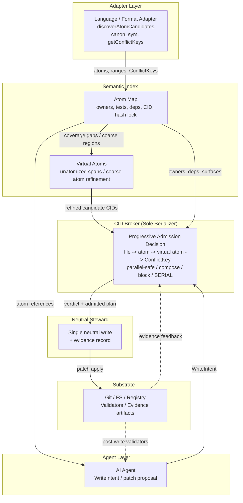
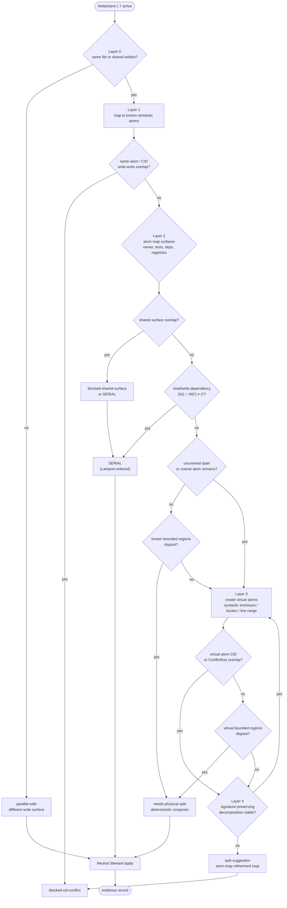

# ATM：同域多供應商 LLM 程式碼共同合成的採用器導向原子化與 CID Broker

## ATM: Adapter-Guided Atomization with CID Broker for Single-Domain Multi-Vendor LLM Code Co-Synthesis

作者: Eaglhuang  
隸屬: Independent Research  
日期: 2026-06-23  
狀態: Draft v3.1（arXiv positioning pass；single-domain boundary / progressive atomization / POS2 / B-12 evidence）  
Repository: https://github.com/eaglhuang/AI-Atomic-Framework

---

## Abstract（摘要）

AgenticFlict 對 142K+ AI coding agent pull requests 的研究指出，在 107K+ deterministic merge simulations 中有 27.67% 產生 merge conflict，並萃取出 336K+ fine-grained conflict regions。這組數字描述的是下游 Git / PR 合併階段的衝突壓力；ATM 不主張取代 Git，也不主張能治理跨電腦、跨 clone、跨 PR 的分散式寫入。本文處理較窄但更前置的問題：在同一受控 filesystem、worktree 或服務 domain 內，當多個 LLM agent 尚未實際寫入共享檔案前，系統如何判斷「此刻是否可以寫、應以何種粒度寫、以及應由誰完成實際寫入」。既有研究多聚焦於 orchestration、decomposition、post-generation verification 或 optimization；字元級 CRDT 能保證文字收斂卻仍留下 5-10% 語義衝突，檔案級 OCC 會在同檔案不同函式之間產生過度序列化，工作流級意圖圖雖能提高完成率卻可能承擔高 false-positive 成本。

本文提出 ATM，一個以 adapter-guided atomization 與 CID broker 為核心的 single-domain multi-vendor LLM code co-synthesis 框架。ATM 的技術主張是 progressive atomization for admission：先由語言或格式 adapter 將程式碼與結構化產物解構為可治理的 semantic atoms，並由這些原子形成 atom map，使測試、驗證、owner、dependency、CID 與 hash lock 皆能對齊到可追蹤的邏輯位置；當既有 atom 尚未覆蓋某段變更，或既有 atom 粒度過粗而無法判斷真正衝突點時，ATM 進一步以 virtual atoms 將未原子化段落暫時治理化，使 broker 能由 file-level contention 逐層細化到 atom-level 或 region-level conflict。其 seven-layer pre-write admission gate 可導向 parallel-safe、composer-routed bounded-region admission、blocked conflict、SERIAL、或 fail-closed refinement path；實際寫入則由同一治理 domain 內的 neutral steward 進行單次中立套用。

本文以三類證據支持此框架。第一，12-scenario deterministic fixture suite 覆蓋 broker decision surface、augmented dependency rule、AGR Layer 1/2 與 static admission closure。第二，npc-brain 專案三週採用研究回報 0 unrecovered admission error、1 次 idempotency break 與 3 次 validator catches，顯示此機制在真實工程流程中具可恢復性。第三，ATM 自身開發歷程提供 self-hosting forensics 與 same-file field evidence：包含 POS2 cross-vendor same-file keystone、B-12 late enforcement、BLOCK blocked-before-write、close-orchestration prototype edge，以及 Wave Mode 與 CID stability 的延伸證據。本文主張，ATM 補上的不是另一個 code generator，也不是單純更細的 merge heuristic，而是一個能將模糊寫入意圖逐層剝離為可驗證衝突單位的 pre-write admission layer；其 artifact-first evidence 使 POS2 正向案例與 B-12 負向邊界能被同時審查。

關鍵詞: multi-agent LLM、single-domain coordination、multi-vendor code co-synthesis、software engineering、concurrency control、pre-write admission、progressive atomization、atom map、virtual atom、CID broker、neutral steward

---

## 1. Introduction（緒論）

### 1.1 Motivation

多代理 coding 系統的核心風險，在於多個代理同時對同一受控 worktree 或服務 domain 形成寫入意圖時，系統缺乏一個可審計、可重放、且位於寫入前的准入層。早期 multi-agent code generation 常將問題表述為「如何分工」或「如何驗證產物」；然而，在長時間運行的實際 repository 中，代理彼此並非只是在不同模組中獨立工作，而是常常同時碰觸同一檔案、同一 registry、同一設定表、同一生成 artifact 或同一任務狀態機。此時真正需要回答的問題不是「誰比較會寫」，而是「在同一治理 domain 中，哪些寫入可以並行、哪些必須序列化、哪些應立即阻擋」。跨電腦 clone、remote branch 與 PR 合併仍屬 Git / VCS 層責任；ATM 只處理同一 authority domain 內、寫入發生前的 admission 決策。

AgenticFlict 對 142K+ AI agent pull requests 與 59K+ repositories 的分析，提供了此問題的量化背景：在 107K+ deterministic merge simulations 中，約 29K+ 產生 merge conflict，整體 conflict rate 達 27.67%，並形成 336K+ fine-grained conflict regions。此數字不能直接視為 ATM 可解決的 workload，因為 AgenticFlict 的觀測單位是跨 PR / Git merge 的下游衝突；本文引用它，是為了說明 AI-generated code 在共享 repo 生態中確實產生大量 conflict pressure。ATM 的範圍則是更前置的 single-domain admission：在變更進入 Git merge 或 PR 之前，先治理同一 worktree / filesystem / service domain 內的 concurrent write intents。

既有方法各自處理了問題的一部分。字元級方法如 CodeCRDT 提供 low-level merge substrate；檔案級方法如 STORM 或 CAID 處理 file/workspace isolation 與 write-time mediation；工作流級方法如 SCF、MPAC 或 orchestration framework 管理角色、流程與 review。然而，這些方法多半未提供 single-domain shared-write setting 下的 admission-time gate：在同一 filesystem 或服務 domain 內，系統於實際寫入前，應能判斷同檔案但不同 bounded region 的兩個 intent 是否可合併，或同一 shared surface 的兩個 intent 是否必須 fail closed。本文即針對此缺口提出 ATM。

### 1.2 The False Choice

本文拒絕一個常見但不必要的二分法：要嘛採用字元級 CRDT，接受其語義盲點；要嘛採用完整 AST 或全域語意圖，承擔高昂的工程成本與 false-positive 風險。對 multi-agent repository writing 而言，最小可行的治理單位通常不是字元，也不必然是完整 AST，而是由 domain adapter 提供的 atom、bounded region、CID 與 shared surface。

ATM 因此採取第三條路：adapter-guided atomization + broker admission。Adapter 不被要求理解所有語言語意，而是負責以足夠保守的方式宣告 candidate atom、source path、range、read/write dependency、ConflictKey 或 shared surface；broker 則不相信 LLM 的自由判斷，而是根據上述結構化資料做 deterministic admission decision。換言之，ATM 的設計不是將所有推理交給 LLM，也不是將所有語言強制塞進單一 AST，而是在工程上可落地的 adapter contract 上建立寫入前治理。

更精確地說，ATM 的發明直覺是逐層剝離衝突粒度。第一層先確認是否只是不同檔案或不同 artifact；第二層以 adapter 找出既有 semantic atoms；第三層以 atom map 連接測試、驗證、owner、dependency 與 shared surface；第四層在既有 atom 不足時建立 virtual atoms，讓未原子化段落也能被定位、比較與重算 CID。只有當這些層次都無法證明 disjoint 時，ATM 才將 intent 視為真正衝突並 fail closed。這使 ATM 的核心不只是「更細的 diff」，而是將模糊寫入意圖轉換為可審計 admission evidence 的過程。

### 1.3 Contributions

本文的貢獻如下。

1. Progressive atomization for admission. 我們將 ATM 定位為 multi-agent software engineering pipeline 中缺失的 shared-repo pre-write admission layer；其核心不是單次 merge，而是由 file-level contention 逐層細化到 semantic atom、atom map、virtual atom 與 ConflictKey 的衝突揭露流程。
2. Semantic atom map. 我們提出跨語言中立的原子化抽象：透過 optional `AtomizationPlanningAdapter` SDK，讓各語言或格式以最低可行成本回報 atom 候選、bounded region、Candidate CID / Capsule CID、shared surface 與 dependency，並將這些資訊組成可測試、可驗證、可審計的 atom map，而無須強制依賴單一 universal AST。
3. Virtual atoms for unatomized spans. 我們提出 virtual atom 作為未原子化或過粗 atom 區段的暫時治理單位，使 broker 能在正式 atom map 尚未完整時，仍可定位衝突落點、重算候選 CID、判斷 bounded-region disjointness，並在不可證明安全時 fail closed。
4. Seven-layer deterministic broker admission. 我們提出以 CID identity、shared surface、read/write set、file range / AGR、ConflictKey + canMerge、CAS base-hash 與 fallback file lock 構成的七層 pre-write hard gate，將 same-file but CID-disjoint writes 路由至 deterministic composer 與 neutral steward，並在證據不足時 fail closed。
5. Format-agnostic generalization. 我們透過 `FileMutationAdapter` 與 `ConflictKey` 將 admission 核心推廣至 JSON 記錄、文字範圍、數值欄位與 atom-map shards，使 broker 不只治理程式碼 atom，也能治理結構化 artifact。
6. Artifact-first field evidence. 我們以 12-scenario deterministic fixture、npc-brain 三週採用、ATM self-hosting forensics、POS2 cross-vendor same-file keystone、B-12 late-enforcement negative case、BLOCK blocked-before-write 與 Wave Mode dogfood，驗證此 admission layer 的可行性、邊界與可審計性。

### 1.4 Organization

第 2 節定位相關研究與 ATM 所補上的 admission layer；第 3 節定義 ATM 的 atom、CID、broker admission pipeline 與 neutral steward；第 4 節報告 fixture、採用研究與 field evidence；第 5 節列出限制與 roadmap；第 6 節討論 adapter-guided 設計之取捨；第 7 節總結本文主張。

---

## 2. Related Work（相關研究）

本文以「協調粒度」與「是否具備 admission-time preventive gate」來比較相關研究。這種分層並非要將所有系統放入單一優劣序，而是說明 ATM 的貢獻位置：它不是取代 CRDT、Git、workflow orchestration 或 post-generation verification，而是在同一受控 worktree / service domain 的寫入前增加一層可治理的准入仲裁。

### 2.1 Tier 1: Character-Level Concurrency

CodeCRDT、EvoGit 與 AgentGit 可視為低層次 merge substrate。此類方法關心多代理文字變更如何收斂、如何回復、如何以版本控制作為同步媒介。其優點是普遍、語言無關、且易於嵌入既有編輯流程；其限制則是無法提供 atom、bounded region 或 semantic admission。CodeCRDT 即使達到字元級收斂，仍需承認 5-10% 的語義衝突，而這類衝突通常要等到 typecheck、lint 或 test 才會浮現。

因此，Tier 1 與 ATM 並非直接競品。ATM 可以建立在 Git、CRDT 或檔案系統之上，但它回答的是更上層且更受限的問題：在同一 authority domain 的寫入發生前，哪些 intent 應被視為共享資源衝突，哪些同檔案變更其實可安全並行。跨 clone 或跨遠端分支的最終收斂仍交由 Git / CRDT / merge substrate。

### 2.2 Tier 3: File-Level Orchestration

STORM 以檔案版本與 observed dependency 進行 write-time OCC，能阻擋代理基於陳舊檔案狀態寫入。CAID 則以 git worktree 建立隔離工作空間，再由中央 delegator 進行合併。二者皆強化了多代理工作空間的安全性，並使 agent 在局部空間內能較自由地工作。

然而，檔案仍是過粗的協調單位。若兩個代理同時修改同一檔案中互不重疊的兩個函式，檔案級 OCC 可能仍拒絕其中一方；git merge 則要等到事後才知道是否衝突。ATM 的 bounded-region admission 正是針對此缺口：它將「同檔案」進一步拆為可由 adapter 宣告與 broker 檢查的 region、CID 與 ConflictKey。

### 2.3 Tier 4: Workflow Governance

SCF、MPAC、ATCC 與相關 workflow governance 系統處理的是角色、意圖、流程與 review 層次的協作。SCF 以 Semantic Intent Graph 檢測工作流衝突，MPAC 以多層協定降低多代理協作開銷，ATCC 與 OptiMA 則從資料庫或 transaction control 角度提供樂觀/悲觀執行策略。這些方法的重要性在於，它們指出 multi-agent coordination 不是單純 merge 問題，而是 authority、intent 與 governance 問題。

但對 single-domain repository shared-write 而言，workflow-level governance 通常缺乏 region-level admission gate。它能決定誰負責某個任務、誰審查某個結果，卻不必然能判定同一檔案中兩個 bounded regions 是否可以在同一受控 worktree 中被 neutral steward 套用。ATM 將 workflow governance 中的 authority 概念下沉到寫入前的 broker verdict。

### 2.4 Tier 2 Close Peers and Adjacent 2025-2026 Systems

CoAgent 是 ATM 最接近的 Tier 2 系統之一。CoAgent 的 MTPO 偏向 tool/action 級 reactive concurrency control：它讓代理在看到順序化結果後重新判斷、修復或撤銷。ATM 則偏向 code-region 級 preventive concurrency control：它在寫入前要求 adapter 宣告 atom、range 與 shared surface，由 broker 先行裁決。兩者並非同質替代品；CoAgent 較適合 read set 難以事前宣告的 side-effectful tool chain，ATM 則較適合可由 adapter 還原結構化寫入範圍的程式碼與格式化 artifact。preventive 與 advisory 可形成層次化互補：ATM 於 admission 階段先做 deterministic arbitration、將絕大多數可預測衝突在寫入前收斂；CoAgent 類 MTPO 則於 SERIAL 路由後承接不可事前宣告之 side effect 的 reactive repair。換言之，二者並非替代關係，而是 admission layer 與 repair layer 的接續。

MACOG、ProjectGen + SSAT、DebateCoder、Multi-Agent Code Verification 與 Singh intent-driven optimization 則分別落在 orchestration、architecture decomposition、verification 與 production optimization 層。它們回答的是「如何分解任務」、「如何安排角色」、「如何驗證產物」或「如何降低 token/latency 成本」。ATM 回答的是較窄但關鍵的 admission-layer 問題：當多個 agent 已經形成 write intent 時，是否准入、如何准入、以及如何讓寫入成為中立且可審計的事件。

| System | Layer | Preventive or Advisory | Admission-time Gate | Shared-file bounded region | Neutral serialization |
|---|---|---|---|---|---|
| CodeCRDT | character merge substrate | preventive at text convergence | no | no | no |
| STORM | file-level write mediation | preventive at file write | partial | no | no |
| CAID | workspace isolation | reactive merge | no | no | central merge |
| SCF / MPAC | workflow governance | advisory / preventive by intent | partial | no | workflow-level |
| CoAgent | tool/action concurrency | advisory / reactive | no hard code-region gate | no | depends on tool chain |
| ATM | repository admission layer | preventive | yes | yes | neutral steward |

### 2.5 Adjacent Foundations

OT、CRDT、two-phase locking 與 optimistic concurrency control 提供了 ATM 的基礎思想：共享狀態需要明確的衝突單位、序列化點與重試語意。Workspace protocol 與 TraceFix 類工作則提醒我們，多代理系統本身也需要被視為 protocol，而不只是 prompting pattern。Latent-space parallel-branch synthesis [Liu et al. 2026] 於 KV-cache 層處理 parallel branch merging，與本文 admission-time 層次正交，可疊加於 ATM deterministic-composer 路由之上。ATM 將這些基礎概念收斂到 repository writing：以 atom/CID/ConflictKey 定義衝突單位，以 broker 作為 sole serializer，以 evidence substrate 使每次准入與阻擋可被審計。

Figure 4 — Tier Granularity Ladder. 本文於協調粒度階梯中的位置：

| Tier | 粒度 | 代表系統 | 典型 domain | ATM 與之關係 |
|---|---|---|---|---|
| 1 | character | CodeCRDT, EvoGit, AgentGit | editing session / merge substrate | substrate（正交，可建立其上） |
| 2 (this paper) | atom / bounded region | ATM | single workspace / filesystem domain | admission layer ← 補上的缺口 |
| 3 | file / workspace | STORM, CAID | workspace / worktree mediation | 對 same-file parallel 過粗 |
| 4 | workflow / intent | SCF, MPAC, ATCC, OptiMA | process / workflow governance | 缺 region-level admission gate |
| out of scope | branch / PR | Git three-way merge, PR review | cross-machine clone / remote branch | ATM 不取代此層 |

ATM 並非取代 Tier 1/3/4，也不取代跨機器 Git PR 合併；它是在 single workspace / filesystem domain 的 Tier 2 補上一層可治理的 admission gate。

---

## 3. Framework（方法）

ATM 的設計目標是建立一個位於 agent generation 與 filesystem mutation 之間的 governance layer。它不生成程式碼，也不替代測試或 code review；它要求所有寫入先成為結構化 intent，再由 broker 決定該 intent 是否能進入寫入路徑。

### 3.1 Architecture Overview

ATM 可分為五個責任邊界，並共享一個逐步細化的語意索引。本文假設這些邊界位於同一個治理 domain：同一台電腦、同一個受控 server、同一個 worktree service，或其他能提供單一 broker / steward authority 的環境。Adapter 負責從語言或格式中擷取 candidate atoms、bounded ranges、read/write dependencies 與 conflict keys。Atom Map 將這些資訊整理為可測試、可驗證、可審計的邏輯地圖；若 map 尚未覆蓋某段變更，AGR 會建立 virtual atoms 作為暫時治理單位。Agent 負責提出 patch 或 write intent。Broker 負責 admission decision，輸出 allow、compose、block 或 re-arbitrate 類 verdict。Neutral Steward 負責將 broker 已准入的 plan 實際套用至同一受控 worktree。Substrate 則包含 Git、檔案系統、registry、validator 與 evidence artifacts；其中 Git 是版本控制與跨 clone 合併 substrate，而非 ATM 在本文中取代的分散式鎖。

Figure 1 — ATM Admission Architecture. 五個責任邊界與資料流：



此架構的關鍵在於，agent 不直接取得對共享檔案系統的最終寫入權。Agent 可以產生 proposal，但 proposal 必須經過 broker；若 broker 判定可合併，仍由 neutral steward 完成實際寫入。這使「誰提出變更」與「誰執行寫入」分離，降低多代理互相覆寫、競逐或跳過治理流程的風險。

### 3.2 Atoms, Atom Map, Virtual Atoms, and CID

ATM 中的 atom 是可治理的最小邏輯單位。實作上，atom 可表示 function、class method、registry entry、JSON record、numeric scalar、text range 或其他由 adapter 定義的結構化片段。Atom 的用途不只是命名程式碼區段，而是讓 broker、validator 與 reviewer 能把一次寫入對齊到可追蹤的語意位置。為了支援 broker decision，本文保留下列必要欄位：atom identity、logical name、version、source path/range、input/output schema、status、tier 與 hash lock。完整 8-tuple 可寫為：

$$a = \langle id, name, ver, P, \sigma, \psi, \tau, H \rangle$$

其中 $P$ 是 atom 對應之 file path 與 line range 集合；$\sigma$ 是 schema；$\psi$ 是狀態；$H$ 是規格、程式與測試的 hash lock。對 broker 而言，最重要的是讀者能在此節後理解三件事：何謂 same owner、same CID、以及 disjoint bounded region。

Atom map 是由這些 atoms 形成的語意索引。它將 source range、owner、測試入口、validator、read/write dependency、shared surface、Candidate CID、Capsule CID 與 hash lock 對齊到同一個可審計的圖狀結構。換言之，atom map 不是文件目錄，而是 admission layer 的感測器：broker 透過它知道某個 write intent 觸碰的是哪個邏輯單位、應由哪些 validator 驗證、是否與其他 active intent 共享 surface，以及是否需要被序列化。

Virtual atom 則是 atom map 不完整時的暫時治理單位。當 adapter 尚未把某段程式正式原子化，或既有 atom 太粗而無法判斷兩個 patch 是否真正重疊時，AGR 可依 syntactic enclosure、line range、signature boundary 或 format-specific locator 建立 virtual atom。Virtual atom 具有臨時 identity、bounded region、candidate CID 與 conflict keys，但不宣稱已是永久 API 單位；它的目的，是讓 broker 在未完成正式原子化之前，仍可把「同檔案疑似衝突」轉換為可比較、可驗證、可 fail-closed 的 admission 單位。

ATM 使用兩種 CID。Candidate CID 用於 pre-write admission，由 adapter 對 kind、canonical symbol、path/range 與 detection method 進行 canonicalization 後雜湊而得。Capsule CID 用於 post-validation artifact，以完整 source bundle、schema 與 policy 計算 content address。前者服務於寫入前仲裁，後者服務於封裝後版本錨定。此二層 CID 避免將「尚未寫入的候選區域」與「已驗證的封裝產物」混為一談。

Adapter-guided discovery 的必要性在於，atom identity 無法完全由字串 diff 或檔案路徑推導。TypeScript function、Python decorator、JSON record 與 atom-map shard 各自具有不同結構；若沒有 adapter 宣告其 canonical symbol 與 bounded region，broker 只能退回檔案級或字元級判斷。ATM 因此將 adapter contract 視為 admission 的前置條件；而 virtual atom 則補上 adapter map 尚未完成時的中間層，使系統不必在「整檔鎖」與「盲目放行」之間二選一。

### 3.3 Admission Pipeline

ATM 的 admission pipeline 從 write intent 開始，但其核心不是一次性比較檔案 diff，而是 progressive atomization。每個 intent 必須帶有 target files、atom references、candidate CIDs、bounded regions、shared surfaces 與必要的 read dependency；若 intent 觸碰尚未被 atom map 覆蓋的段落，broker 會要求 AGR 產生 virtual atoms，再把原本模糊的 same-file overlap 轉換成可比較的邏輯區塊。Broker 依序比較 CID、shared surface、read/write dependency、physical overlap、known atom coverage、virtual atom coverage 與 bounded region，最後輸出 verdict。

主要 verdict 可概括如下：

| Verdict | 意義 | 後續路徑 |
|---|---|---|
| `parallel-safe` | 無 CID / surface / range 衝突 | 可進入 steward path |
| `needs-physical-split` | 同檔案但 CID disjoint，需合成 | deterministic composer |
| `blocked-cid-conflict` | 同 CID 或同 atom 寫入衝突 | fail closed / refinement |
| `blocked-shared-surface` | shared surface 互斥 | fail closed / serialize |

Figure 2 — Progressive Atomization Admission Flow. ATM 如何由粗到細揭露真正衝突點：



此 pipeline 的核心不是「永遠允許更多並行」，而是將並行決策從 LLM 自由判斷轉化為可重放的 admission vocabulary。當兩個 intent 寫入同一檔案時，broker 不立刻把同檔案視為衝突，也不直接相信行號未重疊；它先查 atom map，再對未覆蓋或過粗區段建立 virtual atoms，最後才判斷 bounded region、CID、ConflictKey 與 dependency 是否真的重疊。若逐層細化後仍能證明 disjoint，broker 將其路由到 composer，再由 steward 套用合成結果；若無法證明 disjoint，則 fail closed 或進入 refinement loop。

本文使用兩個簡化定理描述此 pipeline 的保守邊界。

Theorem 1（Cross-Regime Disjointness）. 若兩個 adapter 所治理的 source root 由 repository convention 保證 disjoint，且 adapter 正確宣告其 source paths，則兩個 candidate 的 physical write surface 不相交；broker 在 file-overlap 層可視為 parallel-safe，除非 shared surface 或 dependency rule 另有阻擋。

Theorem 2（Static Admission Closure）. 在 adapter 對 static read/write set 的宣告為保守近似，且動態 effect 皆由 validator 或 fallback lock 補位的假設下，`parallel-safe` verdict 排除 statically determinable write-write conflict；此定理不保證動態語意正確性。

Augmented dependency rule 補足了純 write-set disjoint 的不足。若 intent $I$ 的 read dependency 與另一 intent $I'$ 的 write set 相交，則即使二者文字範圍不重疊，也應進入 SERIAL 或 review path：

$$D(I) \cap W(I') \neq \emptyset \Rightarrow SERIAL(I, I')$$

AGR（Adaptive Granularity Refinement）則處理「現有 atom 太粗」的情況。這裡的關鍵不是單純把 patch 切細，而是讓 broker 在既有實體 atom 不足時，能暫時建立可治理的 virtual atom，重新觀察真正的衝突邊界。Layer 1 以 syntactic enclosure 將未覆蓋 patch lines 包成 virtual atoms 並重算 CID；因此，原本在 file-level 看起來只是「同檔案」的兩個 intent，會被重新表述為「兩組可比較的 atom 區塊」。若這些 virtual atoms 的 CID、shared surface 與 bounded region 皆相互分離，broker 才能把 verdict 從粗粒度的 same-file contention，下修為可合成的 `needs-physical-split`。Layer 2 則在衝突密度過高時——即衝突 hunk 數超過閾值 $\theta_{count}$ 或衝突行密度超過 $\theta_{density}$——提出 signature-preserving decomposition $f \mapsto f_{pre} \cdot f_{extracted} \cdot f_{post}$，並對每個分解片段重算 virtual atom CID。換言之，虛擬原子不是附屬優化，而是 ATM 從「同檔案碰撞」進一步辨識出「其實可分離之邏輯區塊」的核心機制。AGR 不是任意讓 LLM 重構，而是產生可審查的 refinement suggestion，使 blocked overlap 成為 atom-map 改進訊號；當兩層 refinement 皆無法消解時，broker 退回 `blocked-cid-conflict` 並導入 §4.4 refinement loop。

### 3.4 Seven-Layer Hard Gate and Broker as Sole Serializer

ATM 的 broker 不是只靠 CID 做單點判斷，而是以七層 hard gate 逐步縮小可疑寫入的衝突面。CID identity 是第一層快速語意索引；若 CID 無衝突，broker 仍必須檢查 shared surface、read/write set、file range / AGR、ConflictKey + canMerge、CAS base-hash，以及最後的 fallback file lock。這種設計使 ATM 能在可證明 disjoint 時允許並行，在證據不足時 fail closed。

| Layer | Gate | 判斷問題 | 通過時 | 失敗或不明時 |
|---|---|---|---|---|
| 1 | CID Identity | 是否寫入同一 atom / candidate CID | 進入下一層 | `blocked-cid-conflict` |
| 2 | Shared Surface | 是否觸碰同一 registry / generator / artifact / active intent surface | 進入下一層 | block 或 SERIAL |
| 3 | Read/Write Set | 是否存在 $D(I) \cap W(I')$ | 進入下一層 | SERIAL / review |
| 4 | File Range / AGR | 同檔案變更是否可由 known atom 或 virtual atom 分離 | composer path | AGR refinement 或 block |
| 5 | ConflictKey + canMerge | 結構化產物是否有 disjoint key 與 deterministic merge capability | format-level admission | block / serialize |
| 6 | CAS Base-Hash | apply 前 base hash 是否仍符合 admission 所見狀態 | one-shot apply | bounded re-plan |
| 7 | Fallback File Lock | adapter 或 validator 無法提供足夠證據時是否需整檔保守鎖 | guarded write | fail closed |

正式投稿版應在附錄將七層 gate 對應到 implementation location、primary validation 與 commit/task family。本文目前先將其作為方法章的結構化設計，避免把 CID 誤讀為唯一判據。

Definition 6（CAS base-hash guarded apply）. 對任一 admitted plan $p$，broker 記錄其 admission-time base hash $h_0$。Neutral steward 在 apply 前重新讀取目標 surface 的 base hash $h_1$；若 $h_1 = h_0$，則允許 one-shot apply；若 $h_1 \neq h_0$，則該 plan 不可直接套用，必須進入 bounded re-plan、SERIAL 或 fail-closed path。此定義將 runtime closure 對齊到 optimistic concurrency control 的 compare-and-swap 精神，但保留 ATM 的 atom / ConflictKey admission 語意。

Broker 是 ATM 在同一治理 domain 中唯一的 serialization point。所有 agent 只能提交 intent 或 proposal；broker 根據目前 active intents、atom map、shared surface 與 evidence substrate 做單一順序決策。此 claim 不延伸到多台電腦各自持有不同 clone 的情境；在那些情境中，Git / PR / merge substrate 仍是最終協調層。若在同一受控 worktree 中允許 agent 直接寫入共享檔案，再由事後 merge 或人類修復處理，系統將回到傳統 race condition：每個代理都以自己的局部視角判定安全，卻無人持有全域 admission state。

Neutral steward 負責將 broker 已准入的 plan 實際套用至同一受控 worktree。Steward 的角色不是創造新設計，而是執行已被 admission decision 約束的 patch application，並留下 evidence。這使 attribution 與 authority 邊界清楚化：變更意圖可歸屬於提出者，寫入事件則由中立 steward 完成。

Batch attribution 與 Wave Mode 是此路徑的延伸。當多個任務以 wave 形式同時提交時，broker 仍逐 intent 評估，並透過 checkpoint 與 per-task evidence slicing 維持每個任務的可追溯性。Wave Mode 不改變 admission 的核心 claim，只是把同一套 broker/steward 邏輯擴展到批次執行。

### 3.5 Format-Agnostic Generalization

ATM 不只治理 code atoms，也治理 structured artifacts。透過 `FileMutationAdapter` 與 `ConflictKey`，同一 admission 概念可應用於 JSON record、text range、numeric scalar 與 atom-map shard。對 code 而言，conflict unit 可能是 function 或 method；對 JSON 而言，可能是 record key；對 numeric config 而言，可能是 scalar field；對 atom map 而言，可能是 edge 或 member record。

Figure 5 — ConflictKey Generalization Matrix. Scope × Locator 跨格式映射：

| Domain | Adapter | Scope | Locator | Merge capability |
|---|---|---|---|---|
| Code (TypeScript) | TS adapter | function / method | (canonical symbol, path) | none → deterministic composer |
| Code (Python) | Python adapter | function / class method | canon_sym(path, qualname) | none → deterministic composer |
| JSON | `json-record` adapter | record | key path (JSON pointer) | deterministic merge if keys disjoint |
| Text | `text-range` adapter | range | (file, lineRange) | none → composer |
| Numeric | `numeric-scalar` adapter | scalar | (file, field name) | commutative (inc / dec / set-if-equal) |
| Atom map | `atom-map` domain adapter | edge / member record | shard + line range | line-disjoint merge + CAS base-hash |

此 generalization 的關鍵是：broker 不需要理解每種格式的完整語意，但必須能取得保守的 conflict key 與 merge capability。若 adapter 能宣告兩個 mutation 的 ConflictKey disjoint，且格式 adapter 能提供 deterministic merge 或 CAS base-hash 檢查，則 broker 可將其視為 format-level parallel admission；若不能，則退回 block、serialize 或 steward-required path。

Theorem 3（ConflictKey Disjointness）. 對任一格式 adapter，若兩個 mutation 的 ConflictKey 在相同 scope 下 locator disjoint，且 adapter 宣告其 merge capability 為 deterministic 或 CAS-guarded，則 broker 可將二者視為 format-level disjoint writes；若 scope 相同且 locator overlap，或 adapter 無法宣告 merge capability，broker 必須 block、serialize 或要求 steward-required path。Theorem 3 是 Theorem 1 的跨格式推廣：前者處理 repository root / adapter regime 的 disjointness，後者處理任意結構化產物內部的 disjointness。

### 3.6 Scope and Open Problems

ATM 目前不保證五件事。第一，ATM 不是跨機器分散式協調協定；若多個代理在不同電腦、不同 clone 或不同 PR branch 中各自寫入，ATM 本文版本不負責提供 distributed locking、remote consensus 或跨 PR merge resolution，這些仍由 Git / VCS / review workflow 承擔。第二，cross-language atom identity 尚未完整解決；TypeScript client 與 Python backend handler 之間的語意耦合，不能只靠各自 adapter 的 CID 判定。第三，admission-time active-intent forwarding 尚未完全內化至所有 owner-map 路徑；部分 B-12 類事件仍仰賴 apply-phase fail-closed 補位。第四，liveness 與 starvation 需要形式化證明；broker 能保證安全拒絕，不等於保證每個 intent 最終可被接受。第五，CID schema migration 與 adapter trust boundary 仍需更完整的版本遷移與 manifest 驗證機制。本文之 broker 可視為 single-domain arbiter：它需要看到同一 filesystem / worktree / registry visibility，才能對 active intents 做一致裁決。

---

## 4. Evaluation（評估）

本文的評估採取「deterministic fixture -> internal real evidence -> external adoption -> targeted field outcome -> orchestration extension」的順序。此設計意在避免過度宣稱：fixture 驗證 decision surface，採用研究觀察可恢復性，field evidence 展示具代表性的端到端路徑；它們尚不等同於與 STORM、CodeCRDT、SCF 或 CoAgent 的完整 head-to-head benchmark。

### 4.1 12-Scenario Fixture Suite

12-scenario fixture suite 是本文的主要 controlled evidence anchor。它以 deterministic input 覆蓋 broker 的主要 decision surface，包含 cross-regime disjointness、same-file different atom、same shared surface、read/write dependency、AGR Layer 1/2、validator fallback 與 static admission closure。每個 scenario 指定 expected verdict，並由 harness 驗證 broker output 是否符合預期。

| 類別 | 覆蓋機制 | 評估重點 |
|---|---|---|
| disjoint paths | Theorem 1 | 不同 adapter root 可平行 |
| same file / different atom | atom map + bounded-region compare | 同檔案不必然序列化 |
| same atom write-write | CID conflict | 應 fail closed |
| read/write dependency | augmented rule | disjoint write 不等於可平行 |
| AGR Layer 1/2 | virtual atom / decomposition | 未原子化或過粗區段可再細化 |
| validator fallback | A2 boundary | 靜態模型外動態錯誤由 validator 補位 |

此 suite 的價值是 regression-oriented，而非統計性 benchmark。它證明實作與本文定義之 verdict vocabulary 對齊，但不聲稱在 adversarial load 下具有特定 throughput、latency 或 token-cost 優勢。

### 4.2 Self-Hosting Forensics

ATM 自身開發過程提供了一組 internal real evidence。這些事件不是乾淨的展示案例，而是 framework 在治理自身時實際遇到的 collision、freeze、scope 與 sync 問題。特別地，ATM 的 reporting window 包含多個不同 vendor / editor channel 的 LLM 代理，在同一受控 worktree 或同一服務 domain 中共同修改 ATM framework 與 paper artifacts；本文將此視為 self-referential dogfood evidence，而非 controlled benchmark。其意義在於，ATM 並非僅被設計為多代理治理框架，而是在自身演進中承受多代理、多供應商與同一 filesystem domain 的寫入壓力。本文保留三類代表性事件。

| 事件類型 | 觀察到的問題 | 對 ATM 的意義 |
|---|---|---|
| cid-shared collision | 兩個 intent 同時 claim 相同 atom CID | 觸發 freeze / patch-envelope / conflict-matrix path |
| out-of-scope delivery | delivery touch 超出宣告 scope | 促成 closure packet waiver 與 scope gate 強化 |
| plan-mirror sync failure | planning side 與 target ledger closeout 不一致 | 促成 mechanized open/close 與 ledger consistency check |

這些 forensics 的角色是說明 ATM 的 governance layer 不是事後美化的規格，而是在自身開發中反覆暴露缺口並回饋機制。其證據強度低於 controlled benchmark，但高於單純設計論述。

### 4.3 npc-brain Adoption Study

npc-brain 是一個外部採用案例，觀察期間為三週。該專案在真實 multi-agent engineering workflow 下使用 ATM 進行 scope、validator 與治理流程管理。本文誠實回報其結果：0 unrecovered admission error、1 次 idempotency break、3 次 validator catches。這表示 ATM 並未消除所有流程錯誤，但能將錯誤導向可恢復路徑。

此研究不是產品 showcase，也不是大規模對照實驗；它的價值在於展示 admission governance 與 validator/evidence substrate 能在非 synthetic repo 中運作。特別是 0 unrecovered admission error 顯示，當代理遇到 contention、out-of-scope 或 validator failure 時，系統能保留足夠 evidence 以支援修復，而不是讓狀態不可追溯地發散。

### 4.4 Real Same-File Admission Outcomes

POS2 是本文最重要的正向 same-file field evidence。此案例同時滿足同一 owner map、同一受控 worktree、同一檔案、bounded regions disjoint、composer-routed、steward-applied 與 validators pass。其 evidence chain 包含五個階段：兩個不同 vendor 模型來源的 write intents、同一 broker domain 內的 admission、deterministic composer、neutral steward apply、以及 `git diff --check` / typecheck / CLI validation。更重要的是，它不是單靠「看起來行號沒重疊」就放行，而是展示 ATM 的逐層衝突揭露流程：先承認兩個 intent 同時碰到 `broker.ts`，再由 adapter 與 atom map 將兩側變更對映到可比較的 atom／virtual atom 區塊，接著檢查 CID、shared surface 與 read/write dependency，最後才得到 bounded-region disjoint 的 admission verdict。其意義在於，ATM 不只是阻擋危險寫入，也能將原本在檔案級系統中會被視為高風險的同檔案並行，於同一 governance domain 中轉換為可治理、可合併、可驗證的 shared-write path。

Figure 3 — POS2 Progressive Atomization Case. 同一受控 worktree 中，兩個不同 vendor 模型來源的 intent 同時觸碰 `broker.ts`，並不是因為「同檔不同段」就直接放行；而是 broker 先依 adapter 宣告的 atom map 與 AGR 補出的 virtual atoms，將同檔案疑似衝突逐層轉換為可治理區塊，再確認這些區塊之間 CID 不重疊、shared surface 不衝突、且無 read/write dependency，最後才路由為 `needs-physical-split`，交由 composer 與 neutral steward 完成單次中立寫入：

```
              packages/cli/src/commands/broker.ts
            ┌───────────────────────────────────────────────┐
            │  ... (other code) ...                          │
 POS2-A ───►│  lines 841-878                                 │◄─── Codex / OpenAI
            │  classifyExplicitMutationRequest fallback      │     (TASK-POS2-A)
            │  ... (gap, lines 879-988) ...                  │
 POS2-B ───►│  lines 989-1142                                │◄─── Claude / Anthropic
            │  parseBrokerArgs guard                         │     (TASK-POS2-B)
            │  ... (other code) ...                          │
            └───────────────────────────────────────────────┘
                            │              │
                            └──────┬───────┘
                                   ▼
                      Progressive atomization compare
                      │  Layer 0: same file?              yes
                      │  Layer 1: known atom overlap?     no
                      │  Layer 2: shared surface overlap? no
                      │  Layer 3: read/write dep?         no
                      │  Layer 4: virtual atom overlap?   no
                      │  Result: bounded disjoint         yes
                      ▼
                    verdict: needs-physical-split
                    merge plan: merge-255c73707a528edc
                                   ▼
                         Deterministic composer
                                   ▼
                         Neutral Steward apply
                         (single neutral write)
                         verdict: applied
                                   ▼
                    Validators:  git diff --check    ✓
                                 npm run typecheck   ✓
                                 npm run validate:cli ✓
```

B-12 與 BLOCK 提供負向證據，並刻意放在 POS2 旁邊以降低 cherry-picking 風險。B-12 顯示 admission 階段可能未能完全捕捉 active-intent 衝突；兩側 intent 在 admission-time 仍可能被判為 `parallel-safe`，但 apply-phase runtime arbitration 仍可 fail closed。因此它應被描述為 late enforcement，而非 admission-time success。這個案例揭露 ATM 目前的 enforcement boundary 尚未全部前移到 admission layer，也是後續 active-intent forwarding 的主要工程缺口。BLOCK 則展示 broker 在寫入前阻擋重疊 intent，並輸出 split suggestion，使 conflict 成為 owner-map refinement 的輸入，而不是單純失敗。

close-orchestration 與 refinement-loop 屬 prototype edge。它們支持一個較保守的結論：ATM 已具備將同一治理 domain 內的 blocked overlap 導入 reviewable refinement chain 的機制雛形，但尚未足以宣稱所有跨 vendor same-owner refinement workflow 都已 field-validated，更不宣稱能處理跨機器 clone 的分散式 refinement。本文將其置於 evidence map，而不將其升格為主貢獻的決定性證據。

### 4.5 Wave Mode and CID Stability

Wave Mode 是 admission layer 的批次化延伸。Team Agents Wave Mode dogfood suite 以 safe wave、unsafe same-deliverable、mixed dependency、per-task slicing 與 needs-review gating 等 scenario 驗證 batch admission、evidence slicing 與 checkpoint 能維持 fail-closed 行為。其角色是說明 broker/steward path 可擴展到多任務 wave，而不是取代 §4.1 的 admission core evidence。

CID stability 則驗證 Candidate CID 與 Capsule CID 的不同職責：前者用於 pre-write arbitration，後者用於 post-validation artifact identity。此區分降低了把臨時 proposal 與已驗證封裝混淆的風險，也為後續 schema migration 提供版本化基礎。

---

## 5. Limitations and Roadmap（限制與後續工作）

本文尚未完成完整比較性評估。ATM 與 STORM、CodeCRDT、SCF、CoAgent 的 head-to-head benchmark，需要在相同 workload 上量測 conflict catch rate、false positive、wall-clock、token cost 與 repair cost。後續若使用 AgenticFlict 類大規模 conflict corpus，必須先將其跨 PR / Git merge samples 轉換為 single-domain pre-write intent replay workload；否則不可直接宣稱 ATM 能解決該 corpus 中的分散式 PR 衝突。

多採用者與多語言統計仍不足。npc-brain 提供外部採用證據，ATM self-hosting 提供 internal forensics，但仍不能代表大型企業 monorepo、polyglot microservice、高頻 generated artifact workflow，或跨電腦多 clone 的 remote collaboration。後續需要更多 repo、更多 adapter、更長 observation window，以及明確區分 single-domain admission 與 distributed VCS merge 的評估設計。

Adapter trust 是主要形式化缺口。ATM 的 admission soundness 依賴 adapter 對 source path、canonical symbol、ConflictKey 與 merge capability 的保守宣告。若 adapter 漏報或惡意宣告 disjoint key，broker 可能做出過度樂觀的 verdict。後續應補上 signed manifest、adapter sandboxing、capability audit 與 schema validator。

CID schema migration 需要正式機制。Candidate CID 的 canonical form 可能隨 schema_version 演進；若不同 agent 使用不同版本，broker 必須能判斷其是否等價、需轉換或應 fail closed。本文僅指出此問題，尚未提供完整 migration proof。

Liveness 與 starvation 尚待證明。ATM 的主要設計取向是 safety-first：不確定時阻擋或序列化。此策略合理但可能降低吞吐量；後續需建立 priority、retry、fairness 與 bounded waiting 的形式化模型。

---

## 6. Discussion（討論）

### 6.1 Why Adapter-Guided, Not AST-First

Adapter-guided 的理由是工程務實性。Universal AST 在理論上誘人，因為它似乎能為所有語言提供統一語意層；但在實務上，multi-agent repository 不只包含程式碼，還包含 JSON、Markdown、generated artifact、registry、task ledger、asset manifest 與 domain-specific config。若要求所有治理都先轉換成單一 AST，系統會在導入成本與維護成本上失去可行性。

Adapter-guided approach 允許每個 domain 提供剛好足夠的 conflict abstraction。TypeScript adapter 可提供 function enclosure；JSON adapter 可提供 record key；numeric adapter 可提供 scalar field；atom-map adapter 可提供 edge/member key。Broker 不必知道每個 domain 的完整語意，只需知道哪些 mutation 共享同一 conflict surface，以及是否存在 deterministic merge path。這種設計犧牲了全域完備性，但換得可導入性與可審計性。

### 6.2 When Adapter-Guided Fails

Adapter-guided 會在四種情境失效或降級。第一，adapter capability incomplete：若 adapter 無法辨識真實 write surface，broker 只能退回整檔鎖或 validator fallback。第二，enclosure missing：若 patch region 無法被包進穩定 syntactic unit，AGR Layer 1 無法形成可靠 virtual atom。第三，claim forwarding incomplete：若 active intent 未能在 admission-time 被正確轉送，可能出現 B-12 類 late enforcement。第四，人類審查仍不可省略：split suggestion 能降低 reviewer 成本，但無法替代 domain owner 對語意切分的判斷。

這些 failure modes 並不否定 admission layer，而是界定其邊界。ATM 的安全策略應是「能判斷時細粒度准入，不能判斷時 fail closed」，而不是用不完整 adapter 做過度樂觀的並行化。

### 6.3 Open Questions and Future Work

後續研究應從五個方向推進。第一，cross-language atom identity 需要跨 adapter 的 semantic bridge，例如 API route、schema contract 或 generated client/server pair 的共同 CID。第二，active-intent forwarding 應從 apply-phase 補位推進到 admission-time default path，使 late enforcement 逐步變少。第三，liveness proof 需要與 scheduling policy 結合，避免 fail-closed 策略在高 contention repository 中造成 starvation。第四，CID migration 需要可機械驗證的 version negotiation 與 backfill path。第五，federated / cross-machine broker 是目前尚未處理的延伸方向：若多個 agent 位於不同 clone、不同主機或不同 PR branch，ATM 需要 federated registry、distributed active-intent visibility 與 consensus / lease protocol，才可能把 single-domain admission 推廣到 Git PR-based collaboration；在本文範圍內，這一層仍由 Git merge 與 human review 承擔。

此外，ATM 與 CoAgent 可形成互補 pipeline。ATM 可先在 code-region / artifact-region 層做 preventive admission；若 intent 被序列化但後續 tool chain 仍有不可事前宣告的 side effects，CoAgent 類 MTPO repair path 可承接 reactive recovery。這表示 future system 不必在 preventive 與 advisory 之間二選一，而可依 layer 分工。

---

## 7. Conclusion（結論）

本文提出 ATM 作為 multi-agent software engineering pipeline 中、同一治理 domain 內的 admission layer。它以 progressive atomization 將 repository 寫入意圖由粗到細轉換為可治理單位：先以 adapter 產生 semantic atoms，再以 atom map 連接 owner、tests、dependencies、shared surfaces 與 CID；當既有原子化不足時，ATM 以 virtual atoms 暫時治理未原子化段落，使 broker 能在寫入前定位真正的衝突點。當 intent 可安全並行時，ATM 允許 bounded-region admission；當 intent 觸碰相同 CID、shared surface 或 read/write dependency 時，ATM fail closed 或序列化；當同檔案變更可合成時，ATM 在同一受控 worktree 中交由 deterministic composer 與 neutral steward 完成單次中立寫入；當粒度不足時，ATM 將 blocked overlap 導向 split-suggestion refinement loop。

本文的證據來自 deterministic fixture、npc-brain 三週採用、ATM self-hosting forensics 與 same-file field outcomes。這些證據尚未構成完整 comparative benchmark，也不涵蓋跨電腦 Git PR merge resolution；但足以支持本文的主要結論：現有 multi-agent SE pipeline 缺少一個能在同一受控 filesystem / worktree / service domain 中，將模糊寫入意圖逐層剝離為可驗證衝突單位的 pre-write admission layer，而 ATM 提供了一條可實作、可審計、可逐步形式化的路徑。

---

# Appendix（附錄）

## A.1 Evidence Artifact Map

本附錄列出 paper-citable evidence 的建議入口。具體 artifact 名稱與 commit 應以 repository 內實際檔案為準。

| Evidence | Role in paper | Suggested artifact entry |
|---|---|---|
| 12-scenario fixture | controlled decision-surface evidence | `scripts/validate-agr-benchmark.ts` and related reports |
| npc-brain adoption | external repo adoption | adoption notes / task ledger / validator records |
| self-hosting forensics | internal real evidence | ATM incident reports and closure packets |
| POS2 | positive same-file keystone | `docs/ai_atomic_framework/broker-collision-evidence/runs/POS2-same-owner-bounded-2026-06-22/` |
| B-12 | late enforcement negative evidence | active-intent / apply-phase arbitration records |
| BLOCK | blocked-before-write evidence | blocked verdict + split suggestion artifact |
| close-orchestration | prototype edge evidence | replay / steward apply evidence |
| refinement loop | prototype split-suggestion path | approval queue / curator patch draft |
| Wave Mode | orchestration extension | `docs/reports/team-wave-mode-dogfood.md` |

## A.2 Implementation / Commit Provenance

ATM 的主要實作家族包含 broker decision、AGR、neutral steward、freeze / patch-envelope / conflict-matrix、format adapter、Wave Mode 與 CID verification。正文刻意避免列出大量 task IDs；正式投稿前，建議將 commit provenance 收斂為一張表，欄位包含 mechanism、implementation location、primary validation、commit/task family 與 current status。

| Mechanism | Implementation status | Evidence role |
|---|---|---|
| CID broker | implemented | admission core |
| AGR Layer 1/2 | implemented / partially policy-bound | refinement path |
| Neutral steward | implemented | sole write path |
| Format adapters | implemented for selected formats | format-agnostic generalization |
| Wave Mode | dogfood validated | batch orchestration extension |
| CID migration | open | future engineering note |

## A.3 CID Schema Migration Candidate Paths

CID schema migration 可採三條路徑。第一，flag-day migration：在 repository 層鎖定 migration window，將所有 active intents 清空後重算 CID。第二，dual-read / single-write：broker 同時辨識 v1 與 v2 CID，但新 intent 僅寫入 v2。第三，compatibility map：以 signed migration table 宣告舊 CID 與新 CID 的等價關係。三者取捨分別是簡單但中斷、平滑但實作複雜、可追溯但需信任 migration table。本文尚未選定最終方案。

---

## References（參考文獻）

1. Pugachev, Sergey. 2025. "CodeCRDT: Observation-Driven Coordination for Multi-Agent LLM Code Generation." arXiv:2510.18893 [cs.SE]. https://doi.org/10.48550/arXiv.2510.18893.
2. Acharya, Vivek. 2026. "Semantic Consensus: Process-Aware Conflict Detection and Resolution for Enterprise Multi-Agent LLM Systems." arXiv:2604.16339 [cs.MA]. https://doi.org/10.48550/arXiv.2604.16339.
3. Liu, Mengyang, Taozhi Chen, Zhenhua Xu, Xue Jiang, and Yihong Dong. 2026. "Multi-agent Collaboration with State Management." arXiv:2605.20563 [cs.SE]. https://doi.org/10.48550/arXiv.2605.20563.
4. Qian, Kaiyang, Xinmin Fang, and Zhengxiong Li. 2026. "MPAC: A Multi-Principal Agent Coordination Protocol for Interoperable Multi-Agent Collaboration." arXiv:2604.09744 [cs.MA]. https://doi.org/10.48550/arXiv.2604.09744.
5. Costa, Igor. 2026. "AgentSpawn: Adaptive Multi-Agent Collaboration Through Dynamic Spawning for Long-Horizon Code Generation." arXiv:2602.07072 [cs.SE]. https://doi.org/10.48550/arXiv.2602.07072.
6. Zhou, Weixing, Zhiyou Wang, Zeshun Peng, Hetian Chen, Yanfeng Zhang, and Ge Yu. 2026. "ATCC: Adaptive Concurrency Control for Unforeseen Agentic Transactions." arXiv:2603.13906 [cs.DB]. https://doi.org/10.48550/arXiv.2603.13906.
7. Pan, Mandi, Mert Cemri, L. A. Agrawal, Shuyan Yang, Bhavya Chopra, Rishabh Tiwari, Kurt Keutzer, Aditya Parameswaran, Kannan Ramchandran, Dan Klein, Joseph E. Gonzalez, Matei Zaharia, and Ion Stoica. 2025. "Why Do Multi-Agent LLM Systems Fail?" In *ICLR 2025 Workshop on Building Trust in Language Models and Applications*. OpenReview wM521FqPvI. https://openreview.net/forum?id=wM521FqPvI.
8. Nie, Xiaohang, Zihan Guo, Youliang Chen, Yuanjian Zhou, and Weinan Zhang. 2026. "AWCP: A Workspace Delegation Protocol for Deep-Engagement Collaboration across Remote Agents." arXiv:2602.20493 [cs.MA]. https://doi.org/10.48550/arXiv.2602.20493.
9. Nechepurenko, Maksym, and Pavel Shuvalov. 2026. "Coordination as an Architectural Layer for LLM-Based Multi-Agent Systems." arXiv:2605.03310 [cs.MA]. https://doi.org/10.48550/arXiv.2605.03310.
10. Sartori, Camilo Chacon. 2026. "The Specification Gap: Coordination Failure Under Partial Knowledge in Code Agents." arXiv:2603.24284 [cs.SE]. https://doi.org/10.48550/arXiv.2603.24284.
11. Ellis, Clarence A., and Simon J. Gibbs. 1989. "Concurrency Control in Groupware Systems." In *Proceedings of the 1989 ACM SIGMOD International Conference on Management of Data*, 399-407. New York: ACM Press. https://doi.org/10.1145/67544.66963.
12. Shapiro, Marc, Nuno Preguica, Carlos Baquero, and Marek Zawirski. 2011. "Conflict-Free Replicated Data Types." In *Stabilization, Safety, and Security of Distributed Systems: 13th International Symposium, SSS 2011*, Lecture Notes in Computer Science 6976, 386-400. Berlin: Springer. https://doi.org/10.1007/978-3-642-24550-3_29.
13. Kung, H. T., and John T. Robinson. 1981. "On Optimistic Methods for Concurrency Control." *ACM Transactions on Database Systems* 6 (2): 213-226. https://doi.org/10.1145/319566.319567.
14. Lyu, Haoxiang, Dazhao Zhang, Mengwei Wu, Xinyi Wei, and Haibo Chen. 2026. "CoAgent: Concurrency Control for Multi-Agent Systems." arXiv:2606.15376 [cs.DC]. https://doi.org/10.48550/arXiv.2606.15376.
15. Geng, Jiayi, and Graham Neubig. 2026. "Effective Strategies for Asynchronous Software Engineering Agents." arXiv:2603.21489 [cs.SE]. https://doi.org/10.48550/arXiv.2603.21489.
16. Zhang, Qingyu, Junzhe Li, Jiayi Lin, Changhua Luo, and Chenxiong Qian. 2026. "Rover: Context-aware Conflict Resolution with LLM." arXiv:2605.17279 [cs.SE]. https://doi.org/10.48550/arXiv.2605.17279.
17. Xia, Shuren, Qiwei Li, Taqiya Ehsan, and Jorge Ortiz. 2026. "TraceFix: Repairing Agent Coordination Protocols with TLA+ Counterexamples." arXiv:2605.07935 [cs.SE]. https://doi.org/10.48550/arXiv.2605.07935.
18. Ogenrwot, Daniel, and John Businge. 2026. "AgenticFlict: A Large-Scale Dataset of Merge Conflicts in AI Coding Agent Pull Requests on GitHub." arXiv:2604.03551 [cs.SE]. https://doi.org/10.48550/arXiv.2604.03551.
19. Liu, Shikun, Mufei Li, Dongqi Fu, Haoyu Wang, Yinglong Xia, Hong Li, Hong Yan, and Pan Li. 2026. "Towards Direct Latent-Space Synthesis for Parallel Branches in LLM-Agent Workflows." arXiv:2606.14672 [cs.CL]. https://doi.org/10.48550/arXiv.2606.14672.
20. Khan, Rana Nameer Hussain, Dawood Wasif, Jin-Hee Cho, and Ali Butt. 2025. "Multi-Agent Code-Orchestrated Generation for Reliable Infrastructure-as-Code." arXiv:2510.03902 [cs.SE]. https://doi.org/10.48550/arXiv.2510.03902.
21. Zhao, Qianhui, Li Zhang, Fang Liu, Junhang Cheng, Chengru Wu, Junchen Ai, Qiaoyuanhe Meng, Lichen Zhang, Xiaoli Lian, Shubin Song, and Yuanping Guo. 2025. "Towards Realistic Project-Level Code Generation via Multi-Agent Collaboration and Semantic Architecture Modeling." arXiv:2511.03404 [cs.SE]. https://doi.org/10.48550/arXiv.2511.03404.
22. Zhang, Haoji, Yuzhe Li, Zhenqiang Liu, Chenyang Liu, Shenyang Zhang, and Yi Zhou. 2026. "Adaptive Confidence Gating in Multi-Agent Collaboration for Efficient and Optimized Code Generation." arXiv:2601.21469 [cs.SE]. https://doi.org/10.48550/arXiv.2601.21469.
23. Rajan, Shreshth. 2025. "Multi-Agent Code Verification via Information Theory." arXiv:2511.16708 [cs.SE]. https://doi.org/10.48550/arXiv.2511.16708.
24. Singh, Harmohit. 2026. "Semantic Caching and Intent-Driven Context Optimization for Multi-Agent Natural Language to Code Systems." arXiv:2601.11687 [cs.CL]. https://doi.org/10.48550/arXiv.2601.11687.

---

## Revision Notes for v3.1

本版本（v3.1）在 v3 基礎上加入 5 張圖表，並於本輪完成 arXiv positioning pass：title 改為 ATM + 技術副標題，abstract 第一段加入 AgenticFlict 27.67% empirical motivator，並將全文主軸收斂為 single-domain progressive atomization for admission。此處 AgenticFlict 僅作為下游 Git / PR conflict pressure 的量化動機，不作為 ATM 已能處理跨 clone / 跨電腦 PR merge conflict 的證據。

Figure 1 置於 §3.1，呈現 ATM 的責任邊界、semantic index、atom map 與 virtual atoms 的資料流。

Figure 2 置於 §3.3，改為 Progressive Atomization Admission Flow，呈現 file-level contention 如何逐層細化為 known atom、atom map surface、virtual atom、ConflictKey 與 final verdict。

Figure 3 置於 §4.4，改為 POS2 Progressive Atomization Case，說明同一受控 worktree 中、不同 vendor 模型來源的同檔案寫入，如何經由 atom / virtual-atom slicing 露出真正 disjoint 的 bounded regions。

Figure 4 置於 §2.5，以表格呈現 Tier 1 到 Tier 4 的粒度階梯與 ATM 所處位置。

Figure 5 置於 §3.5，以對照方式呈現不同格式下的 Scope、Locator 與 Merge capability。

同時，§1.1、§1.2、§3.1、§3.4、§3.6、§4.2、§4.4、§5 與 §7 已加入 single-domain boundary：ATM 治理同一受控 filesystem / worktree / service domain 內的 pre-write admission，不取代 Git / VCS 的跨機器、跨 clone、跨 PR merge resolution。§3.4 新增 seven-layer hard gate 與 Definition 6 CAS base-hash guarded apply；§3.5 新增 Theorem 3 ConflictKey Disjointness；§4.4 補強 POS2 五階段 evidence chain 與 B-12 late-enforcement negative case。

正式 arXiv 投稿前，建議將 Mermaid 圖轉為 TikZ、SVG 或 PDF 的獨立 figure file；ASCII art 圖則可視需要保留或重繪為 vector figure。
