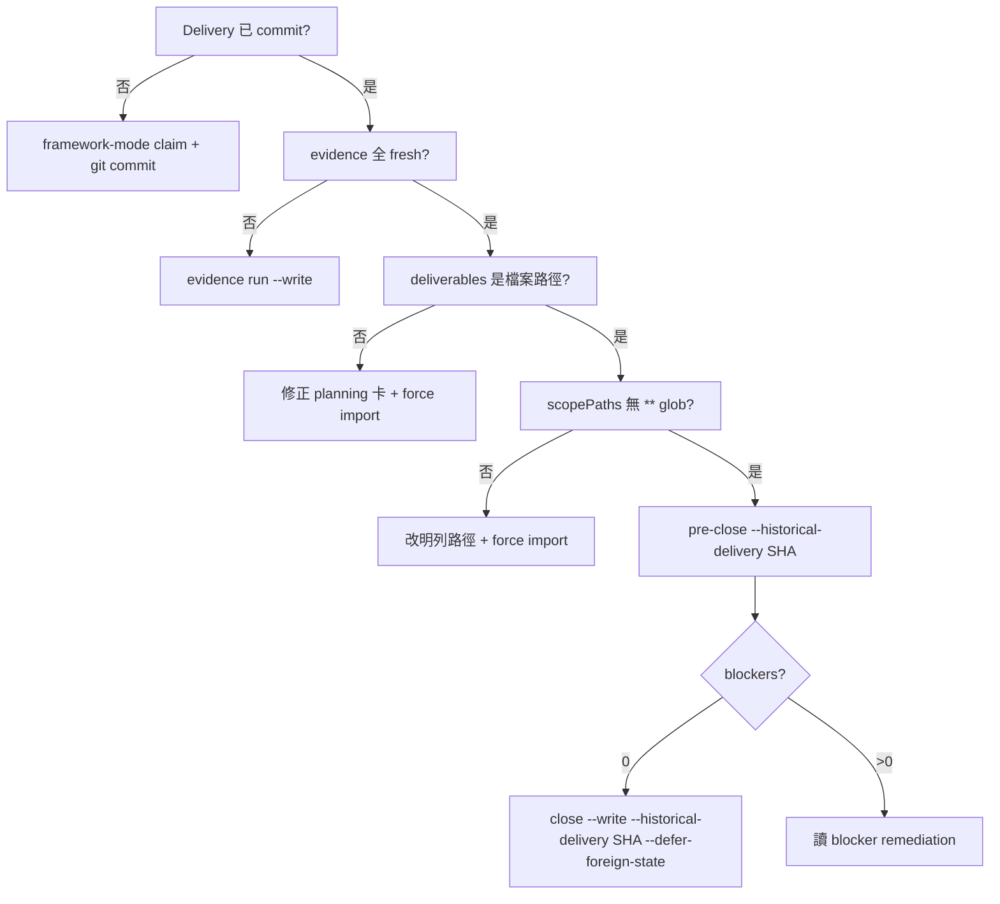

# ATM 執行操作手冊與交接 — TASK-AAO-0144 收工後

Created: 2026-06-18  
Owner: cursor-gpt-5.2（上一輪 worker）  
建議新對話標題: `AAO / ATM operator — 接續下一張卡`  
Planning repo: `C:\Users\User\3KLife`  
Target repo: `C:\Users\User\AI-Atomic-Framework`  
Status: **TASK-AAO-0144 已 done**；本檔供下一個對話串當 ATM 操作參考

---

## New Thread Opening Prompt

**請開一個新的 Cursor 對話**，第一則訊息貼以下內容（或直接 `@` 本檔）：

```text
請把這個新對話標題設為：AAO / ATM operator — 接續下一張卡

你是 ATM governed task 的 continuation worker。
不要假設任何先前聊天歷史；只依本機 workspace 與交接文件開始。全程使用繁體中文。

Planning repo: C:\Users\User\3KLife
Target repo: C:\Users\User\AI-Atomic-Framework

第一步（必做）：
1. 讀 C:\Users\User\3KLife\docs\agent-identity-map.md，設定 actor / git 身份
2. 讀 C:\Users\User\3KLife\docs\keep.summary.md
3. 讀 C:\Users\User\3KLife\docs\ai_atomic_framework\atm-agent-first-operability\HANDOFF-2026-06-18-ATM-EXECUTION-OPERATOR-GUIDE.md（本檔全文）
4. 在 3KLife 執行：node tools_node/compute-gate.js --profile quick --agent-feedback --no-stop
5. 在 target repo 執行：node atm.dev.mjs next --json
6. 若 next 回傳 ATM_USER_NOTICE 或 evidence.userNotice，先展示給使用者
7. 讀 evidence.nextAction.playbook 後才 claim / 編輯 / close

開場先回報：
- 你採用的 actor id
- 兩個 repo 的 dirty 摘要（尤其 release/**、.atm/**、其他 task WIP）
- 建議的下一張任務卡與理由
- 第一個要執行的 governed 命令

硬規則（不可違反）：
- 接任務前：task-lock check → lock → 更新 planning 卡 frontmatter（in-progress）
- 禁止 raw git commit；一律 node atm.dev.mjs git commit --task ... --actor ...
- 禁止 git restore . / checkout -- 清掉別 task 或別 agent 的 WIP
- 禁止手改 ledger status: done；close 只能走 taskflow close --write
- 不要 commit 除非使用者明確要求
```

---

## 雙 Repo 心智模型

| 角色 | 路徑 | 用途 |
| --- | --- | --- |
| Planning | `C:\Users\User\3KLife` | 任務卡 `.task.md`、`task-lock.js`、共識文件 |
| Target | `C:\Users\User\AI-Atomic-Framework` | 框架原始碼、AAF ledger、evidence、close commit |

- **ATM** 是產品/CLI/治理名稱；repo 名是 **AI-Atomic-Framework**，不要簡稱成 AAF。
- 並行多 task 時靠 **per-task claim + direction lock + scopePaths** 收窄，不是物理 worktree 隔離。
- `release/**` 常因 `npm run build` 變 dirty；0144 的 hygiene 會在 build 後還原 tracked manifest，但 root-drop mirror 仍可能殘留 advisory dirty。

---

## 開發用 CLI：`atm.dev.mjs` vs `atm.mjs`

| 情境 | 用哪個 | 原因 |
| --- | --- | --- |
| 改 `packages/cli/src/**` 後立刻驗證/claim/close | `node atm.dev.mjs ...` | 避開 `ATM_RUNNER_SYNC_REQUIRED` |
| pre-commit hook 內部 | `node atm.mjs hook pre-commit` | hook 固定呼叫 frozen runner |
| commit 前 hook 失敗且訊息含 runner sync | 先 `npm run build` | 同步 `atm.mjs` 與 dist |
| 正式收工驗證 | build 後可用 `atm.mjs` | 與 hook 行為一致 |

**技巧**：在 Cursor 裡若 `git commit` 被注入 `--trailer`，wrapper 可能異常；用 Node `spawnSync` 呼叫 `atm.dev.mjs git commit`，不要讓 shell 直接跑 `git commit`。

---

## 標準生命週期（一張 target_repo 卡）

### Phase 0 — 3KLife Pre-flight

```bash
cd C:\Users\User\3KLife
# 1. 身份與共識（讀檔，非命令）
# 2. 健康掃描
node tools_node/compute-gate.js --profile quick --agent-feedback --no-stop
# 3. 接任務卡（硬規則 #0）
node tools_node/task-lock.js check <TASK-ID>
node tools_node/task-lock.js lock <TASK-ID> <actor>
# 4. 更新 planning 卡 frontmatter: status: in-progress, started_at, started_by_agent
```

### Phase 1 — Target 開工

```bash
cd C:\Users\User\AI-Atomic-Framework
node atm.dev.mjs next --json
# 讀 playbook；必要時：
node atm.dev.mjs tasks reserve --task <TASK-ID> --actor <actor> --json
node atm.dev.mjs tasks promote --task <TASK-ID> --actor <actor> --json
node atm.dev.mjs next --claim --actor <actor> --prompt "<TASK-ID>" --json
# 或 claim 路徑依 next 回傳為準

# scope 不足時（delivery 前補）：
node atm.dev.mjs tasks scope add --task <TASK-ID> --actor <actor> --add "path1,path2" --reason "..." --json
```

### Phase 2 — 實作與驗證

```bash
npm run typecheck
npm run validate:cli
node --strip-types scripts/validate-governance-commands.ts --mode validate

# 寫入 task evidence（close 前必做，且要對齊任務卡 validators + framework closure gate）
node atm.dev.mjs evidence run --task <TASK-ID> --actor <actor> \
  --command "npm run validate:git-head-evidence" \
  --validators validate:git-head-evidence --write --json
```

**Framework 檔 commit 前**（`package.json`、`packages/cli/**`、`scripts/**` 等 critical 路徑）：

```bash
node atm.dev.mjs framework-mode claim --actor <actor> --files "path1,path2,..." \
  --reason "temporary framework maintenance before commit" --json
```

### Phase 3 — Delivery commit

```bash
git reset HEAD   # 若 index 混雜 foreign staged
# 只 stage 本 task deliverables，勿含 .atm/runtime/snapshots、release/**、別 task 檔
git add <deliverable-paths...>

node atm.dev.mjs git commit --task <TASK-ID> --actor <actor> \
  --message "feat(aao): <TASK-ID> <summary>" \
  --defer-foreign-staged --json
```

常見 commit 阻擋與對策：

| 錯誤碼 | 對策 |
| --- | --- |
| `ATM_RUNNER_SYNC_REQUIRED` | `npm run build` 後重試 |
| `ATM_FRAMEWORK_ACTIVE_FRAMEWORK_CLAIM_REQUIRED` | `framework-mode claim --files ...` |
| `ATM_GIT_COMMIT_OUT_OF_SCOPE_STAGED` | `tasks scope add` 補路徑 |
| `ATM_GIT_COMMIT_TASK_SCOPED_STAGING_AMBIGUOUS` | `git reset HEAD`，只 stage 本 task 檔；加 `--defer-foreign-staged` |
| `ATM_GIT_COMMIT_GOVERNANCE_BUNDLE_TASK_MISMATCH` | 勿 stage foreign `.atm/runtime/snapshots/*` |
| `ATM_HOOK_PRE_COMMIT_FAILED` | 讀 stderr JSON 的 `blockingFindings` / `requiredCommand` |

### Phase 4 — Close（target_repo + historical delivery）

Delivery **已經 commit**、worktree 仍有平行 dirty 時，close 必帶 historical ref：

```bash
# 1. 補齊 evidence（以 pre-close / closure packet 缺什麼為準）
node atm.dev.mjs evidence run --task <TASK-ID> --actor <actor> \
  --command "npm run validate:onefile-release" \
  --validators validate:onefile-release --write --json

# 2. pre-close
node atm.dev.mjs taskflow pre-close --task <TASK-ID> --actor <actor> \
  --defer-foreign-state --historical-delivery <delivery-sha> --json

# 3. close（會自動 commit governance bundle + planning mirror）
node atm.dev.mjs taskflow close --write --task <TASK-ID> --actor <actor> \
  --defer-foreign-state --historical-delivery <delivery-sha> --json
```

**注意**：`--historical-delivery` 必須帶 **commit SHA 值**，不能只寫 flag。

### Phase 5 — 3KLife Post-flight

```bash
cd C:\Users\User\3KLife
node tools_node/compute-gate.js --profile standard --agent-feedback
node tools_node/task-lock.js unlock <TASK-ID> <actor>
# planning 卡 status: done、notes 補 delivery/close SHA（若 close 未自動寫入）
```

---

## 任務卡 Metadata 陷阱（0144 實戰教訓）

### 1. `deliverables` 必須是檔案路徑，不是描述句

❌ 錯誤（會讓 `taskflow close` 失敗）：

```yaml
deliverables:
  - "Hook or guidance diagnostics identify direct git commit..."
```

✅ 正確：

```yaml
deliverables:
  - "packages/cli/src/commands/hook.ts"
  - "docs/governance/build-release-hygiene.md"
```

錯誤訊息：`ATM_TASKFLOW_CLOSE_COMMIT_BUNDLE_INCOMPLETE` — declared deliverable "..." falls outside active direction lock / targetAllowedFiles.

### 2. `scopePaths` 不要用 `**` glob（close bundle 不認）

`taskflowPathMatches()` 只做前綴比對：`file === declared` 或 `file.startsWith(declared + '/')`。  
`docs/**` **不會** 匹配 `docs/governance/foo.md`。

✅ 作法：

- 在 `scopePaths` **明列**每個 deliverable 檔案；或
- 用目錄前綴（無 glob）：`docs/governance/`；或
- 在 planning 卡加 `targetAllowedFiles`（規劃用；import 後 ledger 仍以 `scopePaths` 為 close 主要 fallback）

### 3. Running task 要改 metadata → `tasks import --write --force` 需 emergency

```bash
node atm.dev.mjs emergency approve \
  --permission backend.tasks.import.write \
  --actor <actor> --task <TASK-ID> \
  --approval-text "<human sentence>" \
  --reason "<why>" \
  --allowed-flag --force --json
# 取得 leaseId 後：
node atm.dev.mjs tasks import --from "../3KLife/.../TASK-....task.md" \
  --write --force --emergency-approval <leaseId> --json
```

**副作用**：force import 可能重置 embedded `taskDirectionLock.allowedFiles` 只剩 `.atm/**`；delivery 後用 `tasks scope add` 再補 deliverable 路徑。

### 4. Closure packet 常要求的 framework validators

除了任務卡列的 validators，close 時 closure packet 可能還要求：

- `validate:git-head-evidence`
- `validate:governance-commands`
- `validate:onefile-release`
- `validate:root-drop-release`

以 `taskflow pre-close` / `ATM_TASK_CLOSE_CLOSURE_PACKET_INVALID` 的 `missing` 欄位為準逐項 `evidence run --write`。

---

## Close 決策樹（簡版）



---

## 平行 Dirty 與 `--defer-foreign-state`

- `release/**`、其他 task 的 WIP、`.atm/catalog` 變更：**不要動**。
- close / pre-close 用 `--defer-foreign-state`（或 commit 用 `--defer-foreign-staged`）。
- dirtyGuard 會把 foreign 檔標成 **advisory**，不應阻擋 historical close。
- **禁止** `git restore .` 或 `git checkout --` 清整個 worktree。

---

## TASK-AAO-0144 收工紀錄

| 項目 | 值 |
| --- | --- |
| 狀態 | done（AAF ledger + 3KLife planning） |
| Delivery | `2c6f90664` — governed git entrypoint + build-release-hygiene |
| Close（AAF governance bundle） | `da9c3dd86` |
| Close（3KLife planning bundle） | `fd22e776` |
| Actor | `cursor-gpt-5.2` |
| 3KLife lock | 已 unlock |

### 0144 交付摘要

- `git-governance` / `hook` / `next`：governed commit 入口、`copyableCommitCommand`、`hostGitCompatibilityGuidance`
- `scripts/build-release-hygiene.ts`：build 後預設還原 tracked release manifest；`ATM_RETAIN_RELEASE_ARTIFACTS=1` 保留
- `docs/governance/build-release-hygiene.md`、`tests/cli/build-release-hygiene.test.ts`

### 0144 close 曾卡住的點（供對照）

1. pre-commit `ATM_RUNNER_SYNC_REQUIRED` → `npm run build`
2. `ATM_FRAMEWORK_ACTIVE_FRAMEWORK_CLAIM_REQUIRED` → `framework-mode claim`
3. deliverables 是 prose → 改檔案路徑 + force import
4. `docs/**` glob 不匹配 → scopePaths 明列
5. `ATM_TASKFLOW_CLOSE_WRITE_BLOCKED` → 加 `--historical-delivery <sha>`
6. `ATM_TASK_CLOSE_CLOSURE_PACKET_INVALID` → 補 onefile/root-drop evidence

---

## 相關文件

| 文件 | 用途 |
| --- | --- |
| `docs/agent-identity-map.md` | actor / git 身份 |
| `docs/keep.summary.md` | 專案共識摘要 |
| `CLAUDE.md` / `AGENTS.md` | 鎖卡、pre/post-flight |
| `docs/ai_atomic_framework/multi-agent-orchestration/HANDOFF-2026-06-17-M7-M8-MAO-CONTINUATION.md` | MAO closeback、scope glob 教訓 |
| `docs/ai_atomic_framework/multi-agent-orchestration/HANDOFF-2026-06-17-DOGFOOD-BUGFIX-CONTINUATION.md` | dogfood 平行、taskflow close 流程 |
| `docs/governance/build-release-hygiene.md` | 0144 build 產物策略（target repo） |
| `docs/governance/git-governance-contract.md` | direct git vs ATM wrapper 契約 |

---

## 下一張卡建議（非強制）

依 `node atm.dev.mjs next --json` 為準。0144 依賴 `TASK-AAO-0141`；同系列 operability 卡可在 `docs/ai_atomic_framework/atm-agent-first-operability/tasks/` 查 `status: open` / `in-progress`。

開新對話時，**先跑 next，不要憑記憶挑卡**。
