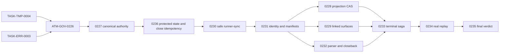

# ATM Plan 3.0 Captain Handoff - 2026-07-21

## Mission

下一個對話群要完成的不是「再寫一份計畫」，而是依 Plan 3.0 把 ATM 2.0／2.1／2.2 尚未通過的功能與證據真正收官。Plan 2.2 保留為歷史基線，不再新增工作；Plan 3.0 是唯一 active implementation plan。

目前只能宣稱：

- Plan coverage：`PASS`；新 backlog readiness review 已有 owner，13-card import、DAG、B1 scope 與 encoding 驗證皆通過。
- Current product replay：`FAIL`，產品修復與真多行程證據尚未完成。
- Post-plan expectation：`conditionally solvable`，只有 `ATM-GOV-0235` 的全部門檻通過後才能宣稱達標。

## Authority Boundary

- Planning authority：`C:/Users/User/3KLife`
- Planning root：`C:/Users/User/3KLife/docs/ai_atomic_framework`
- Target implementation authority：`C:/Users/User/AI-Atomic-Framework`
- Closure authority：target repo 的 ATM ledger、events、evidence 與 governed delivery commit
- Canonical plan：`governance-optimization/end-to-end-auto-batch-performance-plan-v3.md`
- Error card：`error-governance/tasks/TASK-ERR-0003-atm-3-0-broker-and-recovery-errorcode-contracts.task.md`
- TMP prerequisite：`temporary-governance/tasks/TASK-TMP-0004-plan-3-0-backlog-canonical-source-repair.task.md`
- GOV cards：`governance-optimization/tasks/ATM-GOV-0226` 至 `ATM-GOV-0236`
- Target import method：正式 ATM CLI import；禁止手改 `.atm/history/**` 或 `.atm/runtime/**`

完整 plan 與 source task cards 只留在 3KLife。AI-Atomic-Framework 只能接收 CLI-imported ledger records、實作、測試與卡片明列的產品證據。

## Current Snapshot

交接建立時的可重現狀態：

- 交接文件建立前的 Plan 3.0 planning baseline：3KLife `master`、HEAD `dfc2dd65`，當時與 `origin/master` 同步且工作樹乾淨；本交接另以後續 commit 保存。
- AI-Atomic-Framework：`main`，HEAD `2cc2badf1`，與 `origin/main` 同步，工作樹乾淨。
- Plan 3.0 source plan 與 13 張卡已建立、amendment validation 通過，但尚未正式 import 到 target ledger。
- `node atm.mjs next --prompt <Plan 3.0 prompt> --json` 目前回 `ATM_NEXT_TASK_SCOPE_NOT_FOUND`；原因是 ledger 尚無 Plan 3.0 cards，不是產品執行失敗。
- broker active write intents：`0`。
- runner-sync steward queue：`0`。
- parallel admission：`mode=enforce`、`circuitBreakerEnabled=true`、`fallbackMode=queue-only`、`tripped=false`。
- 13 張卡 dry-run import：全部 task count 1、manifest diagnostics 0、errors 0、warnings 0。
- 新 DAG acyclic、missing dependency 0：TMP-0004 + ERR-0003 -> 0226 -> 0227 -> 0236 -> 0230 -> 0231 -> 0228/0229/0232 -> 0233 -> 0234 -> 0235。
- 新 B1 只含 0228/0229/0232，exact/glob-containment scope overlap count = 0；必須等 protected-state、safe runner-sync 與 actor continuity 三個 readiness gate 完成。
- touched encoding guard：15 files 全通過，BOM/U+FFFD/mojibake 均為 0。

最新 planning commits：

- `d40d1067 docs(atm): open Plan 3.0 closure program`
- `d16ff406 docs(atm): capture mixed closure packet replay gap`
- `dfc2dd65 docs(atm): harden Plan 3.0 authorization gates`
- `dfd7c371 docs(atm): hand off Plan 3.0 closure execution`
- `ab4481f9 docs(atm): strengthen Plan 3.0 proof gates`

## Non-Negotiable Decisions

1. 唯一正式仲裁模型仍是 `atm.brokerTicket.v1`；不得建立第二套 queue、BCR authorization、task model 或 task-id 白名單。
2. BCR、freeze、direction lock 與 queue view 只能是 canonical ticket 的 projection/receipt，不能各自持有可寫授權。
3. `INV-ATM-008` 必須成立：shared-write gate 回 execute/queue/batch ticket，不得以裸拒絕代替仲裁。
4. `INV-ATM-009` 必須成立：helper、matcher、normalizer、scope inference、telemetry 與 recovery 都要資料驅動，不得為 0014、0015、特定 actor、path、日期或 queue id 寫死。
5. circuit breaker 預設開啟；任一安全、正確性、觀測或效能門檻失敗即退回 `queue-only`。
6. `queue-only` 不是永久成功狀態。健康 replay 的非注入 trip 與 queue-only residency 必須為 0。
7. 0014／0015 是負向 replay fixture，不是效能 baseline；效能證據必須來自 Plan 3.0 新跑的 paired runs。
8. 不直接刪改 `.atm`、不偽造 receipt、不使用 `--no-verify` 或 waiver 取得假綠燈。
9. TMP-0004 必須先補 canonical backlog shards；0226 再封存 frozen 紅色基線，0227 惰化 legacy BCR，0236/0230/0231 依序證明 protected state、safe shared build 與 actor continuity，之後才可開始 B1 真平行 wave。
10. migration apply 前必須有 immutable snapshot receipt 與正式 rollback CLI；code revert 不能取代 runtime rollback。
11. 0234 驗收 worker 強制由 frozen `node atm.mjs` 啟動；source/dev 結果只能作輔助，parity 比較 canonical behavior projection digest，不比較含時間戳的 raw envelope。
12. 0234 必須同時通過 controlled replay 與兩張真實交集任務 dogfood；不得靠移除 declared intersection 取得綠燈。
13. backlog `Open` 只表示尚未 closeback，不等於產品仍壞；先跑 exact-ID current source/frozen probe，通過就只關 item，失敗才修改 owning code。
14. B1 worker 使用獨立 worktree/index/proposal；只有 canonical composer/steward 可以 shared build、publish、Git index 與 close window。

## First 15 Minutes In The New Conversation

先在 target repo 執行：

```powershell
cd C:/Users/User/AI-Atomic-Framework
git status --short --branch
node atm.mjs broker status --json
node atm.mjs broker runner-sync status --json
node atm.mjs broker parallel-admission status --json
node atm.mjs next --prompt "執行 ATM Plan 3.0 readiness amendment：先完成 TASK-TMP-0004 與 TASK-ERR-0003，再依 DAG 執行 ATM-GOV-0226 至 ATM-GOV-0236。" --json
```

若新對話的 actor identity 不確定，claim 前先執行：

```powershell
node atm.mjs identity clear --json
node atm.mjs identity set --actor <new-actor-id> --editor <editor-id> --git-name "<git user.name>" --git-email "<git user.email>" --json
```

交接不轉移 actor authority。新隊長不得沿用上一位隊長的 actor id、claim 或 session。

接著從 target repo 對每張 planning card 先做：

```powershell
node atm.mjs tasks import --from "C:/Users/User/3KLife/docs/ai_atomic_framework/<card-path>.task.md" --dry-run --json
```

確認 task id、dependencies、scopePaths、deliverables、validators、ErrorCodes 與 diagnostics 正確後，再使用正式 CLI import 寫入 target ledger。不得複製 card 到 target repo，也不得手寫 ledger JSON。完成 import 後重新執行 `next --prompt`，從 ATM 回傳的 queue/batch playbook 開始工作。

## Dependency And Parallel Waves



執行規則：

- R0/A0：`TASK-TMP-0004` 與 `TASK-ERR-0003` 可分開處理；兩者都完成後才進 0226。
- A：完成 `ATM-GOV-0226`，建立 canonical-item census、current-source discrimination、scenario/threshold schema、ownership baseline 與現行 frozen 紅色鑑別力基線。
- B0：單獨完成 `0227`，部署 canonical authority 與 legacy BCR fail-closed guard；它是後續平行 claim 的安全前置。
- B0.5–B0.7：依序完成 `0236 -> 0230 -> 0231`；不得把這三個 shared substrate 修補拿去並行自我 dogfood。
- B1：`0228`、`0229`、`0232` 可使用獨立 actor、worktree/index 與 isolated proposal 真平行實作。
- D：`0233` 必須等待完整 B1，接上 isolated index、terminal saga 與 migration。
- E/F：`0234` 與 `0235` 是證據與收官 lane，不得提前用 fixture 宣告通過。

若 ATM 對整個 Plan 回傳 batch route，只能交付目前 queue head，並在 commit 前執行：

```powershell
node atm.mjs batch checkpoint --actor <actor-id> --json
```

若 ATM 回傳 compose/ticket route，worker 只交 isolated proposal、focused tests 與 evidence；由 canonical composer/steward 統一 publish。worker 不自行搶 build、release mirror、Git index 或 close window。

## Universal Per-Card Governance

每張卡都遵守同一個生命週期：

1. **Consume**：讀 dependency 的 sealed summary、目前 task card、backlog owner 與 source/frozen runner 狀態。
2. **Resolve identity**：新 actor clear/set identity，不沿用別人的 claim。
3. **Claim**：以 `next --claim` 和卡片明列 scope 取得 authority；文件可讀不排隊，shared code/write surface 走 broker ticket。
4. **Atomization preflight**：大模組先依 `atomizationImpact.extractionCandidates` 做 extract/inline 決定；不得把事故特例塞進核心流程。
5. **Implement**：只改 scopePaths；施工中發現 linked/generated surface 時，先 closure/re-arbitrate，再寫入，不能等 commit gate 才補 scope。
6. **Focused validation**：先跑卡片 validators 與 source-first focused tests；修改 runner source 時不能只用 `packages/*/dist` 當出貨證據。
7. **Shared delivery**：build、runner-sync、release mirror、projection、generated write、Git index、checkpoint、closeback 都要 canonical ticket。
8. **Frozen verification**：需要 runner 行為的卡片必須重烘焙後以 `node atm.mjs` 驗證；`node atm.dev.mjs` 只能證明 source behavior。兩者比較 schema-defined canonical behavior projection digest，不能因合法時間戳不同而要求 raw JSON 逐位元相同。
9. **Evidence seal**：封存 window、watermark、counters、timing、source availability、unavailable receipts、compact digest 與 validator results。
10. **Pre-close**：先讀取 `task-view` 與 `taskflow pre-close`；處理 stale evidence、scope drift、foreign staged state、mixed commit 或 missing approval。
11. **Checkpoint/close**：batch route 先 checkpoint；單卡 normal lane 使用 ATM 回傳的 `taskflow close` playbook，不直接呼叫 protected backend close/reconcile。
12. **Closeback**：planning source、target ledger、evidence、events 與 delivery commit 必須一致；完成後再釋放 claim、queue 與 temp framework lock。

通用讀取命令：

```powershell
node atm.mjs task-view --task <task-id> --json
node atm.mjs evidence validators --list --task <task-id> --json
node atm.mjs taskflow pre-close --task <task-id> --actor <actor-id> --json
```

## Evidence Contract For Every Card

每張卡至少收集：

- `taskId`、`actorId`、ticket id、ticket generation、authority digest、projection digest。
- evidence window start/end、watermark、sample count、source availability。
- claim/enqueue/dequeue/publish/close timestamps 與 duration。
- scopePaths、實際 changed files、task-owned commit slice、parent/tree/HEAD digest。
- validator command、exit code、stdout/stderr digest、source/frozen/release/adopter runner mode、runner digest 與 canonical behavior projection digest。
- replay 卡另收 pre-sealed thresholds、`parallelOverlapRatio`、`serializedAdmissionRatio`、starvation threshold/source 與 real dogfood task selection provenance。
- recovery ErrorCode、status command、ordered command manifests、retry count 與結果。
- unavailable 欄位要有 explicit unavailable receipt，不能填 0、猜測或省略。
- compact sealed summary；大量 raw telemetry 由 ATM evidence/artifact surface 保存，不把 raw session dump 當 tracked report。
- `keep-memory write: none + reason`，除非本卡真的產生未被 backlog/card/handoff記錄的新 operator gotcha。

## Card-By-Card Execution And Data

| 卡片 | 治理重點 | 必收數據／證據 | Close gate |
|---|---|---|---|
| `TASK-TMP-0004` | 將 projection-only 的 `-213` 至 `-218` 搬入 canonical item shards。 | 六份 item digest、projection before/after、兩次 rebuild digest、schema results。 | canonical item = 6、projection-only = 0、兩次 rebuild deterministic，無臨時轉換檔。 |
| `TASK-ERR-0003` | 先註冊或重用 8 個 exact ErrorCode；registry 是唯一 authority，`docs/ERROR_CODES.md` 只能 generator 產生。 | 每個 code 的 trigger、category、retryability、approval、status command、ordered manifests；registry/generated-doc digest。 | 8 個 code 均已註冊或有完整 reuse 證據；所有 GOV consumer 只引用正式名稱；`shell=false`。 |
| `ATM-GOV-0226` | 建立 canonical census、current-source discrimination、scenario/threshold contract 與 L0 frozen 紅色基線。 | exact item IDs、projection-only count、probe command/source/frozen result/owner/disposition；scenario/threshold seal與歷史 replay digests。 | unknown owner/projection-only = 0；紅色 baseline 有鑑別力；已修 backlog 只 closeback，仍紅才改 code。 |
| `ATM-GOV-0227` | 讓 `atm.brokerTicket.v1` 成為唯一可寫仲裁；新增 dimension-preserving grants，並在 B1 前惰化無 generation/grant 的 legacy BCR。 | grant dimension/keys/operation/gate/generation/digest、legacy active authorization count、re-arbitration tickets、outer decision coherence、source/frozen behavior digest。 | legacy artifact active authorization = 0 且不刪 sidecar；同維度同資源有效 grant 可授權；跨維度/terminal/stale grant 不授權；無 terminal refusal。 |
| `ATM-GOV-0228` | queue/BCR/freeze/direction-lock projection 使用 atomic replace、CAS generation 與 crash-safe reconcile。 | CAS attempts/conflicts、projection digest/watermark、reconcile count/result、publisher generation count、wakeup count、Windows retry。 | 有效 publisher generation 最多 1；stale projection authorization = 0；破壞測試通過；trip queue-only 時 ticket/proposal/evidence 無遺失。 |
| `ATM-GOV-0229` | 建立 typed linked-surface closure graph；claim 前推導 template/compiler/validator/projection/manifest/build outputs。 | graph nodes/edges、required/optional/unavailable surfaces、provenance/confidence、cycle iterations、scope amendment phase、re-arbitration receipt。 | fixture 在 claim 前列出全部 shared/linked surfaces；disjoint graph 不被擴大；新增 edge 必須在 write 前更新 ticket。 |
| `ATM-GOV-0236` | 修 protected governance state deletion 與 close post-side-effect fake failure。 | protected path class/operation/owner receipts；close side-effect journal、idempotency keys、before/after digest與 fault matrix。 | tracked ledger deletion 在 mutation 前拒絕；合法 lifecycle 可寫；close retry 每個 side effect 最多一次；`-045/-015` terminal。 |
| `ATM-GOV-0230` | B1 前完成 safe single-steward runner-sync、stale lifecycle、terminal parity 與 foreign WIP preservation。 | SHA/generation/lease/queue、source/frozen queue view、foreign file digests、framework-temp admission、advance receipts。 | stale entry 可終止；terminal ghost=0；foreign digest 不變；只有 queue-head steward build；相關 exact items terminal。 |
| `ATM-GOV-0231` | 收斂 actor/task normalizer、runner actor continuity 與 recovery command authority。 | normalizer inventory、queue-head actor/ambient actor、argv/cwd/env/digests、prerequisite chain、Windows round-trip。 | manifest 攜帶 governed actor；ambient identity 不覆蓋；`-208` terminal；無 actor/task/path 特例。 |
| `ATM-GOV-0232` | 驗證 parser fence、orphan imported claim、planning mirror reconcile 與 terminal closeback repair。 | fixture matrix、source/frozen parity、planning digests、adopt/rebind result、backlog disposition。 | fenced `#` 正確；orphan task normal claim 可恢復；`-012/-014/-216/-217` terminal；無 emergency reset。 |
| `ATM-GOV-0233` | 整合 terminal saga、isolated index close、可逆 migration、舊授權消費端與 task-owned closure packet。 | publish/release generation、index before/after、pre/apply/rollback receipts、round-trip state、wakeup、closure digests。 | task-id-only helper=0；foreign index digest 不變；migration/close retry exactly-once；mixed packet pre-close 拒絕。 |
| `ATM-GOV-0234` | 以 frozen workers 完成 controlled replay、真實交集任務 dogfood 與 compose-first/queue-only paired A/B。 | runner/scenario/threshold digests、real task selection provenance、AB/BA cells、workers、overlap/serialized ratios、starvation threshold、tickets/wakeup、7 counters、breaker、performance、coverage。 | L0 同 scenario 由紅轉綠；real dogfood 無移除交集/terminal refusal/人工 wakeup；ratios 達標；7 counters=0；coverage/performance/cost 通過。 |
| `ATM-GOV-0235` | 重跑 census、parity、migration rollback、adopter、backlog 與 Plan 2.2 inherited acceptance；做唯一最終 verdict。 | L0/L3/L4 digests、source/frozen/release/adopter digests、migration/rollback、trip/reset、每個 inherited acceptance disposition。 | controlled + real dogfood 都 pass；七項為 0；ratios/threshold/breaker/parity/rollback 通過；任何 open/failed/inconclusive cell 都不得 close。 |

## ATM-GOV-0234 Replay Measurement Contract

真平行證據至少包含：

- 0226 現行 frozen 紅色 baseline 與 0234 新 frozen 綠色 replay 使用相同 scenario/assertion/threshold digest。
- 兩個以上獨立 OS process 與 actor identity。
- 每個 acceptance worker 由 frozen `node atm.mjs` 啟動並封存 runner digest；source/dev 只作輔助 parity。
- isolated proposals 與 canonical shared publish，不是兩個 agent 輪流寫同一工作樹。
- 三個以上 shared/linked surfaces，加上 disjoint private work。
- 實際時間窗重疊 `> 0`，`parallelOverlapRatio >= 0.30`、`serializedAdmissionRatio <= 0.70`，threshold 在 run 前 sealed。
- `parallelAdmissions > 0`，證明 shared work 真正經過 broker 仲裁。
- HEAD movement、stale runner reservation、publisher crash 三類 fault injection。
- path/file grant 與 atom id/CID grant 的成對 negative scenarios。
- unresolved starvation 由 pre-sealed `starvationThresholdMs` 與 policy/paired-baseline source 自動判定。
- queue-only 與 compose-first 使用相同 sealed base、設定、硬體、build 與 scenario，queue-only 由 policy CLI trip，採 AB/BA，各至少 3 次有效 repeat。
- 另有兩張 registered、未交付且故意保留 declared intersection 的 real-task dogfood；兩位 Captain 都取得 canonical ticket，queued lane 自動 wakeup，且 closure packets 互不污染。

七個 correctness zero counters：

1. `escapedConflictCount = 0`
2. `silentOverwriteCount = 0`
3. `duplicateSideEffectCount = 0`
4. `unresolvedStarvationCount = 0`
5. `staleAuthorizationCount = 0`
6. `dimensionMismatchedAuthorizationCount = 0`
7. `decisionContradictionCount = 0`

必填 breaker telemetry：

- `breakerTripCount`
- `unexpectedBreakerTripCount`
- `timeInQueueOnlyMs`
- `timeInQueueOnlyRatio`
- trip reason
- recovery latency
- reset evidence digest

健康 replay segment 必須 `unexpectedBreakerTripCount = 0` 且 `timeInQueueOnlyRatio = 0`。Fault-injection segment 可以 trip，但每次都必須對應注入原因、保留 evidence，並由較新的 passing digest reset。

## Final Verification Matrix

只有下表全部 `PASS`，`ATM-GOV-0235` 才能 close：

| 維度 | 必要條件 | 失敗處置 |
|---|---|---|
| Functional | `TASK-TMP-0004`、`TASK-ERR-0003`、0226–0234、0236 全部以 target ledger/evidence close，沒有 source-card-only done。 | 保持 Plan 3.0 active。 |
| Discrimination | 0226 frozen 紅色 baseline 與 0234 新 frozen 綠色結果使用同一 scenario/assertion/threshold digest。 | scenario invalid/inconclusive，不得 close。 |
| Correctness | 七個 counters 全為 0；terminal/stale/dimension-mismatched authorization 全為 0。 | 自動 trip `queue-only`。 |
| True parallelism | controlled replay 與 real-task dogfood 都有 process/actor >=2、parallel admissions >0、overlap ratio >=0.30、serialized ratio <=0.70；real tasks 保留 declared intersection。 | verdict `failed` 或 `inconclusive`，不得用 fixture、縮 scope 或人工 wakeup 補。 |
| Performance | median makespan >=25% 改善、active throughput >=25% 改善、cost ratio <=1.10。 | trip `queue-only`，保留 exact failing cell。 |
| Observability | shared-write producer observed coverage 100%；summary 有 window/watermark/sample count/source availability/sealed digest。 | 不得 close；補 producer 或 unavailable receipt。 |
| Breaker | 健康 segment 無非注入 trip、queue-only ratio 0；故障 segment 能 trip，且只能以新 passing digest reset。 | 保持 tripped/queue-only，輸出 recovery manifests。 |
| Parity | source、frozen runner、release artifacts、adopter projections 同版，runner digest 與 canonical behavior projection digest 通過。 | runner-sync/reconcile 後重跑。 |
| Recovery | cancel/adopt/reconcile/migrate/publish/release/wakeup 可重試且 exactly-once；migration apply/rollback round-trip 與 rollback drill 通過。 | 保留 evidence，禁止手改 runtime。 |
| Cross-plan closure | Plan 2.2 每個未完成 acceptance 都是 `satisfied` 或 `superseded-with-evidence`，不得有 `open`。 | 0235 保持 open。 |

最終 tracked report 為 target repo 的 `docs/governance/atm-3-replay-evidence.md` 與 ATM sealed evidence。報告必須列出 scenario digest、run cells、七個 counters、breaker telemetry、paired metrics、parity、rollback、Plan 2.2 dispositions 與 final verdict。

## Stop Rules

立即停下並保留現場，不得繞過：

- frozen runner 與 source 不同版，且行為驗收依賴 runner。
- shared-write gate 回裸拒絕而沒有 ticket/status/recovery。
- scope 新增 linked surface，但尚未 re-arbitrate。
- authorization 只剩 task id、未保留資源維度與 keys。
- 0227 legacy fail-closed guard 尚未以 frozen runner證明，卻要啟動 B1 平行 wave。
- TMP-0004、0236、0230 或 0231 尚未 close，卻要啟動 B1；或 B1 worker 共用同一 worktree/index、各自搶 runner build。
- evidence 缺 window/watermark/digest，卻試圖填 0 或口頭推測。
- queue/build/release 要求偽造 receipt 才能前進。
- foreign commit 或移動 HEAD 被混入本卡 closure packet。
- migration/reconcile 需要直接刪改 `.atm`。
- correctness counter 非 0、coverage <100%、ratio 未達 pre-sealed threshold、starvation threshold 未定、real dogfood 移除 declared intersection，或 paired cell 不完整。

所有 `ATM_*` 錯誤先使用 `atm-error-code-resolver` 查 registry contract；交接或報告要保存 error code、產生它的 command、registry 是否存在、status command 與正式 recovery manifest，不維護私有 recovery prose。

## What The New Captain Must Not Misread

- 0014／0015 已關卡，不代表 Plan 3.0 已完成；它們只提供歷史負向 evidence。
- broker queue 現在為 0，只代表現場乾淨，不證明 stale reservation lifecycle 已修。
- circuit breaker 現在未 trip，只代表目前沒有觸發，不證明健康 replay 不會長期退化成 queue-only。
- parser 與 glob overlap 的 current source probe 可能已通過，但 backlog closeback 與 frozen parity 仍要由 0226/0232 正式封證。
- backlog row 顯示 Open 不代表需要重寫產品；exact date/id、current source probe與 frozen parity 三者缺一就只能標 `inconclusive`。
- `protected-ledger-destructive-guard` 在本次盤點實測仍紅，不能因 test 檔已存在就誤判已修。
- source unit test 通過不等於 frozen runner、release mirror、adopter projection 通過。
- 文件與卡片完成不等於產品完成；只有 0235 的 target evidence verdict 有 closure authority。

## Ready-To-Paste Prompt For The New Conversation

```text
你是 ATM Plan 3.0 收官隊長。請先閱讀：
C:/Users/User/3KLife/docs/ai_atomic_framework/governance-optimization/ATM-GOV-3.0-captain-handoff-2026-07-21.md
以及 canonical plan：
C:/Users/User/3KLife/docs/ai_atomic_framework/governance-optimization/end-to-end-auto-batch-performance-plan-v3.md

Planning authority 是 C:/Users/User/3KLife，target 與 closure authority 是 C:/Users/User/AI-Atomic-Framework。先用 frozen node atm.mjs 做 preflight、確認 actor identity、dry-run 並正式 import 13 張 cards。依 DAG 執行：TASK-TMP-0004 + TASK-ERR-0003 -> 0226 -> 0227 -> 0236 -> 0230 -> 0231 -> 0228/0229/0232 isolated B1 wave -> 0233 -> 0234 controlled replay + real-task dogfood -> 0235。開始 B1 前必須證明 canonical backlog、protected ledger、close idempotency、single runner steward 與 actor continuity；所有 shared write 走 canonical broker ticket，方法資料驅動且不可為 0014/0015 寫死。只有同 scenario 由紅轉綠、真實交集任務不縮 scope、七個 correctness counters 為 0、ratios/starvation/效能/coverage/breaker/parity/migration rollback/Plan 2.2 dispositions 全部通過，才可以關閉 Plan 3.0。
```

## Memory Write Check

- Confirmed new pitfall + fix：generated backlog projection 可包含沒有 canonical item shard 的孤兒列；以 TMP-0004 source repair 與 0226 projection-only census 防止證據在 rebuild 時消失。
- Major closure snapshot：none；Plan 3.0 尚未實作完成。
- Human working-method correction：none beyond the formal Plan 3.0 amendments already written into plan/cards。
- Invalidated memory note：none。
- keep-memory write：`none`，避免重複 handoff/card/backlog 已保存的治理內容。
