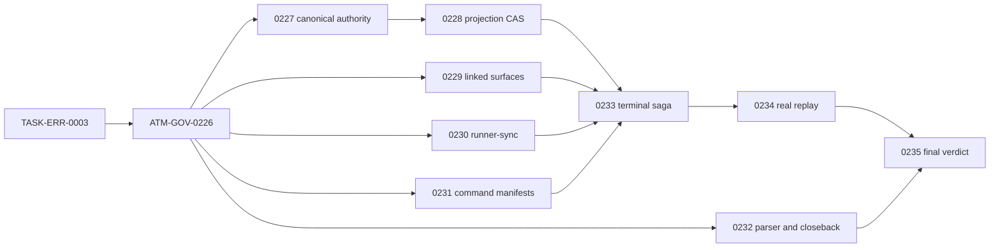

# ATM Plan 3.0 Captain Handoff - 2026-07-21

## Mission

下一個對話群要完成的不是「再寫一份計畫」，而是依 Plan 3.0 把 ATM 2.0／2.1／2.2 尚未通過的功能與證據真正收官。Plan 2.2 保留為歷史基線，不再新增工作；Plan 3.0 是唯一 active implementation plan。

目前只能宣稱：

- Plan coverage：`PASS`，已知缺口都有 owner、依賴與 acceptance。
- Current product replay：`FAIL`，產品修復與真多行程證據尚未完成。
- Post-plan expectation：`conditionally solvable`，只有 `ATM-GOV-0235` 的全部門檻通過後才能宣稱達標。

## Authority Boundary

- Planning authority：`C:/Users/User/3KLife`
- Planning root：`C:/Users/User/3KLife/docs/ai_atomic_framework`
- Target implementation authority：`C:/Users/User/AI-Atomic-Framework`
- Closure authority：target repo 的 ATM ledger、events、evidence 與 governed delivery commit
- Canonical plan：`governance-optimization/end-to-end-auto-batch-performance-plan-v3.md`
- Error card：`error-governance/tasks/TASK-ERR-0003-atm-3-0-broker-and-recovery-errorcode-contracts.task.md`
- GOV cards：`governance-optimization/tasks/ATM-GOV-0226` 至 `ATM-GOV-0235`
- Target import method：正式 ATM CLI import；禁止手改 `.atm/history/**` 或 `.atm/runtime/**`

完整 plan 與 source task cards 只留在 3KLife。AI-Atomic-Framework 只能接收 CLI-imported ledger records、實作、測試與卡片明列的產品證據。

## Current Snapshot

交接建立時的可重現狀態：

- 交接文件建立前的 Plan 3.0 planning baseline：3KLife `master`、HEAD `dfc2dd65`，當時與 `origin/master` 同步且工作樹乾淨；本交接另以後續 commit 保存。
- AI-Atomic-Framework：`main`，HEAD `2cc2badf1`，與 `origin/main` 同步，工作樹乾淨。
- Plan 3.0 source plan 與 11 張卡已建立、解析通過，但尚未 import 到 target ledger。
- `node atm.mjs next --prompt <Plan 3.0 prompt> --json` 目前回 `ATM_NEXT_TASK_SCOPE_NOT_FOUND`；原因是 ledger 尚無 Plan 3.0 cards，不是產品執行失敗。
- broker active write intents：`0`。
- runner-sync steward queue：`0`。
- parallel admission：`mode=enforce`、`circuitBreakerEnabled=true`、`fallbackMode=queue-only`、`tripped=false`。
- 11 張卡 dry-run import：全部 `ok=true`、manifest diagnostics `0`、task import diagnostics `0`。
- 依賴 DAG：acyclic。
- 波次 B 五張卡的 source scope census：`0` 個已知交集。

最新 planning commits：

- `d40d1067 docs(atm): open Plan 3.0 closure program`
- `d16ff406 docs(atm): capture mixed closure packet replay gap`
- `dfc2dd65 docs(atm): harden Plan 3.0 authorization gates`

## Non-Negotiable Decisions

1. 唯一正式仲裁模型仍是 `atm.brokerTicket.v1`；不得建立第二套 queue、BCR authorization、task model 或 task-id 白名單。
2. BCR、freeze、direction lock 與 queue view 只能是 canonical ticket 的 projection/receipt，不能各自持有可寫授權。
3. `INV-ATM-008` 必須成立：shared-write gate 回 execute/queue/batch ticket，不得以裸拒絕代替仲裁。
4. `INV-ATM-009` 必須成立：helper、matcher、normalizer、scope inference、telemetry 與 recovery 都要資料驅動，不得為 0014、0015、特定 actor、path、日期或 queue id 寫死。
5. circuit breaker 預設開啟；任一安全、正確性、觀測或效能門檻失敗即退回 `queue-only`。
6. `queue-only` 不是永久成功狀態。健康 replay 的非注入 trip 與 queue-only residency 必須為 0。
7. 0014／0015 是負向 replay fixture，不是效能 baseline；效能證據必須來自 Plan 3.0 新跑的 paired runs。
8. 不直接刪改 `.atm`、不偽造 receipt、不使用 `--no-verify` 或 waiver 取得假綠燈。

## First 15 Minutes In The New Conversation

先在 target repo 執行：

```powershell
cd C:/Users/User/AI-Atomic-Framework
git status --short --branch
node atm.mjs broker status --json
node atm.mjs broker runner-sync status --json
node atm.mjs broker parallel-admission status --json
node atm.mjs next --prompt "執行 ATM Plan 3.0，先匯入並完成 TASK-ERR-0003，之後依依賴執行 ATM-GOV-0226 至 ATM-GOV-0235。" --json
```

若新對話的 actor identity 不確定，claim 前先執行：

```powershell
node atm.mjs identity clear --json
node atm.mjs identity set --actor <new-actor-id> --editor <editor-id> --git-name "<git user.name>" --git-email "<git user.email>" --json
```

交接不轉移 actor authority。新隊長不得沿用上一位隊長的 actor id、claim 或 session。

接著從 target repo 對每張 planning card 先做：

```powershell
node atm.mjs tasks import --from "C:/Users/User/3KLife/docs/ai_atomic_framework/<card-path>.task.md" --dry-run --json
```

確認 task id、dependencies、scopePaths、deliverables、validators、ErrorCodes 與 diagnostics 正確後，再使用正式 CLI import 寫入 target ledger。不得複製 card 到 target repo，也不得手寫 ledger JSON。完成 import 後重新執行 `next --prompt`，從 ATM 回傳的 queue/batch playbook 開始工作。

## Dependency And Parallel Waves



執行規則：

- A0：先單獨完成 `TASK-ERR-0003`。
- A：再完成 `ATM-GOV-0226`，建立所有後續卡共用的 census、replay schema 與 ownership baseline。
- B：`0227`、`0229`、`0230`、`0231`、`0232` 可使用獨立 actor 與 isolated proposal 真平行實作。
- C：`0227` 完成後可啟動 `0228`，不必等待其餘 B 卡。
- D：`0233` 必須等待 `0228/0229/0230/0231`；`0232` 可繼續平行，但最後 `0235` 仍必須等它。
- E/F：`0234` 與 `0235` 是證據與收官 lane，不得提前用 fixture 宣告通過。

若 ATM 對整個 Plan 回傳 batch route，只能交付目前 queue head，並在 commit 前執行：

```powershell
node atm.mjs batch checkpoint --actor <actor-id> --json
```

若 ATM 回傳 compose/ticket route，worker 只交 isolated proposal、focused tests 與 evidence；由 canonical composer/steward 統一 publish。worker 不自行搶 build、release mirror、Git index 或 close window。

## Universal Per-Card Governance

每張卡都遵守同一個生命週期：

1. **Consume**：讀 dependency 的 sealed summary、目前 task card、backlog owner 與 source/frozen runner 狀態。
2. **Resolve identity**：新 actor clear/set identity，不沿用別人的 claim。
3. **Claim**：以 `next --claim` 和卡片明列 scope 取得 authority；文件可讀不排隊，shared code/write surface 走 broker ticket。
4. **Atomization preflight**：大模組先依 `atomizationImpact.extractionCandidates` 做 extract/inline 決定；不得把事故特例塞進核心流程。
5. **Implement**：只改 scopePaths；施工中發現 linked/generated surface 時，先 closure/re-arbitrate，再寫入，不能等 commit gate 才補 scope。
6. **Focused validation**：先跑卡片 validators 與 source-first focused tests；修改 runner source 時不能只用 `packages/*/dist` 當出貨證據。
7. **Shared delivery**：build、runner-sync、release mirror、projection、generated write、Git index、checkpoint、closeback 都要 canonical ticket。
8. **Frozen verification**：需要 runner 行為的卡片必須重烘焙後以 `node atm.mjs` 驗證；`node atm.dev.mjs` 只能證明 source behavior。
9. **Evidence seal**：封存 window、watermark、counters、timing、source availability、unavailable receipts、compact digest 與 validator results。
10. **Pre-close**：先讀取 `task-view` 與 `taskflow pre-close`；處理 stale evidence、scope drift、foreign staged state、mixed commit 或 missing approval。
11. **Checkpoint/close**：batch route 先 checkpoint；單卡 normal lane 使用 ATM 回傳的 `taskflow close` playbook，不直接呼叫 protected backend close/reconcile。
12. **Closeback**：planning source、target ledger、evidence、events 與 delivery commit 必須一致；完成後再釋放 claim、queue 與 temp framework lock。

通用讀取命令：

```powershell
node atm.mjs task-view --task <task-id> --json
node atm.mjs evidence validators --list --task <task-id> --json
node atm.mjs taskflow pre-close --task <task-id> --actor <actor-id> --json
```

## Evidence Contract For Every Card

每張卡至少收集：

- `taskId`、`actorId`、ticket id、ticket generation、authority digest、projection digest。
- evidence window start/end、watermark、sample count、source availability。
- claim/enqueue/dequeue/publish/close timestamps 與 duration。
- scopePaths、實際 changed files、task-owned commit slice、parent/tree/HEAD digest。
- validator command、exit code、stdout/stderr digest、source/frozen/release/adopter runner mode。
- recovery ErrorCode、status command、ordered command manifests、retry count 與結果。
- unavailable 欄位要有 explicit unavailable receipt，不能填 0、猜測或省略。
- compact sealed summary；大量 raw telemetry 由 ATM evidence/artifact surface 保存，不把 raw session dump 當 tracked report。
- `keep-memory write: none + reason`，除非本卡真的產生未被 backlog/card/handoff記錄的新 operator gotcha。

## Card-By-Card Execution And Data

| 卡片 | 治理重點 | 必收數據／證據 | Close gate |
|---|---|---|---|
| `TASK-ERR-0003` | 先註冊或重用 7 個 exact ErrorCode；registry 是唯一 authority，`docs/ERROR_CODES.md` 只能 generator 產生。 | 每個 code 的 trigger、category、retryability、approval、status command、ordered manifests；registry/generated-doc digest。 | 7 個 code 均已註冊或有完整 reuse 證據；所有 GOV consumer 只引用正式名稱；`shell=false`。 |
| `ATM-GOV-0226` | 建立 canonical ticket/BCR/queue/freeze/direction-lock/claim/runner-sync/closeback census；歷史 0014/0015 只作資料。 | producer/consumer、authority、generation/digest、terminal status、recovery、observed/unavailable；三張 BCR、兩張 terminal tasks、delivery order、mixed closure packet digest；`-213/-214/-216/-217/-218` probe。 | unknown owner = 0；每個 Open backlog row 有 probe/owner/recovery；decision coherence 在 source/frozen 有 receipt；歷史 timing 不可得時有 unavailable receipt。 |
| `ATM-GOV-0227` | 讓 `atm.brokerTicket.v1` 成為唯一可寫仲裁；新增 dimension-preserving `authorizationGrants[]`，task id 不得單獨授權。 | grant resource dimension/kind、normalized keys、operation、consumer gate、generation/digest；terminal authorization count；outer decision/matrix/gate/conflict coherence。 | path grant 不能抑制 atom id/CID block；atom grant不能授權無關 path/surface；terminal ticket 全 gate fail closed；decision contradiction = 0。 |
| `ATM-GOV-0228` | queue/BCR/freeze/direction-lock projection 使用 atomic replace、CAS generation 與 crash-safe reconcile。 | CAS attempts/conflicts、projection digest/watermark、reconcile count/result、publisher generation count、wakeup count、Windows retry。 | 有效 publisher generation 最多 1；stale projection authorization = 0；破壞測試通過；trip queue-only 時 ticket/proposal/evidence 無遺失。 |
| `ATM-GOV-0229` | 建立 typed linked-surface closure graph；claim 前推導 template/compiler/validator/projection/manifest/build outputs。 | graph nodes/edges、required/optional/unavailable surfaces、provenance/confidence、cycle iterations、scope amendment phase、re-arbitration receipt。 | fixture 在 claim 前列出全部 shared/linked surfaces；disjoint graph 不被擴大；新增 edge 必須在 write 前更新 ticket。 |
| `ATM-GOV-0230` | runner-sync reservation 與 logical task identity 分離；實作 cancel/expire/coalesce/revalidate。 | base SHA reachability、reservation generation、owner heartbeat/lease、queue position、`waitedMs`、aging、cancel/revalidate/release counts、`staleReleases` 與實際 mutation。 | active task 下的 stale reservation 仍可合法終止；不可達 SHA 不要求假 receipt；position 2 可被 single-flight 喚醒；duplicate side effect = 0。 |
| `ATM-GOV-0231` | 收斂 actor/task normalizer 與 recovery command authority；使用 `atm.commandManifest.v1`。 | normalizer call-site inventory、private regex count、argv/cwd/env/timeout/input-output digests、prerequisite chain 執行結果、Windows round-trip。 | dotted/space/Unicode identity 一致；emitted chain 可直接執行且含 temp claim/files/enqueue/build/release；私有 regex/string authority = 0。 |
| `ATM-GOV-0232` | 驗證 parser fence 邊界、projection completeness、planning mirror reconcile 與 terminal closeback repair。 | fixture matrix、diagnostic code/sourceLine/task id、source/frozen parity、template/adapters count、planning before/after digest、mutation/no-op receipt、backlog disposition。 | fenced `#` 不重置 task；diagnostic line 正確；`done + released` 可冪等修 mirror；未修改宣告 mirror 時 fail closed。 |
| `ATM-GOV-0233` | 整合 terminal saga、legacy BCR migration、claim/Git 舊授權消費端與 task-owned closure packet。 | publish/release generation、active authorization count、migration status/dry-run/apply receipts、quarantine count、legacy task-id-only consumer inventory、wakeup count、closure changed-files/tree/parent/command/HEAD digests。 | terminal active authorization = 0；task-id-only production helper = 0；migration exactly-once；single successor wakeup；mixed closure packet 在 pre-close 被拒絕。 |
| `ATM-GOV-0234` | 以真 process/actor、isolated proposals、shared publish 重演故障形狀；做 compose-first 對 queue-only paired A/B。 | sealed base/config/hardware、AB/BA order、每 arm 至少 3 repeats、workers、overlap window、parallel admissions、7 個 correctness counters、breaker telemetry、makespan、throughput、cost ratio、coverage。 | `maxConcurrentWorkers >= 2`、overlap > 0、parallel admissions > 0；7 個 correctness counters = 0；coverage 100%；makespan/throughput 各改善 >=25%；cost ratio <=1.10。 |
| `ATM-GOV-0235` | 重跑 census、parity、adopter、rollback、backlog 與 Plan 2.2 inherited acceptance；做唯一最終 verdict。 | 0226 divergence dispositions、0234 evidence digest、source/frozen/release/adopter digests、rollback receipt、trip/reset receipt、每個 inherited acceptance disposition。 | 所有 divergence terminal；7 個 correctness counters = 0；健康 replay breaker 指標通過；所有 2.2 acceptance terminal；任何 open/failed/unavailable cell 都不得 close。 |

## ATM-GOV-0234 Replay Measurement Contract

真平行證據至少包含：

- 兩個以上獨立 OS process 與 actor identity。
- isolated proposals 與 canonical shared publish，不是兩個 agent 輪流寫同一工作樹。
- 三個以上 shared/linked surfaces，加上 disjoint private work。
- 實際時間窗重疊 `> 0`，不是只看任務開始/結束標籤。
- `parallelAdmissions > 0`，證明 shared work 真正經過 broker 仲裁。
- HEAD movement、stale runner reservation、publisher crash 三類 fault injection。
- path/file grant 與 atom id/CID grant 的成對 negative scenarios。
- queue-only 與 compose-first 使用相同 sealed base、設定、硬體與 scenario，採 AB/BA，各至少 3 次有效 repeat。

七個 correctness zero counters：

1. `escapedConflictCount = 0`
2. `silentOverwriteCount = 0`
3. `duplicateSideEffectCount = 0`
4. `unresolvedStarvationCount = 0`
5. `staleAuthorizationCount = 0`
6. `dimensionMismatchedAuthorizationCount = 0`
7. `decisionContradictionCount = 0`

必填 breaker telemetry：

- `breakerTripCount`
- `unexpectedBreakerTripCount`
- `timeInQueueOnlyMs`
- `timeInQueueOnlyRatio`
- trip reason
- recovery latency
- reset evidence digest

健康 replay segment 必須 `unexpectedBreakerTripCount = 0` 且 `timeInQueueOnlyRatio = 0`。Fault-injection segment 可以 trip，但每次都必須對應注入原因、保留 evidence，並由較新的 passing digest reset。

## Final Verification Matrix

只有下表全部 `PASS`，`ATM-GOV-0235` 才能 close：

| 維度 | 必要條件 | 失敗處置 |
|---|---|---|
| Functional | `TASK-ERR-0003`、0226–0234 全部以 target ledger/evidence close，沒有 source-card-only done。 | 保持 Plan 3.0 active。 |
| Correctness | 七個 counters 全為 0；terminal/stale/dimension-mismatched authorization 全為 0。 | 自動 trip `queue-only`。 |
| True parallelism | 真 process/actor >=2、overlap >0、parallel admissions >0、shared 與 private work 同時存在。 | verdict `failed` 或 `inconclusive`，不得用 fixture 補。 |
| Performance | median makespan >=25% 改善、active throughput >=25% 改善、cost ratio <=1.10。 | trip `queue-only`，保留 exact failing cell。 |
| Observability | shared-write producer observed coverage 100%；summary 有 window/watermark/sample count/source availability/sealed digest。 | 不得 close；補 producer 或 unavailable receipt。 |
| Breaker | 健康 segment 無非注入 trip、queue-only ratio 0；故障 segment 能 trip，且只能以新 passing digest reset。 | 保持 tripped/queue-only，輸出 recovery manifests。 |
| Parity | source、frozen runner、release artifacts、adopter projections 同版且 smoke 通過。 | runner-sync/reconcile 後重跑。 |
| Recovery | cancel/adopt/reconcile/migrate/publish/release/wakeup 可重試且 exactly-once；rollback drill 通過。 | 保留 evidence，禁止手改 runtime。 |
| Cross-plan closure | Plan 2.2 每個未完成 acceptance 都是 `satisfied` 或 `superseded-with-evidence`，不得有 `open`。 | 0235 保持 open。 |

最終 tracked report 為 target repo 的 `docs/governance/atm-3-replay-evidence.md` 與 ATM sealed evidence。報告必須列出 scenario digest、run cells、七個 counters、breaker telemetry、paired metrics、parity、rollback、Plan 2.2 dispositions 與 final verdict。

## Stop Rules

立即停下並保留現場，不得繞過：

- frozen runner 與 source 不同版，且行為驗收依賴 runner。
- shared-write gate 回裸拒絕而沒有 ticket/status/recovery。
- scope 新增 linked surface，但尚未 re-arbitrate。
- authorization 只剩 task id、未保留資源維度與 keys。
- evidence 缺 window/watermark/digest，卻試圖填 0 或口頭推測。
- queue/build/release 要求偽造 receipt 才能前進。
- foreign commit 或移動 HEAD 被混入本卡 closure packet。
- migration/reconcile 需要直接刪改 `.atm`。
- correctness counter 非 0、coverage <100%、真 overlap =0 或 paired cell 不完整。

所有 `ATM_*` 錯誤先使用 `atm-error-code-resolver` 查 registry contract；交接或報告要保存 error code、產生它的 command、registry 是否存在、status command 與正式 recovery manifest，不維護私有 recovery prose。

## What The New Captain Must Not Misread

- 0014／0015 已關卡，不代表 Plan 3.0 已完成；它們只提供歷史負向 evidence。
- broker queue 現在為 0，只代表現場乾淨，不證明 stale reservation lifecycle 已修。
- circuit breaker 現在未 trip，只代表目前沒有觸發，不證明健康 replay 不會長期退化成 queue-only。
- parser 與 glob overlap 的 current source probe 可能已通過，但 backlog closeback 與 frozen parity 仍要由 0226/0232 正式封證。
- source unit test 通過不等於 frozen runner、release mirror、adopter projection 通過。
- 文件與卡片完成不等於產品完成；只有 0235 的 target evidence verdict 有 closure authority。

## Ready-To-Paste Prompt For The New Conversation

```text
你是 ATM Plan 3.0 收官隊長。請先閱讀：
C:/Users/User/3KLife/docs/ai_atomic_framework/governance-optimization/ATM-GOV-3.0-captain-handoff-2026-07-21.md
以及 canonical plan：
C:/Users/User/3KLife/docs/ai_atomic_framework/governance-optimization/end-to-end-auto-batch-performance-plan-v3.md

Planning authority 是 C:/Users/User/3KLife，target 與 closure authority 是 C:/Users/User/AI-Atomic-Framework。先用 frozen node atm.mjs 做 preflight、確認自己的 actor identity、dry-run 並正式 import 11 張 Plan 3.0 cards。之後依 DAG 執行：TASK-ERR-0003 -> ATM-GOV-0226 -> 波次 B/C -> ATM-GOV-0233 -> 0234 -> 0235。所有 shared write 必須走 canonical broker ticket；方法必須資料驅動且不可為 0014/0015 寫死。每張卡都要收 window、watermark、counters、timing、source availability、unavailable receipts 與 sealed digest。只有真多行程 replay、七個 correctness counters 為 0、效能/coverage/breaker/parity/rollback/Plan 2.2 dispositions 全部通過，才可以關閉 Plan 3.0。
```

## Memory Write Check

- Confirmed new pitfall + fix：none；本輪只把已存在於 Plan 3.0、task cards、backlog 與既有 operator memory 的內容整理成交接。
- Major closure snapshot：none；Plan 3.0 尚未實作完成。
- Human working-method correction：none beyond the formal Plan 3.0 amendments already written into plan/cards。
- Invalidated memory note：none。
- keep-memory write：`none`，避免重複 handoff/card/backlog 已保存的治理內容。
