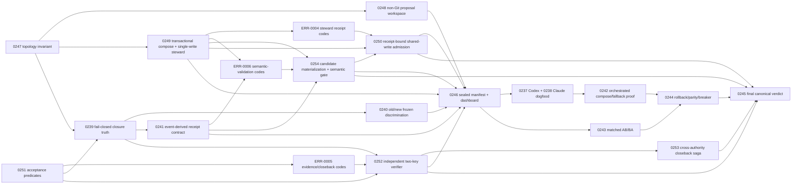

# ATM Plan 3.1 Captain Handoff — 2026-07-22

## Handoff outcome

Plan 3.1 is planning-ready and can be dispatched as dependency-gated parallel waves. It is a continuation repair of Plan 3.0, not a new task model. The implementation objective is to prove real same-canonical-worktree compose-first development with command-backed semantic evidence, a neutral steward as the only shared-file materializer, and a final verdict reconstructed from canonical sources.

Historical `ATM-GOV-0234` and `ATM-GOV-0235` remain immutable Plan 3.0 records. Do not reopen them. Their false-green evidence is superseded for Plan closure by the Plan 3.1 continuation lineage.

## Authority and repository boundary

| Authority | Canonical location | Mutation rule |
|---|---|---|
| Planning | `C:/Users/User/3KLife/docs/ai_atomic_framework` | Plan, Lessons Learned, source task cards, and this handoff live here. |
| Target | `C:/Users/User/AI-Atomic-Framework` | ATM implementation and CLI-imported `.atm/history/**` ledger records live here. |
| Closure | Target task ledger plus cross-authority closeback receipt | Planning status and Plan status may advance only through the declared two-authority closeback contract. |

Source task cards must be imported with `node atm.mjs tasks import --from <card> --dry-run --json` and then the governed write route. Never copy source cards into a second target-side planning model.

## Non-negotiable execution model

- All normal development uses one canonical worktree, base, and HEAD under `INV-ATM-010`.
- Workers declare bounded atom/CID/content-anchor/source-range intent and produce proposals. They do not use branches, detached worktrees, alternate indexes, merges, or rebases as task isolation.
- Same physical-file overlap is compose-eligible. Broker, format adapter, transactional composer, semantic validator, and neutral steward decide compose, revalidation, escalation, or queue.
- A worker must not materialize a shared-file proposal. The neutral steward is the only canonical shared-file writer and writes each composed output file once after CAS and semantic validation.
- Git is the outer delivery boundary after steward apply. It is not an ATM arbitration mechanism.
- Every safety/governance runtime card that owns frozen behavior must close with attributable source/frozen parity evidence; an aggregate later card cannot repair a source-only closure retroactively.
- Missing, unavailable, producer-self-certified, or insufficient-realness evidence yields `inconclusive` or `remain-open`, never a healthy default.

## Executable dependency graph

### 2026-07-23 authoritative execution overlay

The full-backlog sweep added `ATM-GOV-0262` and `ATM-GOV-0263`. This overlay
supersedes the original wave table below whenever the two disagree.

```mermaid
flowchart LR
    C0["0260 current closeout"] --> P1
    subgraph P1["parallel prelude"]
      I["0257 actor continuity"]
      O["0262 overlap matcher parity"]
    end
    I --> R["0256 runner freshness"]
    R --> Q["0258 transactional commit/WIP recovery"]
    Q --> W["0259 write-ticket/scope guard"]
    W --> V["0261 VCS-neutral candidate isolation"]
    V --> A["0263 autonomous continuation"]
    O --> T["0239 closure truth"]
    A --> E
    T --> E
    subgraph E["parallel evidence/closure foundation"]
      E1["0240 frozen discrimination"]
      E2["0241 event/telemetry receipts"]
      E3["0252 → 0253 closure saga"]
      E4["0248／0254／0250 proposal-to-delivery chain"]
    end
    E --> D["0246 dashboard → 0242 dogfood → 0243 benchmark"]
    D --> F["0244 closeback → 0245 final verdict"]
```

| Order | Dispatch rule |
|---|---|
| 1 | Finish/close 0260. TASK-SKL-0017 waits; do not let its foreign files enter 0260 close. |
| 2 | 0257 and 0262 may run in parallel only after Broker confirms disjoint scopes. |
| 3 | Run 0256 after 0257, then 0258 → 0259 → 0261. These share runner/Git/write surfaces and are sequential unless ATM returns a compose/queue ticket proving safe overlap. |
| 4 | Run 0263 after 0257 and 0261. It is the zero-human-command-repair gate before real dogfood. |
| 5 | Run 0239 after 0262; then open the parallel evidence/closure foundation shown above. |
| 6 | 0246 preflight gates 0242/0243; 0244 and 0245 remain final serial integration gates. |

Waiting-only dispatches are one sentence. Full dispatch packets are emitted
only when a worker has executable work.

## Original dispatch waves (superseded by the 2026-07-23 overlay where different)

The wave number is an execution gate, not a new lifecycle. Cards remain the canonical unit of work.

| Wave | Parallel dispatch set | Unlock condition | Integration owner and stop rule |
|---|---|---|---|
| W0 | `ATM-GOV-0247` and `ATM-GOV-0251` | None | 0247 owns topology policy; 0251 owns evidence taxonomy. They may run together because their source domains are disjoint. |
| W1-A | `ATM-GOV-0248`, `ATM-GOV-0249` | 0247 delivered | 0249 owns the composer-to-steward seam. 0248 must consume that seam and must not introduce a second composer or Git workspace provider. |
| W1-B | `ATM-GOV-0239`, `TASK-ERR-0005` | 0247 and 0251 delivered | ERR-0005 is the sole registry owner for acceptance/closeback codes. 0239 references planned codes but does not edit the registry. |
| W2-A | `ATM-GOV-0240`, `ATM-GOV-0241`, `ATM-GOV-0252` | 0239 delivered; 0252 also needs ERR-0005 | 0241 owns lifecycle receipt derivation. 0252 owns closure predicate enforcement. No caller-supplied healthy booleans. |
| W2-B | `TASK-ERR-0004` | 0249 receipt schema sealed | ERR-0004 alone registers steward-receipt codes. Stop if 0249 changes receipt meaning after registry sealing. |
| W2-C | `ATM-GOV-0253` | 0252 and ERR-0005 delivered | 0253 owns durable cross-authority saga and remote-reachability policy. It may run while replay implementation continues. |
| W3-A | `TASK-ERR-0006` | 0241 event contract and 0249 candidate/apply seam sealed | ERR-0006 alone registers post-compose semantic-validation codes. |
| W3-B | `ATM-GOV-0254` | 0241, 0249, and ERR-0006 delivered | 0254 owns exact candidate materialization and the pre-steward semantic gate. Validator policy must be sealed before negative-control reveal. |
| W3-C | `ATM-GOV-0250` | 0249, 0254, and ERR-0004 delivered | 0250 owns shared-write admission at pre-commit, ATM Git, and broker commit boundaries. Missing/stale/forged provenance must fail closed. |
| W4 | `ATM-GOV-0246` | 0240, 0241, 0248, 0249, 0250, 0252, and 0254 delivered | Dashboard is read-only. Any missing canonical source renders `not-ready`; it must not mutate queue/runtime state. |
| W5 | `ATM-GOV-0242` and `ATM-GOV-0243`; 0242 launches `ATM-GOV-0237` plus `ATM-GOV-0238` | 0246 preflight reports ready | 0242 is dogfood orchestrator. Codex owns 0237, Claude owns 0238, both use distinct actors/OS processes on the same canonical worktree. Stop on root/base/HEAD mismatch, empty shared intersection, direct worker write, or missing steward provenance. |
| W6 | `ATM-GOV-0244` | 0242 and 0243 delivered | Owns backlog, rollback, source/frozen/release parity, and breaker trip/reset. It cannot retroactively validate cards that lacked their own required parity receipt. |
| W7 | `ATM-GOV-0245` | 0244, 0250, 0252, 0253, and 0254 delivered | Sole Plan-global verdict owner. It must use pre-sealed locked policy and reconstruct from canonical evidence. Any missing authority remains open. |

### Recommended captain allocation

- Captain A — execution substrate: 0248, then support 0246 integration.
- Captain B — compose/steward safety: 0249, ERR-0004, 0254, 0250. Keep one captain responsible for the provenance chain even when bounded implementation work is delegated.
- Captain C — epistemic and closure safety: 0251, ERR-0005, 0239, 0252, 0253.
- Captain D — replay and measurement: 0240, 0241, ERR-0006, then 0243.
- Main captain — integration gates: 0246, 0242 dual-captain dogfood, 0244, and 0245 final verdict.

The allocation is advisory; dependency and ownership boundaries are mandatory. A captain may own several sequential cards, but two captains must not independently edit the same canonical registry or invent parallel receipt semantics.

## Dispatch brief contract

Every dispatch brief must include:

1. task id, actor id, planning source card, target repo, and exact allowed files;
2. consumed sealed summaries, missing data, changed assumptions, and stop rule;
3. canonical worktree root plus base/HEAD digest, with explicit prohibition on Git-based task isolation;
4. declared logical intents and whether the card may produce proposals, materialize candidates, steward-write, or only verify;
5. shared-write surfaces and expected broker ticket class under `INV-ATM-008`;
6. focused validators, source/frozen parity requirement, negative control, evidence window/watermark/counters/digest, and unavailable receipt behavior;
7. report fields: changed files, command-backed results, evidence paths, remaining blockers, and `keep-memory write: <file | none + reason>`.

External write authority is opt-in and must name the card and file scope. A review-only or planning-only sidecar receives no mutation authority.

## Dogfood proof contract

The W5 run is valid only when all of the following are observed rather than asserted:

- two registered open cards, two actors, and two independent OS processes;
- one canonical worktree/base/HEAD and a non-empty shared physical-file intersection;
- bounded proposals from both actors, one compose batch, serializability proof, exact candidate digest, and command-backed sealed validator union;
- neutral steward as the only canonical writer, one write per composed output file, and one shared commit with both member attributions;
- a separate sealed conflict/stale fallback cell with canonical queue/revalidation and automatic wakeup when queueing occurs;
- matched compose-first versus policy-generated queue-only AB/BA with identical workload/base/build and at least three repeats per ordering;
- correctness counters and timing/cost derived from events and command receipts, never prefilled constants;
- a locked semantic-break negative control whose payload is revealed only after validator policy sealing.

## Current state at handoff creation

- Plan 3.1 supplement, Lessons Learned, task cards 0237–0263, and ERR-0004/0005/0006 exist in the planning authority.
- Historical 0234/0235 remain done and are not Plan 3.1 execution cards.
- Target ledger contains open 0237, 0238, and 0247 from earlier dogfood/import activity. Remaining Plan 3.1 cards must be imported through the governed route when their wave is opened.
- 0247 had released, unowned WIP at takeover. The closing captain must validate and publish it before treating W1-A or W1-B as unlocked.
- The 0247 closure pass reproduced the prior long-running root-drop gate failure: copied source mtimes could be newer than the frozen runner solely because of filesystem copy order. The accepted repair is a manifest-backed content seal over runner-affecting sources, not a timeout increase or path/date exception.
- After the timestamp false positive was removed, the same gate exposed a second independent defect: an incremental cache could exist while a fresh sealed worktree lacked hydrated `.types` output. Package dist assembly now owns the generic invariant that its declared `dist/index.d.ts` entrypoint must exist regardless of cache state.
- Frozen-runner parity, steward-only enforcement, semantic validation, cross-authority durability, and real dual-captain performance proof are not implied by planning completion.

## Receiving captain preflight

1. Read target `README.md`, this handoff, the Plan 3.1 supplement, Lessons Learned, and only the source card(s) being opened.
2. Clear stale identity and set a new actor-scoped identity before claim or commit.
3. Run `node atm.mjs next --prompt "<exact assigned card outcome>" --json` and read `evidence.nextAction.playbook`.
4. Verify planning/target/closure authority and current remote SHA in both repositories.
5. Confirm broker, active claims, dirty files, canonical worktree root, base, and HEAD before dispatch.
6. Import only the wave being opened. Do not bulk-import the entire plan merely to make the ledger look complete.
7. Stop rather than bypass when frozen parity, steward provenance, semantic validator availability, or authority durability cannot be proven.

## Memory-write check

- Confirmed pitfall and fix: already formalized in Lessons Learned and Plan 3.1 cards; no duplicate gotcha note required.
- Major closure snapshot: none; planning readiness is not implementation closure.
- Human-corrected working method: already formalized as `INV-ATM-010`, Plan 3.1 execution rules, and task acceptance; no duplicate feedback note required.
- Invalidated memory note: none found in this handoff pass.
