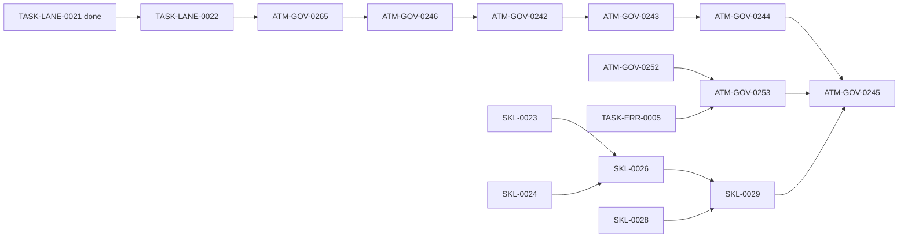

# Plan 3.1 Captain handoff — Deep Module hardening

Date: 2026-07-25

Planning authority: `C:/Users/User/3KLife/docs/ai_atomic_framework`

Target authority: `C:/Users/User/AI-Atomic-Framework`

Primary plan: `governance-optimization/end-to-end-auto-batch-performance-plan-v3.md`

## Owner objective

Plan 3.1 must prove, with command-backed data, that two independent captains
can safely complete high-coupling work on one canonical worktree without
step-by-step human arbitration. A correct freeze is not sufficient: bounded
disjoint work must reach canonical admission, mutation, publication, and close
with zero borrowed authority, zero ownerless WIP, zero manual lock deletion,
zero post-close hygiene conversation, and zero unarchived release receipt.

## Planning decision

The 2026-07-25 `atm-deep-module-refactor` scan found five high-value seams:

| Priority | Seam | Planning owner | Review fingerprint |
|---|---|---|---|
| P0 security | mutation authority + WIP ownership | `TASK-LANE-0022` | `deep-module-review:300bfd3e` |
| P0 liveness | branch commit coordinator | `ATM-GOV-0265` | `deep-module-review:2154f107` |
| P0 liveness | sealed runner publication | `ATM-GOV-0265` | `deep-module-review:2797aed9` |
| P0 consistency | task close saga | existing `ATM-GOV-0253` | `deep-module-review:b0331fea` |
| P1 correctness | validation execution contract | existing `TASK-SKL-0026/0029` | `deep-module-review:7144d296` |
| P1 maintainability | skill corpus projection | existing `TASK-SKL-0028` | `deep-module-review:52470e9f`, `deep-module-review:52b3cbe6` |

Only two cards were added. Lane authority and WIP continuity are one complete
lane vertical slice. Branch finalization and runner publication remain two
internal deep modules but share one end-to-end delivery card. We intentionally
did not create separate lock, cleanup, receipt, adapter, fixture, or migration
cards.

## Authoritative execution order

1. Start `TASK-LANE-0022`. SKL 0023/0024/0026 may proceed in parallel when
   their own dependencies are ready.
2. After 0022, start `ATM-GOV-0265`. SKL 0028 may proceed in parallel.
3. `ATM-GOV-0253` may start when 0252 and ERR-0005 are done, but do not run its
   taskflow writes concurrently with 0265.
4. Start 0246 only after 0265 and its existing evidence prerequisites pass.
5. Run 0242 → 0243 → 0244 → 0245. Do not restore redundant transitive
   dependencies to 0242 or 0245.

## Required use of `atm-deep-module-refactor`

Every unfinished refactor card touched by this update explicitly requires the
skill before implementation. The captain must:

1. load the installed `atm-deep-module-refactor` skill;
2. review the named seam and all production call sites;
3. seal a provider-neutral receipt containing interface, ports, state owner,
   adapter inventory, duplicated-policy deletion test, rollback boundary, and
   fingerprint;
4. implement against that receipt;
5. still run the task card validators and command-backed evidence.

The skill is replaceable. Planning depends on the review receipt schema and
fingerprint, not on Matt Pocock, a model vendor, or one installed projection.

## Dependency rules for the next captain

- A hard edge means the downstream card cannot implement its public seam
  correctly without the upstream capability.
- Regression examples and historical card evidence are acceptance inputs, not
  hard scheduling edges.
- Final-verdict source discovery must fail closed when evidence is absent; it
  must not duplicate every evidence producer in `depends_on`.
- A local ignore, staging, scope, adapter, or manifest problem is not a reason
  to split an essential deliverable into another card. Use governed scope
  amendment or repair the admission path.
- Do not edit done cards such as SKL-0019. Follow-up behavior belongs in the
  closest planned card (SKL-0028 in this case).

## Locked counterexamples

- A captain could previously reuse another worker's actor/lease/ticket context.
- `tasks release` could turn valid task WIP into unowned dirty that neither the
  original worker nor the next worker could reclaim (`ATM-BUG-2026-07-22-229`).
- A commit process killed before HEAD moved left a branch queue lock that ATM
  could not self-recover.
- Successful close repeatedly required framework-temp release publication and
  left runner receipts as advisory/untracked residue.
- Validator commands could exit zero without executing declared assertions,
  while cards routinely ran repository-wide validators unrelated to the
  causal impact.
- Required skill templates could disappear from projections because local Git
  ignore state influenced delivery.

All six counterexamples must remain named regressions in their owning cards and
must be visible in 0246/0245 evidence.

## Files intentionally updated

- Plan 3.1 primary plan and this handoff.
- New `TASK-LANE-0022` and `ATM-GOV-0265`.
- Existing planned cards: 0253, 0246, 0242, 0245.
- SKL validator plan and existing planned cards: 0026, 0028, 0029.
- SKL-0019 and all done task cards remain unchanged.

## First command for the next captain

Run a read-only preflight of `TASK-LANE-0022`, confirm its planning seal and
dependencies, then dispatch it to a high-capability captain. Stop only for a
real card/scope/authority defect; ordinary executable ATM recovery should be
followed autonomously.
