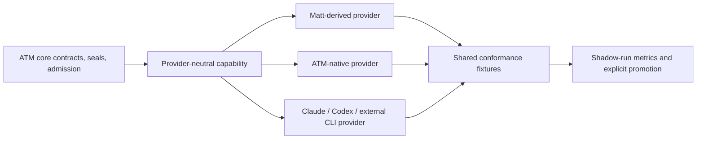
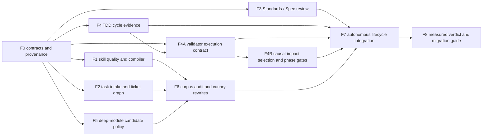

# ATM × Matt Pocock Skills Initiative Handoff — 2026-07-24

## Execution-plan promotion

This handoff has been promoted into the registered SKL execution plan:

`skl-tool-first-upgrade/SKL-validator-governance-test-case-catalog-plan.md`

The SKL plan and its `TASK-SKL-0018` through `TASK-SKL-0030` source cards are
the execution authority. This document remains the upstream research,
provider-replaceability, and coordination rationale. If wording diverges, the
registered SKL plan and sealed task cards govern implementation.

## Handoff outcome

This initiative may run in a separate Codex conversation in parallel with ATM
Plan 3.1. Its purpose is to improve ATM skill architecture, task authoring,
TDD, review, and refactoring by adapting selected methods from Matt Pocock's
open-source skills.

The initiative must not copy an external prompt bundle into ATM core or create
a second task, review, approval, or evidence model. ATM owns stable contracts,
seals, admission rules, and deterministic validation. Matt-derived workflows
are the first replaceable provider implementation of those contracts.

The Plan 3.1 captain remains integration authority. The initiative captain owns
its bounded plan and implementation cards, while the Plan 3.1 captain monitors
dependency edges, shared-file conflicts, evidence, and final autonomous
development claims.

## Authority and repository boundary

| Authority | Canonical location | Rule |
|---|---|---|
| Planning | `C:/Users/User/3KLife/docs/ai_atomic_framework` | Initiative plan, source task cards, decisions, and this handoff live here. |
| Target | `C:/Users/User/AI-Atomic-Framework` | ATM contracts, templates, compiler, adapters, validators, plugins, CLI, and imported ATM ledger records live here. |
| Closure | Target task ledger plus planning closeback | A card is complete only through ATM taskflow closure and cross-authority closeback. |

Future source cards must be created through `atm-plan-authoring` and
`atm-task-card-authoring`, then imported into the target with the ATM CLI. This
handoff is not a parallel task registry and does not assign task IDs. The
initiative captain must survey registered planning families before opening
cards and reuse the closest legal family.

## Upstream source seal and provenance

- Upstream repository: <https://github.com/mattpocock/skills>
- Reviewed commit: `ed37663cc5fbef691ddfecd080dff42f7e7e350d`
- License at reviewed commit: MIT, copyright Matt Pocock, 2026
- Adoption mode: concepts and provider adapters, not an untracked textual fork
- Required provenance for every derived provider:
  `providerId`, version, upstream URL, upstream commit, source digest, license,
  capabilities, supported ATM contract versions, and fallback policy

Primary reviewed sources:

- `productivity/writing-great-skills`
- `productivity/grilling`, `grill-me`, and `batch-grill-me`
- `engineering/to-tickets`
- `engineering/tdd`
- `engineering/code-review`
- `engineering/codebase-design`
- `engineering/improve-codebase-architecture`
- `engineering/diagnosing-bugs`
- supporting `handoff`, `implement`, `wayfinder`, `to-spec`, `prototype`, and
  Design It Twice references

## Why this is an independent initiative

The work has a coherent architecture and evaluation surface distinct from the
Plan 3.1 broker/provenance chain. Early work can safely concentrate on skill
schemas, source templates, compiler projection, review provider contracts, and
authoring analysis while Plan 3.1 continues.

The initiative is not completely independent. Changes to task import,
dependency gates, evidence lifecycle, `next` playbooks, `taskflow pre-close`,
Git hooks, release mirrors, or shared generated outputs may intersect active
Plan 3.1 cards. Those changes require an ATM claim and Broker admission before
editing. A separate conversation is not an isolation mechanism; both
initiatives still use the same canonical worktree, base, and HEAD under
`INV-ATM-010`.

## Baseline codebase findings

### Skill architecture

- ATM currently has 20 source skill templates, approximately 2,869 lines and
  118,825 characters.
- The largest high-frequency templates are `atm-governance-router`,
  `atm-dispatch`, `atm-task-card-authoring`, `atm-next`, and
  `atm-framework-temp-claim`.
- `templates/skills/skill.schema.json` does not model invocation mode,
  completion criteria, progressive-disclosure references, context budget, or
  provider provenance.
- `packages/integrations-core/src/compiler/skill-templates.ts` projects
  template summaries into adapter descriptions without a portable
  user/model/router invocation contract.
- `scripts/validate-skill-templates.ts` validates structure, required terms,
  Charter injection, and adapter parity, but not branch completion,
  unnecessary context load, duplicated policy prose, no-op steps, or
  invocation precision.
- Installed skill copies are derived artifacts. Source templates remain the
  only editable source of truth.
- Existing conversation skill-review and skill-amendment contracts can support
  evidence-driven rewrites, but they do not yet provide the complete quality
  contract required by this initiative.

### Task authoring and TDD

- Current task records contain overlapping `validators`, `testPlan`, and
  `acceptanceEvidence` concepts.
- `scopePaths` and `deliverables` are different and must remain separate:
  write authority ceiling versus completion floor.
- ATM already enforces hard dependency closure, but authoring does not yet
  distinguish hard causal edges from typed non-task start conditions.
- ATM requires validators to be declared and later pass, but the normal
  playbook remains `implement → validators → evidence`. It does not prove a
  red-before-green TDD cycle.

### Review and refactoring

- `packages/plugin-review-advisory` already provides replaceable
  `stub`, `agent-bridge`, and `external-cli` provider seams.
- Review advisory is not yet bound to task/delivery digests or consumed by
  taskflow pre-close.
- `atm-atom-map-refactor` already offers Policy Object, Strategy Map, Result
  Contract, Facade, and Adapter/Port patterns, but current triggering is still
  too line-count-oriented to represent deep-module leverage.

## Non-negotiable architecture



ATM task cards and lifecycle code declare capabilities, not skill names. For
example, a card may require `standards-spec-review.v1`; it must not require
`matt-pocock/code-review`.

ATM core owns only:

- input/output schemas;
- stable rule and finding IDs;
- source and candidate seals;
- evidence receipts;
- risk/admission policy;
- deterministic conformance and freshness checks.

Provider-owned content includes:

- prompts and questioning style;
- model choice and transport;
- analysis strategy;
- optional reference text;
- presentation details.

A provider upgrade or replacement must not require migration of existing task
cards, claims, evidence, or close semantics.

## Proposed workstreams and dependency order



### F0 — Provider-neutral foundation

Define versioned capability and provider manifests, provenance, compatibility,
fallback, shadow-run, promotion, and conformance-fixture rules. No external
skill text enters ATM core.

### F1 — Skill definition and quality

Introduce an `atm.skillDefinition.vNext`-style contract with:

- `invocationMode: model | user | router`;
- trigger branches;
- typed completion criteria;
- progressive-disclosure reference pointers;
- quality/context profile;
- adapter capability and fallback policy.

Extend template enumeration, compiler projection, and validation. Unsupported
adapter invocation controls must emit an explicit degradation warning rather
than silently claiming parity.

### F2 — Task intake and ticket graph

Refactor task authoring from first principles around:

- identity;
- authority;
- outcome;
- execution contract;
- dependency contract.

Preserve `writeScope` and `deliverables` separately and enforce
`deliverables ⊆ writeScope`. Converge `validators`, `testPlan`, and
`acceptanceEvidence` toward one typed verification contract through a
versioned migration.

Use a replaceable intake strategy:

```text
facts scan
→ readiness gaps
→ currently unblocked human decision frontier
→ recommended options and defaults
→ sealed decision summary
→ spec and task DAG
```

Only hard causal blockers belong in `depends_on`. Non-task prerequisites use
typed `startConditions`. Reverse successors and current parallel frontier are
derived from the DAG plus Broker resource overlap; they are not duplicated in
every card.

### F3 — Standards / Spec review

Extend the existing ReviewAdvisory provider contract instead of building a
second review system.

- Standards axis: AtomicCharter, ATM invariants, repository rules, and relevant
  canonical skill contracts.
- Spec axis: sealed task acceptance, deliverables, verification, backlog links,
  scope amendments, and approved waivers.
- Bind the report to task, sealed base, candidate digest, standards digest,
  spec digest, findings, disposition, provider, and provider version.

Run semantic review once after focused red/green slices are stable and before
full validators. If the candidate digest changes, the receipt becomes stale
and review runs again. Pre-close verifies seal freshness and finding
disposition; it does not spend tokens repeating the same semantic review.

### F4 — TDD evidence

Add a policy such as:

```text
tddMode: required | recommended | not-applicable
```

Bug fixes, new behavior, and governance gates default to required. Documentation
and proven mechanical transformations may use a reasoned exemption.

Define an `atm.tddCycle.v1`-style receipt that binds acceptance ID, public seam,
test path/digest, sealed baseline, expected red predicate, green result,
implementation candidate, and runner identity. A syntax error, environment
failure, or unrelated non-zero exit must not count as red evidence.

Use one vertical red/green slice at a time rather than writing a large
horizontal test suite before any implementation.

### F4A — Causal verification and execution contract

Do not treat a validator as only a shell command whose exit code is evidence.
Extend the source authoring skill and task-card template so every validator
declares a versioned execution contract containing:

- stable validator/capability ID and provider adapter;
- acceptance IDs, changed public seams, and causal impact edges covered;
- phase (`red`, `green`, `candidate`, `pre-close`, or `release`);
- responsibility (`task-required`, `phase-suite`, or `advisory`);
- ownership kind (`task-local` or `integration-group`) and immutable group/version
  reference when externally owned;
- command/runner, expected outcome, structured result schema, and timeout;
- minimum executed cases/assertions, including negative-control expectations;
- test, candidate, base, runner, and build digests;
- unavailable/fallback policy and estimated cost.

The task authoring skill must begin from the behavior changed by the card, then
derive the smallest causal impact cone across actual callers, consumers,
schemas, adapters, or shared contracts. A task-required validator is permitted
only when it proves an acceptance criterion or a concrete edge in that impact
cone. Cross-module integration tests are required when the changed behavior
crosses that module boundary. Repository-wide suites, unrelated packages, and
"important just in case" checks are not task-required validators.

Separate test-case identity, physical grouping, contribution authority, and
execution requirements:

- a task-local behavior case uses a task namespace and may remain beside the
  feature when it proves only that feature's public behavior;
- a cross-card or cross-module case is created directly in a governed
  integration-test group, even when it is designed by the feature card as part
  of its TDD red phase;
- one feature card may contribute multiple new case IDs and may also reference
  existing case IDs. No separate maintenance card is required merely because
  the tests are stored in a shared integration group;
- the card declares a bounded shared-test contribution intent. ATM projects it
  through the existing write-scope/Broker authority as a group resource key and
  serializes or composes concurrent contributions. This must not become a
  second permission model;
- running a case grants no edit authority. Editing the shared group requires
  the card's declared contribution intent and admitted Broker ticket.

Use readable, deterministic, non-sequential IDs:

```text
test_int_<group>_<semantic-key>_<digest8>
test_task_<task-id>_<semantic-key>_<digest8>
```

Examples:

```text
test_int_runner_sync_actor_continuity_8f3a2c1d
test_task_atm_gov_0101_reject_stale_receipt_42d91abe
```

`int` identifies a reusable integration/system case; `task` identifies a
task-local acceptance case. The digest is derived from the normalized namespace
and semantic key, not from mutable implementation content. Do not use a global
sequential allocator. If a task-local case later becomes shared, create the
integration ID and retain an immutable alias/lineage record so historical
receipts remain valid.

Each integration group owns a registry shard. A generated central index checks
global uniqueness, references, duplicate semantic keys, aliases, and orphaned
cases but is not the write authority or ID allocator. This preserves
decentralized contribution while keeping one queryable catalog.

The task contract therefore contains:

- `testContributions[]`: new/updated case ID, target group, semantic key,
  coverage, expected red predicate, and bounded contribution resource key;
- `requiredTestCaseIds[]`: existing or newly contributed cases that must produce
  fresh receipts for this candidate;
- `phaseTestCaseIds[]` and `advisoryTestCaseIds[]`: referenced without becoming
  task-close evidence.

The TDD sequence is contribution admission → red receipt for the exact case ID
→ implementation → green receipt for the same case ID/test digest → close.

The authoring skill is the source-quality entry, but it is not the authority.
Task import rejects uncovered acceptance criteria or required impact edges; the
evidence runner emits a structured receipt; pre-close rejects zero executed
cases, missing assertions, stale candidate/test digests, or missing
task-required results. ATM's receipt/schema/freshness checks are small platform
integrity gates and must not be represented as product regression tests.
Advisory and phase-suite results never satisfy a card's acceptance criteria.

A direct command that only imports helpers or prints a banner must fail the
contract unless it reports valid structured execution counts. A meta-validator
must prove this by running an intentionally no-op fixture and an intentionally
broken fixture. This closes the observed false-green class where a module
exports a test function but the declared command never invokes it.

### F4B — Causal-impact selection and phase gates

Replace the implicit "run everything per card" policy with three responsibility
classes:

1. `task-required`: direct behavior tests plus integration tests for concrete
   affected edges in the causal impact cone;
2. `phase-suite`: broader type, schema, CLI, compatibility, release, and
   regression suites owned by a batch, milestone, release, or plan checkpoint;
3. `advisory`: diagnostic only and never closure-satisfying.

The selector must cover every acceptance ID and every declared impact edge
without adding unrelated tests. It records selected and omitted validators with
deterministic causal reasons, impact inputs, cache keys, invalidation causes,
queue wait, runtime, and fallbacks. A high risk label may deepen tests inside
the proven impact cone, but it must not expand the cone without a dependency,
contract, resource-key, or observed-failure edge.

Integration groups are first-class governed assets with a stable group ID,
registry shard, maintainers, theme, member case IDs, supported seams,
dependency/resource keys, version digest, execution cost, and checkpoint
policy. Typical themes include shared-write lifecycle, actor continuity,
runner-sync publication, task closeout, and adapter parity. Cards contribute
through Broker-authorized group resource keys and select cases by ID; they do
not copy commands or create private duplicates.

If the selector cannot prove the boundary, the card must stop for impact-map or
scope clarification; it must not silently run the whole repository and call
that precision. A failure may reveal a new impact edge and amend the task's
required set. Unrelated full suites remain at the next phase checkpoint.
Package-level typecheck is task-required only when the changed seam is inside
that compilation boundary; repository-wide typecheck belongs to the phase suite
unless the repository cannot provide a narrower sound boundary.

Measure selected/available ratio, total wall time, p50/p95 runtime, cache hit
rate, queue wait, cases/assertions executed, failures caught by tier, false
blocks, escaped defects, and cost per acceptance. Thresholds are derived from a
baseline and replayed historical cards rather than hard-coded task exceptions.
The final proof compares the legacy all-run-per-card policy with causal
task-required selection plus scheduled phase suites on the same sealed
candidates. It may claim improvement only when card latency drops, phase suites
still detect broader regressions before promotion/release, and escaped defects
do not increase.

The receiving captain should create four governed card candidates:

1. authoring/template/schema migration for causal impact mapping and the typed
   validator contract, including case contributions and execution references;
2. structured execution receipt plus zero-test/no-op hard gate;
3. integration-group registry, causal selector, phase-suite scheduler, cache
   invalidation, and telemetry;
4. TDD/review lifecycle integration plus historical A/B replay proof covering
   both card latency and checkpoint defect detection.

Cards 1 and 2 are Plan 3.1 verdict prerequisites. Card 3 follows the contract
and receipt foundations; card 4 consumes all prior outputs. Parallel work is
allowed only where Broker resource overlap and declared file scope permit it.

### F5 — Deep-module and refactoring policy

Adapt `codebase-design` vocabulary and `improve-codebase-architecture` scanning
into the existing ATM atom/map refactor route.

Trigger candidates from observed evidence such as repeated bugs, shotgun
changes, duplicated policy, private-internal test access, caller complexity,
or the absence of a usable test seam. File length is an advisory signal, not
the definition of module depth.

The target shape is a deep external interface backed by small internal atoms.
An urgent bug task performs the smallest generalized repair; a broader
deepening refactor becomes a governed follow-up unless it is strictly required
to create the test seam.

### F6 — Corpus audit and canary rewrites

Audit every source and installed skill with one of:

`keep / prune / disclose / split / merge / retire / replace`.

Do not perform one blind bulk rewrite. Start with the high-frequency red zone:

1. `atm-governance-router`
2. `atm-dispatch`
3. `atm-task-card-authoring`
4. `atm-next`
5. `atm-framework-temp-claim`

Each wave must recompile supported adapters, compare before/after route
fixtures, and retain a rollback path.

### F7 — Autonomous lifecycle integration

Integrate only the sealed outputs required by ATM lifecycle:

- authoring readiness;
- TDD-cycle policy;
- candidate review freshness;
- final validator evidence;
- pre-close deterministic verification.

Do not make a language-model review more authoritative than deterministic
validators or the AtomicCharter.

### F8 — Measured verdict

The initiative is not complete because prompts look shorter. It must report:

- model/user/router invocation precision and false-invocation rate;
- description and branch-specific context tokens;
- completion-criterion coverage;
- follow-up questions and premature stops;
- autonomous task completion without captain repair;
- review finding precision and stale-receipt detection;
- valid red/green pairing and false-red rejection;
- validator acceptance/impact-edge coverage and zero-test/no-op rejection;
- integration-group reuse, contribution provenance, Broker serialization, and
  unauthorized-edit rejection;
- selected/available validator ratio, runtime p50/p95, and queue wait;
- causal selection precision, phase-suite detection, false blocks, and
  escaped-defect delta;
- cache-hit/invalidation correctness and cost per acceptance;
- provider-swap conformance parity;
- adapter projection parity;
- before/after replay regressions.

## Relationship to Plan 3.1

The two initiatives may proceed in parallel under these rules:

- Plan 3.1 remains authority for broker tickets, sealed source, actor
  continuity, transactional shared writes, and the final high-coupling
  parallel-development proof.
- This initiative owns provider-neutral skill quality, authoring strategy,
  review strategy, TDD-cycle evidence, and deep-module guidance.
- Plan 3.1 must consume only stable capability contracts, never depend on the
  Matt-derived provider by name.
- The Plan 3.1 final verdict may not claim fully autonomous AI execution if its
  required skill/review evidence is unavailable or stale.
- Full corpus rewriting may continue beyond Plan 3.1, but the minimum skill
  quality contract, canary routing proof, and replaceable review receipt should
  be available before Plan 3.1's final autonomous verdict.

## Parallel development and shared-surface policy

Read-only audits, provider prompt work, planning documents, and isolated
conformance fixtures can proceed immediately.

Before writing target code, the initiative captain must inspect active claims
and declare exact resource intent. In particular:

- template/schema/compiler work may be separated from current broker-core work;
- task import, evidence, `next` playbook, pre-close, Git hook, generated adapter,
  build, and release surfaces are likely shared and require Broker admission;
- no worker may clean, stash, restore, or absorb foreign dirty state;
- shared commits, runner-sync, release mirrors, and generated projections must
  receive Broker/steward tickets under `INV-ATM-008`;
- no branch, detached worktree, alternate index, merge, or rebase may be used as
  normal isolation.

At handoff creation, `ATM-GOV-0250` has active shared-write provenance work in
the target repository. The initiative must not edit its owned broker/hook files
until ATM admits a compatible proposal or the claim is closed/released.

## Stop rules

Stop and report only when:

- planning authority, source task family, or target scope cannot be resolved;
- ATM returns a blocker without governed recovery;
- the proposed change would create a second task/review/evidence model;
- a provider-specific assumption would enter ATM core control flow;
- a migration would silently reinterpret existing task cards or evidence;
- Broker reports a true logical conflict, unsupported adapter, stale CAS, or
  fairness-bound queue;
- a deterministic conformance fixture cannot distinguish safe replacement from
  semantic drift.

Do not stop for routine scope amendment, fresh evidence, adapter regeneration,
or documented runner-sync steps when ATM provides a governed command and the
action remains within the claimed card.

## Captain coordination contract

The initiative should use a separate Codex conversation with its own actor
identity and task claims. The Plan 3.1 captain may inspect that conversation
when the task is accessible in the Codex app, but chat history is not durable
governance state and must not become the only coordination channel.

At each milestone, the initiative captain writes a compact checkpoint containing:

- active/completed cards and dependencies;
- changed capability contracts;
- target paths and Broker/shared-write state;
- measured before/after results;
- findings requiring Plan 3.1 integration;
- backlog items and stop conditions;
- commit and close evidence.

The Plan 3.1 captain reads milestone checkpoints or compact thread updates,
not the full conversation by default. It may inspect the full thread when
arbitrating a conflict, changing shared contracts, or validating the final
verdict.

## First actions for the receiving captain

1. Read this handoff and the current Plan 3.1 handoff; do not edit Plan 3.1
   source cards.
2. Set a new explicit actor identity for the new conversation.
3. Run:

   ```bash
   node atm.mjs next --prompt "建立 ATM × Matt Pocock Skills 獨立 initiative：先做唯讀現況驗證、規劃合法 task family 與 provider-neutral workstreams，不修改 active Plan3.1 scope" --json
   ```

4. Read `evidence.nextAction.playbook`.
5. Perform a read-only dependency/scope audit and compare it with this handoff.
6. Draft the initiative plan and source task cards in the external planning
   authority using ATM authoring skills.
   The first card wave must include F4A contract/gate and F4B causal selector
   plus phase-suite work; do not encode validators as untyped shell strings or
   make unrelated full suites card-close requirements. A feature card may
   contribute multiple cross-card/cross-module cases directly to a governed
   integration group during TDD, but the shared write must be declared and
   Broker-admitted, and execution must reference exact case IDs.
7. Return to the owner before importing cards only if the proposed plan changes
   the Plan 3.1 final verdict, creates a new task family, or cannot avoid an
   active shared-code conflict.
8. Once the plan is approved, import and execute only ATM-admitted queue heads.

## Initial acceptance for the initiative plan

The receiving captain's plan is ready for approval only if:

- provider replaceability is explicit and fixture-tested;
- workstreams have hard dependencies and derive their parallel frontier;
- Plan 3.1 shared surfaces and integration checkpoints are named;
- no external skill name appears as a core runtime dependency;
- every workstream has observable success metrics and rollback;
- source-template SSOT and all supported adapter projections are covered;
- TDD and review receipts are sealed to the same candidate/base semantics used
  by ATM rather than chat order or Git branches;
- validator declarations are typed execution contracts with acceptance mapping,
  non-zero execution proof, freshness seals, and explicit cost/activation data;
- task-required, phase-suite, and advisory responsibilities have deterministic
  causal selection and omission reasons;
- case identity, group storage, contribution authority, and execution
  requirements are separate: feature cards can contribute cases through a
  bounded Broker ticket and require exact sealed case IDs;
- cross-module integration tests are task-required only for affected edges,
  while unrelated broad suites run at governed phase checkpoints;
- historical A/B replay proves reduced card latency without increased escaped
  defects or lost checkpoint detection, and non-task validators cannot satisfy
  card closure;
- the full-skill rewrite is divided into measurable canary waves.

## Keep-memory write

None. The durable method and coordination contract are contained in this
handoff; incident-specific defects remain in backlog/task evidence.
