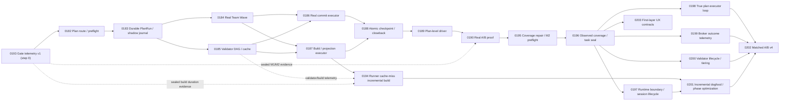

# ATM 端到端自動併批與效能證明計畫 2.0

狀態更新：2026-07-19（Captain review 修訂：wave commit 紀律、分歧復原通路、plan digest pin、token 量測契約、baseline 自我採樣、lane attribution、原子化出口）
狀態更新（儀表先行整合版）：2026-07-19（ATM-GOV-0193 為依賴圖第 0 步；採 gitignored runtime scratch/log → closure seal → digest-only history 二層儀表；0182-0190 各卡明載 producer/consumer 契約、M1/M2 可比 cohort 與遙測自我裁汰，形成「以戰養戰」閉環；所有 raw statistics、counter、per-run log、debug log、high-frequency receipt stream 均留硬碟，不進 Git）
狀態更新（證據修復擴充版）：2026-07-19（0182-0195 的交付物已存在，但現場資料只有 `next.route-resolution` 事件、沒有逐卡 `atm.gateTelemetryTaskSummary.v1`、沒有可配對 control/treatment、broker correctness 樣本為零，既有 M2 verdict 因此維持 `inconclusive`。新增 0196-0203 兩個 wave：先把 observed/sealed/consumed 證據鏈與真 executor 補齊，再用真實 dogfood、paired A/B 與 UX 修復收官；任何後卡都必須讀前卡 sealed summary，數據反證原假設時可合法停卡並提請 owner 修訂計畫。）
前版計畫：[ATM 端到端自動併批與效能證明計畫](./end-to-end-auto-batch-performance-plan.md)
Planning 權威來源：`C:/Users/User/3KLife`
Target 權威來源：`C:/Users/User/AI-Atomic-Framework`
閉卡權威來源：target repo ATM ledger

## 摘要

1.0 已完成安全契約與 pure planner，但尚未完成真正的一條龍執行：

- `team wave dispatch` 目前只寫 runtime record，沒有啟動並管理整個 wave。
- `broker batch execute` 目前建立 plan/receipt，沒有真正執行 commit、build 或 projection。
- `checkpoint-readiness` 只判斷證據是否齊全，沒有 fan-out 原子閉卡。
- 既有 serial/manual lane 沒有 durable broker ticket 與 lane event 的 shadow instrumentation，導致真實 ledger 沒有足夠事件，0179 的 verdict 永遠容易停在 `inconclusive`。
- 0179 focused test 使用合成 broker tickets；現行 analyzer 未比較 serial/treatment makespan 或 throughput，只靠 ticket batchRate 與 generated-write counts 就可能誤判 `improved`。
- `atm next` 無法穩定辨識 plan-level continuation，仍可能要求在已完成單卡間二選一。
- 治理閘門（pre-commit 的基礎 predicates 與動態 findings、doctor 的固定/模式式 checks、pre-push、guard）沒有一致的持久化執行/攔截紀錄：failureEnvelope 不落盤、無 per-check 延遲數據；check 數量會隨模式與動態 findings 改變，不再把 20/25 當規格常數。「哪些檢查有效、哪些是儀式」在結構上不可證明，fail-fast 重排與檢查裁汰因此失去數據基礎（2026-07-19 閘門稽核結論）。
- 實際 0168-0179 dogfood 仍要人工逐卡處理 planning 對齊、claim/close、validator、runner-sync、release artifact、跨 repo commit 與 push，約耗時 3 小時與 284 萬 tokens（量測口徑：單一 coordinator 對話 session 的累計 usage，含探索與重試；此數字是 0190 serial baseline 的錨點之一，引用時必須連同口徑一起引用）。

2.0 不建立第四套 batch 系統，正式產品模型仍為：

```text
Batch 選卡 -> Team Wave 做卡 -> Broker 併寫 -> Checkpoint 閉卡
```

2.0 同時把效能證明設計成計畫內部自我閉環：0183 落地 shadow instrumentation 之後，0184-0190 每張卡自身的施工過程就是被完整量測的真實 serial baseline 樣本（詳見 0183/0190），不需要額外等待外部流量。

2.0 進一步把量測義務提前到全計畫第 0 步（以戰養戰）：0193 先落地治理閘門遙測基座（gate telemetry v1，涵蓋 hook/doctor/guard/next/preflight/tasks import/claim/close/handoff/taskflow/evidence/git governance/batch/broker/team/runner-sync/telemetry/analyzer 全部 ATM 治理節點），使 0182 起每一張卡的施工都累積 per-check 遙測；0185 收口後封存數據 v1.0（M1 baseline cohort）並授權依證據提早優化，0186-0190 的可比施工窗與 treatment runs 形成數據 v2.0（M2 matched cohort，由 0190 analyzer 收斂）。量測不是附屬品，而是每張卡的正式輸入、輸出與收口證據。所有 validation unit 必須同時累積 invocation/skipped/duration/failure/blocking/fan-out/downstream-consumption 計數；少用但必要者降到 full，長期未用且無攔截/決策產出者標 archive-candidate，避免 default validation 隨任務卡越跑越久。

唯一正式入口預計為：

```shell
node atm.mjs batch execute-plan \
  --plan C:/Users/User/3KLife/docs/ai_atomic_framework/governance-optimization/end-to-end-auto-batch-performance-plan-v2.md \
  --actor <actor-id> \
  --executor auto \
  --push \
  --json
```

`--executor auto` 優先使用通過 preflight 的 Team provider，也可消費 editor/subagent worker report；沒有合法 executor 時 fail closed，不偷偷降級成無人追蹤的手工作業。commit 由 executor 自動完成，push 必須明確帶 `--push`。

## 權威與文件

- `planning_repo_root`: `C:/Users/User/3KLife`
- `planning_repo_is_external_to_target`: `true`
- `target_repo_root`: `C:/Users/User/AI-Atomic-Framework`
- `source_plan_path`: `docs/ai_atomic_framework/governance-optimization/end-to-end-auto-batch-performance-plan-v2.md`
- `source_task_card_path`: `docs/ai_atomic_framework/governance-optimization/tasks/ATM-GOV-0193-*.task.md`、`ATM-GOV-0182..0190-*.task.md`、`ATM-GOV-0194..0195-*.task.md` 與 `ATM-GOV-0196..0203-*.task.md`
- `target_import_method`: executor 內部透過既有 task import/taskflow orchestration 匯入；禁止直接編輯 `.atm/history/**`。

Target ATM ledger 與 `node atm.mjs tasks audit --json` 是任務狀態、編號與閉卡事實的權威來源；本文的任務編號與對照表只是 planning snapshot，不得反向覆蓋 ledger。每張卡開卡前必須同時：

1. 在 target 執行 `node atm.mjs tasks audit --json`。
2. 以 Node.js UTF-8 helper 掃描 planning `governance-optimization/tasks/` 的實際檔名與 task id。
3. 確認 planning source 與 target ledger 都未占用後才配置 ID。

2026-07-19 盤點時 `ATM-GOV-0182` 到 `ATM-GOV-0190` 均未占用。ErrorCode 兩張卡雖已改編為 `TASK-ERR-0001` 與 `TASK-TMP-0001`（bb4de4f0），但 planning runtime 仍保留 `ATM-GOV-0191` close event，兩個 repo 的 Git 歷史也已有 0191 delivery/closure；依「歷史曾占用即不得混用新語意」原則，0191 不視為乾淨空號。遙測基座配置 `ATM-GOV-0193`；0193 在正式 ledger 無既有 task，只曾作為本計畫的暫定編號。若正式 import 前 ID 狀態改變，停止並重新配置，不覆寫歷史事件。

## 公開介面

### BatchRun 與 plan execution journal

- `atm.batchRun.v1` 升級為向下相容的 `specVersion: 0.2.0`，增加 `planRef`、`planDigest`、planning/target repo、wave history、current phase、executor/push policy、metrics、reconciliation state，以及 `coordinatorLaneSessionId`。
- `planDigest` 在 run 建立時 pin 住，之後不隨 plan 文件變動。resume 判定規則：
  - 重跑且當前文件 digest 等於 pinned digest -> 自動 resume，不建立重複 run、ticket、commit 或 close event。
  - 當前文件 digest 不等於 pinned digest（plan 文件在 run 進行中被修改，例如 ID 平移快照更新）-> 拒絕自動 resume，要求明確 `--batch <id>` 加 `--accept-plan-change`；接受後把新 digest 記為 amendment event（保留舊 digest 供追溯），已存在的 ticket/commit/close 冪等鍵不得重置。
  - 禁止任何情況下因 digest 不符而靜默建立第二個 run。
- 新增 append-only `atm.planExecutionEvent.v1` 作為證據流，不建立第二套任務模型。每筆 event 必須帶 `batchId`、`waveId`、`taskId`（若適用）、`actorId`、`laneSessionId`、`coordinatorLaneSessionId`、phase、timing、retry 與 side-effect digest。
- `atm.planExecutionEvent.v1` 同時是 token/cost 量測的唯一載體：event 含 `tokenUsage`（`inputTokens`、`outputTokens`、`provider`、`source`）欄位。provider/editor executor 必須回填實際 usage（由 provider usage report 取得）；本機 lane 無遙測時記 `source: unavailable`，視為缺樣本，不得以 0 或估計值充數。
- `batch execute-plan --dry-run` 只輸出完整 phase plan，不建立 run。

### Wave 與 lane session 全鏈 stamping

- `atm.waveManifest.v1.tasks[]` 每個 member 增加 `laneSessionId`，manifest 本身增加 `coordinatorLaneSessionId`。
- `WaveBrokerTicket` 增加 member `laneSessionId` 與 `coordinatorLaneSessionId`；所有 ticket transition 保留兩者，讓 analyzer 不靠 actor 名稱猜 lane。
- `atm.teamWaveRuntime.v1`、worker report、shared write/generated write/checkpoint receipts 都要保留相同 lane stamps。
- lane id 必須複用 0167/0168 已落地的 lane session、D6 ownership comparison、TTL sweep 與 adopt/takeover；不得另造 wave-only lane registry。
- Wave attribution 權威規則：wave 的 shared commit 由 coordinator lane 執行，member claims 蓋的是各 worker lane——這是設計而非違規。manifest 同時載明 coordinator 與全部 member lanes 即構成相互 acknowledgment；pre-commit lane 檢查（`ATM_COMMIT_LANE_MISMATCH`）在「commit lane = manifest coordinatorLaneSessionId 且 claim lane ∈ manifest member lanes」時必須視為 acknowledged、不發 warn，避免每顆 wave commit 觸發逐卡告警淹沒真警報。manifest 之外的 lane 不適用此豁免。

### 真正 shared-write receipts

- `atm.sharedWriteReceipt.v1` 成功時必須含真實非空 `commitSha`、實際 commit file slices、temporary-index digest 與 lane stamps。
- `atm.waveGeneratedWriteReceipt.v1` 必須來自真正執行的 build/projection，包含 command、exit code、input/output digest、content-addressed skip 與 lane stamps。
- 新增 `atm.atomicWaveCheckpointReceipt.v1`，記錄各 member closure transition、target/planning commits、push refs、reconciliation state 與 coordinator lane。
- 新增 `atm.planPerformanceReport.v1`，統一輸出 speed、cost、safety、batching 與 observability 指標。

### Shadow instrumentation

既有 serial/manual lane 的 `tasks claim`、`taskflow close`、runner-sync/build admission 在不改變既有准入、exit code、排序或 side effect 的前提下，shadow 鑄造 durable observation ticket 與 lane event：

- `mode: shadow`，不得進入真正 scheduler queue 或改變 head ownership。
- ticket/event 必須帶真實 task、actor、lane、surface、wait start/end、decision 與 payload digest。
- instrumentation 失敗只能產生 observability warning，不得讓原本成功的 serial 操作失敗；資料 schema 驗證失敗仍需明確記錄。
- 這些事件是 0190 建立真實 serial baseline 的必要前置，不得用 fixture 事件替代。

### 治理閘門遙測（gate telemetry v1）

0193 交付、全計畫共用的閘門層儀表。與 shadow instrumentation 分工明確：gate telemetry 量「每一項治理檢查」（granularity = check），shadow instrumentation 量「生命週期操作的等待與佇列語義」（granularity = claim/close/runner-sync 操作）；兩者共用 correlation keys，analyzer 可直接 join，不得互相替代或重複記錄同一事實。節點覆蓋以「所有會做治理判斷、准入、拒絕、封存或自動副作用的 ATM command/path」為準；0193 必須交付 registry coverage report，列明每個節點是 `instrumented`、`read-only-summary`、`out-of-scope` 或 `not-yet-covered`，不得只用「全部節點」概括帶過。

- **第一層／runtime scratch**：各節點經單一 emit helper 把 `atm.gateTelemetry.v1` 事件寫入 `.atm/runtime/telemetry/gate-events/<runId>/<lane-or-process>.jsonl`；failure envelope 寫 `.atm/runtime/telemetry/rejections/` 並互相引用。這一層必須 gitignored、per-lane/process 分片、append-only，絕不可在 hook 或命令執行途中修改 tracked history。
- **第二層／digest-only history**：只在 task close、batch checkpoint 或明示 `atm telemetry seal` 時，以固定 watermark 封存本工作窗，但完整 JSONL/archive 仍保留在 gitignored `.atm/runtime/telemetry/**` 或本機 log store；Git-tracked `.atm/history/evidence/governance-telemetry/<windowId>.json` 只保存 compact digest、watermark、schema/version、source availability、aggregated counters、selected baseline snapshot 與決策引用。watermark 後的新事件留給下一個 seal，避免封存過程與寫入競爭；不得在 hook 或一般命令中把 raw event stream 寫入 tracked history。
- `atm telemetry report --json` 預設只讀 digest-only history；`--include-runtime` 僅供本機診斷與重算，不得把 raw runtime archive 當成 Git 證據提交。report 輸出 eligible 啟動數、result 分布、unique block、真陽性裁決狀態、duration p50/p95、證據讀回、遺失/丟棄事件與來源可用性；若需要抽樣佐證，僅提交去識別/去重後的小型 baseline snapshot。
- 事件最小欄位為 `specVersion,eventId,sequence,observedAt,gate,checkId,checkVersion,policyVersion,eligible,result,reasonClass,durationMs,actorId,runId,correlationId,laneSessionId?,taskId?,batchId?,waveId?,command,inputDigest,configDigest,source,redactionClass,failureEnvelopeRef?,evidenceReadRef?`。taxonomy 與 check identity 由 canonical registry 管理，節點不得自行發明近義 `checkId`。
- Broker 決策是必測治理節點，不得只記 ticket 結果。`atm.brokerDecisionTelemetry.v1` 併入同一 seal/report pipeline，最小欄位包含：`decisionId`、`decisionKind`（admit/queue/batch/compose/serialize/defer/reject-adopt-only）、`requestedFiles`、`parallelAdmissionAttempted`、`parallelAdmissionReason`、`conflictDetected`、`conflictSet`、`conflictAxis`（same-task/semantic-dependency/file-overlap/generated-surface/commit-window/release-runner/planning-closeback）、`resolver`、`composeCandidate`、`composeDecision`（compose/separate/unsafe/inconclusive）、`compositionGroupId`、`finalDisposition`、`waitedMs`、`sideEffectAllowed`、`safetyFallback`、`decisionLatencyMs`、`inputDigest`、`configDigest`、`outcomeRef`、`correctnessVerdict`（pending/correct/false-positive/false-negative/escaped-conflict/manual-overridden）與 `ownerReviewRef`。這些事件回答「是否先允許 AI 平行進入再判斷衝突」、「是否可 compose 一起寫檔」、「衝突解決是否正確」與「broker 是否真的降低等待」。
- 原始事件不可事後改寫。後續以 classification event 記錄 `resolutionRef`、`downstreamIncidentRef` 與 `adjudication`，據此判定 unique block 與 true positive；同一 correlation/reason 的重複檢查不得重複計功。
- Fail-open 鐵律：emit、seal 或 schema 驗證失敗只能產生 observability warning 並遞增 dropped/malformed counter，絕不可改變原命令 outcome、exit code、排序或副作用。
- 唯讀探索不上 write claim，但必須留下 lane presence/status 與 correlation；lane 可見性本身不得觸發 scheduler queue、HEAD、index、task lifecycle 或 registry 寫入。
- 與 `atm.planExecutionEvent.v1` 的 join 鍵為 `runId`、`laneSessionId`、`taskId`、`batchId`/`waveId` 與 `correlationId`。

### ErrorCode 治理契約

本計畫新增、重用、改名或退役任何 `ATM_*` ErrorCode 前，必須先使用
`atm-error-code-resolver` 的 authoring flow。Canonical source 固定為 target repo
`docs/governance/error-code-registry.json`；`docs/ERROR_CODES.md` 只能由
`npm run generate:error-codes` 產生，不得手改。

ErrorCode 只表達「命令失敗或需要 operator 採取 retry／批准／復原動作的穩定邊界」。
`paused`、`deferred`、`reconcile-required`、`inconclusive`、cache miss、成功入列與
queue position 都是狀態或 verdict，不得濫建 ErrorCode。每個代碼契約必須同時存在於
本文與負責卡，至少包含 code、reuse/register disposition、觸發條件、retryable、
human approval、recovery command、source owner、registry owner 與 focused tests。

為避免 0184/0185 與 0186/0187 因共同編輯單一 registry 而失去平行性，
`ATM-GOV-0183` 是本計畫唯一 shared registry owner：它一次登錄本表標示為
`register` 的新碼並重生文件；後續卡負責 emitter 與測試，不得各自重寫 registry。
若施工時發現新碼需求，必須先經 skill 回寫本文與該卡，再由 broker 安排 registry
amendment，不得在程式中臨時硬編碼未登錄代碼。

| 負責卡 | ErrorCode | disposition | 觸發與復原契約 |
|---|---|---|---|
| 0182 | `ATM_NEXT_TASK_SCOPE_NOT_FOUND` | reuse | plan 無法解析到合法 cards；修正/import planning scope 後重跑 `next --prompt` |
| 0182 | `ATM_NEXT_ACTIVE_TASK_DIVERGENCE_BLOCKED` | reuse | 候選 scope 與 foreign active WIP 相交；查 `tasks status`/`broker status` 後等待或 takeover |
| 0183 | `ATM_BATCH_PLAN_DIGEST_MISMATCH` | register | resume 的 plan digest 與 pinned digest 不符；指定既有 batch 並採合法 amendment/restart 路徑 |
| 0183 | `ATM_BATCH_RUN_EVENT_JOURNAL_INVALID` | register | journal event malformed、digest 或冪等鍵矛盾；停止 side effect，先 audit/repair journal |
| 0184 | `ATM_TEAM_RUN_INVALID`、`ATM_TEAM_WRITE_SCOPE_OUT_OF_BOUNDS`、`ATM_TEAM_LEASE_CONFLICT` | reuse | worker report/schema、scope 或 lane lease 不合法；修正 report/scope 或依法 adopt 後重試 |
| 0185 | `ATM_VALIDATOR_FAILED` | reuse | command-backed validator 真正失敗；cache miss/unsafe cache 僅 bypass，不報錯 |
| 0186 | `ATM_BATCH_FILE_CONFLICT`、`ATM_BROKER_BATCH_COMMIT_BLOCKED`、`ATM_GIT_RECORD_COMMIT_PAYLOAD_DROPPED` | reuse | sealed file/HEAD、broker admission 或 post-commit payload assertion 失敗 |
| 0187 | `ATM_BROKER_BATCH_GENERATED_BLOCKED`、`ATM_RUNNER_SYNC_RECEIPT_INVALID` | reuse | build/projection/runner receipt 無法證明 generated write |
| 0188 | `ATM_BATCH_WAVE_CHECKPOINT_BLOCKED` | reuse | member readiness 未齊；補足 receipt/evidence 後重跑 checkpoint |
| 0188 | `ATM_BATCH_PLANNING_CLOSEBACK_CONFLICT` | register | target 已完成但 planning CAS seal 不符；停在 reconcile-required，只修 planning side |
| 0189 | `ATM_BATCH_PUSH_DIVERGED` | register | fetch 後 remote 與本 run commits 分歧且不可安全 fast-forward；停止自動 push 並輸出協調命令 |
| 0189 | `ATM_BATCH_STATE_REPAIR_REQUIRED` | reuse | durable run state 無法安全 resume；執行明確 repair command 後重試 |
| 0190 | 無新 ErrorCode | none | `improved`/`inconclusive`/`regressed` 是 verdict，不是錯誤碼 |
| 0193 | 無新 ErrorCode | none | 遙測 fail-open；journal 寫入失敗與 schema 違規只產生 observability warning，不建錯誤碼 |

Cross-cutting governance prerequisite：`TASK-ERR-0001`（原 ATM-GOV-0191，已改編入 error-governance 家族）負責把本節 authoring flow
落進共用 skill templates、重烘焙 adapters 與驗證零 drift。它不是第四套 batch
功能，也不改變 0182-0190 的依賴圖；完成後，九張功能卡才能引用這份 ErrorCode
契約。TASK-ERR-0001 不新增 runtime ErrorCode。

`ATM-GOV-0193`（治理閘門遙測基座）同為 cross-cutting 卡，但位置不同：它是依賴
圖第 0 步，0182 起所有功能卡的施工都必須在其儀表覆蓋下進行（見「數據里程碑與
以戰養戰迴圈」節）。

## Wave commit 紀律（單卡紀律的正式例外）

既有治理鐵律是每卡嚴格 2 commits（1 delivery + 1 closure）。wave 模式下此紀律以 wave 為單位攤提，正式定義為：

- 每 wave 恰好 1 顆 shared delivery commit（0186）+ 恰好 1 顆 wave closure commit（0188）；build/projection 若需獨立 artifact commit 沿用既有 runner-sync 慣例，不另計。
- 每張 member card 仍保留獨立 closure packet、closure event 與 per-card evidence；receipt 把 shared SHA fan-out 到每張卡。
- 判定歸屬：commit 訊息載 wave id，`atm.sharedWriteReceipt.v1` / `atm.atomicWaveCheckpointReceipt.v1` 是 per-card commit 對帳的權威證據。
- 0188 交付時必須同步教會 task audit 與 pre-push 檢查認得 wave closure commit（以 checkpoint receipt 為證據），Captain condition review 與 dispatch 規範同步收錄此例外；在此之前任何 wave commit 不得上 main。

## 數據里程碑與以戰養戰迴圈

儀表先行、逐卡累積、期中優化、收官驗證：

- **第 0 步（0193）**：先落地 runtime scratch/log、digest-only seal、report、classification、registry coverage report 與 meta-health。此後每張卡的 claim、gate、validator、checkpoint、close、evidence readback、git/runner-sync、batch/broker/team 與 telemetry 自身操作都自動採樣；但 runtime 活事件、raw counter、per-run timing、debug log、broker decision trace 與 high-frequency receipt stream 永遠不直接成為 tracked 證據。
- **逐卡義務（0182-0190 全部適用）**：每卡必須在卡內宣告 producer、consumer、工作窗、baseline/treatment 角色與 missing-data semantics；close 前 seal 固定 watermark，收口附 `atm.gateTelemetryTaskSummary.v1`。缺事件只能標成 `observability-missing` 或 `source: unavailable`，不得解讀為零延遲、零攔截或成功。
- **每卡最小摘要**：`taskId`、`window{start,end,watermark}`、`correlation{runId,laneSessionId,batchId,waveId}`、`gateEvents{byCheckId,resultCounts,durationP50/P95}`、`uniqueBlocks`、`truePositiveStatus`、`evidenceReadbacks`、`warnings`、`droppedEvents`、`missingTelemetry`、`baselineOrTreatmentRole`、`sourceAvailability`、`historyDigest` 與 `configDigest`。
- **逐卡資料驅動停損 gate**：0182 起每張卡開工前必須讀取前序 sealed task summary、M1/M2 cohort manifest（若已存在）與 `registry coverage report`，寫下「本卡採用哪些既有數據、哪些資料不足、是否改變實作策略」。若數據顯示原任務假設可能錯誤（例如 gate 成本高但無攔截、coverage gap 使後續 A/B 不可比、cache/排序優化已有明顯回歸、某任務目標被前卡證明多餘或危險），隊長必須暫停本卡實作，提出 plan/task card 修訂建議與證據 digest 給 owner 裁決；不得為了完成序列而硬做原卡。
- **實作中持續應用**：每張卡不是只在 close 時產報表；實作過程中可用已封存資料調整 validator ordering、cache policy、collection window、fallback threshold、gate frequency、worker/defer 策略或任務切分。但任何會改變任務成功條件、移除/降頻安全 gate、改變依賴圖、擴大 scope、或讓 M1/M2 cohort 不可比的調整，都必須先停下來回報 owner。
- **M1／數據 v1.0**：0185 close 後 seal 0193+0182-0185 的 baseline cohort，另存 workload strata、eligible opportunity、check/policy/config digest 的 cohort manifest。M1 可以提出 fail-fast 重排、靜態 doctor digest cache 或降頻實驗卡；每項優化必須記 `optimizationId`、受影響 check、理由、啟用時間、config digest、rollback 與 owner。M1 本身不是因果證明，無可比較資料不得裁汰 gate。
- **M2／數據 v2.0**：0186-0190 是 treatment 採樣窗，但不得把不同任務的自然前後期直接當 A/B。0190 依 check family、eligible opportunity、workload/surface strata 與 config digest 配對 cohort；不能配對就輸出 `inconclusive`。若 0193 的全節點 coverage 尚未被機器可讀報告證明，先執行 0195 coverage repair / M2 preflight；0195 不是第四套系統，只是阻止 0190 在缺資料時產生假因果結論的修復閘。
- **M2 現況裁決**：0190/0195 的實際報告為 control=0、treatment=0、matched pairs=0；broker correctness samples=0，且 runtime gate events 只觀察到單一 `next.route-resolution` check。這能證明交付存在，不能證明效能或治理有效；M2 固定保留 `inconclusive`，不得事後用 fixture、文件宣告或啟動次數補成成功。
- **M3／數據 v3.0（0196-0200，可觀測性修復 wave）**：0196 先把 registered/code-wired/observed/sealed/consumed 五層 coverage 與逐卡封存義務變成可執行契約；0197 修正 runtime/History 邊界與 session lifecycle；0198-0200 分別產生 plan executor、broker、validator 的真實 outcome 樣本。每卡開工前消費前序 summary，close 後才允許下一卡把該資料列入決策。
- **M4／數據 v4.0（0201-0203，實證與 UX 收官 wave）**：0201 用真實 cache-miss source change 證明 0194 的 incremental path 並優化 dominant phases；0202 只使用可配對的 serial/treatment cohort 重跑四法驗證與 rollout verdict；0203 把 dogfood 摩擦回修到第一層 skill/router/help。0202 若仍無可比樣本，正確結果仍是 `inconclusive` 與下一個最小補樣卡，不得為了結案放寬門檻。
- **四種有效性驗證**：歷史事故 replay 證明 check 能攔住已知壞變更；shadow mode 量 false positive 與延遲；canonical/重複 evaluator parity 比對是否重複做同一判斷；matched batch A/B 量 speed、cost、safety 與 observability。單純啟動次數或文件產物數不算效果。
- **frequency-aware kill criteria**：一般 check 只有在 `eligible >= 500`，或完整觀察至少 4 週且覆蓋其合理觸發機會後，仍為零 unique block、零 true positive、零 evidence readback 且無 escaped incident，才可提出降頻、合併或退場。低頻/安全關鍵 check 另須歷史 replay 與 owner 裁決；不得自動刪除。
- **遙測自我治理**：若 M2 前遙測從未驅動任何重排、cache、降頻、合併或退場決策，0190 必須提出縮減 event detail 或採樣率；meta-health、dropped/malformed counters、sealed digest 與 rollback receipt 不得移除。
- **迴圈定義**：量測（0193）→ 每卡施工即採樣與封存 → M1 提早優化 → matched treatment 採樣 → 四法驗證 → M2 裁汰/保留提案 → 下一輪以新 config digest 重啟，不把上一輪資料混為同一 cohort。

### 每卡遙測 producer / consumer 契約

| 任務卡 | 主要產出（producer） | 必須消費與決策（consumer） |
|---|---|---|
| 0193 | canonical check registry、runtime events、sealed history、rejection/classification、meta-health | 自我檢查 dropped/malformed 與 seal parity；建立 M1 baseline 起點 |
| 0182 | next/preflight per-check、WIP provenance 與 read-only lane presence | 0193 schema/health；缺資料不得把 unknown 判成 unowned |
| 0183 | BatchRun/shadow lifecycle、wait start/end、broker decision journal、join 與 token source | 0182 route/preflight seal；缺 wait end 或 usage 時標 incomplete/unavailable；broker 缺 decision event 不得推論為無衝突 |
| 0184 | worker start/heartbeat/sweep/retry/defer 與 report ingestion | 0183 journal與 gate seal；缺 worker report 不得視為成功或零成本 |
| 0185 | validator queue/execute/cache/fan-out 與 M1 cohort seal | 0193 duration/check reports；資料不足時只用宣告成本，禁止自動優化 |
| 0186 | shared-write admission、broker compose/serialize 決策、per-check commit、payload assertion treatment | M1 report + optimization/config digest；無 matched baseline 輸出 inconclusive；compose 決策必須可回放 |
| 0187 | generated write/build/projection/runner receipt treatment | M1/M2 check identity 與 input/output digest；不可用假 digest 補缺事件 |
| 0188 | checkpoint/closeback、rejection/classification 與 evidence readback | sealed rejection/history；stdout-only failure 不算 durable evidence |
| 0189 | collection-window、EMA、broker queue/compose health、push/recovery 與 circuit-breaker treatment | 已封存事件密度與健康度；每次自動決策保存輸入 report digest；broker 缺漏時回退保守 serial floor |
| 0195 | registry coverage validator、M2 preflight verdict、required node family coverage | 0190 必讀；coverage 不足時只能 inconclusive 或 owner 裁決 |
| 0190 | matched cohorts、broker correctness/compose effectiveness、replay/shadow/parity/A-B verdict、retirement receipt | 正式證據只讀 digest-only sealed history；必要時本機重算 runtime archive，但 raw log 不進 Git；資料不全、去重失敗或 cohort 不可比即 inconclusive |
| 0196 | observed coverage ledger、taskflow seal/readback enforcement、M3 cohort manifest | 消費 0195 preflight；未 observed 或未封存的節點不得宣稱 covered，缺 summary 的卡不得被當成有效樣本 |
| 0197 | runtime-only raw telemetry/receipt store、compact tracked digest、session lifecycle receipt | 消費 0196 coverage；任何 raw log/counter/timing/session trace 留在硬碟，Git 只收可重算的 compact decision digest |
| 0198 | 真 plan phase execution、resume/recovery outcome 與 exactly-once receipt | 消費 0196 sealed taskflow coverage；每個 phase 必須有真 side effect 或明示 skipped reason，不能只回傳下一條命令 |
| 0199 | broker admission/conflict/compose/serialize decision 與 outcome adjudication | 消費 0196 coverage；每個 decision 都要能 join outcome，correctness pending 必須有 aging/owner review 語義 |
| 0200 | validator eligible/invoke/skip/cache/fan-out/block/readback lifecycle 與 tier proposal | 消費 0196 coverage；只依 observed opportunity 提出 fast/default/full/archive-candidate，安全 gate 不自動刪除 |
| 0201 | 真 cache-miss incremental build 樣本、phase timings 與 dominant-phase optimization | 消費 0194 implementation 與 0197 storage boundary；證明 package-only change 走 incremental，不把 cache hit 當增量 |
| 0202 | matched serial/treatment cohorts、四法驗證與 rollout v4 verdict | 消費 0198-0201 sealed summaries；任何必要維度缺樣都維持 inconclusive，禁止 fixture 補樣 |
| 0203 | backlog/audit prompt routing、compact orientation、Windows-safe first-layer command contract | 消費 0196 route/usage signals；使用者摩擦必須回修 canonical skill/router/help，不要求 AI 先猜 CLI surface |

### 逐卡以戰養戰決策模板

每張後續卡在正式實作前、策略調整時與 close 前都要留下同一份短 decision record，讓下一張卡能直接消費，不靠聊天記憶：

```yaml
dataDrivenDecision:
  consumedSummaries:
    - taskId: ATM-GOV-018x
      historyDigest: sha256:...
      configDigest: sha256:...
      role: baseline|treatment|analyzer
  usableSignals:
    - checkId: ...
      signal: duration-p95|unique-block|false-positive|cache-hit|missing-coverage|escaped-incident
      effectOnThisTask: keep-plan|change-ordering|change-threshold|split-task|pause-for-owner
  missingOrInconclusive:
    - reason: observability-missing|source-unavailable|coverage-gap|cohort-not-comparable
      fallback: declared-cost|serial-safe-path|owner-review
  decision:
    action: continue-as-planned|optimize-within-scope|pause-and-propose-plan-change
    rationale: ...
    ownerReviewRequired: true|false
```

`continue-as-planned` 也必須有理由；沒有讀取前序 sealed summary 不得進入 implementation。`optimize-within-scope` 只能調整不改變任務契約的內部策略，並必須保留 rollback/config digest。`pause-and-propose-plan-change` 是正式成功路徑之一，不算任務失敗；它表示數據已足以懷疑原計畫，需要先跟 owner 討論。

## 任務總表

| 任務卡 | 內容 | 主要驗收 |
|---|---|---|
| ATM-GOV-0193 | 治理閘門遙測基座（runtime journal、sealed history、rejection/classification、telemetry report）——依賴圖第 0 步 | 全節點 per-check 遙測；fail-open parity；watermark seal；report 與 meta-health 可重現 |
| ATM-GOV-0182 | Plan-scoped routing、身份與 WIP provenance preflight | 精確 plan route；顯示 owner/lane/files；stale generated receipt 不冒充 active work |
| ATM-GOV-0183 | Durable Plan BatchRun、lane stamping 與 shadow journal | plan run 可 resume；digest pin/amendment；token 量測契約；全鏈 lane join；serial lane 無行為變更地留下 durable 事件 |
| ATM-GOV-0184 | Real Team Wave worker executor | 真正啟動/接收 worker；每卡一 lane；heartbeat/sweep；worker 不 commit/close |
| ATM-GOV-0185 | Validator DAG、共享結果與安全 cache | 相同 sealed input 只跑一次並 fan-out；不安全 cache fail closed |
| ATM-GOV-0186 | 真正 Shared Delivery Commit Executor | temporary index 實際 commit；payload assertion；lane acknowledgment；wave commit 紀律 |
| ATM-GOV-0187 | 真正 Build/Projection/Runner-Sync Executor | 每 wave 最多一次 build/projection；真實 receipt；release residue 收乾淨 |
| ATM-GOV-0188 | Atomic Wave Checkpoint 與跨 repo closeback saga | fan-out 閉卡；CAS planning closeback；audit 認得 wave closure；coordinator adopt 後不重複副作用 |
| ATM-GOV-0189 | Plan-Level Executor 主迴圈、動態收單窗與復原 CLI | 一個命令跑完整 plan；EMA collection window；分歧復原通路；pause/resume/adopt/circuit breaker |
| ATM-GOV-0195 | Gate telemetry coverage repair and M2 preflight | 補 0193 coverage 可證明性；0190 前判斷 ready/inconclusive/blocked |
| ATM-GOV-0190 | 真實 Paired A/B、Analyzer v3 與 rollout verdict | 真實樣本；lane join；sharedSurfaceWaitRatio；四維 verdict 分立；只有 speed/cost/safety 全達標才 default-on |
| ATM-GOV-0196 | Observed telemetry coverage 與逐卡 seal/readback enforcement | registered/code-wired/observed/sealed/consumed 五層 coverage；缺 task summary 不得冒充零事件或有效 cohort |
| ATM-GOV-0197 | Runtime telemetry boundary、compact tracked receipts 與 session lifecycle | raw statistics/log/counter/session trace 全留 gitignored runtime；tracked history 只存 compact digest，stale session 不再誤導路由 |
| ATM-GOV-0198 | 真正可續跑的 Plan Executor orchestration loop | 一個命令實際推進完整 phase chain；crash resume exactly once；不再只 append journal 後回傳下一條命令 |
| ATM-GOV-0199 | Live broker decision/outcome telemetry 與 correctness adjudication | 量到 parallel admission、conflict、compose/serialize、結果與 correctness aging；可證明 broker 是否真的解衝突 |
| ATM-GOV-0200 | Validator observed lifecycle 與 evidence-driven tiering | 每個 validator 有 eligible/invoke/skip/cache/fan-out/block/readback 數據；產出可回復分層實驗，不自動刪安全 gate |
| ATM-GOV-0201 | Runner incremental dogfood 與 dominant-phase optimization | 真 cache-miss package-only change 走 incremental；量 worktree/TS/root-drop/assembly/sync，改善主要瓶頸 |
| ATM-GOV-0202 | Real paired A/B v4 與 rollout verdict | 真 serial/treatment 配對；歷史 replay、shadow、parity、A/B 四法完成；只在 speed/cost/safety/observability 可判且通過時 default-on |
| ATM-GOV-0203 | First-layer routing、compact orientation 與 Windows-safe command contracts | backlog/audit 不再誤路由；orientation 不傾倒完整 validator；skill 第一層直接揭露常用 CLI 與 Windows-safe 範例 |

## 任務細節

### ATM-GOV-0193 - 治理閘門遙測基座（Gate Telemetry v1）

依賴：無（依賴圖第 0 步，先於 0182 執行）。
主要 surface：hook pre-commit/pre-push instrumentation、doctor/guard/next/preflight instrumentation、tasks import/claim/close/handoff、taskflow/evidence/git governance instrumentation、batch/broker/team/runner-sync instrumentation、telemetry seal/report 自身儀表、telemetry store、registry coverage report 與 report。

必要行為：

- 交付「公開介面」節定義的 `atm.gateTelemetry.v1` schema、canonical check registry、runtime per-lane/process 分片 store 與單一 emit helper（各 gate 不得複製 writer 或自行發明 check identity）。
- 接線全部 ATM 節點：pre-commit 逐項檢查、pre-push、doctor 各 named check、guard 子命令、next 路由決策、tasks claim/close 准入、batch/broker 決策，每次執行 per-check 記錄 result 與 durationMs。
- 接線全部 validation unit：每個 validator/check 即使被 skip/cache/fan-out 也要記錄 invocationCount、skippedCount、durationMs、failureCount、blockingCount、cache status、fanOutConsumerCount、downstreamIncidentRef、tierPlacement 與 `usedForDecision`；0185 必須消費這些欄位產出 fast/default/full/archive-candidate 分層建議。
- failureEnvelope 與 block 先落 runtime rejection store；close/checkpoint/seal 再以 watermark 封存 history，另寫 immutable classification event，與原事件雙向 ref。
- Fail-open：遙測寫入失敗絕不影響原命令 outcome、exit code 或排序；以 parity 測試釘死（開關遙測前後 bit-for-bit 一致，僅多出合法 observation artifacts）。
- 交付 `atm telemetry seal`、`report --json` 與 task summary：預設只讀 sealed history，輸出 eligible、unique block、true-positive 狀態、延遲、證據讀回與 meta-health；格式即 M1/M2 報告格式。
- 全部新邏輯抽成新 modules（0170 extraction pathway），不膨脹 hook/doctor 既有大檔；觸碰 >600 行模組時原子化提案是回報義務。
- ErrorCode：不新增（fail-open 原則，見「ErrorCode 治理契約」表）。

驗收：各 gate 至少一條 per-check 事件的 isolated fixture；fail-open parity；runtime 不污染 tracked worktree；watermark seal 可重放且不漏算/重算；rejection/classification ref 完整；report 去重正確；雙 lane 寫入零衝突；遙測停用可回復而 sealed history 仍可讀。

### ATM-GOV-0182 - Plan-Scoped Routing、Identity 與 WIP Provenance Preflight

依賴：ATM-GOV-0193。
主要 surface：prompt-scoped next、plan resolver、active-work summary、batch preflight。

必要行為：

- 精確 `--plan` path 或 source plan digest 直接解析成同一份 plan 的未完成 cards，不再回傳已完成單卡二選一。
- membership 以 ledger `related_plan`、planning source seal 與 target repo 為準；done/abandoned cards 不重入執行 queue。
- 一次解析 coordinator actor identity 與 lane，診斷 actor mismatch 時提供單一可執行 recovery command。
- WIP 分類至少包含 current-run-owned、foreign-active、foreign-stale-generated、unowned-actionable、unrelated；顯示已知 owner、task、session、lane 與 intersecting files。
- 0168/0181 類 runner receipts 若無 active owner 且不與候選 code scope 相交，不得被誤報成 active L3 blocker，也不得自動刪除。
- 遙測：路由與 preflight 決策經 0193 emit helper 記錄（gate=next/preflight，含 WIP 分類結果與 read-only lane presence）；收口 seal baseline 工作窗。缺資料只得標 `observability-missing`，unknown 不得降格為 unowned。
- ErrorCode：依「ErrorCode 治理契約」重用 `ATM_NEXT_TASK_SCOPE_NOT_FOUND` 與 `ATM_NEXT_ACTIVE_TASK_DIVERGENCE_BLOCKED`；不得另造 plan-route 私有码。

驗收：plan path route、已完成卡排除、actor mismatch、foreign active WIP、stale generated receipt、unrelated dirty files 均有 isolated fixture；`next` 與 `batch execute-plan --dry-run` 結論一致。

### ATM-GOV-0183 - Durable Plan BatchRun、Lane Stamping 與 Shadow Journal

依賴：ATM-GOV-0182。
主要 surface：BatchRun store、wave manifest adapter、plan execution journal、serial lifecycle instrumentation。

本卡是全計畫最重的一張，且 shadow hooks 插在最熱的治理路徑（claim/close/runner-sync）上。實作紀律：

- 全部新邏輯抽成新 modules（0170 extraction pathway），不得繼續膨脹半 minified 的 `batch/implementation.ts` 或 `taskflow/implementation.ts`；對半 minified 檔只做錨點級接線。
- 觸碰任何 >600 行模組時，原子化提案是回報義務；必要時允許 extraction follow-up 卡（見「依賴圖」節的例外定義），不視為違反「不開平行功能卡」。

必要行為：

- 交付 `atm.batchRun.v1` 0.2 相容讀寫器與合法 phase transition：preflight、selecting、working、validating、collecting、writing、checkpointing、closing-back、pushing、completed、paused、reconcile-required、failed。
- 實作「公開介面」節定義的 planDigest pin/amendment/resume 規則，含 digest 不符時的拒絕與 `--accept-plan-change` 通路。
- BatchRun 固定保存 `coordinatorLaneSessionId`；wave member、ticket 與 plan event 的 lane stamps 可由 batch/wave/task id deterministic join。
- 每個 phase 在 side effect 前後各寫一筆 append-only event，使用 batch/wave/phase/payload digest 做冪等鍵。
- 實作 event 的 `tokenUsage` 欄位契約：provider/editor executor 回填實際 usage、本機 lane 記 `source: unavailable`；此契約是 0190 cost 維度可判定的前置。
- 對 serial `tasks claim`、`taskflow close`、runner-sync 加 shadow ticket/event instrumentation，驗證原本輸出、exit code、准入與排序 bit-for-bit 不變。
- shadow events 要能量出 shared surface wait start/end，不得以 `waitedMs: 0` 代替缺資料。
- Baseline 自我採樣：本卡收口後，0184-0190 各卡自身的施工（claim/close/validator/runner-sync/push）即為被 shadow instrumentation 完整覆蓋的真實 serial baseline 採樣期。各卡收口回報必須確認自己的 shadow events 落地；0190 開工時 by construction 至少有 6 張真實 serial 樣本卡。
- 本卡是 plan-wide ErrorCode registry owner：透過 `atm-error-code-resolver` 登錄 `ATM_BATCH_PLAN_DIGEST_MISMATCH`、`ATM_BATCH_RUN_EVENT_JOURNAL_INVALID`、`ATM_BATCH_PLANNING_CLOSEBACK_CONFLICT`、`ATM_BATCH_PUSH_DIVERGED`，重生 `docs/ERROR_CODES.md`，並驗證其 trigger/retry/approval/recovery 契約。
- 遙測 join：`atm.planExecutionEvent.v1` 與 `atm.gateTelemetry.v1` 以 laneSessionId + taskId + batchId/waveId 可 deterministic join；shadow event 與 gate event 分工依「公開介面」節，不得重複記錄同一事實。

驗收：crash/restart、duplicate event、digest amendment、legacy BatchRun 0.1、lane join、tokenUsage 記錄、shadow instrumentation parity、malformed shadow event warning 與 planExecutionEvent x gateTelemetry join 全部有測試；0190 在沒有 treatment run 前也能讀到真實 serial baseline。

### ATM-GOV-0184 - Real Team Wave Worker Executor

依賴：ATM-GOV-0183。
主要 surface：Team Wave runtime、provider orchestration、editor bridge、worker report ingestion。

必要行為：

- `--executor auto` 優先啟動通過 provider preflight 的 Team execution；也能等待已宣告 editor/subagent bridge 回傳 `atm.teamWorkerReport.v1`。
- 每張 task 一個永久綁定 lane session；manifest member、worker environment、report 與 evidence 使用同一 `laneSessionId`。
- worker 必須定期 heartbeat；coordinator 透過既有 lane sweep 判斷 stale/expired，不新增 wave-only TTL。
- provider/editor worker report 必須帶 `tokenUsage`（0183 契約）；缺 usage 的 provider report 記 observability warning。
- worker 只可修改 claim scope 並回傳 patch/report/validator inputs；git write、broker execute、checkpoint 與 close 權限只屬 coordinator。
- partial/blocked worker 可重試一次；仍失敗則 defer/reseal。剩一張時回既有 serial fallback。
- out-of-scope report 進 `needs-review`，不得進 shared write。
- 資料契約：worker lifecycle（啟動、heartbeat、sweep、retry/defer）經 0193 記錄，帶 wave/member lane；消費 0183 sealed journal。缺 worker report 或 usage 只得標 partial / `source: unavailable`，不得視為成功、零成本或零等待；收口 seal baseline 工作窗。
- ErrorCode：重用 `ATM_TEAM_RUN_INVALID`、`ATM_TEAM_WRITE_SCOPE_OUT_OF_BOUNDS`、`ATM_TEAM_LEASE_CONFLICT`；`needs-review` 本身是狀態，不新增 ErrorCode。

驗收：provider worker、editor report、heartbeat expiry、lane sweep、partial retry、out-of-scope、one-member fallback，以及 worker 嘗試 commit/close 的 coordinator guard。

### ATM-GOV-0185 - Validator DAG、共享結果與安全 Cache

依賴：ATM-GOV-0183；可與 ATM-GOV-0184 平行。
主要 surface：validator planner、evidence runner、command cache。

必要行為：

- 以 command、declared input set digest、sealed HEAD、toolchain/lockfile digest 與 declared relevant env whitelist 建 cache key（env 必須顯式宣告進 key，不得隱式吸收整個環境）。
- 相同 wave 中相同 key 只執行一次並將 command-backed evidence fan-out 到 covered tasks。
- 可並行的 validator DAG 同時執行；共享 build/projection validator 交由 0187，不在 worker lane 重跑。
- 未 sealed input、非 deterministic command、缺 input declaration、失敗結果與 stale runner 不得 cache。
- 每筆結果記錄 queue wait、execution time、cache hit、lane attribution 與 `tokenUsage`（依 0183 契約；validator 為本機命令時記 `source: unavailable`）。
- 資料契約（以戰養戰首個 consumer）：validator DAG 排序與 cache 優先序消費 0193 sealed per-validator duration p50/p95；每筆 planner decision 保存 report/history/config digest。資料不足時只回退宣告成本，不授權 gate 優化。本卡產出 validator/cache events，收口 seal M1 baseline cohort 與 manifest。
- ErrorCode：validator 真失敗重用 `ATM_VALIDATOR_FAILED`；cache miss、cache bypass 與 unsafe-to-cache 是 planner decision，不建立新碼。

驗收：cache hit/miss、HEAD/lockfile/env invalidation、失敗不 cache、fan-out coverage、parallel DAG、取消與重試、telemetry-informed ordering（有數據/無數據兩型）。

### ATM-GOV-0186 - Real Shared Delivery Commit Executor

依賴：ATM-GOV-0184、ATM-GOV-0185。
主要 surface：shared delivery composer、temporary index、wave scheduler transitions。

必要行為：

- 將現有 pure `planSharedDeliveryCommit` 保留為 dry-run core，另加真正 executor。
- 從 worker reports 與實際 worktree diff 建 task file slices；使用 temporary index stage，絕不污染共享 index。
- commit 前驗證 claims、lane stamps、validators、sealed base、HEAD、manifest digest、scope coverage 與 staged payload。
- commit 後做 post-commit payload assertion：temporary staged set、receipt file slices、commit tree 必須一致，不符 fail loudly。
- 只有同 wave 且相容 surface family 的相關任務可共用 commit；不吸收 foreign/unrelated staged work。
- 落實「Wave commit 紀律」節：每 wave 恰好一顆 shared delivery commit，訊息載 wave id，receipt 為 per-card 對帳權威。
- 落實「公開介面」節的 wave attribution 權威規則：commit 以 coordinator lane 執行；pre-commit lane 檢查對 manifest 內的 coordinator/member lanes 視為 acknowledged，不發 `ATM_COMMIT_LANE_MISMATCH` warn；manifest 之外的 lane 照常告警。
- ticket 狀態完整經過 queued/head/batched/executing/released 或 failed，並為每次 transition 寫 lane event。
- 資料契約：wave shared commit、admission、pre-commit per-check 與 payload assertion 產出 treatment events，必帶 waveId/batchId；開工必消費 M1 report、optimization/config digest。無 matched baseline 時本卡仍可施工，但效果只能標 `inconclusive`。
- ErrorCode：重用 `ATM_BATCH_FILE_CONFLICT`、`ATM_BROKER_BATCH_COMMIT_BLOCKED`、`ATM_GIT_RECORD_COMMIT_PAYLOAD_DROPPED`，測試必須釘死 structured details 與 recovery command。

驗收：真實 local git commit、temporary-index isolation、stale HEAD、foreign staged、payload mismatch、crash-after-commit resume、same-wave batch、cross-wave separation，以及 manifest 內 lane 不觸發 mismatch warn / manifest 外 lane 照常告警的成對測試。

### ATM-GOV-0187 - Real Build/Projection/Runner-Sync Executor

依賴：ATM-GOV-0184、ATM-GOV-0185；可與 ATM-GOV-0186 平行。
主要 surface：generated-write executor、sealed runner build、projection regeneration、runner-sync release。

必要行為：

- 從 manifest 與 repository policy 解析真正 build/projection commands，不接受呼叫者先填假的 output digest。
- 相容 wave 每個 surface 最多執行一次；輸出 digest 由執行後觀測值產生並 fan-out。
- 重用 content-addressed build skip；skip 也要記錄 source/output digest 與 provenance。
- runner-sync enqueue/release、receipt publication、release artifacts 與 projection outputs 在同一 coordinator lane 收口。
- generated outputs 在 0186 最終 delivery commit 前加入其 temporary-index payload；失敗時不得生成成功 receipt 或進 checkpoint。
- 資料契約：build/projection/runner-sync duration、skip、input/output digest 與 receipt validity 產出 treatment events，供 0189/0190 消費；缺真實 output digest 或 receipt 時不得補造成功事件。
- ErrorCode：重用 `ATM_BROKER_BATCH_GENERATED_BLOCKED` 與 `ATM_RUNNER_SYNC_RECEIPT_INVALID`；一般 command exit code 保留在 receipt details，不再派生重複代碼。

驗收：真實命令執行、content skip、build/projection retry、runner receipt mismatch、每 wave exactly-once、release/projection residue clean。

### ATM-GOV-0188 - Atomic Wave Checkpoint 與 Cross-Repo Closeback Saga

依賴：ATM-GOV-0186、ATM-GOV-0187。
主要 surface：checkpoint driver、taskflow close integration、planning CAS adapter、push receipt、task audit wave 規則。

必要行為：

- shared delivery SHA 與 generated receipts fan-out 到每個 member；只有全部 member readiness 成立才開始 wave close。
- target ledger closures 與 closure evidence 形成單一 wave closure commit；每張卡仍保留獨立 closure packet/event。
- 落實「Wave commit 紀律」節：教會 task audit 與 pre-push 檢查以 `atm.atomicWaveCheckpointReceipt.v1` 為證據認可 wave closure commit（per-card closure metadata 完整性檢查不變、不放鬆）；此規則落地並驗證通過前，wave commit 不上 main。
- target commit/push 成功後才以 planning source seal 做 compare-and-swap closeback；planning commit/push 失敗時進 `reconcile-required`。
- checkpoint receipt 記錄 coordinator lane、member lanes、target/planning SHA、remote refs 與每卡 close transition。
- coordinator 中途死亡時，TTL 到期後允許另一隊長透過既有 lane adopt/takeover 接手；新 coordinator lane 從 journal resume，已存在的 commit/close/push 不得重做。
- `--push` 未提供時停在 `committed-not-pushed`，不宣告 remote-complete。
- 資料契約：wave close audit、checkpoint、CAS 與 evidence readback 產出 treatment/classification events；saga 與分歧診斷必須引用 0193 sealed rejection/history，不得只靠 stdout 重建或把缺少 envelope 當成無拒絕。
- ErrorCode：readiness 不足重用 `ATM_BATCH_WAVE_CHECKPOINT_BLOCKED`；planning CAS 衝突使用由 0183 登錄的 `ATM_BATCH_PLANNING_CLOSEBACK_CONFLICT`。`reconcile-required` 與 `committed-not-pushed` 是狀態。

驗收：multi-task close、planning CAS conflict、target push success/planning push failure、crash before/after 各 side effect、coordinator TTL adopt、adopt 後 exactly-once closure，以及 wave closure commit 通過 task audit / pre-push 的整合測試。

### ATM-GOV-0189 - Plan-Level Executor 主迴圈、動態收單窗與復原 CLI

依賴：ATM-GOV-0188。
主要 surface：`batch execute-plan`、phase driver、collection policy、push/divergence recovery、circuit breaker。

必要行為：

- 一個命令持續推進 preflight、select、claim lanes、workers、reconcile、validate、generated writes、delivery commit、checkpoint、target push、planning closeback/push、analyze 與 next wave。
- 支援 `--dry-run`、`--batch <id>` resume、pause、cancel、serial fallback、`--push` 與 circuit breaker；每次輸出唯一 next/recovery command。
- `collectionTimeoutMs` 不再是單一固定 timeout；它只保留為舊 manifest 的相容輸入，解析後必須正規化成動態 collection policy。初始預設：`floorMs=15000`、`ceilingMs=120000`、`emaAlpha=0.25`、飽和密度 8 events/min；以最近 20 筆同 repo commit/ticket event 的 events-per-minute EMA 計算：`floor + (ceiling-floor) * min(1, emaRate/saturation)`，再 clamp 至 floor/ceiling。這些常數是可調參的初始預設而非規格常數，0190 得依實測數據調整。所有 expected tickets 到齊可提早收單。
- 高事件密度時延長窗口以吸收相關 tickets；事件趨於安靜時回到 floor，避免固定等待 120 秒。報告每次 window 的 EMA input、decision 與實際等待。
- Push 分歧復原通路（見「執行與失敗語義」的授權分級）：push phase 先 fetch 並嘗試 fast-forward；分歧且本 run 自有 commits 與遠端新 commits 檔案不相交時，允許 governed ephemeral push-only worktree 復原——detached worktree checkout `origin/<branch>`、cherry-pick 本 run 自有 commits、push、立即刪除 worktree；全程不碰主 worktree 與 foreign WIP，並寫 recovery event（含採用原因、涉及 SHA、worktree 路徑與清除確認）。檔案相交或 cherry-pick 衝突則停在 `push-diverged`，輸出協調指引，不自動合併。
- coordinator lane heartbeat 中斷時暫停新 side effect；TTL 到期後只接受正式 adopt/takeover。接手者由 0188 journal/receipt resume。
- 每 wave 結束時，本 run 自有 dirty/untracked residue 必須為零；foreign/unrelated residue 只報告、不清除。
- 資料契約：dynamic window 消費 sealed telemetry density/health 與 commit/ticket 事件；每次 EMA、window、push/recovery 與 circuit-breaker 決策保存輸入 report digest、config digest 並產出 treatment event。遙測缺漏時回退 floor policy，不能當成密度為零。
- ErrorCode：push 無法安全收斂使用由 0183 登錄的 `ATM_BATCH_PUSH_DIVERGED`；不可安全 resume 重用 `ATM_BATCH_STATE_REPAIR_REQUIRED`。pause/cancel/circuit-open 是受控狀態，不新增 ErrorCode。

驗收：完整 isolated plan run、dynamic window floor/ceiling/early-close、pause/resume/cancel、serial fallback、circuit open、coordinator adopt、push-pending resume、own-scope clean check，以及分歧復原的成對測試（不相交 -> ephemeral worktree 成功且事後無殘留；相交 -> 停在 push-diverged 不動任何歷史）。

### ATM-GOV-0190 - Real Paired A/B、Analyzer v3 與 Rollout Verdict

依賴：ATM-GOV-0189。
主要 surface：captain parallel analyzer、real dogfood runner、performance report。

前置條件：0183 shadow instrumentation 已在正常 serial/manual lanes 累積真實 durable ticket/lane events——依 0183 的 baseline 自我採樣設計，0184-0189 六張卡的施工紀錄即為保底樣本；沒有真實 control/treatment events 不得以 fixtures 補足樣本門檻。

必要行為：

- analyzer 透過 batch/wave/task/lane stamps 直接 join laneEvidence、tickets、worker reports、receipts、commits、checkpoint 與 provider usage。
- 修正現有「有 tickets、batchRate 達標就 improved」邏輯；缺 makespan、throughput、cost 或安全樣本時只能 `inconclusive`。
- 新增報告級 `sharedSurfaceWaitRatio = shared surface wait duration / end-to-end makespan`，按 plan、wave、surface 與 lane 輸出，用於診斷多隊長損耗與併批收益天花板；它不是 rollout gate。
- 執行 deterministic replay：固定 patch envelopes，serial 與 plan executor 各至少 10 次，AB/BA 交錯。
- 執行 prospective dogfood：至少 6 組匹配 pair、12 張真實 GOV cards，依 scope、LOC、validator cost、build requirement、executor type 配對並交錯 serial/treatment。
- verdict 分開輸出 speed、cost、safety、batching 四維，各維獨立標 `improved`/`inconclusive`/`regressed`；aggregate 只有全部必要 gate 達標才為 `improved`。
- Cost 維度可判定性規則：token 數據以 0183 tokenUsage 契約為準（serial 錨點含摘要那筆 284 萬實測及其口徑）。當任一臂缺可比 token 樣本時，cost 維度單獨標 `inconclusive` 並在報告載明缺口，不得阻塞 speed/safety 維度的判定與輸出；此時 aggregate 不得為 `improved`（cost gate 未過），但報告必須能清楚指出「只缺 cost 樣本」，讓補樣本成為明確下一步，而不是重演 0179 式的整體不可判。
- EMA collection window 常數（0189 初始預設）依實測數據評估與調整，調整結果寫入 performance report。
- 遙測收官（M2）：analyzer v3 正式輸入只讀 digest-only sealed gateTelemetry，以 check family、eligible opportunity、workload/surface 與 config digest 建 matched cohorts；若要重算細節，只能從本機 gitignored runtime archive 讀取，不提交 raw log。執行歷史事故 replay、shadow false-positive/latency、canonical evaluator parity 與 batch A/B。先用 correlation/reason 去重，再輸出 unique block、true-positive 裁決、evidence readback、frequency-aware 裁汰候選與 telemetry 自身縮減/保留 receipt；不可比或缺關鍵欄位即 `inconclusive`。
- ErrorCode：本卡不新增代碼；四維 verdict 與樣本不足維持 report status，禁止把 `inconclusive` 包裝成錯誤。

驗收門檻：

- median end-to-end makespan 改善至少 25%。
- active throughput 改善至少 25%。
- manual lifecycle interventions/task 降低至少 80%。
- coordinator tokens/task 降低至少 50%，總 tokens/task 不得惡化超過 10%。
- eligible treatment `batchRate >= 0.70`。
- `buildsPerWave <= 1`、`projectionsPerWave <= 1`。
- validators 與 close audit 100% pass。
- out-of-scope、R1 與 cross-lane pollution violations 為零。
- 樣本不足為 `inconclusive`（缺哪一維在報告中明示）；任一安全 gate 失敗或 speed/cost 明顯惡化為 `regressed` 並自動開 circuit breaker。

### ATM-GOV-0196 - Observed Telemetry Coverage 與逐卡 Seal/Readback Enforcement

依賴：ATM-GOV-0195。這是 M3 的 head；0197-0200 不得繞過它把「程式已接線」當成「現場已觀察」。
主要 surface：canonical check registry、coverage validator、taskflow close/checkpoint、telemetry seal/report、task evidence readback。

必要行為：

- coverage report 必須分開輸出 `registered`、`codeWired`、`observed`、`sealed`、`consumed`；每層帶 source/window/config digest，禁止單一布林 `covered` 掩蓋斷鏈。
- taskflow close/checkpoint 必須引用 `atm.gateTelemetryTaskSummary.v1`；無資料時仍產生 `observability-missing` summary，不能寫零事件或靜默略過。
- 新增 M3 cohort manifest，列 workload/surface、eligible opportunity、watermark、config digest 與 exclusion reason；只有 sealed 且被 consumer readback 的 summary 才能進 cohort。
- 0196 自己先以 0195 report 作 baseline，若現場 emitter 尚不足以覆蓋 taskflow seal/readback，先修 coverage，不得直接進 0198-0200。

驗收：至少一條 observed→sealed→consumed 正向鏈、一條 code-wired-but-unobserved、一條 missing source；close outcome parity 不因遙測失敗改變，且 raw events 不進 Git。

### ATM-GOV-0197 - Runtime Telemetry Boundary、Compact Tracked Receipts 與 Session Lifecycle

依賴：ATM-GOV-0196。
主要 surface：telemetry/runtime store、runner-sync detailed receipts、session-events lifecycle、history compact digest/projection。

必要行為：

- raw statistics、counter、per-run timing、debug log、broker trace、session trace、validator event 與 detailed runner-sync receipt 全部只寫 `.atm/runtime/**` 或明確 local log root，並由 gitignore/validator 防止誤追蹤。
- tracked history 只保留 schema/version、window/watermark、source availability、aggregated counters、decision/config/input/output digest、selected anomaly snapshot 與 runtime locator；不得複製 raw phase arrays 或高頻事件。
- session event 必須有 active/closed/expired/consumed lifecycle；路由只讀有效窗口，殘留檔不能把唯讀/單人工作誤判為 L3 broker。
- 提供 runtime retention/rotation 與 compact receipt rehydrate/recompute 契約；本機資料被清理時標 `source: unavailable`，不偽造成功。

驗收：tracked diff 不含 raw event/trace；現有 detailed runner receipt 可遷移為 compact digest；stale session fixture 不再改變 delegation recommendation；保留 parity 與 rollback。

### ATM-GOV-0198 - 真正可續跑的 Plan Executor Orchestration Loop

依賴：ATM-GOV-0196、ATM-GOV-0188、ATM-GOV-0189。
主要 surface：`batch execute-plan` phase driver、plan run journal、phase executors、resume/adopt/recovery。

必要行為：

- `execute-plan` 在同一受治理 run 中實際呼叫 preflight→select→claim→workers→reconcile→validators→generated writes→commit→checkpoint→push/closeback→analyze；不得只 append journal、計算 decision、回傳下一條命令。
- 每個 phase 保存 idempotency key、input/output digest、attempt、side-effect receipt 與 explicit skip reason；crash/resume 從 durable journal 找第一個未完成 phase，已完成副作用 exactly once。
- 只有 owner/action-required、外部 approval、不可安全修復或 circuit-open 才可停；停下時輸出唯一 recovery command 與已完成 phase 摘要。
- 開工前讀 0196 summary；若 phase coverage 仍未 observed/sealed，先停為 `pause-and-propose-plan-change`，不能用完整流程測試假裝現場覆蓋。

驗收：isolated repo 真跑至少一個多卡 wave；在 commit 前後、checkpoint 中、push 後注入 crash 都能 resume 且不重複 commit/close/push；phase journal 與 task summary 可 join。

### ATM-GOV-0199 - Live Broker Decision/Outcome Telemetry 與 Correctness Adjudication

依賴：ATM-GOV-0196。
主要 surface：broker admission/queue/conflict/compose/serialize、outcome classifier、telemetry seal/report。

必要行為：

- 每次 broker decision 都記 `parallelAdmissionAttempted`、conflict axes/set、compose candidate/decision、serialize/defer/reject 原因、waitedMs、decision latency、config digest 與 safety fallback。
- AI lane 的順序必須可判：先平行入場再評估、先保守序列化、或因 surface policy 禁止入場；報告分母採 eligible opportunity，不能把無事件當零衝突。
- decision 必須在 side effect/close/incident 後 join `outcomeRef`，再以 immutable classification event 寫 correct/false-positive/false-negative/escaped/manual-overridden；pending 需 aging 與 owner review queue。
- compose 是否正確以 commit/file slices、validator、rollback/escape 與 downstream incident 判定，不以「成功寫檔」單點計功。

驗收：平行無衝突、可 compose、必須 serialize、false-positive、escaped-conflict 各有 isolated case；至少一次真 dogfood decision 被封存且後續讀回裁決。

### ATM-GOV-0200 - Validator Observed Lifecycle 與 Evidence-Driven Tiering

依賴：ATM-GOV-0196。
主要 surface：validator registry、queue/execution/cache/fan-out、doctor/default/full profile、tier recommendation/report。

必要行為：

- 每個 validation unit 量 `eligible/invoked/skipped/cacheHit/cacheMiss/fanOutConsumers/duration/failure/block/uniqueBlock/evidenceReadback/escapedIncident`；dynamic finding 與 mode-specific check 必須有穩定 identity/version。
- 以 observed opportunity 和 workload strata 計算 fast/default/full/archive-candidate；少用不等於沒效，安全關鍵與低頻 check 必須經 replay + owner 裁決。
- 先交付一個可回復的 ordering/cache/tier 實驗，記 optimizationId/config digest/rollback；不能在本卡自動刪 validator。
- 若樣本未達 frequency-aware 門檻，輸出 `insufficient-observation`，不得為了縮短 runtime 強行降頻。

驗收：default/full 分層前後 parity；一個重複 evaluator parity case；一個 cache/fan-out case；一份使用真 runtime 資料的 tier proposal 與 rollback receipt。

### ATM-GOV-0201 - Runner Incremental Dogfood 與 Dominant-Phase Optimization

依賴：ATM-GOV-0194、ATM-GOV-0197。
主要 surface：sealed runner build、incremental planner、package dist、persistent TS build state、root-drop/onefile assembly、artifact sync。

必要行為：

- 用真實 source change（至少 package-only、script-only、unsafe root-config）驗證 `cacheHitSkip`、`incrementalBuild`、`fullRebuild` 三類，禁止把無變動 cache hit 當增量成功。
- package-only cache miss 必須只重建 affected package/依賴閉包；保留可驗證的 persistent `.tsbuildinfo`/sealed cache，copy/assembly 採 hash-based unchanged reuse。
- 收集 worktree setup、TypeScript、root-drop、onefile、artifact sync 與 total elapsed 的 runtime-only timings；tracked history 只留 baseline/treatment digest 與摘要分位數。
- 依 0194/0197 數據只優化 dominant phase；若實測顯示增量規劃成本不划算或 source 分類不安全，停卡回報而不是放寬 full rebuild fallback。

驗收：AB/BA 交錯至少五次 package-only incremental 與五次 full baseline；輸出 median/p95、輸出 parity/reproducibility、fallback reason；至少一個 dominant phase 有可量測改善或正式 `inconclusive` 裁決。

### ATM-GOV-0202 - Real Paired A/B v4 與 Rollout Verdict

依賴：ATM-GOV-0198、ATM-GOV-0199、ATM-GOV-0200、ATM-GOV-0201。
主要 surface：real dogfood runner、cohort matcher、performance analyzer/report、rollout/circuit-breaker receipt。

必要行為：

- 只納入 observed+sealed+consumed、workload/surface/config 可匹配的 serial control 與 plan-executor treatment；先輸出 cohort manifest/exclusions，再計算效果。
- 執行歷史事故 replay、shadow false-positive/latency、canonical evaluator parity、matched batch A/B；四法各自輸出可判定性，不得互相代替。
- speed、cost、safety、observability、broker correctness 與 builder effect 分維裁決；必要 gate 全部可判且通過才允許 default-on，否則保持 opt-in/circuit breaker。
- 若配對樣本仍不足，產生最小補樣 proposal，引用缺哪個 stratum/opportunity；不得用 fixture、自然前後期或文件產物數補樣。

驗收：至少六組真實 matched pairs 且 AB/BA 交錯；安全違規為零；報告可重算；rollout/rollback receipt 引用 cohort/config digest。未達門檻時 `inconclusive` 是合法完成結果。

### ATM-GOV-0203 - First-Layer Routing、Compact Orientation 與 Windows-Safe Command Contracts

依賴：ATM-GOV-0196。
主要 surface：canonical skill source、next prompt router、guide/help、orientation renderer、backlog/audit/release/checkpoint command examples。

必要行為：

- 明確 backlog/audit/optimization prompts 路由到既有 backlog/audit flow，不再落到 unknown→create-atom；第一層 skill 直接揭露常見 command surface、參數位置與 framework/adopter 差異。
- orientation/next 預設只顯示 blocker、recommended action 與 validator 摘要；完整清單需明示 verbose/full，避免把所有 validator 傾倒進主對話。
- canonical skill/help 提供 Windows-safe Node/rg 範例，禁止用 PowerShell range/document parsing 當推薦流程；CLI 仍可作 fallback discovery，但不該是正常用法的唯一知識來源。
- 把 release actor-only、已消滅 stale task ref、checkpoint recovery 等 dogfood 摩擦連回 backlog item 與 source skill 修復；安裝副本由 projection 更新，不直接手改。

驗收：prompt-routing fixtures、compact/full orientation snapshot、skill projection parity、release/checkpoint/backlog happy-path 無需先查 help；token/輸出量有前後摘要。

## 依賴圖



0184 與 0185 可平行；0186 與 0187 使用獨立 executor modules，可平行實作；統一命令註冊由 0189 收斂。

原 0182-0190 功能主線不變；0193-0195 與 0196-0203 都是該主線的 instrumentation、evidence repair、效能驗證或 UX follow-up，不建立第四套 batch 系統。0191 已被歷史 runtime/closure 占用，不能再承載 runner 增量語意；canonical builder implementation card 是已交付的 0194，0201 負責真 cache-miss dogfood 與 dominant-phase 優化。M3 分兩個可控 wave：Wave 3 為 0196-0200（head 0196，最多五張）；Wave 4 為 0201-0203（0202 等 0198-0201，0203 可與 0201 平行）。

### ATM-GOV-0194 - Runner-sync cache-miss 增量 Build Executor（已交付的 M1 optimization follow-up）

依賴：ATM-GOV-0187；消費 ATM-GOV-0185 validator/build telemetry 與 ATM-GOV-0193 sealed duration report。0194 已完成 implementation；其真實 cache-miss 效果證明與 phase 優化由 0201 接續。
主要 surface：`scripts/run-sealed-runner-build.ts`、package dist builder、root-drop / onefile release assembly、runner-sync receipt taxonomy。

必要行為：

- cache miss 後以 `git diff --name-only <last-sealed-source>..HEAD` 建立 `atm.runnerIncrementalBuildPlan.v1`，分類 affected packages、scripts、templates、schemas、root config 與 unknown changes。
- unsafe input（package-lock、tsconfig、build scripts、root config、unknown ownership、payload manifest 不可驗證）必須走 `fullRebuild`，並在 receipt 寫明 `decisionReason`；不得為速度放鬆 reproducibility。
- TypeScript build 使用 `.tsbuildinfo` 或 persistent sealed build cache，不能只靠一次性 sealed worktree 的短命狀態。
- `scripts/build-package-dist.ts` 支援 package-level incremental；只重建 affected packages，不再對所有 package 無條件 `rmSync(distRoot)`。
- root-drop assembly 改成 hash-based copy-if-changed，輸出 copied / unchanged / removed report。
- onefile assembly 改成 input manifest hash + payload reuse；payload 未變時 reuse，部分變更時可重用未變 encoded entries。
- runner-sync receipt 必須將 build decision 分成 `cacheHitSkip`、`incrementalBuild`、`fullRebuild`，並保留 phase timings：worktreeSetup、typescriptBuild、rootDropAssembly、onefileAssembly、artifactSync、totalElapsed。
- 收口驗證至少包含 package-only change 走 `incrementalBuild` 且低於 full baseline，以及 unsafe root-config change 走 `fullRebuild` 並列出 unsafe reason。

驗收：`node --strip-types tests/cli/runner-sync-incremental-build.test.ts`、`npm run typecheck`、`npm run validate:runner-build-scope`、`npm run validate:internal-release-sync`。

## 執行與失敗語義

- 固定 phase：preflight -> select -> claim lanes -> workers -> reconcile reports -> validators -> generated writes -> temporary-index delivery commit -> checkpoint close -> target push -> planning CAS/commit/push -> analyze -> next wave。
- HEAD 移動但 task file slices 無交集時最多自動 reseal 一次；有交集則保留 broker ticket 排隊，不覆蓋 foreign WIP。
- worker partial failure 重試一次；仍失敗就 defer。剩一張時走既有 serial fallback。
- build/projection 失敗不得產生成功 receipt，也不得 commit 或 close。
- 遙測 fail-open：任何 phase 的 gate telemetry / rejection journal 寫入失敗只降級為 observability warning，不得改變 phase outcome；持久化缺口必須在 wave 報告中列出。
- commit 後 crash 時，以 payload digest、commit SHA 與 event idempotency key 辨識已完成副作用，不建立第二個 commit。
- target 已 push、planning closeback 失敗時，target closure 保持有效，run 停在 `reconcile-required`；resume 只處理 planning side。
- coordinator lane 中途死亡時立即停止新 shared side effect；TTL 未到不得搶占。TTL 到期後由既有 adopt/takeover 合法接手，重新綁定 BatchRun coordinator lane，從 durable journal 繼續。
- collection window 使用 0189 EMA policy；floor/ceiling 是安全邊界，實際窗口與 early-close 決策必須留 event。
- 每個 wave 結束時，所有本 wave 自有 dirty/untracked residue 必須為零；只列出並保留不相關 foreign WIP。
- target 固定使用 `main`，3KLife planning 固定使用 `master`。

### Branch/worktree 授權分級（owner 裁決 2026-07-19）

- **正常功能開發**：禁止建立或切換開發 branch/worktree。若確有需要，必須取得人類的**高級批准**（明確針對該分支開發需求的裁決，一般性「可以繼續」不算），批准紀錄要寫入該卡 evidence。
- **緊急維修 / 修正做錯的東西**（含 push 分歧復原、錯誤 commit 補救）：允許 ephemeral 臨時分支或 push-only worktree 作為 governed 手段——detached、不碰主 worktree、不碰 foreign WIP、用完立即刪除、全程寫 recovery event。0189 的分歧復原通路屬於此類。
- 兩類的判別以「是否產生新功能歷史」為準：只搬運/修復既有 commits 的是維修；產生新開發 commits 的是功能開發。

## 測試與效能證明

### Contract 與 integration

- Unit：plan resolution、BatchRun transition、digest pin/amendment、lane stamping、event idempotency、tokenUsage 契約、ticket transition、receipt digest、cache invalidation、EMA window、checkpoint saga。
- Integration：臨時 target/planning repos 加 local bare remotes；fake provider 實際產生 patch/report；在每個 phase 注入 crash、HEAD move、push failure、push divergence（相交與不相交兩型）、partial worker、stale receipt 與 coordinator death。
- Shadow parity：serial claim/close/runner-sync 在 instrumentation 開關前後的 outcome、exit code、ledger transition 與 ordering 一致，只增加合法 observation artifacts。

### Concurrency 與多隊長

- 最多四張 disjoint cards 並行；scope overlap defer；R1 同卡第二 lane 必須 `ATM_LOCK_CONFLICT`；docs-only 不受 code dependency gate。
- 新增 wave-level dual-captain e2e：外部隊長使用自己的 lane 執行正常 serial task，同時 plan executor 在 disjoint tasks 跑 wave。
- 斷言雙方 live index、temporary index、claim owner、batch queue、runner-sync queue、planning closeback 與 task events 互不污染；任何 cross-lane mutation 視為安全 gate 失敗。
- coordinator death 場景必須涵蓋 ticket collecting、commit 後、checkpoint 中與 target push 後四個切點，adopt 接手後所有副作用 exactly once。

### Metrics

- Speed：end-to-end makespan、active throughput、hard-overlap minutes、max/avg concurrency、phase durations。
- Shared surfaces：waitedMs p50/p95、`sharedSurfaceWaitRatio`、batchRate、commits/builds/projections per wave、dynamic collection window（含 EMA input 與 decision trace）。
- Cost：coordinator/worker/validator tokens（0183 tokenUsage 契約）、cache reads、total tokens/task、provider cost、discarded retries；缺樣本臂明示 `source: unavailable` 占比。
- Safety/UX：validator/close audit pass rate、false blocks、lane intervention、repair closure、manual lifecycle interventions、out-of-scope/R1/cross-lane violations。
- Gate effectiveness（0193）：eligible opportunities、unique blocks、true-positive 裁決、warn/error、duration p50/p95、evidence readback、escaped incidents、dropped/malformed 與 seal coverage；M1/M2 matched cohorts、四法驗證與 frequency-aware 裁汰候選。
- Broker effectiveness：parallel admission rate、conflict detection precision/recall、false-positive/false-negative conflicts、compose acceptance rate、compose rollback/escape count、average waitedMs saved、serialization fallback rate、manual override rate、decision latency p50/p95、side-effect safety violations 與 correctness verdict aging。
- Evidence-chain health（0196）：registered→codeWired→observed→sealed→consumed 各層轉換率、task summary coverage、missing source、watermark lag 與 consumer readback aging；只有最後兩層成立的事件可進效果 cohort。
- Runner incremental（0201）：cacheHitSkip/incrementalBuild/fullRebuild 分流、各 phase median/p95、affected package ratio、unchanged reuse ratio、fallback reason 與 reproducibility parity；cache hit 不列為 incremental treatment。

## 實作與收口原則

- Follow-up builder acceleration card: `ATM-GOV-0194` adds runner-sync incremental build on cache miss. This card exists because current sealed runner build distinguishes "no input changed, skip" from "input changed, rebuild", but does not yet prove package-level/diff-level incremental work when the sealed source changes. Its implementation must expose receipt categories for `cacheHitSkip`, `incrementalBuild`, and `fullRebuild`, so later cards can treat runner-sync cost as a measurable broker surface instead of a fixed 40-second tax.
- 0193、0182-0190 與 0195-0203 每卡各自 claim、驗證、close、commit、push，且收乾淨自己的 scope；wave 模式收口紀律見「Wave commit 紀律」節。
- 每卡開工前必附 data-driven decision record；每卡收口回報必附 sealed task summary、producer/consumer 對帳與「下一卡可消費的信號」。遙測缺漏視為收口不完整但不得反向讓原命令失敗。M1 報告是 0186 開工前 condition review 必附件；gate-optimization 卡必須引用 cohort/config digest、rollback 與支持數據，無比較證據的裁汰禁止。
- 若 sealed data 指向「原卡應拆分、降階、重排、取消、或修改 acceptance criteria」，隊長必須停止繼續實作並提出修訂案；只有 owner 裁決後才能把修訂寫回 plan/task card 或繼續原路線。
- 0196 是新 wave 的資料准入 head：0197-0200 開工前必須讀 0196 summary；0201 必須讀 0197 與 0194；0202 必須讀 0198-0201。缺 consumed summary 時，依賴在檔案上即使標 done 也不構成效果證據。
- 每張卡開工前以 target `node atm.mjs tasks audit --json` 加 planning Node.js ID scan 重驗編號；本文對照表不得當成 ledger。
- 先抽取新 modules，不繼續膨脹半 minified 的 `batch/implementation.ts`；使用 0170 extraction pathway；原子化提案是每卡回報義務。
- Windows planning Markdown/JSON/text 一律透過 Node.js UTF-8 helper 讀取與比對；編輯後立即做 UTF-8 without BOM、U+FFFD、mojibake 與 round-trip 檢查。
- 新增、改名或退役 `ATM_*` 必須先走 `atm-error-code-resolver` authoring flow，並同步本文、負責卡、canonical registry、generated `docs/ERROR_CODES.md` 與 focused tests；禁止私有碼表與未登錄 emitter。
- 不碰他人 active WIP，不清除既有 0168/0181 foreign runner receipts；由 0182 provenance preflight 正式分類。
- Code writes 受 task claim 與 broker/steward rules 治理；docs/planning writes 不進 code broker，但 git commit 仍需精確 stage 自己的檔案。
- `--push` 是明確 opt-in；正式 dogfood 命令固定帶 `--push`，且完成條件包含 target `origin/main` 與 planning `origin/master` 都等於各自預期 SHA。
- Branch/worktree 依「授權分級」節執行：功能開發需高級批准；緊急維修可用 ephemeral 通路並留 recovery event。
