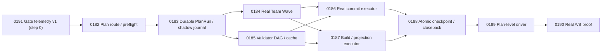

# ATM 端到端自動併批與效能證明計畫 2.0

狀態更新：2026-07-19（Captain review 修訂：wave commit 紀律、分歧復原通路、plan digest pin、token 量測契約、baseline 自我採樣、lane attribution、原子化出口）
狀態更新（儀表先行修訂）：2026-07-19（新增 ATM-GOV-0191 治理閘門遙測基座為依賴圖第 0 步；0182-0190 逐卡加入遙測產出/消費義務；新增 M1/M2 數據里程碑，形成「以戰養戰」自我量測迴圈）
前版計畫：[ATM 端到端自動併批與效能證明計畫](./end-to-end-auto-batch-performance-plan.md)
Planning 權威來源：`C:/Users/User/3KLife`
Target 權威來源：`C:/Users/User/AI-Atomic-Framework`
閉卡權威來源：target repo ATM ledger

## 摘要

1.0 已完成安全契約與 pure planner，但尚未完成真正的一條龍執行：

- `team wave dispatch` 目前只寫 runtime record，沒有啟動並管理整個 wave。
- `broker batch execute` 目前建立 plan/receipt，沒有真正執行 commit、build 或 projection。
- `checkpoint-readiness` 只判斷證據是否齊全，沒有 fan-out 原子閉卡。
- 既有 serial/manual lane 沒有 durable broker ticket 與 lane event 的 shadow instrumentation，導致真實 ledger 沒有足夠事件，0179 的 verdict 永遠容易停在 `inconclusive`。
- 0179 focused test 使用合成 broker tickets；現行 analyzer 未比較 serial/treatment makespan 或 throughput，只靠 ticket batchRate 與 generated-write counts 就可能誤判 `improved`。
- `atm next` 無法穩定辨識 plan-level continuation，仍可能要求在已完成單卡間二選一。
- 治理閘門（pre-commit 20 項、doctor 25 項、pre-push、guard）沒有任何持久化的執行/攔截紀錄：failureEnvelope 不落盤、無 per-check 延遲數據，「哪些檢查有效、哪些是儀式」在結構上不可證明，fail-fast 重排與檢查裁汰因此失去數據基礎（2026-07-19 閘門稽核結論）。
- 實際 0168-0179 dogfood 仍要人工逐卡處理 planning 對齊、claim/close、validator、runner-sync、release artifact、跨 repo commit 與 push，約耗時 3 小時與 284 萬 tokens（量測口徑：單一 coordinator 對話 session 的累計 usage，含探索與重試；此數字是 0190 serial baseline 的錨點之一，引用時必須連同口徑一起引用）。

2.0 不建立第四套 batch 系統，正式產品模型仍為：

```text
Batch 選卡 -> Team Wave 做卡 -> Broker 併寫 -> Checkpoint 閉卡
```

2.0 同時把效能證明設計成計畫內部自我閉環：0183 落地 shadow instrumentation 之後，0184-0190 每張卡自身的施工過程就是被完整量測的真實 serial baseline 樣本（詳見 0183/0190），不需要額外等待外部流量。

2.0 進一步把量測義務提前到全計畫第 0 步（以戰養戰）：0191 先落地治理閘門遙測基座（gate telemetry v1，涵蓋 hook/doctor/guard/next/claim/close/batch 全部 ATM 節點），使 0182 起每一張卡的施工 commit 都自動累積 per-check 遙測；0185 收口後產出數據 v1.0（M1 里程碑）並授權據此提早優化，0186-0190 的施工窗同時成為驗證優化效果的數據 v2.0（M2 里程碑，由 0190 analyzer 收斂成閘門效果五元組報告）。量測不是計畫的附屬品，而是每張卡的交付物之一。

唯一正式入口預計為：

```shell
node atm.mjs batch execute-plan \
  --plan C:/Users/User/3KLife/docs/ai_atomic_framework/governance-optimization/end-to-end-auto-batch-performance-plan-v2.md \
  --actor <actor-id> \
  --executor auto \
  --push \
  --json
```

`--executor auto` 優先使用通過 preflight 的 Team provider，也可消費 editor/subagent worker report；沒有合法 executor 時 fail closed，不偷偷降級成無人追蹤的手工作業。commit 由 executor 自動完成，push 必須明確帶 `--push`。

## 權威與文件

- `planning_repo_root`: `C:/Users/User/3KLife`
- `planning_repo_is_external_to_target`: `true`
- `target_repo_root`: `C:/Users/User/AI-Atomic-Framework`
- `source_plan_path`: `docs/ai_atomic_framework/governance-optimization/end-to-end-auto-batch-performance-plan-v2.md`
- `source_task_card_path`: `docs/ai_atomic_framework/governance-optimization/tasks/ATM-GOV-0182..0190-*.task.md`
- `target_import_method`: executor 內部透過既有 task import/taskflow orchestration 匯入；禁止直接編輯 `.atm/history/**`。

Target ATM ledger 與 `node atm.mjs tasks audit --json` 是任務狀態、編號與閉卡事實的權威來源；本文的任務編號與對照表只是 planning snapshot，不得反向覆蓋 ledger。每張卡開卡前必須同時：

1. 在 target 執行 `node atm.mjs tasks audit --json`。
2. 以 Node.js UTF-8 helper 掃描 planning `governance-optimization/tasks/` 的實際檔名與 task id。
3. 確認 planning source 與 target ledger 都未占用後才配置 ID。

2026-07-19 盤點時 `ATM-GOV-0182` 到 `ATM-GOV-0190` 均未占用。同日 ErrorCode 兩張卡自 GOV 系列改編為 `TASK-ERR-0001` 與 `TASK-TMP-0001`（bb4de4f0），原 `ATM-GOV-0191`/`ATM-GOV-0192` 號位已釋出，故遙測基座卡配置 `ATM-GOV-0191`（釋出後雙 repo 均未占用）。若正式開卡前任一 ID 被占用，整組依序平移到下一段連續空號，並更新本文快照；禁止覆寫既有卡或只平移部分卡。

## 公開介面

### BatchRun 與 plan execution journal

- `atm.batchRun.v1` 升級為向下相容的 `specVersion: 0.2.0`，增加 `planRef`、`planDigest`、planning/target repo、wave history、current phase、executor/push policy、metrics、reconciliation state，以及 `coordinatorLaneSessionId`。
- `planDigest` 在 run 建立時 pin 住，之後不隨 plan 文件變動。resume 判定規則：
  - 重跑且當前文件 digest 等於 pinned digest -> 自動 resume，不建立重複 run、ticket、commit 或 close event。
  - 當前文件 digest 不等於 pinned digest（plan 文件在 run 進行中被修改，例如 ID 平移快照更新）-> 拒絕自動 resume，要求明確 `--batch <id>` 加 `--accept-plan-change`；接受後把新 digest 記為 amendment event（保留舊 digest 供追溯），已存在的 ticket/commit/close 冪等鍵不得重置。
  - 禁止任何情況下因 digest 不符而靜默建立第二個 run。
- 新增 append-only `atm.planExecutionEvent.v1` 作為證據流，不建立第二套任務模型。每筆 event 必須帶 `batchId`、`waveId`、`taskId`（若適用）、`actorId`、`laneSessionId`、`coordinatorLaneSessionId`、phase、timing、retry 與 side-effect digest。
- `atm.planExecutionEvent.v1` 同時是 token/cost 量測的唯一載體：event 含 `tokenUsage`（`inputTokens`、`outputTokens`、`provider`、`source`）欄位。provider/editor executor 必須回填實際 usage（由 provider usage report 取得）；本機 lane 無遙測時記 `source: unavailable`，視為缺樣本，不得以 0 或估計值充數。
- `batch execute-plan --dry-run` 只輸出完整 phase plan，不建立 run。

### Wave 與 lane session 全鏈 stamping

- `atm.waveManifest.v1.tasks[]` 每個 member 增加 `laneSessionId`，manifest 本身增加 `coordinatorLaneSessionId`。
- `WaveBrokerTicket` 增加 member `laneSessionId` 與 `coordinatorLaneSessionId`；所有 ticket transition 保留兩者，讓 analyzer 不靠 actor 名稱猜 lane。
- `atm.teamWaveRuntime.v1`、worker report、shared write/generated write/checkpoint receipts 都要保留相同 lane stamps。
- lane id 必須複用 0167/0168 已落地的 lane session、D6 ownership comparison、TTL sweep 與 adopt/takeover；不得另造 wave-only lane registry。
- Wave attribution 權威規則：wave 的 shared commit 由 coordinator lane 執行，member claims 蓋的是各 worker lane——這是設計而非違規。manifest 同時載明 coordinator 與全部 member lanes 即構成相互 acknowledgment；pre-commit lane 檢查（`ATM_COMMIT_LANE_MISMATCH`）在「commit lane = manifest coordinatorLaneSessionId 且 claim lane ∈ manifest member lanes」時必須視為 acknowledged、不發 warn，避免每顆 wave commit 觸發逐卡告警淹沒真警報。manifest 之外的 lane 不適用此豁免。

### 真正 shared-write receipts

- `atm.sharedWriteReceipt.v1` 成功時必須含真實非空 `commitSha`、實際 commit file slices、temporary-index digest 與 lane stamps。
- `atm.waveGeneratedWriteReceipt.v1` 必須來自真正執行的 build/projection，包含 command、exit code、input/output digest、content-addressed skip 與 lane stamps。
- 新增 `atm.atomicWaveCheckpointReceipt.v1`，記錄各 member closure transition、target/planning commits、push refs、reconciliation state 與 coordinator lane。
- 新增 `atm.planPerformanceReport.v1`，統一輸出 speed、cost、safety、batching 與 observability 指標。

### Shadow instrumentation

既有 serial/manual lane 的 `tasks claim`、`taskflow close`、runner-sync/build admission 在不改變既有准入、exit code、排序或 side effect 的前提下，shadow 鑄造 durable observation ticket 與 lane event：

- `mode: shadow`，不得進入真正 scheduler queue 或改變 head ownership。
- ticket/event 必須帶真實 task、actor、lane、surface、wait start/end、decision 與 payload digest。
- instrumentation 失敗只能產生 observability warning，不得讓原本成功的 serial 操作失敗；資料 schema 驗證失敗仍需明確記錄。
- 這些事件是 0190 建立真實 serial baseline 的必要前置，不得用 fixture 事件替代。

### 治理閘門遙測（gate telemetry v1）

0191 交付、全計畫共用的閘門層儀表。與 shadow instrumentation 分工明確：gate telemetry 量「每一項治理檢查」（granularity = check），shadow instrumentation 量「生命週期操作的等待與佇列語義」（granularity = claim/close/runner-sync 操作）；兩者共用 correlation keys，analyzer 可直接 join，不得互相替代或重複記錄同一事實。

- 新增 append-only `atm.gateTelemetry.v1`：每次 hook pre-commit/pre-push、doctor、guard、next、tasks claim/close 准入與 batch/broker 決策執行時，per-check 寫一筆 `{ts, gate, checkId, result: pass|warn|block|error, durationMs, actorId, laneSessionId?, taskId?, batchId?, waveId?, source}`。
- 儲存為 per-lane-session 分片 JSONL（`.atm/history/telemetry/gate-events-<yyyymm>-<lane 短碼>.jsonl`），append-only 天然免跨 lane 寫入衝突；聚合一律由讀端合併。
- failureEnvelope 持久化：hook block 時完整 envelope 落盤 `.atm/history/rejections/`，與遙測事件互相 ref——閘門攔截首次成為可統計事實。
- Fail-open 鐵律：遙測寫入失敗只能產生 observability warning，絕不可使原本會成功的命令失敗或改變 exit code；遙測不是新的閘門。
- 讀端：`atm telemetry report --json` 輸出 per-checkId 效果五元組（啟動次數、攔截次數、warn 次數、durationMs p50/p95、證據讀回數），支援時間窗過濾；此輸出即 M1/M2 里程碑報告與 0190 analyzer 的資料來源。
- 與 `atm.planExecutionEvent.v1` 的 join 鍵：`laneSessionId` + `taskId` + `batchId`/`waveId`。

### ErrorCode 治理契約

本計畫新增、重用、改名或退役任何 `ATM_*` ErrorCode 前，必須先使用
`atm-error-code-resolver` 的 authoring flow。Canonical source 固定為 target repo
`docs/governance/error-code-registry.json`；`docs/ERROR_CODES.md` 只能由
`npm run generate:error-codes` 產生，不得手改。

ErrorCode 只表達「命令失敗或需要 operator 採取 retry／批准／復原動作的穩定邊界」。
`paused`、`deferred`、`reconcile-required`、`inconclusive`、cache miss、成功入列與
queue position 都是狀態或 verdict，不得濫建 ErrorCode。每個代碼契約必須同時存在於
本文與負責卡，至少包含 code、reuse/register disposition、觸發條件、retryable、
human approval、recovery command、source owner、registry owner 與 focused tests。

為避免 0184/0185 與 0186/0187 因共同編輯單一 registry 而失去平行性，
`ATM-GOV-0183` 是本計畫唯一 shared registry owner：它一次登錄本表標示為
`register` 的新碼並重生文件；後續卡負責 emitter 與測試，不得各自重寫 registry。
若施工時發現新碼需求，必須先經 skill 回寫本文與該卡，再由 broker 安排 registry
amendment，不得在程式中臨時硬編碼未登錄代碼。

| 負責卡 | ErrorCode | disposition | 觸發與復原契約 |
|---|---|---|---|
| 0182 | `ATM_NEXT_TASK_SCOPE_NOT_FOUND` | reuse | plan 無法解析到合法 cards；修正/import planning scope 後重跑 `next --prompt` |
| 0182 | `ATM_NEXT_ACTIVE_TASK_DIVERGENCE_BLOCKED` | reuse | 候選 scope 與 foreign active WIP 相交；查 `tasks status`/`broker status` 後等待或 takeover |
| 0183 | `ATM_BATCH_PLAN_DIGEST_MISMATCH` | register | resume 的 plan digest 與 pinned digest 不符；指定既有 batch 並採合法 amendment/restart 路徑 |
| 0183 | `ATM_BATCH_RUN_EVENT_JOURNAL_INVALID` | register | journal event malformed、digest 或冪等鍵矛盾；停止 side effect，先 audit/repair journal |
| 0184 | `ATM_TEAM_RUN_INVALID`、`ATM_TEAM_WRITE_SCOPE_OUT_OF_BOUNDS`、`ATM_TEAM_LEASE_CONFLICT` | reuse | worker report/schema、scope 或 lane lease 不合法；修正 report/scope 或依法 adopt 後重試 |
| 0185 | `ATM_VALIDATOR_FAILED` | reuse | command-backed validator 真正失敗；cache miss/unsafe cache 僅 bypass，不報錯 |
| 0186 | `ATM_BATCH_FILE_CONFLICT`、`ATM_BROKER_BATCH_COMMIT_BLOCKED`、`ATM_GIT_RECORD_COMMIT_PAYLOAD_DROPPED` | reuse | sealed file/HEAD、broker admission 或 post-commit payload assertion 失敗 |
| 0187 | `ATM_BROKER_BATCH_GENERATED_BLOCKED`、`ATM_RUNNER_SYNC_RECEIPT_INVALID` | reuse | build/projection/runner receipt 無法證明 generated write |
| 0188 | `ATM_BATCH_WAVE_CHECKPOINT_BLOCKED` | reuse | member readiness 未齊；補足 receipt/evidence 後重跑 checkpoint |
| 0188 | `ATM_BATCH_PLANNING_CLOSEBACK_CONFLICT` | register | target 已完成但 planning CAS seal 不符；停在 reconcile-required，只修 planning side |
| 0189 | `ATM_BATCH_PUSH_DIVERGED` | register | fetch 後 remote 與本 run commits 分歧且不可安全 fast-forward；停止自動 push 並輸出協調命令 |
| 0189 | `ATM_BATCH_STATE_REPAIR_REQUIRED` | reuse | durable run state 無法安全 resume；執行明確 repair command 後重試 |
| 0190 | 無新 ErrorCode | none | `improved`/`inconclusive`/`regressed` 是 verdict，不是錯誤碼 |
| 0191 | 無新 ErrorCode | none | 遙測 fail-open；journal 寫入失敗與 schema 違規只產生 observability warning，不建錯誤碼 |

Cross-cutting governance prerequisite：`TASK-ERR-0001`（原 ATM-GOV-0191，已改編入 error-governance 家族）負責把本節 authoring flow
落進共用 skill templates、重烘焙 adapters 與驗證零 drift。它不是第四套 batch
功能，也不改變 0182-0190 的依賴圖；完成後，九張功能卡才能引用這份 ErrorCode
契約。TASK-ERR-0001 不新增 runtime ErrorCode。

`ATM-GOV-0191`（治理閘門遙測基座）同為 cross-cutting 卡，但位置不同：它是依賴
圖第 0 步，0182 起所有功能卡的施工都必須在其儀表覆蓋下進行（見「數據里程碑與
以戰養戰迴圈」節）。

## Wave commit 紀律（單卡紀律的正式例外）

既有治理鐵律是每卡嚴格 2 commits（1 delivery + 1 closure）。wave 模式下此紀律以 wave 為單位攤提，正式定義為：

- 每 wave 恰好 1 顆 shared delivery commit（0186）+ 恰好 1 顆 wave closure commit（0188）；build/projection 若需獨立 artifact commit 沿用既有 runner-sync 慣例，不另計。
- 每張 member card 仍保留獨立 closure packet、closure event 與 per-card evidence；receipt 把 shared SHA fan-out 到每張卡。
- 判定歸屬：commit 訊息載 wave id，`atm.sharedWriteReceipt.v1` / `atm.atomicWaveCheckpointReceipt.v1` 是 per-card commit 對帳的權威證據。
- 0188 交付時必須同步教會 task audit 與 pre-push 檢查認得 wave closure commit（以 checkpoint receipt 為證據），Captain condition review 與 dispatch 規範同步收錄此例外；在此之前任何 wave commit 不得上 main。

## 數據里程碑與以戰養戰迴圈

儀表先行、逐卡累積、期中優化、收官驗證：

- **第 0 步（0191）**：遙測基座先落地。此後每張卡的施工（claim、pre-commit 逐項檢查、doctor、close）都自動產生 per-check 遙測——施工本身就是採樣，不需要額外的量測作業。
- **逐卡義務（0182-0190 全部適用）**：（a）產出——本卡施工窗遙測完整落地；（b）消費——收口回報必附「遙測摘要」段（施工窗 per-gate 事件數、block/warn 數、異常延遲），Captain condition review 據此核實儀表持續健康；遙測缺漏視為收口不完整。
- **M1 里程碑（數據 v1.0）**：0185 收口後，以 `atm telemetry report` 產出首份閘門效果報告（0191 + 0182-0185 施工窗累積）。授權據此提早優化：fail-fast 重排、doctor 靜態檢查 digest 快取等有數據支持的改動，開獨立 **gate-optimization 卡**執行，與 0186-0188 平行、不阻塞主鏈、不算 scope drift；無數據支持的閘門裁汰禁止。M1 報告是 0186 開工前 condition review 的必附件。
- **M2 里程碑（數據 v2.0）**：0186-0190 施工窗 + treatment runs 構成第二期數據，天然形成 M1 優化的 before/after 對照。0190 analyzer v3 收斂出閘門效果五元組總表（啟動/攔截/真陽性/延遲/證據讀回）與裁汰候選清單（kill criteria：啟動 >= 30 次、零攔截、零 warn、證據零讀回 -> 降頻抽樣或退場**提案**，一律交 owner 裁決，不自動執行）。
- **迴圈定義**：量測（0191）→ 施工即採樣（每卡）→ 期中裁決（M1）→ 優化與對照（gate-optimization 卡 + v2.0 數據）→ 收官驗證與裁汰提案（M2/0190）。治理系統從「只加不減」變成「有數據才加、有數據可減」。

## 任務總表

| 任務卡 | 內容 | 主要驗收 |
|---|---|---|
| ATM-GOV-0191 | 治理閘門遙測基座（gate telemetry v1、rejection journal、telemetry report）——依賴圖第 0 步 | 全節點 per-check 遙測落地；fail-open parity；`telemetry report` 可出五元組；hook block 有持久 envelope |
| ATM-GOV-0182 | Plan-scoped routing、身份與 WIP provenance preflight | 精確 plan route；顯示 owner/lane/files；stale generated receipt 不冒充 active work |
| ATM-GOV-0183 | Durable Plan BatchRun、lane stamping 與 shadow journal | plan run 可 resume；digest pin/amendment；token 量測契約；全鏈 lane join；serial lane 無行為變更地留下 durable 事件 |
| ATM-GOV-0184 | Real Team Wave worker executor | 真正啟動/接收 worker；每卡一 lane；heartbeat/sweep；worker 不 commit/close |
| ATM-GOV-0185 | Validator DAG、共享結果與安全 cache | 相同 sealed input 只跑一次並 fan-out；不安全 cache fail closed |
| ATM-GOV-0186 | 真正 Shared Delivery Commit Executor | temporary index 實際 commit；payload assertion；lane acknowledgment；wave commit 紀律 |
| ATM-GOV-0187 | 真正 Build/Projection/Runner-Sync Executor | 每 wave 最多一次 build/projection；真實 receipt；release residue 收乾淨 |
| ATM-GOV-0188 | Atomic Wave Checkpoint 與跨 repo closeback saga | fan-out 閉卡；CAS planning closeback；audit 認得 wave closure；coordinator adopt 後不重複副作用 |
| ATM-GOV-0189 | Plan-Level Executor 主迴圈、動態收單窗與復原 CLI | 一個命令跑完整 plan；EMA collection window；分歧復原通路；pause/resume/adopt/circuit breaker |
| ATM-GOV-0190 | 真實 Paired A/B、Analyzer v3 與 rollout verdict | 真實樣本；lane join；sharedSurfaceWaitRatio；四維 verdict 分立；只有 speed/cost/safety 全達標才 default-on |

## 任務細節

### ATM-GOV-0191 - 治理閘門遙測基座（Gate Telemetry v1）

依賴：無（依賴圖第 0 步，先於 0182 執行）。
主要 surface：hook pre-commit/pre-push instrumentation、doctor/guard/next instrumentation、claim/close 准入 instrumentation、telemetry store 與 report。

必要行為：

- 交付「公開介面」節定義的 `atm.gateTelemetry.v1` schema、per-lane-session 分片 JSONL store 與單一 emit helper 模組（各 gate 呼叫同一 helper，不得各自複製寫入邏輯）。
- 接線全部 ATM 節點：pre-commit 逐項檢查、pre-push、doctor 各 named check、guard 子命令、next 路由決策、tasks claim/close 准入、batch/broker 決策，每次執行 per-check 記錄 result 與 durationMs。
- failureEnvelope 與 block 事實持久化到 `.atm/history/rejections/`，與遙測事件互相 ref。
- Fail-open：遙測寫入失敗絕不影響原命令 outcome、exit code 或排序；以 parity 測試釘死（開關遙測前後 bit-for-bit 一致，僅多出合法 observation artifacts）。
- 交付 `atm telemetry report --json`：per-checkId 五元組聚合 + 時間窗過濾；輸出格式即 M1/M2 報告格式。
- 全部新邏輯抽成新 modules（0170 extraction pathway），不膨脹 hook/doctor 既有大檔；觸碰 >600 行模組時原子化提案是回報義務。
- ErrorCode：不新增（fail-open 原則，見「ErrorCode 治理契約」表）。

驗收：各 gate 至少一條 per-check 事件的 isolated fixture；fail-open parity（telemetry store 唯讀或毀損時原命令照常成功並輸出 warning）；rejection envelope 落盤與雙向 ref 完整；report 聚合正確；分片檔案在雙 lane 並行寫入下零衝突。

### ATM-GOV-0182 - Plan-Scoped Routing、Identity 與 WIP Provenance Preflight

依賴：ATM-GOV-0191。
主要 surface：prompt-scoped next、plan resolver、active-work summary、batch preflight。

必要行為：

- 精確 `--plan` path 或 source plan digest 直接解析成同一份 plan 的未完成 cards，不再回傳已完成單卡二選一。
- membership 以 ledger `related_plan`、planning source seal 與 target repo 為準；done/abandoned cards 不重入執行 queue。
- 一次解析 coordinator actor identity 與 lane，診斷 actor mismatch 時提供單一可執行 recovery command。
- WIP 分類至少包含 current-run-owned、foreign-active、foreign-stale-generated、unowned-actionable、unrelated；顯示已知 owner、task、session、lane 與 intersecting files。
- 0168/0181 類 runner receipts 若無 active owner 且不與候選 code scope 相交，不得被誤報成 active L3 blocker，也不得自動刪除。
- 遙測：路由與 preflight 決策經 0191 emit helper 記錄（gate=next/preflight，含 WIP 分類結果）；本卡施工窗遙測完整落地，收口回報附遙測摘要（「數據里程碑與以戰養戰迴圈」節逐卡義務，以下各卡同，不再逐條重述）。
- ErrorCode：依「ErrorCode 治理契約」重用 `ATM_NEXT_TASK_SCOPE_NOT_FOUND` 與 `ATM_NEXT_ACTIVE_TASK_DIVERGENCE_BLOCKED`；不得另造 plan-route 私有码。

驗收：plan path route、已完成卡排除、actor mismatch、foreign active WIP、stale generated receipt、unrelated dirty files 均有 isolated fixture；`next` 與 `batch execute-plan --dry-run` 結論一致。

### ATM-GOV-0183 - Durable Plan BatchRun、Lane Stamping 與 Shadow Journal

依賴：ATM-GOV-0182。
主要 surface：BatchRun store、wave manifest adapter、plan execution journal、serial lifecycle instrumentation。

本卡是全計畫最重的一張，且 shadow hooks 插在最熱的治理路徑（claim/close/runner-sync）上。實作紀律：

- 全部新邏輯抽成新 modules（0170 extraction pathway），不得繼續膨脹半 minified 的 `batch/implementation.ts` 或 `taskflow/implementation.ts`；對半 minified 檔只做錨點級接線。
- 觸碰任何 >600 行模組時，原子化提案是回報義務；必要時允許 extraction follow-up 卡（見「依賴圖」節的例外定義），不視為違反「不開平行功能卡」。

必要行為：

- 交付 `atm.batchRun.v1` 0.2 相容讀寫器與合法 phase transition：preflight、selecting、working、validating、collecting、writing、checkpointing、closing-back、pushing、completed、paused、reconcile-required、failed。
- 實作「公開介面」節定義的 planDigest pin/amendment/resume 規則，含 digest 不符時的拒絕與 `--accept-plan-change` 通路。
- BatchRun 固定保存 `coordinatorLaneSessionId`；wave member、ticket 與 plan event 的 lane stamps 可由 batch/wave/task id deterministic join。
- 每個 phase 在 side effect 前後各寫一筆 append-only event，使用 batch/wave/phase/payload digest 做冪等鍵。
- 實作 event 的 `tokenUsage` 欄位契約：provider/editor executor 回填實際 usage、本機 lane 記 `source: unavailable`；此契約是 0190 cost 維度可判定的前置。
- 對 serial `tasks claim`、`taskflow close`、runner-sync 加 shadow ticket/event instrumentation，驗證原本輸出、exit code、准入與排序 bit-for-bit 不變。
- shadow events 要能量出 shared surface wait start/end，不得以 `waitedMs: 0` 代替缺資料。
- Baseline 自我採樣：本卡收口後，0184-0190 各卡自身的施工（claim/close/validator/runner-sync/push）即為被 shadow instrumentation 完整覆蓋的真實 serial baseline 採樣期。各卡收口回報必須確認自己的 shadow events 落地；0190 開工時 by construction 至少有 6 張真實 serial 樣本卡。
- 本卡是 plan-wide ErrorCode registry owner：透過 `atm-error-code-resolver` 登錄 `ATM_BATCH_PLAN_DIGEST_MISMATCH`、`ATM_BATCH_RUN_EVENT_JOURNAL_INVALID`、`ATM_BATCH_PLANNING_CLOSEBACK_CONFLICT`、`ATM_BATCH_PUSH_DIVERGED`，重生 `docs/ERROR_CODES.md`，並驗證其 trigger/retry/approval/recovery 契約。
- 遙測 join：`atm.planExecutionEvent.v1` 與 `atm.gateTelemetry.v1` 以 laneSessionId + taskId + batchId/waveId 可 deterministic join；shadow event 與 gate event 分工依「公開介面」節，不得重複記錄同一事實。

驗收：crash/restart、duplicate event、digest amendment、legacy BatchRun 0.1、lane join、tokenUsage 記錄、shadow instrumentation parity、malformed shadow event warning 與 planExecutionEvent x gateTelemetry join 全部有測試；0190 在沒有 treatment run 前也能讀到真實 serial baseline。

### ATM-GOV-0184 - Real Team Wave Worker Executor

依賴：ATM-GOV-0183。
主要 surface：Team Wave runtime、provider orchestration、editor bridge、worker report ingestion。

必要行為：

- `--executor auto` 優先啟動通過 provider preflight 的 Team execution；也能等待已宣告 editor/subagent bridge 回傳 `atm.teamWorkerReport.v1`。
- 每張 task 一個永久綁定 lane session；manifest member、worker environment、report 與 evidence 使用同一 `laneSessionId`。
- worker 必須定期 heartbeat；coordinator 透過既有 lane sweep 判斷 stale/expired，不新增 wave-only TTL。
- provider/editor worker report 必須帶 `tokenUsage`（0183 契約）；缺 usage 的 provider report 記 observability warning。
- worker 只可修改 claim scope 並回傳 patch/report/validator inputs；git write、broker execute、checkpoint 與 close 權限只屬 coordinator。
- partial/blocked worker 可重試一次；仍失敗則 defer/reseal。剩一張時回既有 serial fallback。
- out-of-scope report 進 `needs-review`，不得進 shared write。
- 遙測：worker lifecycle 決策（啟動、heartbeat 判定、sweep、retry/defer）經 0191 記錄（gate=team-wave），帶 waveId 與 member laneSessionId。
- ErrorCode：重用 `ATM_TEAM_RUN_INVALID`、`ATM_TEAM_WRITE_SCOPE_OUT_OF_BOUNDS`、`ATM_TEAM_LEASE_CONFLICT`；`needs-review` 本身是狀態，不新增 ErrorCode。

驗收：provider worker、editor report、heartbeat expiry、lane sweep、partial retry、out-of-scope、one-member fallback，以及 worker 嘗試 commit/close 的 coordinator guard。

### ATM-GOV-0185 - Validator DAG、共享結果與安全 Cache

依賴：ATM-GOV-0183；可與 ATM-GOV-0184 平行。
主要 surface：validator planner、evidence runner、command cache。

必要行為：

- 以 command、declared input set digest、sealed HEAD、toolchain/lockfile digest 與 declared relevant env whitelist 建 cache key（env 必須顯式宣告進 key，不得隱式吸收整個環境）。
- 相同 wave 中相同 key 只執行一次並將 command-backed evidence fan-out 到 covered tasks。
- 可並行的 validator DAG 同時執行；共享 build/projection validator 交由 0187，不在 worker lane 重跑。
- 未 sealed input、非 deterministic command、缺 input declaration、失敗結果與 stale runner 不得 cache。
- 每筆結果記錄 queue wait、execution time、cache hit、lane attribution 與 `tokenUsage`（依 0183 契約；validator 為本機命令時記 `source: unavailable`）。
- 遙測消費（以戰養戰首個實例）：validator DAG 排序與 cache 優先序以 0191 累積的 per-validator durationMs p50/p95 為輸入（無數據時退回宣告成本預設）；每筆 planner decision 記錄其依據的遙測輸入摘要。本卡收口即觸發 M1 里程碑（「數據里程碑與以戰養戰迴圈」節）。
- ErrorCode：validator 真失敗重用 `ATM_VALIDATOR_FAILED`；cache miss、cache bypass 與 unsafe-to-cache 是 planner decision，不建立新碼。

驗收：cache hit/miss、HEAD/lockfile/env invalidation、失敗不 cache、fan-out coverage、parallel DAG、取消與重試、telemetry-informed ordering（有數據/無數據兩型）。

### ATM-GOV-0186 - Real Shared Delivery Commit Executor

依賴：ATM-GOV-0184、ATM-GOV-0185。
主要 surface：shared delivery composer、temporary index、wave scheduler transitions。

必要行為：

- 將現有 pure `planSharedDeliveryCommit` 保留為 dry-run core，另加真正 executor。
- 從 worker reports 與實際 worktree diff 建 task file slices；使用 temporary index stage，絕不污染共享 index。
- commit 前驗證 claims、lane stamps、validators、sealed base、HEAD、manifest digest、scope coverage 與 staged payload。
- commit 後做 post-commit payload assertion：temporary staged set、receipt file slices、commit tree 必須一致，不符 fail loudly。
- 只有同 wave 且相容 surface family 的相關任務可共用 commit；不吸收 foreign/unrelated staged work。
- 落實「Wave commit 紀律」節：每 wave 恰好一顆 shared delivery commit，訊息載 wave id，receipt 為 per-card 對帳權威。
- 落實「公開介面」節的 wave attribution 權威規則：commit 以 coordinator lane 執行；pre-commit lane 檢查對 manifest 內的 coordinator/member lanes 視為 acknowledged，不發 `ATM_COMMIT_LANE_MISMATCH` warn；manifest 之外的 lane 照常告警。
- ticket 狀態完整經過 queued/head/batched/executing/released 或 failed，並為每次 transition 寫 lane event。
- 遙測：wave shared commit 經 pre-commit 時的 per-check 事件必須帶 waveId/batchId；M1 閘門效果報告是本卡開工前 condition review 的必附件（「數據里程碑與以戰養戰迴圈」節）。
- ErrorCode：重用 `ATM_BATCH_FILE_CONFLICT`、`ATM_BROKER_BATCH_COMMIT_BLOCKED`、`ATM_GIT_RECORD_COMMIT_PAYLOAD_DROPPED`，測試必須釘死 structured details 與 recovery command。

驗收：真實 local git commit、temporary-index isolation、stale HEAD、foreign staged、payload mismatch、crash-after-commit resume、same-wave batch、cross-wave separation，以及 manifest 內 lane 不觸發 mismatch warn / manifest 外 lane 照常告警的成對測試。

### ATM-GOV-0187 - Real Build/Projection/Runner-Sync Executor

依賴：ATM-GOV-0184、ATM-GOV-0185；可與 ATM-GOV-0186 平行。
主要 surface：generated-write executor、sealed runner build、projection regeneration、runner-sync release。

必要行為：

- 從 manifest 與 repository policy 解析真正 build/projection commands，不接受呼叫者先填假的 output digest。
- 相容 wave 每個 surface 最多執行一次；輸出 digest 由執行後觀測值產生並 fan-out。
- 重用 content-addressed build skip；skip 也要記錄 source/output digest 與 provenance。
- runner-sync enqueue/release、receipt publication、release artifacts 與 projection outputs 在同一 coordinator lane 收口。
- generated outputs 在 0186 最終 delivery commit 前加入其 temporary-index payload；失敗時不得生成成功 receipt 或進 checkpoint。
- 遙測：build/projection/runner-sync 實際 duration 與 skip 決策進 gate telemetry（gate=generated-write），供 0189 EMA 與 0190 分析。
- ErrorCode：重用 `ATM_BROKER_BATCH_GENERATED_BLOCKED` 與 `ATM_RUNNER_SYNC_RECEIPT_INVALID`；一般 command exit code 保留在 receipt details，不再派生重複代碼。

驗收：真實命令執行、content skip、build/projection retry、runner receipt mismatch、每 wave exactly-once、release/projection residue clean。

### ATM-GOV-0188 - Atomic Wave Checkpoint 與 Cross-Repo Closeback Saga

依賴：ATM-GOV-0186、ATM-GOV-0187。
主要 surface：checkpoint driver、taskflow close integration、planning CAS adapter、push receipt、task audit wave 規則。

必要行為：

- shared delivery SHA 與 generated receipts fan-out 到每個 member；只有全部 member readiness 成立才開始 wave close。
- target ledger closures 與 closure evidence 形成單一 wave closure commit；每張卡仍保留獨立 closure packet/event。
- 落實「Wave commit 紀律」節：教會 task audit 與 pre-push 檢查以 `atm.atomicWaveCheckpointReceipt.v1` 為證據認可 wave closure commit（per-card closure metadata 完整性檢查不變、不放鬆）；此規則落地並驗證通過前，wave commit 不上 main。
- target commit/push 成功後才以 planning source seal 做 compare-and-swap closeback；planning commit/push 失敗時進 `reconcile-required`。
- checkpoint receipt 記錄 coordinator lane、member lanes、target/planning SHA、remote refs 與每卡 close transition。
- coordinator 中途死亡時，TTL 到期後允許另一隊長透過既有 lane adopt/takeover 接手；新 coordinator lane 從 journal resume，已存在的 commit/close/push 不得重做。
- `--push` 未提供時停在 `committed-not-pushed`，不宣告 remote-complete。
- 遙測：wave close audit 與 checkpoint 決策 per-check 記錄；saga 與分歧診斷必須引用 `.atm/history/rejections/` 的持久 envelope，不得只靠當場 stdout 重建現場。
- ErrorCode：readiness 不足重用 `ATM_BATCH_WAVE_CHECKPOINT_BLOCKED`；planning CAS 衝突使用由 0183 登錄的 `ATM_BATCH_PLANNING_CLOSEBACK_CONFLICT`。`reconcile-required` 與 `committed-not-pushed` 是狀態。

驗收：multi-task close、planning CAS conflict、target push success/planning push failure、crash before/after 各 side effect、coordinator TTL adopt、adopt 後 exactly-once closure，以及 wave closure commit 通過 task audit / pre-push 的整合測試。

### ATM-GOV-0189 - Plan-Level Executor 主迴圈、動態收單窗與復原 CLI

依賴：ATM-GOV-0188。
主要 surface：`batch execute-plan`、phase driver、collection policy、push/divergence recovery、circuit breaker。

必要行為：

- 一個命令持續推進 preflight、select、claim lanes、workers、reconcile、validate、generated writes、delivery commit、checkpoint、target push、planning closeback/push、analyze 與 next wave。
- 支援 `--dry-run`、`--batch <id>` resume、pause、cancel、serial fallback、`--push` 與 circuit breaker；每次輸出唯一 next/recovery command。
- `collectionTimeoutMs` 不再是單一固定 timeout；它只保留為舊 manifest 的相容輸入，解析後必須正規化成動態 collection policy。初始預設：`floorMs=15000`、`ceilingMs=120000`、`emaAlpha=0.25`、飽和密度 8 events/min；以最近 20 筆同 repo commit/ticket event 的 events-per-minute EMA 計算：`floor + (ceiling-floor) * min(1, emaRate/saturation)`，再 clamp 至 floor/ceiling。這些常數是可調參的初始預設而非規格常數，0190 得依實測數據調整。所有 expected tickets 到齊可提早收單。
- 高事件密度時延長窗口以吸收相關 tickets；事件趨於安靜時回到 floor，避免固定等待 120 秒。報告每次 window 的 EMA input、decision 與實際等待。
- Push 分歧復原通路（見「執行與失敗語義」的授權分級）：push phase 先 fetch 並嘗試 fast-forward；分歧且本 run 自有 commits 與遠端新 commits 檔案不相交時，允許 governed ephemeral push-only worktree 復原——detached worktree checkout `origin/<branch>`、cherry-pick 本 run 自有 commits、push、立即刪除 worktree；全程不碰主 worktree 與 foreign WIP，並寫 recovery event（含採用原因、涉及 SHA、worktree 路徑與清除確認）。檔案相交或 cherry-pick 衝突則停在 `push-diverged`，輸出協調指引，不自動合併。
- coordinator lane heartbeat 中斷時暫停新 side effect；TTL 到期後只接受正式 adopt/takeover。接手者由 0188 journal/receipt resume。
- 每 wave 結束時，本 run 自有 dirty/untracked residue 必須為零；foreign/unrelated residue 只報告、不清除。
- 遙測：dynamic window 的 EMA input 除 commit/ticket 事件外得納入 gate telemetry 事件密度；每次 window decision 與 recovery event 與遙測互 ref。
- ErrorCode：push 無法安全收斂使用由 0183 登錄的 `ATM_BATCH_PUSH_DIVERGED`；不可安全 resume 重用 `ATM_BATCH_STATE_REPAIR_REQUIRED`。pause/cancel/circuit-open 是受控狀態，不新增 ErrorCode。

驗收：完整 isolated plan run、dynamic window floor/ceiling/early-close、pause/resume/cancel、serial fallback、circuit open、coordinator adopt、push-pending resume、own-scope clean check，以及分歧復原的成對測試（不相交 -> ephemeral worktree 成功且事後無殘留；相交 -> 停在 push-diverged 不動任何歷史）。

### ATM-GOV-0190 - Real Paired A/B、Analyzer v3 與 Rollout Verdict

依賴：ATM-GOV-0189。
主要 surface：captain parallel analyzer、real dogfood runner、performance report。

前置條件：0183 shadow instrumentation 已在正常 serial/manual lanes 累積真實 durable ticket/lane events——依 0183 的 baseline 自我採樣設計，0184-0189 六張卡的施工紀錄即為保底樣本；沒有真實 control/treatment events 不得以 fixtures 補足樣本門檻。

必要行為：

- analyzer 透過 batch/wave/task/lane stamps 直接 join laneEvidence、tickets、worker reports、receipts、commits、checkpoint 與 provider usage。
- 修正現有「有 tickets、batchRate 達標就 improved」邏輯；缺 makespan、throughput、cost 或安全樣本時只能 `inconclusive`。
- 新增報告級 `sharedSurfaceWaitRatio = shared surface wait duration / end-to-end makespan`，按 plan、wave、surface 與 lane 輸出，用於診斷多隊長損耗與併批收益天花板；它不是 rollout gate。
- 執行 deterministic replay：固定 patch envelopes，serial 與 plan executor 各至少 10 次，AB/BA 交錯。
- 執行 prospective dogfood：至少 6 組匹配 pair、12 張真實 GOV cards，依 scope、LOC、validator cost、build requirement、executor type 配對並交錯 serial/treatment。
- verdict 分開輸出 speed、cost、safety、batching 四維，各維獨立標 `improved`/`inconclusive`/`regressed`；aggregate 只有全部必要 gate 達標才為 `improved`。
- Cost 維度可判定性規則：token 數據以 0183 tokenUsage 契約為準（serial 錨點含摘要那筆 284 萬實測及其口徑）。當任一臂缺可比 token 樣本時，cost 維度單獨標 `inconclusive` 並在報告載明缺口，不得阻塞 speed/safety 維度的判定與輸出；此時 aggregate 不得為 `improved`（cost gate 未過），但報告必須能清楚指出「只缺 cost 樣本」，讓補樣本成為明確下一步，而不是重演 0179 式的整體不可判。
- EMA collection window 常數（0189 初始預設）依實測數據評估與調整，調整結果寫入 performance report。
- 遙測收官（M2）：analyzer v3 join gateTelemetry，輸出閘門效果五元組總表、M1 gate-optimization 的 before/after 對照與裁汰候選清單（kill criteria 見「數據里程碑與以戰養戰迴圈」節），隨 `atm.planPerformanceReport.v1` 一起交付。
- ErrorCode：本卡不新增代碼；四維 verdict 與樣本不足維持 report status，禁止把 `inconclusive` 包裝成錯誤。

驗收門檻：

- median end-to-end makespan 改善至少 25%。
- active throughput 改善至少 25%。
- manual lifecycle interventions/task 降低至少 80%。
- coordinator tokens/task 降低至少 50%，總 tokens/task 不得惡化超過 10%。
- eligible treatment `batchRate >= 0.70`。
- `buildsPerWave <= 1`、`projectionsPerWave <= 1`。
- validators 與 close audit 100% pass。
- out-of-scope、R1 與 cross-lane pollution violations 為零。
- 樣本不足為 `inconclusive`（缺哪一維在報告中明示）；任一安全 gate 失敗或 speed/cost 明顯惡化為 `regressed` 並自動開 circuit breaker。

## 依賴圖



0184 與 0185 可平行；0186 與 0187 使用獨立 executor modules，可平行實作；統一命令註冊由 0189 收斂。

功能卡維持九張（0182-0190），不因 lane stamping、shadow instrumentation 或多隊長測試另開平行**功能**卡。cross-cutting 卡另計：TASK-ERR-0001（ErrorCode 契約落地，見「ErrorCode 治理契約」節）與 0191（遙測基座，依賴圖第 0 步）。例外只有兩類：ATM 原子化義務的 **extraction follow-up 卡**（觸碰 >600 行或半 minified 模組時抽新 module 的純重構卡，0170 pathway），以及 M1 里程碑授權、有數據支持的 **gate-optimization 卡**（「數據里程碑與以戰養戰迴圈」節）——前者是把既有邏輯搬家，後者是計畫設計內建的優化出口，都不是第四套系統。

## 執行與失敗語義

- 固定 phase：preflight -> select -> claim lanes -> workers -> reconcile reports -> validators -> generated writes -> temporary-index delivery commit -> checkpoint close -> target push -> planning CAS/commit/push -> analyze -> next wave。
- HEAD 移動但 task file slices 無交集時最多自動 reseal 一次；有交集則保留 broker ticket 排隊，不覆蓋 foreign WIP。
- worker partial failure 重試一次；仍失敗就 defer。剩一張時走既有 serial fallback。
- build/projection 失敗不得產生成功 receipt，也不得 commit 或 close。
- 遙測 fail-open：任何 phase 的 gate telemetry / rejection journal 寫入失敗只降級為 observability warning，不得改變 phase outcome；持久化缺口必須在 wave 報告中列出。
- commit 後 crash 時，以 payload digest、commit SHA 與 event idempotency key 辨識已完成副作用，不建立第二個 commit。
- target 已 push、planning closeback 失敗時，target closure 保持有效，run 停在 `reconcile-required`；resume 只處理 planning side。
- coordinator lane 中途死亡時立即停止新 shared side effect；TTL 未到不得搶占。TTL 到期後由既有 adopt/takeover 合法接手，重新綁定 BatchRun coordinator lane，從 durable journal 繼續。
- collection window 使用 0189 EMA policy；floor/ceiling 是安全邊界，實際窗口與 early-close 決策必須留 event。
- 每個 wave 結束時，所有本 wave 自有 dirty/untracked residue 必須為零；只列出並保留不相關 foreign WIP。
- target 固定使用 `main`，3KLife planning 固定使用 `master`。

### Branch/worktree 授權分級（owner 裁決 2026-07-19）

- **正常功能開發**：禁止建立或切換開發 branch/worktree。若確有需要，必須取得人類的**高級批准**（明確針對該分支開發需求的裁決，一般性「可以繼續」不算），批准紀錄要寫入該卡 evidence。
- **緊急維修 / 修正做錯的東西**（含 push 分歧復原、錯誤 commit 補救）：允許 ephemeral 臨時分支或 push-only worktree 作為 governed 手段——detached、不碰主 worktree、不碰 foreign WIP、用完立即刪除、全程寫 recovery event。0189 的分歧復原通路屬於此類。
- 兩類的判別以「是否產生新功能歷史」為準：只搬運/修復既有 commits 的是維修；產生新開發 commits 的是功能開發。

## 測試與效能證明

### Contract 與 integration

- Unit：plan resolution、BatchRun transition、digest pin/amendment、lane stamping、event idempotency、tokenUsage 契約、ticket transition、receipt digest、cache invalidation、EMA window、checkpoint saga。
- Integration：臨時 target/planning repos 加 local bare remotes；fake provider 實際產生 patch/report；在每個 phase 注入 crash、HEAD move、push failure、push divergence（相交與不相交兩型）、partial worker、stale receipt 與 coordinator death。
- Shadow parity：serial claim/close/runner-sync 在 instrumentation 開關前後的 outcome、exit code、ledger transition 與 ordering 一致，只增加合法 observation artifacts。

### Concurrency 與多隊長

- 最多四張 disjoint cards 並行；scope overlap defer；R1 同卡第二 lane 必須 `ATM_LOCK_CONFLICT`；docs-only 不受 code dependency gate。
- 新增 wave-level dual-captain e2e：外部隊長使用自己的 lane 執行正常 serial task，同時 plan executor 在 disjoint tasks 跑 wave。
- 斷言雙方 live index、temporary index、claim owner、batch queue、runner-sync queue、planning closeback 與 task events 互不污染；任何 cross-lane mutation 視為安全 gate 失敗。
- coordinator death 場景必須涵蓋 ticket collecting、commit 後、checkpoint 中與 target push 後四個切點，adopt 接手後所有副作用 exactly once。

### Metrics

- Speed：end-to-end makespan、active throughput、hard-overlap minutes、max/avg concurrency、phase durations。
- Shared surfaces：waitedMs p50/p95、`sharedSurfaceWaitRatio`、batchRate、commits/builds/projections per wave、dynamic collection window（含 EMA input 與 decision trace）。
- Cost：coordinator/worker/validator tokens（0183 tokenUsage 契約）、cache reads、total tokens/task、provider cost、discarded retries；缺樣本臂明示 `source: unavailable` 占比。
- Safety/UX：validator/close audit pass rate、false blocks、lane intervention、repair closure、manual lifecycle interventions、out-of-scope/R1/cross-lane violations。
- Gate effectiveness（0191）：per-checkId 啟動/攔截/warn 次數、durationMs p50/p95、rejection envelope 數、證據讀回數；M1/M2 里程碑報告與 kill-criteria 裁汰候選清單。

## 實作與收口原則

- 0191 與 0182-0190 每卡各自 claim、驗證、close、commit、push，且收乾淨自己的 scope；wave 模式收口紀律見「Wave commit 紀律」節。
- 每卡收口回報必附施工窗遙測摘要（「數據里程碑與以戰養戰迴圈」節）；遙測缺漏視為收口不完整。M1 報告是 0186 開工前 condition review 必附件；gate-optimization 卡必須引用支持數據，無數據支持的閘門裁汰禁止。
- 每張卡開工前以 target `node atm.mjs tasks audit --json` 加 planning Node.js ID scan 重驗編號；本文對照表不得當成 ledger。
- 先抽取新 modules，不繼續膨脹半 minified 的 `batch/implementation.ts`；使用 0170 extraction pathway；原子化提案是每卡回報義務。
- Windows planning Markdown/JSON/text 一律透過 Node.js UTF-8 helper 讀取與比對；編輯後立即做 UTF-8 without BOM、U+FFFD、mojibake 與 round-trip 檢查。
- 新增、改名或退役 `ATM_*` 必須先走 `atm-error-code-resolver` authoring flow，並同步本文、負責卡、canonical registry、generated `docs/ERROR_CODES.md` 與 focused tests；禁止私有碼表與未登錄 emitter。
- 不碰他人 active WIP，不清除既有 0168/0181 foreign runner receipts；由 0182 provenance preflight 正式分類。
- Code writes 受 task claim 與 broker/steward rules 治理；docs/planning writes 不進 code broker，但 git commit 仍需精確 stage 自己的檔案。
- `--push` 是明確 opt-in；正式 dogfood 命令固定帶 `--push`，且完成條件包含 target `origin/main` 與 planning `origin/master` 都等於各自預期 SHA。
- Branch/worktree 依「授權分級」節執行：功能開發需高級批准；緊急維修可用 ephemeral 通路並留 recovery event。
