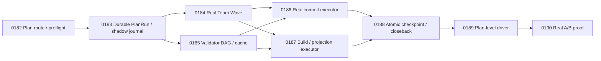

# ATM 端到端自動併批與效能證明計畫 2.0

狀態更新：2026-07-19
前版計畫：[ATM 端到端自動併批與效能證明計畫](./end-to-end-auto-batch-performance-plan.md)
Planning 權威來源：`C:/Users/User/3KLife`
Target 權威來源：`C:/Users/User/AI-Atomic-Framework`
閉卡權威來源：target repo ATM ledger

## 摘要

1.0 已完成安全契約與 pure planner，但尚未完成真正的一條龍執行：

- `team wave dispatch` 目前只寫 runtime record，沒有啟動並管理整個 wave。
- `broker batch execute` 目前建立 plan/receipt，沒有真正執行 commit、build 或 projection。
- `checkpoint-readiness` 只判斷證據是否齊全，沒有 fan-out 原子閉卡。
- 既有 serial/manual lane 沒有 durable broker ticket 與 lane event 的 shadow instrumentation，導致真實 ledger 沒有足夠事件，0179 的 verdict 永遠容易停在 `inconclusive`。
- 0179 focused test 使用合成 broker tickets；現行 analyzer 未比較 serial/treatment makespan 或 throughput，只靠 ticket batchRate 與 generated-write counts 就可能誤判 `improved`。
- `atm next` 無法穩定辨識 plan-level continuation，仍可能要求在已完成單卡間二選一。
- 實際 0168-0179 dogfood 仍要人工逐卡處理 planning 對齊、claim/close、validator、runner-sync、release artifact、跨 repo commit 與 push，約耗時 3 小時與 284 萬 tokens。

2.0 不建立第四套 batch 系統，正式產品模型仍為：

```text
Batch 選卡 -> Team Wave 做卡 -> Broker 併寫 -> Checkpoint 閉卡
```

唯一正式入口預計為：

```shell
node atm.mjs batch execute-plan \
  --plan C:/Users/User/3KLife/docs/ai_atomic_framework/governance-optimization/end-to-end-auto-batch-performance-plan-v2.md \
  --actor <actor-id> \
  --executor auto \
  --push \
  --json
```

`--executor auto` 優先使用通過 preflight 的 Team provider，也可消費 editor/subagent worker report；沒有合法 executor 時 fail closed，不偷偷降級成無人追蹤的手工作業。commit 由 executor 自動完成，push 必須明確帶 `--push`。

## 權威與文件

- `planning_repo_root`: `C:/Users/User/3KLife`
- `planning_repo_is_external_to_target`: `true`
- `target_repo_root`: `C:/Users/User/AI-Atomic-Framework`
- `source_plan_path`: `docs/ai_atomic_framework/governance-optimization/end-to-end-auto-batch-performance-plan-v2.md`
- `source_task_card_path`: `docs/ai_atomic_framework/governance-optimization/tasks/ATM-GOV-0182..0190-*.task.md`
- `target_import_method`: executor 內部透過既有 task import/taskflow orchestration 匯入；禁止直接編輯 `.atm/history/**`。

Target ATM ledger 與 `node atm.mjs tasks audit --json` 是任務狀態、編號與閉卡事實的權威來源；本文的任務編號與對照表只是 planning snapshot，不得反向覆蓋 ledger。每張卡開卡前必須同時：

1. 在 target 執行 `node atm.mjs tasks audit --json`。
2. 以 Node.js UTF-8 helper 掃描 planning `governance-optimization/tasks/` 的實際檔名與 task id。
3. 確認 planning source 與 target ledger 都未占用後才配置 ID。

2026-07-19 盤點時 `ATM-GOV-0182` 到 `ATM-GOV-0190` 均未占用。若正式開卡前其中任一 ID 被占用，整組依序平移到下一段連續空號，並更新本文快照；禁止覆寫既有卡或只平移部分卡。

## 公開介面

### BatchRun 與 plan execution journal

- `atm.batchRun.v1` 升級為向下相容的 `specVersion: 0.2.0`，增加 `planRef`、`planDigest`、planning/target repo、wave history、current phase、executor/push policy、metrics、reconciliation state，以及 `coordinatorLaneSessionId`。
- 新增 append-only `atm.planExecutionEvent.v1` 作為證據流，不建立第二套任務模型。每筆 event 必須帶 `batchId`、`waveId`、`taskId`（若適用）、`actorId`、`laneSessionId`、`coordinatorLaneSessionId`、phase、timing、retry 與 side-effect digest。
- `batch execute-plan --dry-run` 只輸出完整 phase plan；重跑相同 plan digest 自動 resume，不重複建立 run、ticket、commit 或 close event。

### Wave 與 lane session 全鏈 stamping

- `atm.waveManifest.v1.tasks[]` 每個 member 增加 `laneSessionId`，manifest 本身增加 `coordinatorLaneSessionId`。
- `WaveBrokerTicket` 增加 member `laneSessionId` 與 `coordinatorLaneSessionId`；所有 ticket transition 保留兩者，讓 analyzer 不靠 actor 名稱猜 lane。
- `atm.teamWaveRuntime.v1`、worker report、shared write/generated write/checkpoint receipts 都要保留相同 lane stamps。
- lane id 必須複用 0167/0168 已落地的 lane session、D6 ownership comparison、TTL sweep 與 adopt/takeover；不得另造 wave-only lane registry。

### 真正 shared-write receipts

- `atm.sharedWriteReceipt.v1` 成功時必須含真實非空 `commitSha`、實際 commit file slices、temporary-index digest 與 lane stamps。
- `atm.waveGeneratedWriteReceipt.v1` 必須來自真正執行的 build/projection，包含 command、exit code、input/output digest、content-addressed skip 與 lane stamps。
- 新增 `atm.atomicWaveCheckpointReceipt.v1`，記錄各 member closure transition、target/planning commits、push refs、reconciliation state 與 coordinator lane。
- 新增 `atm.planPerformanceReport.v1`，統一輸出 speed、cost、safety、batching 與 observability 指標。

### Shadow instrumentation

既有 serial/manual lane 的 `tasks claim`、`taskflow close`、runner-sync/build admission 在不改變既有准入、exit code、排序或 side effect 的前提下，shadow 鑄造 durable observation ticket 與 lane event：

- `mode: shadow`，不得進入真正 scheduler queue 或改變 head ownership。
- ticket/event 必須帶真實 task、actor、lane、surface、wait start/end、decision 與 payload digest。
- instrumentation 失敗只能產生 observability warning，不得讓原本成功的 serial 操作失敗；資料 schema 驗證失敗仍需明確記錄。
- 這些事件是 0190 建立真實 serial baseline 的必要前置，不得用 fixture 事件替代。

## 任務總表

| 任務卡 | 內容 | 主要驗收 |
|---|---|---|
| ATM-GOV-0182 | Plan-scoped routing、身份與 WIP provenance preflight | 精確 plan route；顯示 owner/lane/files；stale generated receipt 不冒充 active work |
| ATM-GOV-0183 | Durable Plan BatchRun、lane stamping 與 shadow journal | plan run 可 resume；全鏈 lane join；serial lane 無行為變更地留下 durable 事件 |
| ATM-GOV-0184 | Real Team Wave worker executor | 真正啟動/接收 worker；每卡一 lane；heartbeat/sweep；worker 不 commit/close |
| ATM-GOV-0185 | Validator DAG、共享結果與安全 cache | 相同 sealed input 只跑一次並 fan-out；不安全 cache fail closed |
| ATM-GOV-0186 | 真正 Shared Delivery Commit Executor | temporary index 實際 commit；payload assertion；scheduler/lane event 完整轉態 |
| ATM-GOV-0187 | 真正 Build/Projection/Runner-Sync Executor | 每 wave 最多一次 build/projection；真實 receipt；release residue 收乾淨 |
| ATM-GOV-0188 | Atomic Wave Checkpoint 與跨 repo closeback saga | fan-out 閉卡；CAS planning closeback；coordinator adopt 後不重複副作用 |
| ATM-GOV-0189 | Plan-Level Executor 主迴圈、動態收單窗與復原 CLI | 一個命令跑完整 plan；EMA collection window；pause/resume/adopt/circuit breaker |
| ATM-GOV-0190 | 真實 Paired A/B、Analyzer v3 與 rollout verdict | 真實樣本；lane join；sharedSurfaceWaitRatio；只有 speed/cost/safety 全達標才 default-on |

## 任務細節

### ATM-GOV-0182 - Plan-Scoped Routing、Identity 與 WIP Provenance Preflight

依賴：無。
主要 surface：prompt-scoped next、plan resolver、active-work summary、batch preflight。

必要行為：

- 精確 `--plan` path 或 source plan digest 直接解析成同一份 plan 的未完成 cards，不再回傳已完成單卡二選一。
- membership 以 ledger `related_plan`、planning source seal 與 target repo 為準；done/abandoned cards 不重入執行 queue。
- 一次解析 coordinator actor identity 與 lane，診斷 actor mismatch 時提供單一可執行 recovery command。
- WIP 分類至少包含 current-run-owned、foreign-active、foreign-stale-generated、unowned-actionable、unrelated；顯示已知 owner、task、session、lane 與 intersecting files。
- 0168/0181 類 runner receipts 若無 active owner 且不與候選 code scope 相交，不得被誤報成 active L3 blocker，也不得自動刪除。

驗收：plan path route、已完成卡排除、actor mismatch、foreign active WIP、stale generated receipt、unrelated dirty files均有 isolated fixture；`next` 與 `batch execute-plan --dry-run` 結論一致。

### ATM-GOV-0183 - Durable Plan BatchRun、Lane Stamping 與 Shadow Journal

依賴：ATM-GOV-0182。
主要 surface：BatchRun store、wave manifest adapter、plan execution journal、serial lifecycle instrumentation。

必要行為：

- 交付 `atm.batchRun.v1` 0.2 相容讀寫器與合法 phase transition：preflight、selecting、working、validating、collecting、writing、checkpointing、closing-back、pushing、completed、paused、reconcile-required、failed。
- BatchRun 固定保存 `coordinatorLaneSessionId`；wave member、ticket 與 plan event 的 lane stamps 可由 batch/wave/task id deterministic join。
- 每個 phase 在 side effect 前後各寫一筆 append-only event，使用 batch/wave/phase/payload digest 做冪等鍵。
- 對 serial `tasks claim`、`taskflow close`、runner-sync 加 shadow ticket/event instrumentation，驗證原本輸出、exit code、准入與排序 bit-for-bit 不變。
- shadow events 要能量出 shared surface wait start/end，不得以 `waitedMs: 0` 代替缺資料。

驗收：crash/restart、duplicate event、legacy BatchRun 0.1、lane join、shadow instrumentation parity 與 malformed shadow event warning 全部有測試；0190 在沒有 treatment run 前也能讀到真實 serial baseline。

### ATM-GOV-0184 - Real Team Wave Worker Executor

依賴：ATM-GOV-0183。
主要 surface：Team Wave runtime、provider orchestration、editor bridge、worker report ingestion。

必要行為：

- `--executor auto` 優先啟動通過 provider preflight 的 Team execution；也能等待已宣告 editor/subagent bridge 回傳 `atm.teamWorkerReport.v1`。
- 每張 task 一個永久綁定 lane session；manifest member、worker environment、report 與 evidence 使用同一 `laneSessionId`。
- worker 必須定期 heartbeat；coordinator 透過既有 lane sweep 判斷 stale/expired，不新增 wave-only TTL。
- worker 只可修改 claim scope並回傳 patch/report/validator inputs；git write、broker execute、checkpoint 與 close 權限只屬 coordinator。
- partial/blocked worker 可重試一次；仍失敗則 defer/reseal。剩一張時回既有 serial fallback。
- out-of-scope report 進 `needs-review`，不得進 shared write。

驗收：provider worker、editor report、heartbeat expiry、lane sweep、partial retry、out-of-scope、one-member fallback，以及 worker 嘗試 commit/close 的 coordinator guard。

### ATM-GOV-0185 - Validator DAG、共享結果與安全 Cache

依賴：ATM-GOV-0183；可與 ATM-GOV-0184 平行。
主要 surface：validator planner、evidence runner、command cache。

必要行為：

- 以 command、declared input set digest、sealed HEAD、toolchain/lockfile digest 與 relevant env 建 cache key。
- 相同 wave 中相同 key 只執行一次並將 command-backed evidence fan-out 到 covered tasks。
- 可並行的 validator DAG 同時執行；共享 build/projection validator 交由 0187，不在 worker lane 重跑。
- 未 sealed input、非 deterministic command、缺 input declaration、失敗結果與 stale runner 不得 cache。
- 每筆結果記錄 queue wait、execution time、cache hit、token/cost（可得時）與 lane attribution。

驗收：cache hit/miss、HEAD/lockfile/env invalidation、失敗不 cache、fan-out coverage、parallel DAG、取消與重試。

### ATM-GOV-0186 - Real Shared Delivery Commit Executor

依賴：ATM-GOV-0184、ATM-GOV-0185。
主要 surface：shared delivery composer、temporary index、wave scheduler transitions。

必要行為：

- 將現有 pure `planSharedDeliveryCommit` 保留為 dry-run core，另加真正 executor。
- 從 worker reports 與實際 worktree diff 建 task file slices；使用 temporary index stage，絕不污染共享 index。
- commit 前驗證 claims、lane stamps、validators、sealed base、HEAD、manifest digest、scope coverage 與 staged payload。
- commit 後做 post-commit payload assertion：temporary staged set、receipt file slices、commit tree 必須一致，不符 fail loudly。
- 只有同 wave 且相容 surface family 的相關任務可共用 commit；不吸收 foreign/unrelated staged work。
- ticket 狀態完整經過 queued/head/batched/executing/released 或 failed，並為每次 transition 寫 lane event。

驗收：真實 local git commit、temporary-index isolation、stale HEAD、foreign staged、payload mismatch、crash-after-commit resume、same-wave batch 與 cross-wave separation。

### ATM-GOV-0187 - Real Build/Projection/Runner-Sync Executor

依賴：ATM-GOV-0184、ATM-GOV-0185；可與 ATM-GOV-0186 平行。
主要 surface：generated-write executor、sealed runner build、projection regeneration、runner-sync release。

必要行為：

- 從 manifest 與 repository policy 解析真正 build/projection commands，不接受呼叫者先填假的 output digest。
- 相容 wave 每個 surface 最多執行一次；輸出 digest 由執行後觀測值產生並 fan-out。
- 重用 content-addressed build skip；skip 也要記錄 source/output digest 與 provenance。
- runner-sync enqueue/release、receipt publication、release artifacts 與 projection outputs 在同一 coordinator lane 收口。
- generated outputs 在 0186 最終 delivery commit 前加入其 temporary-index payload；失敗時不得生成成功 receipt或進 checkpoint。

驗收：真實命令執行、content skip、build/projection retry、runner receipt mismatch、每 wave exactly-once、release/projection residue clean。

### ATM-GOV-0188 - Atomic Wave Checkpoint 與 Cross-Repo Closeback Saga

依賴：ATM-GOV-0186、ATM-GOV-0187。
主要 surface：checkpoint driver、taskflow close integration、planning CAS adapter、push receipt。

必要行為：

- shared delivery SHA 與 generated receipts fan-out 到每個 member；只有全部 member readiness 成立才開始 wave close。
- target ledger closures 與 closure evidence 形成單一 wave closure commit；每張卡仍保留獨立 closure packet/event。
- target commit/push 成功後才以 planning source seal 做 compare-and-swap closeback；planning commit/push 失敗時進 `reconcile-required`。
- checkpoint receipt 記錄 coordinator lane、member lanes、target/planning SHA、remote refs 與每卡 close transition。
- coordinator 中途死亡時，TTL 到期後允許另一隊長透過既有 lane adopt/takeover 接手；新 coordinator lane 從 journal resume，已存在的 commit/close/push 不得重做。
- `--push` 未提供時停在 `committed-not-pushed`，不宣告 remote-complete。

驗收：multi-task close、planning CAS conflict、target push success/planning push failure、crash before/after各 side effect、coordinator TTL adopt、adopt 後 exactly-once closure。

### ATM-GOV-0189 - Plan-Level Executor 主迴圈、動態收單窗與復原 CLI

依賴：ATM-GOV-0188。
主要 surface：`batch execute-plan`、phase driver、collection policy、circuit breaker。

必要行為：

- 一個命令持續推進 preflight、select、claim lanes、workers、reconcile、validate、generated writes、delivery commit、checkpoint、target push、planning closeback/push、analyze 與 next wave。
- 支援 `--dry-run`、`--batch <id>` resume、pause、cancel、serial fallback、`--push` 與 circuit breaker；每次輸出唯一 next/recovery command。
- `collectionTimeoutMs` 不再是單一固定 timeout；它只保留為舊 manifest 的相容輸入，解析後必須正規化成動態 collection policy。新設定使用 `floorMs=15000`、`ceilingMs=120000`、`emaAlpha=0.25`；以最近 20 筆同 repo commit/ticket event 的 events-per-minute EMA 計算：`floor + (ceiling-floor) * min(1, emaRate/8)`，再 clamp 至 floor/ceiling。所有 expected tickets 到齊可提早收單。
- 高事件密度時延長窗口以吸收相關 tickets；事件趨於安靜時回到 floor，避免固定等待 120 秒。報告每次 window 的 EMA input、decision 與實際等待。
- coordinator lane heartbeat 中斷時暫停新 side effect；TTL 到期後只接受正式 adopt/takeover。接手者由 0188 journal/receipt resume。
- 每 wave 結束時，本 run 自有 dirty/untracked residue 必須為零；foreign/unrelated residue只報告、不清除。

驗收：完整 isolated plan run、dynamic window floor/ceiling/early-close、pause/resume/cancel、serial fallback、circuit open、coordinator adopt、push-pending resume 與 own-scope clean check。

### ATM-GOV-0190 - Real Paired A/B、Analyzer v3 與 Rollout Verdict

依賴：ATM-GOV-0189。
主要 surface：captain parallel analyzer、real dogfood runner、performance report。

前置條件：0183 shadow instrumentation 已在正常 serial/manual lanes 累積真實 durable ticket/lane events；沒有真實 control/treatment events不得以 fixtures 補足樣本門檻。

必要行為：

- analyzer 透過 batch/wave/task/lane stamps直接 join laneEvidence、tickets、worker reports、receipts、commits、checkpoint 與 provider usage。
- 修正現有「有 tickets、batchRate 達標就 improved」邏輯；缺 makespan、throughput、cost 或安全樣本時只能 `inconclusive`。
- 新增報告級 `sharedSurfaceWaitRatio = shared surface wait duration / end-to-end makespan`，按 plan、wave、surface 與 lane輸出，用於診斷多隊長損耗與併批收益天花板；它不是 rollout gate。
- 執行 deterministic replay：固定 patch envelopes，serial 與 plan executor 各至少 10 次，AB/BA 交錯。
- 執行 prospective dogfood：至少 6 組匹配 pair、12 張真實 GOV cards，依 scope、LOC、validator cost、build requirement、executor type 配對並交錯 serial/treatment。
- verdict 分開輸出 speed、cost、safety、batching 四維，aggregate 只有全部必要 gate 達標才為 `improved`。

驗收門檻：

- median end-to-end makespan 改善至少 25%。
- active throughput 改善至少 25%。
- manual lifecycle interventions/task 降低至少 80%。
- coordinator tokens/task 降低至少 50%，總 tokens/task 不得惡化超過 10%。
- eligible treatment `batchRate >= 0.70`。
- `buildsPerWave <= 1`、`projectionsPerWave <= 1`。
- validators 與 close audit 100% pass。
- out-of-scope、R1 與 cross-lane pollution violations 為零。
- 樣本不足為 `inconclusive`；任一安全 gate 失敗或 speed/cost 明顯惡化為 `regressed` 並自動開 circuit breaker。

## 依賴圖



0184 與 0185 可平行；0186 與 0187 使用獨立 executor modules，可平行實作；統一命令註冊由 0189 收斂。卡片數維持九張，不因 lane stamping、shadow instrumentation 或多隊長測試另開平行功能卡。

## 執行與失敗語義

- 固定 phase：preflight -> select -> claim lanes -> workers -> reconcile reports -> validators -> generated writes -> temporary-index delivery commit -> checkpoint close -> target push -> planning CAS/commit/push -> analyze -> next wave。
- HEAD 移動但 task file slices 無交集時最多自動 reseal 一次；有交集則保留 broker ticket 排隊，不覆蓋 foreign WIP。
- worker partial failure 重試一次；仍失敗就 defer。剩一張時走既有 serial fallback。
- build/projection 失敗不得產生成功 receipt，也不得 commit 或 close。
- commit 後 crash 時，以 payload digest、commit SHA 與 event idempotency key辨識已完成副作用，不建立第二個 commit。
- target 已 push、planning closeback 失敗時，target closure 保持有效，run 停在 `reconcile-required`；resume 只處理 planning side。
- coordinator lane 中途死亡時立即停止新 shared side effect；TTL 未到不得搶占。TTL 到期後由既有 adopt/takeover 合法接手，重新綁定 BatchRun coordinator lane，從 durable journal 繼續。
- collection window 使用 0189 EMA policy；floor/ceiling 是安全邊界，實際窗口與 early-close 決策必須留 event。
- 每個 wave 結束時，所有本 wave 自有 dirty/untracked residue 必須為零；只列出並保留不相關 foreign WIP。
- target 固定使用 `main`，3KLife planning 固定使用 `master`；禁止建立或切換開發 branch/worktree。

## 測試與效能證明

### Contract 與 integration

- Unit：plan resolution、BatchRun transition、lane stamping、event idempotency、ticket transition、receipt digest、cache invalidation、EMA window、checkpoint saga。
- Integration：臨時 target/planning repos加 local bare remotes；fake provider實際產生 patch/report；在每個 phase注入 crash、HEAD move、push failure、partial worker、stale receipt與 coordinator death。
- Shadow parity：serial claim/close/runner-sync在 instrumentation 開關前後的 outcome、exit code、ledger transition 與 ordering一致，只增加合法 observation artifacts。

### Concurrency 與多隊長

- 最多四張 disjoint cards並行；scope overlap defer；R1 同卡第二 lane 必須 `ATM_LOCK_CONFLICT`；docs-only 不受 code dependency gate。
- 新增 wave-level dual-captain e2e：外部隊長使用自己的 lane 執行正常 serial task，同時 plan executor 在 disjoint tasks跑 wave。
- 斷言雙方 live index、temporary index、claim owner、batch queue、runner-sync queue、planning closeback與 task events互不污染；任何 cross-lane mutation視為安全 gate失敗。
- coordinator death場景必須涵蓋 ticket collecting、commit後、checkpoint中與 target push後四個切點，adopt接手後所有副作用 exactly once。

### Metrics

- Speed：end-to-end makespan、active throughput、hard-overlap minutes、max/avg concurrency、phase durations。
- Shared surfaces：waitedMs p50/p95、`sharedSurfaceWaitRatio`、batchRate、commits/builds/projections per wave、dynamic collection window。
- Cost：coordinator/worker/validator tokens、cache reads、total tokens/task、provider cost、discarded retries。
- Safety/UX：validator/close audit pass rate、false blocks、lane intervention、repair closure、manual lifecycle interventions、out-of-scope/R1/cross-lane violations。

## 實作與收口原則

- 0182-0190 每卡各自 claim、驗證、close、commit、push，且收乾淨自己的 scope。
- 每張卡開工前以 target `node atm.mjs tasks audit --json` 加 planning Node.js ID scan重驗編號；本文對照表不得當成 ledger。
- 先抽取新 modules，不繼續膨脹半 minified 的 `batch/implementation.ts`；使用 0170 extraction pathway。
- Windows planning Markdown/JSON/text 一律透過 Node.js UTF-8 helper讀取與比對；編輯後立即做 UTF-8 without BOM、U+FFFD、mojibake與 round-trip檢查。
- 不碰他人 active WIP，不清除既有 0168/0181 foreign runner receipts；由 0182 provenance preflight正式分類。
- Code writes受 task claim與 broker/steward rules治理；docs/planning writes不進 code broker，但 git commit仍需精確 stage自己的檔案。
- `--push` 是明確 opt-in；正式 dogfood命令固定帶 `--push`，且完成條件包含 target `origin/main` 與 planning `origin/master` 都等於各自預期 SHA。
- 不建立 branch或worktree；遇到 ahead/behind先 fetch並只接受可證明安全的 fast-forward，分歧則停下協調。
