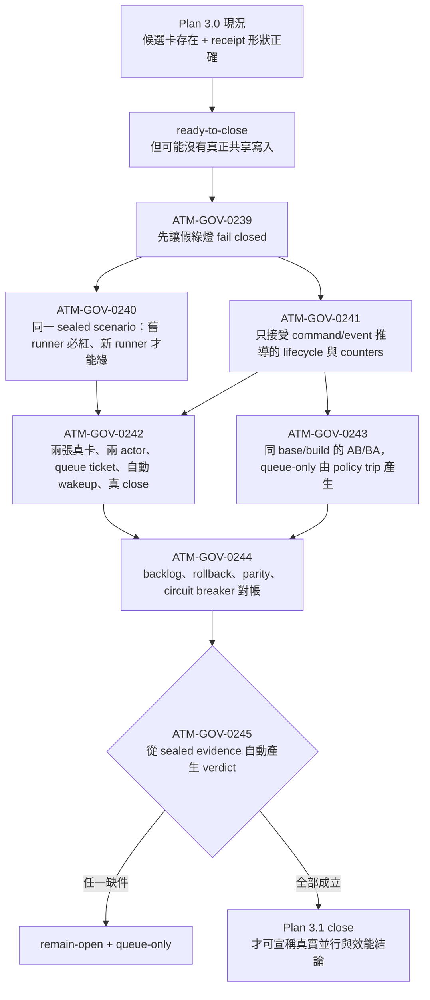

# ATM 3.0 真平行治理一致性與收官計畫

## 定位與決策

Plan 2.2 保留為歷史基線，停止新增工作。Plan 3.0 是唯一 active successor，只接管 2.2 未被真實證據滿足的驗收，以及 TASK-SKL-0014／0015 並行 dogfood 揭露的產品缺口。已驗證完成的 2.2 能力不重做；已關閉任務卡若與現場狀態矛盾，必須由 3.0 對帳、修復及重新驗證，不能引用舊 `done` 狀態跳過。

固定決策：

- 唯一正式票券模型仍為 `atm.brokerTicket.v1`，不得建立第二套 queue、BCR authorization 或平行任務模型。
- BCR、freeze、direction lock、queue view 都只能是 canonical ticket state 的可重建 projection 或不可變 receipt，不得各自持有可寫授權。
- helper、normalizer、scope inference 與 matcher 必須資料驅動；不得對 TASK-SKL-0014、TASK-SKL-0015、特定 actor、日期或三個歷史路徑寫控制流程特例。
- circuit breaker 預設開啟；安全、正確性或觀測門檻失敗即退回 `queue-only`。
- 歷史 0014／0015 可作 replay scenario 與證據標籤，但驗收引擎必須能接受任意兩張卡、任意 linked-surface graph 與任意共享資源集合。
- 不直接刪改 `.atm` runtime/history；舊 BCR 與 residue 僅能由正式 migrate/reconcile/cancel CLI 處理。
- 波次 B1 真平行施工開始前，所有缺少 canonical authority generation 與 dimension-preserving grant 的 legacy BCR 必須 fail closed 並回到正式 re-arbitration/ticket 路徑；不得刪改 sidecar，也不得用裸拒絕取代 ticket。
- 0226 census 開始前，所有 backlog finding 必須存在 canonical item shard；generated Markdown projection 不得是唯一資料來源。多卡 wave 開始前，protected governance state、runner-sync shared build 與 actor continuity 必須先通過 readiness gates。

## 問題陳述

0014／0015 的並行施工提供了高價值負向證據：broker 能找出三個 shared paths、建立三張 BCR、排定 serial release 並阻止未授權寫入；但整體仍不具線性一致性。

1. 三張 BCR 指定 0015 先發布，實際卻由 0014 先 delivery；兩卡關閉後 BCR 仍保留 `currentAllowedTaskId`，形成 stale authorization。
2. canonical ticket、queue、BCR、freeze 與 direction lock 是分離狀態來源，沒有同一個 CAS generation、transaction commit 或一致 reconcile。
3. 0015 的 scope amendment 不是因「範圍過大」，而是 linked/generated surface 未在 claim 前推導完成，直到 commit gate 才發現 `.agents/skills/atm-next/SKILL.md` 不在 direction lock。
4. runner-sync reservation 綁定過期 SHA 後，若同 task claim 仍 active，cleanup 會誤判健康；release 又要求不可能存在的 receipt，造成 queue-head deadlock。
5. runner-sync required command 使用不同 task-id normalizer，且缺少 temp claim 與 `--files` prerequisite，無法直接執行。
6. task import 的 fenced shell `#` 診斷曾錯誤；現有測試與 projection 已出現修復跡象，但 backlog 仍 Open，顯示 closeback reconciliation 也必須納入驗收。
7. `tasks import --reconcile-mirror` 曾回報成功但未修改 planning source；後續 `taskflow close` 要求 active claim，而終態任務又不可 claim，形成無合法 recovery 的循環。
8. 0014 closure packet 把其他並行 commit 的檔案納入 `targetCommitDelta`，使 changed-files、tree、parent、command-run 與 git-head evidence 全部不一致，直到 pre-push 才被 commit-range guard 攔下。
9. 既有 evidence 缺少可比較的 `waitedMs`、實際 overlap window、wakeup 次數、starvation 與 paired baseline，不能把負向 correctness 樣本誤稱為效能證明。
10. legacy BCR reader 將帶資源範圍的裁決壓縮成 foreign task-id set，claim admission 與 Git gate 因而可能把 file/path grant 放大成 task 級授權，錯誤抑制 atom CID 或其他維度的阻擋。
11. 歷史 evidence 曾出現 outer decision、`gateResults` 與 conflict detail 不一致；目前 source probe 已無法重現，但缺少 frozen/source 同源 closeback 與防回歸 counter。
12. circuit breaker 雖能退回 `queue-only`，既有門檻未量測非注入 trip 與 queue-only residency，可能在形式上安全、實際上長期序列化而仍被誤判完成。
13. 29 份現存 legacy BCR 都缺少 canonical `authorityGeneration`，但 reader 仍可把 `blockedTaskIds` 轉成 task 級授權；若等到 0233 才遷移，0228–0232 的自我 dogfood 會在已知不安全的授權路徑上執行。
14. legacy migration 若只有 apply 而沒有 immutable pre-migration receipt 與正式 rollback，revert code 後 runtime state 仍可能停在不可恢復的新格式。
15. replay 若可由 source/dev 入口單獨執行，可能重演 0206 的 source test 綠燈、frozen onefile 仍壞；驗收必須綁定 frozen launcher 與 runner digest。
16. overlap `> 0` 與 unresolved starvation `= 0` 目前只有存在性敘述；缺少預先 sealed 的 overlap/serialization 下限與 starvation threshold，就無法排除幾乎全序列化或人工判定。
17. 合成 replay 只能證明機制，不足以證明真實任務治理可用；最終 close 前還需要兩張未交付、故意保留交集的真實任務作 dogfood。
18. `ATM-BUG-2026-07-20-213` 至 `ATM-BUG-2026-07-21-218` 目前只有 generated Markdown rows、沒有 canonical item shards；下一次 projection rebuild 會讓 0014／0015 負向證據消失，0226 census 因而讀到錯誤基線。
19. 現行 `protected-ledger-destructive-guard` 實測仍為紅燈：tracked task-event deletion 未讓 task-scoped commit bundle fail closed。多卡 wave 中，一條 cleanup/commit lane 可能刪除另一張 live task 的 canonical ledger。
20. `taskflow close` 曾在 live ledger、target commit 與 planning closeback 都完成後仍回 `ATM_PLANNING_SOURCE_IDENTITY_DRIFT`；若 operator 依 failure 重試，會直接產生 duplicate side effect。
21. runner-sync queue-head actor 與 ambient editor identity 仍可能在 enqueue/build 間漂移；build command 若沒有 canonical actor manifest，五路 actor wave 會把合法 steward 誤判為 foreign actor。
22. backlog Open 不等於產品仍壞。current source discrimination 已證明 same-task evidence serialization、orphan imported-task claim、framework-temp admission 與 foreign dirty-owner probes 通過；這些項目需要 frozen parity/closeback，而非重複實作。

## 目標

- 讓一張 canonical ticket 成為 shared-write arbitration 的唯一 authority，並使所有 projection 可驗證、可重建、可撤銷。
- 在 claim/admission 前推導 linked surfaces，若施工中 scope graph 改變則自動 re-arbitrate，而非到 commit 才要求人工補 scope。
- 讓 stale SHA reservation 可在不偽造 receipt、不先釋放合法 task claim 的情況下 cancel、expire、coalesce 或 revalidate。
- 所有 recovery 以 `atm.commandManifest.v1` 的 `executable`、`argv[]`、`cwd`、allowlisted env、timeout 與 digest 表達，預設 `shell=false`。
- 以真多行程、獨立 actor、isolated proposal、共享 publish 重演 0014／0015 的故障形狀，證明零 stale authorization、零 silent overwrite、零 duplicate side effect、零 unresolved starvation。
- 在任何新 broker implementation 前先封存現行 frozen runner 的紅色鑑別力基線；同一 sealed scenario 必須在新版本轉綠。
- 以正式 frozen `node atm.mjs` 子行程完成 controlled replay 與真實交集任務 dogfood，並量測非零且達門檻的平行程度，而非只證明曾短暫重疊。
- 產出完整 window/watermark/sealed digest 與 paired queue-only 對照，才能關閉 3.0 及 2.2 的未完成驗收。
- 讓 backlog、task/event/evidence ledger 與 close transaction 本身先具備可重建、不可靜默刪除、可重試且 exactly-once 的證據基礎，避免用有 race 或假失敗的治理層驗證平行治理。

## 任務圖與執行順序

## Plan 3.1 證據可信度修復補充（2026-07-22）

### 補充定位

Plan 3.1 不是另一套產品或任務模型，而是 Plan 3.0 的後續驗收補充。它不重做已通過的 broker contract、legacy BCR fail-closed、runner recovery 與 validator scheduler；它專門修復「存在 receipt 就被視為已證明」的驗收漏洞。

2026-07-22 重新稽核證明，現行 `ready-to-close` 只檢查兩張候選卡與 420 份 command-shaped receipts，但 dogfood worker 實際只執行 `broker decision`，claim、proposal、compose、wakeup 與 close 為自報 lifecycle label；paired matrix 則以 arm-specific sleep 預先決定結果。因此本補充正式推翻 2026-07-22 的 protected closure `done` 判定，Plan 3.0/3.1 在 `ATM-GOV-0245` 關閉前維持 `active`。

### 主要差異流程卡



| 面向 | Plan 3.0 現行弱證據 | Plan 3.1 目標 |
|---|---|---|
| Dogfood | 選到兩張卡，執行 `broker decision`，後續步驟由程式附加文字 | 兩張 registered cards 真正 claim、保留交集、取得 ticket、queue/wakeup、proposal、compose、close |
| Admission | `not-required` 仍可被算為 parallel | parallel/serialized/queue-only 只能由 canonical ticket event 推導 |
| Correctness | 未提供 counter 就補 0 | 從事件差異、ticket state 與 side-effect journal 推導；不可用預填 0 |
| Performance | arm-specific sleep 與固定 cost | 同 sealed base/config/build，AB/BA 各至少 3 repeats，makespan/cost 從 command receipts 推導 |
| Red baseline | 在 fixture 內寫入 failure shape | 舊 frozen runner 實際失敗，新 frozen runner 使用同 digest 轉綠 |
| Final verdict | 呼叫端傳入空 backlog 與理想 boolean | verifier 自動讀取 ledger、backlog、rollback、parity、breaker 與 sealed evidence |

### Plan 3.1 任務圖

| 波次 | 任務卡 | 依賴 | 交付重點 |
|---|---|---|---|
| R1 | `ATM-GOV-0239` | 0234、0235 | 修正 closure truth gate；只有候選卡或 receipt 形狀不得 ready-to-close。 |
| R2A | `ATM-GOV-0240` | 0239 | 舊/新 frozen runner 同 scenario digest 的可鑑別紅綠基線。 |
| R2B | `ATM-GOV-0241` | 0239 | 定義事件推導 lifecycle、admission、waitedMs、wakeup、correctness counter receipt contract。 |
| R3A | `ATM-GOV-0242` | 0240、0241 | 以 0237/0238 為真卡樣本，完成真 queue/wakeup/shared-write/close dogfood。 |
| R3B | `ATM-GOV-0243` | 0240、0241 | 以真 ATM governance workload 完成 matched AB/BA benchmark。 |
| R4 | `ATM-GOV-0244` | 0242、0243 | 核銷 backlog 213–221，完成 rollback、source/frozen/release parity 與 breaker trip/reset drill。 |
| R5 | `ATM-GOV-0245` | 0244 | 建立單一 evidence aggregator，由 canonical 來源自動產生最終 verdict。 |

0240 與 0241 可在 0239 完成後並行；0242 與 0243 可在 receipt contract 穩定後並行。兩組並行都必須使用不交叉的私有輸出；只有共享 publish 表面由 canonical broker/composer 處理。

### Plan 3.1 完成門檻

- `broker replay status` 必須在現有弱證據下回 `remain-open`，且能指出缺少的 exact lifecycle/evidence class。
- 舊 frozen runner 與新 frozen runner 使用同一 scenario/assertion/threshold digest：舊版必紅，新版必綠；任一邊不成立即測試作廢。
- 0237/0238 由不同 actor 與 OS process 在真實 ledger 留下重疊 active interval，交集全程保留，至少一方有 canonical queue wait 與 automatic wakeup，兩卡最終 close。
- claim、ticket、proposal、compose、publish、wakeup、close 每一步都有實際 command/event receipt；純 lifecycle label 不具授權或驗收語意。
- AB/BA 使用同 sealed base/config/build，queue-only 由 policy CLI trip 產生，各至少 3 repeats；樣本不足或配對失敗只能 `inconclusive`。
- correctness counters、makespan、throughput、cost、queue residency 與 starvation 全部由同一組 sealed receipts 推導，不得使用預填 0、arm-specific delay 或固定 cost ratio。
- `ATM-BUG-2026-07-20-213`–`218` 與 `ATM-BUG-2026-07-21-219`–`221` 皆具有 canonical terminal disposition；deferred 必須有 owner card 與不阻擋 Plan 3.1 的理由。
- rollback drill、source/frozen/release parity、healthy breaker 零非注入 trip、故障 trip 與 passing-digest reset 全部有 command-backed receipt。
- `ATM-GOV-0245` 必須從 canonical 來源自動讀取 blocker，禁止呼叫端傳入理想 boolean 或空 backlog 清單來 close。

### Stop rule

任一舊/新 runner 無法用同 digest 對比、dogfood 沒有真 ticket wait/wakeup、AB/BA 無法使用同 build，或 correctness 仍需呼叫端預填時，立即停在 `remain-open + queue-only`，不得以「protected closure 已通過」作為 waiver。

## 2026-07-21 evidence repair closeback

## 2026-07-22 protected closure repair closeback

Plan 3.0 protected closure blockers were cleared by target repo evidence. The authoritative quick check is now:

```text
node atm.mjs broker replay status --json
```

Expected current result:

- `verdict: ready-to-close`
- `blockerCount: 0`
- dogfood candidates: `2/2`
- command-backed matrix: `420/420`

Validation evidence:

- `node atm.mjs broker replay dogfood --surface docs/governance/atm-3-replay-evidence.md --json`
- `node --strip-types scripts/run-paired-ab-v4.ts --mode command-backed`
- `node --strip-types scripts/run-paired-ab-v4.ts --mode validate`
- `node --strip-types tests/cli/plan3-evidence-closure-diagnostic.test.ts`
- `npm run typecheck`
- `node --strip-types scripts/run-validators.ts standard --run-id standard-plan3-repair-20260722 --json` => 87/87 passed

Architecture note for future maintainers: validator parallelism is governed by generic metadata (`executionMode`, `resourceProfile`, `resourceLocks`) and isolated rerun diagnostics. Add new shared fixtures by declaring resources in validator metadata, not by adding validator-specific branches to the runner.

Evidence limitation: the repaired evidence satisfies the protected closure checker, but the dogfood broker ticket state is `not-required`. Treat it as frozen CLI multiprocess receipt evidence, not as a queued shared-write wait benchmark.

本輪稽核推翻了「Plan 3.0 已完全收官」的先前結論：target ledger 中
`ATM-GOV-0234`／`ATM-GOV-0235` 雖曾標成 `done`，但原始證據不足以證明真實
平行開發與 >=25% 效能提升。Target repo 已新增 evidence-gate hardening：

- replay worker 不再以 `node atm.mjs --version` 冒充 broker dogfood；acceptance
  必須含 frozen `broker decision` command receipts。
- 沒有 serial/parallel makespan 時，throughput gain 不再預設為 `1.25`，而是
  `inconclusive`。
- final verdict 新增 evidence-derived helper；沒有 broker command receipts 或未
  達 420-cell matrix 時不得 close。
- `ATM-BUG-2026-07-21-222` 已由 target repo 修復為 runner-sync／batch-checkpoint
  recovery repair；這解除 pre-push／runner-sync deadlock 類 blocker，但不是 Plan 3
  close waiver。
- `ATM-BUG-2026-07-21-223` 已補上 validator resource-aware scheduler；`validate:standard`
  可平行執行，但必須依 `executionMode`、`resourceProfile`、`resourceLocks` 與
  `schedulerLane` 將 global fixture、runner-sync、release mirror、git worktree 等
  validator 放入 serial／isolated lanes，而不是把所有 validator 盲目併發。

2026-07-21T22:27:31+08:00 補充核對：

- target repo `main` local/remote SHA 一致：`b5242bc145e8e9d30953fd95ff70b0f122316a20`。
- `validate:standard` 的 current run `validator-resource-profile-standard-current`
  通過 87/87，耗時 755,881ms，且為 resource-aware parallel run。
- `node atm.mjs doctor --json` 通過；`node atm.mjs hook pre-push --base origin/main --head HEAD --json`
  通過，git-head evidence missing 為 diagnostic only。
- planning repo `master` 在本次 closeback repair 前 local/remote SHA 一致：
  `c708a30bfc62b34f14394f47e6e0676b33e441bc`。

2026-07-21T22:37:00+08:00 補充診斷：

- target repo 新增 fail-closed 診斷器 `scripts/diagnose-plan3-evidence-closure.ts`
  與測試 `tests/cli/plan3-evidence-closure-diagnostic.test.ts`，並推到
  `main@7c5780058af252365375f23da0e8693456bfdffe`。
- 診斷命令 `node --strip-types scripts/diagnose-plan3-evidence-closure.ts --json --allow-inconclusive`
  目前 verdict 為 `remain-open`，精確列出三個 blocker：
  1. real dogfood registered candidates 為 `0/2`；
  2. 沒有 public frozen `node atm.mjs broker replay ...` CLI surface；
  3. 現有 420 cells 中 `0/420` 具有 command/workload receipts。
- 因此 Plan 3.0 現在不再只是「等 validator 跑完」；卡點已可由診斷器直接重現與引用。

因此本計畫保持 `active`。`TASK-TMP-0004` 與 `TASK-ERR-0003` 已依 target ledger
closeback 標為 `done`；`ATM-GOV-0234` 與 `ATM-GOV-0235` 改回 `active`，等待真正的
420-cell command-backed matrix、真實未交付交集卡 dogfood、paired AB/BA performance
verdict、以及最終 source/target/remote closeout 核對後再收官。

| 波次 | 任務卡 | 依賴 | 交付與驗收 |
|---|---|---|---|
| R0 | `TASK-TMP-0004` | 無 | 將 projection-only 的 `-213` 至 `-218` 轉為 canonical backlog item shards，重建 projection；這是 0226 census 的資料完整性前置。 |
| A0 | `TASK-ERR-0003` | 無 | 註冊 Plan 3.0 使用的 exact ErrorCode 與 executable recovery contracts，包含授權維度不符；GOV 卡不得自行發明 code。 |
| A | `ATM-GOV-0226` | ERR-0003、TMP-0004 | 建立 divergence census、current-source discrimination、歷史證據封存、通用 replay scenario schema、backlog/closed-card 對帳矩陣，並依卡片 metadata 預配置 atom-map ownership。 |
| B0 | `ATM-GOV-0227` | 0226 | 定義 canonical arbitration authority、dimension-preserving grants 與 decision coherence；先讓無 generation/grant 的 legacy BCR fail closed，再開放後續真平行 wave。 |
| B0.5 | `ATM-GOV-0236` | 0227 | 修復 protected governance state destructive guard 與 close post-side-effect reconciliation；先消滅 ledger deletion 與 duplicate close side effect。 |
| B0.6 | `ATM-GOV-0230` | 0236 | 修復 stale reservation，並封證 terminal-task parity、foreign WIP preservation、framework-temp steward 與 single-build-steward contract。 |
| B0.7 | `ATM-GOV-0231` | 0230 | 統一 actor/task ID normalizer、runner actor continuity 與 command manifest recovery chain。 |
| B1 | `ATM-GOV-0228` | 0231 | 將 ticket 到 queue/freeze/direction lock/BCR view 的投影改為 CAS generation 與 crash-safe reconcile。 |
| B1 | `ATM-GOV-0229` | 0231 | 建立資料驅動 linked-surface closure graph 與 claim 前 scope preflight。 |
| B1 | `ATM-GOV-0232` | 0231 | 驗證 task-import／orphan claim／closeback repair，並對帳已完成但 backlog 未關項。 |
| D | `ATM-GOV-0233` | 0228、0229、0230、0231、0232、0236 | 整合完成/取消/失主/喚醒 exactly-once lifecycle、isolated index close、正式 BCR migration 與舊授權消費端遷移。 |
| E | `ATM-GOV-0234` | 0233、0232 | frozen-runner controlled replay、故障注入、paired queue-only 對照、兩張真實交集任務 dogfood 與 canonical telemetry seal。 |
| F | `ATM-GOV-0235` | 0234 | 重跑 census、readiness、circuit breaker、backlog 與 2.2 遺留並做最終 verdict。 |

`ATM-GOV-0227` 是 authority bootstrap gate；`0236 -> 0230 -> 0231` 是 execution-substrate readiness chain，都不得與 B1 implementation 同時開工。只有 TMP-0004 canonical backlog、0226 紅色基線、0227 legacy fail-closed、0236 protected-state/close-idempotency、0230 safe single-steward runner-sync 及 0231 actor continuity 全部以 frozen evidence 通過後，0228/0229/0232 才能用獨立 worktree/index/proposal 真平行施工；shared publish 只由 canonical composer/steward 執行。

## 公開介面

- 延用並收斂 `atm.brokerTicket.v1`：新增或明確化 `generation`、`authorityDigest`、`projectionDigests`、`releaseCondition`、`wakeupKey`、`waitedMs`、`ownerHealth`、`cancelReason`、`reconciledAt`，以及 dimension-preserving `authorizationGrants[]`。每筆 grant 包含 resource kind/dimension、normalized keys、operation、consumer gate 與 authority generation/digest；task id 只作關聯，不作獨立授權。
- 新增 `atm.brokerProjection.v1`：每份 queue/BCR/freeze/direction-lock view 都包含 ticket id、generation、authority digest、projection digest、watermark 與 terminal state；projection 不具有獨立授權語意。
- 新增 `atm.linkedSurfaceClosure.v1`：以 producer/consumer、template/projection/compiler/manifest/validator/build output 關係推導閉包，回 provenance、confidence、owner atom/map 與 re-arbitration requirement。
- 沿用 `atm.commandManifest.v1`：禁止 default-on 路徑輸出 shell command string；舊 `requiredCommand` 僅作一版 deprecated display，canonical action 為 argv manifest 或 ordered manifests。
- 新增 `atm.parallelReplayScenario.v1`：scenario 使用角色、capability、resource graph、fault schedule 與 assertions，不以固定 task id/path 驅動；另包含 `runnerEntrypoint`、`starvationThresholdMs`、threshold source、`minimumParallelOverlapRatio`、`maximumSerializedAdmissionRatio`，全部在 run 前 seal，禁止看到結果後調參。
- 所有 producer 使用 `atm.telemetryObservation.v1`，summary 必須有 window、watermark、sample count、runner digest、canonical behavior projection digest、parallel/serialized ratios、unavailable receipts 與 sealed digest。
- legacy migration 延用既有 broker migrate 命令族，新增 immutable pre-migration snapshot receipt 與 `broker migrate --rollback <receiptDigest>`；apply/rollback 都必須 exactly-once、可重試且保留 append-only audit。
- `TASK-ERR-0003` 登錄或明確重用 `ATM_PROTECTED_GOVERNANCE_STATE_DESTRUCTIVE_WRITE`：trigger 為未具精確 disposition authority 的 protected task/event/evidence deletion；category 為 governance integrity、retryable after reconcile、無 blanket human bypass，recovery 必須是 status/disposition command manifest。registry 與 generated docs 仍是唯一 ErrorCode authority。

## 正確性不變量

- `INV-ATM-008`：不同任務的 overlap 產生 execute/queue/batch ticket，不以 terminal refusal 代替 broker 仲裁。
- `INV-ATM-009`：控制流程不得硬編碼 actor、task、path、日期或單次 incident；資料 fixture 可以保存歷史標籤。
- 同一 ticket generation 最多一位有效 publisher；terminal ticket 不得再授權 write。
- BCR release order 與實際 publish order 必須來自同一 authority generation；若 generation 改變，所有舊 projection 立即失效。
- shared-write authorization 必須保留被仲裁的資源維度與 normalized resource keys；path、atom id、atom CID、surface 或 range 的 grant 只能授權同維度且同資源的操作，task id 不得單獨構成授權，也不得跨維度放大。
- outer decision、conflict matrix、gate result 與 conflict detail 必須來自同一 arbitration result；同一 generation 內不得同時宣告 clear 與 block/freeze。
- 缺少 canonical authority generation、dimension-preserving grant 或 terminal ticket linkage 的 legacy artifact 不得授權；reader 必須 fail closed 到 re-arbitration/ticket，而不是回傳 task-id entitlement。
- scope amendment 若新增 shared surface，必須在寫入前 re-arbitrate；禁止只補 direction lock 而不更新 ticket read/write set。
- cancel、adopt、close、publish、release、wakeup 與 migration 都必須可重試且 side effect exactly-once。
- migration apply/rollback 必須以同一 receipt generation 往返驗證；rollback 後 canonical state digest 必須等於 pre-migration digest，append-only audit metadata 除外。
- `queue-only` fallback 不得遺失現有 ticket、proposal 或 evidence；reset 必須引用新的 passing evidence digest，且長期停留 queue-only、非注入故障 trip 與 recovery latency 都必須可觀測。

## 驗證矩陣

### L0 紅色鑑別力基線

- 0226 在任何 broker implementation 前，以現行 frozen `node atm.mjs` 及隔離 fixture 執行 sealed scenario；至少重現 stale authorization、dimension-mismatched authorization 或 release-order divergence 中的已知失敗形狀。
- 若現行 frozen baseline 意外全綠，scenario 判定為 invalid/inconclusive，必須先修正 scenario 或證明故障已由既有版本消除；不得直接把綠燈當 Plan 3.0 成功。
- 同一 scenario digest、assertions 與 threshold policy 必須由 0234 在新 frozen runner 重跑並轉綠，才能證明測試具鑑別力。

### L1 單元與 schema

- ticket state machine、generation/CAS、terminal authorization、projection digest、dimension-preserving authorization grants。
- 成對 fixtures：file/path grant 不得抑制 atom CID block，atom grant 不得授權無關 path/surface；同維度同資源的有效 grant 必須授權，避免以全拒絕取得假綠燈；terminal/stale generation 一律不授權；outer decision 與 gate/conflict detail 必須一致。
- linked-surface graph closure、cycle handling、unsupported/unavailable provenance。
- actor/task normalizer、command manifest prerequisite chain、Windows argv rendering。
- Markdown fence state、source-line diagnostics、backlog reconciliation。
- protected governance path policy、tracked deletion guard、close post-side-effect journal/idempotency、same-task concurrent evidence preservation、orphan claim adoption 與 runner actor continuity。

### L2 Frozen-runner parity

- 0227、0236、0230、0231、0228、0229、0232、0233 在 close 前都必須完成正式 runner-sync build，並以相同 probe 分別取得 source 與 frozen `node atm.mjs` 結果。
- 比對 schema 定義的 canonical behavior projection digest；允許排除的非決定欄位必須由 schema allowlist 宣告，不得在 test 內臨時忽略差異。
- evidence 必須封存 source/frozen runner digest、projection digest 與 build receipt；source-only 或 `packages/*/dist` 綠燈不能滿足 acceptance。

### L3 Controlled 多行程破壞與 replay

- 同時 enqueue/publish/close、publisher 中止、失主 adopt、stale base、重複 wakeup。
- HEAD 連續移動、同 task 保持 active、舊 SHA 不可達、receipt 不存在。
- projection 寫到一半中止、CAS 衝突、Windows rename sharing violation、重複 migration。
- migration apply 後注入失敗並以 immutable receipt rollback；重複 apply/rollback 不得產生 duplicate side effect，round-trip state digest 必須一致。
- scope graph 在施工中新增 linked/generated surface，確認寫入前重新仲裁。
- tracked task/event/evidence deletion、同 task 兩個 evidence writers、close 在各 side-effect 邊界中止、foreign dirty source、terminal ghost queue head 與 enqueue/build actor identity drift。
- 0234 以 0226 的同一 sealed scenario 執行 controlled replay；每個 worker 都由 frozen `node atm.mjs` 啟動並封存 runner digest，source/dev replay 只能作輔助。
- `maxConcurrentWorkers >= 2`、observed overlap window `> 0`、`parallelAdmissions > 0`，且 canonical closure scenario 的 `parallelOverlapRatio >= 0.30`、`serializedAdmissionRatio <= 0.70`。
- starvation 以 scenario 預先 sealed 的 `starvationThresholdMs` 判定，threshold source 必須引用 policy 或 paired queue-only baseline；任何 eligible ticket 超過閾值且沒有 terminal/recovery disposition即計入 unresolved starvation。
- BCR/projection release order 等於 observed publish order，terminal 後 active authorization 為 0；stale reservation 可處置且 queue 繼續前進，不需偽造 receipt 或釋放無關 claim。
- escaped conflict、silent overwrite、duplicate side effect、unresolved starvation、stale authorization、dimension-mismatched authorization、decision contradiction 均為 0。

### L4 真實任務 dogfood

0234 另選兩張真實、未交付、故意保留 declared intersection 的 registered tasks，由兩個獨立 OS process/actor 與 Captain 施工；task selection 依 capability/resource graph，不在控制流程預先列 id/path。要求：

- 每個 worker 都由 frozen `node atm.mjs` 啟動，shared surfaces 全數有 canonical ticket，並另有 disjoint private work。
- scope amendment 不得首次出現在 commit gate；若 runtime graph 新增 surface，必須留下 pre-write re-arbitration receipt。
- 真實 dogfood 不得用 scope amendment 移除原先 declared intersection；只允許新增 linked surface，且必須 pre-write re-arbitrate。兩位 Captain 都必須取得 execute/queue/batch ticket，不得收到 terminal refusal；queued lane 必須由 successor wakeup 自動前進。
- 兩張真實卡的 closure packet 不得混入對方 changed files；全程不得手改 `.atm`、偽造 receipt、使用 `--no-verify` 或人工釋放他人 claim。
- 兩卡 terminal 後 active authorization 為 0，且 L3 的七個 correctness counters 與 ratio/starvation assertions 同樣適用。

### L5 Paired A/B 效能與觀測

- 與相同 sealed base/config/build 的 queue-only 進行 AB/BA paired runs，至少 3 repeats；queue-only arm 必須由 policy CLI trip 產生，不得換另一份 build。correctness 與 performance 必須來自同一組有效 sealed cells；不足樣本只能 `inconclusive`，且 0235 不得 close。
- median makespan 與 active throughput 沿用 2.2 門檻：各改善至少 25%；production cost ratio 不高於 1.10。
- 所有 shared-write producer observed coverage 100%；每份 task summary 有 window/watermark/sealed digest。
- 必填數據：enqueue/dequeue/publish timestamps、`waitedMs`、overlap duration、wakeup count、revalidation count、scope amendment phase、terminal authorization count、`breakerTripCount`、`unexpectedBreakerTripCount`、`timeInQueueOnlyMs`、`timeInQueueOnlyRatio`、trip reason 與 recovery latency。
- healthy replay segment 要求 `unexpectedBreakerTripCount = 0` 且 `timeInQueueOnlyRatio = 0`；fault-injection segment 的每次 trip 必須對應已注入原因、保留 evidence，並以較新的 passing digest 完成 recovery。

## 0014／0015 Replay Preflight

| 歷史失敗 | Primary closure owner | Supporting cards | 修復後預期 |
|---|---|---|---|
| 三張 BCR 與 publish order 不一致 | 0233 | 0227、0228 | BCR 只投影同一 ticket generation；不可能保留不同 release authority。 |
| file/path 裁決被放大成 task 級授權並抑制 atom CID block | 0233 | 0227、ERR-0003 | ticket grant 保留資源維度與 keys；所有 CLI 消費端逐維度比對，task id 不再單獨授權。 |
| 兩卡 done 後仍有 `currentAllowedTaskId` | 0233 | 0228 | terminal transition 原子撤銷所有 projection；reconcile 將 stale view fail closed 並遷移。 |
| linked skill projection 到 commit 才要求 scope amendment | 0229 | 0226 | claim 前 closure graph 列出 template/compiler/validator/projection/manifest；新增 surface 在 write 前 re-arbitrate。 |
| stale SHA queue-head 無 receipt 可釋放 | 0230 | 0233 | 以 reachability、generation 與 owner health判定 cancel/expire/revalidate，不要求完成 build receipt。 |
| required command task id 不一致且缺 prerequisite | 0231 | ERR-0003 | 單一 normalizer；ordered command manifests 包含 temp claim、files、enqueue/build/release。 |
| fenced `#` parser 與 backlog 狀態分歧 | 0232 | 0226 | fixture 驗證真實 parser；功能已修則以 evidence 關 backlog，未修才改 code。 |
| mirror reconcile 成功但未寫入，終態 repair 又要求不可取得的 claim | 0232 | ERR-0003 | reconcile 驗證宣告 mirror 的實際 mutation；終態 closeback 使用專責 repair authority，不依賴 active work claim。 |
| closure packet 混入並行 commit 的檔案與 tree/evidence | 0233 | 0226、0228 | packet 由 task-owned commit slice 與同 generation git-head evidence封裝；pre-close 即驗證 changed-files/tree/parent/commands。 |
| 無 waitedMs/overlap/wakeup paired data | 0234 | 0235 | 真多行程 sealed telemetry 與 queue-only paired verdict。 |
| breaker 頻繁退回 queue-only 但不被完成門檻看見 | 0234 | 0235 | 健康 replay 禁止非注入 trip，封存 trip count、queue-only residency 與 recovery latency。 |
| outer decision 與 gate/conflict detail 自相矛盾的歷史疑點 | 0226 | 0227、0234 | frozen/source probe 先判定現況；已修則 closeback `-213`，未修才交由 canonical arbitration contract 修復。 |
| legacy BCR 在 0233 前仍可 task-level 授權 | 0227 | 0226、0233 | 0226 先封紅色基線；0227 讓缺 generation/grant 的 artifact fail closed，0233 再正式遷移。 |
| migration apply 後無合法逆向 recovery | 0233 | 0227、0235 | immutable pre-migration receipt、正式 rollback CLI 與 round-trip digest。 |
| source replay 綠燈但 frozen onefile 仍壞 | 0234 | 0227、0236、0230、0231、0228、0229、0232、0233、0235 | worker 強制由 `node atm.mjs` 啟動並封 runner digest；canonical behavior projection parity。 |
| 合成 replay 無法證明真實開發可用 | 0234 | 0235 | 兩張未交付且故意有交集的真實任務完成正式 claim/ticket/wakeup/close，全程不得移除原始交集。 |
| `-213` 至 `-218` 只有 projection row、重建會消失 | TMP-0004 | 0226、0235 | 六份 canonical item shards 先落地；projection rebuild deterministic，projection-only count 為 0。 |
| cleanup／commit bundle 可刪 live task ledger | 0236 | ERR-0003、0234 | schema-driven protected path policy 在 mutation 前阻擋，合法 lifecycle 更新仍通過。 |
| close side effects 全成卻回 failure | 0236 | 0233、0234 | side-effect journal 辨識 completed/reconciled；重試不重複 commit、closeback、push 或 wakeup。 |
| runner-sync actor 在 enqueue/build 間漂移 | 0231 | 0230、0234 | ordered manifest 攜帶 queue-head actor；ambient editor identity 不覆蓋 authority。 |
| frozen/source shared-build、terminal ghost task 或 foreign WIP 破壞 B1 | 0230 | 0231、0234 | single build steward、terminal parity、foreign digest preservation 與 framework-temp admission 在 B1 前通過。 |
| backlog Open 但 source 已有 passing regression | 0226 | owning card、0235 | current source/frozen discrimination；已修只 closeback，仍紅才改 code，避免重複修復。 |

結構 preflight 的判定是「所有已知故障都有唯一 owner 與可執行 acceptance，依賴圖無循環」；它不代表現行 ATM 已通過 replay。只有 0226–0234 的產品交付與真實證據完成後，0235 才能判定 solved。

## 2026-07-21 第二輪 Review Disposition

| 建議 | 判定 | 融合方式 |
|---|---|---|
| G1 legacy BCR exposure window | 接受，P0 | 0226 先封 L0 紅色基線；0227 成為 B0 safety gate，讓缺 generation/grant 的 artifact fail closed；B1 依賴改到 0227。 |
| G2 migration rollback | 接受 | 0233 新增 immutable pre-migration receipt、正式 rollback CLI、apply/rollback exactly-once 與 round-trip digest。 |
| G3 replay execution carrier | 接受並修正做法 | 0234 worker 強制使用 frozen `node atm.mjs`；不用 raw JSON bitwise compare，改用 schema-defined canonical behavior projection digest，避免時間戳等合法欄位造成假差異。 |
| G4 parallelism degree | 接受 | scenario 加入 run 前 sealed ratios；canonical closure profile 要求 overlap ratio >=0.30、serialized ratio <=0.70，correctness/performance 使用同一 cells。 |
| G5 starvation definition | 接受 | scenario 宣告 `starvationThresholdMs` 與 policy/paired-baseline source；超時且無 terminal/recovery disposition 才計數。 |
| G6 staleReleases reporting | 接受 | 0230 acceptance 明確要求 reported count、entries、mutation ids 一致。 |
| G7 real development evidence | 接受，不新增純證據卡 | 0234 增加 L4 real-task dogfood segment；新增的 0236 是有 live red test 的產品 readiness gate，不是證據轉交卡。 |
| L0/L1/L2/L3/L4/L5 layered proof | 接受 | 驗證矩陣改為紅色基線、成對 fixture、frozen parity、controlled replay、真實 dogfood、paired A/B 六層。 |

本 amendment 不新增 task series、ticket model 或第二套 evidence authority。

## 2026-07-21 Backlog Readiness Review Disposition

| 分類 | Exact items | 判定與 owner |
|---|---|---|
| census 資料完整性 blocker | `ATM-BUG-2026-07-20-213` 至 `ATM-BUG-2026-07-21-218` | `TASK-TMP-0004` 必須先補 canonical shards，再允許 0226。 |
| current red、B1 前必修 | `ATM-BUG-2026-07-19-045`、`ATM-BUG-2026-07-19-015`、`ATM-BUG-2026-07-20-208` | 0236 修 protected ledger/close idempotency；0231 修 actor continuity。 |
| runner substrate 必須在 B1 前證明 | `ATM-BUG-2026-07-14-183`、`-184`、`ATM-BUG-2026-07-19-011`、`-046`、`ATM-BUG-2026-07-20-209`、`-214` | 0230 從 B1 移到 prelude；已修 probe 只 closeback，仍紅才修。 |
| current source 已通過、不得重做 | `ATM-BUG-2026-07-19-018`、`-012`、`-014`、`ATM-BUG-2026-07-19-046` 的現行 covered branches | 0226/0232/0230 補 frozen parity 與 item closeback；若 frozen 不同才回 owning card。 |
| B1 後、真 replay 前必修 | `ATM-BUG-2026-07-13-161` | 0233 isolated index／canonical index lease；0234 前必須完成。 |

不另建「Plan 2.9」或第二份 readiness 計畫。資料修復由合法 TMP family 承擔，產品修復留在 Plan 3.0 GOV DAG，避免兩份計畫同時宣告 closure authority。

## 2026-07-21 Authoring Preflight 結果

### 計畫與任務卡

- `TASK-TMP-0004`、`TASK-ERR-0003`、`ATM-GOV-0226` 至 `ATM-GOV-0236` 共 13 張卡全部通過 dry-run import：每卡 task count 1、manifest diagnostics 0、errors 0、warnings 0。
- 新 DAG 無 missing dependency 且 acyclic；topological order 為 TMP-0004/ERR-0003 -> 0226 -> 0227 -> 0236 -> 0230 -> 0231 -> 0228/0229/0232 -> 0233 -> 0234 -> 0235。
- 新 B1 只含 0228/0229/0232，exact/glob-containment scope overlap count = 0；0230/0231 已提前成 shared-build/identity readiness。
- 0226 先依所有卡片 metadata 預配置 atom-map ownership；後續平行卡的 `mapUpdates` 為空，避免共享 map shard 變成未宣告寫入面。
- UTF-8 touched guard 通過，沒有 BOM、U+FFFD 或 mojibake。

### 現行產品基線

- `task-import-diagnostic-contract` 與 `task-import-canonical-id-boundary` 測試通過；`validate:skill-templates` 亦通過 17 source templates 與 5 adapters。`ATM-BUG-2026-07-20-216` 與 `ATM-BUG-2026-07-21-217` 很可能是已修功能但未 closeback，須由 0226/0232 以 frozen/source evidence 正式對帳。
- parallel admission 現為 `mode=enforce`、`fallbackMode=queue-only`、circuit breaker enabled；這一層已存在，不需重建。
- runner-sync queue 此刻為 0，只表示現場已清空，不證明 stale SHA lifecycle 已修。CLI help 仍沒有正式 cancel/expire/revalidate action。
- runtime 仍有 29 份 legacy BCR sidecar 帶 `currentAllowedTaskId`，且全部缺少 canonical `authorityGeneration`；現行 reader 仍可回傳 `blockedTaskIds`。0226 必須先封存紅色基線，0227 必須在 B1 前令其失去獨立授權能力，0233 再以正式 migrate/rollback 處置。
- runner-sync task id 兩個 emitter 對目前 dotted actor 已產生相同結果，但仍各自維護 regex，對連續非允許字元可能漂移；`buildRunnerSyncEnqueueCommand` 仍只輸出 enqueue，沒有 temp claim 與 `--files` prerequisite chain。因此 `ATM-BUG-2026-07-21-218` 仍是 live generic gap。
- 本次 current-source discrimination：`scripts/validate-evidence-command-runs.ts`、`next-claim-orphaned-in-progress`、`runner-sync-framework-temp-hotfix`、`runner-sync-foreign-dirty-owner` 通過；`protected-ledger-destructive-guard` 失敗於 expected false/actual true。前四項先列 frozen parity/closeback，最後一項由 0236 保留紅色 baseline 並修復。

### Preflight Verdict

- **Plan coverage: PASS**。新揭露的 canonical backlog、protected ledger、close idempotency、runner actor continuity 都有唯一 owner；13 張卡 import、DAG、B1 scope 與 15-file encoding 驗證通過。
- **Current product replay: FAIL**。文件與任務卡本身不等於產品修復；在 0227、0236、0230、0231 與後續 implementation cards 完成前重演，仍可能遇到 stale BCR authorization、protected ledger deletion、close duplicate side effect、runner-sync stale reservation 無合法終止及不完整 recovery chain。
- **Post-plan expectation: conditionally solvable**。只有 L0 紅色基線能由同 scenario 在新 frozen runner 轉綠、0234 controlled replay 與真實交集任務 dogfood 都通過、正確性七個零值與完整 telemetry 成立，且 0235 circuit breaker/closure 通過，才可回答「並行開發已解決所有已知問題」。

## 完成門檻

`ATM-GOV-0235` 只有在下列條件全部成立時才能關閉：

- 0226 census 的每個 divergence 都有 terminal disposition 與 evidence digest。
- `TASK-TMP-0004` 已 target-close，canonical backlog item shards 完整且 projection-only count = 0；`ATM-GOV-0236` 已 target-close，protected ledger 與 close retry fault matrix 通過。
- 0226 現行 frozen 紅色基線有效，且 0227 fail-closed guard 在任何 B1 平行 claim 前已部署並以 frozen runner 證明 legacy active authorization 為 0。
- 0227、0236、0230、0231、0228、0229、0232、0233 的 source、frozen runner、release artifacts 與 adopter projection parity 全數通過。
- 0233 migration apply/rollback round-trip、exactly-once 與 immutable receipt 通過。
- 0234 controlled replay、真實交集任務 dogfood 與 paired A/B 全部有效，不能以 deterministic fixture 或移除 declared intersection 取代。
- correctness 七個零值成立，observed coverage 100%，沒有 active stale BCR/ticket/direction-lock authorization。
- `parallelOverlapRatio >= 0.30`、`serializedAdmissionRatio <= 0.70`，且 unresolved starvation 由 pre-sealed threshold 自動判定。
- healthy replay 沒有非注入 breaker trip 且 queue-only residency 為 0；故障演練能自動 trip 到 `queue-only`，並只能以新的 passing evidence digest reset。
- 2.2 未完成驗收被逐項映射為 `satisfied`、`superseded-with-evidence` 或仍 `open`；只要有一項 open，3.0 保持 active。

## Out Of Scope

- 不重寫已驗證完成的 2.2 功能，不重新建立 batch/ticket/task 模型。
- 不把 Git branch/worktree merge 變成正式平行 lane。
- 不為單一 skill、actor 或三個歷史 shared paths 增加特例。
- 不以人工刪除 `.atm` 狀態、偽造 receipt、`--no-verify` 或 waiver 取得綠燈。
- 不在本計畫擴張 Python adapter、無關 UI、定價或其他 ATM 全域 backlog。

## Rollback

任何 default-on 變更失敗時，以 policy CLI `trip` 回 `queue-only`，保留 ticket/proposal/evidence 並停止新 compose publish。程式回退使用 revert commit；0227 legacy fail-closed guard 不得因回退而重新啟用無 generation/grant 的授權。runtime disposition 使用正式 reconcile/migrate/cancel 命令，不直接改 JSON。0233 migration 在 apply 前必須產生 immutable snapshot receipt，並可用 `broker migrate --rollback <receiptDigest>` exactly-once 復原 canonical state；沒有 passing rollback drill 不得 rollout。Plan 3.0 不回寫或抹除 2.2 歷史證據。

## 2026-07-21 Protected Closure Repair Update - validator scheduler and replay surface

Target repo framework `main@8920995675ada7c26786cacaa09ae2321e34b6ab` is pushed and verified against `origin/main`. This repair resolves the prior public frozen replay CLI gap and the validator orchestration ambiguity without closing Plan 3.0.

Evidence now available:

- Frozen `node atm.mjs broker replay status --json` exists and fail-closes with `verdict: remain-open`. Remaining blockers are exactly: real dogfood registered candidates `0/2`, and command-backed 420-cell matrix `0/420`.
- `validate:standard` run `standard-20260721232112` completed `87/87 passed`. The runner now emits `atm.validatorSchedulerDiagnostics.v1` and distinguishes parallel-only resource contention from true validator failure via isolated rerun.
- The observed `validate-tasks-surface` failure was classified as `true-validator-failure`, not resource contention. The generic repair changed the release artifact authority rule: runtime values are checked from release dist JS; type/source contract is checked from the root-drop TypeScript source, because current package build does not promise per-module `.d.ts` files.

Plan 3.0 remains active. The public frozen replay surface and standard validator orchestration are no longer blockers, but 0234/0235 cannot close until real two-card dogfood and command-backed 420-cell performance evidence exist.

<!-- atmPlanningCreationSeal {"schemaId":"atm.planningCreationSeal.v1","command":"atm plan doc create","createdAt":"2026-07-21T01:19:26.105Z","planningRoot":"C:/Users/User/3KLife/docs/ai_atomic_framework","relativePath":"governance-optimization/end-to-end-auto-batch-performance-plan-v3.md","contentDigest":"sha256:77768264cb2be6c40233560fd4b46d7a5c9fb8bf04dabf1c9d6ae862a002c927"} -->
