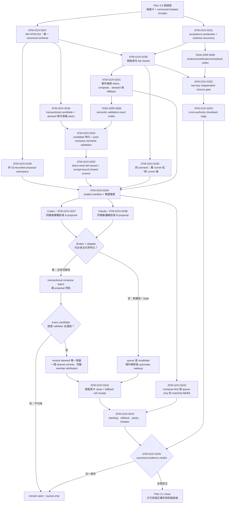

# ATM 3.0 真平行治理一致性與收官計畫

## 定位與決策

Plan 2.2 保留為歷史基線，停止新增工作。Plan 3.0 是唯一 active successor，只接管 2.2 未被真實證據滿足的驗收，以及 TASK-SKL-0014／0015 並行 dogfood 揭露的產品缺口。已驗證完成的 2.2 能力不重做；已關閉任務卡若與現場狀態矛盾，必須由 3.0 對帳、修復及重新驗證，不能引用舊 `done` 狀態跳過。

固定決策：

- 唯一正式票券模型仍為 `atm.brokerTicket.v1`，不得建立第二套 queue、BCR authorization 或平行任務模型。
- BCR、freeze、direction lock、queue view 都只能是 canonical ticket state 的可重建 projection 或不可變 receipt，不得各自持有可寫授權。
- helper、normalizer、scope inference 與 matcher 必須資料驅動；不得對 TASK-SKL-0014、TASK-SKL-0015、特定 actor、日期或三個歷史路徑寫控制流程特例。
- circuit breaker 預設開啟；安全、正確性或觀測門檻失敗即退回 `queue-only`。
- 歷史 0014／0015 可作 replay scenario 與證據標籤，但驗收引擎必須能接受任意兩張卡、任意 linked-surface graph 與任意共享資源集合。
- 不直接刪改 `.atm` runtime/history；舊 BCR 與 residue 僅能由正式 migrate/reconcile/cancel CLI 處理。
- 波次 B1 真平行施工開始前，所有缺少 canonical authority generation 與 dimension-preserving grant 的 legacy BCR 必須 fail closed 並回到正式 re-arbitration/ticket 路徑；不得刪改 sidecar，也不得用裸拒絕取代 ticket。
- 0226 census 開始前，所有 backlog finding 必須存在 canonical item shard；generated Markdown projection 不得是唯一資料來源。多卡 wave 開始前，protected governance state、runner-sync shared build 與 actor continuity 必須先通過 readiness gates。

## 問題陳述

0014／0015 的並行施工提供了高價值負向證據：broker 能找出三個 shared paths、建立三張 BCR、排定 serial release 並阻止未授權寫入；但整體仍不具線性一致性。

1. 三張 BCR 指定 0015 先發布，實際卻由 0014 先 delivery；兩卡關閉後 BCR 仍保留 `currentAllowedTaskId`，形成 stale authorization。
2. canonical ticket、queue、BCR、freeze 與 direction lock 是分離狀態來源，沒有同一個 CAS generation、transaction commit 或一致 reconcile。
3. 0015 的 scope amendment 不是因「範圍過大」，而是 linked/generated surface 未在 claim 前推導完成，直到 commit gate 才發現 `.agents/skills/atm-next/SKILL.md` 不在 direction lock。
4. runner-sync reservation 綁定過期 SHA 後，若同 task claim 仍 active，cleanup 會誤判健康；release 又要求不可能存在的 receipt，造成 queue-head deadlock。
5. runner-sync required command 使用不同 task-id normalizer，且缺少 temp claim 與 `--files` prerequisite，無法直接執行。
6. task import 的 fenced shell `#` 診斷曾錯誤；現有測試與 projection 已出現修復跡象，但 backlog 仍 Open，顯示 closeback reconciliation 也必須納入驗收。
7. `tasks import --reconcile-mirror` 曾回報成功但未修改 planning source；後續 `taskflow close` 要求 active claim，而終態任務又不可 claim，形成無合法 recovery 的循環。
8. 0014 closure packet 把其他並行 commit 的檔案納入 `targetCommitDelta`，使 changed-files、tree、parent、command-run 與 git-head evidence 全部不一致，直到 pre-push 才被 commit-range guard 攔下。
9. 既有 evidence 缺少可比較的 `waitedMs`、實際 overlap window、wakeup 次數、starvation 與 paired baseline，不能把負向 correctness 樣本誤稱為效能證明。
10. legacy BCR reader 將帶資源範圍的裁決壓縮成 foreign task-id set，claim admission 與 Git gate 因而可能把 file/path grant 放大成 task 級授權，錯誤抑制 atom CID 或其他維度的阻擋。
11. 歷史 evidence 曾出現 outer decision、`gateResults` 與 conflict detail 不一致；目前 source probe 已無法重現，但缺少 frozen/source 同源 closeback 與防回歸 counter。
12. circuit breaker 雖能退回 `queue-only`，既有門檻未量測非注入 trip 與 queue-only residency，可能在形式上安全、實際上長期序列化而仍被誤判完成。
13. 29 份現存 legacy BCR 都缺少 canonical `authorityGeneration`，但 reader 仍可把 `blockedTaskIds` 轉成 task 級授權；若等到 0233 才遷移，0228–0232 的自我 dogfood 會在已知不安全的授權路徑上執行。
14. legacy migration 若只有 apply 而沒有 immutable pre-migration receipt 與正式 rollback，revert code 後 runtime state 仍可能停在不可恢復的新格式。
15. replay 若可由 source/dev 入口單獨執行，可能重演 0206 的 source test 綠燈、frozen onefile 仍壞；驗收必須綁定 frozen launcher 與 runner digest。
16. overlap `> 0` 與 unresolved starvation `= 0` 目前只有存在性敘述；缺少預先 sealed 的 overlap/serialization 下限與 starvation threshold，就無法排除幾乎全序列化或人工判定。
17. 合成 replay 只能證明機制，不足以證明真實任務治理可用；最終 close 前還需要兩張未交付、故意保留交集的真實任務作 dogfood。
18. `ATM-BUG-2026-07-20-213` 至 `ATM-BUG-2026-07-21-218` 目前只有 generated Markdown rows、沒有 canonical item shards；下一次 projection rebuild 會讓 0014／0015 負向證據消失，0226 census 因而讀到錯誤基線。
19. 現行 `protected-ledger-destructive-guard` 實測仍為紅燈：tracked task-event deletion 未讓 task-scoped commit bundle fail closed。多卡 wave 中，一條 cleanup/commit lane 可能刪除另一張 live task 的 canonical ledger。
20. `taskflow close` 曾在 live ledger、target commit 與 planning closeback 都完成後仍回 `ATM_PLANNING_SOURCE_IDENTITY_DRIFT`；若 operator 依 failure 重試，會直接產生 duplicate side effect。
21. runner-sync queue-head actor 與 ambient editor identity 仍可能在 enqueue/build 間漂移；build command 若沒有 canonical actor manifest，五路 actor wave 會把合法 steward 誤判為 foreign actor。
22. backlog Open 不等於產品仍壞。current source discrimination 已證明 same-task evidence serialization、orphan imported-task claim、framework-temp admission 與 foreign dirty-owner probes 通過；這些項目需要 frozen parity/closeback，而非重複實作。

## 目標

- 讓一張 canonical ticket 成為 shared-write arbitration 的唯一 authority，並使所有 projection 可驗證、可重建、可撤銷。
- 在 claim/admission 前推導 linked surfaces，若施工中 scope graph 改變則自動 re-arbitrate，而非到 commit 才要求人工補 scope。
- 讓 stale SHA reservation 可在不偽造 receipt、不先釋放合法 task claim 的情況下 cancel、expire、coalesce 或 revalidate。
- 所有 recovery 以 `atm.commandManifest.v1` 的 `executable`、`argv[]`、`cwd`、allowlisted env、timeout 與 digest 表達，預設 `shell=false`。
- 以真多行程、獨立 actor、isolated proposal、共享 publish 重演 0014／0015 的故障形狀，證明零 stale authorization、零 silent overwrite、零 duplicate side effect、零 unresolved starvation。
- 在任何新 broker implementation 前先封存現行 frozen runner 的紅色鑑別力基線；同一 sealed scenario 必須在新版本轉綠。
- 以正式 frozen `node atm.mjs` 子行程完成 controlled replay 與真實交集任務 dogfood，並量測非零且達門檻的平行程度，而非只證明曾短暫重疊。
- 產出完整 window/watermark/sealed digest 與 paired queue-only 對照，才能關閉 3.0 及 2.2 的未完成驗收。
- 讓 backlog、task/event/evidence ledger 與 close transaction 本身先具備可重建、不可靜默刪除、可重試且 exactly-once 的證據基礎，避免用有 race 或假失敗的治理層驗證平行治理。

## 任務圖與執行順序

## Plan 3.1 證據可信度與 compose-first 修復補充（2026-07-22）

### 補充定位

Plan 3.1 不是另一套產品或任務模型，而是 Plan 3.0 的後續驗收補充。它不重做已完成的 intent、proposal、adapter、transactional composer、steward writer、ticket policy 與 shared-delivery 實作；它修復的是「測試沒有真正走過這些協定，卻因 receipt 形狀存在而被視為已證明」的驗收漏洞。`ATM-GOV-0239` 至 `ATM-GOV-0254` 都沿用既有 GOV family，並作為 0234／0235 歷史交付後的 continuation repair lineage，不建立新的 task series 或 evidence authority。

本次事故的因果、反證、Five Whys 與組織學習收官門檻記錄於 [Plan 3.0 假綠燈收官 Lessons Learned](plan-3-0-false-green-lessons-learned-2026-07-22.md)。該文件判定治理機制、可執行驗收契約與 AI 執行行為共同造成偏差；Plan 3.1 的目標不是要求隊長靠記憶避免重犯，而是讓缺少真實語意證據的 closure 在系統上只能 `inconclusive`／`remain-open`。

跨隊長實作請以 [Plan 3.1 Captain Handoff](ATM-GOV-3.1-captain-handoff-2026-07-22.md) 的 dependency-gated dispatch waves 為操作入口；該 handoff 只投影本計畫與 source cards 的依賴，不另建 task lifecycle 或 closure authority。

2026-07-22 dogfood 仲裁新增 `ATM-BUG-2026-07-22-229`：`tasks release` 不得在任務仍有 in-scope source dirty WIP 時把 claim 釋放成 ownerless 工作區狀態。Plan 3.1 不採用 stash 或 temp worktree 作為主路徑；MVP 收斂為 fail-close recovery：完成並 close、broker-managed governed non-delivery WIP commit 後 release、或明確 discard receipt 後 release。WIP commit 必須明確標記為不可 close／不可 release／不可滿足 evidence，且不能被 delivery-grade full typecheck/pre-commit gate 擋死；它仍須保留 scope、actor、index isolation、protected-state 與 line-budget/split 防護。`ATM-GOV-0258` 必須把此 recovery 納入 transactional commit queue 驗收；`ATM-GOV-0245` 在 229 仍無 command-backed 證據前不得給出 global close verdict。

2026-07-22 Antigravity/Gemini 3.6 dogfood 再揭露 `ATM-GOV-0259`：ATM 目前主要在 commit／close 階段治理 scope，無法在 AI 寫檔前阻止或導引 out-of-scope 意圖；因此外部隊長可先手改 `.atm/history/**` 或修改卡外 source，之後才由總隊長人工辨識。Plan 3.1 新增 write-ticket/editor guard 與 scope amendment workflow：scope 外寫入不是立即定罪，而是先回 `ATM_WRITE_SCOPE_AMENDMENT_REQUIRED`；若已寫入則記為 `ATM_WRITE_SCOPE_UNATTACHED_WIP` 並要求 scope-amend-and-attach、non-delivery WIP commit、discard receipt 或 split-to-new-task；只有繞過這些路徑仍要 commit/close/push 才升級為 `ATM_WRITE_TICKET_SCOPE_VIOLATION`。
2026-07-22 codebase 對帳確認，`WriteIntent` 已能攜帶 atom、content anchor 與 source range；同一物理檔案會先由 proposal overlap、format adapter、mutation batch planner 與 transactional composer 判斷是否可交換／可序列化。可合併的同檔案 proposals 進入同一 compose batch，由 neutral steward 一次落到 canonical worktree 並以 shared delivery receipt 歸屬給所有成員；只有真正的 CID／anchor／range 衝突、stale base／CAS、無法解析的格式或 fairness bound 才退回 revalidation、steward escalation 或 queue。因此「同檔案必然 queue」不是 Plan 3.1 的前提，也不能成為驗收答案。

本補充新增四個架構判準：刻意保留交集卻得到 `not-required` 屬於 `INV-ATM-008`；控制流程硬編碼 actor、task、path、日期、delay 或 cost 屬於 `INV-ATM-009`；正常平行開發以單一 canonical worktree 與邏輯 intent 隔離為基底、不得以 Git branch/worktree 當並行治理機制，另立 `INV-ATM-010`；evidence producer 與 closure oracle 必須分離，最終 verdict 從 canonical sources 重建，禁止呼叫端注入健康值。`INV-ATM-010` 新增而不併入 008，因 008 定義仲裁結果，010 定義仲裁成立所需的執行基底，兩者必須保持低耦合。

Git 僅位於 ATM 外層 delivery boundary：steward 完成 canonical compose 後，shared-delivery adapter 可以建立單一 commit 並核對 HEAD/CAS。AI worker 不得建立、切換或合併 branch/worktree 來隔離正常任務；緊急復原、歷史唯讀鑑別與非開發性的 sealed packaging 只能走封閉例外並留下具名 receipt。

2026-07-22 steward enforcement audit 進一步確認：composer、steward apply 與 real shared-delivery commit executor 各自存在，但目前尚未形成不可繞過的同一條 provenance chain。pre-commit 對「提交者本身也是 shared file claim owner」的 multi-claim staged mutation 仍會放行；`broker batch execute --surface commit --apply` 也能根據呼叫端提供的 task/file slices 建立 shared commit，卻不要求該 staged blob 必須等於 transactional composer 的 output、也不要求有效的 steward-apply receipt。另一方面，現行 `applyStewardPlan` 逐 proposal 寫檔，同一檔案可能被寫入多次，尚未證明「兩 proposal 先在記憶體 compose，再由 steward 對每個 output file 單次落盤」。因此 Plan 3.1 新增 0249／0250；在兩卡完成前，「steward 唯一 writer」只能視為契約宣告，不能作為 dogfood 或論文證據。

同日 post-compose audit 再確認一個獨立缺口：現有 patch overlap／serializability proof 只證明 proposal 可依某個合法順序組合，不證明組合後仍能通過型別、import、schema 或 targeted behavior。現有 transactional composer 雖攜帶 `validatorRefs`，但不執行 validator；TypeScript shared surface 也不能假設一定走 text-range adapter。因此 Plan 3.1 新增 `TASK-ERR-0006` 與 `ATM-GOV-0254`，在 compose 與 steward 之間建立 workload-neutral 的 candidate materialization + semantic-validation gate。此閘門重用 task/proposal validator、language adapter 與 test catalog，不在 core 硬編碼語言、路徑或測試名稱；任何 failed／unavailable validation 都必須在 canonical write 前 fail closed。

Fresh closure review 補上四個橫切條件。第一，凡 safety／governance runtime gate 會由 frozen `node atm.mjs` 對外執行，owning card 必須在 close 前持有自己的 source/frozen behavior-parity receipt；runner-sync build 可以跨卡共享，但 parity attribution 不可延後由 0244 一次補做。第二，cross-authority durability 由 sealed authority manifest 宣告 local commit 與 remote visibility 條件；需要 remote 的 authority 在 exact SHA 可由 declared remote/ref 到達前只能 `closeback-pending`。第三，two-key verifier 採風險分層：per-card predicate 可用 locked-policy 或真正無 producer write scope 的 separate actor，Plan-global verdict 則強制 pre-sealed locked-policy，不能用另一位同目標 actor 的簽署取代。第四，validator policy 必須先於 locked negative-control payload reveal 封存，事後修改 oracle 直接使 cell 無效。這些規則都是 capability／risk metadata，不在控制流程列舉 host、task 或 provider 特例。

### 主要差異流程卡



| 面向 | Plan 3.0 現行弱證據 | Plan 3.1 修正目標 |
|---|---|---|
| 執行基底 | 多個 worker label，或用獨立 worktree 物理隔離 | 兩個 actor／OS process 共用同一 canonical worktree、base 與 HEAD；worker 只產 bounded proposals |
| 同檔案交集 | 交集一律被想像成 queue | 以 atom／anchor／range 與 format adapter 判定；安全交集 compose-first，真衝突才 fallback |
| Dogfood | 只執行 decision，後續 lifecycle 為附加文字 | 兩張 registered cards 真 claim、ticket、proposal、batch compose、steward apply、shared commit、validator、close |
| Queue 證據 | 要求主成功路徑至少 queue 一次 | 主 safe-compose cell 應可 `waitedMs = 0`；另以 sealed conflict/stale cell 證明 queue、revalidation 與 wakeup |
| Admission | `not-required` 仍被算為 parallel | execute／batch／queue 只能由 canonical ticket event 推導；同檔安全 cell 預期 batch／compose |
| Correctness | 未提供 counter 就補 0 | 從事件、serializability proof、member attribution、file digest 與 side-effect journal 推導 |
| Performance | arm-specific sleep 與固定 cost | 相同 workload/base/build 的 compose-first 與 policy-generated queue-only，AB/BA 各至少 3 repeats |
| Git 邊界 | branch/worktree 可能被誤當 task isolation | Git 只承接 steward 後的共享 delivery；正常治理不依賴 AI Git 拓樸操作 |
| Direct-write 防繞道 | multi-claim shared file 可由其中一個 claim owner 直接 stage/commit | shared staged blob 必須帶可驗證的 composition + steward-apply provenance；缺件、偽造、stale 或 digest 不符一律 fail closed |
| Steward 寫入 | steward 可逐 proposal 套 patch，但未證明同檔只落盤一次 | transactional composer 先產生 bounded output；steward 以 CAS 驗證後，每個 output file 單次原子替換，再交 shared-delivery commit |
| Compose 後語意 | range／anchor 不衝突或 serializable 即可能被視為安全；validator refs 可存在但未執行 | exact candidate 在 steward 前執行 sealed validator union；failed/unavailable 都是零 canonical write，serializability 不可替代語意正確性 |
| 驗收證據 | 自然語言 acceptance + command／receipt 形狀 | machine-readable predicate 指定 authority、derivation、realness、negative control、verifier 與 missing-data verdict |
| 關閉權限 | producer 可同時產生健康值並呼叫 final helper | closure-critical claim 需要 pre-sealed locked policy 或無 producer write scope 的 separate actor 第二把鑰匙 |
| 跨 repo 收官 | target `done`、planning `planned`／Plan `active` 可同時存在 | durable two-phase saga；兩個 authority receipt 都完成前只允許 `closeback-pending` |
| Final verdict | 呼叫端傳入空 backlog 與理想 boolean | verifier 自動讀取 ledger、tickets、compose、delivery、backlog、rollback、parity 與 breaker evidence |

### Plan 3.1 任務圖

| 波次 | 任務卡 | 依賴 | 交付重點 |
|---|---|---|---|
| R0A | `ATM-GOV-0247` | 無 | 新增 `INV-ATM-010` 與純資料驅動 topology policy；定義 canonical worktree、邏輯 intent 與 Git 外層邊界。 |
| R0B | `ATM-GOV-0248` | 0247 | 將 Team 的 detached-worktree provider 改為 bounded、non-Git proposal workspace，直接重用既有 composer/steward。 |
| R0C | `ATM-GOV-0249` | 0247 | 將 transactional composer output 接到 neutral steward；同一 compose batch 的每個 output file 只允許一次 CAS-guarded canonical write。 |
| R0D | `TASK-ERR-0004` | 0249 | 註冊 steward receipt 缺失與無效兩個 exact ErrorCode，固定 retry／recovery contract，避免 hook、ATM Git 與 broker commit 各自發明錯誤語意。 |
| R0E | `ATM-GOV-0250` | 0249、ERR-0004 | 建立 receipt-bound shared-write admission；multi-claim shared staged mutation 無有效 composition/steward provenance 時 fail closed，shared commit 只能承接 exact steward output。 |
| R0F | `ATM-GOV-0251` | 無 | 定義可重用的 machine-readable acceptance predicates 與 closed realness taxonomy；missing evidence 固定為 inconclusive。 |
| R0G | `TASK-ERR-0005` | 0251 | 註冊 semantic evidence、independent verifier 與 cross-authority pending 三個 exact ErrorCode/recovery contracts。 |
| R0H | `ATM-GOV-0255` | 0227、0233、0247 | 使 `team broker resolve` 產生的 BCR 與 claim admission 消費的 authority/ticket contract 完全一致，並以命令到重試的紅綠證據證明可解凍。 |
| R0I | `ATM-GOV-0256` | 0230、0231 | 將 runner-sync ticket、cache key、receipt 與 release 綁定同一 immutable source snapshot；禁止舊 HEAD cache hit 偽裝完成新 source sync。 |
| R0J | `ATM-GOV-0257` | 0231 | 保持 Captain actor 在 next／claim／Broker／runner-sync／closeout 的 authority continuity；legacy editor identity 只能作 provenance，不能靜默換人。 |
| R0K | `ATM-GOV-0258` | 0231、0249、0250、0256、0257；closes `ATM-BUG-2026-07-22-228`、`ATM-BUG-2026-07-22-229` | 建立 broker-managed transactional stage/commit queue；多 actor 只提交 scoped commit request，由 ATM 排序、stage、commit、清 index 並回傳證據；post-close release artifacts、backlog/projection commit，以及 dirty-release non-delivery WIP commit/discard recovery 不再靠人類逐步指導。 |
| R0L | `ATM-GOV-0259` | 0247、0250、0258 | 建立 write-ticket/editor guard 與 scope amendment workflow；AI 寫檔前先以 ticket 驗 scope，scope 外合法需求導向 amendment，已寫出的卡外 WIP 被記錄為 unattached WIP 並提供 recovery，Antigravity/Gemini 3.6 手改 `.atm/history` 與卡外 source 的反例必須在下次被提早警告與記錄。 |
| R1 | `ATM-GOV-0239` | 0234、0235、0247、0251、0255 | 修正 closure truth gate；候選卡、receipt 形狀或把同檔案直接序列化都不得 ready-to-close。 |
| R1.5 | `ATM-GOV-0252` | 0239、0251、ERR-0005 | 將 acceptance predicates 接到 closure packet/pre-close；per-card 支援兩種 verifier，Plan-global 強制 pre-sealed locked-policy。 |
| R1.6 | `ATM-GOV-0253` | 0252、ERR-0005 | 以 durable two-phase saga 收束 target/planning authority；local commit、remote visibility 與 exactly-once reconcile 由 authority manifest 決定，未完成只能 closeback-pending。 |
| R2A | `ATM-GOV-0240` | 0239 | 舊/新 frozen runner 同 scenario digest 的可鑑別紅綠基線。 |
| R2B | `ATM-GOV-0241` | 0239 | 定義事件推導 intent、compose batch、serializability、steward、shared commit 與 queue fallback receipt contract。 |
| R2C | `TASK-ERR-0006` | 0241、0249 | 註冊 compose candidate 語意驗證 failed／unavailable 的 exact ErrorCode 與 recovery contract。 |
| R2D | `ATM-GOV-0254` | 0241、0249、ERR-0006 | 從 immutable base 物化 exact candidate，執行通用 post-compose semantic validation；通過後才可交 steward。 |
| R2.5 | `ATM-GOV-0246` | 0240、0241、0248、0249、0250、0252、0254 | 建立 sealed run manifest 與唯讀 live/post-run 儀表，先讓人與機器可判讀 safe compose、semantic validation、fallback 與 acceptance predicate readiness。 |
| R3A | `ATM-GOV-0242` | 0240、0241、0246 | Codex 執行 0237、Claude 執行 0238；主 cell 證明同檔案 compose-first，fallback cell 證明真衝突 queue/wakeup。 |
| R3B | `ATM-GOV-0243` | 0240、0241、0246 | 以同一真 ATM workload 完成 compose-first／queue-only matched AB/BA，並投影每個 paired cell。 |
| R4 | `ATM-GOV-0244` | 0242、0243 | 核銷 backlog 213–221，完成 rollback、source/frozen/release parity 與 breaker trip/reset drill。 |
| R5 | `ATM-GOV-0245` | 0244、0250、0252、0253、0254、0255、0256、0257、0258 | 建立單一 evidence aggregator，由 canonical 來源自動產生最終 verdict，且只接受雙 authority 完成的 saga receipt、exact candidate semantic-validation evidence、可重播 BCR admission、fresh runner snapshot、actor continuity evidence 與 transactional commit/stage isolation evidence。 |

0251 與 0247 可先並行，分別建立 evidence 與 execution topology 的純政策。ERR-0005 在 0251 schema 穩定後註冊 exact operator contracts；0255 必須先證明官方 Broker resolution 命令能被 claim admission 接受，0239 才能重新 claim。完成後由 0252 接到 closure packet 與 two-key verifier，再由 0253 建立跨 authority closeback saga。0240 與 0241 可在 0239 完成後並行；0248、0249 可與 0255、0256、0257 的 disjoint scope 並行，但 0249 的 runner parity/closeout 不得把舊 snapshot `cacheHitSkip` 當成同步成功。0258 在 0256/0257 建立 sealed-source 與 actor continuity 後補上 transactional stage/commit queue，使 release artifact、backlog/projection 與 task closeout commit 都能由 ATM 排序提交而非靠隊長手動 stage。ERR-0004 在 0249 receipt schema 穩定後註冊 steward contracts；ERR-0006 在 0241 event contract 與 0249 candidate/apply seam 穩定後註冊 semantic-validation contracts。0254 等待 0241、0249、ERR-0006，0250 再等待 0249、0254 與 ERR-0004，使任何 shared-write admission 都必須綁定 exact passing candidate。0246 必須等 proposal provider、唯一寫入、防繞道、post-compose semantic gate、event contract 及 acceptance gate 都完成。0242 與 0243 只能在 dashboard preflight 為 ready 後開始。0253、0255、0256、0257、0258 不阻塞純 replay implementation，但必須在 0245 global verdict 前完成。所有平行 worker 共用 canonical worktree；私有計算狀態是 in-memory／bounded proposal tree，不是 Git worktree 或 branch。

### Plan 3.1 planned ErrorCode catalog

| Code | Exact trigger | Category | Retryable | Human approval | Required recovery |
|---|---|---|---:|---:|---|
| `ATM_BROKER_STEWARD_RECEIPT_REQUIRED` | multi-claim shared mutation 抵達 pre-commit、ATM Git 或 broker commit boundary，但沒有 composition/steward receipt | `team-broker` | yes | no | 回到 broker compose／neutral-steward delivery 取得 receipt |
| `ATM_BROKER_STEWARD_RECEIPT_INVALID` | receipt malformed、unsupported、stale、replayed，或 base/HEAD、member attribution、file/blob digest、write count 任一不符 | `team-broker` | yes | no | 重新以 current base/HEAD compose，取得 fresh steward receipt |
| `ATM_BROKER_COMPOSE_SEMANTIC_VALIDATION_FAILED` | exact composed candidate 已執行 required validators，至少一項 command-backed result 失敗 | `team-broker` | yes | no | 修復／重算 proposal，於 current base/HEAD 重新物化 candidate 並重跑同一 sealed validator set；不得 canonical write |
| `ATM_BROKER_COMPOSE_SEMANTIC_VALIDATION_UNAVAILABLE` | required language/project validator 無法解析、執行，或缺 command-backed result | `team-broker` | yes | no | 恢復／解析宣告 validator 後對 exact candidate 重驗；不得以跳過或 healthy boolean 代替 |
| `ATM_TASK_CLOSE_ACCEPTANCE_EVIDENCE_INSUFFICIENT` | closure-critical predicate 缺 source、低於 realness、negative control 無鑑別力、failed 或 inconclusive | `task-ledger` | yes | no | 依 predicate manifest 產生／重驗 canonical evidence 後重跑 pre-close |
| `ATM_TASK_CLOSE_INDEPENDENT_VERIFIER_REQUIRED` | separate-actor 與 pre-sealed locked-policy 兩種 verifier 都未成立 | `task-ledger` | yes | no | 執行宣告的 independent verifier 後重跑 pre-close |
| `ATM_TASKFLOW_CROSS_AUTHORITY_CLOSEBACK_PENDING` | target/planning 未同時 durable，或 prepare 後 authority CAS 移動 | `taskflow` | yes | no | 診斷並 resume/reconcile 既有 saga receipt，不重播已完成 side effects |

前兩個 steward codes 由 `TASK-ERR-0004` 登錄；兩個 post-compose semantic codes 由 `TASK-ERR-0006` 登錄；後三個 acceptance/closeback codes 由 `TASK-ERR-0005` 登錄。所有 generated docs 與 operator manifests 來自 canonical registry；GOV 卡只能引用，不得自行定義平行錯誤碼或 generic fallback。

### 雙隊長真實 dogfood 執行契約

- 0246 的 dashboard 與 sealed run manifest 必須先可用；任何 canonical source 缺失時顯示 `not-ready`，不得先 claim 再補儀表。
- manifest 在執行前封存 run id、兩張卡、provider／role、runtime actor ids、PID、runner/build/base/HEAD digests、唯一 canonical worktree root、non-Git proposal roots、共享實體檔案、各自 atom／anchor／range intent、私有輸出、時間窗、門檻與 stop rule。Codex／Claude 只作 scenario data，harness 不得出現 provider-specific 分支。
- Codex 負責 0237、Claude 負責 0238；兩者使用不同 actor 與 OS process，但共用同一 canonical worktree/base/HEAD。worker 不得在 shared file 直接落盤，只能輸出 patch/mutation proposal；neutral steward 是 shared file 的唯一 writer。
- 在正式 safe-compose cell 前先執行 adversarial bypass cell：任一有 shared-file claim 的 worker 直接修改並 stage 該檔案、但缺少有效 composition/steward receipt 時，pre-commit、ATM git commit 與 broker shared-delivery execute 都必須拒絕，並回傳 compose/steward reroute 指引。只有 receipt 綁定相同 base、composition plan、member attribution、before/after digest、staged blob 與 current HEAD/CAS 時才可放行。
- 主 safe-compose cell 中，兩張卡都宣告 `dashboard-view-model.ts`，但使用不同的 semantic anchors／bounded ranges。Broker 必須以既有 adapter 與 transactional composer 判定可合併、將兩 proposal 放入同一 batch、產出 serializability proof，再由 steward 落盤並建立一個含雙方 attribution 的 shared delivery commit。此 cell 的 queue wait 可以且預期為 0；若因「同檔案」本身就被序列化，dogfood 失敗。
- serializability proof 之後、steward 之前，必須從 immutable base 物化 exact combined candidate，執行兩張卡宣告 validators、resolved language-adapter fast static checks 與 catalog-targeted tests 的 sealed union。任一 required validator failed／unavailable／not-run 都必須零 canonical write；不得以各 lane 私有測試通過、final build 通過或 receipt label 補證。
- validator-policy/union 與 selection-input digest 必須在參與 producer 可讀取 locked semantic-break payload 前封存；negative-control reveal／execute 是較晚事件。若 reveal 後修改 union，該 cell 直接 invalid，不得用 post-hoc validator selection 迎合結果。
- 必須包含一個 locked semantic-break negative cell：兩 proposal 的 anchors/ranges 與 patch application 均不衝突，但合併後破壞 static check 或 targeted behavior。此 cell 必須在 steward 前被攔截，以證明 ATM 沒有把「可序列化」誤當「語意正確」。
- steward apply receipt 必須證明每個 composed output file 的 canonical write count 恰為 1；同檔案兩 proposal 不得退化成兩次 live-worktree patch apply。shared commit 必須實際包含該 exact after digest，且 foreign staged content 不得被吸收。
- 另以相同 schema/workload adapter 執行 sealed fallback cell，故意製造同一 logical range／CID collision 或 stale base。只有此 cell 要求 canonical queue/revalidation、正 `waitedMs`（若進 queue）及 automatic wakeup；不得把 fixture label 當成 conflict decision。
- 儀表只讀 canonical task-events、tickets、proposal/adapter decisions、compose batch、serializability proof、steward journal、shared-delivery receipts 與 sealed artifacts；refresh 不得改 queue 或 runtime state。
- 任一隊長不可用、actor/PID 不獨立、canonical root/base/HEAD 不一致、用 Git branch/worktree 隔離、shared intersection 為空、intent 無法定位、ticket 為 `not-required`、人工 wakeup、scope shrink、直接 `.atm` mutation 或 bypass 時，立即 `remain-open + queue-only`。

### Plan 3.1 完成門檻

- `broker replay status` 必須在現有弱證據下回 `remain-open`，且指出缺少的 exact lifecycle/evidence class。
- pre-commit／ATM git commit／broker batch commit 三個 side-effect boundary 都必須用同一個純政策與 receipt verifier；不能靠 worker 紀律。raw write、caller-shaped attribution、stale/forged receipt、composition output 與 staged blob digest 不符均須 locked negative test 證明 fail closed。
- repaired checker 必須把現行 fake-green fixture（420 份 synthetic receipts、`not-required` dogfood 與 hardcoded/fixed cost input）判為 `remain-open`；不得更新 fixture 來迎合實作。
- 每個 closure-critical acceptance claim 必須具有 machine-readable authoritative sources、derivation rule、最低 realness、negative control 與 missing-data verdict；per-card predicate 全部 pass 且具有有效 locked-policy／separate-actor 第二把鑰匙才可 close，Plan-global verdict 則必須另有 pre-sealed locked-policy key，separate-actor 不構成充分條件。
- 缺失、不可用、低 realness、無法鑑別或 producer 自證的 evidence 一律是 `inconclusive`／`remain-open`，不得正規化成 0、空陣列、true 或 healthy label。
- 舊 frozen runner 與新 frozen runner 使用同一 scenario/assertion/threshold digest：舊版必紅，新版必綠；任一邊不成立即測試作廢。
- 0237/0238 由不同 actor 與 OS process 在同一 canonical worktree 留下重疊 active interval，原始同檔交集全程保留；兩 proposal 同批 compose、serializability proof 成立、steward 唯一落盤、shared commit 完整歸屬且兩卡最終 close。
- exact composed candidate 在 canonical write 前通過 sealed、command-backed semantic validator union；failed/unavailable/inconclusive 都是零 canonical write，且 semantic-break negative control 能把 serializable-but-broken candidate 判紅。
- sealed fallback cell 必須以真衝突或 stale condition 觸發 queue/revalidation；進入 queue 時必須自動 wakeup。主 safe-compose cell 不要求也不鼓勵 queue wait。
- claim、intent、ticket、proposal、adapter decision、compose、steward apply、shared delivery、validation、fallback、wakeup 與 close 均有實際 command/event receipt；純 lifecycle label 不具語意。
- AB/BA 使用同 sealed base/config/build/workload 與同一 compose/steward/shared-delivery code path，queue-only 只由 policy CLI trip 關閉 compose，各至少 3 repeats；樣本不足或配對失敗只能 `inconclusive`。時間必須拆為 proposal generation、proposal validation、compose planning、steward apply、shared commit；效能提升只能歸因於前兩段的重疊與可證明的批次減少，不得宣稱實體寫入並行。
- correctness、serializability、member attribution、makespan、throughput、cost、queue residency 與 starvation 全部由同一組 sealed receipts 推導，不得使用預填 0、arm-specific delay 或固定 cost ratio。
- `ATM-BUG-2026-07-20-213`–`218` 與 `ATM-BUG-2026-07-21-219`–`221` 皆具有 canonical terminal disposition；deferred 必須有 owner card 與不阻擋 Plan 3.1 的理由。
- rollback drill、source/frozen/release parity、healthy breaker 零非注入 trip、故障 trip 與 passing-digest reset 全部有 command-backed receipt。
- 每張被分類為 safety／governance runtime gate 的 owning card 都在自身 close 前持有 attributable source/frozen behavior-parity receipt；可共用一份 runner-sync build receipt，但不得 source-green 先 close、再等待 0244 聚合補證。
- `ATM-GOV-0245` 必須從 canonical 來源自動讀取 blocker，禁止呼叫端傳入理想 boolean 或空 backlog 清單來 close。
- target ledger、planning card 與 Plan status 必須由 0253 saga 對帳；sealed authority manifest 要求的 local commit 與 remote-reachable SHA receipts 全部 durable 前只允許 `closeback-pending`，不可對外宣告 Plan 完成。
- 官方 `team broker resolve` 的產物必須可由同一版 frozen runner 的 claim preflight 直接消費；只產生 sidecar 但仍 freeze、需要人工補欄位或手改 `.atm/runtime` 都判定失敗。
- runner-sync 的 queue ticket、cache decision、receipt 與 drift clearance 必須綁定同一 sealed source/config/output digest；舊 HEAD 的 `cacheHitSkip` 不得清除新 source 的 `ATM_RUNNER_SYNC_REQUIRED`。
- claim、Broker、runner-sync 與 closeout 必須保留同一顯式 actor authority；ambient `AGENT_IDENTITY` 與 repo default 不得在 shared-write 邊界靜默取代 active lane owner。
- `ATM-BUG-2026-07-22-224`–`226` 必須有 canonical backlog item、owning card 與 terminal disposition，才可產生 Plan 3.1 final verdict。

### Stop rule

任一 safety runtime card 缺自身 attributable frozen parity、任一 authority 只 local-committed 但未滿足 manifest 的 remote visibility、Plan-global verdict 缺 pre-sealed locked-policy、validator union 在負控 reveal 後被修改、舊/新 runner 無法用同 digest 對比、官方 BCR command 無法解除其宣稱可解的 bounded claim freeze、runner cache hit 與 current sealed source 不一致、shared-write command 的 actor 與 active ticket/lane owner 漂移、safe-compose cell 被同檔案檔鎖式序列化、raw write 能繞過 steward、同檔 compose batch 對 canonical file 寫入超過一次、exact candidate 未在 steward 前完成 command-backed semantic validation、semantic-break negative control 無鑑別力、shared commit 未綁 exact composition/validation/steward digests、fallback cell 無法在真衝突後 queue/revalidate 並自動前進、AB/BA 無法使用同 build/workload/code path，或 correctness 仍需呼叫端預填時，立即停在 `remain-open + queue-only`，不得以「protected closure 已通過」作為 waiver。

## 2026-07-21 evidence repair closeback

## 2026-07-22 protected closure repair closeback（歷史紀錄，已由 Plan 3.1 推翻）

以下段落保留當時判定供稽核，不代表目前 closure authority。Plan 3.1 的 locked fake-green regression 必須證明這組輸入現在得到 `remain-open`；目前 authoritative quick check 仍是：

```text
node atm.mjs broker replay status --json
```

Historical result that must no longer pass:

- `verdict: ready-to-close`
- `blockerCount: 0`
- dogfood candidates: `2/2`
- command-backed matrix: `420/420`

Validation evidence:

- `node atm.mjs broker replay dogfood --surface docs/governance/atm-3-replay-evidence.md --json`
- `node --strip-types scripts/run-paired-ab-v4.ts --mode command-backed`
- `node --strip-types scripts/run-paired-ab-v4.ts --mode validate`
- `node --strip-types tests/cli/plan3-evidence-closure-diagnostic.test.ts`
- `npm run typecheck`
- `node --strip-types scripts/run-validators.ts standard --run-id standard-plan3-repair-20260722 --json` => 87/87 passed

Architecture note for future maintainers: validator parallelism is governed by generic metadata (`executionMode`, `resourceProfile`, `resourceLocks`) and isolated rerun diagnostics. Add new shared fixtures by declaring resources in validator metadata, not by adding validator-specific branches to the runner.

Evidence limitation: the repaired evidence satisfies the protected closure checker, but the dogfood broker ticket state is `not-required`. Treat it as frozen CLI multiprocess receipt evidence, not as a queued shared-write wait benchmark.

本輪稽核推翻了「Plan 3.0 已完全收官」的先前結論：target ledger 中
`ATM-GOV-0234`／`ATM-GOV-0235` 雖曾標成 `done`，但原始證據不足以證明真實
平行開發與 >=25% 效能提升。Target repo 已新增 evidence-gate hardening：

- replay worker 不再以 `node atm.mjs --version` 冒充 broker dogfood；acceptance
  必須含 frozen `broker decision` command receipts。
- 沒有 serial/parallel makespan 時，throughput gain 不再預設為 `1.25`，而是
  `inconclusive`。
- final verdict 新增 evidence-derived helper；沒有 broker command receipts 或未
  達 420-cell matrix 時不得 close。
- `ATM-BUG-2026-07-21-222` 已由 target repo 修復為 runner-sync／batch-checkpoint
  recovery repair；這解除 pre-push／runner-sync deadlock 類 blocker，但不是 Plan 3
  close waiver。
- `ATM-BUG-2026-07-21-223` 已補上 validator resource-aware scheduler；`validate:standard`
  可平行執行，但必須依 `executionMode`、`resourceProfile`、`resourceLocks` 與
  `schedulerLane` 將 global fixture、runner-sync、release mirror、git worktree 等
  validator 放入 serial／isolated lanes，而不是把所有 validator 盲目併發。

2026-07-21T22:27:31+08:00 補充核對：

- target repo `main` local/remote SHA 一致：`b5242bc145e8e9d30953fd95ff70b0f122316a20`。
- `validate:standard` 的 current run `validator-resource-profile-standard-current`
  通過 87/87，耗時 755,881ms，且為 resource-aware parallel run。
- `node atm.mjs doctor --json` 通過；`node atm.mjs hook pre-push --base origin/main --head HEAD --json`
  通過，git-head evidence missing 為 diagnostic only。
- planning repo `master` 在本次 closeback repair 前 local/remote SHA 一致：
  `c708a30bfc62b34f14394f47e6e0676b33e441bc`。

2026-07-21T22:37:00+08:00 補充診斷：

- target repo 新增 fail-closed 診斷器 `scripts/diagnose-plan3-evidence-closure.ts`
  與測試 `tests/cli/plan3-evidence-closure-diagnostic.test.ts`，並推到
  `main@7c5780058af252365375f23da0e8693456bfdffe`。
- 診斷命令 `node --strip-types scripts/diagnose-plan3-evidence-closure.ts --json --allow-inconclusive`
  目前 verdict 為 `remain-open`，精確列出三個 blocker：
  1. real dogfood registered candidates 為 `0/2`；
  2. 沒有 public frozen `node atm.mjs broker replay ...` CLI surface；
  3. 現有 420 cells 中 `0/420` 具有 command/workload receipts。
- 因此 Plan 3.0 現在不再只是「等 validator 跑完」；卡點已可由診斷器直接重現與引用。

因此本計畫保持 `active`。`TASK-TMP-0004`、`TASK-ERR-0003`、`ATM-GOV-0234`
與 `ATM-GOV-0235` 依 target ledger 保持歷史終態 `done`，不重開、不改寫其 task/event/evidence
歷史；但 0234／0235 的既有證據 disposition 為 `superseded-for-plan-closure`，不得再用來滿足
Plan 3.0／3.1 的 semantic closure predicates。真正的 420-cell command-backed matrix、真實未交付
交集卡 dogfood、paired AB/BA performance verdict 與 source/target/remote closeout，由 0239–0254
continuation repair lineage 承接；在新 evidence verdict 通過前，本計畫維持 `active`。

| 波次 | 任務卡 | 依賴 | 交付與驗收 |
|---|---|---|---|
| R0 | `TASK-TMP-0004` | 無 | 將 projection-only 的 `-213` 至 `-218` 轉為 canonical backlog item shards，重建 projection；這是 0226 census 的資料完整性前置。 |
| A0 | `TASK-ERR-0003` | 無 | 註冊 Plan 3.0 使用的 exact ErrorCode 與 executable recovery contracts，包含授權維度不符；GOV 卡不得自行發明 code。 |
| A | `ATM-GOV-0226` | ERR-0003、TMP-0004 | 建立 divergence census、current-source discrimination、歷史證據封存、通用 replay scenario schema、backlog/closed-card 對帳矩陣，並依卡片 metadata 預配置 atom-map ownership。 |
| B0 | `ATM-GOV-0227` | 0226 | 定義 canonical arbitration authority、dimension-preserving grants 與 decision coherence；先讓無 generation/grant 的 legacy BCR fail closed，再開放後續真平行 wave。 |
| B0.5 | `ATM-GOV-0236` | 0227 | 修復 protected governance state destructive guard 與 close post-side-effect reconciliation；先消滅 ledger deletion 與 duplicate close side effect。 |
| B0.6 | `ATM-GOV-0230` | 0236 | 修復 stale reservation，並封證 terminal-task parity、foreign WIP preservation、framework-temp steward 與 single-build-steward contract。 |
| B0.7 | `ATM-GOV-0231` | 0230 | 統一 actor/task ID normalizer、runner actor continuity 與 command manifest recovery chain。 |
| B1 | `ATM-GOV-0228` | 0231 | 將 ticket 到 queue/freeze/direction lock/BCR view 的投影改為 CAS generation 與 crash-safe reconcile。 |
| B1 | `ATM-GOV-0229` | 0231 | 建立資料驅動 linked-surface closure graph 與 claim 前 scope preflight。 |
| B1 | `ATM-GOV-0232` | 0231 | 驗證 task-import／orphan claim／closeback repair，並對帳已完成但 backlog 未關項。 |
| D | `ATM-GOV-0233` | 0228、0229、0230、0231、0232、0236 | 整合完成/取消/失主/喚醒 exactly-once lifecycle、isolated index close、正式 BCR migration 與舊授權消費端遷移。 |
| E | `ATM-GOV-0234` | 0233、0232 | frozen-runner controlled replay、故障注入、paired queue-only 對照、兩張真實交集任務 dogfood 與 canonical telemetry seal。 |
| F | `ATM-GOV-0235` | 0234 | 重跑 census、readiness、circuit breaker、backlog 與 2.2 遺留並做最終 verdict。 |

`ATM-GOV-0227` 是 authority bootstrap gate；`0236 -> 0230 -> 0231` 是 execution-substrate readiness chain，都不得與 B1 implementation 同時開工。只有 TMP-0004 canonical backlog、0226 紅色基線、0227 legacy fail-closed、0236 protected-state/close-idempotency、0230 safe single-steward runner-sync 及 0231 actor continuity 全部以 frozen evidence 通過後，0228/0229/0232 才能在同一 canonical worktree 以不同 actor、OS process 與 non-Git bounded proposals 真平行施工；shared file 只由 canonical composer/steward 落盤，Git 僅承接外層 shared delivery。

## 公開介面

- 延用並收斂 `atm.brokerTicket.v1`：新增或明確化 `generation`、`authorityDigest`、`projectionDigests`、`releaseCondition`、`wakeupKey`、`waitedMs`、`ownerHealth`、`cancelReason`、`reconciledAt`，以及 dimension-preserving `authorizationGrants[]`。每筆 grant 包含 resource kind/dimension、normalized keys、operation、consumer gate 與 authority generation/digest；task id 只作關聯，不作獨立授權。
- 新增 `atm.brokerProjection.v1`：每份 queue/BCR/freeze/direction-lock view 都包含 ticket id、generation、authority digest、projection digest、watermark 與 terminal state；projection 不具有獨立授權語意。
- 新增 `atm.linkedSurfaceClosure.v1`：以 producer/consumer、template/projection/compiler/manifest/validator/build output 關係推導閉包，回 provenance、confidence、owner atom/map 與 re-arbitration requirement。
- 沿用 `atm.commandManifest.v1`：禁止 default-on 路徑輸出 shell command string；舊 `requiredCommand` 僅作一版 deprecated display，canonical action 為 argv manifest 或 ordered manifests。
- 新增 `atm.parallelReplayScenario.v1`：scenario 使用角色、capability、resource graph、fault schedule 與 assertions，不以固定 task id/path 驅動；另包含 `runnerEntrypoint`、`starvationThresholdMs`、threshold source、`minimumParallelOverlapRatio`、`maximumSerializedAdmissionRatio`，全部在 run 前 seal，禁止看到結果後調參。
- 所有 producer 使用 `atm.telemetryObservation.v1`，summary 必須有 window、watermark、sample count、runner digest、canonical behavior projection digest、parallel/serialized ratios、unavailable receipts 與 sealed digest。
- legacy migration 延用既有 broker migrate 命令族，新增 immutable pre-migration snapshot receipt 與 `broker migrate --rollback <receiptDigest>`；apply/rollback 都必須 exactly-once、可重試且保留 append-only audit。
- `TASK-ERR-0003` 登錄或明確重用 `ATM_PROTECTED_GOVERNANCE_STATE_DESTRUCTIVE_WRITE`：trigger 為未具精確 disposition authority 的 protected task/event/evidence deletion；category 為 governance integrity、retryable after reconcile、無 blanket human bypass，recovery 必須是 status/disposition command manifest。registry 與 generated docs 仍是唯一 ErrorCode authority。

## 正確性不變量

- `INV-ATM-008`：不同任務的 overlap 產生 execute/queue/batch ticket，不以 terminal refusal 代替 broker 仲裁。
- `INV-ATM-009`：控制流程不得硬編碼 actor、task、path、日期或單次 incident；資料 fixture 可以保存歷史標籤。
- `INV-ATM-010`：正常平行開發共用單一 canonical worktree/base/HEAD，以 atom／anchor／range intent、proposal、adapter、composer 與 steward 做邏輯隔離；同一物理檔案不是檔案鎖。AI worker 不得用 Git branch/worktree/index 拓樸取代 ATM 仲裁，Git 僅位於 shared-delivery 外層。緊急復原、歷史唯讀鑑別及非開發性 sealed packaging 為封閉例外，必須有具名 receipt。
- bounded、可合併的同檔案 proposals 必須能進入同一 mutation batch；只有真正 conflict、stale base/CAS、unsupported adapter 或 fairness bound 才能 queue/revalidate。不得以保守全序列化取得假綠燈。
- shared file 的實體落盤只能由 neutral steward 執行；worker proposal、compose member attribution、serializability proof、before/after digest 與 shared commit receipt 必須可相互對帳。
- 同一 ticket generation 最多一位有效 publisher；terminal ticket 不得再授權 write。
- BCR release order 與實際 publish order 必須來自同一 authority generation；若 generation 改變，所有舊 projection 立即失效。
- shared-write authorization 必須保留被仲裁的資源維度與 normalized resource keys；path、atom id、atom CID、surface 或 range 的 grant 只能授權同維度且同資源的操作，task id 不得單獨構成授權，也不得跨維度放大。
- outer decision、conflict matrix、gate result 與 conflict detail 必須來自同一 arbitration result；同一 generation 內不得同時宣告 clear 與 block/freeze。
- 缺少 canonical authority generation、dimension-preserving grant 或 terminal ticket linkage 的 legacy artifact 不得授權；reader 必須 fail closed 到 re-arbitration/ticket，而不是回傳 task-id entitlement。
- scope amendment 若新增 shared surface，必須在寫入前 re-arbitrate；禁止只補 direction lock 而不更新 ticket read/write set。
- cancel、adopt、close、publish、release、wakeup 與 migration 都必須可重試且 side effect exactly-once。
- migration apply/rollback 必須以同一 receipt generation 往返驗證；rollback 後 canonical state digest 必須等於 pre-migration digest，append-only audit metadata 除外。
- `queue-only` fallback 不得遺失現有 ticket、proposal 或 evidence；reset 必須引用新的 passing evidence digest，且長期停留 queue-only、非注入故障 trip 與 recovery latency 都必須可觀測。

## 驗證矩陣

### L0 紅色鑑別力基線

- 0226 在任何 broker implementation 前，以現行 frozen `node atm.mjs` 及隔離 fixture 執行 sealed scenario；至少重現 stale authorization、dimension-mismatched authorization 或 release-order divergence 中的已知失敗形狀。
- 若現行 frozen baseline 意外全綠，scenario 判定為 invalid/inconclusive，必須先修正 scenario 或證明故障已由既有版本消除；不得直接把綠燈當 Plan 3.0 成功。
- 同一 scenario digest、assertions 與 threshold policy 必須由 0234 在新 frozen runner 重跑並轉綠，才能證明測試具鑑別力。

### L1 單元與 schema

- ticket state machine、generation/CAS、terminal authorization、projection digest、dimension-preserving authorization grants。
- 成對 fixtures：file/path grant 不得抑制 atom CID block，atom grant 不得授權無關 path/surface；同維度同資源的有效 grant 必須授權，避免以全拒絕取得假綠燈；terminal/stale generation 一律不授權；outer decision 與 gate/conflict detail 必須一致。
- linked-surface graph closure、cycle handling、unsupported/unavailable provenance。
- actor/task normalizer、command manifest prerequisite chain、Windows argv rendering。
- Markdown fence state、source-line diagnostics、backlog reconciliation。
- protected governance path policy、tracked deletion guard、close post-side-effect journal/idempotency、same-task concurrent evidence preservation、orphan claim adoption 與 runner actor continuity。

### L2 Frozen-runner parity

- 0227、0236、0230、0231、0228、0229、0232、0233，以及所有被 acceptance contract 分類為 safety／governance runtime gate 的 Plan 3.1 owning cards，在 close 前都必須以相同 card-defined probe 分別取得 source 與 frozen `node atm.mjs` 結果。現行最小集合包含 0239、0248、0249、0250、0252、0253、0254；集合由 capability/risk metadata 擴張，不由 task-id control-flow hardcode。
- runner-sync build 是可共享的 Tier 2 window：同一 sealed build receipt 可供多卡引用，不要求每卡重建；但每張卡必須留下綁定其 probe、behavior projection 與 source/frozen digests 的 attributable parity receipt，且不得先 source-green close、再由 0244 聚合補證。
- 比對 schema 定義的 canonical behavior projection digest；允許排除的非決定欄位必須由 schema allowlist 宣告，不得在 test 內臨時忽略差異。
- evidence 必須封存 source/frozen runner digest、projection digest 與 build receipt；source-only 或 `packages/*/dist` 綠燈不能滿足 acceptance。

### L3 Controlled 多行程破壞與 replay

- 同時 enqueue/publish/close、publisher 中止、失主 adopt、stale base、重複 wakeup。
- HEAD 連續移動、同 task 保持 active、舊 SHA 不可達、receipt 不存在。
- projection 寫到一半中止、CAS 衝突、Windows rename sharing violation、重複 migration。
- migration apply 後注入失敗並以 immutable receipt rollback；重複 apply/rollback 不得產生 duplicate side effect，round-trip state digest 必須一致。
- scope graph 在施工中新增 linked/generated surface，確認寫入前重新仲裁。
- tracked task/event/evidence deletion、同 task 兩個 evidence writers、close 在各 side-effect 邊界中止、foreign dirty source、terminal ghost queue head 與 enqueue/build actor identity drift。
- 0234 以 0226 的同一 sealed scenario 執行 controlled replay；每個 worker 都由 frozen `node atm.mjs` 啟動並封存 runner digest，source/dev replay 只能作輔助。
- `maxConcurrentWorkers >= 2`、observed overlap window `> 0`、`parallelAdmissions > 0`，且 canonical closure scenario 的 `parallelOverlapRatio >= 0.30`、`serializedAdmissionRatio <= 0.70`。
- starvation 以 scenario 預先 sealed 的 `starvationThresholdMs` 判定，threshold source 必須引用 policy 或 paired queue-only baseline；任何 eligible ticket 超過閾值且沒有 terminal/recovery disposition即計入 unresolved starvation。
- BCR/projection release order 等於 observed publish order，terminal 後 active authorization 為 0；stale reservation 可處置且 queue 繼續前進，不需偽造 receipt 或釋放無關 claim。
- escaped conflict、silent overwrite、duplicate side effect、unresolved starvation、stale authorization、dimension-mismatched authorization、decision contradiction 均為 0。

### L4 真實任務 dogfood

0234/3.1 另選兩張真實、未交付、故意保留 declared intersection 的 registered tasks，由兩個獨立 OS process/actor 與 Captain 在同一 canonical worktree 施工；task selection 依 capability/resource graph，不在控制流程預先列 id/path。要求：

- 每個 worker 都由 frozen `node atm.mjs` 啟動，綁定同一 base/HEAD/canonical root；shared surfaces 全數有 canonical ticket，並另有 disjoint private work。worker 的私有施工載體為 bounded non-Git proposal tree，不得是 branch/worktree/index。
- scope amendment 不得首次出現在 commit gate；若 runtime graph 新增 surface，必須留下 pre-write re-arbitration receipt。
- 真實 dogfood 不得用 scope amendment 移除原先 declared intersection；只允許新增 linked surface，且必須 pre-write re-arbitrate。兩位 Captain 都必須取得 execute/queue/batch ticket，不得收到 terminal refusal；主 safe-compose cell 必須以同檔案 disjoint intent 進入 batch/compose，不得因同檔案本身退化為 queue。
- shared file 只能出現在 steward 的 apply/shared-delivery packet；各 task closure packet 以 compose member attribution、logical intent 與私有 changed files 對帳，不得把 steward 的共同產物錯算成另一 lane 越權。全程不得手改 `.atm`、偽造 receipt、使用 `--no-verify` 或人工釋放他人 claim。
- 另以 sealed true-conflict/stale cell 證明 queue/revalidation；若 ticket 進 queue，必須由 successor wakeup 自動前進。此 fallback receipt 不得取代主 safe-compose cell 的成功證據。
- 兩卡 terminal 後 active authorization 為 0，且 L3 的七個 correctness counters 與 ratio/starvation assertions 同樣適用。

### L5 Paired A/B 效能與觀測

- 以同一個「同檔案、disjoint bounded intents」workload 比較 compose-first 與相同 sealed base/config/build 的 queue-only AB/BA，至少 3 repeats；queue-only arm 必須由 policy CLI trip 產生，不得換 build、移除交集或改用另一份 workload。correctness 與 performance 必須來自同一組有效 sealed cells；不足樣本只能 `inconclusive`，且 0235 不得 close。
- median makespan 與 active throughput 沿用 2.2 門檻：各改善至少 25%；production cost ratio 不高於 1.10。
- 所有 shared-write producer observed coverage 100%；每份 task summary 有 window/watermark/sealed digest。
- 必填數據：enqueue/dequeue/publish timestamps、intent/anchor/range digest、adapter decision、compose batch membership、serializability proof digest、steward apply latency、shared commit/member attribution、`waitedMs`、overlap duration、wakeup count、revalidation count、scope amendment phase、terminal authorization count、`breakerTripCount`、`unexpectedBreakerTripCount`、`timeInQueueOnlyMs`、`timeInQueueOnlyRatio`、trip reason 與 recovery latency。
- healthy replay segment 要求 `unexpectedBreakerTripCount = 0` 且 `timeInQueueOnlyRatio = 0`；fault-injection segment 的每次 trip 必須對應已注入原因、保留 evidence，並以較新的 passing digest 完成 recovery。

## 0014／0015 Replay Preflight

| 歷史失敗 | Primary closure owner | Supporting cards | 修復後預期 |
|---|---|---|---|
| 三張 BCR 與 publish order 不一致 | 0233 | 0227、0228 | BCR 只投影同一 ticket generation；不可能保留不同 release authority。 |
| file/path 裁決被放大成 task 級授權並抑制 atom CID block | 0233 | 0227、ERR-0003 | ticket grant 保留資源維度與 keys；所有 CLI 消費端逐維度比對，task id 不再單獨授權。 |
| 兩卡 done 後仍有 `currentAllowedTaskId` | 0233 | 0228 | terminal transition 原子撤銷所有 projection；reconcile 將 stale view fail closed 並遷移。 |
| linked skill projection 到 commit 才要求 scope amendment | 0229 | 0226 | claim 前 closure graph 列出 template/compiler/validator/projection/manifest；新增 surface 在 write 前 re-arbitrate。 |
| stale SHA queue-head 無 receipt 可釋放 | 0230 | 0233 | 以 reachability、generation 與 owner health判定 cancel/expire/revalidate，不要求完成 build receipt。 |
| required command task id 不一致且缺 prerequisite | 0231 | ERR-0003 | 單一 normalizer；ordered command manifests 包含 temp claim、files、enqueue/build/release。 |
| fenced `#` parser 與 backlog 狀態分歧 | 0232 | 0226 | fixture 驗證真實 parser；功能已修則以 evidence 關 backlog，未修才改 code。 |
| mirror reconcile 成功但未寫入，終態 repair 又要求不可取得的 claim | 0232 | ERR-0003 | reconcile 驗證宣告 mirror 的實際 mutation；終態 closeback 使用專責 repair authority，不依賴 active work claim。 |
| closure packet 混入並行 commit 的檔案與 tree/evidence | 0233 | 0226、0228 | packet 由 task-owned commit slice 與同 generation git-head evidence封裝；pre-close 即驗證 changed-files/tree/parent/commands。 |
| 無 waitedMs/overlap/wakeup paired data | 0234 | 0235 | 真多行程 sealed telemetry 與 queue-only paired verdict。 |
| breaker 頻繁退回 queue-only 但不被完成門檻看見 | 0234 | 0235 | 健康 replay 禁止非注入 trip，封存 trip count、queue-only residency 與 recovery latency。 |
| outer decision 與 gate/conflict detail 自相矛盾的歷史疑點 | 0226 | 0227、0234 | frozen/source probe 先判定現況；已修則 closeback `-213`，未修才交由 canonical arbitration contract 修復。 |
| legacy BCR 在 0233 前仍可 task-level 授權 | 0227 | 0226、0233 | 0226 先封紅色基線；0227 讓缺 generation/grant 的 artifact fail closed，0233 再正式遷移。 |
| migration apply 後無合法逆向 recovery | 0233 | 0227、0235 | immutable pre-migration receipt、正式 rollback CLI 與 round-trip digest。 |
| source replay 綠燈但 frozen onefile 仍壞 | 0234 | 0227、0236、0230、0231、0228、0229、0232、0233、0235 | worker 強制由 `node atm.mjs` 啟動並封 runner digest；canonical behavior projection parity。 |
| 合成 replay 無法證明真實開發可用 | 0234 | 0235 | 兩張未交付且故意有交集的真實任務完成正式 claim/ticket/wakeup/close，全程不得移除原始交集。 |
| `-213` 至 `-218` 只有 projection row、重建會消失 | TMP-0004 | 0226、0235 | 六份 canonical item shards 先落地；projection rebuild deterministic，projection-only count 為 0。 |
| cleanup／commit bundle 可刪 live task ledger | 0236 | ERR-0003、0234 | schema-driven protected path policy 在 mutation 前阻擋，合法 lifecycle 更新仍通過。 |
| close side effects 全成卻回 failure | 0236 | 0233、0234 | side-effect journal 辨識 completed/reconciled；重試不重複 commit、closeback、push 或 wakeup。 |
| runner-sync actor 在 enqueue/build 間漂移 | 0231 | 0230、0234 | ordered manifest 攜帶 queue-head actor；ambient editor identity 不覆蓋 authority。 |
| frozen/source shared-build、terminal ghost task 或 foreign WIP 破壞 B1 | 0230 | 0231、0234 | single build steward、terminal parity、foreign digest preservation 與 framework-temp admission 在 B1 前通過。 |
| backlog Open 但 source 已有 passing regression | 0226 | owning card、0235 | current source/frozen discrimination；已修只 closeback，仍紅才改 code，避免重複修復。 |

結構 preflight 的判定是「所有已知故障都有唯一 owner 與可執行 acceptance，依賴圖無循環」；它不代表現行 ATM 已通過 replay。只有 0226–0234 的產品交付與真實證據完成後，0235 才能判定 solved。

## 2026-07-21 第二輪 Review Disposition

| 建議 | 判定 | 融合方式 |
|---|---|---|
| G1 legacy BCR exposure window | 接受，P0 | 0226 先封 L0 紅色基線；0227 成為 B0 safety gate，讓缺 generation/grant 的 artifact fail closed；B1 依賴改到 0227。 |
| G2 migration rollback | 接受 | 0233 新增 immutable pre-migration receipt、正式 rollback CLI、apply/rollback exactly-once 與 round-trip digest。 |
| G3 replay execution carrier | 接受並修正做法 | 0234 worker 強制使用 frozen `node atm.mjs`；不用 raw JSON bitwise compare，改用 schema-defined canonical behavior projection digest，避免時間戳等合法欄位造成假差異。 |
| G4 parallelism degree | 接受 | scenario 加入 run 前 sealed ratios；canonical closure profile 要求 overlap ratio >=0.30、serialized ratio <=0.70，correctness/performance 使用同一 cells。 |
| G5 starvation definition | 接受 | scenario 宣告 `starvationThresholdMs` 與 policy/paired-baseline source；超時且無 terminal/recovery disposition 才計數。 |
| G6 staleReleases reporting | 接受 | 0230 acceptance 明確要求 reported count、entries、mutation ids 一致。 |
| G7 real development evidence | 接受，不新增純證據卡 | 0234 增加 L4 real-task dogfood segment；新增的 0236 是有 live red test 的產品 readiness gate，不是證據轉交卡。 |
| L0/L1/L2/L3/L4/L5 layered proof | 接受 | 驗證矩陣改為紅色基線、成對 fixture、frozen parity、controlled replay、真實 dogfood、paired A/B 六層。 |

本 amendment 不新增 task series、ticket model 或第二套 evidence authority。

## 2026-07-21 Backlog Readiness Review Disposition

| 分類 | Exact items | 判定與 owner |
|---|---|---|
| census 資料完整性 blocker | `ATM-BUG-2026-07-20-213` 至 `ATM-BUG-2026-07-21-218` | `TASK-TMP-0004` 必須先補 canonical shards，再允許 0226。 |
| current red、B1 前必修 | `ATM-BUG-2026-07-19-045`、`ATM-BUG-2026-07-19-015`、`ATM-BUG-2026-07-20-208` | 0236 修 protected ledger/close idempotency；0231 修 actor continuity。 |
| runner substrate 必須在 B1 前證明 | `ATM-BUG-2026-07-14-183`、`-184`、`ATM-BUG-2026-07-19-011`、`-046`、`ATM-BUG-2026-07-20-209`、`-214` | 0230 從 B1 移到 prelude；已修 probe 只 closeback，仍紅才修。 |
| current source 已通過、不得重做 | `ATM-BUG-2026-07-19-018`、`-012`、`-014`、`ATM-BUG-2026-07-19-046` 的現行 covered branches | 0226/0232/0230 補 frozen parity 與 item closeback；若 frozen 不同才回 owning card。 |
| B1 後、真 replay 前必修 | `ATM-BUG-2026-07-13-161` | 0233 isolated index／canonical index lease；0234 前必須完成。 |

不另建「Plan 2.9」或第二份 readiness 計畫。資料修復由合法 TMP family 承擔，產品修復留在 Plan 3.0 GOV DAG，避免兩份計畫同時宣告 closure authority。

## 2026-07-21 Authoring Preflight 結果

### 計畫與任務卡

- `TASK-TMP-0004`、`TASK-ERR-0003`、`ATM-GOV-0226` 至 `ATM-GOV-0236` 共 13 張卡全部通過 dry-run import：每卡 task count 1、manifest diagnostics 0、errors 0、warnings 0。
- 新 DAG 無 missing dependency 且 acyclic；topological order 為 TMP-0004/ERR-0003 -> 0226 -> 0227 -> 0236 -> 0230 -> 0231 -> 0228/0229/0232 -> 0233 -> 0234 -> 0235。
- 新 B1 只含 0228/0229/0232，exact/glob-containment scope overlap count = 0；0230/0231 已提前成 shared-build/identity readiness。
- 0226 先依所有卡片 metadata 預配置 atom-map ownership；後續平行卡的 `mapUpdates` 為空，避免共享 map shard 變成未宣告寫入面。
- UTF-8 touched guard 通過，沒有 BOM、U+FFFD 或 mojibake。

### 現行產品基線

- `task-import-diagnostic-contract` 與 `task-import-canonical-id-boundary` 測試通過；`validate:skill-templates` 亦通過 17 source templates 與 5 adapters。`ATM-BUG-2026-07-20-216` 與 `ATM-BUG-2026-07-21-217` 很可能是已修功能但未 closeback，須由 0226/0232 以 frozen/source evidence 正式對帳。
- parallel admission 現為 `mode=enforce`、`fallbackMode=queue-only`、circuit breaker enabled；這一層已存在，不需重建。
- runner-sync queue 此刻為 0，只表示現場已清空，不證明 stale SHA lifecycle 已修。CLI help 仍沒有正式 cancel/expire/revalidate action。
- runtime 仍有 29 份 legacy BCR sidecar 帶 `currentAllowedTaskId`，且全部缺少 canonical `authorityGeneration`；現行 reader 仍可回傳 `blockedTaskIds`。0226 必須先封存紅色基線，0227 必須在 B1 前令其失去獨立授權能力，0233 再以正式 migrate/rollback 處置。
- runner-sync task id 兩個 emitter 對目前 dotted actor 已產生相同結果，但仍各自維護 regex，對連續非允許字元可能漂移；`buildRunnerSyncEnqueueCommand` 仍只輸出 enqueue，沒有 temp claim 與 `--files` prerequisite chain。因此 `ATM-BUG-2026-07-21-218` 仍是 live generic gap。
- 本次 current-source discrimination：`scripts/validate-evidence-command-runs.ts`、`next-claim-orphaned-in-progress`、`runner-sync-framework-temp-hotfix`、`runner-sync-foreign-dirty-owner` 通過；`protected-ledger-destructive-guard` 失敗於 expected false/actual true。前四項先列 frozen parity/closeback，最後一項由 0236 保留紅色 baseline 並修復。

### Preflight Verdict

- **Plan coverage: PASS**。新揭露的 canonical backlog、protected ledger、close idempotency、runner actor continuity 都有唯一 owner；13 張卡 import、DAG、B1 scope 與 15-file encoding 驗證通過。
- **Current product replay: FAIL**。文件與任務卡本身不等於產品修復；在 0227、0236、0230、0231 與後續 implementation cards 完成前重演，仍可能遇到 stale BCR authorization、protected ledger deletion、close duplicate side effect、runner-sync stale reservation 無合法終止及不完整 recovery chain。
- **Post-plan expectation: conditionally solvable**。只有 L0 紅色基線能由同 scenario 在新 frozen runner 轉綠、0234 controlled replay 與真實交集任務 dogfood 都通過、正確性七個零值與完整 telemetry 成立，且 0235 circuit breaker/closure 通過，才可回答「並行開發已解決所有已知問題」。

## 完成門檻

`ATM-GOV-0235` 只有在下列條件全部成立時才能關閉：

- 0226 census 的每個 divergence 都有 terminal disposition 與 evidence digest。
- `TASK-TMP-0004` 已 target-close，canonical backlog item shards 完整且 projection-only count = 0；`ATM-GOV-0236` 已 target-close，protected ledger 與 close retry fault matrix 通過。
- 0226 現行 frozen 紅色基線有效，且 0227 fail-closed guard 在任何 B1 平行 claim 前已部署並以 frozen runner 證明 legacy active authorization 為 0。
- 0227、0236、0230、0231、0228、0229、0232、0233 的 source、frozen runner、release artifacts 與 adopter projection parity 全數通過。
- 0233 migration apply/rollback round-trip、exactly-once 與 immutable receipt 通過。
- 0234 的歷史 evidence 保持 `superseded-for-plan-closure`；0239–0254 continuation lineage 重新產生 controlled replay、真實交集任務 dogfood 與 paired A/B，有效結果不能以 deterministic fixture、歷史 `done` 或移除 declared intersection 取代。
- exact composed candidate 在 neutral-steward apply 前已通過 sealed、command-backed semantic validator union；semantic-break negative control 具有鑑別力，failed/unavailable/inconclusive cell 的 canonical write count 為 0。
- 所有 safety／governance runtime gates 在各自 close 前具有 card-attributable source/frozen parity；共用 build 不得弱化逐卡證據。
- 所有 closure-critical claims 都由 0251 predicate contract 與 0252 independent gate 判定；command exit 0、producer label、低 realness 或 missing-to-zero fallback 不得滿足驗收。
- Plan-global closure 具有 pre-sealed locked-policy verifier receipt；另一位 actor 的簽署只能作補充 review，不能獨立 close Plan。
- correctness 七個零值成立，observed coverage 100%，沒有 active stale BCR/ticket/direction-lock authorization。
- `parallelOverlapRatio >= 0.30`、`serializedAdmissionRatio <= 0.70`，且 unresolved starvation 由 pre-sealed threshold 自動判定。
- healthy replay 沒有非注入 breaker trip 且 queue-only residency 為 0；故障演練能自動 trip 到 `queue-only`，並只能以新的 passing evidence digest reset。
- 2.2 未完成驗收被逐項映射為 `satisfied`、`superseded-with-evidence` 或仍 `open`；只要有一項 open，3.0 保持 active。
- target/planning closeback 具有 0253 durable saga receipt；任一 authority 的 manifest-required remote SHA 不可達、push receipt 缺失、pending、CAS drift 或 reconcile 未完成時，3.0 保持 active。

## Out Of Scope

- 不重寫已驗證完成的 2.2 功能，不重新建立 batch/ticket/task 模型。
- 不把 Git branch/worktree merge 變成正式平行 lane。
- 不為單一 skill、actor 或三個歷史 shared paths 增加特例。
- 不以人工刪除 `.atm` 狀態、偽造 receipt、`--no-verify` 或 waiver 取得綠燈。
- 不在本計畫擴張 Python adapter、無關 UI、定價或其他 ATM 全域 backlog。

## Rollback

任何 default-on 變更失敗時，以 policy CLI `trip` 回 `queue-only`，保留 ticket/proposal/evidence 並停止新 compose publish。程式回退使用 revert commit；0227 legacy fail-closed guard 不得因回退而重新啟用無 generation/grant 的授權。runtime disposition 使用正式 reconcile/migrate/cancel 命令，不直接改 JSON。0233 migration 在 apply 前必須產生 immutable snapshot receipt，並可用 `broker migrate --rollback <receiptDigest>` exactly-once 復原 canonical state；沒有 passing rollback drill 不得 rollout。Plan 3.0 不回寫或抹除 2.2 歷史證據。

## 2026-07-21 Protected Closure Repair Update - validator scheduler and replay surface

Target repo framework `main@8920995675ada7c26786cacaa09ae2321e34b6ab` is pushed and verified against `origin/main`. This repair resolves the prior public frozen replay CLI gap and the validator orchestration ambiguity without closing Plan 3.0.

Evidence now available:

- Frozen `node atm.mjs broker replay status --json` exists and fail-closes with `verdict: remain-open`. Remaining blockers are exactly: real dogfood registered candidates `0/2`, and command-backed 420-cell matrix `0/420`.
- `validate:standard` run `standard-20260721232112` completed `87/87 passed`. The runner now emits `atm.validatorSchedulerDiagnostics.v1` and distinguishes parallel-only resource contention from true validator failure via isolated rerun.
- The observed `validate-tasks-surface` failure was classified as `true-validator-failure`, not resource contention. The generic repair changed the release artifact authority rule: runtime values are checked from release dist JS; type/source contract is checked from the root-drop TypeScript source, because current package build does not promise per-module `.d.ts` files.

Plan 3.0 remains active. The public frozen replay surface and standard validator orchestration are no longer blockers, but 0234/0235 cannot close until real two-card dogfood and command-backed 420-cell performance evidence exist.

<!-- atmPlanningCreationSeal {"schemaId":"atm.planningCreationSeal.v1","command":"atm plan doc create","createdAt":"2026-07-21T01:19:26.105Z","planningRoot":"C:/Users/User/3KLife/docs/ai_atomic_framework","relativePath":"governance-optimization/end-to-end-auto-batch-performance-plan-v3.md","contentDigest":"sha256:77768264cb2be6c40233560fd4b46d7a5c9fb8bf04dabf1c9d6ae862a002c927"} -->
