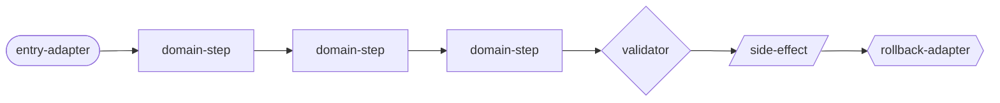

# 拆解大型功能優化原子 map 計畫書 v2

<!-- doc_id: doc_other_0161 -->

> **v2 基準**：本文件以 v1（TASK-MRP-0000 ~ 0010，全部 done）為起點，記錄 17 個新優化方向。
> v1 計畫書索引：`docs/ai_atomic_framework/map-replacement-protocol/拆解大型功能優化原子map計畫書.md`
>
> **穩定性原則**：ATM 的核心使命是讓 AI 行為穩定。v2 引入的所有新功能必須**先設計穩定性護欄，再設計功能本身**。所有新狀態必須是「可從 source-of-truth 重建的衍生資料」（見 §8）。

---

## 0. v2 核心目標

v1 建立了 map 替代協議的完整骨架（schema 0.2.0、equivalence CLI、upgrade gate、replacement lane、evidence closure）。
v2 的目標是讓這個骨架**可觀測、自動化、可共享、可持續演進、體驗更好**：

- **可觀測**：telemetry dashboard、fingerprint 漂移偵測、shadow A/B 定量報告
- **自動化**：edge contract 自動測試、升級自動推進、Mermaid 圖自動生成
- **可共享**：Content-Addressed Atom Capsule + Map Capsule（Merkle tree，跨 repo、離線、無耦合）
- **可持續演進**：atom 邊界調整（reshape）、受控退役（retire）、結果快取（memoization）
- **體驗優化**：Daemon 即時監控、一行指令執行任務、Guide Cache 加速、Diff 自動生成 evidence

---

## 1. 任務卡總覽（TASK-MRP-0011 ~ 0027）

| 卡號 | 里程碑 | 標題 | 狀態 | 依賴 |
|------|--------|------|------|------|
| TASK-MRP-0011 | M11 | Atom Semantic Fingerprint 持續監控 | planned | — |
| TASK-MRP-0012 | M12 | Map Edge Contract 自動合約測試 | planned | 0011 |
| TASK-MRP-0013 | M13 | Map 升級自動推進（draft→shadow→canary→active） | planned | 0012, 0020 |
| TASK-MRP-0014 | M14 | 跨 Atom 邊界結果快取（Memoization） | planned | 0012 |
| TASK-MRP-0015 | M15 | Atom Telemetry 健康儀表板 | planned | 0011, 0012 |
| TASK-MRP-0016 | M16 | 受控 Atom 邊界調整（behavior.reshape） | planned | 0015, 0017 |
| TASK-MRP-0017 | M17 | Atom 退役流程（behavior.retire） | planned | 0010 |
| TASK-MRP-0018 | M18 | Content-Addressed Atom Federation（Atom Capsule） | planned | 0015, 0017 |
| TASK-MRP-0019 | M19 | Map 拓樸圖 Mermaid 自動生成 | planned | 0011 |
| TASK-MRP-0020 | M20 | Shadow 模式 A/B 定量比對報告 | planned | 0010, 0004 |
| TASK-MRP-0021 | M21 | Map Capsule — map:cid 機制（MID） | planned | 0018 |
| TASK-MRP-0022 | M22 | ATM Daemon Mode（背景守護進程） | planned | 0011 |
| TASK-MRP-0023 | M23 | atm do --task X（Agent 一行指令執行任務） | planned | — |
| TASK-MRP-0024 | M24 | Persistent Guide Cache（candidates rank 結果快取） | planned | — |
| TASK-MRP-0025 | M25 | Diff-as-evidence（混合版） | planned | — |
| **TASK-MRP-0026** | **M26** | **Rescue Police Family（救援警察家族）** | planned | 0018, 0021 |
| **TASK-MRP-0027** | **M27** | **Disaster Recovery & Atom Reload CLI** | planned | 0018, 0021, 0026 |

**建議執行順序**（依依賴鏈）：

```
0011 → 0012 → 0014
           ↓
          0015 → 0016
           ↓      ↓
          0019   0017 → 0018 → 0021
           ↓
          0020 → 0013

0011 → 0022   （Daemon 依賴 fingerprint monitor）
0023          （獨立，無依賴）
0024          （獨立，無依賴）
0025          （獨立，無依賴）
```

---

## 2. 各里程碑詳細規劃

---

### M11：Atom Semantic Fingerprint 持續監控

**任務卡**：[TASK-MRP-0011](tasks/TASK-MRP-0011-semantic-fingerprint-monitor.task.md)

**問題**：`semanticFingerprint` 只在建立時算一次。atom 邊界被悄悄改動（例如新增 export）時沒有自動偵測。

**解法**：
- 新增 `atm test --map <id> --fingerprint-check`
- CI 在 map 相關檔案改動時自動觸發
- `lineage-log.json` 記錄每次 fingerprint check 結果

**關鍵產出**：
- `fingerprint-checker.ts` 模組
- CI GitHub Action step
- lineage-log `fingerprint-check` transition

---

### M12：Map Edge Contract 自動合約測試

**任務卡**：[TASK-MRP-0012](tasks/TASK-MRP-0012-edge-contract-auto-test.task.md)

**問題**：map 的每條 edge（例如 `external-summary` binding）沒有自動測試。上游 atom 改了 output schema，下游 atom 在整合測試才發現。

**解法**：
- `binding-schema-registry.json`：記錄每個 binding 名稱對應的 schema
- `atm test --map <id> --edge-contracts`：只跑受影響 edge 的 contract test
- CI 在 atom 改動時選擇性觸發（非全 map）

**效益**：防止「atom 改了，整合才炸」，將問題前移到 PR 階段。

---

### M13：Map 升級自動推進

**任務卡**：[TASK-MRP-0013](tasks/TASK-MRP-0013-progression-automation.task.md)

**問題**：`draft→shadow→canary→active` 每步都需要人工執行，人工是瓶頸。

**解法**：
- `replacement.progression-policy.json`：設定每個 lane 的定量門檻
  - 例：shadow 連續 7 天 output 一致率 > 99% → 自動產生 canary proposal
- 自動 proposal 的 status 為 `pending-human-approval`（仍需最終人工確認）
- `--force-pause` 隨時叫停

**重要限制**：最終 apply 仍需人工確認，不完全自動。

---

### M14：跨 Atom 邊界結果快取（Memoization）

**任務卡**：[TASK-MRP-0014](tasks/TASK-MRP-0014-atom-memoization-cache.task.md)

**問題**：收斂迴圈每輪重算相同 seed data，domain-step atom 浪費時間。

**解法**：
- cache key = `sha256(atom_id + input_blob)`
- 只對 `role: domain-step`、`edgeKind: data-flow` 的純函數 atom 啟用
- `side-effect`、`rollback-adapter` 永遠不快取
- cache 存於 `local/.atm-cache/`（.gitignore）
- `--no-cache` 逃生門

**效益**：重複跑場景可從分鐘級降到秒級。

---

### M15：Atom Telemetry 健康儀表板

**任務卡**：[TASK-MRP-0015](tasks/TASK-MRP-0015-atom-telemetry-dashboard.task.md)

**四個指標**（每個 atom）：

| 指標 | 用途 |
|------|------|
| `avgExecutionMs` | 找出執行瓶頸 |
| `policeViolations` | 找出最不穩定的 atom |
| `editFrequency` | 找出最常改動的 atom（技術債熱點） |
| `schemaDriftRate` | 找出 schema 最不穩定的 atom |

**產出**：`map-health-report.json` + `atm atm-chart --map --health --render`（終端機 ASCII 表格）

---

### M16：受控 Atom 邊界調整（behavior.reshape）

**任務卡**：[TASK-MRP-0016](tasks/TASK-MRP-0016-behavior-reshape.task.md)

**問題**：atom 邊界切錯了（太粗或太細），現在只能從 draft 重來。

**解法**：新增 `behavior.reshape`，兩種模式：
- `split`：一個 atom 拆成兩個（細化）
- `merge`：兩個鄰近 atom 合併（反拆分）

**保護機制**：
- 外部 edge binding schema 不能變（外部合約不動）
- `semanticFingerprint` 必須不變
- 無 human review 不能 apply
- 舊 atom 進入 `deprecated`，不刪除

---

### M17：Atom 退役流程（behavior.retire）

**任務卡**：[TASK-MRP-0017](tasks/TASK-MRP-0017-behavior-retire.task.md)

**三階段**：
1. `deprecated`：標記不再新增引用
2. `shadow-off`：確認所有 downstream 已更新，無活躍流量
3. `legacy-retired`：正式下線，registry 保留記錄（不刪除）

**退役不等於刪除**：代碼仍在 git history；registry 保留 `legacy-retired` 記錄。

---

### M18：Content-Addressed Atom Federation（Atom Capsule）

**任務卡**：[TASK-MRP-0018](tasks/TASK-MRP-0018-content-addressed-atom-federation.task.md)

**這是 v2 最重要的架構創新**，詳見 §3 Federation 架構設計。

---

### M19：Map 拓樸圖 Mermaid 自動生成

**任務卡**：[TASK-MRP-0019](tasks/TASK-MRP-0019-mermaid-auto-gen.task.md)

從 `map.spec.json` 自動生成 Mermaid 圖，節點樣式對應 role，邊樣式對應 edgeKind。CI 在 map 改動時自動重生成，文件永遠與代碼同步。

範例輸出：


---

### M20：Shadow 模式 A/B 定量比對報告

**任務卡**：[TASK-MRP-0020](tasks/TASK-MRP-0020-shadow-ab-metrics.task.md)

**問題**：shadow 模式只有 pass/fail，缺乏定量依據（執行時間、記憶體、output 一致率）。

**四個定量指標**：
- `outputConsistencyRate`：output hash 一致率（0–1.0）
- `avgLegacyMs` vs `avgAtomMs`：執行時間比較
- `peakMemoryDeltaMB`：記憶體用量差
- `divergences[]`：不一致案例清單

**自動推薦**：
- 一致率 ≥ 99% → `recommend-canary`
- 一致率 < 90% → `rollback-alert`

---

## 3. Federation 架構設計：Atom Capsule 深度說明

### 3.1 問題根源

舊的 `sharedRef` 格式：
```json
"sharedRef": "atom://3klife/external-summary-generator@0.1.0"
```

這是**位置依賴（location-dependent）**。問題：
- 原始 repo 被刪除 → 引用者全部找不到 atom
- 原始 repo 改了 API → 引用者靜默破壞
- 無法離線使用
- 個人使用時（無團隊 registry）根本無法共享

### 3.2 解法：Content-Addressed Atom Capsule

**核心原則**：內容就是位址，位址就是內容。

**格式**：
```
atom:cid:<BASE58URL(SHA256(brotli_compressed_bundle))>
```

**bundle 包含**：
```json
{
  "sourceCode": "def verify_seed(seed, passages, topk=8): ...",
  "inputSchema": { "$schema": "...", "type": "object", ... },
  "outputSchema": { "$schema": "...", "type": "object", ... },
  "policeConfig": { "invariants": [...] },
  "provenance": {
    "atomId": "ATM-NPCBRAIN-0002",
    "createdAt": "2026-05-19T...",
    "authorRepo": "3klife/npc-brain"
  }
}
```

壓縮後的典型大小：一個 Python 函數 atom ≈ **200–400 字元**。可以：
- 貼在 Slack 訊息
- 放在代碼註解 `# atom:cid:H4sI...`
- 寄 email
- 放在 GitHub issue

### 3.3 三層存儲架構

```
Layer 1: 本機全域快取（~/.atm/capsule-cache/）
    ↑ 永久保留，repo 刪除不受影響
    
Layer 2: repo 內 vendor（vendor/atoms/）
    ↑ 可 git commit，確保離線使用
    ↑ 可選：加入 .gitignore（依賴 Layer 1）
    
Layer 3: 雲端公開 registry（未來）
    ↑ 類似 npm registry，但 content-addressed
    ↑ 個人/團隊使用不依賴此層
```

**Layer 1 是最重要的**：你本機 fetch 過的 atom，永遠在 `~/.atm/capsule-cache/`。repo 刪除不受影響。

### 3.4 不耦合的保證

| 場景 | 舊格式 (`atom://`) | Atom Capsule (`atom:cid:`) |
|------|------------------|--------------------------|
| 原始 repo 被刪 | ❌ 引用失效 | ✅ 本機 cache 仍有 |
| 原始 repo 改 API | ❌ 靜默破壞 | ✅ CID 變了就是不同 atom |
| 離線使用 | ❌ 需網路 | ✅ cache 命中即離線 |
| 驗證是否被篡改 | ❌ 沒有機制 | ✅ SHA256 自驗 |
| 貼上一段字分享 | ❌ 需要 URL + 網路 | ✅ CID 字串貼上即用 |

### 3.5 安全漏洞處理

**CID 是不可變的**。若某個 CID 對應的 atom 有安全漏洞：
1. 發布一個修復後的新 CID
2. 用 `atm doctor --check-capsule-advisories` 掃描本地已知漏洞 CID
3. 手動更新 `map.spec.json` 中的 `sharedRef` 指向新 CID

這與 npm 的安全修補方式相同。**不支援靜默修補，這是設計決策**：透明性高於便利性。

### 3.6 CID 版本策略：CID 就是版本號

**同一個 atom 進化時，只要語意改變，CID 必然不同。** 這是 content-addressing 的自然結果，不需要另外維護 `v0.1.0` 標籤。

| 改動類型 | CID 變？ | 說明 |
|---------|---------|------|
| 改邏輯、算法 | **變** | AST 不同 → hash 不同 |
| 多型進化（新版實作） | **變** | 語意不同 → 必須不同 CID |
| 只改縮排 / 注釋 | **不變** | AST 正規化後相同 |
| 兩人各自 export 同代碼 | **不變** | 內容相同 → 自然去重 |

**Provenance 不進 hash**（否則同代碼不同人 export → 不同 CID，荒謬）。`exportedBy`、`exportedAt` 只存 Registry entry，不影響 CID 計算。

### 3.7 正規化 Pipeline 統一設計

正規化 pipeline 是 CID 計算的核心，**同時也是去重警察的唯一比對依據**：

```
原始代碼
  ↓ 解析 AST（語言對應 parser）
  ↓ 標準化（strip 注釋、normalize 空白、sort imports）
  ↓ 序列化成語言無關 canonical JSON
  ↓ brotli 壓縮
  ↓ SHA256 → BASE58URL
= atom:cid:...
```

**去重警察的工作因此從 O(n²) 降到 O(1)**：

```
新 atom 進 registry
  ↓ 走正規化 pipeline → 計算 CID
  ↓ 查 Registry：CID 存在嗎？   ← O(1) hash lookup
  ├── 存在 → 重複！拒絕，指向既有 CID
  └── 不存在 → 新 atom，正常入庫
```

此 pipeline 必須實作為唯一共用模組 `canonical-form.ts`，CID 計算與去重警察**共用同一個函數**，不允許各自實作造成不一致。

### 3.8 實作指令

```bash
# 匯出 atom capsule（含 Registry 寫入）
node atm.mjs registry atom-capsule export --atom ATM-NPCBRAIN-0002 --json
# → { "atomCapsule": "atom:cid:zQmXG7f..." }

# 匯入 capsule（vendor 進本 repo，含 Registry 寫入）
node atm.mjs registry atom-capsule import --cid "atom:cid:zQmXG7f..." --vendor
# → vendor/atoms/zQmXG7f.json 寫入

# 回退到上一版
node atm.mjs registry atom-capsule rollback --cid "atom:cid:zQmXG7f..." --map ATM-MAP-0001
# → 查 previousCid，更新 map.spec.json

# 在 map.spec.json 中引用
"sharedRef": "atom:cid:zQmXG7f..."  # 推薦，位置無關
"sharedRef": "atom://3klife/..."     # 舊格式，位置依賴（不推薦）
```

---

## 3b. Map Capsule 架構：map:cid（M21）

**任務卡**：[TASK-MRP-0021](tasks/TASK-MRP-0021-map-capsule-mid.task.md)

Map 比 Atom 更值得共享：一個 Map 代表「7 個 atom 協作的完整治理工作流」，是可直接複用的 pipeline 單元。

### map:cid 格式

```
map:cid:<BASE58URL(SHA256(brotli_compressed_map_bundle))>
```

### Merkle Tree：map 鎖定所有 atom 版本

```json
{
  "members": [
    { "atomCid": "atom:cid:ATOM-0001-v1", "role": "entry-adapter" },
    { "atomCid": "atom:cid:ATOM-0002-v3", "role": "domain-step" }
  ],
  "edges": [
    { "from": "atom:cid:ATOM-0001-v1", "to": "atom:cid:ATOM-0002-v3",
      "binding": "seed-pipeline", "edgeKind": "control-flow" }
  ]
}
```

**任何 member atom 升版 → atomCid 改變 → map bundle 改變 → map:cid 自動改變**。無需手動 bump map 版本號。

### 版本鏈示意

```
map:cid:MAP-v1   (atom-0002 = CID-A)
    ↓ atom-0002 升版
map:cid:MAP-v2   (atom-0002 = CID-B)
    ↓
map:cid:MAP-v3   (atom-0002 = CID-C)
```

### 共享指令

```bash
# 匯出整個 map（自動包含所有 member atom capsule）
node atm.mjs registry map-capsule export --map ATM-MAP-0001 --json

# 匯入（遞迴解析所有依賴 atom）
node atm.mjs registry map-capsule import --cid "map:cid:MAP-ABC..." --vendor
# → vendor/maps/MAP-ABC.json + vendor/atoms/ATOM-*.json 全部寫入
```

### map:cid 的去重警察

| 層 | 條件 | 複雜度 |
|----|------|--------|
| 完全相同 | map:cid 相同 | O(1) hash lookup |
| 圖結構等價 | 相同 edge 不同排列 | 圖同構（昂貴，Phase 2 才加） |

---

## 4. 建議優先順序（重新評估：穩定性優先）

⚠️ **穩定性原則**：M22 和 M24 是 ATM 自我崩壞風險最高的兩張卡。在 M26（Rescue Police）和 M27（Disaster Recovery）尚未到位前，**不應該開始實作 M22 / M24**。

| 優先 | 任務 | 理由 |
|------|------|------|
| 🥇 | **M11 Fingerprint 監控** | 小工程量、純監控，無 mutation 風險 |
| 🥈 | **M18 Atom Capsule** | Capsule 是後續 Rescue Police 與 Disaster Recovery 的基石 |
| 🥉 | **M21 Map Capsule** | 同上 |
| 4 | **M26 Rescue Police** | **必須在 M22/M24 前完成**，才能監控自我腐壞 |
| 5 | **M27 Disaster Recovery CLI** | **必須在 M22/M24 前完成**，才有救援工具 |
| 6 | M25 Diff-as-evidence | 風險中等，先做 evidence 改善 |
| 7 | M23 atm do --task X | 中等風險，配合 M27 的 evidence-audit 比較安全 |
| 8 | **M22 ATM Daemon Mode** | **高風險，需 M26 + M27 先就位** |
| 9 | **M24 Persistent Guide Cache** | **最高風險（AI 漂移來源），需 M26 INV-RESCUE-008 先就位** |
| 10 | M15 Telemetry Dashboard | 立即可見哪個 atom 需要投資 |
| 11 | M12 Edge Contract 測試 | 每次 PR 有安全網 |
| 12 | M20 Shadow A/B 報告 | canary 升級的定量依據 |
| 13 | M19 Mermaid 自動生成 | 文件永遠同步，工程量極小 |
| 14 | M14 Memoization Cache | 重複跑場景大幅加速 |
| 15 | M13 升級自動推進 | 依賴 M20，減少人工等待 |
| 16 | M17 behavior.retire | 長期維護必備 |
| 17 | M16 behavior.reshape | 邊界調整救星 |

**新依賴規則**：
```
M22（Daemon）→ 需要先完成 → M26 + M27
M24（Cache）  → 需要先完成 → M26 INV-RESCUE-008
```

---

## 5. v1 → v2 增量對比

| 能力 | v1 狀態 | v2 新增 |
|------|---------|---------|
| Map schema | ✅ 0.2.0 完備 | — |
| Equivalence test | ✅ CLI 完成 | Shadow A/B 定量化（M20） |
| Upgrade gate | ✅ evidence 閉環 | 自動推進（M13） |
| Replacement lane | ✅ 5 階段完整 | 自動推進觸發（M13） |
| Fingerprint | ✅ 建立時計算 | **持續監控（M11）** |
| Edge testing | ❌ | **Contract 自動測試（M12）** |
| Atom 健康 | ❌ | **Telemetry dashboard（M15）** |
| Atom 邊界調整 | ❌ 需從 draft 重來 | **behavior.reshape（M16）** |
| Atom 退役 | ✅ legacy-retired schema | **完整三階段流程（M17）** |
| Atom 去重警察 | 昂貴語意比對 O(n²) | **CID hash lookup O(1)（M18）** |
| 跨 repo Atom 共享 | ❌ 位置依賴 | **Content-Addressed Capsule（M18）** |
| 跨 repo Map 共享 | ❌ | **Map Capsule Merkle tree（M21）** |
| Map 版本自動追蹤 | ❌ 手動 | **member atomCid 變動自動感知（M21）** |
| 圖形化 | ❌ | **Mermaid 自動生成（M19）** |
| 結果快取（atom 執行） | ❌ | **Memoization（M14）** |
| Police gate 即時通知 | ❌ 需手動跑 | **Daemon Mode 常駐監控（M22）** |
| 任務執行 UX | ❌ 需 5+ 步指令 | **atm do --task X 一行搞定（M23）** |
| Guide/rank 速度 | ❌ 每次重掃 | **Persistent Cache（M24）** |
| Evidence 撰寫 | ❌ 全部手填 | **Diff 自動萃取，只補 intent（M25）** |

---

## 6. 文件索引

- **v1 計畫書**：`docs/ai_atomic_framework/map-replacement-protocol/拆解大型功能優化原子map計畫書.md`
- **任務卡目錄**：`docs/ai_atomic_framework/map-replacement-protocol/tasks/`
- **v1 任務**：TASK-MRP-0000 ~ 0010（全部 done）
- **v2 任務**：TASK-MRP-0011 ~ 0027（全部 planned）
- **ATM-MAP-0001**（本 repo 首個 map 實例）：`atomic_workbench/maps/ATM-MAP-0001/`
- **災難恢復 runbook**（TASK-MRP-0027 產出）：`docs/ai_atomic_framework/map-replacement-protocol/disaster-recovery-runbook.md`

---

## 7. M22~M25 詳細規劃

---

### M22：ATM Daemon Mode

**任務卡**：[TASK-MRP-0022](tasks/TASK-MRP-0022-atm-daemon-mode.task.md)

**問題**：每次改動 atom 代碼，都要手動執行 police gate 才能知道有沒有違規。開發者容易忘記，錯誤在 CI 才被抓到，成本高。

**解法**：
- `node atm.mjs daemon start` 常駐後台
- 監聽 atom source file、map.spec.json、`.atm/runtime/` 的變動
- 觸發對應的 police gate 或 fingerprint check
- 結果寫入 `.atm/daemon/notifications.jsonl`

**Event → Action 映射**：

| 事件 | 觸發 |
|------|------|
| atom source 儲存 | police gate |
| map.spec.json 改動 | fingerprint check（M11）|
| lineage-log.json 改動 | progression-policy check（M13）|

**關鍵設計**：PID 管理防 double-start；`.atm/daemon/` 加 `.gitignore`；30 秒內響應。

---

### M23：atm do --task X

**任務卡**：[TASK-MRP-0023](tasks/TASK-MRP-0023-atm-do-task.task.md)

**問題**：Agent 執行一個 ATM 任務需要記住並跑 5+ 個指令（reserve → promote → claim → 實際工作 → close），容易出錯，context 浪費嚴重。

**解法**：

```bash
# 自動 reserve → promote → claim
node atm.mjs do --task TASK-MRP-0022 --json

# Agent 執行實際工作後，一行 close
node atm.mjs do --task TASK-MRP-0022 complete --evidence ./e.json --json
```

**設計原則**：lifecycle 前段自動化；evidence 仍需人工提供；blocked_by 未完成則提前告知；冪等（已 claimed 不報錯）。

---

### M24：Persistent Guide Cache

**任務卡**：[TASK-MRP-0024](tasks/TASK-MRP-0024-persistent-guide-cache.task.md)

**問題**：`candidates rank` 每次都要重掃所有 source file，相同 goal 跑多次浪費時間（秒~分鐘級）。

**解法**：
- cache key = `SHA256(goal + glob_pattern + git_commit_hash)`
- Clean working tree → 讀 cache；有 uncommitted 改動 → 強制 bypass
- git commit 後 → cache miss，重算並更新
- 7 天自動 purge

**重要 CLI**：

```bash
node atm.mjs cache clear --json          # 清除所有 cache
node atm.mjs cache clear --goal "..."   # 清除特定 goal
node atm.mjs cache status --json         # 查看 cache 狀態
node atm.mjs candidates rank --no-cache  # 強制跳過 cache
```

**效益**：cache hit 時 < 100ms，比重算快 10~100x。

---

### M25：Diff-as-evidence（混合版）

**任務卡**：[TASK-MRP-0025](tasks/TASK-MRP-0025-diff-as-evidence.task.md)

**問題**：ATM evidence 需全手填，開發者和 Agent 嫌麻煩，採用率低，品質差。

**解法**：從 git diff 自動萃取 `changedFiles`、`linesAdded`、`patchSummary`、`affectedAtoms`；只讓人工補充 `intent`（為什麼改）和 `impact`（影響什麼）。

```bash
# 自動生成 evidence draft（what changed 已填）
node atm.mjs evidence diff --task TASK-MRP-0025 --output ./draft.json
# → 補充 intent + impact 後即可 close
```

**_isValid 機制**：`intent` / `impact` 為空 → `_isValid: false` → close validator 拒絕。填完才能通過，不允許敷衍 close。

---

## 8. 穩定性與災難恢復（v2 新增關鍵章節）

### 8.1 原則：所有衍生資料都必須可重建

ATM 自身的所有內部狀態（registry、lineage、cache、daemon state）都必須是**可從 source-of-truth 重建的衍生資料**：

| 衍生資料 | source-of-truth | 重建工具 |
|---------|----------------|---------|
| `atomic-registry.json` | atom source + map.spec.json | `rescue rebuild-registry`（M27） |
| `capsule-registry.json` | `vendor/atoms/*.json` | `rescue rebuild-registry` |
| `map-registry.json` | `vendor/maps/*.json` + capsule registry | `rescue rebuild-maps` |
| `lineage-log.json` | `.atm/history/evidence/*.json` | `rescue replay-lineage` |
| `.atm-guide-cache/` | 永遠可丟棄 | `rescue clear-cache` |
| `.atm/daemon/` | 永遠可丟棄 | `daemon stop` |

**source-of-truth 不可被自動程序修改**：
- `vendor/atoms/` 與 `vendor/maps/` 只能由 explicit 的 capsule import / export 修改
- `.atm/history/evidence/` 只 append，永不重寫或刪除
- atom source 與 map.spec.json 由人類/Agent 透過正常 ATM 流程修改

### 8.2 風險矩陣（v2 新功能）

| 任務 | 風險等級 | 主要不穩定來源 | 對應護欄 |
|------|---------|---------------|---------|
| M22 Daemon | 🔴 高 | 長駐進程崩潰、race condition、寫亂內部狀態 | Daemon kill switch、檔案鎖、Rescue Police 啟動前驗證 |
| M23 atm do | 🟡 中 | 自動鏈鎖隱藏中間錯誤、僵屍狀態 | 失敗自動 reverse rollback、每一步錯誤可見 |
| M24 Guide Cache | 🔴 高 | **AI 漂移最大來源**：cache 中毒導致決策錯誤 | SHA256 內容校驗、git status bypass、損壞自動降級 |
| M25 Diff-evidence | 🟡 中 | 自動 evidence 撒謊、人工懶得補 intent | `_isValid` 嚴格驗證、字數門檻、evidence-audit |
| M11~M17、M19~M21 | 🟢 低 | 多為讀取/監控功能，無 mutation 風險 | 既有 evidence/rollback 流程足夠 |

### 8.3 救援架構（M26 + M27）

```
┌─────────────────────────────────────────────────────────┐
│                 ATM 自身健康守護                          │
├─────────────────────────────────────────────────────────┤
│                                                         │
│  M26: Rescue Police（持續監控）                          │
│   ├─ 10 個 INV-RESCUE-* 不變項                          │
│   ├─ 每次 mutation 前自動跑                              │
│   ├─ 發現腐壞 → block-all-mutations                     │
│   └─ Finding 指向具體 rescue CLI                         │
│                                                         │
│  M27: Disaster Recovery CLI（手動執行救援）              │
│   ├─ rescue diagnose（read-only 健康診斷）              │
│   ├─ rescue rebuild-registry（重建 capsule registry）   │
│   ├─ rescue reload-atoms（從 capsule 還原 source）      │
│   ├─ rescue rebuild-maps（重建 map registry）           │
│   ├─ rescue replay-lineage（從 evidence 重建 lineage）  │
│   ├─ rescue clear-cache（清除 cache）                   │
│   └─ rescue factory-reset（核武，雙重 confirm）         │
│                                                         │
└─────────────────────────────────────────────────────────┘
```

### 8.4 ATM 健康不變項（INV-RESCUE-*）

| ID | 不變項 |
|----|--------|
| INV-RESCUE-001 | 所有 atom_id 對應 source 檔案存在 |
| INV-RESCUE-002 | 所有 CID 可解壓縮 |
| INV-RESCUE-003 | Map Merkle tree 完整（memberAtomCids 都存在） |
| INV-RESCUE-004 | lineage timestamp 嚴格單調 |
| INV-RESCUE-005 | binding schema 全部合法 JSON Schema |
| INV-RESCUE-006 | runtime policy 通過 schema 驗證 |
| INV-RESCUE-007 | vendor/atoms 與 registry 雙向一致 |
| INV-RESCUE-008 | Guide cache 沒有指向不存在的 git commit |
| INV-RESCUE-009 | daemon PID 指向真實 ATM process |
| INV-RESCUE-010 | 所有 evidence 通過 schema |

### 8.5 災難情境劇本（典型四種）

| 情境 | 救援步驟 |
|------|---------|
| Daemon 寫亂 capsule registry | `rescue rebuild-registry --confirm` |
| Guide Cache 污染導致 AI 漂移 | `rescue clear-cache --confirm` |
| 誤刪 atom source | `rescue reload-atoms --confirm`（從 capsule 解壓還原） |
| 整個 `.atm/` 被誤刪 | `rescue factory-reset --confirm --i-understand-this-deletes-state` |

完整劇本見：`disaster-recovery-runbook.md`（TASK-MRP-0027 產出）

### 8.6 開發順序硬性約束

```
不可違反的依賴鏈：

M11 → M18 → M21 → M26 → M27 → M22 + M24
                              ↑
                  (必須先就位才能啟用 daemon 或 cache)

M23 與 M25 可以與 M26/M27 並行，但 M27 上線後可提供更強的 evidence-audit。
```

### 8.7 高風險功能預設 OFF（opt-in）

**M22 Daemon 與 M24 Guide Cache 預設關閉**，使用者必須明確跑：

```bash
node atm.mjs daemon enable    # M22 啟用
node atm.mjs cache enable     # M24 啟用
```

寫入 `.atm/runtime/feature-flags.json`。`feature-flags.json` 受 Rescue Police INV-RESCUE-006 監控（屬於 runtime policy）。

理由：
- M22 與 M24 是 v2 中對 ATM 自身穩定性影響最大的兩張卡
- 即使全部護欄都實作，仍應讓使用者主動承擔 opt-in 風險
- 預設關閉 = 即使本卡實作有 bug 也不影響原本工作流

### 8.8 實作絕對規則（適用 M11~M27 全部）

**所有功能必須透過 ATM atom（map）製作，不可繞過治理流程**：

| 規則 | 說明 |
|------|------|
| 每個任務卡必須先進入 guidance session | `node atm.mjs start --goal "..."` |
| 改動必須走 dry-run proposal | `node atm.mjs upgrade --propose --behavior behavior.atomize --dry-run` |
| 必須通過 human review approval | `node atm.mjs review approve <proposalId>` |
| 必須產生 actual-patch-evidence 與 rollback-ready proof | 同 v1 流程 |
| 每個原子必須有 map 歸屬（屬於某個 atomic map） | 不允許 floating atom |
| 不可直接編輯 packages/core/src/ 不經 guidance session | police gate 會擋 |

**違反此規則的實作將被 Rescue Police INV-RESCUE-* 攔截**，無法進入 registry。

---

*最後更新：2026-05-21 | 撰寫者：claude-sonnet-4-6*
