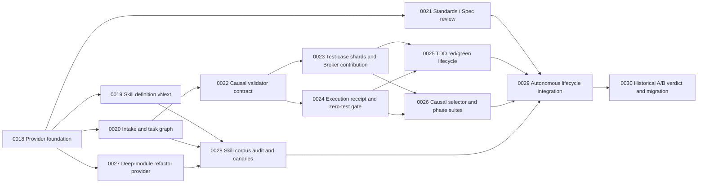

# ATM Validator Governance and Test Case Catalog Plan

Generated: 2026-07-24
Planning repo: 3KLife
Target framework: AI-Atomic-Framework / ATM
Series: SKL / `TASK-SKL`
Status: approved planning source
Supersedes as execution plan:
`governance-optimization/ATM-MATT-POCOCK-SKILLS-initiative-handoff-2026-07-24.md`

## 0. Executive summary

This plan upgrades ATM skill quality, task authoring, TDD, validator evidence,
test-case identity, causal validator selection, phase suites, semantic review,
and deep-module refactoring as one provider-neutral SKL initiative.

The central validator decision is:

> A feature task runs only tests that prove its changed behavior and concrete
> causal impact edges. Broader regression suites are not deleted; they move to
> governed batch, milestone, plan-verdict, and release checkpoints.

Cross-card and cross-module tests are stored in reusable integration groups.
A feature task may contribute multiple integration cases during its own TDD
cycle without opening a separate maintenance card. Each case has a stable ID,
is registered in a decentralized group shard, and is referenced explicitly by
the task that must run it.

This plan extends ATM's existing test catalog, validation receipts, validator
lifecycle telemetry, task import, evidence runner, taskflow gates, ReviewAdvisory
provider, and Broker shared-write surfaces. It must not create a second test
runner, task lifecycle, permission model, or central mutable registry.

## 1. First-principles analysis

### 1.1 What a task validator must prove

A task validator exists to answer two questions:

1. Did the behavior named by the sealed acceptance criteria change correctly?
2. Did that change preserve the concrete contracts it actually touches?

Anything without a causal relationship to those questions is not a task-close
obligation. Running unrelated tests on every card spends time but does not make
the task evidence more truthful.

Task-required validation therefore includes:

- direct behavior, unit, contract, and negative tests for the changed seam;
- integration cases for actual affected callers, consumers, schemas, adapters,
  resource keys, or shared governance contracts;
- a small ATM evidence-integrity gate proving that the selected tests actually
  executed, produced assertions/cases, and are fresh for the sealed candidate.

It does not automatically include:

- repository-wide typecheck when a sound package or changed-file boundary
  exists;
- all CLI, schema, adapter, compatibility, release, or regression suites;
- checks selected only because the task is important or high-risk;
- advisory diagnostics used as acceptance evidence.

### 1.2 Why this can be faster

The current repository already exposes many validators and some tasks repeatedly
run `typecheck`, `validate:cli`, and `validate:git-head-evidence` regardless of
the behavioral change. Causal selection reduces repeated work in four ways:

- fewer validators are invoked per card;
- exact case IDs allow receipt reuse and fan-out across tasks;
- integration groups eliminate copied commands and duplicate test ownership;
- phase suites amortize broad checks across a batch or milestone instead of
  repeating them for every card.

The expected speedup is largest when many small cards share the same broad
static or integration suites. It is smaller for tasks that genuinely touch a
wide public contract or release surface; those tasks correctly select a wider
impact cone.

### 1.3 Why this can remain effective

Effectiveness is preserved only if skipped task tests are not silently lost.
The safety model has three layers:

1. task import proves every acceptance ID and declared impact edge maps to a
   task-local case or reusable integration case;
2. pre-close proves all `requiredTestCaseIds` produced fresh non-zero execution
   receipts for the candidate;
3. phase checkpoints run the broader suites before batch promotion, plan
   verdict, or release.

This separates fast local causality from broad system assurance. Neither layer
is allowed to impersonate the other.

### 1.4 Why this is easier to manage

Stable case IDs make coverage queryable independently of file names and shell
commands. Integration groups give related cross-module cases one thematic home.
Task cards declare exact cases rather than copying long commands. A generated
catalog can answer:

- which cases cover an acceptance or public seam;
- which task introduced or last changed a case;
- which cards require the case now;
- which phase suites include it;
- whether a case is flaky, orphaned, duplicated, stale, or never selected;
- which receipt/test digest last proved it.

## 2. Existing ATM surfaces to extend

This initiative must reuse these existing foundations:

| Existing surface | Extension |
|---|---|
| `scripts/test-catalog.config.json` | group shards, case IDs, responsibility and checkpoint metadata |
| `packages/cli/src/commands/test-catalog.ts` | causal selection, case/group lookup, generated index |
| `packages/core/src/evidence/validation-receipt.ts` | case-level execution counts, candidate/test/runner seals |
| `packages/core/src/evidence/validator-lifecycle.ts` | task/phase selection, omission, cache and cost telemetry |
| `scripts/run-validators.ts` | execute selected cases and phase suites through one runner |
| task-card parser/import | causal impact, test contributions and execution references |
| evidence runner | structured red/green/candidate receipts |
| taskflow pre-close | zero-test, freshness and required-case hard gates |
| ReviewAdvisory provider | Standards/Spec report bound to the same candidate |
| Broker shared-write | serialize/compose concurrent integration-group contributions |

`atm.testCatalog.v1` is the migration source. The new contract is a versioned
evolution of this catalog, not a second registry.

## 3. Test-case identity and decentralized management

### 3.1 Canonical ID shape

```text
test_int_<group>_<semantic-key>_<digest8>
test_task_<task-id>_<semantic-key>_<digest8>
```

Examples:

```text
test_int_runner_sync_actor_continuity_8f3a2c1d
test_task_atm_gov_0101_reject_stale_receipt_42d91abe
```

Rules:

- `int` is a reusable cross-card/system/integration case.
- `task` is a task-local acceptance case.
- the semantic key describes behavior, not implementation or file path;
- `digest8` derives from normalized kind, namespace, and semantic key;
- no global sequential allocator is allowed;
- implementation changes do not change identity;
- aliases and lineage preserve historical receipts after promotion or rename.

If a task-local case later becomes broadly reusable, a new `test_int_*` ID is
created and the old ID records `promotedTo`. Historical evidence remains bound
to the old ID and can resolve through immutable lineage.

### 3.2 Group shards and generated index

Each integration group owns a manifest shard with:

- group ID, theme, maintainers and resource key;
- supported seams, atoms/CIDs, contracts and dependency edges;
- member case IDs and semantic keys;
- commands/runner adapters and result schemas;
- cost, timeout, quarantine, flake and checkpoint policy;
- aliases, lineage and deprecation state.

The central catalog is generated and read-only. It validates global uniqueness,
semantic duplicates, missing aliases, cycles, orphan cases, missing group
owners, and unresolved task references. It does not allocate IDs or become the
write authority.

### 3.3 Feature-card contribution contract

A task card may add several shared integration cases during TDD:

```yaml
testContributions:
  - caseId: test_int_runner_sync_actor_continuity_8f3a2c1d
    targetGroupId: test_group_runner_sync
    semanticKey: actor_continuity
    coversAcceptance: [ACC-2]
    coversImpactEdges: [identity-to-runner-sync]
    expectedRedPredicate: actor mismatch is detected
    contributionResourceKey: test-group:runner-sync
requiredTestCaseIds:
  - test_int_runner_sync_actor_continuity_8f3a2c1d
phaseTestCaseIds: []
advisoryTestCaseIds: []
```

ATM maps `contributionResourceKey` through the existing write-scope and Broker
authority. The Broker admits, composes, revalidates, or queues concurrent group
contributions. Running a case grants no edit authority.

## 4. Validator execution contract

A validator is not merely a shell command and exit code. Each executable case
or group declares:

- stable case/validator/group ID and provider adapter;
- acceptance IDs and causal impact edges covered;
- responsibility: `task-required`, `phase-suite`, or `advisory`;
- phase: `red`, `green`, `candidate`, `pre-close`, or `release`;
- command/runner and structured result schema;
- expected outcome or expected red predicate;
- minimum executed case and assertion counts;
- candidate, base, test, group, runner, and build digests;
- timeout, cost budget, cache key and invalidation inputs;
- unavailable, retry, quarantine and fallback policy.

A direct command that only imports helpers, prints a banner, or exits zero with
zero executed cases must fail. A meta-validator must prove this using no-op,
broken, wrong-red, timeout, and stale-digest fixtures.

## 5. TDD and review lifecycle

### 5.1 TDD sequence

For new behavior, bug repair, or governance gates:

```text
case contribution admission
→ execute exact case ID against sealed baseline
→ valid red receipt
→ implementation
→ execute same case ID/test digest against candidate
→ green receipt
→ Standards/Spec review
→ remaining task-required cases
→ pre-close
```

Syntax errors, missing dependencies, environment failures, unrelated failures,
or a different case digest do not count as red.

### 5.2 Standards / Spec review

Use the existing ReviewAdvisory provider contract:

- Standards: AtomicCharter, ATM invariants, repository skill rules and
  provider-neutral quality contracts.
- Spec: sealed acceptance, deliverables, impact edges, required case IDs,
  backlog links, scope amendments and waivers.

Run once after focused red/green slices stabilize and before final task-required
validation. Candidate changes invalidate the review receipt. Pre-close verifies
freshness and finding disposition; it does not repeat semantic review.

## 6. Causal selector and phase suites

### 6.1 Task selection

The selector covers every acceptance ID and declared impact edge with the
smallest sound set of cases. Selection inputs include:

- explicit task case references;
- changed public seams and package boundaries;
- atom/CID/map and resource-key relationships;
- schema/adapter/consumer dependencies;
- observed failures that reveal a new edge;
- group version and test digest.

Risk may deepen testing inside the proven impact cone. It may not add unrelated
tests without a dependency, contract, resource, or observed-failure edge.

If ATM cannot prove the boundary, it requests an impact/scope amendment. It must
not silently run the whole repository and call that precise selection.

### 6.2 Phase checkpoints

Broad suites are scheduled at:

- batch checkpoint;
- milestone promotion;
- Plan 3.1/family final verdict;
- frozen-runner or release publication;
- periodic shadow sampling.

The checkpoint has an SLA and cannot be deferred past promotion or release.
Failures identify the introducing candidate window and open governed repair.

## 7. Expected benefits and measurable proof

Measure:

- task validation wall time and p50/p95;
- selected/available case ratio;
- cases/assertions actually executed;
- cache and receipt-reuse hit rate;
- queue wait and Broker composition rate;
- cost per acceptance and impact edge;
- phase-suite duration and detection count;
- false blocks, flaky/quarantined cases and retries;
- defects caught by task-required vs phase suites;
- escaped defects after promotion/release;
- selector precision/recall against historical full-suite results.

The initiative succeeds only when historical A/B replay on the same sealed
candidates shows:

1. lower card validation latency;
2. no increase in post-promotion escaped defects;
3. phase suites still catch broad regressions before release;
4. no-op/zero-test false greens are rejected;
5. provider and adapter swaps preserve selection and evidence semantics.

Thresholds are derived from baseline distributions and owner-approved goals,
not embedded task IDs or arbitrary constants.

## 8. Weaknesses and required countermeasures

### 8.1 Impact-map false negatives

**Risk:** a missing dependency edge skips a necessary test.

**Countermeasures:** combine declared contracts, static dependency inventory,
runtime telemetry, schema/resource keys, failure feedback, and periodic
full-suite shadow comparison. A newly detected failure amends the impact map and
selection fixture.

### 8.2 Test-ID explosion and semantic duplication

**Risk:** every task creates near-duplicate cases.

**Countermeasures:** deterministic semantic keys, generated duplicate reports,
alias/promotion workflow, usage-count-based consolidation, and archive proposals
for never-selected cases.

### 8.3 Central catalog bottleneck

**Risk:** one mutable catalog serializes all contributors.

**Countermeasures:** group-owned shards, deterministic IDs, generated read-only
index, Broker resource keys per group, and transactional composition.

### 8.4 Shared-group write conflicts

**Risk:** parallel cards edit the same integration group.

**Countermeasures:** bounded case-level contribution intents, content anchors,
Broker tickets, steward composition, candidate revalidation and attribution
receipts. File locks are fallback only.

### 8.5 Flaky or slow shared cases

**Risk:** reused tests spread instability across many cards.

**Countermeasures:** flake telemetry, retry budget, quarantine state with owner
and expiry, deterministic fixtures, no acceptance satisfaction from quarantined
cases, and replacement deadlines.

### 8.6 Gaming by under-declaring impact

**Risk:** a card declares too few edges to close faster.

**Countermeasures:** compare declared impact with changed imports, public seams,
atoms/maps, schemas and resource keys; require explanation for omissions; run
sampled shadow full suites; track selector false negatives by authoring source.

### 8.7 Phase-suite backlog

**Risk:** cards close quickly but integration debt accumulates.

**Countermeasures:** phase checkpoints are promotion barriers with queue health,
age, SLA and ownership. A batch cannot advance while its required phase receipt
is missing or stale.

### 8.8 Cache poisoning and stale reuse

**Risk:** an old passing receipt is reused for a changed candidate or test.

**Countermeasures:** bind receipts to candidate/base/test/group/runner/build
digests and environment; content-addressed storage; explicit invalidation
reasons; negative reuse fixtures.

### 8.9 ID promotion churn

**Risk:** renaming task cases to integration cases breaks historical evidence.

**Countermeasures:** immutable old IDs, new canonical integration IDs, alias and
lineage resolution, and no history rewrite.

### 8.10 Goodhart pressure

**Risk:** teams optimize runtime by weakening coverage.

**Countermeasures:** pair latency with escaped-defect and phase-detection
metrics; prohibit runtime-only success claims; retain random shadow comparisons.

## 9. Provider replaceability and Matt Pocock skill adoption

Matt Pocock skills are reference providers, not core dependencies.

- `writing-great-skills` informs completion criteria, progressive disclosure,
  context loading and invocation modes.
- `grill-me` informs replaceable decision intake before task authoring.
- `to-tickets` informs causal blockers, tracer bullets and parallel frontiers.
- `code-review` informs Standards/Spec review.
- TDD and codebase-design/refactoring concepts inform evidence and deep-module
  routes.

ATM owns the versioned capability, receipt, catalog, selection and lifecycle
contracts. Provider text is replaceable through manifests, conformance fixtures,
shadow runs, version pinning and rollback. Replacing a provider must not migrate
task cards, case IDs, receipts, claims or close semantics.

The initial deep-module reference snapshot is pinned to Matt Pocock
`mattpocock/skills` commit
`ed37663cc5fbef691ddfecd080dff42f7e7e350d` under the MIT license.
`codebase-design` supplies the model-invoked vocabulary and principles;
`improve-codebase-architecture` supplies the user-invoked exploration route.
Their downloaded bundle digests are respectively
`sha256:c46b49303a81c7fc8934d0f4fbc44382cdecb73942d85d8d7db3523407fff8fa`
and
`sha256:d3682058df92c259b47c36503baa02345d5811758621b5dc03081d5ba0f7b69b`.
TASK-SKL-0027 translates those inputs into a provider-neutral ATM interface;
ATM runtime never imports the upstream skill text directly.

## 10. Task graph



Parallel frontier:

- after 0018: 0019, 0020, 0021 and 0027 may proceed when Broker scope permits;
- if 0022 is temporarily frozen by a Plan 3.1 `atom-cli-router` claim, the SKL
  captain should complete independent 0027 rather than wait or repeatedly
  retry the same claim; this is a planned frontier switch, not dependency
  bypass;
- after 0022: 0023 and 0024 may proceed in parallel;
- after 0023/0024: 0025 and 0026 may proceed in parallel;
- 0028 may proceed after its three inputs without waiting for validator runtime
  integration;
- 0029 is the convergence point; 0030 is the measured verdict.

## 11. Task inventory

| Task | Purpose |
|---|---|
| TASK-SKL-0018 | Provider-neutral skill capability/provenance foundation |
| TASK-SKL-0019 | Skill definition vNext, invocation modes and progressive disclosure |
| TASK-SKL-0020 | First-principles intake, decision grilling and causal task graph |
| TASK-SKL-0021 | Standards/Spec review receipt and freshness gate |
| TASK-SKL-0022 | Causal validator/test reference contract and authoring migration |
| TASK-SKL-0023 | Decentralized case shards, generated catalog and Broker contributions |
| TASK-SKL-0024 | Structured execution receipt, non-zero/no-op hard gate and freshness |
| TASK-SKL-0025 | Case-ID-bound TDD red/green evidence lifecycle |
| TASK-SKL-0026 | Causal selector, phase-suite scheduler, cache and telemetry |
| TASK-SKL-0027 | Replaceable deep-module/refactoring provider route |
| TASK-SKL-0028 | Full skill corpus audit and canary rewrites |
| TASK-SKL-0029 | Autonomous authoring/review/evidence/pre-close integration |
| TASK-SKL-0030 | Historical A/B replay, performance verdict and migration guide |

## 12. Relationship to Plan 3.1

Plan 3.1 remains authority for Broker tickets, sealed source, actor continuity,
transactional shared writes, commit/close isolation and high-coupling parallel
proof. This SKL plan owns skill/provider quality and validator/test governance.

TASK-SKL-0027 is the architecture-review prerequisite for ATM-GOV-0264. It
must close with a provider-neutral deep-module receipt contract before 0264
claims production Broker files. The relationship is intentionally one-way:
0027 reviews and structures the refactor; 0264 owns the actual seven-layer
Broker admission implementation and evidence.

2026-07-24 dogfood note: TASK-SKL-0027 exposed a task-authoring pitfall. A
captain attempted to move required deep-module template deliverables into a
later corpus-audit card because the target worktree locally ignored new
`templates/**` files. That reduces immediate friction but makes the dependency
graph harder to read: 0027 would no longer mean "the deep-module provider is
complete", and downstream cards would need to depend on a hidden combination of
0027 plus 0028.

The corrected rule is cohesion-first splitting. A card remains the owner of the
capability named by its title and acceptance. Do not split or reassign
essential deliverables merely to bypass local staging, ignore, runner, or tool
admission blockers. Split only on causal blockers, independent public seams,
phase/release checkpoints, or a human-approved semantic amendment. Tooling
blockers should produce a governed recovery/admission path or a clearly named
tooling follow-up while preserving the original card's completion meaning.

Dependency boundary: ATM-GOV-0264 depends on TASK-SKL-0027 because it needs the
sealed architecture-review/provider receipt and the complete deep-module
provider contract before changing Broker production code. TASK-SKL-0028 owns
corpus audit, canary rewrites and productizing the cohesion-first authoring
lesson into reusable skills; it is not a substitute owner for 0027's required
deliverables.

Plan 3.1 may not count a false-green command as proof. TASK-SKL-0022 through
0026 provide the replacement validation contract; TASK-SKL-0029 integrates it;
TASK-SKL-0030 supplies the measured evidence consumed by the final verdict.

No SKL card may change an active Plan 3.1 source card. Shared target files must
be admitted by Broker and scheduled according to the graph.

## 13. Rollback

- retain the current `atm.testCatalog.v1` reader during migration;
- support shadow projection from old command validators to new case contracts;
- keep old task-card fields readable until all adapters pass parity;
- version every schema and provider manifest;
- make selection policy reversible to legacy all-run mode;
- preserve case aliases and historical receipts;
- roll back canary skill waves independently;
- never delete phase-suite definitions during task-selector rollback.

## 14. Initiative acceptance

- [ ] No second registry, runner, permission model or task lifecycle is created.
- [ ] Every acceptance and causal edge resolves to exact task-local or
      integration case IDs.
- [ ] Feature tasks can contribute multiple shared integration cases through
      Broker without a separate maintenance card.
- [ ] Group shards support parallel contribution and generate one consistent
      query catalog.
- [ ] Zero-case, no-op, wrong-red, stale-test and stale-candidate evidence fail
      closed.
- [ ] Task-required selection excludes unrelated suites and records omission
      reasons.
- [ ] Phase suites block promotion/release when missing, stale or failed.
- [ ] TDD and Standards/Spec receipts bind the same candidate/base semantics.
- [ ] Historical A/B replay proves reduced card latency without lost defect
      detection or increased escaped defects.
- [ ] Provider swap and adapter projection parity are fixture-tested.
- [ ] Canary skill rewrites reduce context/follow-up cost without route
      regressions.

<!-- atmPlanningCreationSeal {"schemaId":"atm.planningCreationSeal.v1","command":"atm plan doc create","createdAt":"2026-07-24T03:28:36.102Z","planningRoot":"C:/Users/User/3KLife/docs/ai_atomic_framework","relativePath":"skl-tool-first-upgrade/SKL-validator-governance-test-case-catalog-plan.md","contentDigest":"sha256:dd6c68d8aa5930515243892a49eba1fef603da54d1e137edc88ba39655de2456"} -->
