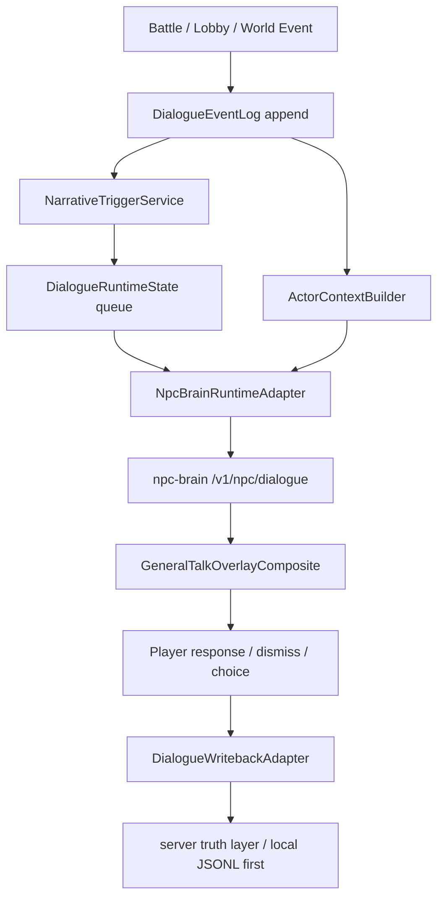

<!-- doc_id: doc_other_0079 -->
# 3KLife 人物對話與劇情 Runtime 技術規劃

> 狀態：Draft / implementation seed  
> 建立日期：2026-05-07  
> 目的：把 LingChat 的「原子台詞 / 事件日誌」與「角色視角記憶投影」概念，轉化為符合 3KLife Cocos + 三國大腦中台架構的可落地方案。

## 1. 結論

3KLife 可以借鑑 LingChat 的 append-only 原子台詞與角色視角記憶概念，但不應搬它的 FastAPI + Vue + 桌寵產品殼。

3KLife 目前已經有三個成熟基礎：

- Cocos 端 UCUF / CompositePanel / UIManager orchestration。
- `server/npc-brain/` 三國大腦中台，已能提供 grounded NPC dialogue API。
- `ServiceLoader.npcDialogue` Cocos facade，已能從 UI 呼叫 npc-brain。

真正缺的不是「怎麼再做一個聊天功能」，而是中間那層可跨場景運作的 `DialogueRuntime / NarrativeRuntime`：它負責接收遊戲事件、寫入 append-only 互動日誌、從 npc-brain 取得 grounded 台詞、排程武將發話 UI，並把玩家與武將互動結果回寫 server-side truth layer。

Unity 對照：這層相當於一個全局 `Dialogue/Narrative Subsystem`，不是某個 Canvas prefab 或 MonoBehaviour 面板。UI 只是 view，NPC brain 是 reasoning/data service，Runtime 才是遊戲內事件與對話的協調器。

## 2. 現有進度盤點

### 2.1 Cocos 端

現有可直接利用：

- `assets/scripts/core/services/NpcDialogueService.ts`：已封裝 `GET /v1/npc/keyword-options` 與 `POST /v1/npc/dialogue`。
- `assets/scripts/core/managers/ServiceLoader.ts`：已把 `NpcDialogueService` 暴露為 `services().npcDialogue`。
- `assets/scripts/core/systems/EventSystem.ts`：全局事件匯流排，支援 `on / off / emit / once / onBind`。
- `assets/scripts/core/managers/UIManager.ts`：六層式 UI 管理器，已支援 `Game / UI / PopUp / Dialog / System / Notify` 行為語義。
- `assets/scripts/core/config/UIConfig.ts`：UIID 與 LayerType 設定入口。
- `assets/scripts/ui/components/GeneralListComposite.ts`：已有 NPC dialogue dev toolbar，可手動點武將、選 keyword / speechContext / model preset 並測一句台詞。
- `assets/scripts/ui/components/GeneralQuickViewComposite.ts`、`GeneralPortraitComposite.ts`、`ToastMessage.ts`：可作為跨場景發話 UI 的視覺與生命週期參考。
- `assets/scripts/battle/views/BattleUIBridge.ts` 與 `assets/scripts/shared/interfaces/IBattleUIBridge.ts`：已建立戰鬥與 UI 的 Bridge pattern，可作為 NarrativeRuntime 接 Battle event 的參考。

目前缺口：

- `GeneralListComposite` 的 NPC dialogue 是 dev toolbar，不是正式 runtime。
- 還沒有獨立 `DialogueRuntimeState` 儲存目前場景 scope、在場武將、對話佇列、最近事件。
- 還沒有 append-only `DialogueEventLog` 作為玩家-武將互動與戰報回放的 canonical trail。
- 還沒有跨場景 `GeneralTalkOverlayComposite` 讓任何場景都能浮出武將說話。
- 還沒有把 battle / lobby / world event 轉成 narrative trigger 的服務。

### 2.2 npc-brain 端

現有可直接利用：

- `server/npc-brain/app/main.py`：已有 `/healthz`、`/v1/npc/context-options`、`/v1/npc/keyword-options`、`/v1/npc/dialogue`。
- `server/npc-brain/app/npc_dialogue_service.py`：已整合 persona / keyword / context / evidence / provider fallback / history cache。
- `server/npc-brain/app/llm_dialogue_renderer.py`：已具備 Gemini / local llama / history cache / deterministic fallback 等 provider chain。
- `server/npc-brain/README.md`：已明確定位 pipeline 與 runtime 分工。
- `server/npc-brain/文件/資料契約與 Cocos 串接.md`：已規定前端只負責選擇，不負責推理；provider trace / quality warnings 不應丟掉。
- `server/npc-brain/文件/向量檢索與資料入庫.md`：已定義 player-memory、interaction-memory、world-events 等 namespace 的方向。

目前缺口：

- SQLite-vec 在 `server/npc-brain/app/vector_store.py` 仍是 stub，不可把它當成已完成的本地記憶層。
- `NPC_LLM_HISTORY_CACHE_PATH` 是 fallback / 開發期成功台詞 cache，不是 canonical memory。
- 還沒有正式 `/v1/npc/interaction-events` 或等價 ingest API 讓 Cocos 回寫玩家-武將互動事件。
- 還沒有「世界事件 + 玩家行為 + 武將互動」的 runtime decision API。

## 3. LingChat 對照

### 3.1 可照抄概念

1. **Append-only 原子日誌**  
   LingChat 把對話拆成台詞表，而不是把 prompt 當真相。3KLife 應更進一步，把玩家行為、戰鬥事件、世界事件、NPC 發話、系統旁白都當成事件寫入 `DialogueEventLog`。

2. **角色視角投影**  
   同一份事件日誌可以按角色投影成不同上下文。張飛不應知道所有後台事件，只能知道自己在場、被告知、或可從戰報得知的內容。

3. **在場角色感知列表**  
   LingChat 的 `present_roles / perceived_role_ids` 概念可轉成 3KLife 的 `visibleToGeneralIds / addresseeIds / scope.visibility`。

4. **Chapter + Event Handler**  
   LingChat 的 chapter/event handler 可以轉成 TypeScript 宣告式 Narrative Event Graph。3KLife 不應把劇情流程寫死在 Cocos Component。

5. **UI 不組 prompt**  
   UI 只傳 generalId、context、keywords、speechContextMode；evidence 選擇與 provider fallback 留給 npc-brain。

### 3.2 需要優化 LingChat 的地方

1. 3KLife 的事件 schema 從一開始就要保留 `sourceRefs`、`evidenceRefs`、`scope`、`visibility`、`writebackStatus`。
2. 不採用單一 `user_id=1` 類臨時設計，至少保留 `playerId / saveId / seasonId / runId` 欄位。
3. `history_cache` 只能當 fallback，不可當 canonical memory。
4. Battle 場景第一版必須非阻塞，武將短句不能卡住戰鬥節奏。
5. 不搬 LingChat 原始碼，避免 AGPL 授權與架構耦合風險。

## 4. 目標架構



### 4.1 `DialogueEventLog`

定位：append-only canonical interaction trail。

第一期建議在 Cocos 端新增：

- `assets/scripts/core/dialogue/DialogueEventTypes.ts`
- `assets/scripts/core/dialogue/DialogueEventLog.ts`

最小事件型別：

```ts
export type DialogueEventKind =
    | 'player_action'
    | 'world_event'
    | 'battle_event'
    | 'npc_utterance'
    | 'system_narration'
    | 'player_reply';

export interface DialogueEventRecord {
    eventId: string;
    kind: DialogueEventKind;
    createdAt: string;
    playerId?: string;
    saveId?: string;
    sceneScope: 'lobby' | 'battle' | 'world' | 'general-detail' | 'unknown';
    speakerGeneralId?: string;
    actorGeneralIds: string[];
    addresseeGeneralIds: string[];
    visibleToGeneralIds: string[];
    sourceRefs: string[];
    evidenceRefs: string[];
    payload: Record<string, unknown>;
    projectionHints?: Record<string, unknown>;
    writebackStatus?: 'local-only' | 'pending' | 'synced' | 'failed';
}
```

第一期不要直接依賴 SQLite；先用記憶體 + debug JSONL dump 驗證資料模型。server-side storage 第二期再接。

### 4.2 `DialogueRuntimeState`

定位：遊戲內對話 runtime 容器，不屬於 UI。

建議新增：

- `assets/scripts/core/dialogue/DialogueRuntimeState.ts`

職責：

- 記錄目前 `sceneScope`。
- 維護 `presentGeneralIds`。
- 維護待播 `DialogueLineQueue`。
- 儲存最近一次 npc-brain `providerTrace / qualityWarnings / repairUsed`。
- 管理 cooldown、priority、blocking policy。

### 4.3 `ActorContextBuilder`

定位：從事件日誌投影出角色視角上下文。

建議新增：

- `assets/scripts/core/dialogue/ActorContextBuilder.ts`

投影規則：

- 角色是 speaker 時可見。
- 角色在 `visibleToGeneralIds` 時可見。
- 角色在同一 scene scope 且事件標記為 public 時可見。
- evidence 與 sourceRefs 不進 UI 組 prompt，只作為 npc-brain request context / debug trace。

### 4.4 `NpcBrainRuntimeAdapter`

定位：把 runtime event context 轉成現有 npc-brain request。

建議新增：

- `assets/scripts/core/dialogue/NpcBrainRuntimeAdapter.ts`

它應包裝現有 `services().npcDialogue.requestDialogue()`，而不是在各 UI component 重複打 HTTP。

最小 API：

```ts
export interface NarrativeDialogueRequest {
    generalId: string;
    sceneScope: string;
    triggerKind: DialogueEventKind;
    contextKey?: string;
    selectedKeywordKeys?: string[];
    speechContextMode?: 'life_chat' | 'encounter_speech' | 'inner_monologue' | 'meeting_statement';
    maxChars?: number;
}

export interface NarrativeDialogueLine {
    generalId: string;
    text: string;
    evidenceRefs: string[];
    usedEvidenceRefs: string[];
    provider?: string | null;
    model?: string | null;
    providerTrace: string[];
    qualityWarnings: string[];
    repairUsed: boolean;
    fallbackUsed: boolean;
}
```

### 4.5 `NarrativeTriggerService`

定位：從 gameplay event 中挑出應該主動發話的時機。

建議新增：

- `assets/scripts/core/dialogue/NarrativeTriggerService.ts`

它可以從 `services().event` 訂閱：

- Lobby 進入 / 晨報 / 任務結果。
- Battle 回合開始、主將受傷、技能施放、戰鬥結束。
- World event、派遣結果、離線互動摘要。

第一版規則：

- Lobby 優先，不先做 Battle。
- 同一武將短時間內只觸發一次。
- 若 UI 已有 Dialog 層阻塞，對話排入 queue，不搶焦點。
- npc-brain 不可用時，顯示 deterministic fallback 或跳過，不讓 UI 崩潰。

### 4.6 `GeneralTalkOverlayComposite`

定位：跨場景人物發話 UI。

建議新增：

- `assets/scripts/ui/components/GeneralTalkOverlayComposite.ts`
- `assets/resources/ui-spec/screens/general-talk-overlay-screen.json`
- `assets/resources/ui-spec/layouts/general-talk-overlay-main.json`
- `assets/resources/ui-spec/skins/general-talk-overlay-default.json`

UI 原則：

- 不復用 `ToastMessage` 作正式人物對話。Toast 是短提示，不適合承接 portrait、speaker、evidence trace、玩家選項。
- 可參考 `GeneralPortraitComposite` 的立繪載入與淡入生命週期。
- 可參考 `GeneralQuickViewComposite` 的小卡彈出行為。
- 第一版可無語音，但 `DialogueEventRecord.payload.audioCue / voiceAssetRef` 可先保留 optional 欄位。

建議 state：

```ts
export interface GeneralTalkOverlayState {
    generalId: string;
    speakerName: string;
    portraitPath?: string;
    lineText: string;
    sceneScope: string;
    evidenceRefs: string[];
    providerTrace?: string[];
    qualityWarnings?: string[];
    actions?: Array<{ actionId: string; label: string }>;
    autoHideSec?: number;
}
```

UI layer 建議：

- 第一版可放 `LayerType.Notify`，非阻塞浮出。
- 若後續要玩家選項，可改成 `LayerType.PopUp` 或新增更明確的 overlay policy。

## 5. Server-side writeback 規劃

第一期 Cocos 只做 local event log，不直接寫 SQLite。

第二期 npc-brain 可新增：

- `POST /v1/npc/interaction-events`
- `GET /v1/npc/interaction-events?generalId=<id>`

ingest 欄位應對齊 `DialogueEventRecord`，server 端負責：

- 寫入 JSONL 或 SQLite / PostgreSQL JSONB。
- 為高價值事件建立 vector-ready record。
- 分流到 `player-memory`、`interaction-memory`、`world-events` namespace。

長期原則仍照 npc-brain 文件：vector DB 只負責召回，不是 canonical truth。

## 6. 分階段落地

### Phase 0：文件與任務切分

輸出：

- 本技術規劃文件。
- 後續任務卡切分：core runtime、overlay UI、npc-brain adapter、writeback API、QA smoke。

### Phase 1：Cocos runtime 型別與本地事件日誌

新增：

- `DialogueEventTypes.ts`
- `DialogueEventLog.ts`
- `DialogueRuntimeState.ts`
- `ActorContextBuilder.ts`

驗收：

- 可 append / query / project events。
- 可用 unit tests 驗證 visibleToGeneralIds 投影。
- 不依賴 server，不碰 UI。

### Phase 2：跨場景人物發話 UI

新增：

- `GeneralTalkOverlayComposite.ts`
- 對應 UCUF screen/layout/skin。
- `UIID.GeneralTalkOverlay`。

驗收：

- Lobby 可手動呼叫 overlay 顯示張飛一句話。
- 可 auto-hide / dismiss。
- 場景切換時可 dispose，不留 tween / event listener。

### Phase 3：NpcBrainRuntimeAdapter

新增：

- `NpcBrainRuntimeAdapter.ts`

驗收：

- 可把 `NarrativeDialogueRequest` 轉成現有 `/v1/npc/dialogue` request。
- 保留 `providerTrace / qualityWarnings / repairUsed / fallbackUsed`。
- npc-brain 不可用時，不讓 overlay 崩潰。

### Phase 4：NarrativeTriggerService

新增：

- `NarrativeTriggerService.ts`
- ServiceLoader 初始化接線。

驗收：

- Lobby 進入或任務結果可觸發一則武將短句。
- 支援 cooldown / priority / queue。
- Battle event 只先寫入 log，不急著主動插話。

### Phase 5：server writeback

新增：

- npc-brain interaction ingest API。
- 本地 JSONL 或 SQLite store。

驗收：

- Cocos 可回寫玩家-武將互動事件。
- smoke test 可驗證 append / readback。
- 事件可轉成 vector-ready record，但不要求第一版上傳向量庫。

### Phase 6：劇情事件引擎

新增：

- Narrative chapter schema。
- Event handler registry。
- Choice / narration / talk / trigger battle / grant reward 等 handler。

驗收：

- 可用本地 JSON 跑一段短劇情。
- UI 只吃 state，不直接操控劇情流程。

## 7. 第一版 MVP

第一版先做 Lobby，不先做 Battle。

流程：

1. 進入 Lobby。
2. `NarrativeTriggerService` append 一筆 `world_event` 或 `player_action`。
3. 選定一名可用武將，例如張飛。
4. `NpcBrainRuntimeAdapter` 呼叫 `/v1/npc/dialogue`。
5. 成功後 append `npc_utterance`。
6. `GeneralTalkOverlayComposite` 浮出武將短句。
7. dismiss 或 auto-hide 後 append `player_reply` 或 `dismiss` 類事件。

這條 MVP 能快速驗證：ETL/RAG artifact -> npc-brain dialogue -> Cocos runtime -> 跨場景 UI -> event log。

## 8. 驗證計畫

### 8.1 Cocos / TypeScript

- 新增 unit tests：
  - `DialogueEventLog.append()`。
  - `DialogueEventLog.queryByGeneral()`。
  - `ActorContextBuilder.projectForGeneral()`。
  - `NarrativeTriggerService` cooldown / queue ordering。

- 執行 Cocos asset refresh：

```powershell
curl.exe http://localhost:7456/asset-db/refresh
```

### 8.2 npc-brain

執行現有 smoke：

```bash
cd server/npc-brain
python -m app.http_smoke_test
python -m app.cocos_flow_smoke_test
```

### 8.3 UI spec

新增 overlay screen/layout/skin 後，跑現有 UI spec 驗證工具。

### 8.4 Preview route

新增 LoadingScene preview target 或 Lobby smoke route，至少覆蓋：

- npc-brain 未啟動。
- deterministic fallback。
- server 正常回傳。
- UI auto-hide / dismiss。

## 9. 重要決策

- 事件日誌是 canonical interaction trail；prompt/context 是投影，不反過來存 prompt 當真相。
- Cocos 端只做 trigger、呈現與互動回報，不自行選 evidence 或改 persona。
- npc-brain 仍是生成、檢索與決策端。
- 對話 UI 走新 overlay，不復用 Toast 作正式人物對話。
- 第一版先 Lobby，再 Battle。
- 第一版先無語音，但 schema 預留 voice 欄位。
- 不直接搬 LingChat 原始碼，只吸收概念。

## 10. 建議任務卡切分

1. `NPCD-0-0001`：DialogueEvent schema 與本地 append-only log。
2. `NPCD-0-0002`：ActorContextBuilder 與角色視角投影 tests。
3. `NPCD-0-0003`：GeneralTalkOverlay UCUF screen / layout / skin / Composite。
4. `NPCD-0-0004`：NpcBrainRuntimeAdapter 與 Lobby smoke route。
5. `NPCD-0-0005`：NarrativeTriggerService 第一版 Lobby 主動發話。
6. `NPCD-0-0006`：npc-brain interaction-events ingest API 草案。
7. `NPCD-0-0007`：Narrative Event Graph schema 草案。

## 11. 待確認問題

1. `GeneralTalkOverlay` 的 layer 要先用 `Notify`，還是直接走 `PopUp`？
2. 第一版主動發話是否只允許玩家已擁有武將，還是三國大腦可推薦世界事件中的未擁有武將？
3. `playerId / saveId / seasonId` 的正式來源目前是否已在資料層存在？若尚未存在，第一期需以 optional 欄位保留。
4. Interaction writeback 第一版要 JSONL 還是直接 SQLite？以目前 `sqlite_vec` stub 狀態，建議先 JSONL。
5. Battle 場景第一版是否完全禁用主動插話，只寫 log？建議是。
