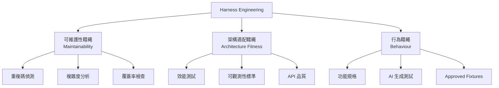
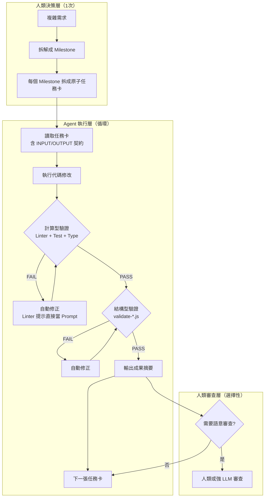

<!-- doc_id: doc_other_0027 -->
# Harness Engineering 深度分析與 3KLife 專案對照

> 來源：[Martin Fowler - Harness Engineering for Coding Agent Users](https://martinfowler.com/articles/harness-engineering.html) (2026-04-02)
> 分析日期：2026-05-04

---

## 一、文章核心摘要

### 1.1 什麼是 Harness（韁繩）？

**Harness = AI Agent 中除了模型本身以外的一切**。在 Coding Agent 場景下，它分為：

- **內建韁繩 (Inner Harness)**：Agent 產品自帶的系統提示詞、程式碼檢索機制、編排系統。
- **外部韁繩 (Outer Harness)**：**由使用者建構的**，針對自己專案的引導規則、感測器與自我修正迴圈。

> [!IMPORTANT]
> 核心觀點：好的外部韁繩能 (1) 提高 Agent 第一次就做對的機率，(2) 讓 Agent 在人眼看到之前就自我修正問題。結果是減少人工審查的勞動、提升系統品質、減少浪費的 tokens。

### 1.2 兩大控制類型：Feedforward（前饋）vs Feedback（回饋）

| 類型 | 中文 | 時機 | 作用 |
|------|------|------|------|
| **Guides（引導）** | 前饋控制 | Agent 行動**之前** | 預判行為，事先導正方向 |
| **Sensors（感測器）** | 回饋控制 | Agent 行動**之後** | 觀測結果，讓 Agent 自我修正 |

> [!WARNING]
> 只有 Feedback 沒有 Feedforward → Agent 不斷重蹈覆轍。
> 只有 Feedforward 沒有 Feedback → Agent 永遠不知道規則有沒有生效。

### 1.3 兩種執行方式：Computational（計算型）vs Inferential（推論型）

| 執行方式 | 特性 | 範例 |
|----------|------|------|
| **Computational** | 確定性、快速、CPU 驅動 | Linter、型別檢查、結構測試、靜態分析 |
| **Inferential** | 非確定性、較慢、GPU/NPU | AI Code Review、LLM 判官、語意分析 |

> [!TIP]
> **計算型控制便宜且可靠，應該在每次變更時都跑**。推論型控制昂貴但能處理語意判斷，適合選擇性使用。

### 1.4 三大治理類別



### 1.5 Harnessability（可韁繩性）

不是每個程式庫都同樣適合被韁繩控制。強型別語言天生有型別檢查感測器；模組邊界清晰的架構才能定義架構約束規則。**Greenfield 專案可以從第一天就內建韁繩性；Legacy 專案面臨「最需要韁繩的地方最難建構」的困境。**

### 1.6 Harness Templates（韁繩模板）

企業常見的服務拓撲（API 服務、事件處理、資料儀表板）可以預先打包成**韁繩模板**：一組針對特定拓撲的引導 + 感測器套件。團隊選擇技術棧時，會開始考慮「已有哪些韁繩模板可用」。

### 1.7 人類的角色

> 韁繩是將人類開發者的隱性經驗（慣例、品味、組織記憶）外顯化與形式化的嘗試。但韁繩不應以完全排除人工為目標，而是**將人的注意力導向最有價值的地方**。

---

## 二、3KLife 專案現狀對照

### 2.1 已經做到的 ✅

根據專案掃描結果，3KLife 在 Harness Engineering 方面已有**非常扎實的基礎**：

| Harness 概念 | 專案對應 | 評級 |
|:---|:---|:---:|
| **Feedforward Guides（引導）** | | |
| 系統提示詞 / Instructions | `.github/instructions/` 共 10 份（token-guard、ucuf-compliance、ui-pipeline 等） | ⭐⭐⭐⭐ |
| Skills 定義 | `.github/skills/` 共 29 個 Skill（涵蓋 UI、資料管線、品質檢核等） | ⭐⭐⭐⭐⭐ |
| Agent 角色定義 | `.github/agents/` 有 sanguo-term-researcher 等專職 Agent | ⭐⭐ |
| 任務卡系統 | `docs/agent-briefs/tasks/` 共 142 張任務卡 | ⭐⭐⭐⭐⭐ |
| 共識文件 | `keep.md` + 4 個分片 + `keep.summary.md` | ⭐⭐⭐⭐⭐ |
| Context Budget 管控 | `check-context-budget.js` + `agent-context-budget.md` | ⭐⭐⭐⭐⭐ |
| **Feedback Sensors（感測器）** | | |
| 編碼完整性檢查 | `check-encoding-touched.js` / `check-encoding-integrity.js` | ⭐⭐⭐⭐ |
| UI 規格驗證 | `validate-ui-specs.js` (68KB！) / `validate-skin-contracts.js` 等 | ⭐⭐⭐⭐⭐ |
| 資料完整性驗證 | `validate-generals-data.js` / `validate-bloodline-integrity.js` 等 | ⭐⭐⭐⭐ |
| 截圖回歸測試 | `ucuf-screenshot-regression.js` / `headless-snapshot-test.js` | ⭐⭐⭐ |
| UI Runtime 檢查 | `ucuf-runtime-check.js` / `check-ui-runtime-state-registry.js` | ⭐⭐⭐⭐ |
| 文件整合掃描 | `consolidation-scanner.js` / `consolidation-doubt-mcq.js` (36KB！) | ⭐⭐⭐⭐⭐ |
| **Steering Loop（轉向迴圈）** | | |
| 文件代號系統 | `doc-id-registry.js` / `doc-id-registry.json` | ⭐⭐⭐⭐ |
| 交叉索引 | `rebuild-crossref.js` / `cross-ref/` 分片 | ⭐⭐⭐⭐ |
| 任務鎖定與協作 | `task-lock.js` / `agent-collaboration-protocol.md` | ⭐⭐⭐ |
| Git Hooks | `install-git-hooks.js` / `.github/hooks/` | ⭐⭐ |
| **Harnessability（可韁繩性）** | | |
| 強型別 (TypeScript) | 整個專案 42,881 行 TS | ⭐⭐⭐⭐ |
| 模組化架構 | battle/ui/core/shared/tools 五大模組 | ⭐⭐⭐⭐ |
| JSON 資料驅動 | 武將/技能/UI 配置全 JSON 化 | ⭐⭐⭐⭐⭐ |

### 2.2 尚未做到或薄弱的 ❌

| Harness 概念 | 缺口分析 | 影響 |
|:---|:---|:---:|
| **Computational Sensor：自動化測試** | 目前 `run-tests.js` 僅 330 bytes（幾乎空殼），無正式單元測試套件 | 🔴 嚴重 |
| **Computational Sensor：Linter** | 無 ESLint / TSLint 配置，依賴 Agent 記憶而非工具強制 | 🔴 嚴重 |
| **Computational Sensor：型別檢查 CI** | 無 `tsc --noEmit` 定期驗證，型別錯誤只能靠 Agent 或 IDE 抓 | 🟡 中等 |
| **Architecture Fitness：效能基線** | 無 FPS/記憶體/載入時間的基線與自動偵測 | 🟡 中等 |
| **Architecture Fitness：模組邊界守衛** | 無 dependency-cruiser 或 import 限制規則防止模組交叉耦合 | 🟡 中等 |
| **Behaviour Harness：Approved Fixtures** | 無「人類審核過的預期輸出」與自動比對機制 | 🟡 中等 |
| **Inferential Sensor：AI Code Review** | 無 post-commit 的 AI 審查步驟（如 Danger.js + LLM） | 🟠 低 |
| **Continuous Drift：Dead Code 偵測** | `scan-deprecated-refs.js` 存在但未形成定期排程 | 🟡 中等 |
| **Workflow：CI/CD Pipeline** | `ucuf-validation.yml` 存在但 pipeline 完整度不足 | 🟡 中等 |
| **Harness Template：新功能模板** | 無「新增系統功能時應該一併產生哪些韁繩」的標準化模板 | 🟡 中等 |

---

## 三、實踐規劃：小模型友善的任務拆解框架

> **核心思路**：將文章的「計算優先、推論輔助」原則，轉化為 3KLife 可直接使用的工作流。
> **目標**：讓即使是 1.5B 的小型 LLM，也能透過一連串確定性的計算步驟，穩定完成複雜功能。

### 3.1 設計哲學：瀑布拆解 → 原子任務 → 計算驗證



### 3.2 具體工具規劃

#### 工具 1：`task-decomposer.js` — 任務原子化拆解器

**用途**：將一個大型功能需求（如「實作虎符部署系統」），自動拆解成一系列有順序依賴的原子任務卡。

```
node tools_node/task-decomposer.js \
  --feature "虎符部署系統" \
  --spec "docs/遊戲規格文件/系統規格書/兵種（虎符）系統.md" \
  --output-dir "docs/agent-briefs/tasks/"
```

**產出**：
```
SYS-TALLY-DEPLOY-0001.md  →  定義 TypeScript 介面 (Interface)
SYS-TALLY-DEPLOY-0002.md  →  實作資料讀取層
SYS-TALLY-DEPLOY-0003.md  →  實作業務邏輯層
SYS-TALLY-DEPLOY-0004.md  →  實作 UI 綁定層
SYS-TALLY-DEPLOY-0005.md  →  撰寫單元測試
```

每張卡片內建：
- `INPUT_CONTRACT`：此任務需要哪些檔案/介面已存在
- `OUTPUT_CONTRACT`：此任務完成後產出哪些檔案/介面
- `VALIDATION_CMD`：完成後跑哪條計算型驗證指令
- `ROLLBACK_CMD`：失敗時如何復原

#### 工具 2：`compute-gate.js` — 計算型閘門

**用途**：在 Agent 完成每一步後，自動執行一連串確定性驗證。不需要 LLM，純 CPU 計算。

```json
// tools_node/compute-gate-config.json
{
  "gates": [
    {
      "name": "syntax-check",
      "cmd": "npx tsc --noEmit --project tsconfig.json",
      "failAction": "returnErrorToAgent",
      "priority": 1
    },
    {
      "name": "encoding-check",
      "cmd": "node tools_node/check-encoding-touched.js",
      "failAction": "returnErrorToAgent",
      "priority": 2
    },
    {
      "name": "data-integrity",
      "cmd": "node tools_node/validate-generals-data.js",
      "failAction": "returnErrorToAgent",
      "priority": 3
    },
    {
      "name": "ui-contract",
      "cmd": "node tools_node/validate-skin-contracts.js",
      "failAction": "returnErrorToAgent",
      "priority": 4
    },
    {
      "name": "import-boundary",
      "cmd": "node tools_node/check-import-boundaries.js",
      "failAction": "warnAgent",
      "priority": 5
    }
  ]
}
```

**Agent 整合方式**：Skill 內的 `post-action` 自動呼叫 `compute-gate.js`，失敗訊息直接當作下一輪 prompt 的一部分（即文章所說的「正向 Prompt Injection」）。

#### 工具 3：`check-import-boundaries.js` — 模組邊界守衛 (新增)

**用途**：防止 `ui/` 模組直接引用 `battle/` 內部實作、或 `shared/` 反向依賴 `core/`。

```javascript
// 規則定義
const BOUNDARY_RULES = {
  'assets/scripts/shared/': { 
    canImport: [],  // shared 不可引用任何其他模組
    description: '共用層不可依賴任何業務模組'
  },
  'assets/scripts/ui/': { 
    canImport: ['shared/', 'core/'],
    description: 'UI 只可引用 shared 和 core'
  },
  'assets/scripts/battle/': { 
    canImport: ['shared/', 'core/'],
    description: 'Battle 只可引用 shared 和 core'
  },
  'assets/scripts/core/': { 
    canImport: ['shared/'],
    description: 'Core 只可引用 shared'
  }
};
```

#### 工具 4：`approved-fixture-check.js` — 行為快照比對 (新增)

**用途**：文章中提到的 `Approved Fixtures` 模式。將「人類審核過的預期輸出」存成 JSON，之後每次跑都自動比對。

```
fixtures/
├── battle-deploy/
│   ├── case-01-normal-deploy.input.json
│   ├── case-01-normal-deploy.expected.json    ← 人類審核過
│   ├── case-02-food-shortage.input.json
│   └── case-02-food-shortage.expected.json    ← 人類審核過
└── nurture/
    ├── case-01-graduation.input.json
    └── case-01-graduation.expected.json
```

#### 工具 5：`harness-health-report.js` — 韁繩健康報告 (新增)

**用途**：定期掃描整個專案的韁繩覆蓋狀況，類似「測試覆蓋率」但針對韁繩。

```
$ node tools_node/harness-health-report.js

╔══════════════════════════════════════════════════════╗
║           3KLife Harness Health Report               ║
╠══════════════════════════════════════════════════════╣
║ Feedforward Guides                                   ║
║   Instructions:    10/10  ████████████████████ 100%  ║
║   Skills:          29/29  ████████████████████ 100%  ║
║   Task Cards:     142     ████████████████████       ║
║                                                      ║
║ Computational Sensors                                ║
║   Type Checking:   ✅ tsconfig exists                ║
║   Linter:          ❌ no .eslintrc                   ║
║   Unit Tests:      ❌ 0 test files                   ║
║   Data Validators: ✅ 14 validators                  ║
║   Import Guard:    ❌ not configured                 ║
║                                                      ║
║ Behaviour Harness                                    ║
║   Approved Fixtures: ❌ 0 fixtures                   ║
║   Screenshot Regr.:  ✅ configured                   ║
║                                                      ║
║ Overall Score: 62/100                                ║
╚══════════════════════════════════════════════════════╝
```

### 3.3 工作流程整合：Skill 內建閘門模式

改造現有 Skill，使每個 Skill 自帶「前饋 + 後饋」閉環：

```markdown
<!-- .github/skills/battle-feature-dev/skill.md -->
## Skill: Battle Feature Development

### Pre-flight (Feedforward)
1. 讀取 `keep.summary.md`
2. 讀取目標系統的母規格書（由任務卡指定）
3. 讀取 `compute-gate-config.json` 確認驗證指令
4. 讀取 `check-import-boundaries.js` 的模組規則

### Execution
- 依任務卡的 `INPUT_CONTRACT` 確認前置條件
- 執行修改
- 跑 `compute-gate.js` —— 不需 LLM，純計算
- 若失敗：將錯誤訊息當 prompt 自動修正（最多 3 輪）

### Post-flight (Feedback)
- 跑 `approved-fixture-check.js`（如果有 fixture）
- 更新任務卡狀態
- 輸出 `handoff-summary.md` 給下一個 Agent
```

### 3.4 為什麼這對小模型有效？

| 傳統做法（依賴大模型） | 本方案（計算優先） |
|:---|:---|
| 讓 LLM 判斷「這段 import 是否違反架構」 | `check-import-boundaries.js` 用 AST 直接判定 |
| 讓 LLM 判斷「JSON 格式是否正確」 | `validate-generals-data.js` 用 JSON Schema 驗證 |
| 讓 LLM 判斷「UI 元件尺寸是否符合規格」 | `validate-ui-specs.js` 用數值比對 |
| 讓 LLM 判斷「型別是否正確」 | `tsc --noEmit` 直接告訴你哪行有錯 |
| 讓 LLM 判斷「這個功能是否正確」 | `approved-fixture-check.js` 用預設答案比對 |

**結果**：小模型只需要做「讀任務卡 → 寫代碼 → 讀錯誤訊息 → 修代碼」的簡單迴圈，所有判斷都由確定性工具承擔。

### 3.5 實施優先順序

| 優先級 | 工具 | 預估工期 | 效益 |
|:---:|:---|:---:|:---|
| P0 | `compute-gate.js` + `tsc --noEmit` 整合 | 1 天 | 消滅 90% 的型別錯誤回溯 |
| P0 | ESLint 基礎設定（禁裸 console.log 等） | 0.5 天 | 編碼規範確定性執行 |
| P1 | `check-import-boundaries.js` | 1 天 | 防止模組間交叉耦合 |
| P1 | `task-decomposer.js` | 2 天 | 自動化任務卡生成 |
| P2 | `approved-fixture-check.js` | 1.5 天 | 行為驗證自動化 |
| P2 | `harness-health-report.js` | 1 天 | 韁繩覆蓋率可視化 |
| P3 | Skill 內建閘門模式改造 | 2 天 | 29 個 Skill 統一閘門 |

---

## 四、結論

### 3KLife 已經做對的事情

專案在 **Feedforward 層面領先同類專案**：29 個 Skill、10 份 Instructions、142 張任務卡、doc-id 系統與分片機制——這些都是文章中描述的「引導」典範。`consolidation-doubt-mcq.js` (36KB) 甚至已經實現了「用計算工具解決規格衝突」的思路，這在業界極為少見。

### 最大的缺口

**計算型回饋感測器 (Computational Feedback Sensors)** 嚴重不足。沒有自動化測試套件、沒有 Linter、沒有型別檢查 CI、沒有模組邊界守衛。目前的品質保障幾乎完全依賴 Agent 的「推論能力」——這恰恰是文章警告的反模式。

### 一句話行動指南

> **把你目前讓 LLM 做的「判斷」，能用腳本做的就用腳本做。LLM 只負責「寫新東西」和「讀懂人話」。**
